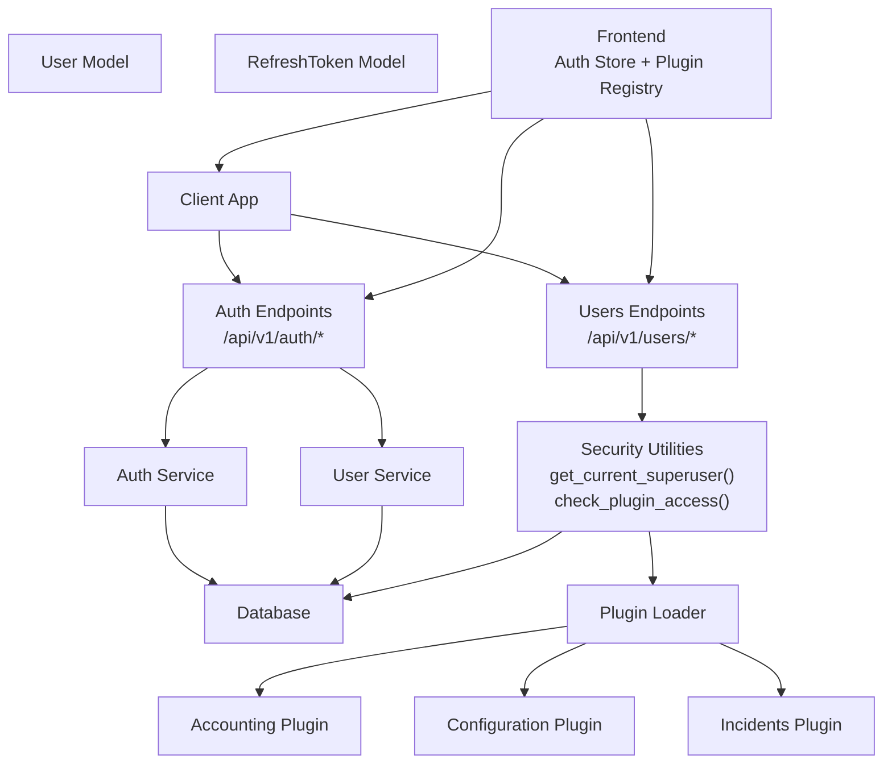
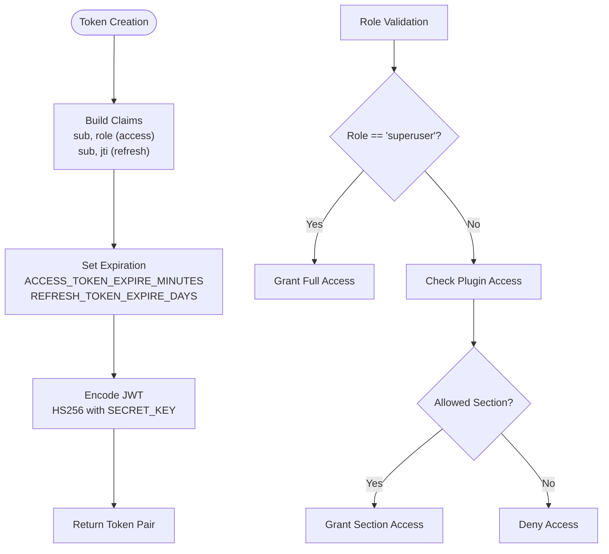
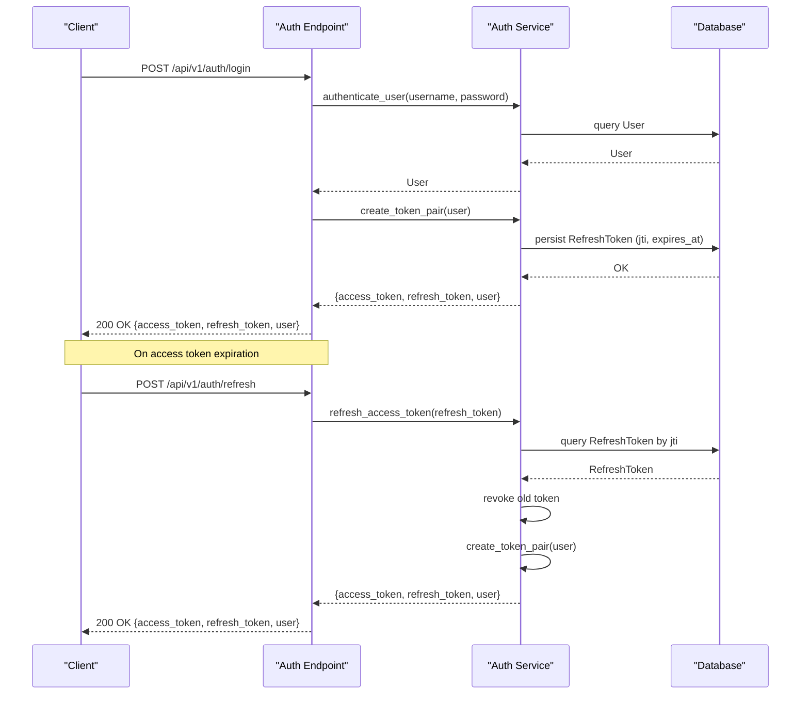
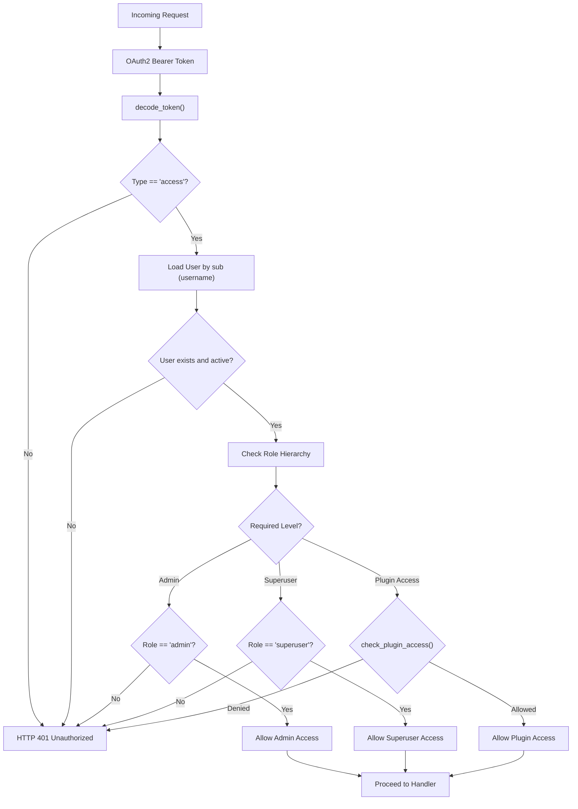
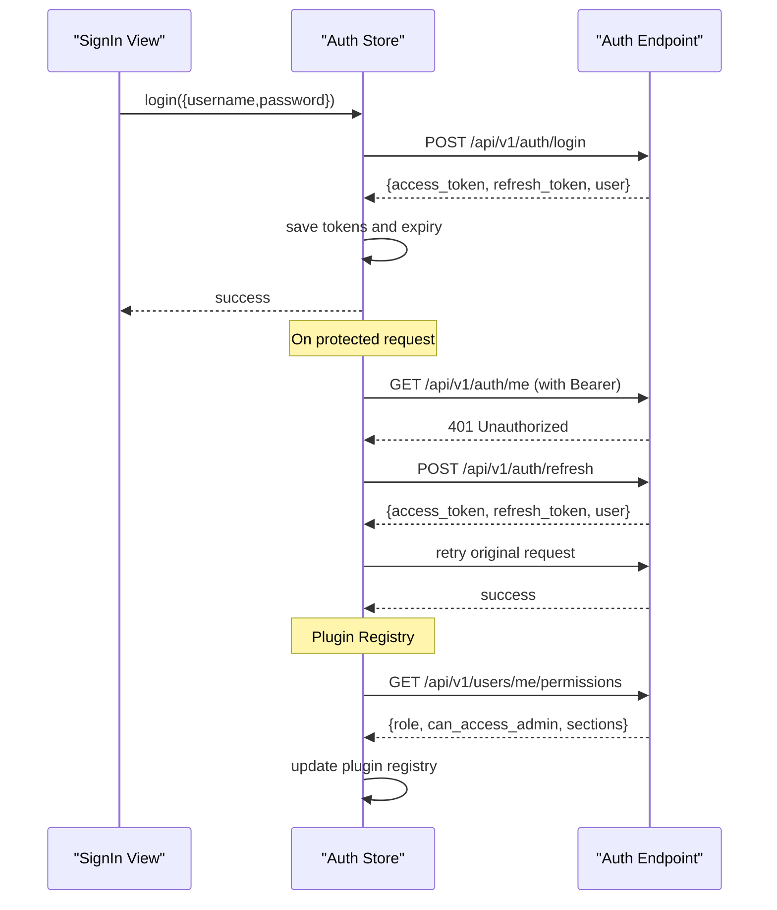
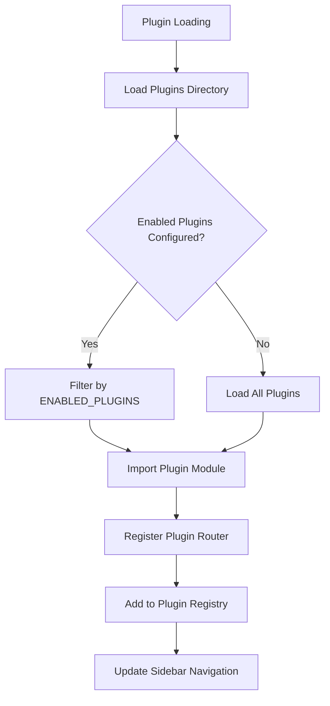
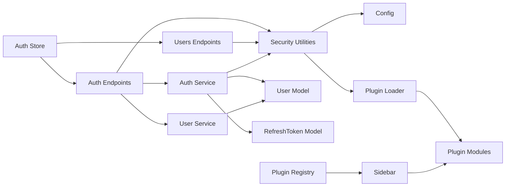

# Authentication & Authorization System

<cite>
**Referenced Files in This Document**
- [backend/app/core/security.py](file://backend/app/core/security.py)
- [backend/app/core/config.py](file://backend/app/core/config.py)
- [backend/app/core/database.py](file://backend/app/core/database.py)
- [backend/app/models/user.py](file://backend/app/models/user.py)
- [backend/app/models/refresh_token.py](file://backend/app/models/refresh_token.py)
- [backend/app/schemas/auth.py](file://backend/app/schemas/auth.py)
- [backend/app/schemas/user.py](file://backend/app/schemas/user.py)
- [backend/app/schemas/common.py](file://backend/app/schemas/common.py)
- [backend/app/services/auth_service.py](file://backend/app/services/auth_service.py)
- [backend/app/services/user_service.py](file://backend/app/services/user_service.py)
- [backend/app/api/v1/endpoints/auth.py](file://backend/app/api/v1/endpoints/auth.py)
- [backend/app/api/v1/endpoints/users.py](file://backend/app/api/v1/endpoints/users.py)
- [backend/app/api/v1/router.py](file://backend/app/api/v1/router.py)
- [backend/app/core/plugin_loader.py](file://backend/app/core/plugin_loader.py)
- [backend/app/plugins/accounting/plugin.py](file://backend/app/plugins/accounting/plugin.py)
- [backend/app/plugins/configuration/plugin.py](file://backend/app/plugins/configuration/plugin.py)
- [backend/app/plugins/incidents/plugin.py](file://backend/app/plugins/incidents/plugin.py)
- [backend/app/plugins/accounting/endpoints.py](file://backend/app/plugins/accounting/endpoints.py)
- [backend/app/plugins/configuration/endpoints.py](file://backend/app/plugins/configuration/endpoints.py)
- [backend/app/plugins/incidents/endpoints.py](file://backend/app/plugins/incidents/endpoints.py)
- [backend/app/main.py](file://backend/app/main.py)
- [frontend/src/stores/auth.js](file://frontend/src/stores/auth.js)
- [frontend/src/stores/pluginRegistry.js](file://frontend/src/stores/pluginRegistry.js)
- [frontend/src/components/layout/Sidebar.vue](file://frontend/src/components/layout/Sidebar.vue)
- [frontend/src/views/auth/SignIn.vue](file://frontend/src/views/auth/SignIn.vue)
- [frontend/src/views/auth/SignUp.vue](file://frontend/src/views/auth/SignUp.vue)
- [frontend/src/main.js](file://frontend/src/main.js)
- [frontend/src/router/index.js](file://frontend/src/router/index.js)
</cite>

## Update Summary
**Changes Made**
- Added new superuser role validation with get_current_superuser() function
- Implemented plugin access controls with check_plugin_access() function
- Enhanced role-based navigation with section-based access control
- Added new user permissions endpoint for role-based access inspection
- Updated security layer with comprehensive role hierarchy support
- Enhanced frontend with plugin registry and section-based navigation
- Added plugin-specific access control for different user roles

## Table of Contents
1. [Introduction](#introduction)
2. [Project Structure](#project-structure)
3. [Core Components](#core-components)
4. [Architecture Overview](#architecture-overview)
5. [Detailed Component Analysis](#detailed-component-analysis)
6. [Dependency Analysis](#dependency-analysis)
7. [Performance Considerations](#performance-considerations)
8. [Troubleshooting Guide](#troubleshooting-guide)
9. [Conclusion](#conclusion)
10. [Appendices](#appendices)

## Introduction
This document describes the JWT-based authentication and authorization system implemented in the backend and integrated with the frontend. It covers JWT token creation and validation, refresh token rotation, user roles and permissions, password hashing with bcrypt, and security best practices. The system now includes enhanced authentication with superuser role validation, plugin access controls, and improved role-based navigation. The document also documents the complete authentication flow from login to token refresh, endpoint specifications, request/response schemas, error handling, and the relationships among the authentication service, user models, and security utilities. Practical examples and security considerations for both backend and frontend implementations are included.

## Project Structure
The authentication system spans several backend modules and integrates with the frontend via a Pinia store and Vue components:
- Backend core: security utilities, configuration, database initialization
- Backend models: user and refresh token persistence
- Backend schemas: request/response models for authentication
- Backend services: authentication and user management logic
- Backend API: authentication endpoints
- Plugin system: modular plugin architecture with access controls
- Frontend: authentication store, plugin registry, and navigation components

```mermaid
graph TB
subgraph "Backend"
CFG["Config<br/>Security constants"]
SEC["Security Utilities<br/>JWT encode/decode, bcrypt, OAuth2 scheme<br/>get_current_superuser(), check_plugin_access()"]
DB["Database<br/>Engine, Session, Base"]
MDL_USER["User Model"]
MDL_RT["RefreshToken Model"]
SCH_AUTH["Auth Schemas"]
SCH_USER["User Schemas"]
SVC_AUTH["Auth Service"]
SVC_USER["User Service"]
API_AUTH["Auth Endpoints"]
API_USERS["Users Endpoints<br/>Permissions, Plugin Access"]
API_ROUTER["API Router"]
PLUGIN_LOADER["Plugin Loader<br/>Dynamic plugin loading"]
MAIN["Main App"]
end
subgraph "Plugins"
PLUG_ACCOUNTING["Accounting Plugin"]
PLUG_CONFIGURATION["Configuration Plugin"]
PLUG_INCIDENTS["Incidents Plugin"]
end
subgraph "Frontend"
FE_STORE["Auth Store<br/>Pinia"]
FE_PLUGIN_REGISTRY["Plugin Registry<br/>Pinia"]
FE_SIDEBAR["Sidebar Navigation<br/>Section-based access"]
FE_VIEW["Sign-In View<br/>Vue"]
FE_SIGNUP["Sign-Up View<br/>Vue"]
end
CFG --> SEC
SEC --> API_AUTH
SEC --> API_USERS
DB --> API_AUTH
DB --> SVC_AUTH
DB --> SVC_USER
MDL_USER --> SVC_AUTH
MDL_RT --> SVC_AUTH
SCH_AUTH --> API_AUTH
SCH_USER --> API_AUTH
SVC_AUTH --> API_AUTH
SVC_USER --> API_AUTH
API_ROUTER --> API_AUTH
API_ROUTER --> API_USERS
PLUGIN_LOADER --> PLUG_ACCOUNTING
PLUGIN_LOADER --> PLUG_CONFIGURATION
PLUGIN_LOADER --> PLUG_INCIDENTS
MAIN --> API_ROUTER
FE_STORE --> FE_VIEW
FE_STORE --> FE_SIGNUP
FE_PLUGIN_REGISTRY --> FE_SIDEBAR
FE_STORE --> API_AUTH
FE_STORE --> API_USERS
```



**Diagram sources**
- [backend/app/core/config.py:1-51](file://backend/app/core/config.py#L1-L51)
- [backend/app/core/security.py:1-134](file://backend/app/core/security.py#L1-L134)
- [backend/app/core/database.py:1-18](file://backend/app/core/database.py#L1-L18)
- [backend/app/models/user.py:1-35](file://backend/app/models/user.py#L1-L35)
- [backend/app/models/refresh_token.py:1-18](file://backend/app/models/refresh_token.py#L1-L18)
- [backend/app/schemas/auth.py:1-26](file://backend/app/schemas/auth.py#L1-L26)
- [backend/app/schemas/user.py:1-33](file://backend/app/schemas/user.py#L1-L33)
- [backend/app/services/auth_service.py:1-139](file://backend/app/services/auth_service.py#L1-L139)
- [backend/app/services/user_service.py:1-69](file://backend/app/services/user_service.py#L1-L69)
- [backend/app/api/v1/endpoints/auth.py:1-106](file://backend/app/api/v1/endpoints/auth.py#L1-L106)
- [backend/app/api/v1/endpoints/users.py:1-40](file://backend/app/api/v1/endpoints/users.py#L1-L40)
- [backend/app/api/v1/router.py:1-10](file://backend/app/api/v1/router.py#L1-L10)
- [backend/app/core/plugin_loader.py:1-100](file://backend/app/core/plugin_loader.py#L1-L100)
- [backend/app/plugins/accounting/plugin.py:1-17](file://backend/app/plugins/accounting/plugin.py#L1-L17)
- [backend/app/plugins/configuration/plugin.py:1-17](file://backend/app/plugins/configuration/plugin.py#L1-L17)
- [backend/app/plugins/incidents/plugin.py:1-17](file://backend/app/plugins/incidents/plugin.py#L1-L17)
- [frontend/src/stores/auth.js:1-198](file://frontend/src/stores/auth.js#L1-L198)
- [frontend/src/stores/pluginRegistry.js:1-53](file://frontend/src/stores/pluginRegistry.js#L1-L53)
- [frontend/src/components/layout/Sidebar.vue:1-277](file://frontend/src/components/layout/Sidebar.vue#L1-L277)

**Section sources**
- [backend/app/main.py:17-48](file://backend/app/main.py#L17-L48)
- [backend/app/api/v1/router.py:1-10](file://backend/app/api/v1/router.py#L1-L10)

## Core Components
- Security utilities: JWT encoding/decoding, bcrypt password hashing/verification, OAuth2 bearer scheme, current user resolution, role-based access checks, superuser validation, plugin access controls
- Models: User and RefreshToken tables with relationships
- Schemas: Request/response models for login, token pair, refresh, logout, and user
- Services: Authentication service (token pair creation, refresh with rotation, revocation, cleanup), user service (CRUD and password hashing)
- API endpoints: Login, refresh, register, logout, whoami, admin init, user permissions, plugin access checks
- Plugin system: Dynamic plugin loading with access control integration
- Frontend store: Authentication state, token lifecycle, protected fetch wrapper, plugin registry, section-based navigation

Key implementation references:
- JWT and bcrypt utilities: [backend/app/core/security.py:16-58](file://backend/app/core/security.py#L16-L58)
- Access/refresh token creation: [backend/app/core/security.py:31-48](file://backend/app/core/security.py#L31-L48)
- Current user and role checks: [backend/app/core/security.py:61-98](file://backend/app/core/security.py#L61-L98)
- Superuser validation: [backend/app/core/security.py:101-110](file://backend/app/core/security.py#L101-L110)
- Plugin access controls: [backend/app/core/security.py:113-133](file://backend/app/core/security.py#L113-L133)
- Token pair creation and DB persistence: [backend/app/services/auth_service.py:19-42](file://backend/app/services/auth_service.py#L19-L42)
- Refresh token rotation and revocation: [backend/app/services/auth_service.py:45-74](file://backend/app/services/auth_service.py#L45-L74)
- User model with role and refresh tokens: [backend/app/models/user.py:7-34](file://backend/app/models/user.py#L7-L34)
- Refresh token model: [backend/app/models/refresh_token.py:7-17](file://backend/app/models/refresh_token.py#L7-L17)
- Auth schemas: [backend/app/schemas/auth.py:5-25](file://backend/app/schemas/auth.py#L5-L25)
- User schemas: [backend/app/schemas/user.py:6-32](file://backend/app/schemas/user.py#L6-L32)
- Auth endpoints: [backend/app/api/v1/endpoints/auth.py:20-105](file://backend/app/api/v1/endpoints/auth.py#L20-L105)
- User permissions endpoint: [backend/app/api/v1/endpoints/users.py:15-24](file://backend/app/api/v1/endpoints/users.py#L15-L24)
- Plugin access check endpoint: [backend/app/api/v1/endpoints/users.py:27-38](file://backend/app/api/v1/endpoints/users.py#L27-L38)
- Frontend auth store: [frontend/src/stores/auth.js:29-177](file://frontend/src/stores/auth.js#L29-L177)
- Plugin registry: [frontend/src/stores/pluginRegistry.js:1-53](file://frontend/src/stores/pluginRegistry.js#L1-L53)
- Section-based navigation: [frontend/src/components/layout/Sidebar.vue:29-45](file://frontend/src/components/layout/Sidebar.vue#L29-L45)

**Section sources**
- [backend/app/core/security.py:16-133](file://backend/app/core/security.py#L16-L133)
- [backend/app/models/user.py:7-34](file://backend/app/models/user.py#L7-L34)
- [backend/app/models/refresh_token.py:7-17](file://backend/app/models/refresh_token.py#L7-L17)
- [backend/app/schemas/auth.py:5-25](file://backend/app/schemas/auth.py#L5-L25)
- [backend/app/schemas/user.py:6-32](file://backend/app/schemas/user.py#L6-L32)
- [backend/app/services/auth_service.py:19-139](file://backend/app/services/auth_service.py#L19-L139)
- [backend/app/api/v1/endpoints/auth.py:20-105](file://backend/app/api/v1/endpoints/auth.py#L20-L105)
- [backend/app/api/v1/endpoints/users.py:15-38](file://backend/app/api/v1/endpoints/users.py#L15-L38)
- [frontend/src/stores/auth.js:29-177](file://frontend/src/stores/auth.js#L29-L177)
- [frontend/src/stores/pluginRegistry.js:1-53](file://frontend/src/stores/pluginRegistry.js#L1-L53)
- [frontend/src/components/layout/Sidebar.vue:29-45](file://frontend/src/components/layout/Sidebar.vue#L29-L45)

## Architecture Overview
The system follows a layered architecture with enhanced role-based access control and plugin integration:
- Presentation layer: FastAPI endpoints under /api/v1/auth and /api/v1/users for authentication and user management
- Service layer: Business logic for authentication and user management with plugin access control
- Persistence layer: SQLAlchemy models for User and RefreshToken
- Security utilities: JWT and bcrypt helpers, OAuth2 bearer scheme, role hierarchy validation, plugin access controls
- Plugin system: Dynamic plugin loading with section-based access control
- Frontend integration: Pinia store manages tokens, plugin registry, and section-based navigation



**Diagram sources**
- [backend/app/api/v1/endpoints/auth.py:1-106](file://backend/app/api/v1/endpoints/auth.py#L1-L106)
- [backend/app/api/v1/endpoints/users.py:1-40](file://backend/app/api/v1/endpoints/users.py#L1-L40)
- [backend/app/services/auth_service.py:1-139](file://backend/app/services/auth_service.py#L1-L139)
- [backend/app/services/user_service.py:1-69](file://backend/app/services/user_service.py#L1-L69)
- [backend/app/core/security.py:1-134](file://backend/app/core/security.py#L1-L134)
- [backend/app/models/user.py:1-35](file://backend/app/models/user.py#L1-L35)
- [backend/app/models/refresh_token.py:1-18](file://backend/app/models/refresh_token.py#L1-L18)
- [backend/app/core/plugin_loader.py:1-100](file://backend/app/core/plugin_loader.py#L1-L100)
- [frontend/src/stores/auth.js:1-198](file://frontend/src/stores/auth.js#L1-L198)
- [frontend/src/stores/pluginRegistry.js:1-53](file://frontend/src/stores/pluginRegistry.js#L1-L53)

## Detailed Component Analysis

### Enhanced JWT and Password Security Utilities
- Password hashing and verification use bcrypt with salt generation and UTF-8 encoding
- JWT encoding/decoding with HS256 algorithm and configurable secret key
- OAuth2 password bearer scheme pointing to the login endpoint
- Access token carries subject (username) and role; refresh token carries subject and JTI (unique token identifier)
- Token decoding validates algorithm and type ("access" vs "refresh")
- **New** Superuser validation with get_current_superuser() function for elevated access
- **New** Plugin access control with check_plugin_access() function for section-based permissions



**Diagram sources**
- [backend/app/core/security.py:31-48](file://backend/app/core/security.py#L31-L48)
- [backend/app/core/security.py:101-110](file://backend/app/core/security.py#L101-L110)
- [backend/app/core/security.py:113-133](file://backend/app/core/security.py#L113-L133)
- [backend/app/core/config.py:9-13](file://backend/app/core/config.py#L9-L13)

**Section sources**
- [backend/app/core/security.py:16-58](file://backend/app/core/security.py#L16-L58)
- [backend/app/core/security.py:101-133](file://backend/app/core/security.py#L101-L133)
- [backend/app/core/config.py:9-13](file://backend/app/core/config.py#L9-L13)

### User and Refresh Token Models
- User model includes username, email, full name, hashed password, role, activity status, timestamps, and a relationship to refresh tokens
- RefreshToken model includes unique token (JTI), user foreign key, expiration, revoked flag, and timestamps
- Relationship ensures cascading deletion when a user is removed
- **Enhanced** Role field supports 'user' and 'superuser' hierarchies for access control

```mermaid
erDiagram
USERS {
integer id PK
string username UK
string email UK
string full_name
string hashed_password
string role ENUM('user','superuser')
boolean is_active
timestamp created_at
timestamp updated_at
}
REFRESH_TOKENS {
integer id PK
string token UK
integer user_id FK
timestamp expires_at
boolean revoked
timestamp created_at
}
USERS ||--o{ REFRESH_TOKENS : "has many"
```

**Diagram sources**
- [backend/app/models/user.py:7-34](file://backend/app/models/user.py#L7-L34)
- [backend/app/models/refresh_token.py:7-17](file://backend/app/models/refresh_token.py#L7-L17)

**Section sources**
- [backend/app/models/user.py:7-34](file://backend/app/models/user.py#L7-L34)
- [backend/app/models/refresh_token.py:7-17](file://backend/app/models/refresh_token.py#L7-L17)

### Authentication Service: Token Pair, Rotation, Revocation
- Creates a token pair with a fresh JTI stored as the refresh token's unique value
- Stores refresh token metadata with expiration and marks revoked=false
- Refresh flow decodes refresh token, validates JTI and user, checks expiration, revokes old token, and issues a new pair
- Supports revocation by JTI or full token and bulk revocation per user
- Periodic cleanup removes expired refresh tokens



**Diagram sources**
- [backend/app/api/v1/endpoints/auth.py:20-51](file://backend/app/api/v1/endpoints/auth.py#L20-L51)
- [backend/app/services/auth_service.py:19-74](file://backend/app/services/auth_service.py#L19-L74)
- [backend/app/models/refresh_token.py:7-17](file://backend/app/models/refresh_token.py#L7-L17)

**Section sources**
- [backend/app/services/auth_service.py:19-101](file://backend/app/services/auth_service.py#L19-L101)
- [backend/app/api/v1/endpoints/auth.py:20-51](file://backend/app/api/v1/endpoints/auth.py#L20-L51)

### Enhanced Role-Based Access Control and Protected Routes
- Current user resolution validates access token and loads the user from the database
- Active user check prevents disabled accounts from accessing protected resources
- Admin-only decorator enforces administrative privileges
- **New** Superuser validation with get_current_superuser() for elevated access
- **New** Plugin access control with check_plugin_access() for section-based permissions
- Endpoints decorated with these dependencies enforce authorization policies



**Diagram sources**
- [backend/app/core/security.py:61-98](file://backend/app/core/security.py#L61-L98)
- [backend/app/core/security.py:101-110](file://backend/app/core/security.py#L101-L110)
- [backend/app/core/security.py:113-133](file://backend/app/core/security.py#L113-L133)

**Section sources**
- [backend/app/core/security.py:61-133](file://backend/app/core/security.py#L61-L133)

### Enhanced Frontend Authentication Store and Usage
- Maintains access token, refresh token, and expiry timestamp in localStorage
- Provides login, register, logout, whoami, and protected fetch wrapper
- Automatically refreshes access tokens when encountering 401 Unauthorized
- Computes authentication state and role-based capabilities
- **New** Plugin registry for dynamic plugin management
- **New** Section-based navigation with role-aware visibility



**Diagram sources**
- [frontend/src/stores/auth.js:29-177](file://frontend/src/stores/auth.js#L29-L177)
- [frontend/src/stores/pluginRegistry.js:1-53](file://frontend/src/stores/pluginRegistry.js#L1-L53)
- [frontend/src/views/auth/SignIn.vue:25-38](file://frontend/src/views/auth/SignIn.vue#L25-L38)

**Section sources**
- [frontend/src/stores/auth.js:29-177](file://frontend/src/stores/auth.js#L29-L177)
- [frontend/src/stores/pluginRegistry.js:1-53](file://frontend/src/stores/pluginRegistry.js#L1-L53)
- [frontend/src/views/auth/SignIn.vue:25-38](file://frontend/src/views/auth/SignIn.vue#L25-L38)

### Plugin System Integration
- Dynamic plugin loading with ENABLED_PLUGINS configuration
- Plugin access control integrated with user roles
- Section-based navigation with role-aware visibility
- Menu item registration with section categorization



**Diagram sources**
- [backend/app/core/plugin_loader.py:25-99](file://backend/app/core/plugin_loader.py#L25-L99)
- [frontend/src/stores/pluginRegistry.js:26-36](file://frontend/src/stores/pluginRegistry.js#L26-L36)
- [frontend/src/components/layout/Sidebar.vue:78-114](file://frontend/src/components/layout/Sidebar.vue#L78-L114)

**Section sources**
- [backend/app/core/plugin_loader.py:25-99](file://backend/app/core/plugin_loader.py#L25-L99)
- [frontend/src/stores/pluginRegistry.js:26-36](file://frontend/src/stores/pluginRegistry.js#L26-L36)
- [frontend/src/components/layout/Sidebar.vue:78-114](file://frontend/src/components/layout/Sidebar.vue#L78-L114)

## Dependency Analysis
- Endpoints depend on services and schemas; services depend on models and security utilities; models depend on database base
- Security utilities depend on configuration for algorithm, secret key, and token durations
- Frontend depends on backend endpoints for authentication operations
- **New** Plugin system depends on security utilities for access control
- **New** Frontend plugin registry depends on backend plugin manifests



**Diagram sources**
- [backend/app/api/v1/endpoints/auth.py:1-106](file://backend/app/api/v1/endpoints/auth.py#L1-L106)
- [backend/app/api/v1/endpoints/users.py:1-40](file://backend/app/api/v1/endpoints/users.py#L1-L40)
- [backend/app/services/auth_service.py:1-139](file://backend/app/services/auth_service.py#L1-L139)
- [backend/app/services/user_service.py:1-69](file://backend/app/services/user_service.py#L1-L69)
- [backend/app/core/security.py:1-134](file://backend/app/core/security.py#L1-L134)
- [backend/app/core/config.py:1-51](file://backend/app/core/config.py#L1-L51)
- [backend/app/core/plugin_loader.py:1-100](file://backend/app/core/plugin_loader.py#L1-L100)
- [frontend/src/stores/auth.js:1-198](file://frontend/src/stores/auth.js#L1-L198)
- [frontend/src/stores/pluginRegistry.js:1-53](file://frontend/src/stores/pluginRegistry.js#L1-L53)

**Section sources**
- [backend/app/api/v1/endpoints/auth.py:1-106](file://backend/app/api/v1/endpoints/auth.py#L1-L106)
- [backend/app/api/v1/endpoints/users.py:1-40](file://backend/app/api/v1/endpoints/users.py#L1-L40)
- [backend/app/services/auth_service.py:1-139](file://backend/app/services/auth_service.py#L1-L139)
- [backend/app/core/security.py:1-134](file://backend/app/core/security.py#L1-L134)
- [backend/app/core/config.py:1-51](file://backend/app/core/config.py#L1-L51)
- [backend/app/core/plugin_loader.py:1-100](file://backend/app/core/plugin_loader.py#L1-L100)
- [frontend/src/stores/auth.js:1-198](file://frontend/src/stores/auth.js#L1-L198)
- [frontend/src/stores/pluginRegistry.js:1-53](file://frontend/src/stores/pluginRegistry.js#L1-L53)

## Performance Considerations
- Token expiration windows: Access tokens are short-lived; refresh tokens are long-lived but tracked in the database for rotation and revocation
- Database queries: Token refresh requires a single lookup by JTI; revocation updates a single record; cleanup deletes expired records periodically
- Password hashing: bcrypt cost is implicit in salt generation; avoid excessive re-hashing during registration
- Frontend caching: Store tokens in secure storage and avoid unnecessary re-authentication by leveraging refresh automatically
- **New** Plugin access control: Role-based access checks are performed server-side with minimal overhead
- **New** Section-based navigation: Frontend computes visible sections based on user role for efficient UI rendering

## Troubleshooting Guide
Common issues and resolutions:
- Invalid or expired refresh token: Returned when JTI is missing, user not found, token revoked, or expired; client should log out and re-authenticate
- Disabled user: Login rejects inactive users; enable the account or contact an administrator
- Credentials validation failure: Incorrect username or password; ensure proper encoding and credentials
- 401 Unauthorized after initial login: Indicates access token expired; the frontend automatically attempts refresh; if refresh fails, prompt login again
- CORS errors: Verify allowed origins in configuration match the frontend origin
- **New** Superuser access denied: Returned when attempting superuser-only operations with insufficient privileges
- **New** Plugin access denied: Returned when user role lacks permission for specific plugin section
- **New** Plugin loading errors: Check ENABLED_PLUGINS configuration and plugin directory structure

**Updated** Added troubleshooting guidance for superuser access and plugin access controls

**Section sources**
- [backend/app/api/v1/endpoints/auth.py:26-36](file://backend/app/api/v1/endpoints/auth.py#L26-L36)
- [backend/app/api/v1/endpoints/auth.py:45-50](file://backend/app/api/v1/endpoints/auth.py#L45-L50)
- [backend/app/services/auth_service.py:45-74](file://backend/app/services/auth_service.py#L45-L74)
- [backend/app/core/security.py:61-79](file://backend/app/core/security.py#L61-L79)
- [backend/app/core/security.py:101-110](file://backend/app/core/security.py#L101-L110)
- [backend/app/core/security.py:113-133](file://backend/app/core/security.py#L113-L133)
- [frontend/src/stores/auth.js:168-177](file://frontend/src/stores/auth.js#L168-L177)

## Conclusion
The system implements a robust JWT-based authentication and authorization framework with enhanced role-based access control, refresh token rotation, and plugin integration. The addition of superuser validation and plugin access controls provides fine-grained security with section-based navigation. The backend provides clear separation of concerns across endpoints, services, models, and security utilities, while the frontend integrates seamlessly with the backend through a centralized authentication store and plugin registry. The dynamic plugin system allows for extensible functionality with built-in access control. Adhering to the documented best practices and using the provided examples will ensure secure and maintainable authentication across the platform.

## Appendices

### Endpoint Specifications and Schemas
- POST /api/v1/auth/login
  - Description: Authenticate user and return access and refresh tokens along with user info
  - Request: Form-encoded OAuth2 credentials (username, password)
  - Response: TokenPairWithUser
  - Errors: 401 Unauthorized (invalid credentials), 403 Forbidden (inactive user)

- POST /api/v1/auth/refresh
  - Description: Rotate access token using a valid refresh token
  - Request: RefreshRequest (refresh_token)
  - Response: TokenPairWithUser
  - Errors: 401 Unauthorized (invalid/expired refresh token)

- POST /api/v1/auth/register
  - Description: Register a new user (authenticated users only)
  - Request: UserCreate
  - Response: UserResponse
  - Errors: 400 Bad Request (duplicate username/email), 401 Unauthorized (authentication required)

- POST /api/v1/auth/logout
  - Description: Revoke the refresh token
  - Request: LogoutRequest (refresh_token)
  - Response: StatusResponse
  - Errors: None (best-effort revocation)

- GET /api/v1/auth/me
  - Description: Get current user info
  - Response: UserResponse
  - Errors: 401 Unauthorized, 403 Forbidden (inactive/admin checks)

- POST /api/v1/auth/init
  - Description: Initialize default admin if none exists
  - Response: StatusResponse

- **New** GET /api/v1/users/me/permissions
  - Description: Get current user's permissions and accessible sections
  - Response: UserPermissionsResponse
  - Errors: 401 Unauthorized

- **New** GET /api/v1/users/plugins/access/{section}
  - Description: Check if user has access to specific plugin section
  - Response: PluginAccessResponse
  - Errors: 401 Unauthorized

**Updated** Added new user permissions and plugin access endpoints

Schema references:
- TokenPairWithUser: [backend/app/schemas/auth.py:16-17](file://backend/app/schemas/auth.py#L16-L17)
- RefreshRequest: [backend/app/schemas/auth.py:20-21](file://backend/app/schemas/auth.py#L20-L21)
- LogoutRequest: [backend/app/schemas/auth.py:24-25](file://backend/app/schemas/auth.py#L24-L25)
- UserCreate/UserResponse: [backend/app/schemas/user.py:6-32](file://backend/app/schemas/user.py#L6-L32)
- StatusResponse: [backend/app/schemas/common.py:5-7](file://backend/app/schemas/common.py#L5-L7)
- UserPermissionsResponse: [backend/app/api/v1/endpoints/users.py:20-24](file://backend/app/api/v1/endpoints/users.py#L20-L24)
- PluginAccessResponse: [backend/app/api/v1/endpoints/users.py:33-38](file://backend/app/api/v1/endpoints/users.py#L33-L38)

**Section sources**
- [backend/app/api/v1/endpoints/auth.py:20-105](file://backend/app/api/v1/endpoints/auth.py#L20-L105)
- [backend/app/api/v1/endpoints/users.py:15-38](file://backend/app/api/v1/endpoints/users.py#L15-L38)
- [backend/app/schemas/auth.py:5-25](file://backend/app/schemas/auth.py#L5-L25)
- [backend/app/schemas/user.py:6-32](file://backend/app/schemas/user.py#L6-L32)
- [backend/app/schemas/common.py:5-7](file://backend/app/schemas/common.py#L5-L7)

### Security Best Practices
- Backend
  - Use HTTPS in production and configure CORS appropriately
  - Rotate refresh tokens on successful refresh and mark old ones revoked
  - Clean up expired refresh tokens regularly
  - Enforce role-based access checks for sensitive endpoints
  - Validate and sanitize all inputs; avoid exposing internal errors
  - **New** Implement superuser validation for elevated operations
  - **New** Use plugin access controls for section-based permissions
  - **New** Configure ENABLED_PLUGINS for controlled plugin deployment

- Frontend
  - Store tokens securely; avoid keeping long-lived tokens in memory
  - Implement automatic token refresh on 401 responses
  - Clear tokens on logout and redirect to login
  - Use HTTPS and secure cookies if applicable
  - **New** Implement plugin registry for dynamic plugin management
  - **New** Use section-based navigation with role-aware visibility
  - **New** Cache user permissions for efficient access control

**Updated** Added security considerations for superuser access and plugin integration

### Plugin Access Control Matrix
- **Superuser Role**: Full access to all plugin sections
  - Operations: ✅ All operations
  - Analytics: ✅ All operations  
  - Security: ✅ All operations
  - Admin: ✅ All operations
  - General: ✅ All operations

- **User Role**: Limited access based on plugin section
  - Operations: ✅ Allowed
  - Analytics: ❌ Denied
  - Security: ❌ Denied
  - Admin: ❌ Denied
  - General: ✅ Allowed (for core navigation)

**Section sources**
- [backend/app/core/security.py:113-133](file://backend/app/core/security.py#L113-L133)
- [frontend/src/components/layout/Sidebar.vue:29-45](file://frontend/src/components/layout/Sidebar.vue#L29-L45)