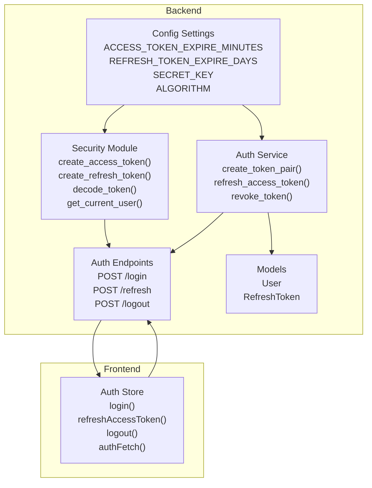
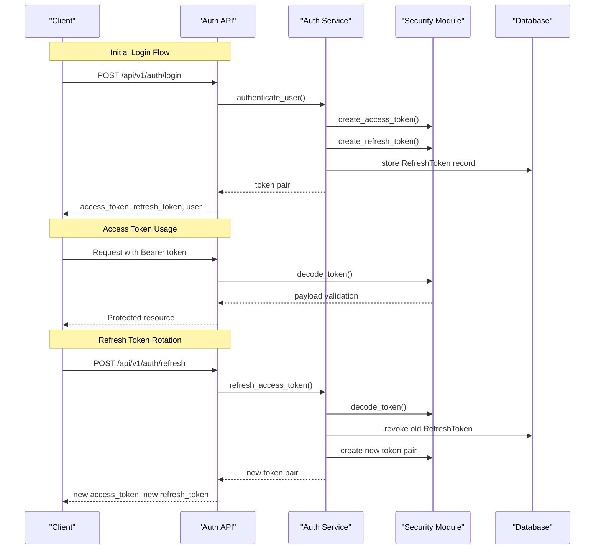
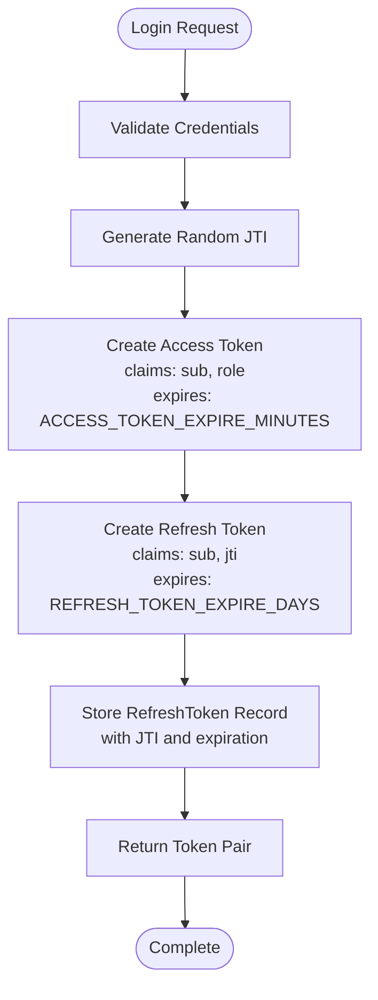
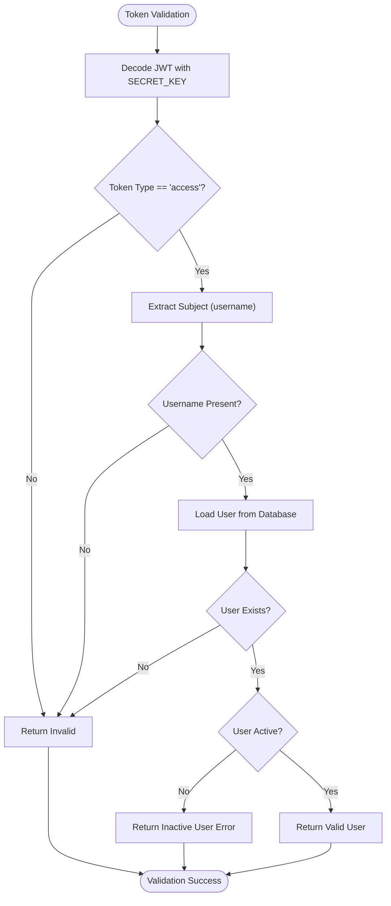
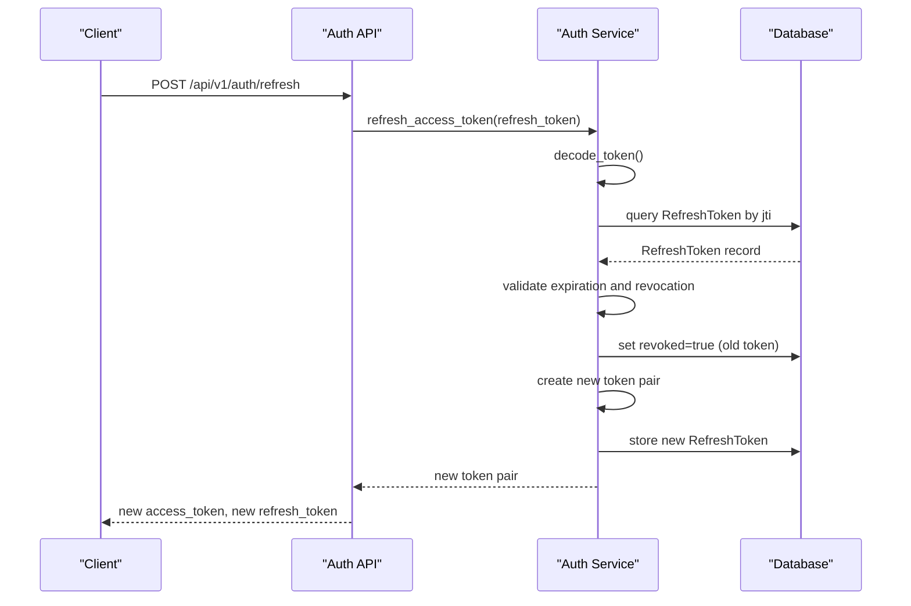
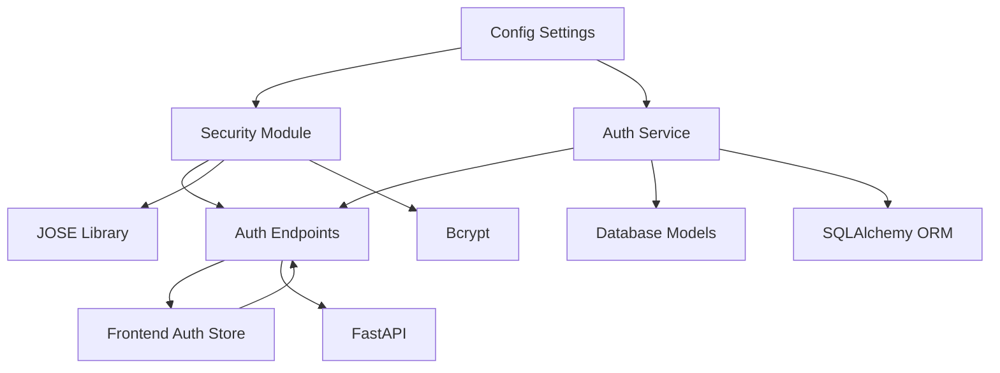

# JWT Token Implementation

<cite>
**Referenced Files in This Document**
- [security.py](file://backend/app/core/security.py)
- [auth_service.py](file://backend/app/services/auth_service.py)
- [auth.py](file://backend/app/api/v1/endpoints/auth.py)
- [config.py](file://backend/app/core/config.py)
- [refresh_token.py](file://backend/app/models/refresh_token.py)
- [user.py](file://backend/app/models/user.py)
- [auth.js](file://frontend/src/stores/auth.js)
- [main.py](file://backend/app/main.py)
</cite>

## Table of Contents
1. [Introduction](#introduction)
2. [Project Structure](#project-structure)
3. [Core Components](#core-components)
4. [Architecture Overview](#architecture-overview)
5. [Detailed Component Analysis](#detailed-component-analysis)
6. [Dependency Analysis](#dependency-analysis)
7. [Performance Considerations](#performance-considerations)
8. [Troubleshooting Guide](#troubleshooting-guide)
9. [Conclusion](#conclusion)

## Introduction
This document provides comprehensive documentation for the JWT token implementation system in the SSO project. It explains the token structure, claims, expiration handling, and security mechanisms. It documents the token creation process, validation logic, and refresh token rotation workflow. It includes examples of token payloads, header configurations, and signature verification. It details the relationship between access tokens and refresh tokens, token lifecycle management, and security best practices for token storage and transmission.

## Project Structure
The JWT implementation spans several backend modules and the frontend authentication store:
- Backend core security module handles token creation, decoding, and user validation
- Authentication service manages token pairs, refresh token rotation, and revocation
- API endpoints expose login, refresh, logout, and user info endpoints
- Database models persist refresh tokens and user relationships
- Frontend authentication store manages token storage and automatic refresh

**Diagram sources**
- [config.py:1-46](file://backend/app/core/config.py#L1-L46)
- [security.py:1-99](file://backend/app/core/security.py#L1-L99)
- [auth_service.py:1-139](file://backend/app/services/auth_service.py#L1-L139)
- [auth.py:1-106](file://backend/app/api/v1/endpoints/auth.py#L1-L106)
- [refresh_token.py:1-18](file://backend/app/models/refresh_token.py#L1-L18)
- [user.py:1-35](file://backend/app/models/user.py#L1-L35)
- [auth.js:1-198](file://frontend/src/stores/auth.js#L1-L198)

**Section sources**
- [config.py:1-46](file://backend/app/core/config.py#L1-L46)
- [security.py:1-99](file://backend/app/core/security.py#L1-L99)
- [auth_service.py:1-139](file://backend/app/services/auth_service.py#L1-L139)
- [auth.py:1-106](file://backend/app/api/v1/endpoints/auth.py#L1-L106)
- [refresh_token.py:1-18](file://backend/app/models/refresh_token.py#L1-L18)
- [user.py:1-35](file://backend/app/models/user.py#L1-L35)
- [auth.js:1-198](file://frontend/src/stores/auth.js#L1-L198)

## Core Components
The JWT implementation consists of four primary components:

### Security Module
Handles cryptographic operations and token validation:
- Password hashing and verification using bcrypt
- Access token creation with HS256 algorithm
- Refresh token creation with HS256 algorithm
- Token decoding with error handling
- Current user extraction from access tokens

### Authentication Service
Manages token lifecycle and business logic:
- Token pair creation with JTI (JWT ID) for refresh tokens
- Refresh token rotation with revocation
- Token revocation by JTI or full token
- User authentication and default admin creation
- Expired token cleanup

### API Endpoints
Expose authentication operations:
- Login endpoint returning token pair
- Refresh endpoint rotating access tokens
- Logout endpoint revoking refresh tokens
- User info endpoint with active user validation

### Database Models
Persist token state and user relationships:
- User model with role and active status
- RefreshToken model with JTI, expiration, and revocation tracking

**Section sources**
- [security.py:1-99](file://backend/app/core/security.py#L1-L99)
- [auth_service.py:1-139](file://backend/app/services/auth_service.py#L1-L139)
- [auth.py:1-106](file://backend/app/api/v1/endpoints/auth.py#L1-L106)
- [refresh_token.py:1-18](file://backend/app/models/refresh_token.py#L1-L18)
- [user.py:1-35](file://backend/app/models/user.py#L1-L35)

## Architecture Overview
The JWT system follows a layered architecture with clear separation of concerns:

**Diagram sources**
- [auth.py:20-51](file://backend/app/api/v1/endpoints/auth.py#L20-L51)
- [auth_service.py:19-74](file://backend/app/services/auth_service.py#L19-L74)
- [security.py:31-58](file://backend/app/core/security.py#L31-L58)
- [refresh_token.py:7-17](file://backend/app/models/refresh_token.py#L7-L17)

## Detailed Component Analysis

### Token Structure and Claims
Both access and refresh tokens follow the standard JWT structure with specific claims:

#### Access Token Claims
- `sub`: Subject identifier (username)
- `role`: User role for authorization
- `exp`: Expiration timestamp (UTC)
- `type`: Token type ("access")

#### Refresh Token Claims
- `sub`: Subject identifier (username)
- `jti`: JWT ID (unique random identifier)
- `exp`: Expiration timestamp (UTC)
- `type`: Token type ("refresh")

#### Token Header Configuration
- Algorithm: HS256 (HMAC SHA256)
- Type: JWT
- Content Type: application/json

**Section sources**
- [security.py:31-48](file://backend/app/core/security.py#L31-L48)
- [auth_service.py:19-42](file://backend/app/services/auth_service.py#L19-L42)

### Token Creation Process
The token creation process involves multiple steps:

**Diagram sources**
- [auth_service.py:19-42](file://backend/app/services/auth_service.py#L19-L42)
- [security.py:31-48](file://backend/app/core/security.py#L31-L48)
- [config.py:10-13](file://backend/app/core/config.py#L10-L13)

**Section sources**
- [auth_service.py:19-42](file://backend/app/services/auth_service.py#L19-L42)
- [security.py:31-48](file://backend/app/core/security.py#L31-L48)
- [config.py:10-13](file://backend/app/core/config.py#L10-L13)

### Token Validation Logic
Token validation follows a strict chain of checks:

**Diagram sources**
- [security.py:61-79](file://backend/app/core/security.py#L61-L79)

**Section sources**
- [security.py:61-79](file://backend/app/core/security.py#L61-L79)

### Refresh Token Rotation Workflow
The refresh token rotation implements a secure rotation mechanism:

**Diagram sources**
- [auth.py:40-51](file://backend/app/api/v1/endpoints/auth.py#L40-L51)
- [auth_service.py:45-74](file://backend/app/services/auth_service.py#L45-L74)
- [refresh_token.py:7-17](file://backend/app/models/refresh_token.py#L7-L17)

**Section sources**
- [auth.py:40-51](file://backend/app/api/v1/endpoints/auth.py#L40-L51)
- [auth_service.py:45-74](file://backend/app/services/auth_service.py#L45-L74)

### Token Lifecycle Management
The system manages tokens through several lifecycle stages:

#### Creation Phase
- Generate unique JTI for refresh tokens
- Create access token with short expiration
- Create refresh token with long expiration
- Store refresh token metadata in database

#### Usage Phase
- Access tokens validated on each protected request
- Automatic refresh triggered on 401 Unauthorized
- User roles enforced for authorization

#### Rotation Phase
- Old refresh token marked as revoked
- New token pair generated
- Clean up expired refresh tokens

#### Revocation Phase
- Individual token revocation by JTI
- Bulk revocation for user sessions
- Cleanup of expired tokens

**Section sources**
- [auth_service.py:77-110](file://backend/app/services/auth_service.py#L77-L110)
- [auth.py:83-90](file://backend/app/api/v1/endpoints/auth.py#L83-L90)

### Frontend Token Management
The frontend authentication store implements secure token handling:

#### Storage Strategy
- Access tokens stored in memory during session
- Refresh tokens stored in localStorage
- Token expiration tracked separately
- Automatic cleanup on logout

#### Request Interception
- All authenticated requests include Authorization header
- Automatic refresh on 401 Unauthorized responses
- Retry logic for failed requests after refresh

#### Security Measures
- Tokens never exposed in URLs
- Secure localStorage usage with expiration checks
- Automatic logout on invalidation

**Section sources**
- [auth.js:1-198](file://frontend/src/stores/auth.js#L1-L198)

## Dependency Analysis
The JWT system exhibits clear dependency relationships:

**Diagram sources**
- [config.py:1-46](file://backend/app/core/config.py#L1-L46)
- [security.py:1-11](file://backend/app/core/security.py#L1-L11)
- [auth_service.py:1-16](file://backend/app/services/auth_service.py#L1-L16)
- [auth.py:1-16](file://backend/app/api/v1/endpoints/auth.py#L1-L16)

**Section sources**
- [config.py:1-46](file://backend/app/core/config.py#L1-L46)
- [security.py:1-11](file://backend/app/core/security.py#L1-L11)
- [auth_service.py:1-16](file://backend/app/services/auth_service.py#L1-L16)
- [auth.py:1-16](file://backend/app/api/v1/endpoints/auth.py#L1-L16)

## Performance Considerations
The JWT implementation includes several performance optimizations:

### Token Expiration Strategy
- Access tokens: 15-minute expiration for frequent rotation
- Refresh tokens: 7-day expiration for reduced login frequency
- Database cleanup of expired refresh tokens

### Caching and Validation
- Minimal database queries for token validation
- In-memory user data after initial load
- Efficient bcrypt password verification

### Scalability Factors
- Stateless token validation reduces server memory usage
- Database-backed refresh token storage for scalability
- Configurable expiration times for different environments

## Troubleshooting Guide

### Common Issues and Solutions

#### Invalid Token Errors
**Symptoms**: 401 Unauthorized responses
**Causes**: 
- Expired access tokens
- Invalid refresh tokens
- Wrong secret key configuration
- Incorrect algorithm settings

**Solutions**:
- Implement automatic refresh on 401 responses
- Verify SECRET_KEY matches backend configuration
- Check ALGORITHM consistency (HS256)

#### Refresh Token Failures
**Symptoms**: Unable to refresh access tokens
**Causes**:
- Revoked refresh tokens
- Expired refresh tokens
- Database connectivity issues
- Invalid JTI values

**Solutions**:
- Implement token revocation tracking
- Check refresh token expiration
- Verify database connection and migrations

#### Authentication Problems
**Symptoms**: Login failures despite valid credentials
**Causes**:
- User inactive status
- Database user not found
- Password hash mismatch
- Database connection issues

**Solutions**:
- Verify user activation status
- Check database user records
- Validate password hashing configuration

**Section sources**
- [security.py:61-79](file://backend/app/core/security.py#L61-L79)
- [auth_service.py:113-119](file://backend/app/services/auth_service.py#L113-L119)
- [auth.py:25-37](file://backend/app/api/v1/endpoints/auth.py#L25-L37)

## Conclusion
The JWT token implementation provides a robust, secure authentication system with the following key characteristics:

### Security Features
- HS256 algorithm with configurable secret key
- Separate access and refresh token lifecycles
- Token rotation with revocation for enhanced security
- Database-backed refresh token storage
- Role-based authorization enforcement

### Operational Benefits
- Stateless authentication reducing server overhead
- Automatic token refresh reducing user friction
- Configurable expiration times for different security requirements
- Comprehensive error handling and validation

### Best Practices Implemented
- Short-lived access tokens with frequent rotation
- Long-lived refresh tokens with strict validation
- Secure token storage on frontend with expiration tracking
- Database cleanup of expired tokens
- Role-based access control

The system balances security requirements with user experience, providing a scalable foundation for enterprise authentication needs while maintaining compliance with modern security standards.