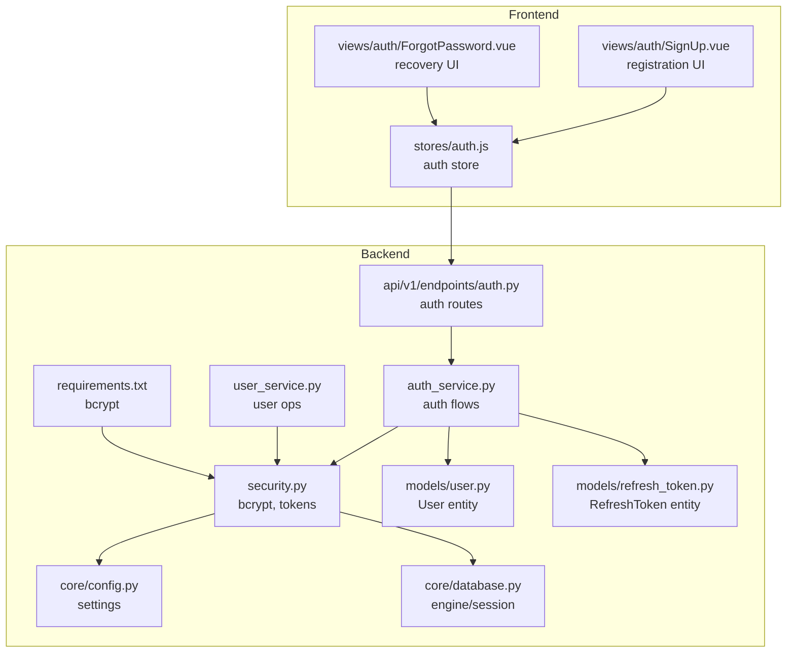
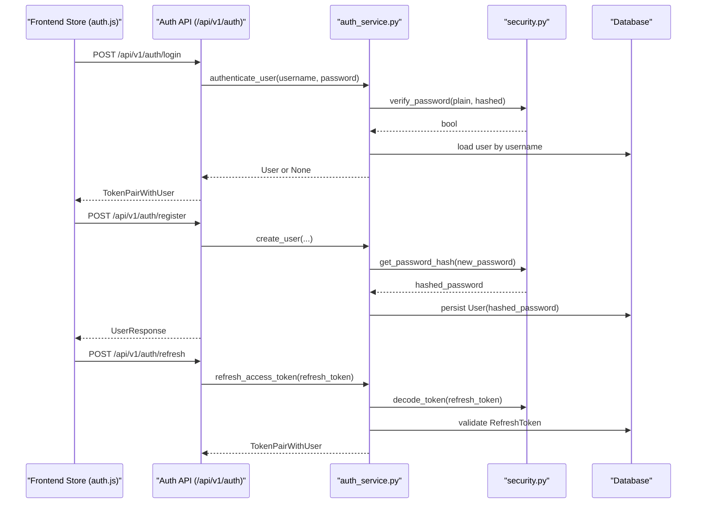
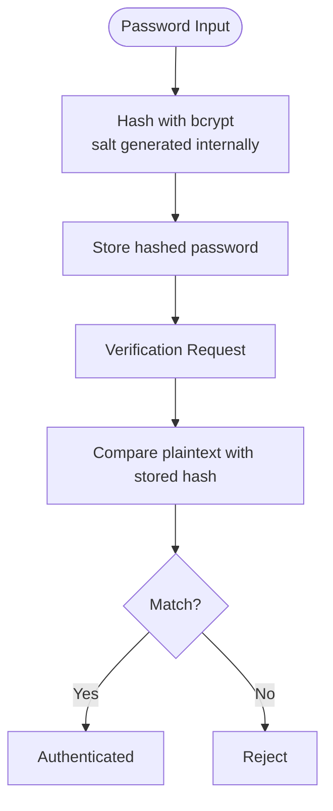
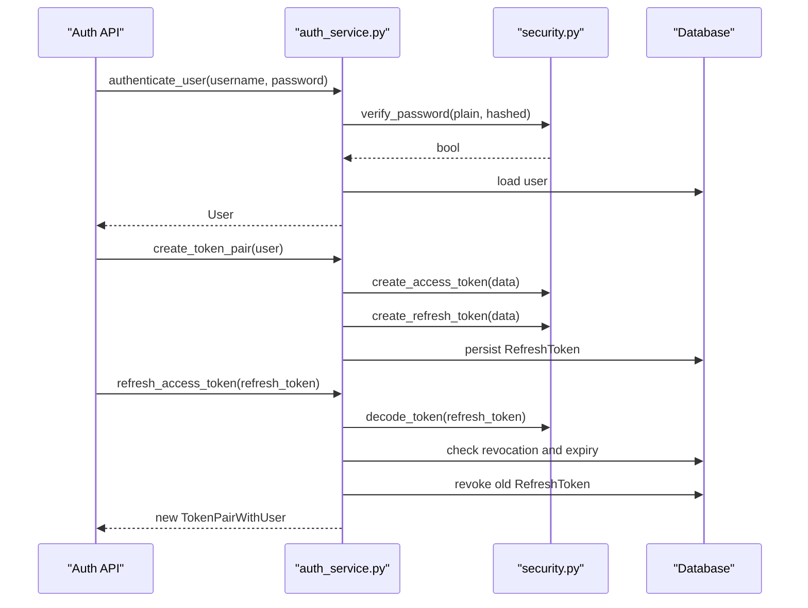
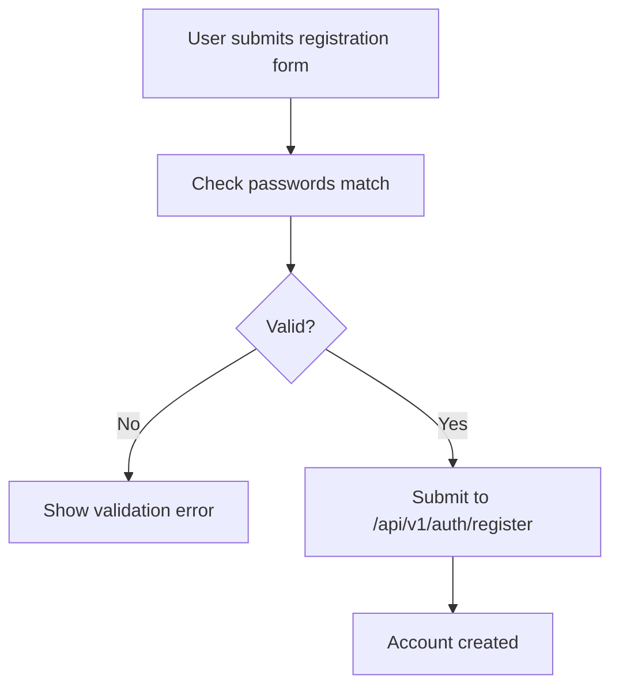
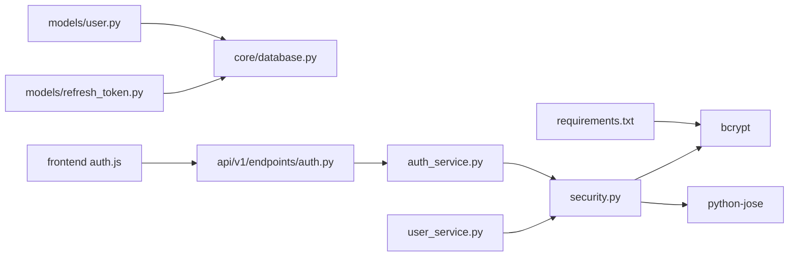
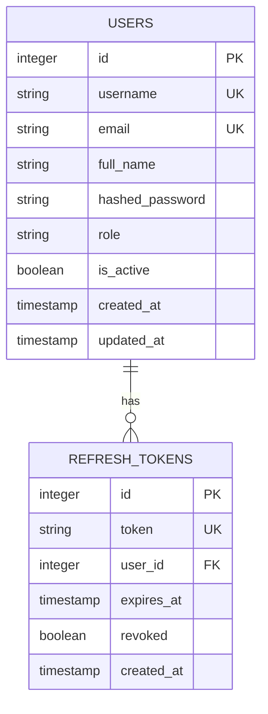

# Password Security & Hashing

<cite>
**Referenced Files in This Document**
- [security.py](file://backend/app/core/security.py)
- [auth_service.py](file://backend/app/services/auth_service.py)
- [user_service.py](file://backend/app/services/user_service.py)
- [user.py](file://backend/app/models/user.py)
- [refresh_token.py](file://backend/app/models/refresh_token.py)
- [auth.py](file://backend/app/schemas/auth.py)
- [auth.py](file://backend/app/api/v1/endpoints/auth.py)
- [config.py](file://backend/app/core/config.py)
- [database.py](file://backend/app/core/database.py)
- [requirements.txt](file://backend/requirements.txt)
- [auth.js](file://frontend/src/stores/auth.js)
- [SignUp.vue](file://frontend/src/views/auth/SignUp.vue)
- [ForgotPassword.vue](file://frontend/src/views/auth/ForgotPassword.vue)
</cite>

## Table of Contents
1. [Introduction](#introduction)
2. [Project Structure](#project-structure)
3. [Core Components](#core-components)
4. [Architecture Overview](#architecture-overview)
5. [Detailed Component Analysis](#detailed-component-analysis)
6. [Dependency Analysis](#dependency-analysis)
7. [Performance Considerations](#performance-considerations)
8. [Troubleshooting Guide](#troubleshooting-guide)
9. [Conclusion](#conclusion)
10. [Appendices](#appendices)

## Introduction
This document explains the password security and hashing mechanisms implemented in the backend and how they integrate with user authentication and token-based sessions. It covers bcrypt hashing, salt generation, secure password storage, validation rules, hashing strength configurations, and security considerations. It also documents the relationship between password hashing and authentication, including password change processes, and provides best practices for both backend and frontend implementations.

## Project Structure
The password security implementation spans several backend modules:
- Core security utilities for hashing, verification, and token management
- Services for authentication and user lifecycle operations
- Database models for users and refresh tokens
- API endpoints for login, registration, refresh, logout, and profile retrieval
- Frontend authentication store and views for sign-up and password recovery

**Diagram sources**
- [security.py:1-99](file://backend/app/core/security.py#L1-L99)
- [auth_service.py:1-139](file://backend/app/services/auth_service.py#L1-L139)
- [user_service.py:1-69](file://backend/app/services/user_service.py#L1-L69)
- [user.py:1-35](file://backend/app/models/user.py#L1-L35)
- [refresh_token.py:1-18](file://backend/app/models/refresh_token.py#L1-L18)
- [auth.py:1-106](file://backend/app/api/v1/endpoints/auth.py#L1-L106)
- [config.py:1-46](file://backend/app/core/config.py#L1-L46)
- [database.py:1-18](file://backend/app/core/database.py#L1-L18)
- [requirements.txt:1-11](file://backend/requirements.txt#L1-L11)
- [auth.js:1-198](file://frontend/src/stores/auth.js#L1-L198)
- [SignUp.vue:1-130](file://frontend/src/views/auth/SignUp.vue#L1-L130)
- [ForgotPassword.vue:1-33](file://frontend/src/views/auth/ForgotPassword.vue#L1-L33)

**Section sources**
- [security.py:1-99](file://backend/app/core/security.py#L1-L99)
- [auth_service.py:1-139](file://backend/app/services/auth_service.py#L1-L139)
- [user_service.py:1-69](file://backend/app/services/user_service.py#L1-L69)
- [user.py:1-35](file://backend/app/models/user.py#L1-L35)
- [refresh_token.py:1-18](file://backend/app/models/refresh_token.py#L1-L18)
- [auth.py:1-106](file://backend/app/api/v1/endpoints/auth.py#L1-L106)
- [config.py:1-46](file://backend/app/core/config.py#L1-L46)
- [database.py:1-18](file://backend/app/core/database.py#L1-L18)
- [requirements.txt:1-11](file://backend/requirements.txt#L1-L11)
- [auth.js:1-198](file://frontend/src/stores/auth.js#L1-L198)
- [SignUp.vue:1-130](file://frontend/src/views/auth/SignUp.vue#L1-L130)
- [ForgotPassword.vue:1-33](file://frontend/src/views/auth/ForgotPassword.vue#L1-L33)

## Core Components
- Password hashing and verification:
  - bcrypt is used for hashing and verifying passwords.
  - Salt generation is handled internally by bcrypt during hashing.
  - Verification compares a plaintext password against the stored hash.
- Secure password storage:
  - Passwords are stored as bcrypt hashes in the User model.
  - The hashed_password column is defined with sufficient length to accommodate bcrypt output.
- Authentication and token lifecycle:
  - Access and refresh tokens are created and validated.
  - Refresh tokens are persisted to the database with expiration and revocation tracking.
- Registration and password change:
  - New users’ passwords are hashed before being saved.
  - Updating a user’s password triggers re-hashing.

Key implementation references:
- Hashing and verification: [security.py:16-28](file://backend/app/core/security.py#L16-L28)
- Password storage model: [user.py](file://backend/app/models/user.py#L14)
- Token creation and refresh: [security.py:31-48](file://backend/app/core/security.py#L31-L48)
- Authentication flow: [auth_service.py:113-119](file://backend/app/services/auth_service.py#L113-L119)
- Registration and password hashing: [user_service.py:24-43](file://backend/app/services/user_service.py#L24-L43)
- Password change logic: [user_service.py:46-58](file://backend/app/services/user_service.py#L46-L58)
- Refresh token persistence: [refresh_token.py:10-14](file://backend/app/models/refresh_token.py#L10-L14)

**Section sources**
- [security.py:16-28](file://backend/app/core/security.py#L16-L28)
- [user.py](file://backend/app/models/user.py#L14)
- [security.py:31-48](file://backend/app/core/security.py#L31-L48)
- [auth_service.py:113-119](file://backend/app/services/auth_service.py#L113-L119)
- [user_service.py:24-43](file://backend/app/services/user_service.py#L24-L43)
- [user_service.py:46-58](file://backend/app/services/user_service.py#L46-L58)
- [refresh_token.py:10-14](file://backend/app/models/refresh_token.py#L10-L14)

## Architecture Overview
The password security architecture integrates bcrypt hashing with JWT-based authentication. The flow below maps the actual code paths for login, registration, and token refresh.

**Diagram sources**
- [auth.js:29-67](file://frontend/src/stores/auth.js#L29-L67)
- [auth.py:20-37](file://backend/app/api/v1/endpoints/auth.py#L20-L37)
- [auth_service.py:113-119](file://backend/app/services/auth_service.py#L113-L119)
- [security.py:16-28](file://backend/app/core/security.py#L16-L28)
- [auth_service.py:45-74](file://backend/app/services/auth_service.py#L45-L74)
- [refresh_token.py:10-14](file://backend/app/models/refresh_token.py#L10-L14)

## Detailed Component Analysis

### Bcrypt Hashing and Salt Generation
- Hashing:
  - The backend hashes passwords using bcrypt with automatic salt generation.
  - The resulting hash is decoded to a string for storage.
- Verification:
  - Password verification compares the provided plaintext against the stored hash.
  - Exceptions are caught and treated as verification failures.
- Storage:
  - The User model stores hashed passwords in a dedicated column sized for bcrypt output.

**Diagram sources**
- [security.py:16-28](file://backend/app/core/security.py#L16-L28)
- [user.py](file://backend/app/models/user.py#L14)

**Section sources**
- [security.py:16-28](file://backend/app/core/security.py#L16-L28)
- [user.py](file://backend/app/models/user.py#L14)

### Token-Based Authentication and Password Change
- Login:
  - Validates credentials via bcrypt verification.
  - Returns an access token and a refresh token pair.
- Password change:
  - When updating a user record, if a new password is provided, it is hashed and stored.
- Refresh:
  - Validates the refresh token, checks revocation and expiration, rotates tokens by revoking the old refresh token, and issues a new pair.

**Diagram sources**
- [auth.py:20-37](file://backend/app/api/v1/endpoints/auth.py#L20-L37)
- [auth_service.py:113-119](file://backend/app/services/auth_service.py#L113-L119)
- [auth_service.py:19-42](file://backend/app/services/auth_service.py#L19-L42)
- [auth_service.py:45-74](file://backend/app/services/auth_service.py#L45-L74)
- [security.py:31-48](file://backend/app/core/security.py#L31-L48)
- [refresh_token.py:10-14](file://backend/app/models/refresh_token.py#L10-L14)

**Section sources**
- [auth.py:20-37](file://backend/app/api/v1/endpoints/auth.py#L20-L37)
- [auth_service.py:113-119](file://backend/app/services/auth_service.py#L113-L119)
- [auth_service.py:19-42](file://backend/app/services/auth_service.py#L19-L42)
- [auth_service.py:45-74](file://backend/app/services/auth_service.py#L45-L74)
- [security.py:31-48](file://backend/app/core/security.py#L31-L48)
- [refresh_token.py:10-14](file://backend/app/models/refresh_token.py#L10-L14)

### Password Validation Rules and Frontend Practices
- Backend does not enforce password complexity rules; it only verifies credentials and persists hashes.
- Frontend enforces basic client-side checks:
  - Ensures password confirmation matches.
  - Prevents submission until required fields are filled.
- Recommended enhancements (best practice):
  - Enforce minimum length, character diversity, and common pattern restrictions on the backend.
  - Add rate limiting and credential stuffing protections.
  - Implement secure password reset workflows with time-limited tokens.

**Diagram sources**
- [SignUp.vue:27-49](file://frontend/src/views/auth/SignUp.vue#L27-L49)
- [auth.js:69-89](file://frontend/src/stores/auth.js#L69-L89)

**Section sources**
- [SignUp.vue:27-49](file://frontend/src/views/auth/SignUp.vue#L27-L49)
- [auth.js:69-89](file://frontend/src/stores/auth.js#L69-L89)

### Security Considerations and Best Practices
- Backend:
  - Use strong random secrets and rotate them regularly.
  - Configure appropriate token expiration and refresh policies.
  - Persist refresh tokens with revocation and expiry tracking.
  - Apply rate limiting and monitoring for authentication endpoints.
- Frontend:
  - Never log sensitive data (tokens, passwords).
  - Use HTTPS and secure cookies/localStorage appropriately.
  - Implement robust error handling and user feedback.
  - Avoid exposing internal token mechanics to the UI.

[No sources needed since this section provides general guidance]

## Dependency Analysis
The password security stack depends on bcrypt for hashing, JWT for tokens, and SQLAlchemy for persistence. The frontend depends on the backend APIs for authentication and user management.

**Diagram sources**
- [requirements.txt:1-11](file://backend/requirements.txt#L1-L11)
- [security.py:1-99](file://backend/app/core/security.py#L1-L99)
- [auth_service.py:1-139](file://backend/app/services/auth_service.py#L1-L139)
- [user_service.py:1-69](file://backend/app/services/user_service.py#L1-L69)
- [user.py:1-35](file://backend/app/models/user.py#L1-L35)
- [refresh_token.py:1-18](file://backend/app/models/refresh_token.py#L1-L18)
- [database.py:1-18](file://backend/app/core/database.py#L1-L18)
- [auth.py:1-106](file://backend/app/api/v1/endpoints/auth.py#L1-L106)
- [auth.js:1-198](file://frontend/src/stores/auth.js#L1-L198)

**Section sources**
- [requirements.txt:1-11](file://backend/requirements.txt#L1-L11)
- [security.py:1-99](file://backend/app/core/security.py#L1-L99)
- [auth_service.py:1-139](file://backend/app/services/auth_service.py#L1-L139)
- [user_service.py:1-69](file://backend/app/services/user_service.py#L1-L69)
- [user.py:1-35](file://backend/app/models/user.py#L1-L35)
- [refresh_token.py:1-18](file://backend/app/models/refresh_token.py#L1-L18)
- [database.py:1-18](file://backend/app/core/database.py#L1-L18)
- [auth.py:1-106](file://backend/app/api/v1/endpoints/auth.py#L1-L106)
- [auth.js:1-198](file://frontend/src/stores/auth.js#L1-L198)

## Performance Considerations
- bcrypt cost factor:
  - The current implementation uses automatic salt generation; explicit cost configuration is not present in the code.
  - If performance tuning is needed, consider configuring bcrypt cost in the hashing utility to balance security and latency.
- Token operations:
  - Refresh token validation involves database queries; ensure proper indexing on token and user ID fields.
- Frontend caching:
  - Avoid frequent token refreshes by leveraging local storage and expiry checks.

[No sources needed since this section provides general guidance]

## Troubleshooting Guide
Common issues and resolutions:
- Incorrect username or password:
  - The login endpoint returns a 401 error when authentication fails.
  - Ensure the provided credentials match the stored hash.
- Disabled user account:
  - Active user validation prevents login for inactive accounts.
- Invalid or expired refresh token:
  - Refresh endpoint returns 401 if the refresh token is invalid, expired, or revoked.
  - Revoke the old refresh token and request a new pair.
- Registration conflicts:
  - Duplicate usernames or emails cause registration to fail with a 400 error.
- Frontend token handling:
  - On 401 responses, the frontend attempts token refresh automatically; otherwise, it logs out the user.

**Section sources**
- [auth.py:20-37](file://backend/app/api/v1/endpoints/auth.py#L20-L37)
- [auth.py:40-51](file://backend/app/api/v1/endpoints/auth.py#L40-L51)
- [auth.py:54-80](file://backend/app/api/v1/endpoints/auth.py#L54-L80)
- [auth.js:168-176](file://frontend/src/stores/auth.js#L168-L176)
- [auth.js:136-158](file://frontend/src/stores/auth.js#L136-L158)

## Conclusion
The system implements secure password handling using bcrypt with automatic salt generation and stores only hashed passwords. Authentication relies on JWT with refresh token rotation and persistence. While the backend focuses on cryptographic correctness and token lifecycle, adding backend-enforced password policies and strengthening frontend UX would further improve security and usability.

[No sources needed since this section summarizes without analyzing specific files]

## Appendices

### Configuration and Environment
- Security settings include secret key, algorithm, and token expirations.
- Default admin credentials are configurable but should be changed immediately after initialization.

**Section sources**
- [config.py:9-14](file://backend/app/core/config.py#L9-L14)
- [config.py:28-31](file://backend/app/core/config.py#L28-L31)
- [auth.py:100-105](file://backend/app/api/v1/endpoints/auth.py#L100-L105)

### Data Model for Password Security

**Diagram sources**
- [user.py:7-22](file://backend/app/models/user.py#L7-L22)
- [refresh_token.py:7-17](file://backend/app/models/refresh_token.py#L7-L17)