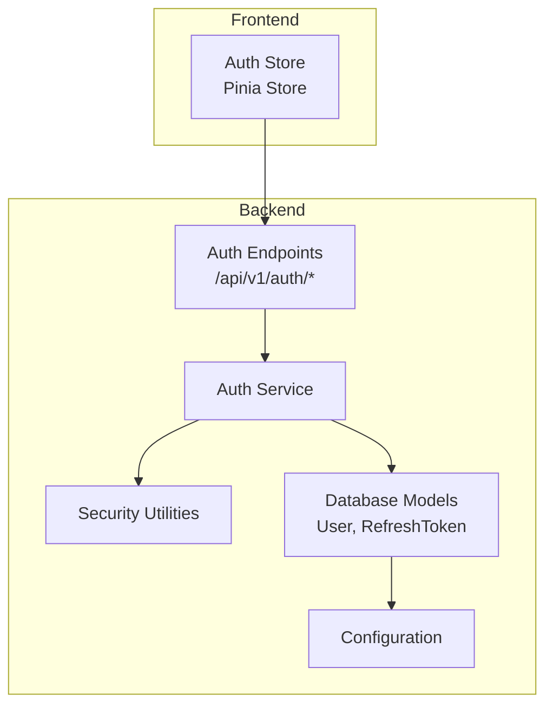
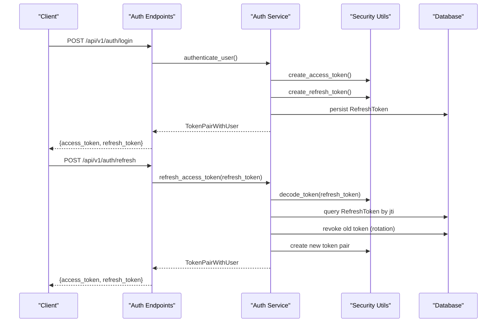
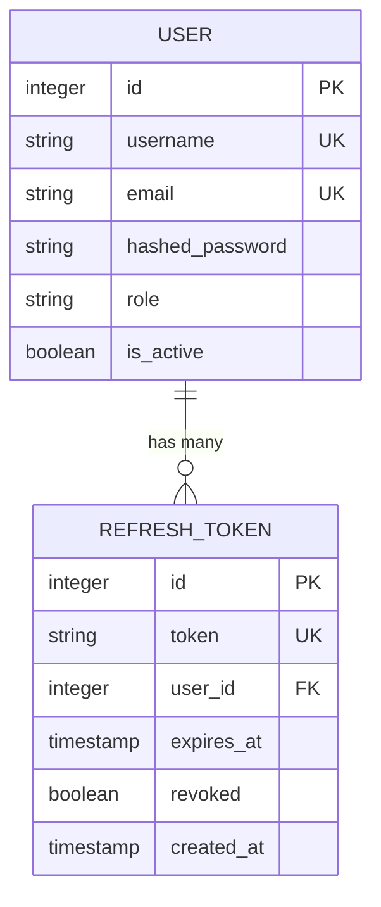
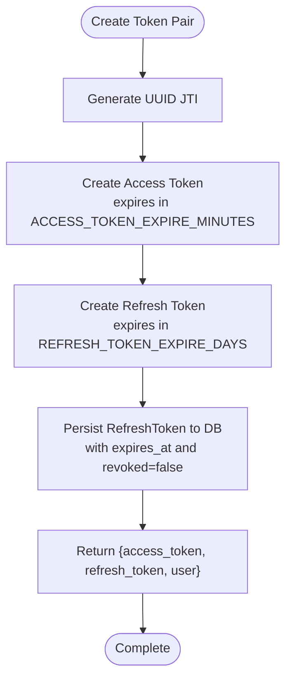
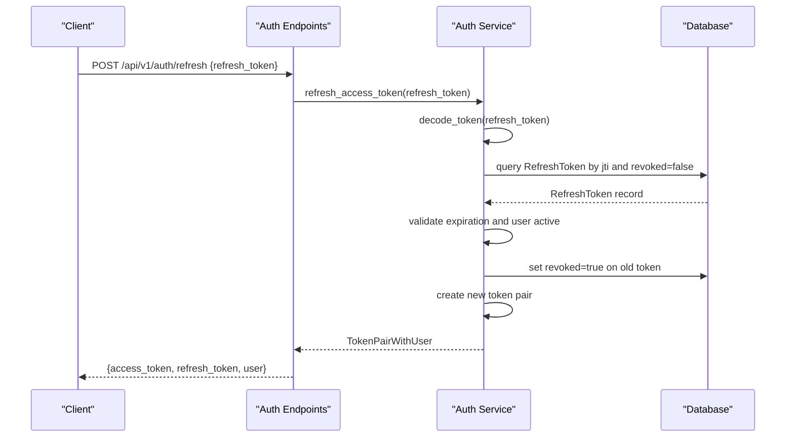
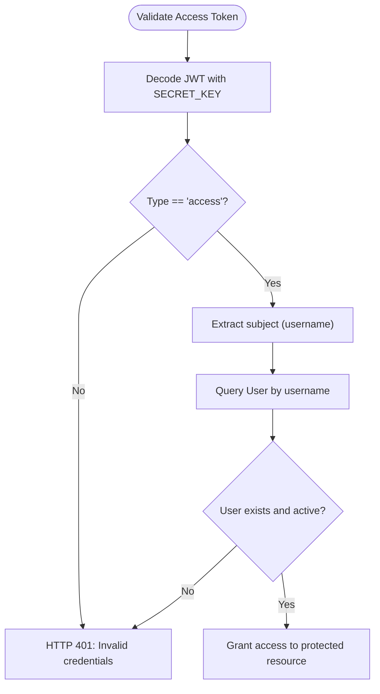
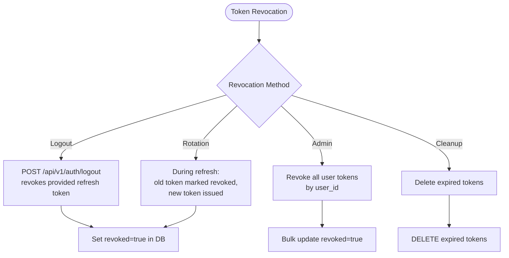
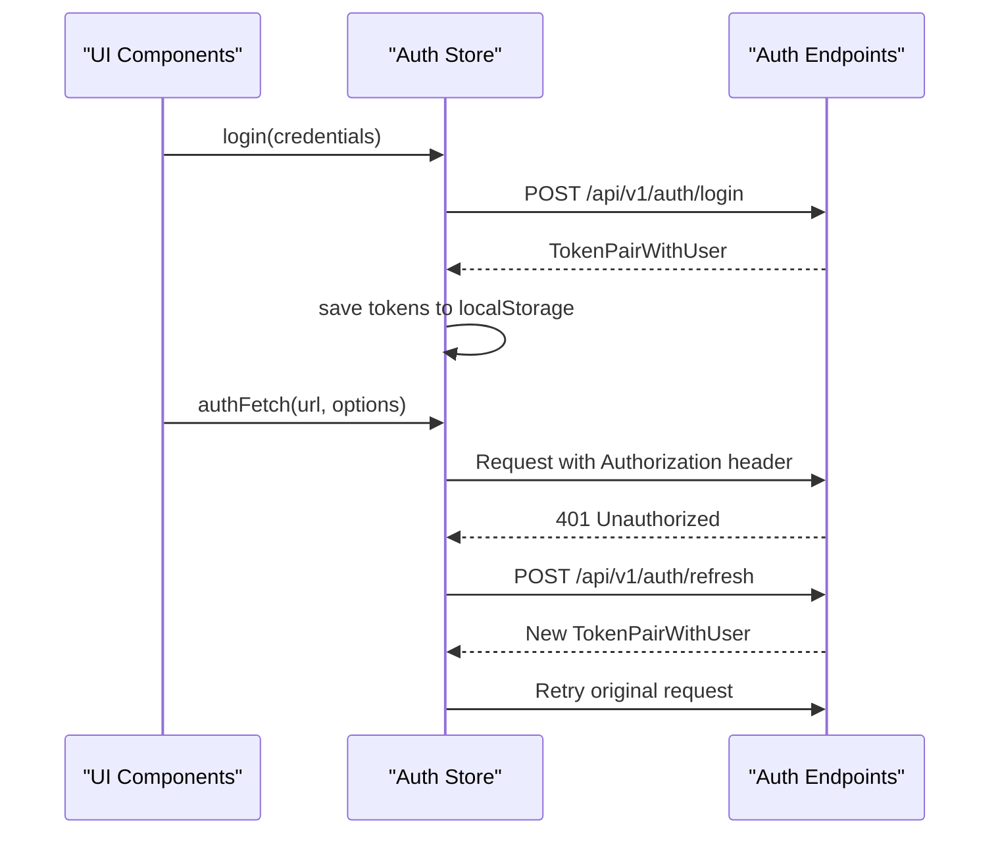
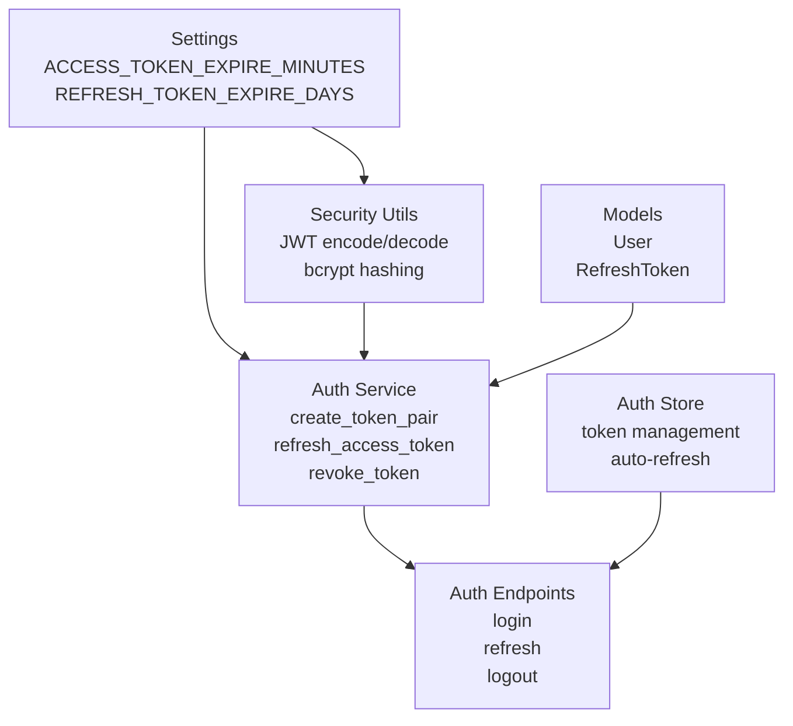

# Token Refresh Mechanism

<cite>
**Referenced Files in This Document**
- [auth.py](file://backend/app/api/v1/endpoints/auth.py)
- [auth_service.py](file://backend/app/services/auth_service.py)
- [security.py](file://backend/app/core/security.py)
- [refresh_token.py](file://backend/app/models/refresh_token.py)
- [user.py](file://backend/app/models/user.py)
- [auth.py](file://backend/app/schemas/auth.py)
- [config.py](file://backend/app/core/config.py)
- [database.py](file://backend/app/core/database.py)
- [router.py](file://backend/app/api/v1/router.py)
- [main.py](file://backend/app/main.py)
- [auth.js](file://frontend/src/stores/auth.js)
</cite>

## Table of Contents
1. [Introduction](#introduction)
2. [Project Structure](#project-structure)
3. [Core Components](#core-components)
4. [Architecture Overview](#architecture-overview)
5. [Detailed Component Analysis](#detailed-component-analysis)
6. [Dependency Analysis](#dependency-analysis)
7. [Performance Considerations](#performance-considerations)
8. [Troubleshooting Guide](#troubleshooting-guide)
9. [Conclusion](#conclusion)

## Introduction
This document provides comprehensive documentation for the token refresh mechanism and refresh token management in the system. It explains the refresh token lifecycle, rotation process, and invalidation strategies. The documentation covers the refresh endpoint implementation, token validation logic, and security measures against token replay attacks. It also details the relationship between access tokens and refresh tokens, token revocation processes, and best practices for secure token rotation, including examples of refresh token usage and error handling scenarios.

## Project Structure
The token refresh mechanism spans several backend components and the frontend client:

- Backend authentication endpoints: `/api/v1/auth/login`, `/api/v1/auth/refresh`, `/api/v1/auth/logout`
- Authentication service: token creation, refresh, revocation, and cleanup
- Security utilities: JWT encoding/decoding, password hashing, and access token validation
- Database models: User and RefreshToken persistence
- Frontend authentication store: client-side token storage and refresh logic

**Diagram sources**
- [auth.py:1-106](file://backend/app/api/v1/endpoints/auth.py#L1-L106)
- [auth_service.py:1-139](file://backend/app/services/auth_service.py#L1-L139)
- [security.py:1-99](file://backend/app/core/security.py#L1-L99)
- [refresh_token.py:1-18](file://backend/app/models/refresh_token.py#L1-L18)
- [user.py:1-35](file://backend/app/models/user.py#L1-L35)
- [config.py:1-46](file://backend/app/core/config.py#L1-L46)
- [auth.js:1-198](file://frontend/src/stores/auth.js#L1-L198)

**Section sources**
- [auth.py:1-106](file://backend/app/api/v1/endpoints/auth.py#L1-L106)
- [auth_service.py:1-139](file://backend/app/services/auth_service.py#L1-L139)
- [security.py:1-99](file://backend/app/core/security.py#L1-L99)
- [refresh_token.py:1-18](file://backend/app/models/refresh_token.py#L1-L18)
- [user.py:1-35](file://backend/app/models/user.py#L1-L35)
- [config.py:1-46](file://backend/app/core/config.py#L1-L46)
- [auth.js:1-198](file://frontend/src/stores/auth.js#L1-L198)

## Core Components
- RefreshToken model: Stores refresh tokens with expiration, revocation flag, and user relationship
- Auth endpoints: Login, refresh, logout, and user info endpoints
- Auth service: Implements token pair creation, refresh logic, revocation, and cleanup
- Security utilities: JWT creation/decoding, password verification, and access token validation
- Frontend auth store: Manages token lifecycle on the client side

Key implementation references:
- Token pair creation and refresh: [auth_service.py:19-74](file://backend/app/services/auth_service.py#L19-L74)
- Refresh endpoint handler: [auth.py:40-51](file://backend/app/api/v1/endpoints/auth.py#L40-L51)
- Token revocation: [auth_service.py:77-90](file://backend/app/services/auth_service.py#L77-L90)
- Access token validation: [security.py:61-79](file://backend/app/core/security.py#L61-L79)

**Section sources**
- [auth_service.py:1-139](file://backend/app/services/auth_service.py#L1-L139)
- [auth.py:1-106](file://backend/app/api/v1/endpoints/auth.py#L1-L106)
- [security.py:1-99](file://backend/app/core/security.py#L1-L99)

## Architecture Overview
The token refresh architecture follows a layered design with clear separation of concerns:

**Diagram sources**
- [auth.py:20-51](file://backend/app/api/v1/endpoints/auth.py#L20-L51)
- [auth_service.py:19-74](file://backend/app/services/auth_service.py#L19-L74)
- [security.py:31-48](file://backend/app/core/security.py#L31-L48)
- [refresh_token.py:7-17](file://backend/app/models/refresh_token.py#L7-L17)

## Detailed Component Analysis

### Refresh Token Model and Lifecycle
The RefreshToken model defines the database schema and lifecycle attributes:

Key lifecycle characteristics:
- Unique token identifier (JTI) stored in the token payload
- Expiration timestamp enforced during refresh validation
- Revocation flag prevents reuse after logout or compromise
- Cascade deletion ensures orphaned tokens cleanup

**Diagram sources**
- [refresh_token.py:7-17](file://backend/app/models/refresh_token.py#L7-L17)
- [user.py:20-22](file://backend/app/models/user.py#L20-L22)

**Section sources**
- [refresh_token.py:1-18](file://backend/app/models/refresh_token.py#L1-L18)
- [user.py:1-35](file://backend/app/models/user.py#L1-L35)

### Token Pair Creation and Storage
The token creation process generates both access and refresh tokens:

Implementation highlights:
- JTI serves as the refresh token value stored in the database
- Access token has shorter expiration for security
- Refresh token persists until expiration or revocation
- User relationship maintained for audit and cleanup

**Diagram sources**
- [auth_service.py:19-42](file://backend/app/services/auth_service.py#L19-L42)
- [config.py:12-13](file://backend/app/core/config.py#L12-L13)

**Section sources**
- [auth_service.py:19-42](file://backend/app/services/auth_service.py#L19-L42)
- [config.py:1-46](file://backend/app/core/config.py#L1-L46)

### Refresh Endpoint Implementation
The refresh endpoint validates and rotates tokens:

Validation logic:
- Decode JWT and verify type is "refresh"
- Lookup token by JTI in database
- Check revocation status and expiration
- Verify user existence and active status
- Rotate by revoking old token and issuing new pair

**Diagram sources**
- [auth.py:40-51](file://backend/app/api/v1/endpoints/auth.py#L40-L51)
- [auth_service.py:45-74](file://backend/app/services/auth_service.py#L45-L74)

**Section sources**
- [auth.py:40-51](file://backend/app/api/v1/endpoints/auth.py#L40-L51)
- [auth_service.py:45-74](file://backend/app/services/auth_service.py#L45-L74)

### Token Validation and Security Measures
Access token validation ensures only valid access tokens grant protected resources:

Security measures implemented:
- JWT signature verification using SECRET_KEY
- Token type validation ("access" vs "refresh")
- User active status verification
- Password hashing with bcrypt
- CORS configuration for cross-origin protection

**Diagram sources**
- [security.py:61-79](file://backend/app/core/security.py#L61-L79)
- [config.py:9-13](file://backend/app/core/config.py#L9-L13)

**Section sources**
- [security.py:1-99](file://backend/app/core/security.py#L1-L99)
- [config.py:1-46](file://backend/app/core/config.py#L1-L46)

### Token Revocation and Invalidation Strategies
Multiple revocation mechanisms prevent token reuse:

Revocation strategies:
- Single token revocation via logout endpoint
- Automatic rotation revocation during refresh
- Bulk revocation for user account changes
- Periodic cleanup of expired tokens

**Diagram sources**
- [auth.py:83-90](file://backend/app/api/v1/endpoints/auth.py#L83-L90)
- [auth_service.py:77-110](file://backend/app/services/auth_service.py#L77-L110)

**Section sources**
- [auth.py:83-90](file://backend/app/api/v1/endpoints/auth.py#L83-L90)
- [auth_service.py:77-110](file://backend/app/services/auth_service.py#L77-L110)

### Frontend Token Management
The frontend implements robust client-side token handling:

Client-side features:
- Automatic token refresh on 401 responses
- Secure local storage of tokens
- Token expiration tracking
- Graceful logout handling

**Diagram sources**
- [auth.js:29-67](file://frontend/src/stores/auth.js#L29-L67)
- [auth.js:105-134](file://frontend/src/stores/auth.js#L105-L134)
- [auth.js:160-177](file://frontend/src/stores/auth.js#L160-L177)

**Section sources**
- [auth.js:1-198](file://frontend/src/stores/auth.js#L1-L198)

## Dependency Analysis
The token refresh mechanism exhibits clean dependency relationships:

Key dependencies:
- Settings drive token expiration policies
- Security utilities handle cryptographic operations
- Database models provide persistence layer
- Service layer orchestrates business logic
- Endpoints expose HTTP interface
- Frontend consumes and manages tokens

**Diagram sources**
- [config.py:1-46](file://backend/app/core/config.py#L1-L46)
- [security.py:1-99](file://backend/app/core/security.py#L1-L99)
- [auth_service.py:1-139](file://backend/app/services/auth_service.py#L1-L139)
- [auth.py:1-106](file://backend/app/api/v1/endpoints/auth.py#L1-L106)
- [auth.js:1-198](file://frontend/src/stores/auth.js#L1-L198)

**Section sources**
- [config.py:1-46](file://backend/app/core/config.py#L1-L46)
- [security.py:1-99](file://backend/app/core/security.py#L1-L99)
- [auth_service.py:1-139](file://backend/app/services/auth_service.py#L1-L139)
- [auth.py:1-106](file://backend/app/api/v1/endpoints/auth.py#L1-L106)
- [auth.js:1-198](file://frontend/src/stores/auth.js#L1-L198)

## Performance Considerations
- Token expiration tuning: Adjust ACCESS_TOKEN_EXPIRE_MINUTES and REFRESH_TOKEN_EXPIRE_DAYS based on security and usability requirements
- Database indexing: Ensure proper indexing on RefreshToken.token and user_id for efficient lookups
- Cleanup scheduling: Implement periodic cleanup of expired tokens to maintain database performance
- Caching strategies: Consider caching frequently accessed user data to reduce database load
- Connection pooling: Configure database connection pooling appropriately for concurrent token operations

## Troubleshooting Guide
Common refresh token issues and resolutions:

### Invalid or Expired Refresh Token
**Symptoms**: HTTP 401 Unauthorized on refresh endpoint
**Causes**: 
- Token expired beyond REFRESH_TOKEN_EXPIRE_DAYS
- Token not found in database
- Token marked as revoked
- Invalid JWT signature

**Resolution**: 
- Request new tokens via login endpoint
- Verify token expiration settings
- Check database connectivity and indexing

### Token Replay Attacks
**Prevention measures**:
- Implement short access token expiration
- Use unique JTI values for each refresh token
- Monitor and revoke suspicious tokens
- Enable proper CORS configuration

### Frontend Token Issues
**Symptoms**: Automatic logout despite valid credentials
**Causes**:
- Local storage corruption
- Network connectivity issues
- Token mismatch between client and server

**Resolution**:
- Clear browser local storage and re-authenticate
- Verify network connectivity
- Check token synchronization logic

**Section sources**
- [auth.py:46-50](file://backend/app/api/v1/endpoints/auth.py#L46-L50)
- [auth_service.py:63-68](file://backend/app/services/auth_service.py#L63-L68)
- [auth.js:105-134](file://frontend/src/stores/auth.js#L105-L134)

## Conclusion
The token refresh mechanism implements a secure, robust system for managing authentication tokens. Key strengths include automatic token rotation, comprehensive revocation capabilities, and client-side automation. The design balances security with usability through configurable expiration policies and automated refresh logic. Best practices include proper token storage, regular cleanup of expired tokens, and monitoring for suspicious activity. The system provides a solid foundation for secure authentication while maintaining flexibility for future enhancements.