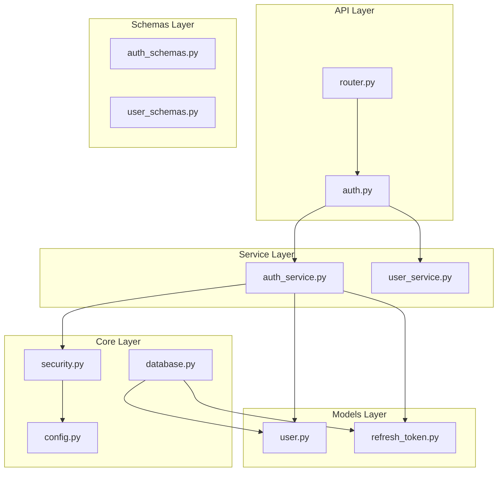
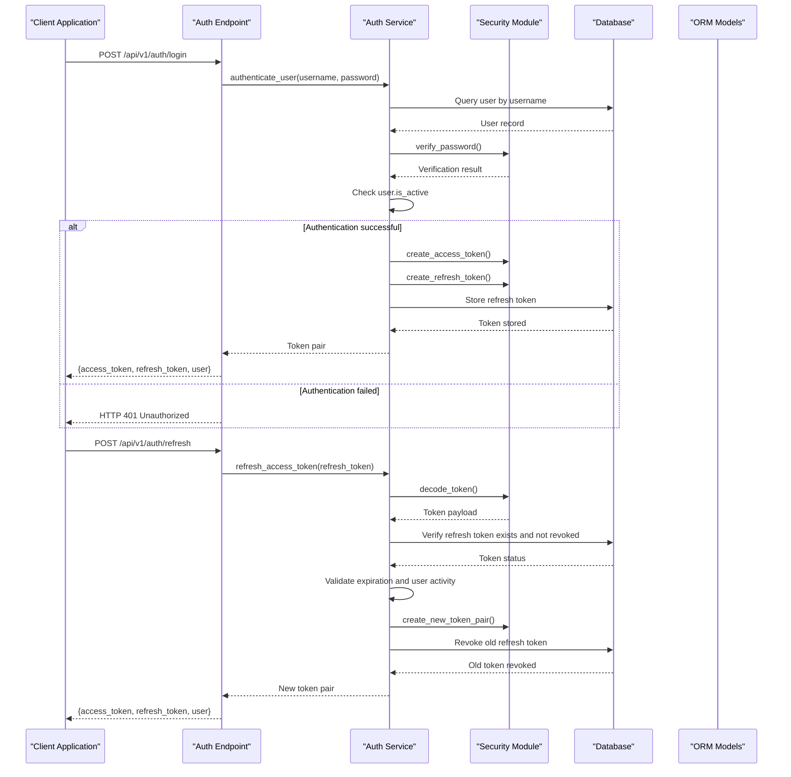
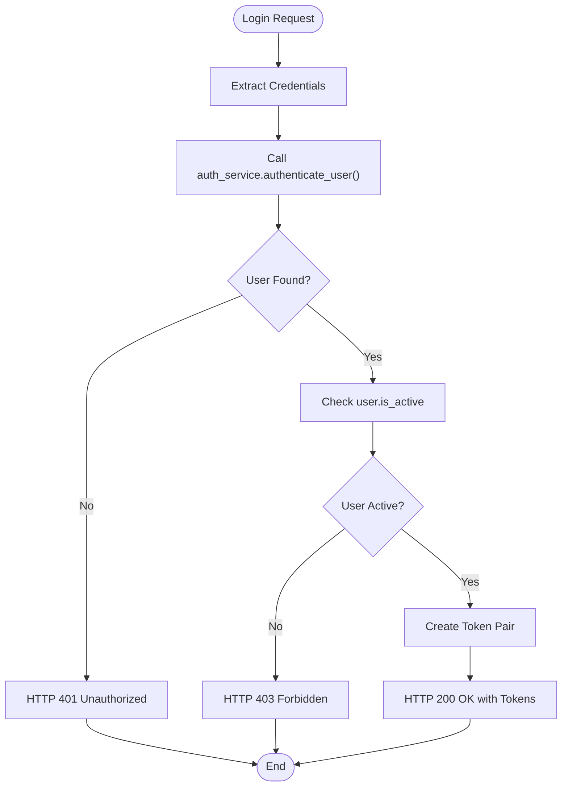
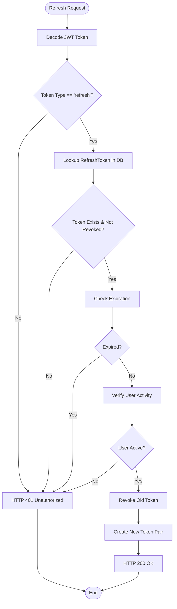
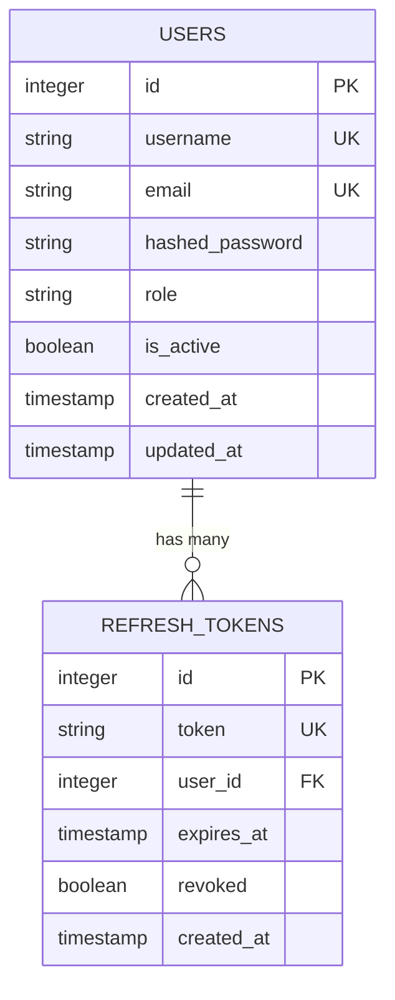
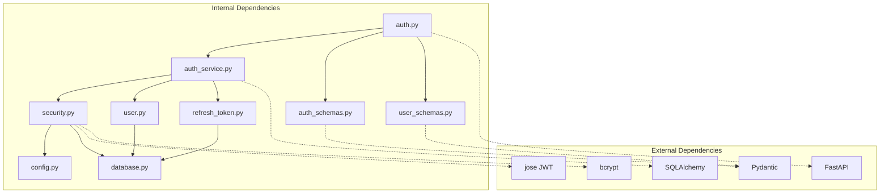

# User Authentication Flow

<cite>
**Referenced Files in This Document**
- [auth.py](file://backend/app/api/v1/endpoints/auth.py)
- [auth_service.py](file://backend/app/services/auth_service.py)
- [security.py](file://backend/app/core/security.py)
- [user.py](file://backend/app/models/user.py)
- [refresh_token.py](file://backend/app/models/refresh_token.py)
- [auth_schemas.py](file://backend/app/schemas/auth.py)
- [user_schemas.py](file://backend/app/schemas/user.py)
- [config.py](file://backend/app/core/config.py)
- [database.py](file://backend/app/core/database.py)
- [router.py](file://backend/app/api/v1/router.py)
- [main.py](file://backend/app/main.py)
</cite>

## Table of Contents
1. [Introduction](#introduction)
2. [Project Structure](#project-structure)
3. [Core Components](#core-components)
4. [Architecture Overview](#architecture-overview)
5. [Detailed Component Analysis](#detailed-component-analysis)
6. [Dependency Analysis](#dependency-analysis)
7. [Performance Considerations](#performance-considerations)
8. [Troubleshooting Guide](#troubleshooting-guide)
9. [Conclusion](#conclusion)

## Introduction
This document provides comprehensive documentation for the user authentication flow in the FastAPI-based SSO system. It details the complete authentication lifecycle from user login to successful authentication, including credential validation, user activation checks, token generation, refresh token rotation, and logout procedures. The documentation covers the authentication endpoints (/login, /refresh, /logout), request/response schemas, error handling scenarios, and the integration between the authentication service, database models, and FastAPI dependencies.

## Project Structure
The authentication system is organized within the backend application following a layered architecture:
- API Layer: Defines authentication endpoints and request/response schemas
- Service Layer: Implements business logic for authentication operations
- Core Layer: Provides security utilities, database configuration, and settings
- Models Layer: Defines database entities for users and refresh tokens
- Schemas Layer: Defines Pydantic models for request/response validation

**Diagram sources**
- [auth.py:1-106](file://backend/app/api/v1/endpoints/auth.py#L1-L106)
- [auth_service.py:1-139](file://backend/app/services/auth_service.py#L1-L139)
- [security.py:1-99](file://backend/app/core/security.py#L1-L99)
- [user.py:1-35](file://backend/app/models/user.py#L1-L35)
- [refresh_token.py:1-18](file://backend/app/models/refresh_token.py#L1-L18)
- [router.py:1-10](file://backend/app/api/v1/router.py#L1-L10)

**Section sources**
- [auth.py:1-106](file://backend/app/api/v1/endpoints/auth.py#L1-L106)
- [router.py:1-10](file://backend/app/api/v1/router.py#L1-L10)

## Core Components
The authentication system consists of several interconnected components that work together to provide secure user authentication:

### Authentication Endpoints
The system exposes four primary authentication endpoints:
- POST /api/v1/auth/login: Handles user login and generates token pairs
- POST /api/v1/auth/refresh: Refreshes access tokens using refresh tokens
- POST /api/v1/auth/logout: Revokes refresh tokens for logout
- GET /api/v1/auth/me: Retrieves current authenticated user information

### Token Management
The system implements a dual-token strategy with JWT access tokens and refresh tokens stored in the database:
- Access tokens: Short-lived tokens (default 15 minutes) for API access
- Refresh tokens: Long-lived tokens (default 7 days) for obtaining new access tokens
- Token rotation: When refreshing, old refresh tokens are revoked and new ones generated

### Security Utilities
The security module provides essential cryptographic functions:
- Password hashing and verification using bcrypt
- JWT encoding/decoding with HS256 algorithm
- OAuth2 bearer token validation
- User role-based access control

**Section sources**
- [auth.py:20-97](file://backend/app/api/v1/endpoints/auth.py#L20-L97)
- [auth_service.py:19-74](file://backend/app/services/auth_service.py#L19-L74)
- [security.py:16-58](file://backend/app/core/security.py#L16-L58)

## Architecture Overview
The authentication architecture follows a clean separation of concerns with clear boundaries between layers:

**Diagram sources**
- [auth.py:20-51](file://backend/app/api/v1/endpoints/auth.py#L20-L51)
- [auth_service.py:19-74](file://backend/app/services/auth_service.py#L19-L74)
- [security.py:31-48](file://backend/app/core/security.py#L31-L48)

The architecture ensures:
- **Separation of Concerns**: Clear boundaries between API, service, and core layers
- **Security Isolation**: Cryptographic operations isolated in the security module
- **Database Abstraction**: ORM models handle persistence logic
- **Dependency Injection**: Proper dependency management through FastAPI Depends

## Detailed Component Analysis

### Authentication Endpoint Implementation
The authentication endpoints are implemented in the API layer with comprehensive error handling and validation:

#### Login Endpoint
The login endpoint handles user authentication with the following flow:
1. Extracts username and password from OAuth2PasswordRequestForm
2. Calls authentication service to validate credentials
3. Checks user activation status
4. Generates token pair if authentication succeeds

**Diagram sources**
- [auth.py:20-37](file://backend/app/api/v1/endpoints/auth.py#L20-L37)
- [auth_service.py:113-119](file://backend/app/services/auth_service.py#L113-L119)

#### Token Refresh Endpoint
The refresh endpoint implements token rotation for enhanced security:
1. Decodes and validates the refresh token
2. Verifies token existence and status in database
3. Checks expiration and user activity
4. Revokes old token and issues new token pair

**Diagram sources**
- [auth.py:40-51](file://backend/app/api/v1/endpoints/auth.py#L40-L51)
- [auth_service.py:45-74](file://backend/app/services/auth_service.py#L45-L74)

#### Logout Endpoint
The logout endpoint provides token revocation capabilities:
1. Validates current user context
2. Revokes the provided refresh token
3. Returns success status

**Section sources**
- [auth.py:83-90](file://backend/app/api/v1/endpoints/auth.py#L83-L90)
- [auth_service.py:77-90](file://backend/app/services/auth_service.py#L77-L90)

### Authentication Service Implementation
The authentication service encapsulates all business logic for authentication operations:

#### Token Generation and Storage
The service creates secure token pairs with the following characteristics:
- Access tokens: Short-lived with type "access" and configured expiration
- Refresh tokens: Long-lived with type "refresh" and unique JTI (JWT ID)
- Database persistence: Refresh tokens stored with expiration timestamps

#### Token Validation and Rotation
The service implements robust token validation:
- Payload verification using JWT decoding
- Token type validation ("access" vs "refresh")
- Database consistency checks
- Automatic token rotation for enhanced security

#### Password Management
The service integrates with the security module for password operations:
- Password verification using bcrypt
- Secure password hashing for user registration
- Salted hash generation for password storage

**Section sources**
- [auth_service.py:19-42](file://backend/app/services/auth_service.py#L19-L42)
- [auth_service.py:45-74](file://backend/app/services/auth_service.py#L45-L74)
- [auth_service.py:113-119](file://backend/app/services/auth_service.py#L113-L119)

### Security Module Components
The security module provides essential cryptographic and authentication utilities:

#### JWT Token Operations
The security module implements comprehensive JWT functionality:
- Access token creation with "access" type and short expiration
- Refresh token creation with "refresh" type and long expiration
- Token decoding with error handling and validation
- Algorithm configuration (HS256) and secret key management

#### Password Security
The security module ensures password security through:
- bcrypt-based password hashing with salt generation
- Secure password verification using bcrypt.checkpw
- Exception handling for cryptographic operations

#### User Context Management
The security module provides user context resolution:
- Current user extraction from access tokens
- Active user validation
- Role-based permission checking for administrative functions

**Section sources**
- [security.py:31-58](file://backend/app/core/security.py#L31-L58)
- [security.py:61-98](file://backend/app/core/security.py#L61-L98)

### Database Models and Relationships
The authentication system uses two primary database models with clear relationships:

#### User Model
The User model defines the core user entity with authentication attributes:
- Unique username and email constraints
- Hashed password storage
- Role-based access control (admin/user)
- Activation status for account management
- Timestamps for audit trails

#### Refresh Token Model
The RefreshToken model manages refresh token lifecycle:
- Unique token storage with JTI (JWT ID)
- Foreign key relationship to User model
- Expiration timestamp management
- Revocation tracking for security
- Cascade deletion on user removal

**Diagram sources**
- [user.py:7-35](file://backend/app/models/user.py#L7-L35)
- [refresh_token.py:7-18](file://backend/app/models/refresh_token.py#L7-L18)

**Section sources**
- [user.py:7-35](file://backend/app/models/user.py#L7-L35)
- [refresh_token.py:7-18](file://backend/app/models/refresh_token.py#L7-L18)

### Request/Response Schemas
The authentication system uses Pydantic models for request/response validation:

#### Authentication Schemas
The authentication schemas define the structure for authentication operations:
- LoginRequest: Username and password for login
- TokenPair: Access and refresh tokens with token type
- TokenPairWithUser: Complete authentication response with user data
- RefreshRequest: Refresh token for token renewal
- LogoutRequest: Refresh token for logout

#### User Schemas
The user schemas provide structured user data representation:
- UserCreate: User registration data
- UserUpdate: User profile update data
- UserResponse: Standardized user response format

**Section sources**
- [auth_schemas.py:5-26](file://backend/app/schemas/auth.py#L5-L26)
- [user_schemas.py:6-33](file://backend/app/schemas/user.py#L6-L33)

## Dependency Analysis
The authentication system exhibits strong modularity with clear dependency relationships:

**Diagram sources**
- [auth.py:1-16](file://backend/app/api/v1/endpoints/auth.py#L1-L16)
- [auth_service.py:1-17](file://backend/app/services/auth_service.py#L1-L17)
- [security.py:1-12](file://backend/app/core/security.py#L1-L12)

### Dependency Relationships
The system maintains clean dependency relationships:
- API layer depends on service layer for business logic
- Service layer depends on security module for cryptographic operations
- Service layer depends on models for data persistence
- Security module depends on configuration and database modules
- All layers depend on Pydantic for schema validation

### Circular Dependency Prevention
The architecture prevents circular dependencies through:
- Single-direction dependency flow (API → Service → Core/Models)
- Interface segregation between layers
- Explicit import statements avoiding mutual dependencies

**Section sources**
- [auth.py:1-16](file://backend/app/api/v1/endpoints/auth.py#L1-L16)
- [auth_service.py:1-17](file://backend/app/services/auth_service.py#L1-L17)
- [security.py:1-12](file://backend/app/core/security.py#L1-L12)

## Performance Considerations
The authentication system incorporates several performance optimizations:

### Token Expiration Management
- Access tokens: Short expiration (15 minutes) reduces token validation overhead
- Refresh tokens: Configurable expiration (7 days) balances security and performance
- Automated cleanup of expired refresh tokens prevents database bloat

### Database Optimization
- Indexes on username, email, and refresh token fields for fast lookups
- Efficient query patterns using SQLAlchemy ORM
- Connection pooling through SQLAlchemy engine configuration

### Memory Management
- Proper resource cleanup in FastAPI lifespan events
- Database session management with automatic cleanup
- JWT token validation without excessive memory allocation

## Troubleshooting Guide

### Common Authentication Issues

#### Login Failures
- **Invalid Credentials**: HTTP 401 Unauthorized with "Incorrect username or password"
- **Inactive User**: HTTP 403 Forbidden when user.is_active is False
- **Database Connectivity**: Check database connection string in settings

#### Token Refresh Problems
- **Expired Refresh Token**: HTTP 401 Unauthorized when refresh token has expired
- **Revoked Token**: HTTP 401 Unauthorized when refresh token was revoked
- **Invalid Token Format**: HTTP 401 Unauthorized for malformed JWT tokens

#### Logout Issues
- **Token Not Found**: Logout succeeds even if refresh token doesn't exist
- **Database Write Failure**: Check database connectivity for token revocation

### Error Handling Patterns
The system implements consistent error handling:
- HTTP status codes aligned with REST conventions
- WWW-Authenticate header for authentication challenges
- Detailed error messages for debugging
- Graceful fallbacks for edge cases

### Debugging Authentication Flow
To debug authentication issues:
1. Enable debug logging in configuration settings
2. Verify JWT secret key and algorithm configuration
3. Check database connectivity and table creation
4. Monitor token expiration and rotation behavior
5. Validate client-side token storage and transmission

**Section sources**
- [auth.py:27-36](file://backend/app/api/v1/endpoints/auth.py#L27-L36)
- [auth.py:47-50](file://backend/app/api/v1/endpoints/auth.py#L47-L50)
- [auth_service.py:77-90](file://backend/app/services/auth_service.py#L77-L90)

## Conclusion
The authentication system provides a comprehensive, secure, and maintainable solution for user authentication in the FastAPI application. The system successfully implements:

- **Secure Token Management**: Dual-token strategy with rotation and revocation
- **Robust Error Handling**: Comprehensive error scenarios with appropriate HTTP responses
- **Clean Architecture**: Clear separation of concerns with well-defined dependencies
- **Database Integration**: Proper ORM usage with efficient query patterns
- **Security Best Practices**: Password hashing, JWT validation, and access control

The modular design allows for easy maintenance and extension while maintaining security and performance standards. The system provides a solid foundation for building secure applications with proper authentication and authorization mechanisms.