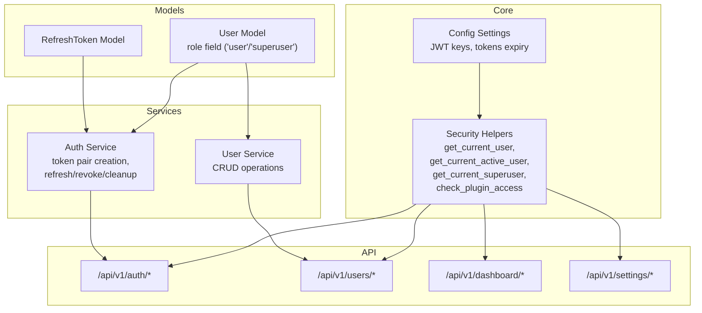
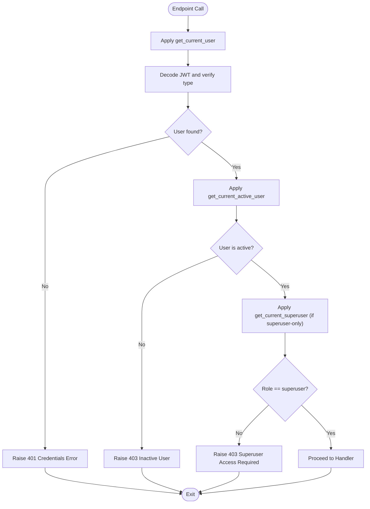
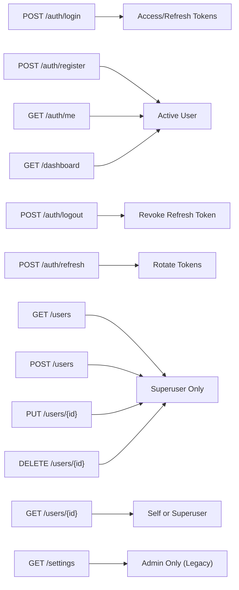
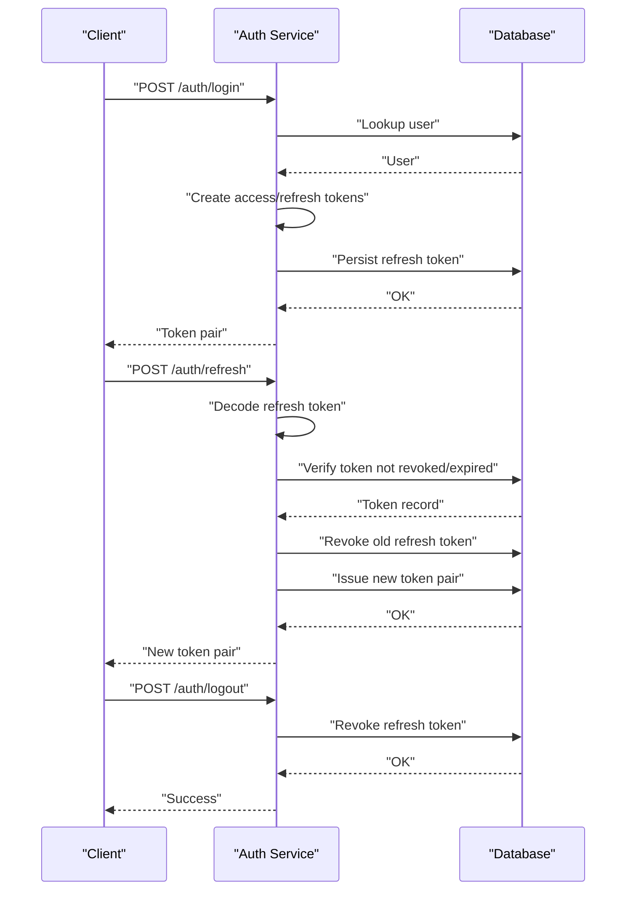
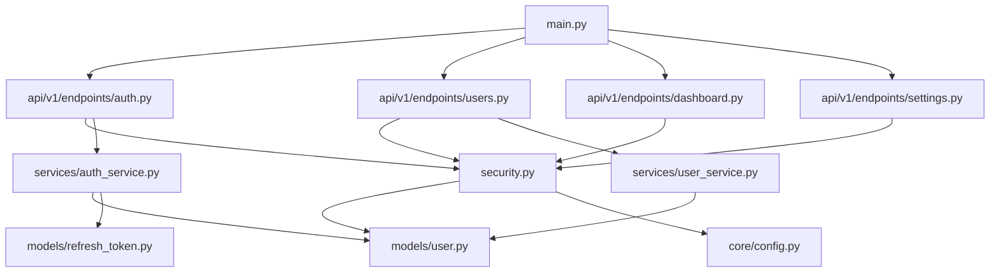

# User Roles & Permissions

<cite>
**Referenced Files in This Document**
- [user.py](file://backend/app/models/user.py)
- [security.py](file://backend/app/core/security.py)
- [auth.py](file://backend/app/api/v1/endpoints/auth.py)
- [users.py](file://backend/app/api/v1/endpoints/users.py)
- [dashboard.py](file://backend/app/api/v1/endpoints/dashboard.py)
- [settings.py](file://backend/app/api/v1/endpoints/settings.py)
- [auth_schemas.py](file://backend/app/schemas/auth.py)
- [user_schemas.py](file://backend/app/schemas/user.py)
- [auth_service.py](file://backend/app/services/auth_service.py)
- [user_service.py](file://backend/app/services/user_service.py)
- [refresh_token.py](file://backend/app/models/refresh_token.py)
- [config.py](file://backend/app/core/config.py)
- [main.py](file://backend/app/main.py)
- [router.py](file://backend/app/api/v1/router.py)
</cite>

## Update Summary
**Changes Made**
- Updated role hierarchy from admin/user to superuser/user system
- Added new get_current_superuser() function for hierarchical permission model
- Modified role-based access control patterns to support two-tier role system
- Updated security functions and authorization patterns
- Enhanced plugin access control with superuser privileges

## Table of Contents
1. [Introduction](#introduction)
2. [Project Structure](#project-structure)
3. [Core Components](#core-components)
4. [Architecture Overview](#architecture-overview)
5. [Detailed Component Analysis](#detailed-component-analysis)
6. [Dependency Analysis](#dependency-analysis)
7. [Performance Considerations](#performance-considerations)
8. [Troubleshooting Guide](#troubleshooting-guide)
9. [Conclusion](#conclusion)

## Introduction
This document describes the user role-based access control (RBAC) system implemented in the backend. The system has undergone a complete transition from an admin role system to a hierarchical superuser role hierarchy with two-tier role management (user/superuser). It explains the role hierarchy, permission levels, and access control mechanisms. It documents role-checking functions, authorization patterns, and how user roles relate to API endpoint access, including superuser-only endpoints and role-based resource restrictions. It also provides examples of role-based authorization and security considerations for different user types.

## Project Structure
The RBAC system spans several layers with a new hierarchical approach:
- Data model defines the user entity with role field supporting 'user' and 'superuser' roles.
- Security module provides dependency-based authorization helpers including the new get_current_superuser().
- API endpoints enforce authorization via these helpers with enhanced role-based access control.
- Services encapsulate business logic and interact with the database.
- Schemas define request/response structures for authentication and user management.
- Configuration controls security-related settings.

**Diagram sources**
- [user.py:7-35](file://backend/app/models/user.py#L7-L35)
- [refresh_token.py:7-18](file://backend/app/models/refresh_token.py#L7-L18)
- [security.py:61-133](file://backend/app/core/security.py#L61-L133)
- [config.py:5-51](file://backend/app/core/config.py#L5-L51)
- [auth_service.py:19-148](file://backend/app/services/auth_service.py#L19-L148)
- [user_service.py:8-69](file://backend/app/services/user_service.py#L8-L69)
- [auth.py:20-105](file://backend/app/api/v1/endpoints/auth.py#L20-L105)
- [users.py:15-140](file://backend/app/api/v1/endpoints/users.py#L15-L140)
- [dashboard.py:12-27](file://backend/app/api/v1/endpoints/dashboard.py#L12-L27)
- [settings.py:8-18](file://backend/app/api/v1/endpoints/settings.py#L8-L18)

**Section sources**
- [router.py:1-10](file://backend/app/api/v1/router.py#L1-L10)
- [main.py:50-87](file://backend/app/main.py#L50-L87)

## Core Components
- Role model: The User entity includes a role field with default 'user' value. The system now supports 'user' and 'superuser' roles with the new get_current_superuser() function.
- Authorization helpers: Dependency functions validate tokens, ensure user activity, and enforce superuser-only access with enhanced security checks.
- Endpoint authorization: API endpoints depend on these helpers to gate access with the new hierarchical permission model.
- Token lifecycle: Access and refresh tokens carry claims and are managed by the auth service, including rotation and revocation.
- Plugin access control: New check_plugin_access() function manages plugin section permissions based on user roles.

Key implementation references:
- User role definition and serialization: [user.py:15], [user.py:24-L34]
- Token creation and decoding: [security.py:31-L48], [security.py:51-L58]
- Current user retrieval: [security.py:61-L79]
- Active user enforcement: [security.py:82-L87]
- Superuser enforcement: [security.py:101-L110]
- Plugin access control: [security.py:113-L133]
- Token pair creation and refresh: [auth_service.py:19-L42], [auth_service.py:45-L74]
- Revocation and cleanup: [auth_service.py:77-L110]
- Default superuser creation: [auth_service.py:122-L147]
- User CRUD service: [user_service.py:24-L43], [user_service.py:46-L58], [user_service.py:61-L64]

**Section sources**
- [user.py:7-35](file://backend/app/models/user.py#L7-L35)
- [security.py:31-133](file://backend/app/core/security.py#L31-L133)
- [auth_service.py:19-148](file://backend/app/services/auth_service.py#L19-L148)
- [user_service.py:8-69](file://backend/app/services/user_service.py#L8-L69)

## Architecture Overview
The RBAC architecture enforces authorization at the API boundary using FastAPI dependencies with a new hierarchical approach. Tokens are validated centrally, and user roles are checked before allowing access to protected resources, with enhanced superuser privileges.

**Diagram sources**
- [security.py:61-110](file://backend/app/core/security.py#L61-L110)
- [auth_service.py:19-42](file://backend/app/services/auth_service.py#L19-L42)
- [users.py:15-37](file://backend/app/api/v1/endpoints/users.py#L15-L37)
- [auth.py:20-37](file://backend/app/api/v1/endpoints/auth.py#L20-L37)

## Detailed Component Analysis

### Role Hierarchy and Permission Levels
- Role values:
  - user: default role for regular users with limited permissions.
  - superuser: elevated administrative role with comprehensive privileges.
- Permission levels:
  - Read-only access for authenticated, active users.
  - Comprehensive administrative privileges for superuser-only endpoints and actions.
  - Hierarchical access control with superuser having access to all plugin sections.

Evidence:
- Role field in model: [user.py:15]
- Superuser enforcement: [security.py:104-L110]
- Default superuser creation: [auth_service.py:127-L147]
- Plugin access control: [security.py:113-L133]

**Section sources**
- [user.py:15](file://backend/app/models/user.py#L15)
- [security.py:101-133](file://backend/app/core/security.py#L101-L133)
- [auth_service.py:122-148](file://backend/app/services/auth_service.py#L122-L148)

### Authorization Dependencies and Patterns
- get_current_user: Validates access token and loads the user.
- get_current_active_user: Ensures the user is active.
- get_current_superuser: Enforces superuser-only access with enhanced security checks.

These dependencies are used across endpoints to enforce the new hierarchical authorization policies consistently.

**Diagram sources**
- [security.py:61-110](file://backend/app/core/security.py#L61-L110)

**Section sources**
- [security.py:61-110](file://backend/app/core/security.py#L61-L110)

### API Endpoint Access Control Matrix
- Authentication endpoints:
  - Login: validates credentials and issues token pair. [auth.py:20-L37]
  - Refresh: rotates tokens using refresh token. [auth.py:40-L51]
  - Register: accessible to all authenticated users. [auth.py:54-L79]
  - Logout: revokes a refresh token. [auth.py:82-L89]
  - Get current user info: requires active user. [auth.py:92-L96]
  - Initialize superuser: creates default superuser if none exists. [auth.py:99-L105]
- Users endpoints:
  - List users: superuser-only. [users.py:41-L49]
  - Get user by ID: active user can view self; superuser can view anyone. [users.py:52-L65]
  - Create user: superuser-only; cannot create superuser unless current user is superuser. [users.py:68-L91]
  - Update user: superuser-only; cannot assign superuser role unless current user is superuser. [users.py:94-L116]
  - Delete user: superuser-only; cannot delete self; cannot delete last superuser. [users.py:119-L139]
- Dashboard endpoint:
  - Requires active user; displays stats including role. [dashboard.py:12-L27]
- Settings endpoint:
  - Still uses get_current_admin_user (legacy admin role). [settings.py:8-L18]

**Diagram sources**
- [auth.py:20-105](file://backend/app/api/v1/endpoints/auth.py#L20-L105)
- [users.py:15-140](file://backend/app/api/v1/endpoints/users.py#L15-L140)
- [dashboard.py:12-27](file://backend/app/api/v1/endpoints/dashboard.py#L12-L27)
- [settings.py:8-18](file://backend/app/api/v1/endpoints/settings.py#L8-L18)

**Section sources**
- [auth.py:20-105](file://backend/app/api/v1/endpoints/auth.py#L20-L105)
- [users.py:15-140](file://backend/app/api/v1/endpoints/users.py#L15-L140)
- [dashboard.py:12-27](file://backend/app/api/v1/endpoints/dashboard.py#L12-L27)
- [settings.py:8-18](file://backend/app/api/v1/endpoints/settings.py#L8-L18)

### Token Management and Security Controls
- Access tokens:
  - Contain subject and role claims.
  - Used for bearer authentication on protected endpoints.
- Refresh tokens:
  - Rotates access tokens and marks old refresh tokens as revoked.
  - Stored with expiration and revocation flag.
- Token lifecycle:
  - Creation during login.
  - Rotation via refresh endpoint.
  - Revocation on logout or explicit revoke.
  - Cleanup of expired refresh tokens.

**Diagram sources**
- [auth_service.py:19-42](file://backend/app/services/auth_service.py#L19-L42)
- [auth_service.py:45-74](file://backend/app/services/auth_service.py#L45-L74)
- [auth_service.py:77-90](file://backend/app/services/auth_service.py#L77-L90)
- [refresh_token.py:7-18](file://backend/app/models/refresh_token.py#L7-L18)

**Section sources**
- [auth_service.py:19-110](file://backend/app/services/auth_service.py#L19-L110)
- [refresh_token.py:7-18](file://backend/app/models/refresh_token.py#L7-L18)

### Role-Based Resource Restrictions
- Self-service vs superuser:
  - GET /users/{id}: Regular users can only read their own profile; superusers can read any profile.
  - Other operations (create, update, delete) require superuser.
- Superuser-only endpoints:
  - /users (list/create/update/delete), /auth/register are restricted to superuser.
- Enhanced security constraints:
  - Cannot create superuser unless current user is superuser.
  - Cannot assign superuser role unless current user is superuser.
  - Cannot delete last superuser.
  - Cannot deactivate last superuser.

Examples:
- Self-read restriction: [users.py:62-L64]
- Superuser-only list: [users.py:46]
- Superuser-only create: [users.py:72]
- Superuser-only update: [users.py:99]
- Superuser-only delete: [users.py:123]
- Cannot create superuser: [users.py:80-L82]
- Cannot assign superuser role: [users.py:106-L108]
- Cannot delete last superuser: [users.py:133-L136]

**Section sources**
- [users.py:52-140](file://backend/app/api/v1/endpoints/users.py#L52-L140)

### Plugin Access Control and Hierarchical Permissions
- Plugin access control:
  - Superuser has access to all plugin sections (operations, analytics, security, admin).
  - Regular user has access only to operations and general sections.
  - check_plugin_access() function manages access based on user role.
- Endpoint integration:
  - /users/me/permissions: Returns user permissions including role and section access.
  - /users/plugins/access/{section}: Checks access to specific plugin sections.

Examples:
- Permission endpoint: [users.py:15-L24]
- Plugin access check: [users.py:27-L38]
- Plugin access control function: [security.py:113-L133]

**Section sources**
- [users.py:15-38](file://backend/app/api/v1/endpoints/users.py#L15-L38)
- [security.py:113-133](file://backend/app/core/security.py#L113-L133)

### Authorization Patterns and Best Practices
- Dependency injection: Use get_current_user/get_current_active_user/get_current_superuser to centralize authorization logic.
- Hierarchical privilege: Superuser-only endpoints and actions are gated by get_current_superuser.
- Self-service boundaries: Allow users to manage their own profiles but restrict cross-user operations.
- Role-based plugin access: Implement check_plugin_access() for granular plugin section permissions.
- Token hygiene: Rotate tokens, revoke on logout, and clean up expired ones.
- Legacy admin migration: Default admin accounts automatically converted to superuser.

References:
- Dependency usage in endpoints: [users.py:46], [users.py:56], [users.py:72], [users.py:99], [users.py:123], [auth.py:86], [auth.py:94], [settings.py:10]
- Centralized checks: [security.py:61-L110]
- Plugin access control: [users.py:15-L38], [security.py:113-L133]

**Section sources**
- [users.py:15-140](file://backend/app/api/v1/endpoints/users.py#L15-L140)
- [auth.py:20-105](file://backend/app/api/v1/endpoints/auth.py#L20-L105)
- [settings.py:8-18](file://backend/app/api/v1/endpoints/settings.py#L8-L18)
- [security.py:61-133](file://backend/app/core/security.py#L61-L133)

## Dependency Analysis
The authorization system depends on:
- Security helpers for token validation and user loading with new superuser support.
- Services for token lifecycle management and user operations.
- Database models for persisted user and refresh token records.
- Configuration for cryptographic keys and token lifetimes.

**Diagram sources**
- [security.py:61-133](file://backend/app/core/security.py#L61-L133)
- [user.py:7-35](file://backend/app/models/user.py#L7-L35)
- [refresh_token.py:7-18](file://backend/app/models/refresh_token.py#L7-L18)
- [auth.py:20-105](file://backend/app/api/v1/endpoints/auth.py#L20-L105)
- [users.py:15-140](file://backend/app/api/v1/endpoints/users.py#L15-L140)
- [dashboard.py:12-27](file://backend/app/api/v1/endpoints/dashboard.py#L12-L27)
- [settings.py:8-18](file://backend/app/api/v1/endpoints/settings.py#L8-L18)
- [auth_service.py:19-148](file://backend/app/services/auth_service.py#L19-L148)
- [user_service.py:8-69](file://backend/app/services/user_service.py#L8-L69)
- [main.py:50-87](file://backend/app/main.py#L50-L87)

**Section sources**
- [security.py:61-133](file://backend/app/core/security.py#L61-L133)
- [auth_service.py:19-148](file://backend/app/services/auth_service.py#L19-L148)
- [user_service.py:8-69](file://backend/app/services/user_service.py#L8-L69)
- [main.py:50-87](file://backend/app/main.py#L50-L87)

## Performance Considerations
- Token verification is lightweight; keep JWT payload minimal (subject and role).
- Use pagination for listing users to avoid large payloads.
- Ensure database indexes on user identifiers (username, email) to speed up lookups.
- Batch cleanup of expired refresh tokens periodically to maintain performance.
- Superuser role checks are efficient as they involve simple string comparisons.

## Troubleshooting Guide
Common issues and resolutions:
- 401 Unauthorized:
  - Cause: Invalid or missing bearer token, wrong token type.
  - Resolution: Ensure client sends a valid access token; check token type claim.
  - Reference: [security.py:70-L72]
- 403 Forbidden:
  - Cause: Inactive user or insufficient permissions (not superuser).
  - Resolution: Activate user account or ensure superuser role; verify role value.
  - References: [security.py:85-L86], [security.py:104-L110]
- 404 Not Found:
  - Cause: User not found when accessing by ID.
  - Resolution: Verify user ID; ensure user exists.
  - Reference: [users.py:67-L69]
- Cannot delete last superuser:
  - Cause: Attempting to delete the final superuser account.
  - Resolution: Ensure at least one superuser remains active.
  - Reference: [users.py:112-L114]
- Cannot deactivate last superuser:
  - Cause: Attempting to deactivate the final superuser account.
  - Resolution: Ensure at least one superuser remains active.
  - Reference: [users.py:111-L114]
- Cannot assign superuser role:
  - Cause: Non-superuser attempting to grant superuser privileges.
  - Resolution: Only superusers can assign superuser roles.
  - Reference: [users.py:106-L108]
- Invalid or expired refresh token:
  - Cause: Refresh token invalid, revoked, or expired.
  - Resolution: Use a valid refresh token or re-authenticate.
  - Reference: [auth.py:46-L50]

**Section sources**
- [security.py:61-110](file://backend/app/core/security.py#L61-L110)
- [users.py:106-139](file://backend/app/api/v1/endpoints/users.py#L106-L139)
- [auth.py:40-51](file://backend/app/api/v1/endpoints/auth.py#L40-L51)

## Conclusion
The RBAC system has successfully transitioned from an admin role system to a hierarchical superuser role hierarchy with two-tier role management. The new get_current_superuser() function and enhanced authorization patterns provide robust security with clear separation of duties. Superuser-only endpoints and self-service boundaries protect sensitive operations while enabling users to manage their own profiles. The new plugin access control system provides granular permissions for different user types. Enhanced security constraints prevent critical system misconfigurations such as removing the last superuser. Robust token lifecycle management and database-backed refresh tokens further strengthen security with the improved role-based access control architecture.