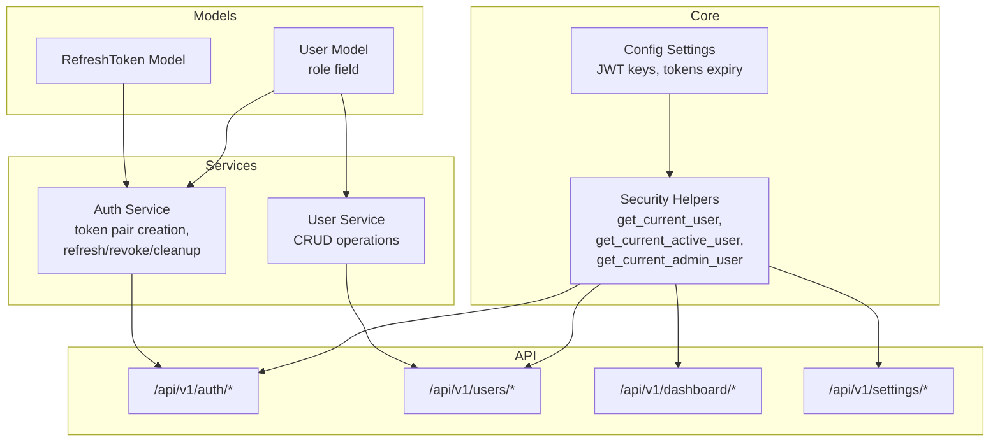
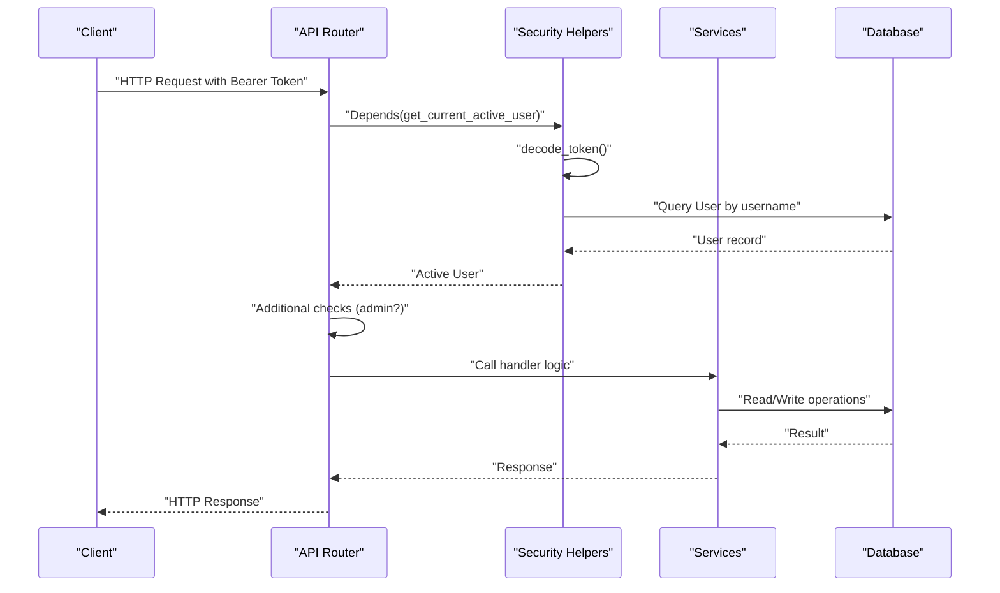
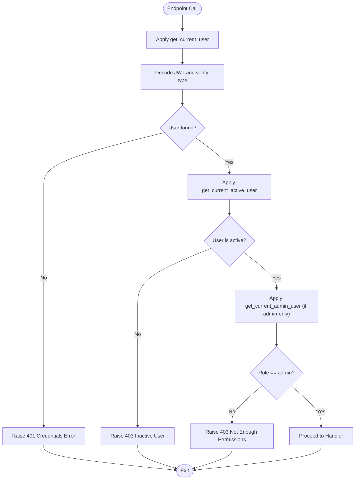
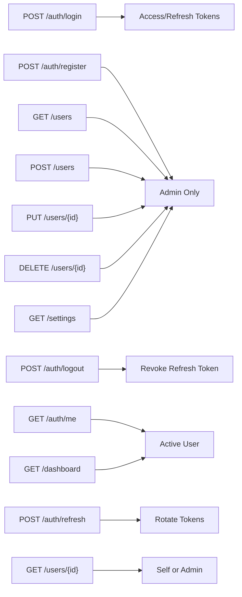
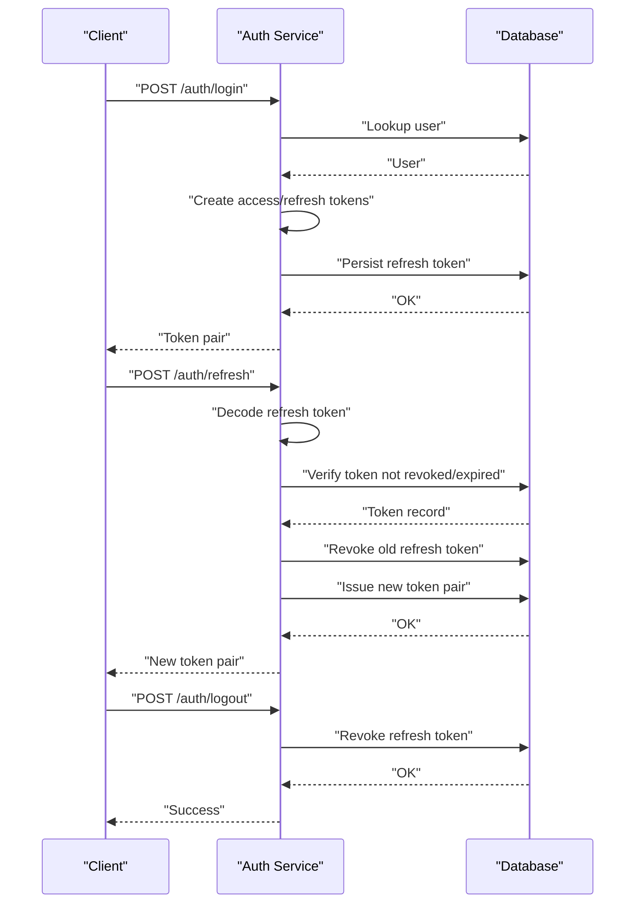
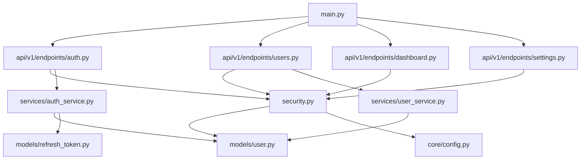

# User Roles & Permissions

<cite>
**Referenced Files in This Document**
- [user.py](file://backend/app/models/user.py)
- [security.py](file://backend/app/core/security.py)
- [auth.py](file://backend/app/api/v1/endpoints/auth.py)
- [users.py](file://backend/app/api/v1/endpoints/users.py)
- [dashboard.py](file://backend/app/api/v1/endpoints/dashboard.py)
- [settings.py](file://backend/app/api/v1/endpoints/settings.py)
- [auth_schemas.py](file://backend/app/schemas/auth.py)
- [user_schemas.py](file://backend/app/schemas/user.py)
- [auth_service.py](file://backend/app/services/auth_service.py)
- [user_service.py](file://backend/app/services/user_service.py)
- [refresh_token.py](file://backend/app/models/refresh_token.py)
- [config.py](file://backend/app/core/config.py)
- [main.py](file://backend/app/main.py)
- [router.py](file://backend/app/api/v1/router.py)
</cite>

## Table of Contents
1. [Introduction](#introduction)
2. [Project Structure](#project-structure)
3. [Core Components](#core-components)
4. [Architecture Overview](#architecture-overview)
5. [Detailed Component Analysis](#detailed-component-analysis)
6. [Dependency Analysis](#dependency-analysis)
7. [Performance Considerations](#performance-considerations)
8. [Troubleshooting Guide](#troubleshooting-guide)
9. [Conclusion](#conclusion)

## Introduction
This document describes the user role-based access control (RBAC) system implemented in the backend. It explains the role hierarchy (admin, user), permission levels, and access control mechanisms. It documents role-checking functions, authorization patterns, and how user roles relate to API endpoint access, including admin-only endpoints and role-based resource restrictions. It also provides examples of role-based authorization and security considerations for different user types.

## Project Structure
The RBAC system spans several layers:
- Data model defines the user entity and role field.
- Security module provides dependency-based authorization helpers.
- API endpoints enforce authorization via these helpers.
- Services encapsulate business logic and interact with the database.
- Schemas define request/response structures for authentication and user management.
- Configuration controls security-related settings.

**Diagram sources**
- [user.py:7-35](file://backend/app/models/user.py#L7-L35)
- [refresh_token.py:7-18](file://backend/app/models/refresh_token.py#L7-L18)
- [security.py:61-98](file://backend/app/core/security.py#L61-L98)
- [config.py:5-46](file://backend/app/core/config.py#L5-L46)
- [auth_service.py:19-139](file://backend/app/services/auth_service.py#L19-L139)
- [user_service.py:8-69](file://backend/app/services/user_service.py#L8-L69)
- [auth.py:20-105](file://backend/app/api/v1/endpoints/auth.py#L20-L105)
- [users.py:15-85](file://backend/app/api/v1/endpoints/users.py#L15-L85)
- [dashboard.py:12-26](file://backend/app/api/v1/endpoints/dashboard.py#L12-L26)
- [settings.py:8-17](file://backend/app/api/v1/endpoints/settings.py#L8-L17)

**Section sources**
- [router.py:1-10](file://backend/app/api/v1/router.py#L1-L10)
- [main.py:50-87](file://backend/app/main.py#L50-L87)

## Core Components
- Role model: The User entity includes a role field with a default value indicating a regular user. Administrators are identified by the role value reserved for admins.
- Authorization helpers: Dependency functions validate tokens, ensure user activity, and enforce admin-only access.
- Endpoint authorization: API endpoints depend on these helpers to gate access.
- Token lifecycle: Access and refresh tokens carry claims and are managed by the auth service, including rotation and revocation.

Key implementation references:
- User role definition and serialization: [user.py:15], [user.py:24-L34]
- Token creation and decoding: [security.py:31-L48], [security.py:51-L58]
- Current user retrieval: [security.py:61-L79]
- Active user enforcement: [security.py:82-L87]
- Admin-only enforcement: [security.py:90-L98]
- Token pair creation and refresh: [auth_service.py:19-L42], [auth_service.py:45-L74]
- Revocation and cleanup: [auth_service.py:77-L110]
- Default admin creation: [auth_service.py:122-L138]
- User CRUD service: [user_service.py:24-L43], [user_service.py:46-L58], [user_service.py:61-L64]

**Section sources**
- [user.py:7-35](file://backend/app/models/user.py#L7-L35)
- [security.py:31-98](file://backend/app/core/security.py#L31-L98)
- [auth_service.py:19-139](file://backend/app/services/auth_service.py#L19-L139)
- [user_service.py:8-69](file://backend/app/services/user_service.py#L8-L69)

## Architecture Overview
The RBAC architecture enforces authorization at the API boundary using FastAPI dependencies. Tokens are validated centrally, and user roles are checked before allowing access to protected resources.

**Diagram sources**
- [security.py:61-98](file://backend/app/core/security.py#L61-L98)
- [auth_service.py:19-42](file://backend/app/services/auth_service.py#L19-L42)
- [users.py:15-37](file://backend/app/api/v1/endpoints/users.py#L15-L37)
- [auth.py:20-37](file://backend/app/api/v1/endpoints/auth.py#L20-L37)

## Detailed Component Analysis

### Role Hierarchy and Permission Levels
- Role values:
  - user: default role for regular users.
  - admin: administrative role granting elevated permissions.
- Permission levels:
  - Read-only access for authenticated, active users.
  - Administrative privileges for admin-only endpoints and actions.

Evidence:
- Role field in model: [user.py:15]
- Admin enforcement: [security.py:93-L97]
- Default admin creation: [auth_service.py:127-L133]

**Section sources**
- [user.py:15](file://backend/app/models/user.py#L15)
- [security.py:90-98](file://backend/app/core/security.py#L90-L98)
- [auth_service.py:122-138](file://backend/app/services/auth_service.py#L122-L138)

### Authorization Dependencies and Patterns
- get_current_user: Validates access token and loads the user.
- get_current_active_user: Ensures the user is active.
- get_current_admin_user: Enforces admin-only access.

These dependencies are used across endpoints to enforce authorization policies consistently.

**Diagram sources**
- [security.py:61-98](file://backend/app/core/security.py#L61-L98)

**Section sources**
- [security.py:61-98](file://backend/app/core/security.py#L61-L98)

### API Endpoint Access Control Matrix
- Authentication endpoints:
  - Login: validates credentials and issues token pair. [auth.py:20-L37]
  - Refresh: rotates tokens using refresh token. [auth.py:40-L51]
  - Register: admin-only endpoint to create users. [auth.py:54-L80]
  - Logout: revokes a refresh token. [auth.py:83-L90]
  - Get current user info: requires active user. [auth.py:93-L97]
  - Initialize admin: creates default admin if none exists. [auth.py:100-L105]
- Users endpoints:
  - List users: admin-only. [users.py:15-L22]
  - Get user by ID: active user can view self; admin can view anyone. [users.py:25-L37]
  - Create user: admin-only. [users.py:40-L57]
  - Update user: admin-only. [users.py:60-L70]
  - Delete user: admin-only; cannot delete self. [users.py:73-L85]
- Dashboard endpoint:
  - Requires active user; displays stats including role. [dashboard.py:12-L26]
- Settings endpoint:
  - Admin-only. [settings.py:8-L17]

**Diagram sources**
- [auth.py:20-105](file://backend/app/api/v1/endpoints/auth.py#L20-L105)
- [users.py:15-85](file://backend/app/api/v1/endpoints/users.py#L15-L85)
- [dashboard.py:12-26](file://backend/app/api/v1/endpoints/dashboard.py#L12-L26)
- [settings.py:8-17](file://backend/app/api/v1/endpoints/settings.py#L8-L17)

**Section sources**
- [auth.py:20-105](file://backend/app/api/v1/endpoints/auth.py#L20-L105)
- [users.py:15-85](file://backend/app/api/v1/endpoints/users.py#L15-L85)
- [dashboard.py:12-26](file://backend/app/api/v1/endpoints/dashboard.py#L12-L26)
- [settings.py:8-17](file://backend/app/api/v1/endpoints/settings.py#L8-L17)

### Token Management and Security Controls
- Access tokens:
  - Contain subject and role claims.
  - Used for bearer authentication on protected endpoints.
- Refresh tokens:
  - Rotates access tokens and marks old refresh tokens as revoked.
  - Stored with expiration and revocation flag.
- Token lifecycle:
  - Creation during login.
  - Rotation via refresh endpoint.
  - Revocation on logout or explicit revoke.
  - Cleanup of expired refresh tokens.

**Diagram sources**
- [auth_service.py:19-42](file://backend/app/services/auth_service.py#L19-L42)
- [auth_service.py:45-74](file://backend/app/services/auth_service.py#L45-L74)
- [auth_service.py:77-90](file://backend/app/services/auth_service.py#L77-L90)
- [refresh_token.py:7-18](file://backend/app/models/refresh_token.py#L7-L18)

**Section sources**
- [auth_service.py:19-110](file://backend/app/services/auth_service.py#L19-L110)
- [refresh_token.py:7-18](file://backend/app/models/refresh_token.py#L7-L18)

### Role-Based Resource Restrictions
- Self-service vs admin:
  - GET /users/{id}: Regular users can only read their own profile; admins can read any profile.
  - Other operations (create, update, delete) require admin.
- Admin-only endpoints:
  - /users (list/create/update/delete), /auth/register, /settings are restricted to admin.

Examples:
- Self-read restriction: [users.py:34-L36]
- Admin-only list: [users.py:20]
- Admin-only create: [users.py:44]
- Admin-only update: [users.py:65]
- Admin-only delete: [users.py:77]
- Admin-only settings: [settings.py:10]

**Section sources**
- [users.py:25-37](file://backend/app/api/v1/endpoints/users.py#L25-L37)
- [users.py:40-85](file://backend/app/api/v1/endpoints/users.py#L40-L85)
- [settings.py:8-17](file://backend/app/api/v1/endpoints/settings.py#L8-L17)

### Authorization Patterns and Best Practices
- Dependency injection: Use get_current_user/get_current_active_user/get_current_admin_user to centralize authorization logic.
- Least privilege: Admin-only endpoints and actions are gated by get_current_admin_user.
- Self-service boundaries: Allow users to manage their own profiles but restrict cross-user operations.
- Token hygiene: Rotate tokens, revoke on logout, and clean up expired ones.

References:
- Dependency usage in endpoints: [users.py:20], [users.py:29], [users.py:44], [users.py:65], [users.py:77], [auth.py:58], [auth.py:87], [auth.py:95], [settings.py:10]
- Centralized checks: [security.py:61-L98]

**Section sources**
- [users.py:15-85](file://backend/app/api/v1/endpoints/users.py#L15-L85)
- [auth.py:20-105](file://backend/app/api/v1/endpoints/auth.py#L20-L105)
- [settings.py:8-17](file://backend/app/api/v1/endpoints/settings.py#L8-L17)
- [security.py:61-98](file://backend/app/core/security.py#L61-L98)

## Dependency Analysis
The authorization system depends on:
- Security helpers for token validation and user loading.
- Services for token lifecycle management and user operations.
- Database models for persisted user and refresh token records.
- Configuration for cryptographic keys and token lifetimes.

**Diagram sources**
- [security.py:61-98](file://backend/app/core/security.py#L61-L98)
- [user.py:7-35](file://backend/app/models/user.py#L7-L35)
- [refresh_token.py:7-18](file://backend/app/models/refresh_token.py#L7-L18)
- [auth.py:20-105](file://backend/app/api/v1/endpoints/auth.py#L20-L105)
- [users.py:15-85](file://backend/app/api/v1/endpoints/users.py#L15-L85)
- [dashboard.py:12-26](file://backend/app/api/v1/endpoints/dashboard.py#L12-L26)
- [settings.py:8-17](file://backend/app/api/v1/endpoints/settings.py#L8-L17)
- [auth_service.py:19-139](file://backend/app/services/auth_service.py#L19-L139)
- [user_service.py:8-69](file://backend/app/services/user_service.py#L8-L69)
- [main.py:50-87](file://backend/app/main.py#L50-L87)

**Section sources**
- [security.py:61-98](file://backend/app/core/security.py#L61-L98)
- [auth_service.py:19-139](file://backend/app/services/auth_service.py#L19-L139)
- [user_service.py:8-69](file://backend/app/services/user_service.py#L8-L69)
- [main.py:50-87](file://backend/app/main.py#L50-L87)

## Performance Considerations
- Token verification is lightweight; keep JWT payload minimal (subject and role).
- Use pagination for listing users to avoid large payloads.
- Ensure database indexes on user identifiers (username, email) to speed up lookups.
- Batch cleanup of expired refresh tokens periodically to maintain performance.

## Troubleshooting Guide
Common issues and resolutions:
- 401 Unauthorized:
  - Cause: Invalid or missing bearer token, wrong token type.
  - Resolution: Ensure client sends a valid access token; check token type claim.
  - Reference: [security.py:70-L72]
- 403 Forbidden:
  - Cause: Inactive user or insufficient permissions (not admin).
  - Resolution: Activate user account or ensure admin role; verify role value.
  - References: [security.py:85-L86], [security.py:93-L97]
- 404 Not Found:
  - Cause: User not found when accessing by ID.
  - Resolution: Verify user ID; ensure user exists.
  - Reference: [users.py:67-L69]
- Cannot delete self:
  - Cause: Attempting to delete own user account.
  - Resolution: Choose another administrator to perform deletion.
  - Reference: [users.py:79-L80]
- Invalid or expired refresh token:
  - Cause: Refresh token invalid, revoked, or expired.
  - Resolution: Use a valid refresh token or re-authenticate.
  - Reference: [auth.py:46-L50]

**Section sources**
- [security.py:61-98](file://backend/app/core/security.py#L61-L98)
- [users.py:60-85](file://backend/app/api/v1/endpoints/users.py#L60-L85)
- [auth.py:40-51](file://backend/app/api/v1/endpoints/auth.py#L40-L51)

## Conclusion
The RBAC system enforces clear separation of duties using role-based authorization at the API boundary. Access tokens carry essential claims, and dedicated dependencies ensure consistent enforcement. Admin-only endpoints and self-service boundaries protect sensitive operations while enabling users to manage their own profiles. Robust token lifecycle management and database-backed refresh tokens further strengthen security.