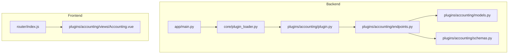
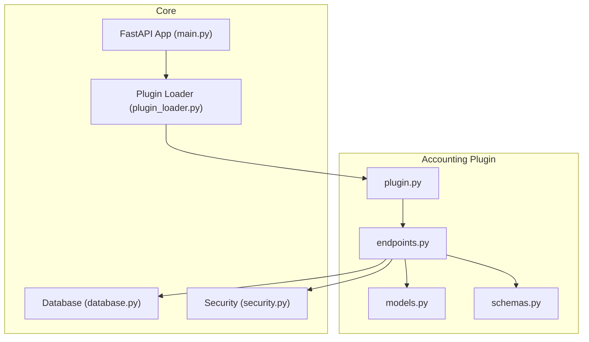
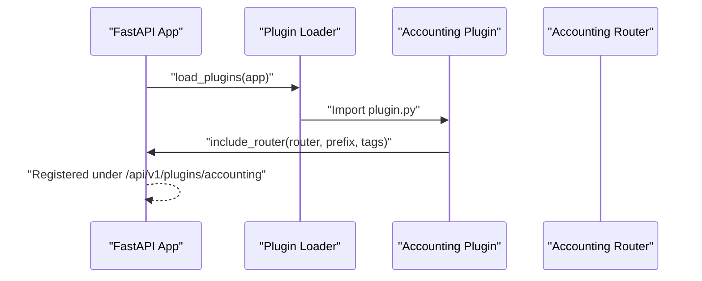
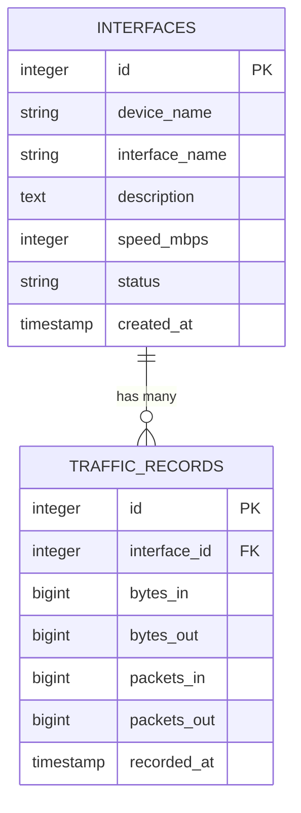
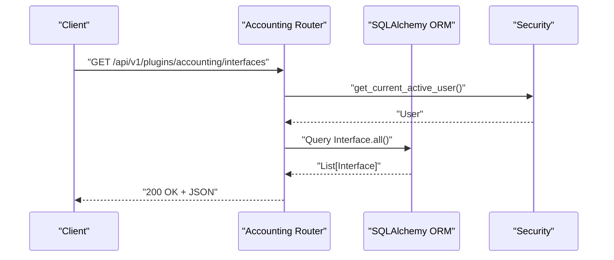
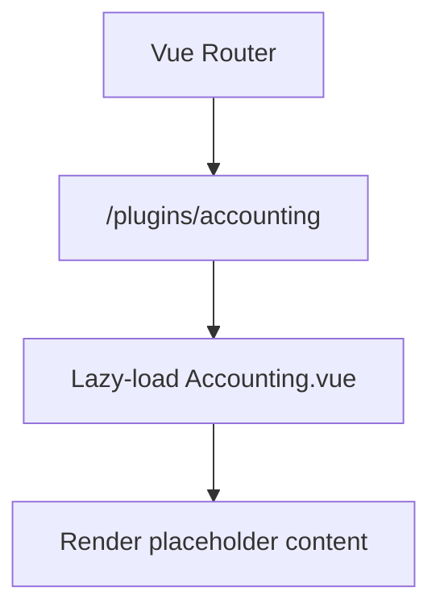
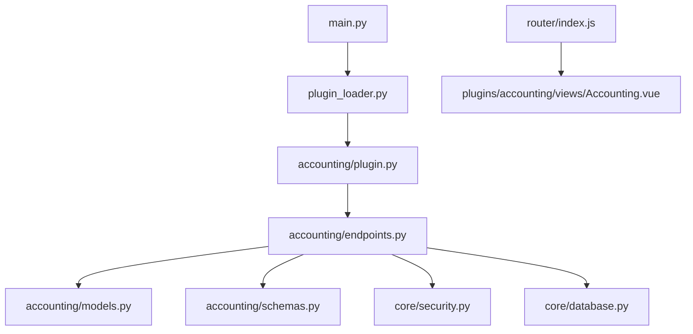

# Accounting Plugin

<cite>
**Referenced Files in This Document**
- [README.md](file://README.md)
- [backend/app/main.py](file://backend/app/main.py)
- [backend/app/core/plugin_loader.py](file://backend/app/core/plugin_loader.py)
- [backend/app/core/config.py](file://backend/app/core/config.py)
- [backend/app/core/database.py](file://backend/app/core/database.py)
- [backend/app/core/security.py](file://backend/app/core/security.py)
- [backend/app/api/v1/router.py](file://backend/app/api/v1/router.py)
- [backend/app/plugins/accounting/plugin.py](file://backend/app/plugins/accounting/plugin.py)
- [backend/app/plugins/accounting/models.py](file://backend/app/plugins/accounting/models.py)
- [backend/app/plugins/accounting/schemas.py](file://backend/app/plugins/accounting/schemas.py)
- [backend/app/plugins/accounting/endpoints.py](file://backend/app/plugins/accounting/endpoints.py)
- [frontend/src/router/index.js](file://frontend/src/router/index.js)
- [frontend/src/plugins/accounting/views/Accounting.vue](file://frontend/src/plugins/accounting/views/Accounting.vue)
</cite>

## Table of Contents
1. [Introduction](#introduction)
2. [Project Structure](#project-structure)
3. [Core Components](#core-components)
4. [Architecture Overview](#architecture-overview)
5. [Detailed Component Analysis](#detailed-component-analysis)
6. [Dependency Analysis](#dependency-analysis)
7. [Performance Considerations](#performance-considerations)
8. [Troubleshooting Guide](#troubleshooting-guide)
9. [Conclusion](#conclusion)
10. [Appendices](#appendices)

## Introduction
The Accounting Plugin provides traffic and resource accounting capabilities for the NOC Vision platform. It focuses on network interface traffic accounting, storing ingress/egress metrics, and exposing REST endpoints for retrieving traffic records. The plugin is part of a modular architecture that enables dynamic loading of features and integrates with the broader authentication, authorization, and database systems.

Current functionality includes:
- Interface management (listing and creation)
- Traffic record retrieval for specific interfaces
- Basic billing-ready data (bytes in/out, packets in/out) for future billing calculations

Planned enhancements include billing calculations, cost allocation strategies, and financial reporting dashboards.

**Section sources**
- [README.md:47](file://README.md#L47)

## Project Structure
The Accounting Plugin resides under the backend plugin system and follows a standard structure:
- backend/app/plugins/accounting/
  - plugin.py: Plugin metadata and registration
  - models.py: SQLAlchemy ORM models for interfaces and traffic records
  - schemas.py: Pydantic models for request/response validation
  - endpoints.py: FastAPI routes for accounting operations

The frontend exposes a dedicated view under the plugins routing system.

**Diagram sources**
- [backend/app/main.py:17-48](file://backend/app/main.py#L17-L48)
- [backend/app/core/plugin_loader.py:25-99](file://backend/app/core/plugin_loader.py#L25-L99)
- [backend/app/plugins/accounting/plugin.py:9-17](file://backend/app/plugins/accounting/plugin.py#L9-L17)
- [backend/app/plugins/accounting/endpoints.py:11](file://backend/app/plugins/accounting/endpoints.py#L11)
- [frontend/src/router/index.js:114-144](file://frontend/src/router/index.js#L114-L144)

**Section sources**
- [backend/app/plugins/accounting/plugin.py:1-17](file://backend/app/plugins/accounting/plugin.py#L1-L17)
- [backend/app/plugins/accounting/models.py:1-28](file://backend/app/plugins/accounting/models.py#L1-L28)
- [backend/app/plugins/accounting/schemas.py:1-36](file://backend/app/plugins/accounting/schemas.py#L1-L36)
- [backend/app/plugins/accounting/endpoints.py:1-61](file://backend/app/plugins/accounting/endpoints.py#L1-L61)
- [frontend/src/plugins/accounting/views/Accounting.vue:1-34](file://frontend/src/plugins/accounting/views/Accounting.vue#L1-L34)

## Core Components
- Plugin Registration: Defines metadata and registers the plugin’s router under a plugin-specific API prefix.
- Data Models: SQLAlchemy models for network interfaces and traffic records.
- Pydantic Schemas: Request/response models for validation and serialization.
- API Endpoints: Routes for listing interfaces, creating interfaces, retrieving interface details, and fetching traffic records.

Key responsibilities:
- Expose REST endpoints under /api/v1/plugins/accounting
- Enforce role-based access control (active user for reads; admin for writes)
- Persist and retrieve accounting data using SQLAlchemy ORM

**Section sources**
- [backend/app/plugins/accounting/plugin.py:9-17](file://backend/app/plugins/accounting/plugin.py#L9-L17)
- [backend/app/plugins/accounting/models.py:6-28](file://backend/app/plugins/accounting/models.py#L6-L28)
- [backend/app/plugins/accounting/schemas.py:6-36](file://backend/app/plugins/accounting/schemas.py#L6-L36)
- [backend/app/plugins/accounting/endpoints.py:14-61](file://backend/app/plugins/accounting/endpoints.py#L14-L61)

## Architecture Overview
The Accounting Plugin integrates with the core platform through a plugin loader that dynamically imports plugin modules, registers routers, and creates database tables for plugin models. The plugin’s API routes are prefixed with /api/v1/plugins/{plugin_name}.

**Diagram sources**
- [backend/app/main.py:17-48](file://backend/app/main.py#L17-L48)
- [backend/app/core/plugin_loader.py:25-99](file://backend/app/core/plugin_loader.py#L25-L99)
- [backend/app/plugins/accounting/plugin.py:9-17](file://backend/app/plugins/accounting/plugin.py#L9-L17)
- [backend/app/plugins/accounting/endpoints.py:11](file://backend/app/plugins/accounting/endpoints.py#L11)

**Section sources**
- [backend/app/main.py:17-48](file://backend/app/main.py#L17-L48)
- [backend/app/core/plugin_loader.py:25-99](file://backend/app/core/plugin_loader.py#L25-L99)

## Detailed Component Analysis

### Plugin Registration and Lifecycle
- Metadata: Provides plugin identity and description.
- Registration: Includes the plugin router with a plugin-scoped API prefix and tags.
- Plugin Context: Supplies database base, API prefix, and dependency functions to the plugin.

**Diagram sources**
- [backend/app/main.py:25-27](file://backend/app/main.py#L25-L27)
- [backend/app/core/plugin_loader.py:57-78](file://backend/app/core/plugin_loader.py#L57-L78)
- [backend/app/plugins/accounting/plugin.py:9-17](file://backend/app/plugins/accounting/plugin.py#L9-L17)

**Section sources**
- [backend/app/plugins/accounting/plugin.py:1-17](file://backend/app/plugins/accounting/plugin.py#L1-L17)
- [backend/app/core/plugin_loader.py:16-23](file://backend/app/core/plugin_loader.py#L16-L23)

### Data Models: Interfaces and Traffic Records
- Interface Model: Stores device and interface identifiers, speed, status, and timestamps.
- TrafficRecord Model: Stores per-interface byte/packet counters and timestamps.

**Diagram sources**
- [backend/app/plugins/accounting/models.py:6-28](file://backend/app/plugins/accounting/models.py#L6-L28)

**Section sources**
- [backend/app/plugins/accounting/models.py:6-28](file://backend/app/plugins/accounting/models.py#L6-L28)

### Pydantic Schemas: Validation and Serialization
- InterfaceCreate: Input schema for creating interfaces.
- InterfaceResponse: Output schema for interface data.
- TrafficRecordResponse: Output schema for traffic records.

These schemas define the shape of requests and responses and enable automatic validation and serialization.

**Section sources**
- [backend/app/plugins/accounting/schemas.py:6-36](file://backend/app/plugins/accounting/schemas.py#L6-L36)

### API Endpoints: Usage Tracking and Retrieval
Endpoints provide:
- GET /interfaces: List all interfaces (active user required)
- POST /interfaces: Create a new interface (admin required)
- GET /interfaces/{id}: Retrieve a specific interface (active user required)
- GET /traffic/{interface_id}: Retrieve recent traffic records (active user required)

Access control:
- Active user dependency for read operations
- Admin user dependency for write operations

**Diagram sources**
- [backend/app/plugins/accounting/endpoints.py:14-19](file://backend/app/plugins/accounting/endpoints.py#L14-L19)
- [backend/app/core/security.py:82-87](file://backend/app/core/security.py#L82-L87)

**Section sources**
- [backend/app/plugins/accounting/endpoints.py:14-61](file://backend/app/plugins/accounting/endpoints.py#L14-L61)
- [backend/app/core/security.py:82-98](file://backend/app/core/security.py#L82-L98)

### Frontend Integration: Accounting Dashboard View
The frontend defines a route for the Accounting plugin view and lazy-loads the component. The view currently displays placeholder content indicating upcoming features.

**Diagram sources**
- [frontend/src/router/index.js:121-124](file://frontend/src/router/index.js#L121-L124)
- [frontend/src/plugins/accounting/views/Accounting.vue:16-31](file://frontend/src/plugins/accounting/views/Accounting.vue#L16-L31)

**Section sources**
- [frontend/src/router/index.js:114-144](file://frontend/src/router/index.js#L114-L144)
- [frontend/src/plugins/accounting/views/Accounting.vue:1-34](file://frontend/src/plugins/accounting/views/Accounting.vue#L1-L34)

## Dependency Analysis
- Backend dependencies:
  - FastAPI app lifecycle manages plugin loading and database initialization.
  - Plugin loader dynamically imports plugin modules and registers routers.
  - Security dependencies enforce role-based access control.
  - Database engine and session management support ORM operations.

- Frontend dependencies:
  - Vue Router maps plugin routes to lazy-loaded components.
  - UI components provide reusable building blocks for dashboards.

**Diagram sources**
- [backend/app/main.py:17-48](file://backend/app/main.py#L17-L48)
- [backend/app/core/plugin_loader.py:25-99](file://backend/app/core/plugin_loader.py#L25-L99)
- [backend/app/plugins/accounting/plugin.py:9-17](file://backend/app/plugins/accounting/plugin.py#L9-L17)
- [backend/app/plugins/accounting/endpoints.py:11](file://backend/app/plugins/accounting/endpoints.py#L11)
- [frontend/src/router/index.js:114-144](file://frontend/src/router/index.js#L114-L144)

**Section sources**
- [backend/app/main.py:17-48](file://backend/app/main.py#L17-L48)
- [backend/app/core/plugin_loader.py:25-99](file://backend/app/core/plugin_loader.py#L25-L99)
- [backend/app/core/security.py:1-99](file://backend/app/core/security.py#L1-L99)
- [backend/app/core/database.py:1-18](file://backend/app/core/database.py#L1-L18)
- [frontend/src/router/index.js:114-144](file://frontend/src/router/index.js#L114-L144)

## Performance Considerations
- Database indexing: Primary keys are indexed by SQLAlchemy; consider adding indexes on frequently queried columns (e.g., interface_id, recorded_at) to optimize traffic record queries.
- Pagination and limits: The traffic endpoint already applies a limit; ensure client-side pagination is implemented to avoid large payloads.
- Connection pooling: The database engine uses pre-ping; ensure connection pool sizing matches expected concurrency.
- Query optimization: Use filtered queries with ordering and limits as implemented to minimize result sets.

[No sources needed since this section provides general guidance]

## Troubleshooting Guide
Common issues and resolutions:
- Plugin not loading:
  - Verify plugin directory contains plugin.py and register function.
  - Check ENABLED_PLUGINS configuration if filtering is applied.
  - Review logs for ImportError or missing metadata.

- Database errors:
  - Ensure database is reachable and credentials are correct.
  - Confirm tables are created (development) or migrations are applied (production).

- Authentication/authorization failures:
  - Confirm active user token for read operations.
  - Confirm admin role for write operations.

- CORS issues:
  - Verify ALLOWED_ORIGINS matches frontend URLs.

**Section sources**
- [backend/app/core/plugin_loader.py:25-99](file://backend/app/core/plugin_loader.py#L25-L99)
- [backend/app/core/config.py:15-26](file://backend/app/core/config.py#L15-L26)
- [backend/app/core/security.py:82-98](file://backend/app/core/security.py#L82-L98)

## Conclusion
The Accounting Plugin establishes a solid foundation for traffic and resource accounting within the NOC Vision platform. It provides essential data models, validation schemas, and REST endpoints for interface and traffic record management. The plugin integrates seamlessly with the core platform’s plugin loader, security, and database systems. Future enhancements should focus on billing calculations, cost allocation, and comprehensive financial reporting dashboards.

[No sources needed since this section summarizes without analyzing specific files]

## Appendices

### API Reference: Accounting Plugin Endpoints
- GET /api/v1/plugins/accounting/interfaces
  - Description: List all network interfaces
  - Authentication: Active user required
  - Response: Array of interface objects

- POST /api/v1/plugins/accounting/interfaces
  - Description: Create a new interface
  - Authentication: Admin required
  - Request body: InterfaceCreate schema
  - Response: InterfaceResponse object

- GET /api/v1/plugins/accounting/interfaces/{id}
  - Description: Get a specific interface
  - Authentication: Active user required
  - Response: InterfaceResponse object

- GET /api/v1/plugins/accounting/traffic/{interface_id}?limit={n}
  - Description: Get recent traffic records for an interface
  - Authentication: Active user required
  - Query parameters:
    - interface_id: Integer
    - limit: Integer (default 100)
  - Response: Array of TrafficRecordResponse objects

**Section sources**
- [backend/app/plugins/accounting/endpoints.py:14-61](file://backend/app/plugins/accounting/endpoints.py#L14-L61)

### Data Models Reference
- Interface
  - Fields: id, device_name, interface_name, description, speed_mbps, status, created_at
  - Purpose: Represent network interface metadata

- TrafficRecord
  - Fields: id, interface_id, bytes_in, bytes_out, packets_in, packets_out, recorded_at
  - Purpose: Store per-interface traffic metrics

**Section sources**
- [backend/app/plugins/accounting/models.py:6-28](file://backend/app/plugins/accounting/models.py#L6-L28)

### Frontend Integration Notes
- Route: /plugins/accounting
- Component: Accounting.vue (placeholder; expand with charts and tables)
- Navigation: Integrated into the main dashboard layout

**Section sources**
- [frontend/src/router/index.js:121-124](file://frontend/src/router/index.js#L121-L124)
- [frontend/src/plugins/accounting/views/Accounting.vue:16-31](file://frontend/src/plugins/accounting/views/Accounting.vue#L16-L31)