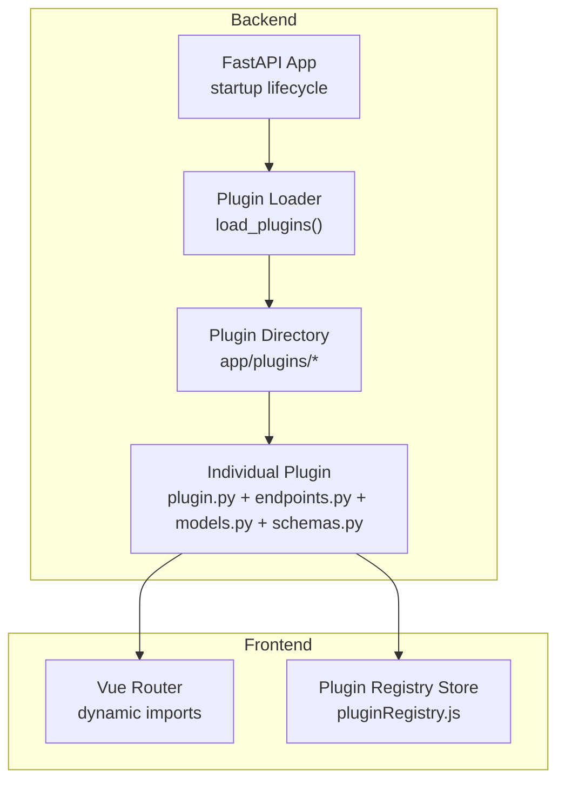
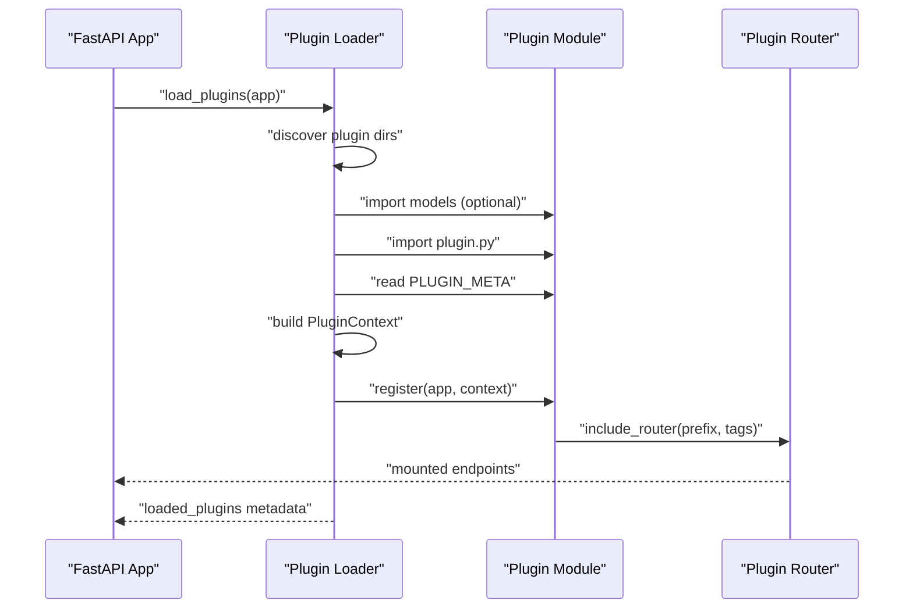
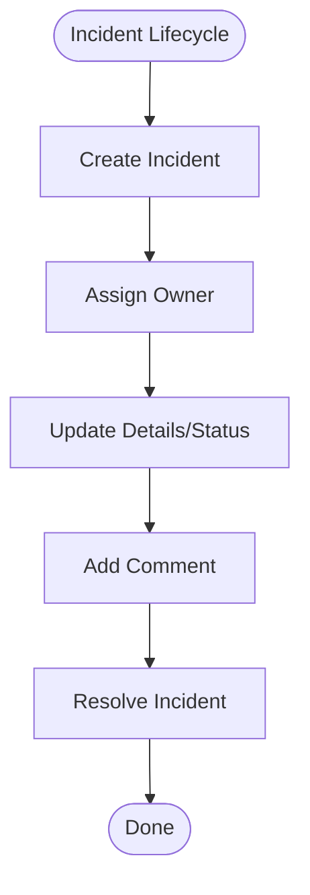
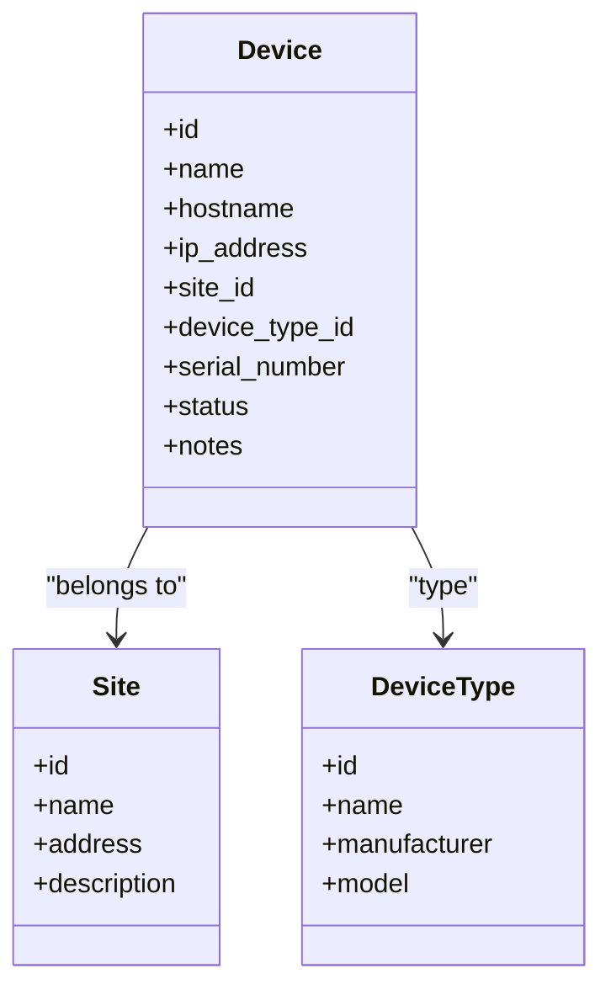
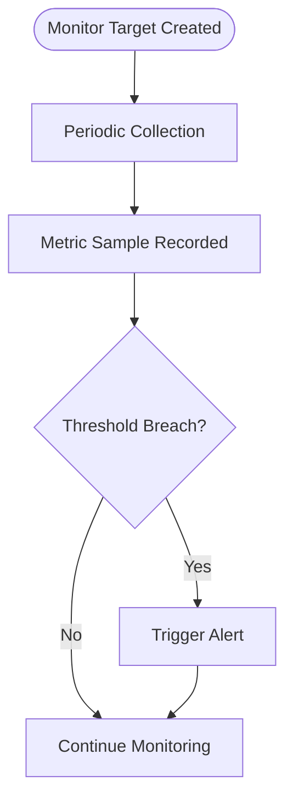
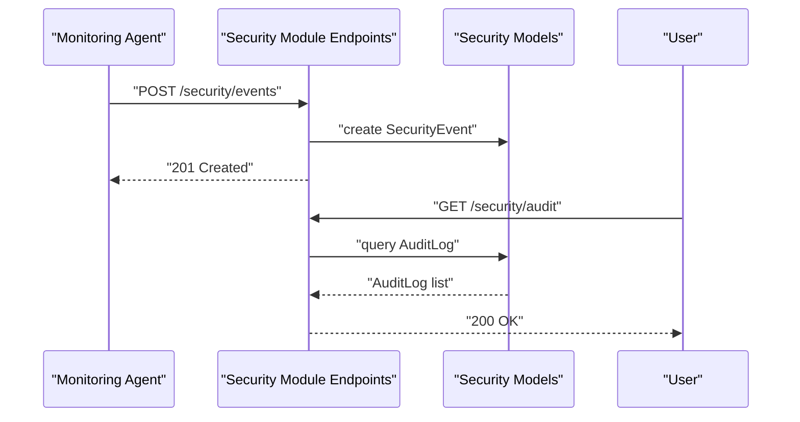
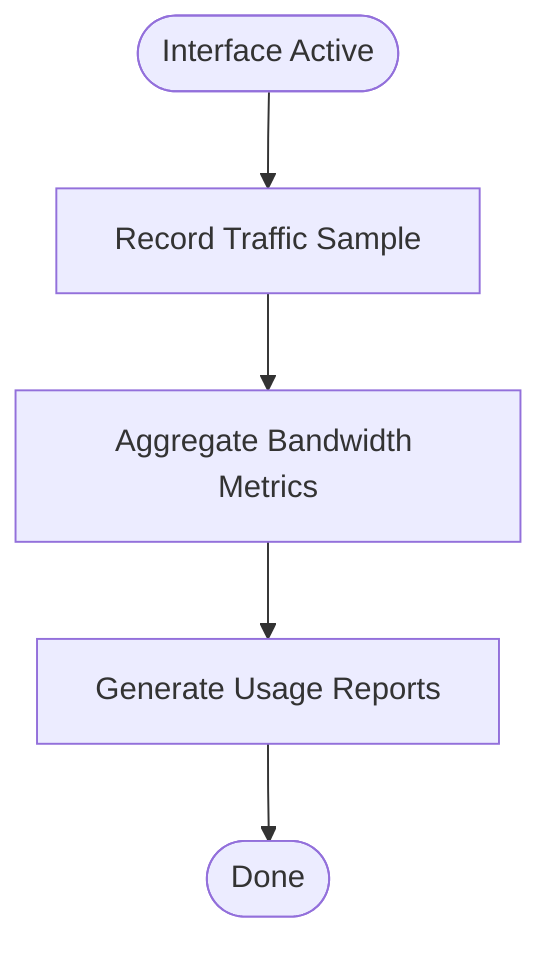
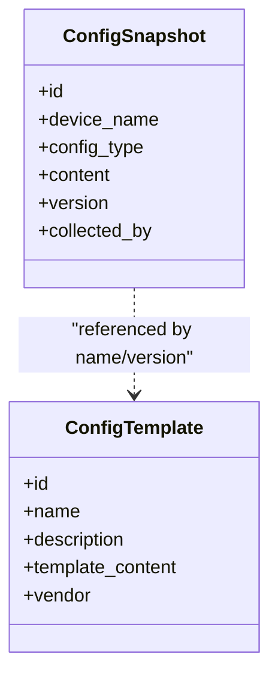
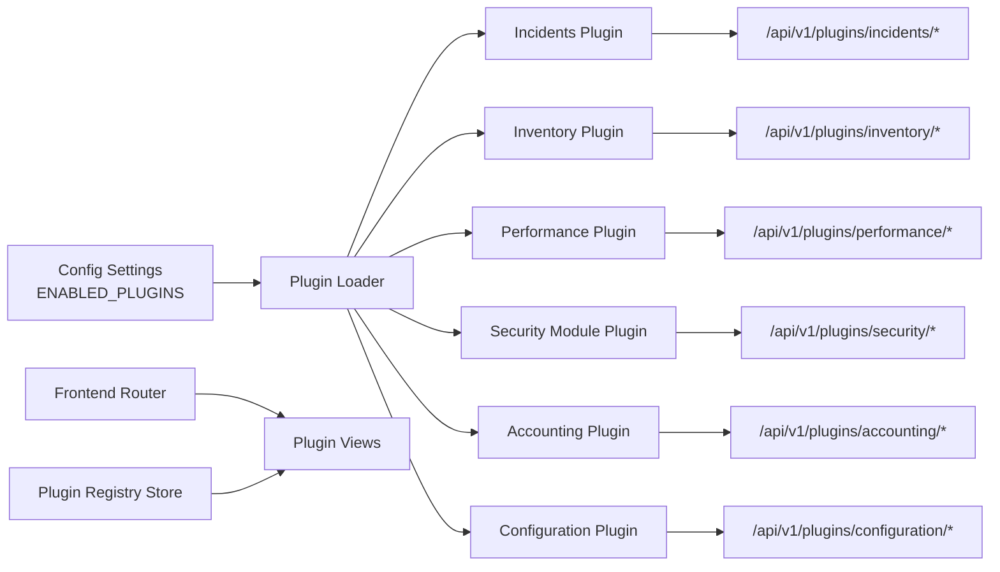

# Built-in Plugins

<cite>
**Referenced Files in This Document**
- [backend/app/main.py](file://backend/app/main.py)
- [backend/app/core/plugin_loader.py](file://backend/app/core/plugin_loader.py)
- [backend/app/core/config.py](file://backend/app/core/config.py)
- [backend/app/plugins/incidents/plugin.py](file://backend/app/plugins/incidents/plugin.py)
- [backend/app/plugins/incidents/endpoints.py](file://backend/app/plugins/incidents/endpoints.py)
- [backend/app/plugins/incidents/models.py](file://backend/app/plugins/incidents/models.py)
- [backend/app/plugins/incidents/schemas.py](file://backend/app/plugins/incidents/schemas.py)
- [backend/app/plugins/inventory/plugin.py](file://backend/app/plugins/inventory/plugin.py)
- [backend/app/plugins/inventory/endpoints.py](file://backend/app/plugins/inventory/endpoints.py)
- [backend/app/plugins/inventory/models.py](file://backend/app/plugins/inventory/models.py)
- [backend/app/plugins/inventory/schemas.py](file://backend/app/plugins/inventory/schemas.py)
- [backend/app/plugins/performance/plugin.py](file://backend/app/plugins/performance/plugin.py)
- [backend/app/plugins/performance/endpoints.py](file://backend/app/plugins/performance/endpoints.py)
- [backend/app/plugins/performance/models.py](file://backend/app/plugins/performance/models.py)
- [backend/app/plugins/performance/schemas.py](file://backend/app/plugins/performance/schemas.py)
- [backend/app/plugins/security_module/plugin.py](file://backend/app/plugins/security_module/plugin.py)
- [backend/app/plugins/security_module/endpoints.py](file://backend/app/plugins/security_module/endpoints.py)
- [backend/app/plugins/security_module/models.py](file://backend/app/plugins/security_module/models.py)
- [backend/app/plugins/security_module/schemas.py](file://backend/app/plugins/security_module/schemas.py)
- [backend/app/plugins/accounting/plugin.py](file://backend/app/plugins/accounting/plugin.py)
- [backend/app/plugins/accounting/endpoints.py](file://backend/app/plugins/accounting/endpoints.py)
- [backend/app/plugins/accounting/models.py](file://backend/app/plugins/accounting/models.py)
- [backend/app/plugins/accounting/schemas.py](file://backend/app/plugins/accounting/schemas.py)
- [backend/app/plugins/configuration/plugin.py](file://backend/app/plugins/configuration/plugin.py)
- [backend/app/plugins/configuration/endpoints.py](file://backend/app/plugins/configuration/endpoints.py)
- [backend/app/plugins/configuration/models.py](file://backend/app/plugins/configuration/models.py)
- [backend/app/plugins/configuration/schemas.py](file://backend/app/plugins/configuration/schemas.py)
- [frontend/src/router/index.js](file://frontend/src/router/index.js)
- [frontend/src/stores/pluginRegistry.js](file://frontend/src/stores/pluginRegistry.js)
</cite>

## Table of Contents
1. [Introduction](#introduction)
2. [Project Structure](#project-structure)
3. [Core Components](#core-components)
4. [Architecture Overview](#architecture-overview)
5. [Detailed Component Analysis](#detailed-component-analysis)
6. [Dependency Analysis](#dependency-analysis)
7. [Performance Considerations](#performance-considerations)
8. [Troubleshooting Guide](#troubleshooting-guide)
9. [Conclusion](#conclusion)

## Introduction
This document describes the six built-in plugins of the NOC Vision platform: Incidents, Inventory, Performance, Security Module, Accounting, and Configuration. It explains each plugin’s purpose, how they integrate with the core platform via a common plugin architecture, and how the frontend consumes these plugins. The goal is to help both developers and operators understand how the plugins extend the platform and contribute to network operations center (NOC) workflows.

## Project Structure
The NOC Vision backend organizes each plugin under a dedicated directory with consistent submodules:
- plugin.py: Defines metadata and registration hook
- endpoints.py: FastAPI routers exposing REST endpoints
- models.py: SQLAlchemy declarative models (optional per plugin)
- schemas.py: Pydantic models for request/response validation

The frontend integrates plugins through dynamic imports and routing, and maintains a registry of plugin-managed UI components.

**Diagram sources**
- [backend/app/main.py:17-48](file://backend/app/main.py#L17-L48)
- [backend/app/core/plugin_loader.py:25-99](file://backend/app/core/plugin_loader.py#L25-L99)
- [frontend/src/router/index.js:26-32](file://frontend/src/router/index.js#L26-L32)
- [frontend/src/stores/pluginRegistry.js:26-36](file://frontend/src/stores/pluginRegistry.js#L26-L36)

**Section sources**
- [backend/app/main.py:17-48](file://backend/app/main.py#L17-L48)
- [backend/app/core/plugin_loader.py:25-99](file://backend/app/core/plugin_loader.py#L25-L99)
- [frontend/src/router/index.js:26-32](file://frontend/src/router/index.js#L26-L32)
- [frontend/src/stores/pluginRegistry.js:26-36](file://frontend/src/stores/pluginRegistry.js#L26-L36)

## Core Components
- Plugin Loader: Discovers plugins, loads models, constructs a PluginContext, and invokes each plugin’s register function to mount its router under a plugin-scoped API prefix.
- Plugin Context: Provides database base, scoped API prefix, and reusable dependency functions (database session, current user, admin check) to all plugins.
- Plugin Registration Pattern: Each plugin exposes PLUGIN_META and a register(app, context) function. The loader ensures consistent mounting and metadata collection.
- Frontend Integration: Routes dynamically import plugin views and the Pinia plugin registry supports plugin-managed UI items.

Key behaviors:
- API prefixing: Each plugin is mounted under /api/v1/plugins/{plugin_name}, enabling clean separation and future expansion.
- Conditional loading: Plugins can be filtered by a configurable setting to enable only selected plugins.
- Model registration: Plugin models are imported early to register with the shared declarative base, ensuring database tables are created consistently.

**Section sources**
- [backend/app/core/plugin_loader.py:16-23](file://backend/app/core/plugin_loader.py#L16-L23)
- [backend/app/core/plugin_loader.py:69-76](file://backend/app/core/plugin_loader.py#L69-L76)
- [backend/app/core/plugin_loader.py:78-87](file://backend/app/core/plugin_loader.py#L78-L87)
- [backend/app/core/plugin_loader.py:34-48](file://backend/app/core/plugin_loader.py#L34-L48)
- [backend/app/plugins/incidents/plugin.py:1-17](file://backend/app/plugins/incidents/plugin.py#L1-L17)
- [backend/app/plugins/inventory/plugin.py:1-17](file://backend/app/plugins/inventory/plugin.py#L1-L17)
- [backend/app/plugins/performance/plugin.py:1-17](file://backend/app/plugins/performance/plugin.py#L1-L17)
- [backend/app/plugins/security_module/plugin.py:1-17](file://backend/app/plugins/security_module/plugin.py#L1-L17)
- [backend/app/plugins/accounting/plugin.py:1-17](file://backend/app/plugins/accounting/plugin.py#L1-L17)
- [backend/app/plugins/configuration/plugin.py:1-17](file://backend/app/plugins/configuration/plugin.py#L1-L17)

## Architecture Overview
The plugin architecture follows a shared pattern:
- Discovery and import: The loader iterates plugin directories, imports models first, then the plugin module.
- Validation: Ensures PLUGIN_META and register exist; otherwise skips with a warning.
- Context creation: Builds a PluginContext with database base, scoped API prefix, and dependency providers.
- Registration: Calls register(app, context) to include the plugin’s router with tags and prefix.
- Metadata reporting: Aggregates plugin info (name, version, description, status) for runtime introspection.

**Diagram sources**
- [backend/app/core/plugin_loader.py:25-99](file://backend/app/core/plugin_loader.py#L25-L99)
- [backend/app/plugins/incidents/plugin.py:9-17](file://backend/app/plugins/incidents/plugin.py#L9-L17)
- [backend/app/plugins/inventory/plugin.py:9-17](file://backend/app/plugins/inventory/plugin.py#L9-L17)
- [backend/app/plugins/performance/plugin.py:9-17](file://backend/app/plugins/performance/plugin.py#L9-L17)
- [backend/app/plugins/security_module/plugin.py:9-17](file://backend/app/plugins/security_module/plugin.py#L9-L17)
- [backend/app/plugins/accounting/plugin.py:9-17](file://backend/app/plugins/accounting/plugin.py#L9-L17)
- [backend/app/plugins/configuration/plugin.py:9-17](file://backend/app/plugins/configuration/plugin.py#L9-L17)

**Section sources**
- [backend/app/core/plugin_loader.py:25-99](file://backend/app/core/plugin_loader.py#L25-L99)
- [backend/app/main.py:25-27](file://backend/app/main.py#L25-L27)

## Detailed Component Analysis

### Incidents Plugin
Purpose: Network incident management including creation, assignment, updates, comments, and resolution tracking.

- Plugin metadata and registration: Declares identity and registers a router under the plugin-scoped API prefix with tags.
- Data models: Define incident records, statuses, assignments, and comments.
- Schemas: Pydantic models for creating/updating incidents and for comment creation/response.
- Endpoints: Expose CRUD and state transitions for incidents and related comment operations.

**Section sources**
- [backend/app/plugins/incidents/plugin.py:1-17](file://backend/app/plugins/incidents/plugin.py#L1-L17)
- [backend/app/plugins/incidents/schemas.py:6-36](file://backend/app/plugins/incidents/schemas.py#L6-L36)

### Inventory Plugin
Purpose: Equipment inventory management covering devices, sites, and device types.

- Plugin metadata and registration: Registers endpoints under a plugin-scoped prefix.
- Data models: Device, Site, and DeviceType entities with lifecycle and status fields.
- Schemas: Pydantic models for creating/updating and responding with inventory entities.
- Endpoints: Provide management APIs for devices, sites, and device types.

**Diagram sources**
- [backend/app/plugins/inventory/schemas.py:28-41](file://backend/app/plugins/inventory/schemas.py#L28-L41)
- [backend/app/plugins/inventory/schemas.py:50-57](file://backend/app/plugins/inventory/schemas.py#L50-L57)
- [backend/app/plugins/inventory/schemas.py:66-73](file://backend/app/plugins/inventory/schemas.py#L66-L73)

**Section sources**
- [backend/app/plugins/inventory/plugin.py:1-17](file://backend/app/plugins/inventory/plugin.py#L1-L17)
- [backend/app/plugins/inventory/schemas.py:6-74](file://backend/app/plugins/inventory/schemas.py#L6-L74)

### Performance Plugin
Purpose: Network performance monitoring including monitor targets, metrics sampling, and threshold-aware alerts.

- Plugin metadata and registration: Registers endpoints under a plugin-scoped prefix.
- Data models: Monitor targets and metric samples with timestamps and units.
- Schemas: Pydantic models for creating monitor targets and responding with metric samples.
- Endpoints: Expose target management and metric retrieval APIs.

**Section sources**
- [backend/app/plugins/performance/plugin.py:1-17](file://backend/app/plugins/performance/plugin.py#L1-L17)
- [backend/app/plugins/performance/schemas.py:6-37](file://backend/app/plugins/performance/schemas.py#L6-L37)

### Security Module Plugin
Purpose: Security event monitoring, audit logging, and access tracking.

- Plugin metadata and registration: Registers endpoints under a plugin-scoped prefix.
- Data models: Security events and audit logs with severity, IP, and resource identifiers.
- Schemas: Pydantic models for creating security events and responding with audit records.
- Endpoints: Provide APIs for event ingestion and audit log queries.

**Diagram sources**
- [backend/app/plugins/security_module/schemas.py:6-16](file://backend/app/plugins/security_module/schemas.py#L6-L16)
- [backend/app/plugins/security_module/schemas.py:19-35](file://backend/app/plugins/security_module/schemas.py#L19-L35)

**Section sources**
- [backend/app/plugins/security_module/plugin.py:1-17](file://backend/app/plugins/security_module/plugin.py#L1-L17)
- [backend/app/plugins/security_module/schemas.py:6-36](file://backend/app/plugins/security_module/schemas.py#L6-L36)

### Accounting Plugin
Purpose: Traffic accounting for interfaces, including ingress/egress bytes and packet counters.

- Plugin metadata and registration: Registers endpoints under a plugin-scoped prefix.
- Data models: Interfaces and traffic records with timestamps.
- Schemas: Pydantic models for interface creation/response and traffic record response.
- Endpoints: Provide interface management and traffic record retrieval.

**Section sources**
- [backend/app/plugins/accounting/plugin.py:1-17](file://backend/app/plugins/accounting/plugin.py#L1-L17)
- [backend/app/plugins/accounting/schemas.py:6-35](file://backend/app/plugins/accounting/schemas.py#L6-L35)

### Configuration Plugin
Purpose: Configuration management including device configuration snapshots and reusable templates.

- Plugin metadata and registration: Registers endpoints under a plugin-scoped prefix.
- Data models: Configuration snapshots and templates with metadata and vendor support.
- Schemas: Pydantic models for creating snapshots/templates and responding with records.
- Endpoints: Expose snapshot capture, template management, and retrieval APIs.

**Diagram sources**
- [backend/app/plugins/configuration/schemas.py:14-23](file://backend/app/plugins/configuration/schemas.py#L14-L23)
- [backend/app/plugins/configuration/schemas.py:33-42](file://backend/app/plugins/configuration/schemas.py#L33-L42)

**Section sources**
- [backend/app/plugins/configuration/plugin.py:1-17](file://backend/app/plugins/configuration/plugin.py#L1-L17)
- [backend/app/plugins/configuration/schemas.py:6-43](file://backend/app/plugins/configuration/schemas.py#L6-L43)

## Dependency Analysis
Shared integration points:
- Backend plugin loader depends on settings for enabled plugins and mounts routers with a consistent API prefix derived from the plugin name.
- Each plugin depends on the shared declarative base for model registration and on the shared dependency providers for database sessions and user context.
- Frontend routes dynamically import plugin views and the plugin registry store aggregates plugin-managed UI items for navigation.

**Diagram sources**
- [backend/app/core/plugin_loader.py:34-48](file://backend/app/core/plugin_loader.py#L34-L48)
- [backend/app/core/plugin_loader.py:70-76](file://backend/app/core/plugin_loader.py#L70-L76)
- [frontend/src/router/index.js:26-32](file://frontend/src/router/index.js#L26-L32)
- [frontend/src/stores/pluginRegistry.js:26-36](file://frontend/src/stores/pluginRegistry.js#L26-L36)

**Section sources**
- [backend/app/core/plugin_loader.py:34-48](file://backend/app/core/plugin_loader.py#L34-L48)
- [backend/app/core/plugin_loader.py:70-76](file://backend/app/core/plugin_loader.py#L70-L76)
- [frontend/src/router/index.js:114-144](file://frontend/src/router/index.js#L114-L144)
- [frontend/src/stores/pluginRegistry.js:8-20](file://frontend/src/stores/pluginRegistry.js#L8-L20)

## Performance Considerations
- Plugin discovery and import occur during startup; keep plugin directories minimal and avoid heavy imports in plugin initialization.
- API prefixing reduces route conflicts and simplifies monitoring; ensure consistent tag usage for endpoint grouping.
- Model registration occurs before and after plugin loading to accommodate late-added models; maintain backward compatibility for schema changes.
- Frontend lazy-loading of plugin views reduces initial bundle size; ensure plugin views are optimized and use pagination for large datasets.

## Troubleshooting Guide
Common issues and resolutions:
- Plugin not loaded: Verify the plugin directory contains plugin.py with PLUGIN_META and register; confirm ENABLED_PLUGINS includes the plugin name if filtering is active.
- Missing endpoints: Confirm register(app, context) is invoked with the correct prefix and tags; ensure endpoints.py exports a router.
- Database errors: Ensure plugin models are imported so they bind to the shared declarative base; check migrations or table creation order.
- Frontend navigation: Confirm the route path matches the plugin name and the view is lazily imported; verify the plugin registry manifest is registered.

Operational checks:
- Health endpoint: Use the health check to validate service availability.
- Plugin listing: Retrieve loaded plugins from the runtime state to confirm successful registration.

**Section sources**
- [backend/app/core/plugin_loader.py:63-67](file://backend/app/core/plugin_loader.py#L63-L67)
- [backend/app/main.py:84-87](file://backend/app/main.py#L84-L87)

## Conclusion
The six built-in plugins—Incidents, Inventory, Performance, Security Module, Accounting, and Configuration—extend the NOC Vision platform by implementing a consistent plugin architecture. They share a common registration pattern, API prefixing, and dependency injection, enabling modular growth and maintainability. The frontend integrates seamlessly through dynamic imports and a centralized plugin registry, delivering a cohesive user experience across all operational domains.