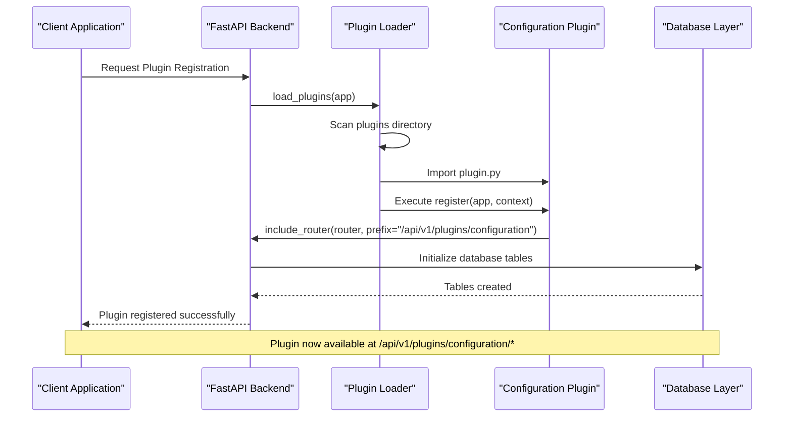
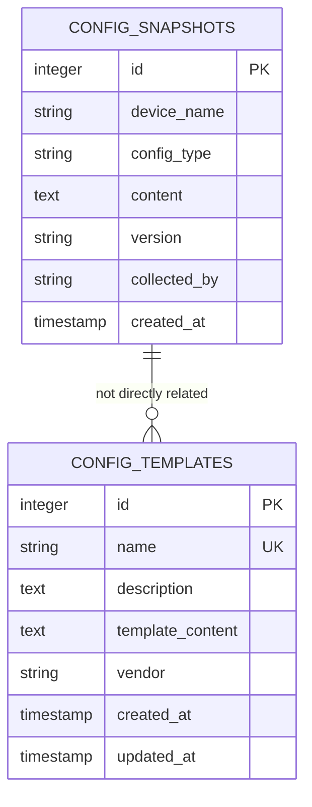
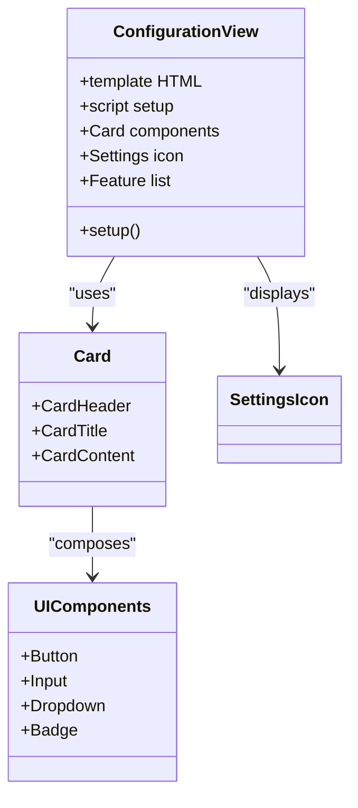
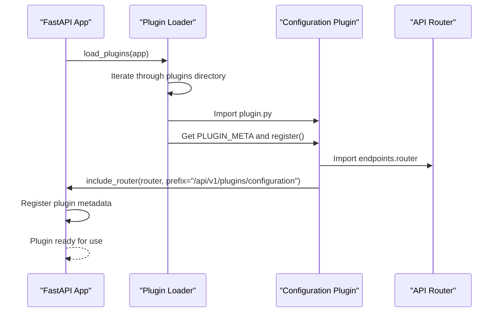
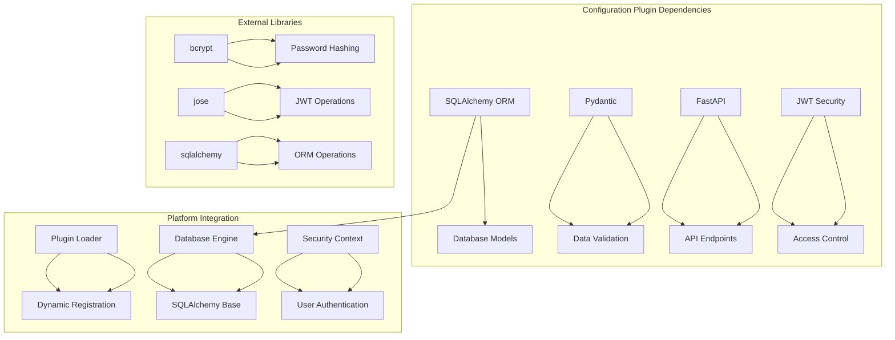

# Configuration Plugin

<cite>
**Referenced Files in This Document**
- [plugin.py](file://backend/app/plugins/configuration/plugin.py)
- [models.py](file://backend/app/plugins/configuration/models.py)
- [schemas.py](file://backend/app/plugins/configuration/schemas.py)
- [endpoints.py](file://backend/app/plugins/configuration/endpoints.py)
- [plugin_loader.py](file://backend/app/core/plugin_loader.py)
- [main.py](file://backend/app/main.py)
- [router.py](file://backend/app/api/v1/router.py)
- [database.py](file://backend/app/core/database.py)
- [security.py](file://backend/app/core/security.py)
- [Configuration.vue](file://frontend/src/plugins/configuration/views/Configuration.vue)
- [README.md](file://README.md)
</cite>

## Table of Contents
1. [Introduction](#introduction)
2. [Project Structure](#project-structure)
3. [Core Components](#core-components)
4. [Architecture Overview](#architecture-overview)
5. [Detailed Component Analysis](#detailed-component-analysis)
6. [Dependency Analysis](#dependency-analysis)
7. [Performance Considerations](#performance-considerations)
8. [Troubleshooting Guide](#troubleshooting-guide)
9. [Conclusion](#conclusion)
10. [Appendices](#appendices)

## Introduction
The Configuration Plugin is a built-in plugin within the NOC Vision platform that provides network device configuration management capabilities. It enables the capture, storage, and retrieval of device configuration snapshots, along with template-based configuration management. The plugin follows the platform's plugin architecture, integrating seamlessly with the FastAPI backend and Vue.js frontend.

The plugin currently implements core functionality for:
- Configuration snapshot management (capturing device configurations)
- Template-based configuration management
- Basic change tracking through versioning
- Role-based access control for administrative operations

## Project Structure
The Configuration Plugin is organized within the backend's plugin system, following a standardized structure that includes metadata, database models, Pydantic schemas, API endpoints, and frontend views.

```mermaid
graph TB
subgraph "Backend Structure"
A[backend/] --> B[app/]
B --> C[plugins/]
C --> D[configuration/]
D --> E[plugin.py]
D --> F[models.py]
D --> G[schemas.py]
D --> H[endpoints.py]
subgraph "Core System"
I[main.py]
J[core/]
K[plugin_loader.py]
L[database.py]
M[security.py]
end
I --> J
J --> K
J --> L
J --> M
end
subgraph "Frontend Structure"
N[frontend/] --> O[src/]
O --> P[plugins/]
P --> Q[configuration/]
Q --> R[views/]
R --> S[Configuration.vue]
end
T[API Routes] --> U[/api/v1/plugins/configuration]
V[Plugin Loader] --> W[Dynamic Plugin Registration]
```

**Diagram sources**
- [plugin.py:1-17](file://backend/app/plugins/configuration/plugin.py#L1-L17)
- [plugin_loader.py:25-100](file://backend/app/core/plugin_loader.py#L25-L100)
- [main.py:1-87](file://backend/app/main.py#L1-L87)

**Section sources**
- [README.md:1-31](file://README.md#L1-L31)
- [plugin.py:1-17](file://backend/app/plugins/configuration/plugin.py#L1-L17)
- [plugin_loader.py:25-100](file://backend/app/core/plugin_loader.py#L25-L100)

## Core Components
The Configuration Plugin consists of four primary components that work together to provide configuration management functionality:

### Data Models
The plugin defines two core database models:
- **ConfigSnapshot**: Represents captured device configurations with metadata
- **ConfigTemplate**: Stores reusable configuration templates with versioning support

### API Endpoints
The plugin exposes REST endpoints for:
- Listing and retrieving configuration snapshots
- Creating new configuration snapshots
- Managing configuration templates

### Pydantic Schemas
Validation and serialization are handled through Pydantic models that define request/response structures for both snapshots and templates.

### Frontend Integration
The Vue.js frontend provides a dedicated view component for configuration management, following the platform's component library patterns.

**Section sources**
- [models.py:1-28](file://backend/app/plugins/configuration/models.py#L1-L28)
- [schemas.py:1-43](file://backend/app/plugins/configuration/schemas.py#L1-L43)
- [endpoints.py:1-71](file://backend/app/plugins/configuration/endpoints.py#L1-L71)
- [Configuration.vue:1-34](file://frontend/src/plugins/configuration/views/Configuration.vue#L1-L34)

## Architecture Overview
The Configuration Plugin follows the NOC Vision platform's plugin architecture, which provides a standardized approach to extending functionality while maintaining consistency across the system.



**Diagram sources**
- [plugin_loader.py:25-100](file://backend/app/core/plugin_loader.py#L25-L100)
- [plugin.py:9-17](file://backend/app/plugins/configuration/plugin.py#L9-L17)
- [main.py:25-30](file://backend/app/main.py#L25-L30)

The plugin architecture ensures:
- **Dynamic Loading**: Plugins are discovered and loaded at runtime
- **Standardized Prefixes**: Each plugin gets a unique API endpoint prefix
- **Consistent Dependencies**: Plugins receive standardized context objects
- **Database Integration**: Plugin models are automatically registered with the database

**Section sources**
- [plugin_loader.py:16-23](file://backend/app/core/plugin_loader.py#L16-L23)
- [plugin_loader.py:50-79](file://backend/app/core/plugin_loader.py#L50-L79)
- [plugin.py:9-17](file://backend/app/plugins/configuration/plugin.py#L9-L17)

## Detailed Component Analysis

### Database Models Analysis
The Configuration Plugin implements two primary data models that form the foundation of configuration management:



**Diagram sources**
- [models.py:6-27](file://backend/app/plugins/configuration/models.py#L6-L27)

#### ConfigSnapshot Model
The ConfigSnapshot model captures device configuration data with the following key attributes:
- **device_name**: Identifies the network device
- **config_type**: Specifies configuration type (running/startup)
- **content**: Contains the actual configuration data
- **version**: Supports version tracking for change management
- **collected_by**: Records who captured the configuration
- **created_at**: Timestamp of when the snapshot was taken

#### ConfigTemplate Model
The ConfigTemplate model provides template-based configuration management:
- **name**: Unique identifier for the template
- **description**: Human-readable template description
- **template_content**: The actual template content
- **vendor**: Optional vendor-specific information
- **created_at/updated_at**: Timestamps for creation and modification

**Section sources**
- [models.py:6-27](file://backend/app/plugins/configuration/models.py#L6-L27)

### API Endpoints Implementation
The plugin exposes a RESTful API with endpoints for both snapshots and templates:

```mermaid
flowchart TD
A["Client Request"] --> B{"Endpoint Type"}
B --> |GET /snapshots| C["List Snapshots"]
B --> |POST /snapshots| D["Create Snapshot"]
B --> |GET /snapshots/{id}| E["Get Snapshot"]
B --> |GET /templates| F["List Templates"]
B --> |POST /templates| G["Create Template"]
C --> H["Query Database"]
D --> I["Validate Admin Access"]
E --> J["Find Specific Snapshot"]
F --> K["Query All Templates"]
G --> L["Validate Admin Access"]
H --> M["Return JSON Response"]
I --> N["Create Snapshot Record"]
J --> M
K --> M
L --> O["Create Template Record"]
N --> M
O --> M
```

**Diagram sources**
- [endpoints.py:17-71](file://backend/app/plugins/configuration/endpoints.py#L17-L71)

#### Endpoint Security and Access Control
The API implements role-based access control:
- **Snapshots**: Read access for authenticated users, write access for administrators
- **Templates**: Read access for authenticated users, write access for administrators
- **Authentication**: Uses JWT tokens with OAuth2 password bearer scheme
- **Authorization**: Admin-only operations require admin role verification

**Section sources**
- [endpoints.py:17-71](file://backend/app/plugins/configuration/endpoints.py#L17-L71)
- [security.py:82-98](file://backend/app/core/security.py#L82-L98)

### Frontend Component Analysis
The Vue.js frontend provides a structured component for configuration management:



**Diagram sources**
- [Configuration.vue:1-34](file://frontend/src/plugins/configuration/views/Configuration.vue#L1-L34)

The frontend component follows the platform's design patterns:
- **Component Library**: Uses shared UI components (Card, Button, Input)
- **Responsive Design**: Adapts to different screen sizes
- **Accessibility**: Implements proper semantic HTML
- **Future Extensibility**: Provides placeholder areas for future features

**Section sources**
- [Configuration.vue:1-34](file://frontend/src/plugins/configuration/views/Configuration.vue#L1-L34)

### Plugin Registration and Integration
The plugin integrates with the platform through a standardized registration process:



**Diagram sources**
- [plugin_loader.py:50-79](file://backend/app/core/plugin_loader.py#L50-L79)
- [plugin.py:9-17](file://backend/app/plugins/configuration/plugin.py#L9-L17)

**Section sources**
- [plugin_loader.py:25-100](file://backend/app/core/plugin_loader.py#L25-L100)
- [plugin.py:1-17](file://backend/app/plugins/configuration/plugin.py#L1-L17)

## Dependency Analysis
The Configuration Plugin has minimal external dependencies, relying primarily on the platform's core infrastructure:



**Diagram sources**
- [models.py:1-3](file://backend/app/plugins/configuration/models.py#L1-L3)
- [schemas.py:1-3](file://backend/app/plugins/configuration/schemas.py#L1-L3)
- [endpoints.py:1-12](file://backend/app/plugins/configuration/endpoints.py#L1-L12)
- [security.py:1-11](file://backend/app/core/security.py#L1-L11)

### Internal Dependencies
The plugin maintains clean internal dependencies:
- **Models**: Define database structure and relationships
- **Schemas**: Handle data validation and serialization
- **Endpoints**: Expose REST API functionality
- **Plugin Meta**: Provide registration metadata

### External Dependencies
The plugin relies on platform-provided services:
- **Database**: SQLAlchemy ORM for persistence
- **Security**: JWT-based authentication and authorization
- **API Framework**: FastAPI for routing and request handling
- **Plugin System**: Dynamic loading and registration infrastructure

**Section sources**
- [models.py:1-3](file://backend/app/plugins/configuration/models.py#L1-L3)
- [schemas.py:1-3](file://backend/app/plugins/configuration/schemas.py#L1-L3)
- [endpoints.py:1-12](file://backend/app/plugins/configuration/endpoints.py#L1-L12)
- [security.py:1-11](file://backend/app/core/security.py#L1-L11)

## Performance Considerations
The Configuration Plugin is designed with performance and scalability in mind:

### Database Optimization
- **Indexing**: Primary keys are automatically indexed by SQLAlchemy
- **Text Storage**: Configuration content uses TEXT type for large data
- **Timestamps**: Efficient timestamp storage with timezone support
- **Connection Pooling**: Leverages SQLAlchemy's connection pooling

### API Performance
- **Pagination**: Snapshot listing supports pagination parameters
- **Selective Fields**: Response models minimize data transfer
- **Caching Opportunities**: Template content can benefit from caching
- **Batch Operations**: Future enhancements could support bulk operations

### Memory Management
- **Session Management**: Proper database session lifecycle
- **Resource Cleanup**: Automatic resource disposal on shutdown
- **Lazy Loading**: Database relationships configured appropriately

## Troubleshooting Guide

### Common Issues and Solutions

#### Plugin Not Loading
**Symptoms**: Plugin appears in plugin list but endpoints unavailable
**Causes**: Missing plugin.py, incorrect metadata, import errors
**Solutions**: 
- Verify plugin.py exists in plugin directory
- Check PLUGIN_META dictionary completeness
- Ensure register() function signature matches expectations

#### Database Connection Problems
**Symptoms**: Plugin loads but database operations fail
**Causes**: Incorrect database configuration, missing tables
**Solutions**:
- Verify DATABASE_URL in environment variables
- Ensure database is accessible and running
- Check table creation during startup

#### Authentication Failures
**Symptoms**: 401/403 errors on plugin endpoints
**Causes**: Invalid JWT tokens, insufficient permissions
**Solutions**:
- Verify JWT token validity and expiration
- Check user role assignment (admin required for writes)
- Confirm SECRET_KEY configuration matches backend

#### API Endpoint Access Issues
**Symptoms**: 404 errors for plugin endpoints
**Causes**: Incorrect API prefix, route registration failures
**Solutions**:
- Verify plugin registration in plugin_loader.py
- Check API prefix format (/api/v1/plugins/{plugin_name})
- Ensure plugin directory structure is correct

**Section sources**
- [plugin_loader.py:89-97](file://backend/app/core/plugin_loader.py#L89-L97)
- [plugin.py:9-17](file://backend/app/plugins/configuration/plugin.py#L9-L17)
- [security.py:61-98](file://backend/app/core/security.py#L61-L98)

## Conclusion
The Configuration Plugin represents a well-architected component within the NOC Vision platform, providing essential network device configuration management capabilities. The plugin demonstrates strong adherence to the platform's architectural principles, including:

- **Modular Design**: Clean separation of concerns with distinct models, schemas, and endpoints
- **Security Integration**: Seamless integration with the platform's JWT-based authentication system
- **Extensibility**: Designed to accommodate future enhancements like change approval workflows and rollback mechanisms
- **Standards Compliance**: Follows FastAPI and SQLAlchemy best practices

The current implementation establishes a solid foundation for configuration management, with room for expansion to include advanced features such as:
- Full change approval workflows
- Automated deployment scheduling
- Configuration comparison and diffing
- Integration with network device management systems
- Advanced template versioning and dependency management

## Appendices

### API Reference

#### Configuration Snapshots
- **GET** `/api/v1/plugins/configuration/snapshots` - List all snapshots
- **POST** `/api/v1/plugins/configuration/snapshots` - Create new snapshot
- **GET** `/api/v1/plugins/configuration/snapshots/{id}` - Get specific snapshot

#### Configuration Templates  
- **GET** `/api/v1/plugins/configuration/templates` - List all templates
- **POST** `/api/v1/plugins/configuration/templates` - Create new template

### Data Model Specifications

#### ConfigSnapshot Schema
- **id**: Integer (primary key)
- **device_name**: String (100 chars max)
- **config_type**: String (50 chars max, default: "running")
- **content**: Text (required)
- **version**: String (50 chars max, optional)
- **collected_by**: String (50 chars max, optional)
- **created_at**: DateTime (auto-generated)

#### ConfigTemplate Schema
- **id**: Integer (primary key)
- **name**: String (100 chars max, unique)
- **description**: Text (optional)
- **template_content**: Text (required)
- **vendor**: String (50 chars max, optional)
- **created_at**: DateTime (auto-generated)
- **updated_at**: DateTime (auto-updated)

### Security Considerations
- **Admin-Only Operations**: Template creation and snapshot creation require admin privileges
- **Authenticated Access**: All operations require valid JWT authentication
- **Role-Based Permissions**: Fine-grained access control based on user roles
- **Data Validation**: Comprehensive input validation using Pydantic models