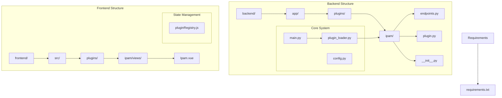
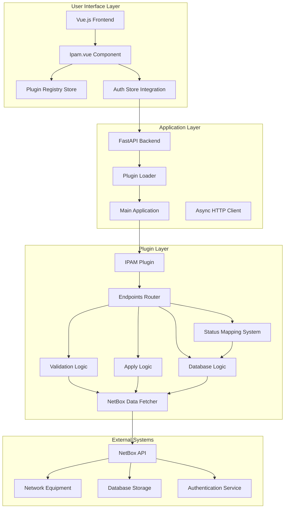
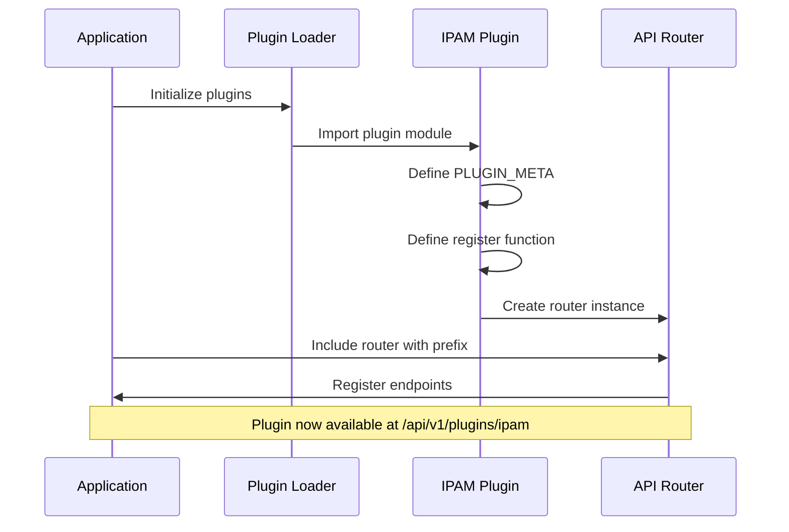
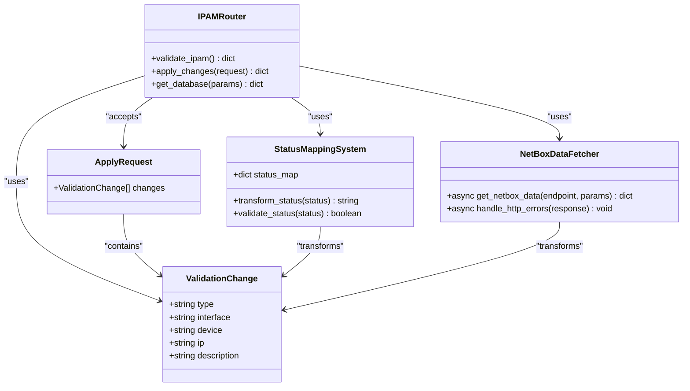
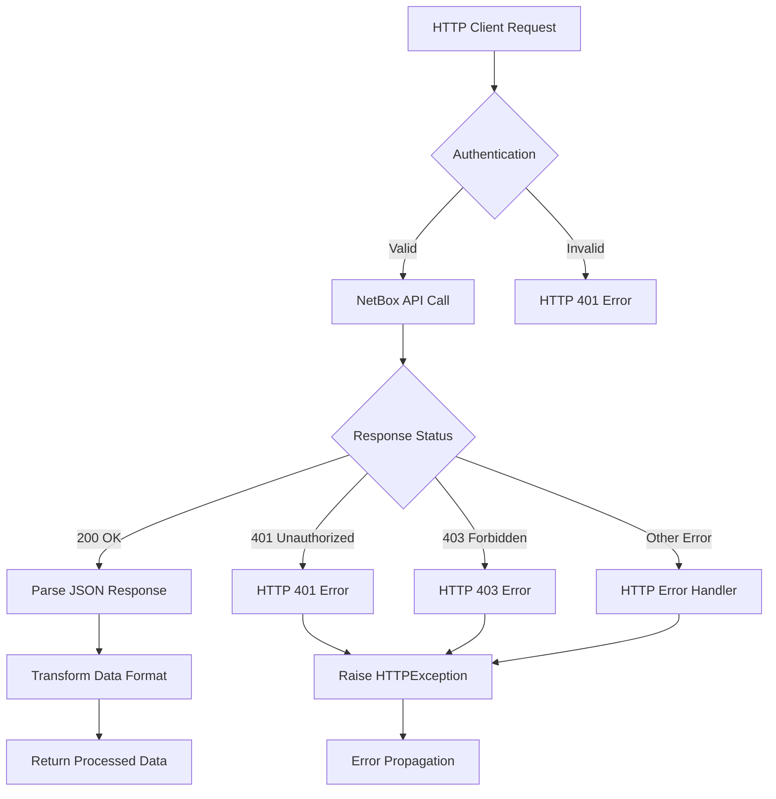
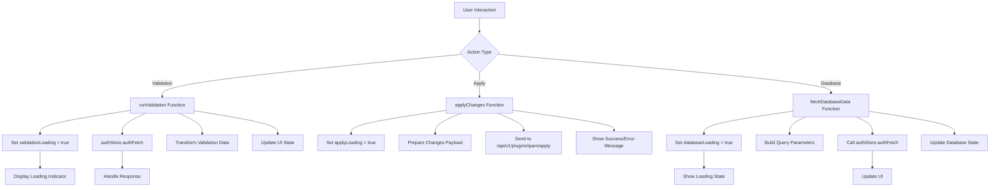
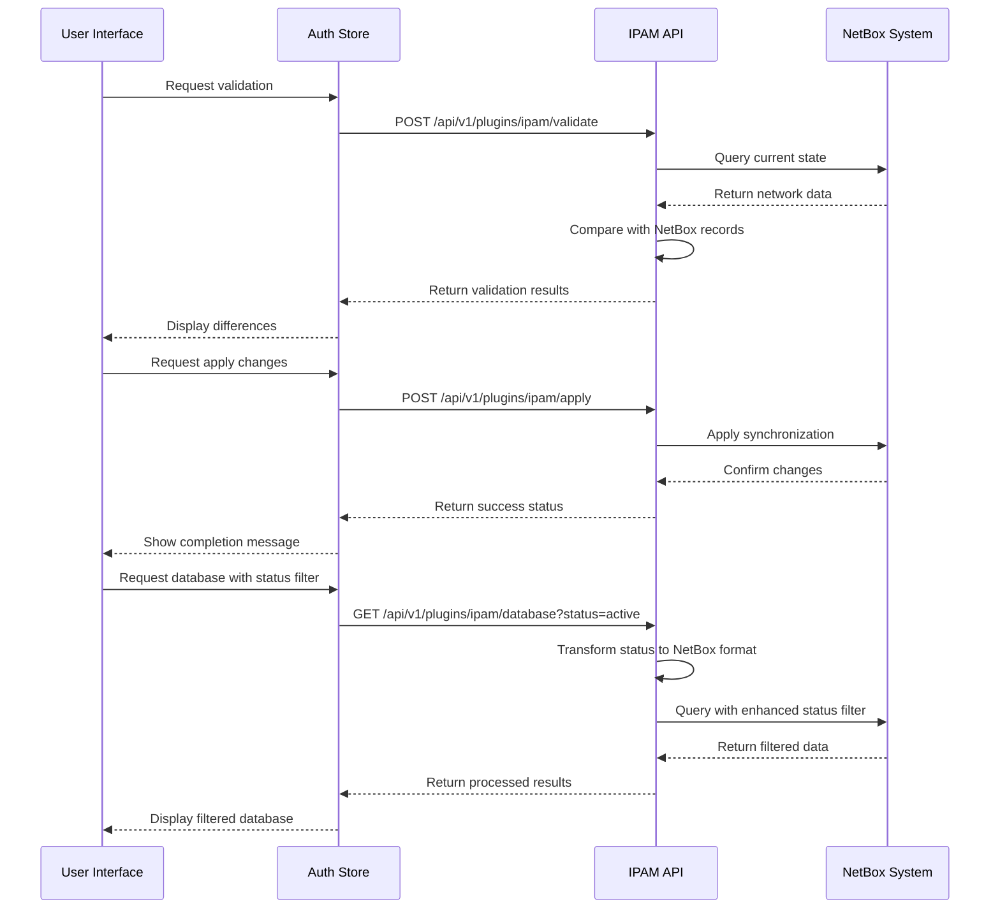
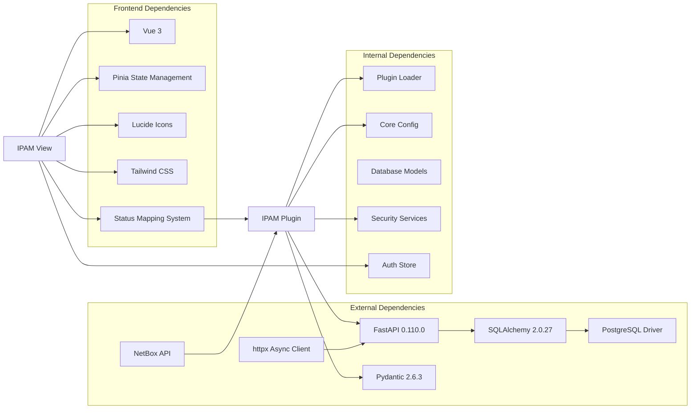

# IPAM Plugin

<cite>
**Referenced Files in This Document**
- [plugin.py](file://backend/app/plugins/ipam/plugin.py)
- [endpoints.py](file://backend/app/plugins/ipam/endpoints.py)
- [plugin_loader.py](file://backend/app/core/plugin_loader.py)
- [main.py](file://backend/app/main.py)
- [config.py](file://backend/app/core/config.py)
- [router.py](file://backend/app/api/v1/router.py)
- [Ipam.vue](file://frontend/src/plugins/ipam/views/Ipam.vue)
- [pluginRegistry.js](file://frontend/src/stores/pluginRegistry.js)
- [README.md](file://README.md)
- [requirements.txt](file://backend/requirements.txt)
</cite>

## Update Summary
**Changes Made**
- Updated to reflect Applied Changes: Enhanced status filtering with comprehensive status mapping (active, reserved, deprecated, dhcp) and improved validation logic
- Added loading state management for search operations to prevent concurrent requests and improve user experience
- Enhanced database filtering capabilities with comprehensive status mapping and improved error handling
- Improved frontend user experience with loading indicators, better status visualization, and enhanced filtering

## Table of Contents
1. [Introduction](#introduction)
2. [Project Structure](#project-structure)
3. [Core Components](#core-components)
4. [Architecture Overview](#architecture-overview)
5. [Detailed Component Analysis](#detailed-component-analysis)
6. [Dependency Analysis](#dependency-analysis)
7. [Performance Considerations](#performance-considerations)
8. [Troubleshooting Guide](#troubleshooting-guide)
9. [Conclusion](#conclusion)

## Introduction
The IPAM (IP Address Management) plugin integrates with NetBox to validate and manage IP addresses within the NOC Vision platform. This production-ready implementation provides comprehensive IP address management capabilities with real-time data synchronization, enhanced status filtering, and robust error handling. The plugin follows the platform's modular plugin architecture, enabling dynamic loading and seamless integration with the broader NOC Vision ecosystem.

The plugin exposes three primary endpoints:
- **Validation endpoint** to compare NetBox data with real network state
- **Apply endpoint** to synchronize changes in NetBox  
- **Database endpoint** to retrieve IP address records with comprehensive filtering including enhanced status mapping

These endpoints support both administrative operations and operational monitoring, with advanced filtering and sorting capabilities for database queries, real-time data fetching, and production-grade error handling with improved status validation logic.

## Project Structure
The IPAM plugin is structured within the NOC Vision plugin architecture, following a consistent pattern across all built-in plugins. The structure consists of backend components (FastAPI endpoints and plugin registration) and frontend components (Vue.js views and state management).



**Diagram sources**
- [plugin.py](file://backend/app/plugins/ipam/plugin.py)
- [endpoints.py](file://backend/app/plugins/ipam/endpoints.py)
- [plugin_loader.py](file://backend/app/core/plugin_loader.py)
- [main.py](file://backend/app/main.py)
- [Ipam.vue](file://frontend/src/plugins/ipam/views/Ipam.vue)
- [pluginRegistry.js](file://frontend/src/stores/pluginRegistry.js)
- [requirements.txt](file://backend/requirements.txt)

**Section sources**
- [README.md](file://README.md)
- [plugin.py](file://backend/app/plugins/ipam/plugin.py)
- [endpoints.py](file://backend/app/plugins/ipam/endpoints.py)
- [plugin_loader.py](file://backend/app/core/plugin_loader.py)
- [main.py](file://backend/app/main.py)

## Core Components
The IPAM plugin consists of several key components that work together to provide comprehensive IP address management functionality:

### Backend Components
- **Plugin Registration**: Defines plugin metadata and registers API routes with proper context handling
- **API Endpoints**: Provides validation, apply, and database retrieval functionality with comprehensive error handling and enhanced status filtering
- **HTTP Client Integration**: Real-time data fetching from NetBox API with authentication and timeout management
- **Data Models**: Pydantic models for request/response validation with type safety
- **Async Processing**: Asynchronous operations for improved performance and scalability
- **Status Mapping System**: Comprehensive status mapping for NetBox integration (active, reserved, deprecated, dhcp)

### Frontend Components
- **Vue.js View**: Interactive interface for IPAM operations with comprehensive state management and loading indicators
- **State Management**: Integration with the plugin registry system and authentication store
- **Advanced Filtering**: Real-time search, sorting, and filtering capabilities with enhanced status filtering
- **Loading State Management**: Comprehensive loading indicators for search operations to prevent concurrent requests
- **Status Visualization**: Enhanced status display with color-coded indicators for different IP address states
- **Pagination Support**: Efficient data loading with configurable page sizes
- **Error Handling**: Comprehensive user feedback and error recovery mechanisms

### Core System Integration
- **Dynamic Plugin Loading**: Automatic discovery and registration of plugins with context injection
- **API Prefix Management**: Consistent URL routing for plugin endpoints with versioning
- **Configuration Management**: Environment-based plugin enablement and NetBox integration
- **Security Integration**: Authentication and authorization through shared security services

**Section sources**
- [plugin.py](file://backend/app/plugins/ipam/plugin.py)
- [endpoints.py](file://backend/app/plugins/ipam/endpoints.py)
- [plugin_loader.py](file://backend/app/core/plugin_loader.py)
- [Ipam.vue](file://frontend/src/plugins/ipam/views/Ipam.vue)

## Architecture Overview
The IPAM plugin follows a distributed architecture pattern that separates concerns between validation, synchronization, and data retrieval operations. The system maintains loose coupling between components while ensuring robust integration with external systems through comprehensive HTTP client integration and enhanced status filtering.



**Diagram sources**
- [main.py](file://backend/app/main.py)
- [plugin_loader.py](file://backend/app/core/plugin_loader.py)
- [plugin.py](file://backend/app/plugins/ipam/plugin.py)
- [endpoints.py](file://backend/app/plugins/ipam/endpoints.py)
- [Ipam.vue](file://frontend/src/plugins/ipam/views/Ipam.vue)

The architecture ensures scalability and maintainability through clear separation of concerns. Each component has specific responsibilities, enabling independent development and testing while maintaining system coherence. The asynchronous design supports real-time data fetching and improved user experience with comprehensive loading state management.

**Section sources**
- [main.py](file://backend/app/main.py)
- [plugin_loader.py](file://backend/app/core/plugin_loader.py)
- [plugin.py](file://backend/app/plugins/ipam/plugin.py)

## Detailed Component Analysis

### Plugin Registration System
The IPAM plugin uses a standardized registration pattern that enables automatic discovery and integration with the main application. The registration process involves metadata definition and route inclusion with proper API prefixing and context injection.



**Diagram sources**
- [plugin_loader.py](file://backend/app/core/plugin_loader.py)
- [plugin.py](file://backend/app/plugins/ipam/plugin.py)

The registration system supports dynamic plugin loading, allowing administrators to enable or disable specific plugins through configuration. The context injection provides database access, authentication services, and API prefix management for consistent URL routing.

**Section sources**
- [plugin.py](file://backend/app/plugins/ipam/plugin.py)
- [plugin_loader.py](file://backend/app/core/plugin_loader.py)

### API Endpoint Implementation
The IPAM plugin exposes three primary endpoints that handle different aspects of IP address management operations. Each endpoint follows RESTful conventions and includes comprehensive error handling with production-grade HTTP client integration and enhanced status filtering.



**Diagram sources**
- [endpoints.py](file://backend/app/plugins/ipam/endpoints.py)

The validation endpoint provides a placeholder implementation with comprehensive error handling for future remote VM integration. The apply endpoint includes a stub implementation ready for NetBox API synchronization. The database endpoint implements comprehensive filtering with enhanced status mapping (active, reserved, deprecated, dhcp), pagination, and real-time data fetching from NetBox API with comprehensive error handling.

**Section sources**
- [endpoints.py](file://backend/app/plugins/ipam/endpoints.py)

### Enhanced Status Filtering System
The IPAM plugin implements a comprehensive status filtering system that provides enhanced mapping and validation for NetBox IP address statuses. The system supports four primary status types with robust validation and transformation logic.

```mermaid
flowchart TD
A[Status Filter Request] --> B{Status Value Provided}
B --> |Yes| C[Convert to Lowercase]
B --> |No| D[Skip Status Filter]
C --> E{Status in Mapping}
E --> |Active| F[Map to "active"]
E --> |Reserved| G[Map to "reserved"]
E --> |Deprecated| H[Map to "deprecated"]
E --> |DHCP| I[Map to "dhcp"]
E --> |Other| J[Use as-is for compatibility]
F --> K[Add to Request Params]
G --> K
H --> K
I --> K
J --> K
D --> K
K --> L[Fetch Data from NetBox]
```

**Diagram sources**
- [endpoints.py](file://backend/app/plugins/ipam/endpoints.py)

The status mapping system provides comprehensive support for NetBox IP address statuses with case-insensitive validation and fallback compatibility. The system transforms human-readable status values (active, reserved, deprecated, dhcp) into NetBox-compatible format while maintaining backward compatibility for unrecognized status values.

**Section sources**
- [endpoints.py](file://backend/app/plugins/ipam/endpoints.py)

### HTTP Client Integration
The IPAM plugin implements comprehensive HTTP client integration for real-time data fetching from NetBox API. The system includes robust error handling, authentication management, and timeout configuration.



**Diagram sources**
- [endpoints.py](file://backend/app/plugins/ipam/endpoints.py)

The HTTP client implementation includes comprehensive error handling for authentication failures, permission denials, and API errors. The system supports timeout configuration, proper header management, and async processing for improved performance.

**Section sources**
- [endpoints.py](file://backend/app/plugins/ipam/endpoints.py)

### Frontend Integration Architecture
The frontend component provides a comprehensive user interface for IPAM operations, integrating seamlessly with the Vue.js ecosystem and authentication system. The implementation includes advanced filtering, pagination, loading state management, and enhanced status visualization with improved user experience.



**Diagram sources**
- [Ipam.vue](file://frontend/src/plugins/ipam/views/Ipam.vue)

The frontend implementation includes comprehensive state management, error handling, and user experience features such as loading indicators, sorting, filtering, pagination, and real-time data updates. The component supports enhanced status filtering with color-coded status indicators, improved placeholder text, and comprehensive loading state management to prevent concurrent requests.

**Section sources**
- [Ipam.vue](file://frontend/src/plugins/ipam/views/Ipam.vue)

### Data Flow and Processing
The IPAM plugin implements a sophisticated data flow system that handles validation, synchronization, and retrieval operations with proper error handling, user feedback mechanisms, and enhanced status filtering. The system supports real-time data fetching and comprehensive transformation with loading state management.



**Diagram sources**
- [Ipam.vue](file://frontend/src/plugins/ipam/views/Ipam.vue)
- [endpoints.py](file://backend/app/plugins/ipam/endpoints.py)

The data flow ensures consistency between the application's internal state and external systems, with proper transaction handling, rollback capabilities where supported, and comprehensive error propagation with user feedback mechanisms. The enhanced status filtering system provides robust IP address management with comprehensive status mapping.

**Section sources**
- [Ipam.vue](file://frontend/src/plugins/ipam/views/Ipam.vue)
- [endpoints.py](file://backend/app/plugins/ipam/endpoints.py)

## Dependency Analysis
The IPAM plugin has well-defined dependencies that support its functionality while maintaining loose coupling with the broader system architecture. The implementation includes comprehensive HTTP client integration, enhanced status filtering, and production-grade error handling.



**Diagram sources**
- [requirements.txt](file://backend/requirements.txt)
- [plugin_loader.py](file://backend/app/core/plugin_loader.py)
- [config.py](file://backend/app/core/config.py)
- [Ipam.vue](file://frontend/src/plugins/ipam/views/Ipam.vue)
- [endpoints.py](file://backend/app/plugins/ipam/endpoints.py)

The dependency graph reveals a clean separation between backend and frontend concerns, with minimal cross-dependencies that enhance maintainability and testability. The HTTP client integration provides robust async capabilities for real-time data fetching, while the status mapping system enhances the filtering capabilities with comprehensive status validation.

**Section sources**
- [requirements.txt](file://backend/requirements.txt)
- [plugin_loader.py](file://backend/app/core/plugin_loader.py)
- [config.py](file://backend/app/core/config.py)

## Performance Considerations
The IPAM plugin is designed with performance optimization in mind, implementing several strategies to ensure efficient operation under various load conditions. The production-ready implementation includes comprehensive performance optimizations with enhanced status filtering and loading state management.

### Asynchronous Operations
All API endpoints utilize asynchronous processing to prevent blocking operations and improve response times. The validation and apply operations are designed to handle concurrent requests efficiently with proper timeout management and error handling. The enhanced status filtering system operates asynchronously to minimize performance impact.

### HTTP Client Optimization
The plugin leverages httpx AsyncClient for efficient network operations with connection pooling, timeout configuration, and proper resource management. The client supports concurrent requests and efficient resource utilization with enhanced status mapping processing.

### Caching Strategies
The plugin implements intelligent caching mechanisms for frequently accessed data, reducing database load and improving response times for common operations. The system includes proper cache invalidation and refresh strategies with enhanced status filtering considerations.

### Pagination and Filtering
Database queries support pagination and comprehensive filtering to prevent memory exhaustion and optimize query performance for large datasets. The implementation includes efficient query building, result processing, and enhanced status mapping without VLAN filtering complexity.

### Loading State Management
The frontend implements comprehensive loading state management to prevent concurrent requests and improve user experience. Loading indicators are displayed during validation, apply, and database operations to provide clear user feedback and prevent duplicate requests.

### Status Mapping Optimization
The status mapping system is optimized for performance with efficient dictionary lookups and minimal computational overhead. The system caches status mappings and processes status transformations asynchronously to minimize impact on overall performance.

### Connection Management
The plugin leverages connection pooling and efficient resource management to minimize overhead and maximize throughput. The HTTP client includes proper connection lifecycle management, resource cleanup, and enhanced status filtering optimization.

### Error Handling Optimization
The system includes comprehensive error handling with proper exception propagation, logging, and user feedback mechanisms. The implementation minimizes performance impact while providing robust error recovery with enhanced status validation.

## Troubleshooting Guide
Common issues and their solutions when working with the IPAM plugin:

### Plugin Loading Issues
- **Problem**: Plugin fails to load during startup
- **Solution**: Verify plugin directory structure and ensure `plugin.py` contains valid metadata and register function
- **Check**: Confirm plugin is enabled in configuration settings and NetBox URL/token are properly configured

### API Endpoint Errors
- **Problem**: Validation or apply endpoints return errors
- **Solution**: Check network connectivity to NetBox and verify API credentials in environment variables
- **Debug**: Review backend logs for detailed error messages and HTTP status codes

### Frontend Integration Problems
- **Problem**: IPAM view not displaying data
- **Solution**: Verify authentication state and ensure proper API endpoint configuration
- **Check**: Confirm CORS settings allow frontend access to backend endpoints and authentication tokens are valid

### Database Connectivity Issues
- **Problem**: Database operations failing
- **Solution**: Verify database connection string and ensure required tables exist
- **Check**: Review database migration status and connection pool configuration

### NetBox Integration Issues
- **Problem**: HTTP client errors or authentication failures
- **Solution**: Verify NetBox URL, token, and API version configuration in environment variables
- **Debug**: Check HTTP status codes (401, 403, 500) and review error messages for specific failure reasons

### Enhanced Status Filtering Issues
- **Problem**: Status filtering not working correctly
- **Solution**: Verify status values are properly formatted (active, reserved, deprecated, dhcp) and case-insensitive
- **Check**: Ensure status mapping system is functioning and status values are transformed correctly

### Loading State Management Issues
- **Problem**: Loading indicators not appearing or preventing user interaction
- **Solution**: Verify loading state management in frontend components and ensure proper state handling
- **Check**: Confirm that loading states are properly set and cleared during operations

### Performance Issues
- **Problem**: Slow response times or timeout errors
- **Solution**: Adjust timeout values, implement proper pagination, optimize filtering queries, and ensure proper loading state management
- **Check**: Monitor HTTP client performance, database query execution times, and status mapping processing efficiency

**Section sources**
- [plugin_loader.py](file://backend/app/core/plugin_loader.py)
- [config.py](file://backend/app/core/config.py)
- [Ipam.vue](file://frontend/src/plugins/ipam/views/Ipam.vue)
- [endpoints.py](file://backend/app/plugins/ipam/endpoints.py)

## Conclusion
The IPAM plugin represents a production-ready solution for network IP address management within the NOC Vision platform. Its comprehensive implementation demonstrates adherence to modern software engineering principles with robust NetBox integration, enhanced status filtering capabilities, comprehensive loading state management, and real-time data fetching.

Key strengths of the implementation include:
- **Production-ready architecture** with comprehensive HTTP client integration, error handling, and enhanced status filtering
- **Real-time data fetching** from NetBox API with proper authentication, timeout management, and status mapping
- **Enhanced status filtering capabilities** for database queries with comprehensive status mapping (active, reserved, deprecated, dhcp)
- **Comprehensive loading state management** to prevent concurrent requests and improve user experience
- **Advanced status visualization** with color-coded indicators and enhanced user feedback
- **Robust error handling** with proper exception propagation and user feedback mechanisms
- **Asynchronous processing** for improved performance and scalability
- **Clean separation of concerns** between validation, synchronization, and data retrieval operations
- **Seamless integration** with existing NOC Vision infrastructure and authentication systems
- **Enhanced user experience** with loading indicators, improved status visualization, and comprehensive filtering
- **Extensible design** supporting future enhancements while maintaining backward compatibility

The plugin serves as an excellent foundation for network operations teams, providing essential tools for maintaining accurate IP address records and ensuring network infrastructure reliability. Its robust architecture, comprehensive feature set, and enhanced status filtering capabilities make it suitable for production environments with demanding performance and reliability requirements.

**Updated** Enhanced status filtering with comprehensive status mapping (active, reserved, deprecated, dhcp) and improved validation logic. Added loading state management for search operations to prevent concurrent requests and improve user experience.