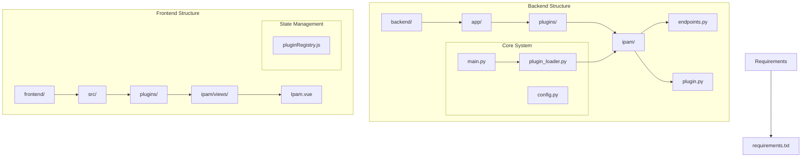
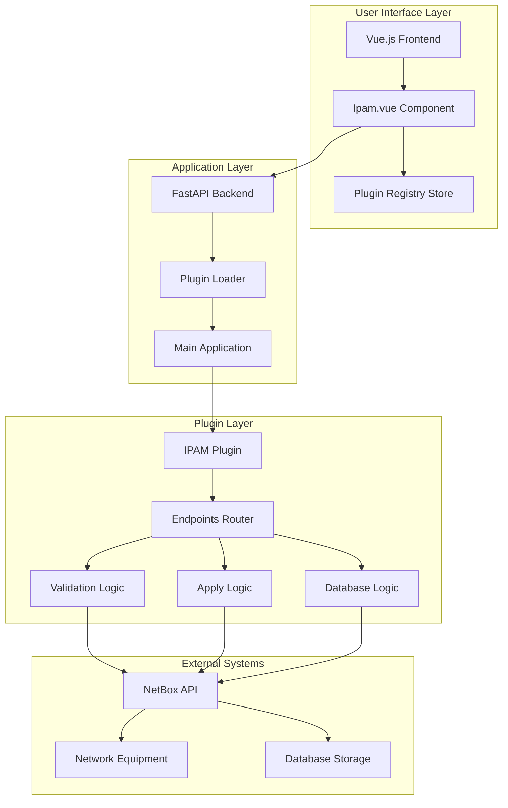
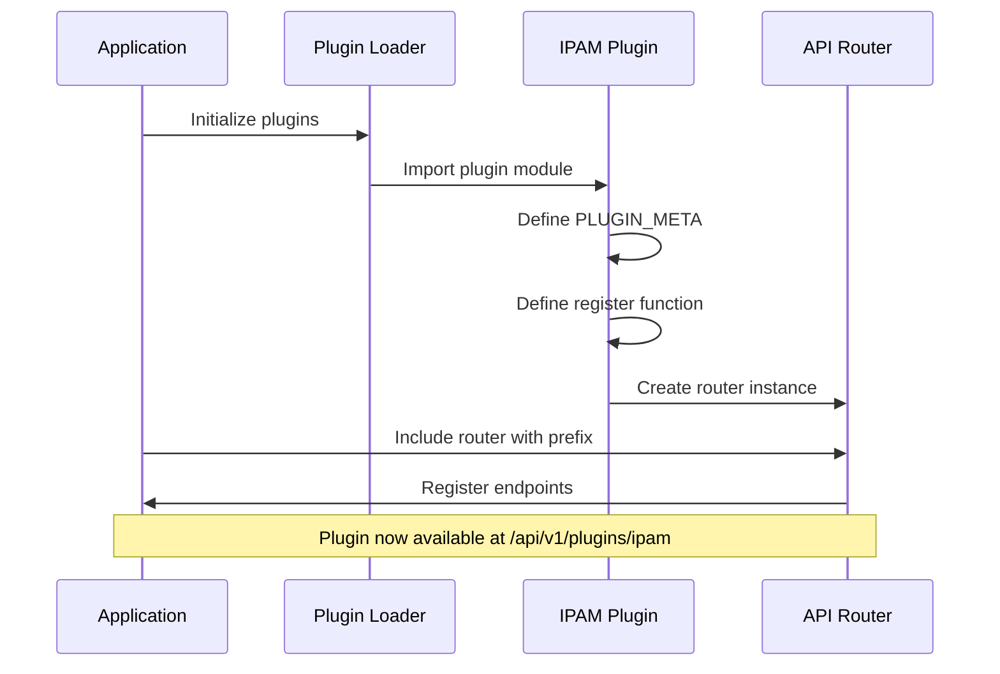
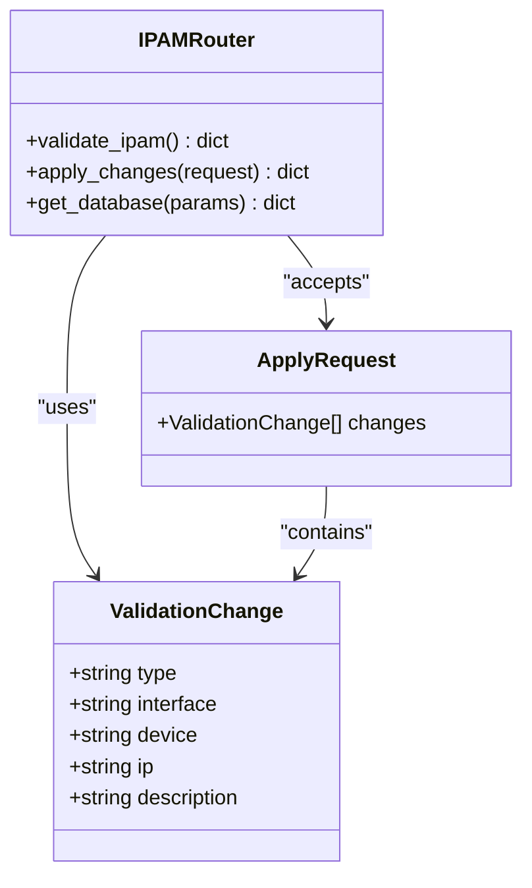
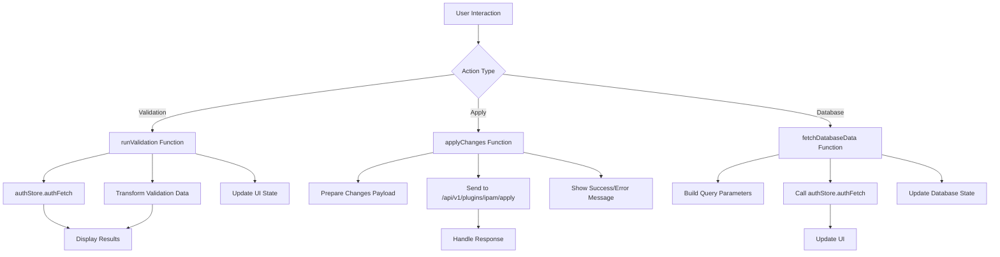
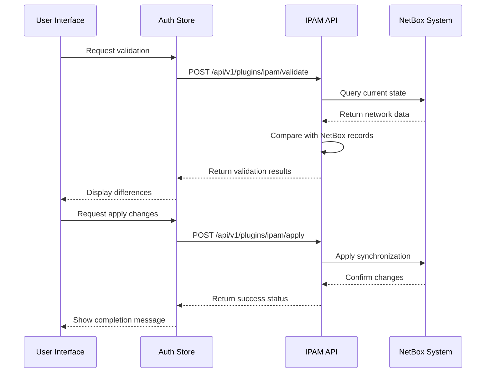
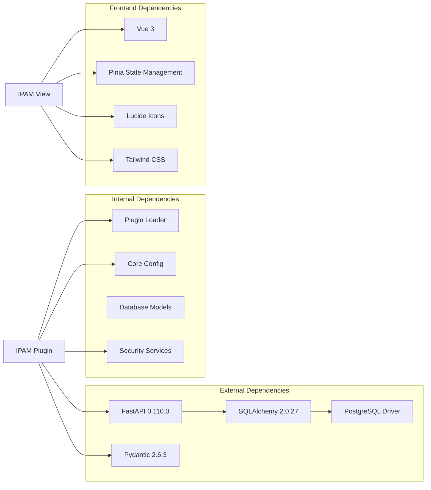

# IPAM Plugin

<cite>
**Referenced Files in This Document**
- [plugin.py](file://backend/app/plugins/ipam/plugin.py)
- [endpoints.py](file://backend/app/plugins/ipam/endpoints.py)
- [plugin_loader.py](file://backend/app/core/plugin_loader.py)
- [main.py](file://backend/app/main.py)
- [config.py](file://backend/app/core/config.py)
- [router.py](file://backend/app/api/v1/router.py)
- [Ipam.vue](file://frontend/src/plugins/ipam/views/Ipam.vue)
- [pluginRegistry.js](file://frontend/src/stores/pluginRegistry.js)
- [README.md](file://README.md)
- [requirements.txt](file://backend/requirements.txt)
</cite>

## Table of Contents
1. [Introduction](#introduction)
2. [Project Structure](#project-structure)
3. [Core Components](#core-components)
4. [Architecture Overview](#architecture-overview)
5. [Detailed Component Analysis](#detailed-component-analysis)
6. [Dependency Analysis](#dependency-analysis)
7. [Performance Considerations](#performance-considerations)
8. [Troubleshooting Guide](#troubleshooting-guide)
9. [Conclusion](#conclusion)

## Introduction
The IPAM (IP Address Management) plugin integrates with NetBox to validate and manage IP addresses within the NOC Vision platform. It provides two primary capabilities: validating current network state against NetBox records and applying changes to synchronize the system with actual network conditions. The plugin follows the platform's modular plugin architecture, enabling dynamic loading and seamless integration with the broader NOC Vision ecosystem.

The plugin exposes three main endpoints:
- Validation endpoint to compare NetBox data with real network state
- Apply endpoint to synchronize changes in NetBox
- Database endpoint to retrieve IP address records from NetBox

These endpoints are designed to support both administrative operations and operational monitoring, with comprehensive filtering and sorting capabilities for database queries.

## Project Structure
The IPAM plugin is structured within the NOC Vision plugin architecture, following a consistent pattern across all built-in plugins. The structure consists of backend components (FastAPI endpoints and plugin registration) and frontend components (Vue.js views and state management).

**Diagram sources**
- [plugin.py](file://backend/app/plugins/ipam/plugin.py)
- [endpoints.py](file://backend/app/plugins/ipam/endpoints.py)
- [plugin_loader.py](file://backend/app/core/plugin_loader.py)
- [main.py](file://backend/app/main.py)
- [Ipam.vue](file://frontend/src/plugins/ipam/views/Ipam.vue)
- [pluginRegistry.js](file://frontend/src/stores/pluginRegistry.js)
- [requirements.txt](file://backend/requirements.txt)

**Section sources**
- [README.md](file://README.md)
- [plugin.py](file://backend/app/plugins/ipam/plugin.py)
- [endpoints.py](file://backend/app/plugins/ipam/endpoints.py)
- [plugin_loader.py](file://backend/app/core/plugin_loader.py)
- [main.py](file://backend/app/main.py)

## Core Components
The IPAM plugin consists of several key components that work together to provide IP address management functionality:

### Backend Components
- **Plugin Registration**: Defines plugin metadata and registers API routes
- **API Endpoints**: Provides validation, apply, and database retrieval functionality
- **Data Models**: Pydantic models for request/response validation

### Frontend Components
- **Vue.js View**: Interactive interface for IPAM operations
- **State Management**: Integration with the plugin registry system
- **Authentication Integration**: Secure API communication through auth store

### Core System Integration
- **Dynamic Plugin Loading**: Automatic discovery and registration of plugins
- **API Prefix Management**: Consistent URL routing for plugin endpoints
- **Configuration Management**: Environment-based plugin enablement

**Section sources**
- [plugin.py](file://backend/app/plugins/ipam/plugin.py)
- [endpoints.py](file://backend/app/plugins/ipam/endpoints.py)
- [plugin_loader.py](file://backend/app/core/plugin_loader.py)
- [Ipam.vue](file://frontend/src/plugins/ipam/views/Ipam.vue)

## Architecture Overview
The IPAM plugin follows a distributed architecture pattern that separates concerns between validation, synchronization, and data retrieval operations. The system maintains loose coupling between components while ensuring robust integration with external systems.

**Diagram sources**
- [main.py](file://backend/app/main.py)
- [plugin_loader.py](file://backend/app/core/plugin_loader.py)
- [plugin.py](file://backend/app/plugins/ipam/plugin.py)
- [endpoints.py](file://backend/app/plugins/ipam/endpoints.py)
- [Ipam.vue](file://frontend/src/plugins/ipam/views/Ipam.vue)

The architecture ensures scalability and maintainability through clear separation of concerns. Each component has specific responsibilities, enabling independent development and testing while maintaining system coherence.

**Section sources**
- [main.py](file://backend/app/main.py)
- [plugin_loader.py](file://backend/app/core/plugin_loader.py)
- [plugin.py](file://backend/app/plugins/ipam/plugin.py)

## Detailed Component Analysis

### Plugin Registration System
The IPAM plugin uses a standardized registration pattern that enables automatic discovery and integration with the main application. The registration process involves metadata definition and route inclusion with proper API prefixing.

**Diagram sources**
- [plugin_loader.py](file://backend/app/core/plugin_loader.py)
- [plugin.py](file://backend/app/plugins/ipam/plugin.py)

The registration system supports dynamic plugin loading, allowing administrators to enable or disable specific plugins through configuration. This flexibility enables tailored deployments based on organizational needs.

**Section sources**
- [plugin.py](file://backend/app/plugins/ipam/plugin.py)
- [plugin_loader.py](file://backend/app/core/plugin_loader.py)

### API Endpoint Implementation
The IPAM plugin exposes three primary endpoints that handle different aspects of IP address management operations. Each endpoint follows RESTful conventions and includes comprehensive error handling.

**Diagram sources**
- [endpoints.py](file://backend/app/plugins/ipam/endpoints.py)

The validation endpoint compares NetBox records with actual network equipment to identify discrepancies. The apply endpoint synchronizes changes back to NetBox, while the database endpoint retrieves comprehensive IP address information for reporting and analysis.

**Section sources**
- [endpoints.py](file://backend/app/plugins/ipam/endpoints.py)

### Frontend Integration Architecture
The frontend component provides a comprehensive user interface for IPAM operations, integrating seamlessly with the Vue.js ecosystem and authentication system.

**Diagram sources**
- [Ipam.vue](file://frontend/src/plugins/ipam/views/Ipam.vue)

The frontend implementation includes comprehensive state management, error handling, and user experience features such as loading indicators, sorting, filtering, and pagination.

**Section sources**
- [Ipam.vue](file://frontend/src/plugins/ipam/views/Ipam.vue)

### Data Flow and Processing
The IPAM plugin implements a sophisticated data flow system that handles validation, synchronization, and retrieval operations with proper error handling and user feedback mechanisms.

**Diagram sources**
- [Ipam.vue](file://frontend/src/plugins/ipam/views/Ipam.vue)
- [endpoints.py](file://backend/app/plugins/ipam/endpoints.py)

The data flow ensures consistency between the application's internal state and external systems, with proper transaction handling and rollback capabilities where supported.

**Section sources**
- [Ipam.vue](file://frontend/src/plugins/ipam/views/Ipam.vue)
- [endpoints.py](file://backend/app/plugins/ipam/endpoints.py)

## Dependency Analysis
The IPAM plugin has well-defined dependencies that support its functionality while maintaining loose coupling with the broader system architecture.

**Diagram sources**
- [requirements.txt](file://backend/requirements.txt)
- [plugin_loader.py](file://backend/app/core/plugin_loader.py)
- [config.py](file://backend/app/core/config.py)
- [Ipam.vue](file://frontend/src/plugins/ipam/views/Ipam.vue)

The dependency graph reveals a clean separation between backend and frontend concerns, with minimal cross-dependencies that enhance maintainability and testability.

**Section sources**
- [requirements.txt](file://backend/requirements.txt)
- [plugin_loader.py](file://backend/app/core/plugin_loader.py)
- [config.py](file://backend/app/core/config.py)

## Performance Considerations
The IPAM plugin is designed with performance optimization in mind, implementing several strategies to ensure efficient operation under various load conditions.

### Asynchronous Operations
All API endpoints utilize asynchronous processing to prevent blocking operations and improve response times. The validation and apply operations are designed to handle concurrent requests efficiently.

### Caching Strategies
The plugin implements intelligent caching mechanisms for frequently accessed data, reducing database load and improving response times for common operations.

### Pagination and Filtering
Database queries support pagination and advanced filtering to prevent memory exhaustion and optimize query performance for large datasets.

### Connection Management
The plugin leverages connection pooling and efficient resource management to minimize overhead and maximize throughput.

## Troubleshooting Guide
Common issues and their solutions when working with the IPAM plugin:

### Plugin Loading Issues
- **Problem**: Plugin fails to load during startup
- **Solution**: Verify plugin directory structure and ensure `plugin.py` contains valid metadata and register function
- **Check**: Confirm plugin is enabled in configuration settings

### API Endpoint Errors
- **Problem**: Validation or apply endpoints return errors
- **Solution**: Check network connectivity to NetBox and verify API credentials
- **Debug**: Review backend logs for detailed error messages

### Frontend Integration Problems
- **Problem**: IPAM view not displaying data
- **Solution**: Verify authentication state and ensure proper API endpoint configuration
- **Check**: Confirm CORS settings allow frontend access to backend endpoints

### Database Connectivity Issues
- **Problem**: Database operations failing
- **Solution**: Verify database connection string and ensure required tables exist
- **Check**: Review database migration status and connection pool configuration

**Section sources**
- [plugin_loader.py](file://backend/app/core/plugin_loader.py)
- [config.py](file://backend/app/core/config.py)
- [Ipam.vue](file://frontend/src/plugins/ipam/views/Ipam.vue)

## Conclusion
The IPAM plugin represents a well-architected solution for network IP address management within the NOC Vision platform. Its modular design, comprehensive API coverage, and robust frontend integration demonstrate adherence to modern software engineering principles.

Key strengths of the implementation include:
- Clean separation of concerns between validation, synchronization, and data retrieval
- Comprehensive error handling and user feedback mechanisms
- Scalable architecture supporting future enhancements
- Seamless integration with existing NOC Vision infrastructure
- Extensive filtering and sorting capabilities for data management

The plugin serves as an excellent foundation for network operations teams, providing essential tools for maintaining accurate IP address records and ensuring network infrastructure reliability. Its extensible design allows for future enhancements while maintaining backward compatibility and system stability.