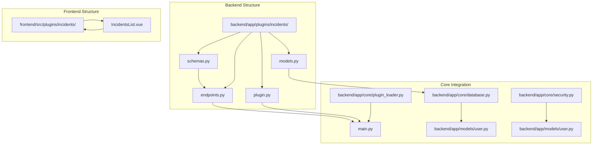
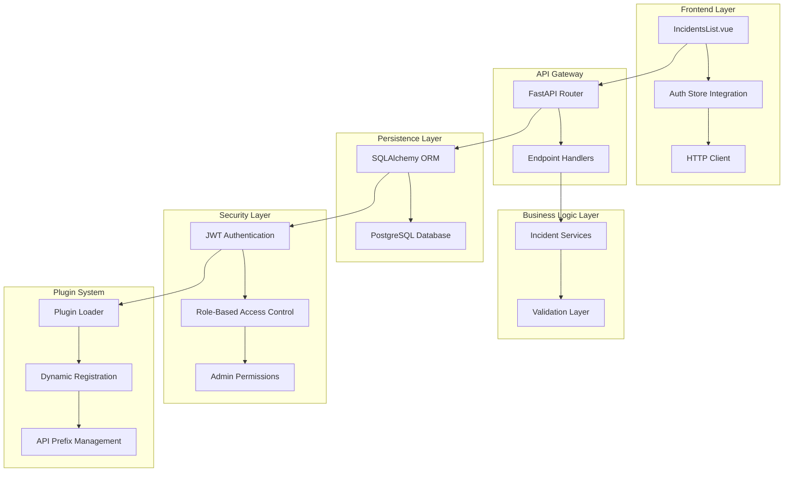
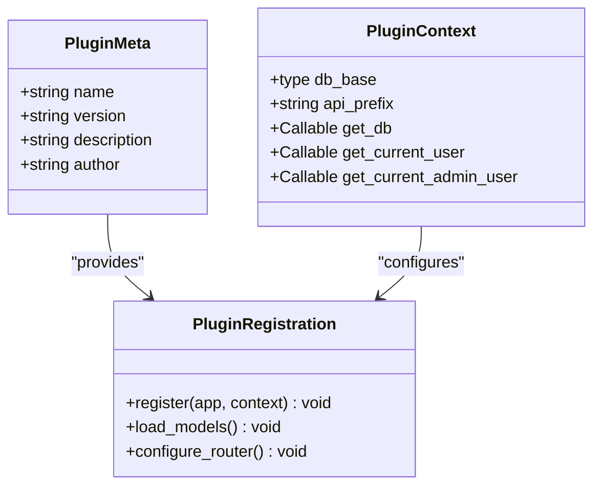
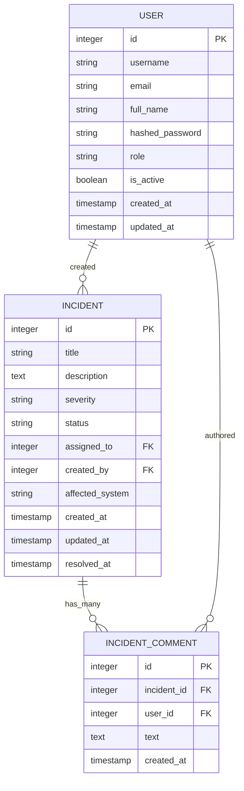
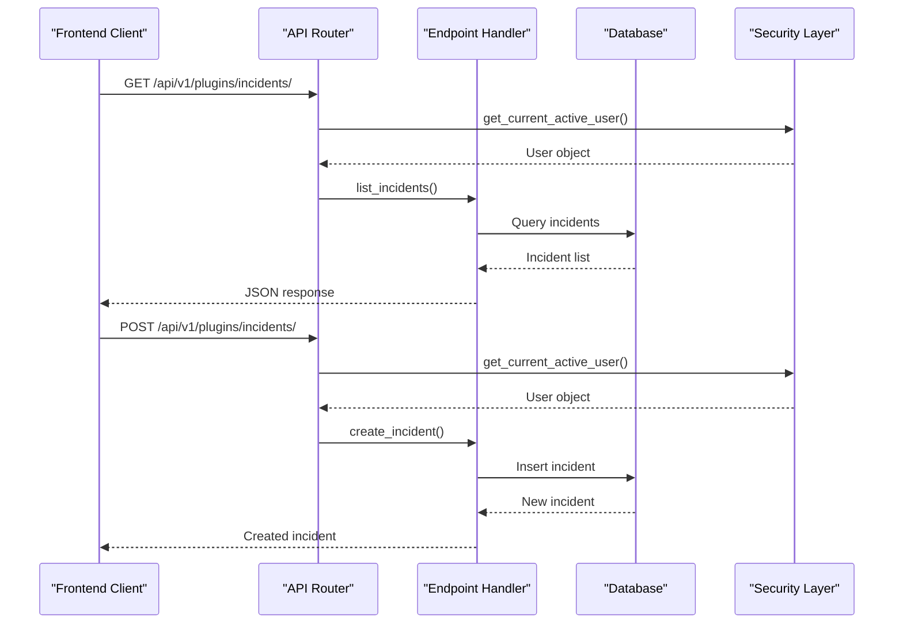
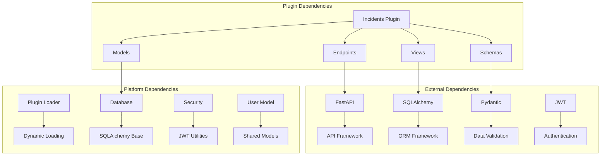

# Incidents Plugin

<cite>
**Referenced Files in This Document**
- [plugin.py](file://backend/app/plugins/incidents/plugin.py)
- [models.py](file://backend/app/plugins/incidents/models.py)
- [schemas.py](file://backend/app/plugins/incidents/schemas.py)
- [endpoints.py](file://backend/app/plugins/incidents/endpoints.py)
- [IncidentsList.vue](file://frontend/src/plugins/incidents/views/IncidentsList.vue)
- [plugin_loader.py](file://backend/app/core/plugin_loader.py)
- [main.py](file://backend/app/main.py)
- [database.py](file://backend/app/core/database.py)
- [security.py](file://backend/app/core/security.py)
- [user.py](file://backend/app/models/user.py)
- [pluginRegistry.js](file://frontend/src/stores/pluginRegistry.js)
- [README.md](file://README.md)
</cite>

## Table of Contents
1. [Introduction](#introduction)
2. [Project Structure](#project-structure)
3. [Core Components](#core-components)
4. [Architecture Overview](#architecture-overview)
5. [Detailed Component Analysis](#detailed-component-analysis)
6. [Dependency Analysis](#dependency-analysis)
7. [Performance Considerations](#performance-considerations)
8. [Troubleshooting Guide](#troubleshooting-guide)
9. [Conclusion](#conclusion)
10. [Appendices](#appendices)

## Introduction
The Incidents Plugin is a core component of the NOC Vision platform that enables network incident management and tracking. It provides a complete solution for creating, tracking, and resolving network incidents with integrated comments and status management. The plugin follows the platform's plugin architecture, offering a standardized API and frontend integration pattern that extends the core NOC platform with incident tracking capabilities.

The plugin implements a comprehensive incident lifecycle management system with four distinct status states: open, investigating, resolved, and closed. It supports severity classification (info, minor, major, critical) and includes automated timestamp tracking for incident resolution. The system integrates seamlessly with the platform's authentication and authorization mechanisms, ensuring secure access control for incident operations.

## Project Structure
The Incidents Plugin is organized within the NOC Vision plugin architecture, following a consistent directory structure that enables dynamic loading and integration with the core platform.



**Diagram sources**
- [plugin.py:1-17](file://backend/app/plugins/incidents/plugin.py#L1-L17)
- [endpoints.py:1-122](file://backend/app/plugins/incidents/endpoints.py#L1-L122)
- [models.py:1-30](file://backend/app/plugins/incidents/models.py#L1-L30)
- [schemas.py:1-51](file://backend/app/plugins/incidents/schemas.py#L1-L51)
- [plugin_loader.py:1-100](file://backend/app/core/plugin_loader.py#L1-L100)
- [main.py:1-87](file://backend/app/main.py#L1-L87)

**Section sources**
- [README.md:1-272](file://README.md#L1-L272)
- [plugin.py:1-17](file://backend/app/plugins/incidents/plugin.py#L1-L17)
- [plugin_loader.py:25-100](file://backend/app/core/plugin_loader.py#L25-L100)

## Core Components
The Incidents Plugin consists of four fundamental components that work together to provide comprehensive incident management functionality:

### Backend Components
- **Plugin Registration**: Defines plugin metadata and registers API routes with the core application
- **Data Models**: SQLAlchemy ORM models for incident records and comments
- **Pydantic Schemas**: Data validation and serialization for API interactions
- **API Endpoints**: Complete CRUD operations with status management and authorization

### Frontend Components
- **Vue Component**: Interactive incident management interface with real-time updates
- **State Management**: Integration with the plugin registry for dynamic menu generation
- **Authentication Integration**: Secure API communication through the auth store

### Core Platform Integration
- **Plugin Loader**: Dynamic plugin discovery and registration system
- **Database Layer**: Shared SQLAlchemy base for model registration
- **Security Layer**: JWT-based authentication and authorization enforcement
- **User Management**: Integration with the platform's user model and roles

**Section sources**
- [plugin.py:1-17](file://backend/app/plugins/incidents/plugin.py#L1-L17)
- [models.py:1-30](file://backend/app/plugins/incidents/models.py#L1-L30)
- [schemas.py:1-51](file://backend/app/plugins/incidents/schemas.py#L1-L51)
- [endpoints.py:1-122](file://backend/app/plugins/incidents/endpoints.py#L1-L122)
- [IncidentsList.vue:1-268](file://frontend/src/plugins/incidents/views/IncidentsList.vue#L1-L268)

## Architecture Overview
The Incidents Plugin follows a layered architecture that integrates seamlessly with the NOC Vision platform's plugin system. The architecture ensures loose coupling while maintaining strong integration points for authentication, authorization, and data persistence.



**Diagram sources**
- [IncidentsList.vue:1-268](file://frontend/src/plugins/incidents/views/IncidentsList.vue#L1-L268)
- [endpoints.py:1-122](file://backend/app/plugins/incidents/endpoints.py#L1-L122)
- [models.py:1-30](file://backend/app/plugins/incidents/models.py#L1-L30)
- [plugin_loader.py:25-100](file://backend/app/core/plugin_loader.py#L25-L100)
- [security.py:1-99](file://backend/app/core/security.py#L1-L99)

The architecture enforces clear separation of concerns:
- **Frontend**: Handles user interface and state management
- **API Layer**: Manages request routing and response formatting
- **Business Logic**: Implements validation and workflow enforcement
- **Persistence**: Provides data access through ORM abstractions
- **Security**: Enforces authentication and authorization policies
- **Plugin System**: Enables dynamic loading and integration

## Detailed Component Analysis

### Plugin Registration and Metadata
The plugin registration system defines essential metadata and establishes the integration point with the core application. The registration process follows a standardized pattern that enables dynamic plugin loading and consistent API endpoint management.



**Diagram sources**
- [plugin.py:1-17](file://backend/app/plugins/incidents/plugin.py#L1-L17)
- [plugin_loader.py:16-23](file://backend/app/core/plugin_loader.py#L16-L23)

The plugin metadata includes:
- **Name**: Unique identifier "incidents" for API routing
- **Version**: Semantic versioning for plugin updates
- **Description**: Purpose statement for system documentation
- **Author**: Development team attribution

**Section sources**
- [plugin.py:1-17](file://backend/app/plugins/incidents/plugin.py#L1-L17)
- [plugin_loader.py:60-76](file://backend/app/core/plugin_loader.py#L60-L76)

### Data Models and Database Schema
The plugin implements two primary data models that form the foundation of incident tracking functionality. These models establish relationships between incidents, users, and comments while maintaining referential integrity.



**Diagram sources**
- [models.py:6-29](file://backend/app/plugins/incidents/models.py#L6-L29)
- [user.py:7-34](file://backend/app/models/user.py#L7-L34)

Key database design decisions:
- **Incident Model**: Central record with comprehensive tracking fields
- **Comment Model**: Separate entity for audit trail and collaboration
- **Foreign Key Relationships**: Maintains referential integrity across users
- **Timestamp Management**: Automatic creation and modification timestamps
- **Cascade Deletion**: Comments automatically removed when incidents are deleted

**Section sources**
- [models.py:1-30](file://backend/app/plugins/incidents/models.py#L1-L30)
- [user.py:1-35](file://backend/app/models/user.py#L1-L35)

### API Endpoint Implementation
The API endpoints provide a complete CRUD interface for incident management with specialized handlers for comments and status transitions. Each endpoint enforces appropriate authorization levels and implements consistent error handling.



**Diagram sources**
- [endpoints.py:18-38](file://backend/app/plugins/incidents/endpoints.py#L18-L38)
- [security.py:61-87](file://backend/app/core/security.py#L61-L87)

**Section sources**
- [endpoints.py:1-122](file://backend/app/plugins/incidents/endpoints.py#L1-L122)
- [security.py:1-99](file://backend/app/core/security.py#L1-L99)

### Frontend Vue Component Implementation
The frontend component provides an interactive interface for incident management with real-time updates and intuitive user controls. The component integrates with the platform's authentication system and implements responsive design patterns.

```mermaid
flowchart TD
A[Component Mount] --> B[fetchIncidents()]
B --> C[Loading State]
C --> D[API Request]
D --> E{Response OK?}
E --> |Yes| F[Parse JSON Response]
E --> |No| G[Set Error State]
F --> H[Update Incidents Array]
H --> I[Render Cards]
G --> J[Display Error Message]
K[User Action] --> L[Create/Update/Delete]
L --> M[API Call]
M --> N{Success?}
N --> |Yes| O[Refresh Data]
N --> |No| P[Show Error]
O --> Q[Re-render List]
```

**Diagram sources**
- [IncidentsList.vue:41-104](file://frontend/src/plugins/incidents/views/IncidentsList.vue#L41-L104)

**Section sources**
- [IncidentsList.vue:1-268](file://frontend/src/plugins/incidents/views/IncidentsList.vue#L1-L268)

### Status Management Workflow
The plugin implements a comprehensive status management system that tracks incident progression through four distinct states with appropriate transitions and automation.

```mermaid
stateDiagram-v2
[*] --> Open
Open --> Investigating : Update Status
Investigating --> Resolved : Update Status
Resolved --> Closed : Update Status
Closed --> Open : Reset Status (Admin)
state Open {
[*] --> Open
Open --> Investigating : Start Investigation
}
state Investigating {
[*] --> Investigating
Investigating --> Resolved : Mark as Resolved
Investigating --> Closed : Close Incident
}
state Resolved {
[*] --> Resolved
Resolved --> Closed : Close After Review
}
state Closed {
[*] --> Closed
Closed --> Open : Reopen Incident
}
```

**Diagram sources**
- [endpoints.py:64-65](file://backend/app/plugins/incidents/endpoints.py#L64-L65)

**Section sources**
- [endpoints.py:53-70](file://backend/app/plugins/incidents/endpoints.py#L53-L70)

## Dependency Analysis
The Incidents Plugin maintains minimal external dependencies while leveraging the platform's core infrastructure for maximum integration and consistency.



**Diagram sources**
- [plugin_loader.py:1-100](file://backend/app/core/plugin_loader.py#L1-L100)
- [database.py:1-18](file://backend/app/core/database.py#L1-L18)
- [security.py:1-99](file://backend/app/core/security.py#L1-L99)

**Section sources**
- [plugin_loader.py:1-100](file://backend/app/core/plugin_loader.py#L1-L100)
- [database.py:1-18](file://backend/app/core/database.py#L1-L18)
- [security.py:1-99](file://backend/app/core/security.py#L1-L99)

## Performance Considerations
The plugin implementation incorporates several performance optimization strategies to ensure efficient operation under various load conditions:

### Database Optimization
- **Indexing Strategy**: Primary keys and foreign keys are indexed for optimal query performance
- **Connection Pooling**: Leverages SQLAlchemy's connection pooling for efficient database access
- **Lazy Loading**: Relationship loading is deferred until explicitly accessed
- **Batch Operations**: Bulk operations for incident listing and filtering

### API Performance
- **Pagination Support**: Built-in pagination prevents large result sets from overwhelming clients
- **Selective Field Loading**: Response models include only necessary fields
- **Caching Opportunities**: Timestamp fields enable efficient client-side caching
- **Minimal Serialization**: Pydantic models provide efficient JSON serialization

### Frontend Performance
- **Component Lazy Loading**: Vue components are loaded on demand
- **State Management**: Efficient reactive state updates minimize re-renders
- **Error Boundaries**: Graceful degradation when API calls fail
- **Responsive Design**: Optimized for various screen sizes and devices

## Troubleshooting Guide

### Common Issues and Solutions

**Plugin Not Loading**
- Verify plugin directory structure exists in `backend/app/plugins/incidents/`
- Ensure `plugin.py` contains required `PLUGIN_META` and `register()` function
- Check backend logs for plugin loading errors
- Confirm plugin name matches directory name

**Database Connection Problems**
- Verify PostgreSQL is running and accessible
- Check `DATABASE_URL` environment variable configuration
- Ensure database credentials are correct
- Confirm required database tables are created

**Authentication Failures**
- Verify JWT secret key is properly configured
- Check access token validity and expiration
- Ensure user accounts exist in the database
- Validate CORS settings for frontend integration

**API Endpoint Issues**
- Confirm API prefix follows `/api/v1/plugins/{plugin_name}` pattern
- Verify endpoint permissions match user roles
- Check for proper dependency injection in endpoint handlers
- Validate request/response schema compliance

**Frontend Integration Problems**
- Ensure plugin is registered in the frontend plugin registry
- Verify API endpoint accessibility from frontend origin
- Check authentication store integration
- Confirm component mounting and lifecycle management

**Section sources**
- [plugin_loader.py:89-97](file://backend/app/core/plugin_loader.py#L89-L97)
- [main.py:25-27](file://backend/app/main.py#L25-L27)
- [security.py:61-98](file://backend/app/core/security.py#L61-L98)

## Conclusion
The Incidents Plugin represents a comprehensive solution for network incident management within the NOC Vision platform. Its implementation demonstrates best practices in plugin architecture, data modeling, API design, and frontend integration. The plugin successfully extends the core platform with robust incident tracking capabilities while maintaining seamless integration with existing authentication, authorization, and database systems.

Key strengths of the implementation include:
- **Modular Design**: Clean separation of concerns enabling easy maintenance and extension
- **Security Integration**: Comprehensive authentication and authorization enforcement
- **Data Integrity**: Robust database models with proper relationships and constraints
- **User Experience**: Intuitive frontend interface with real-time updates
- **Scalability**: Performance optimizations and efficient resource utilization

The plugin serves as an excellent example of how to extend a platform with custom functionality while adhering to established architectural patterns and security practices. Its design provides a solid foundation for future enhancements and additional incident management features.

## Appendices

### API Endpoint Reference

#### Incident Management Endpoints
- **GET** `/api/v1/plugins/incidents/` - List all incidents with pagination
- **POST** `/api/v1/plugins/incidents/` - Create a new incident
- **GET** `/api/v1/plugins/incidents/{incident_id}` - Retrieve specific incident
- **PUT** `/api/v1/plugins/incidents/{incident_id}` - Update incident details
- **DELETE** `/api/v1/plugins/incidents/{incident_id}` - Delete incident (admin only)

#### Comment Management Endpoints
- **GET** `/api/v1/plugins/incidents/{incident_id}/comments` - List incident comments
- **POST** `/api/v1/plugins/incidents/{incident_id}/comments` - Add new comment

### Data Model Specifications

#### Incident Fields
- `id`: Unique identifier (auto-generated)
- `title`: Brief incident description (required)
- `description`: Detailed incident information (optional)
- `severity`: Impact level (info/minor/major/critical)
- `status`: Current workflow state (open/investigating/resolved/closed)
- `assigned_to`: User responsible for incident (optional)
- `created_by`: Creator of incident (required)
- `affected_system`: System impacted (optional)
- `created_at`: Timestamp of creation
- `updated_at`: Timestamp of last update
- `resolved_at`: Timestamp when resolved

#### Comment Fields
- `id`: Unique identifier (auto-generated)
- `incident_id`: Related incident (required)
- `user_id`: Author of comment (required)
- `text`: Comment content (required)
- `created_at`: Timestamp of creation

### Frontend Component Properties

#### Severity Configuration
- **info**: Blue indicator with informational label
- **minor**: Yellow indicator with minor impact label
- **major**: Orange indicator with significant impact label
- **critical**: Red indicator with critical impact label

#### Status Configuration
- **open**: Clock icon with blue color scheme
- **investigating**: Refresh icon with yellow color scheme
- **resolved**: Check circle icon with green color scheme
- **closed**: X circle icon with gray color scheme