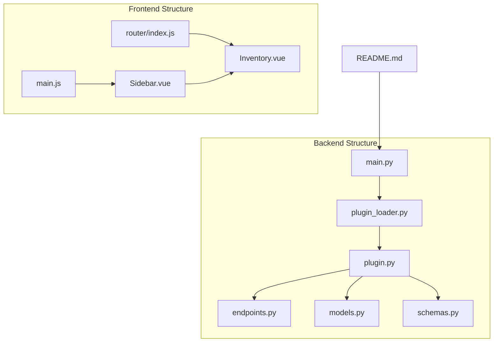
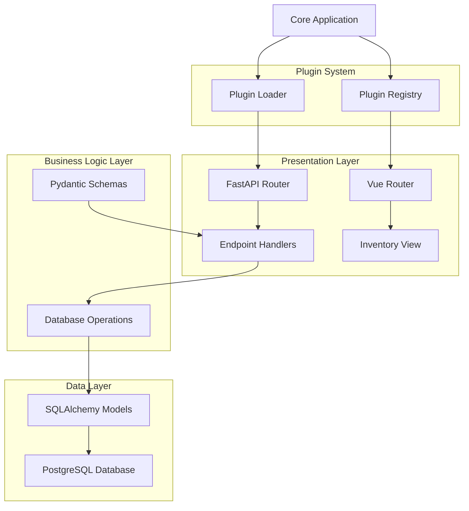
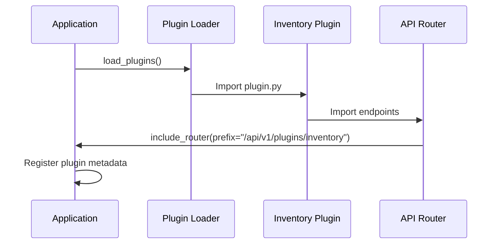
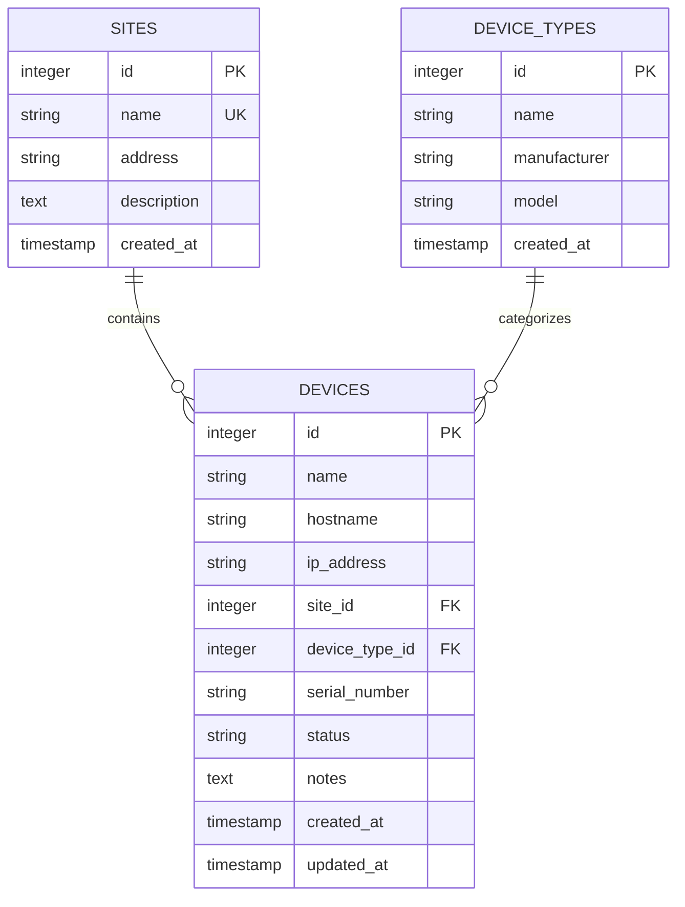
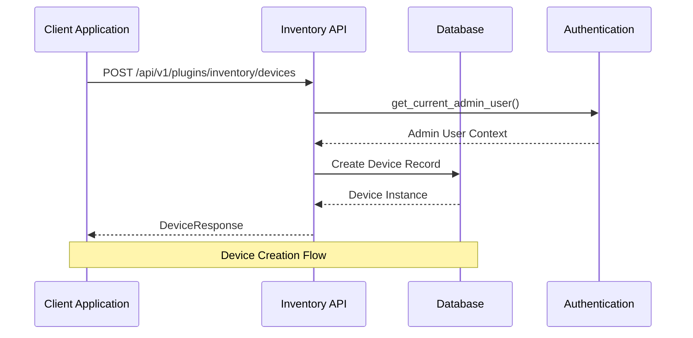
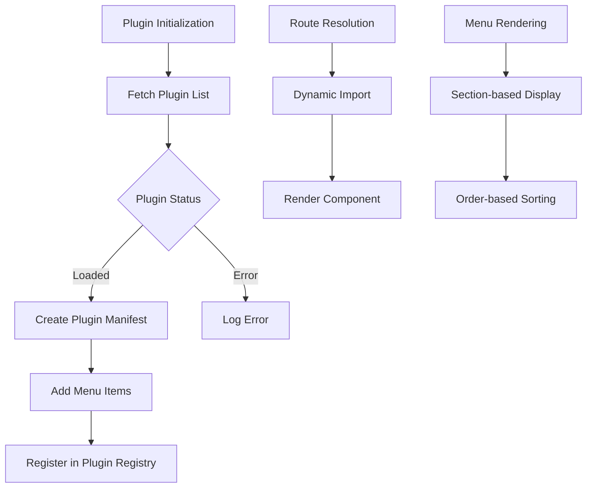
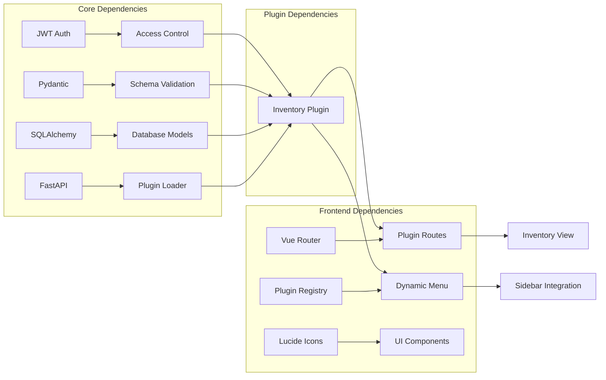

# Inventory Plugin

<cite>
**Referenced Files in This Document**
- [plugin.py](file://backend/app/plugins/inventory/plugin.py)
- [models.py](file://backend/app/plugins/inventory/models.py)
- [schemas.py](file://backend/app/plugins/inventory/schemas.py)
- [endpoints.py](file://backend/app/plugins/inventory/endpoints.py)
- [plugin_loader.py](file://backend/app/core/plugin_loader.py)
- [main.py](file://backend/app/main.py)
- [Inventory.vue](file://frontend/src/plugins/inventory/views/Inventory.vue)
- [router/index.js](file://frontend/src/router/index.js)
- [main.js](file://frontend/src/main.js)
- [Sidebar.vue](file://frontend/src/components/layout/Sidebar.vue)
- [README.md](file://README.md)
</cite>

## Table of Contents
1. [Introduction](#introduction)
2. [Project Structure](#project-structure)
3. [Core Components](#core-components)
4. [Architecture Overview](#architecture-overview)
5. [Detailed Component Analysis](#detailed-component-analysis)
6. [Dependency Analysis](#dependency-analysis)
7. [Performance Considerations](#performance-considerations)
8. [Troubleshooting Guide](#troubleshooting-guide)
9. [Conclusion](#conclusion)
10. [Appendices](#appendices)

## Introduction
The Inventory Plugin provides network equipment and asset management capabilities within the NOC Vision platform. It enables tracking of network devices, their physical locations (sites), and device categories (device types). The plugin follows a plugin-based architecture that integrates seamlessly with the core platform, exposing REST APIs for CRUD operations and providing a basic frontend view for future expansion.

Key capabilities:
- Device management: create, read, update, delete network devices
- Site management: organize devices by physical locations
- Device type management: categorize devices by manufacturer/model
- Lifecycle tracking: device status management (active, inactive, maintenance)
- Integration: automatic plugin discovery and registration with the core platform

## Project Structure
The Inventory Plugin is organized into backend and frontend components with clear separation of concerns:

**Diagram sources**
- [plugin.py:1-17](file://backend/app/plugins/inventory/plugin.py#L1-L17)
- [endpoints.py:1-130](file://backend/app/plugins/inventory/endpoints.py#L1-L130)
- [models.py:1-40](file://backend/app/plugins/inventory/models.py#L1-L40)
- [schemas.py:1-74](file://backend/app/plugins/inventory/schemas.py#L1-L74)
- [plugin_loader.py:25-100](file://backend/app/core/plugin_loader.py#L25-L100)
- [main.py:17-48](file://backend/app/main.py#L17-L48)
- [router/index.js:29-129](file://frontend/src/router/index.js#L29-L129)
- [Inventory.vue:1-34](file://frontend/src/plugins/inventory/views/Inventory.vue#L1-L34)
- [main.js:18-51](file://frontend/src/main.js#L18-L51)
- [Sidebar.vue:58-101](file://frontend/src/components/layout/Sidebar.vue#L58-L101)

**Section sources**
- [README.md:41-48](file://README.md#L41-L48)
- [plugin.py:1-17](file://backend/app/plugins/inventory/plugin.py#L1-L17)
- [plugin_loader.py:25-100](file://backend/app/core/plugin_loader.py#L25-L100)

## Core Components
The Inventory Plugin consists of four fundamental components that work together to provide comprehensive equipment management:

### Data Models
The plugin defines three core entities with clear relationships:
- **Site**: Physical location information with address and description
- **DeviceType**: Equipment classification with manufacturer and model details
- **Device**: Network equipment with status tracking and relationship to sites and device types

### API Endpoints
RESTful endpoints provide full CRUD operations for all entity types with appropriate authentication and authorization controls:
- GET `/api/v1/plugins/inventory/devices` - List all devices
- POST `/api/v1/plugins/inventory/devices` - Create new device
- GET `/api/v1/plugins/inventory/devices/{id}` - Get specific device
- PUT `/api/v1/plugins/inventory/devices/{id}` - Update device
- DELETE `/api/v1/plugins/inventory/devices/{id}` - Delete device
- GET `/api/v1/plugins/inventory/sites` - List all sites
- POST `/api/v1/plugins/inventory/sites` - Create new site
- GET `/api/v1/plugins/inventory/device-types` - List all device types
- POST `/api/v1/plugins/inventory/device-types` - Create new device type

### Request/Response Schemas
Pydantic models ensure data validation and serialization:
- DeviceCreate/DeviceUpdate/DeviceResponse for device operations
- SiteCreate/SiteResponse for site management
- DeviceTypeCreate/DeviceTypeResponse for equipment categorization

### Frontend Integration
Vue.js components provide user interface integration:
- Inventory view component with placeholder content
- Router configuration for plugin navigation
- Dynamic menu integration through plugin registry

**Section sources**
- [models.py:6-40](file://backend/app/plugins/inventory/models.py#L6-L40)
- [schemas.py:6-74](file://backend/app/plugins/inventory/schemas.py#L6-L74)
- [endpoints.py:18-130](file://backend/app/plugins/inventory/endpoints.py#L18-L130)
- [Inventory.vue:1-34](file://frontend/src/plugins/inventory/views/Inventory.vue#L1-L34)

## Architecture Overview
The Inventory Plugin follows a layered architecture pattern with clear separation between presentation, business logic, and data persistence:

**Diagram sources**
- [plugin_loader.py:25-100](file://backend/app/core/plugin_loader.py#L25-L100)
- [endpoints.py:15-130](file://backend/app/plugins/inventory/endpoints.py#L15-L130)
- [models.py:1-40](file://backend/app/plugins/inventory/models.py#L1-L40)
- [router/index.js:29-129](file://frontend/src/router/index.js#L29-L129)
- [main.js:18-51](file://frontend/src/main.js#L18-L51)

The architecture ensures:
- **Modularity**: Independent plugin development and deployment
- **Scalability**: Easy addition of new entities and operations
- **Maintainability**: Clear separation of concerns and single responsibility
- **Extensibility**: Plugin system allows for future enhancements

## Detailed Component Analysis

### Plugin Registration and Discovery
The plugin system automatically discovers and registers Inventory Plugin components during application startup:

**Diagram sources**
- [plugin_loader.py:50-87](file://backend/app/core/plugin_loader.py#L50-L87)
- [plugin.py:9-17](file://backend/app/plugins/inventory/plugin.py#L9-L17)

### Data Model Relationships
The Inventory Plugin implements a normalized database schema with clear entity relationships:

**Diagram sources**
- [models.py:6-40](file://backend/app/plugins/inventory/models.py#L6-L40)

### API Endpoint Implementation
The endpoint handlers provide comprehensive CRUD operations with proper authentication and authorization:

**Diagram sources**
- [endpoints.py:30-41](file://backend/app/plugins/inventory/endpoints.py#L30-L41)

### Frontend Integration Pattern
The Vue.js frontend integrates with the plugin system through dynamic registration:

**Diagram sources**
- [main.js:18-51](file://frontend/src/main.js#L18-L51)
- [router/index.js:29-129](file://frontend/src/router/index.js#L29-L129)
- [Sidebar.vue:58-101](file://frontend/src/components/layout/Sidebar.vue#L58-L101)

**Section sources**
- [plugin_loader.py:25-100](file://backend/app/core/plugin_loader.py#L25-L100)
- [plugin.py:1-17](file://backend/app/plugins/inventory/plugin.py#L1-L17)
- [endpoints.py:1-130](file://backend/app/plugins/inventory/endpoints.py#L1-L130)
- [models.py:1-40](file://backend/app/plugins/inventory/models.py#L1-L40)
- [main.js:53-113](file://frontend/src/main.js#L53-L113)
- [router/index.js:29-129](file://frontend/src/router/index.js#L29-L129)
- [Sidebar.vue:58-101](file://frontend/src/components/layout/Sidebar.vue#L58-L101)

## Dependency Analysis
The Inventory Plugin maintains loose coupling with the core platform while providing clear interfaces:

**Diagram sources**
- [plugin_loader.py:1-13](file://backend/app/core/plugin_loader.py#L1-L13)
- [endpoints.py:1-14](file://backend/app/plugins/inventory/endpoints.py#L1-L14)
- [main.js:1-11](file://frontend/src/main.js#L1-L11)
- [router/index.js:1-32](file://frontend/src/router/index.js#L1-L32)

Key dependency characteristics:
- **Backend**: Minimal external dependencies, leveraging core platform services
- **Frontend**: Uses established UI component libraries and state management
- **Security**: Inherits authentication and authorization from core platform
- **Database**: Uses shared SQLAlchemy configuration and connection pooling

**Section sources**
- [plugin_loader.py:16-23](file://backend/app/core/plugin_loader.py#L16-L23)
- [endpoints.py:1-14](file://backend/app/plugins/inventory/endpoints.py#L1-L14)
- [main.js:1-11](file://frontend/src/main.js#L1-L11)
- [router/index.js:1-32](file://frontend/src/router/index.js#L1-L32)

## Performance Considerations
The Inventory Plugin is designed for optimal performance through several architectural decisions:

### Database Optimization
- **Indexing**: Primary keys are automatically indexed by SQLAlchemy
- **Relationships**: Foreign key constraints ensure referential integrity
- **Timestamps**: Automatic creation and update timestamps minimize manual overhead
- **Pagination**: List endpoints support skip/limit parameters for large datasets

### API Design Patterns
- **Selective Updates**: PATCH-style updates only modify specified fields
- **Response Optimization**: Pydantic models prevent unnecessary data transfer
- **Authentication Efficiency**: Lightweight JWT-based authentication
- **Connection Pooling**: Leverages shared database connections

### Frontend Performance
- **Lazy Loading**: Dynamic imports reduce initial bundle size
- **Component Reusability**: Shared UI components minimize duplication
- **State Management**: Efficient Pinia store for plugin registry
- **Icon System**: Optimized icon library reduces bundle weight

## Troubleshooting Guide

### Common Issues and Solutions

#### Plugin Not Loading
**Symptoms**: Inventory plugin does not appear in plugin list
**Causes**: Missing plugin.py, incorrect metadata, import errors
**Solutions**:
- Verify plugin.py exists in plugin directory
- Check PLUGIN_META contains required fields
- Ensure register() function accepts app and context parameters

#### API Authentication Errors
**Symptoms**: 401 Unauthorized responses from API endpoints
**Causes**: Missing or invalid JWT tokens, insufficient permissions
**Solutions**:
- Verify user has admin privileges for write operations
- Check JWT token validity and expiration
- Ensure CORS settings allow frontend origin

#### Database Connection Problems
**Symptoms**: Plugin fails to register, database errors
**Causes**: Incorrect database configuration, connection pool issues
**Solutions**:
- Verify DATABASE_URL in environment variables
- Check PostgreSQL service availability
- Ensure required tables are created

#### Frontend Integration Issues
**Symptoms**: Plugin route not accessible, menu item missing
**Causes**: Route configuration errors, plugin registry issues
**Solutions**:
- Verify router configuration includes plugin route
- Check plugin manifest includes menu items
- Ensure plugin is properly registered in registry

**Section sources**
- [plugin_loader.py:89-98](file://backend/app/core/plugin_loader.py#L89-L98)
- [endpoints.py:34-40](file://backend/app/plugins/inventory/endpoints.py#L34-L40)
- [main.js:48-50](file://frontend/src/main.js#L48-L50)
- [router/index.js:114-144](file://frontend/src/router/index.js#L114-L144)

## Conclusion
The Inventory Plugin demonstrates a well-architected solution for network equipment and asset management within the NOC Vision platform. Its modular design, comprehensive API coverage, and seamless integration with the core platform provide a solid foundation for network operations management.

Key strengths include:
- **Clean Architecture**: Clear separation of concerns and maintainable code structure
- **Complete Functionality**: Full CRUD operations for all entity types
- **Security Integration**: Proper authentication and authorization controls
- **Extensible Design**: Plugin system allows for future enhancements
- **User Experience**: Consistent UI patterns with the broader platform

The plugin serves as an excellent example of how to implement domain-specific functionality within a larger platform while maintaining architectural integrity and operational efficiency.

## Appendices

### API Reference Summary

#### Device Management Endpoints
- **GET** `/api/v1/plugins/inventory/devices` - List all devices
- **POST** `/api/v1/plugins/inventory/devices` - Create new device
- **GET** `/api/v1/plugins/inventory/devices/{id}` - Get specific device
- **PUT** `/api/v1/plugins/inventory/devices/{id}` - Update device
- **DELETE** `/api/v1/plugins/inventory/devices/{id}` - Delete device

#### Site Management Endpoints
- **GET** `/api/v1/plugins/inventory/sites` - List all sites
- **POST** `/api/v1/plugins/inventory/sites` - Create new site

#### Device Type Management Endpoints
- **GET** `/api/v1/plugins/inventory/device-types` - List all device types
- **POST** `/api/v1/plugins/inventory/device-types` - Create new device type

### Data Model Specifications

#### Device Entity
- **Required Fields**: name
- **Optional Fields**: hostname, ip_address, site_id, device_type_id, serial_number, status, notes
- **Status Values**: active, inactive, maintenance

#### Site Entity
- **Required Fields**: name
- **Optional Fields**: address, description

#### DeviceType Entity
- **Required Fields**: name
- **Optional Fields**: manufacturer, model

### Frontend Integration Points
- **Route**: `/plugins/inventory`
- **Component**: `Inventory.vue`
- **Menu Item**: "Inventory" under "Operations" section
- **Icon**: Package icon from Lucide library