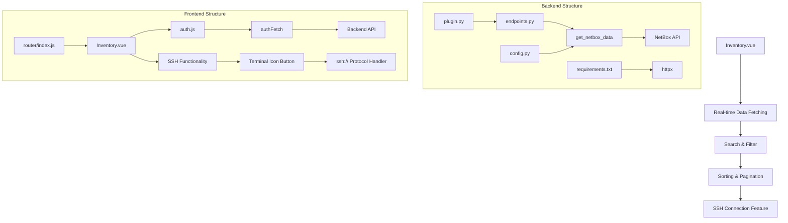
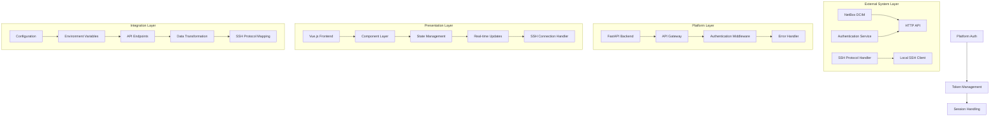
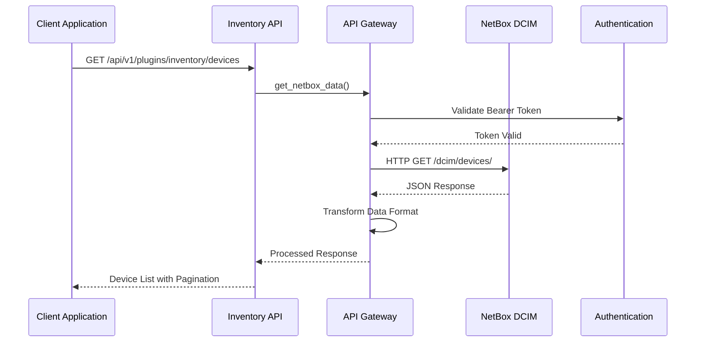
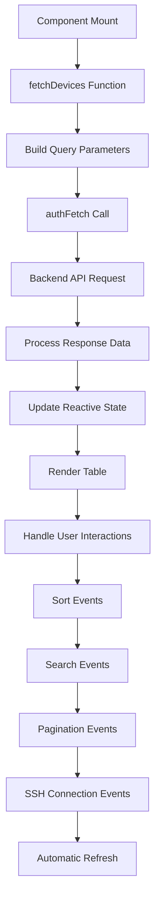
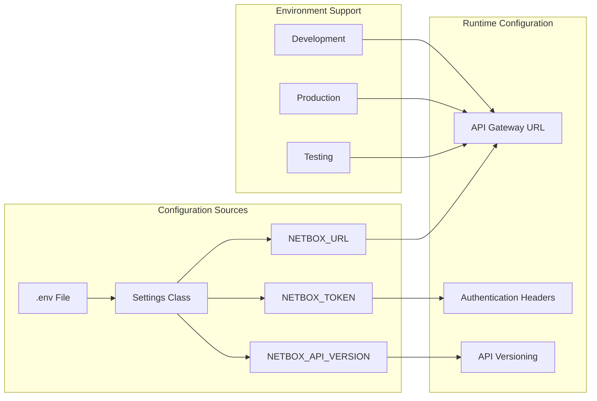
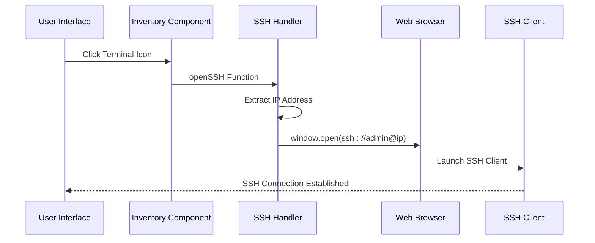
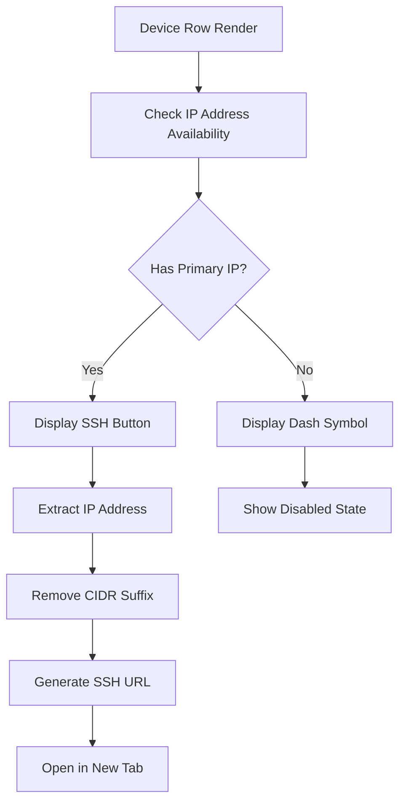
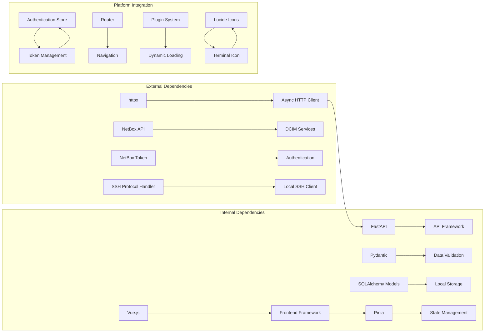

# Inventory Plugin

<cite>
**Referenced Files in This Document**
- [plugin.py](file://backend/app/plugins/inventory/plugin.py)
- [models.py](file://backend/app/plugins/inventory/models.py)
- [schemas.py](file://backend/app/plugins/inventory/schemas.py)
- [endpoints.py](file://backend/app/plugins/inventory/endpoints.py)
- [config.py](file://backend/app/core/config.py)
- [requirements.txt](file://backend/requirements.txt)
- [Inventory.vue](file://frontend/src/plugins/inventory/views/Inventory.vue)
- [router/index.js](file://frontend/src/router/index.js)
- [auth.js](file://frontend/src/stores/auth.js)
</cite>

## Update Summary
**Changes Made**
- Added SSH connectivity enhancement with SSH column in device table
- Implemented terminal icon button that opens SSH connections using ssh://admin@ protocol
- Enhanced device table with SSH connection capability for devices with IP addresses
- Updated frontend component with SSH functionality and improved user experience

## Table of Contents
1. [Introduction](#introduction)
2. [Project Structure](#project-structure)
3. [Core Components](#core-components)
4. [Architecture Overview](#architecture-overview)
5. [Detailed Component Analysis](#detailed-component-analysis)
6. [SSH Connectivity Enhancement](#ssh-connectivity-enhancement)
7. [Dependency Analysis](#dependency-analysis)
8. [Performance Considerations](#performance-considerations)
9. [Troubleshooting Guide](#troubleshooting-guide)
10. [Conclusion](#conclusion)
11. [Appendices](#appendices)

## Introduction
The Inventory Plugin provides network equipment and asset management capabilities within the NOC Vision platform, now integrated with NetBox DCIM (Data Center Infrastructure Management) system. The plugin enables tracking of network devices, their physical locations, and device categories by connecting to an external NetBox instance. This represents a complete architectural shift from a local database-driven system to a cloud-native, external system integration approach.

**Updated** Added SSH connectivity enhancement that allows direct SSH connections to network devices from the inventory interface.

Key capabilities:
- **External System Integration**: Direct connection to NetBox DCIM for real-time device data
- **Comprehensive Device Management**: Real-time listing, searching, and filtering of network devices
- **Advanced Pagination**: Configurable pagination with 1-100 items per page
- **Multi-field Search**: Search across device names and properties
- **Flexible Sorting**: Sort by various device attributes (name, status, etc.)
- **Responsive Frontend**: Modern Vue.js interface with real-time data updates
- **SSH Connectivity**: Direct SSH connections to devices via terminal icon button
- **Authentication Integration**: Seamless integration with platform authentication system
- **Error Handling**: Comprehensive error handling for network connectivity and API failures

## Project Structure
The Inventory Plugin has been transformed into a NetBox-integrated system with clear separation between external API communication and frontend presentation, enhanced with SSH connectivity features:

**Diagram sources**
- [plugin.py:9-17](file://backend/app/plugins/inventory/plugin.py#L9-L17)
- [endpoints.py:9-32](file://backend/app/plugins/inventory/endpoints.py#L9-L32)
- [config.py:33-36](file://backend/app/core/config.py#L33-L36)
- [requirements.txt:11](file://backend/requirements.txt#L11)
- [router/index.js:29](file://frontend/src/router/index.js#L29)
- [auth.js:160-177](file://frontend/src/stores/auth.js#L160-L177)
- [Inventory.vue:82-89](file://frontend/src/plugins/inventory/views/Inventory.vue#L82-L89)
- [Inventory.vue:250-257](file://frontend/src/plugins/inventory/views/Inventory.vue#L250-L257)

**Section sources**
- [plugin.py:1-17](file://backend/app/plugins/inventory/plugin.py#L1-L17)
- [endpoints.py:1-95](file://backend/app/plugins/inventory/endpoints.py#L1-L95)
- [config.py:1-53](file://backend/app/core/config.py#L1-L53)
- [requirements.txt:1-13](file://backend/requirements.txt#L1-L13)
- [router/index.js:29](file://frontend/src/router/index.js#L29)
- [auth.js:160-177](file://frontend/src/stores/auth.js#L160-L177)

## Core Components
The Inventory Plugin now consists of four fundamental components working together to provide comprehensive equipment management through NetBox integration, enhanced with SSH connectivity:

### NetBox API Integration
The plugin implements a robust API gateway to communicate with external NetBox DCIM system:
- **Authentication**: Bearer token authentication with configurable NetBox URL and token
- **Error Handling**: Comprehensive error handling for authentication failures, permission denials, and API errors
- **Timeout Management**: 30-second timeout for reliable network communication
- **Response Processing**: Automatic data transformation from NetBox format to frontend-ready format

### API Endpoints
RESTful endpoints provide device listing with advanced filtering capabilities:
- **GET `/api/v1/plugins/inventory/devices`** - List devices with pagination, search, and sorting
- **Parameters**: page (default: 1), page_size (1-100), q (search query), ordering (sorting field)
- **Response**: Count, pagination links, and transformed device data

### Request/Response Schemas
Pydantic models ensure data validation and serialization for local operations:
- DeviceCreate/DeviceUpdate/DeviceResponse for local device operations
- SiteCreate/SiteResponse for site management
- DeviceTypeCreate/DeviceTypeResponse for equipment categorization

### Frontend Integration
Vue.js components provide a comprehensive user interface with real-time capabilities and SSH connectivity:
- **Real-time Data Fetching**: Automatic device data retrieval from backend API
- **Search Interface**: Multi-field search with instant filtering
- **Sorting Controls**: Clickable column headers for dynamic sorting
- **Pagination System**: Previous/Next navigation with item count display
- **Status Visualization**: Color-coded status indicators with NetBox status values
- **SSH Connection Feature**: Terminal icon button for direct SSH connections
- **Responsive Design**: Mobile-friendly table layout with horizontal scrolling

**Section sources**
- [endpoints.py:9-32](file://backend/app/plugins/inventory/endpoints.py#L9-L32)
- [endpoints.py:35-95](file://backend/app/plugins/inventory/endpoints.py#L35-L95)
- [schemas.py:6-74](file://backend/app/plugins/inventory/schemas.py#L6-L74)
- [Inventory.vue:1-294](file://frontend/src/plugins/inventory/views/Inventory.vue#L1-L294)

## Architecture Overview
The Inventory Plugin follows a modern microservices architecture pattern with external system integration and enhanced SSH connectivity:

**Diagram sources**
- [endpoints.py:9-32](file://backend/app/plugins/inventory/endpoints.py#L9-L32)
- [config.py:33-36](file://backend/app/core/config.py#L33-L36)
- [auth.js:160-177](file://frontend/src/stores/auth.js#L160-L177)
- [Inventory.vue:35-58](file://frontend/src/plugins/inventory/views/Inventory.vue#L35-L58)
- [Inventory.vue:82-89](file://frontend/src/plugins/inventory/views/Inventory.vue#L82-L89)

The architecture ensures:
- **External Integration**: Clean separation between platform and external NetBox system
- **Reliability**: Comprehensive error handling and timeout management
- **Scalability**: Stateless API design with configurable pagination
- **Maintainability**: Modular components with clear responsibilities
- **Security**: Token-based authentication with automatic refresh
- **Performance**: Asynchronous HTTP requests with efficient data processing
- **Enhanced Connectivity**: Direct SSH protocol integration for device management

## Detailed Component Analysis

### NetBox API Communication
The plugin implements a sophisticated API gateway for NetBox integration:

**Diagram sources**
- [endpoints.py:9-32](file://backend/app/plugins/inventory/endpoints.py#L9-L32)
- [endpoints.py:61-86](file://backend/app/plugins/inventory/endpoints.py#L61-L86)

### Frontend Data Management
The Vue.js frontend implements comprehensive state management and real-time updates:

**Diagram sources**
- [Inventory.vue:35-89](file://frontend/src/plugins/inventory/views/Inventory.vue#L35-L89)
- [auth.js:160-177](file://frontend/src/stores/auth.js#L160-L177)

### Configuration Management
The system uses centralized configuration for NetBox integration:

**Diagram sources**
- [config.py:33-36](file://backend/app/core/config.py#L33-L36)
- [config.py:38-41](file://backend/app/core/config.py#L38-L41)

**Section sources**
- [endpoints.py:9-32](file://backend/app/plugins/inventory/endpoints.py#L9-L32)
- [Inventory.vue:35-89](file://frontend/src/plugins/inventory/views/Inventory.vue#L35-L89)
- [config.py:33-36](file://backend/app/core/config.py#L33-L36)
- [auth.js:160-177](file://frontend/src/stores/auth.js#L160-L177)

## SSH Connectivity Enhancement

### SSH Connection Implementation
The Inventory Plugin now includes a powerful SSH connectivity feature that enhances device management capabilities:

**Diagram sources**
- [Inventory.vue:82-89](file://frontend/src/plugins/inventory/views/Inventory.vue#L82-L89)
- [Inventory.vue:250-257](file://frontend/src/plugins/inventory/views/Inventory.vue#L250-L257)

### SSH Table Column Integration
The device table now includes a dedicated SSH column with intelligent IP address handling:

**Diagram sources**
- [Inventory.vue:249-259](file://frontend/src/plugins/inventory/views/Inventory.vue#L249-L259)

### SSH Functionality Features
The SSH connectivity enhancement provides several key features:

- **Automatic IP Detection**: Automatically detects device IP addresses from NetBox data
- **Protocol Support**: Uses ssh://admin@ protocol for seamless SSH client integration
- **CIDR Handling**: Automatically removes subnet masks from IP addresses
- **Conditional Display**: SSH button only appears when device has valid IP address
- **Accessibility**: Clear visual indication with terminal icon and tooltip
- **Security**: Opens in new browser tab for secure connection handling

**Section sources**
- [Inventory.vue:82-89](file://frontend/src/plugins/inventory/views/Inventory.vue#L82-L89)
- [Inventory.vue:249-259](file://frontend/src/plugins/inventory/views/Inventory.vue#L249-L259)

## Dependency Analysis
The Inventory Plugin maintains clean dependencies while integrating with external systems and adding SSH connectivity:

**Diagram sources**
- [requirements.txt:11](file://backend/requirements.txt#L11)
- [auth.js:160-177](file://frontend/src/stores/auth.js#L160-L177)
- [router/index.js:29](file://frontend/src/router/index.js#L29)
- [Inventory.vue:12-19](file://frontend/src/plugins/inventory/views/Inventory.vue#L12-L19)

Key dependency characteristics:
- **External**: NetBox API integration with configurable endpoints and authentication
- **Internal**: FastAPI framework with Pydantic validation and SQLAlchemy models
- **Frontend**: Vue.js ecosystem with Pinia state management and Lucide icons
- **Security**: Platform-wide authentication system with token-based access control
- **Networking**: Async HTTP client with timeout management and error handling
- **SSH Integration**: Native browser SSH protocol handler for seamless device connections

**Section sources**
- [requirements.txt:1-13](file://backend/requirements.txt#L1-L13)
- [auth.js:160-177](file://frontend/src/stores/auth.js#L160-L177)
- [router/index.js:29](file://frontend/src/router/index.js#L29)

## Performance Considerations
The Inventory Plugin is designed for optimal performance through strategic architectural decisions, enhanced with SSH connectivity optimization:

### External System Optimization
- **Connection Management**: Async HTTP client with automatic connection pooling
- **Timeout Configuration**: 30-second timeout prevents hanging requests
- **Error Caching**: Failed requests trigger immediate error responses
- **Pagination Efficiency**: Server-side pagination reduces payload sizes

### API Design Patterns
- **Parameter Validation**: Strict validation for page numbers, page sizes, and filters
- **Response Optimization**: Minimal data transfer with only required fields
- **Authentication Efficiency**: Lightweight token-based authentication
- **Error Handling**: Specific error codes for different failure scenarios

### Frontend Performance
- **Lazy Loading**: Dynamic imports reduce initial bundle size
- **Reactive Updates**: Vue.js reactivity minimizes DOM manipulation
- **State Management**: Efficient Pinia store for plugin registry
- **Icon System**: Optimized Lucide icon library reduces bundle weight
- **Responsive Design**: CSS Grid and Flexbox for optimal mobile performance
- **SSH Connection Optimization**: Minimal overhead for SSH button rendering

### SSH Connectivity Performance
- **Conditional Rendering**: SSH buttons only render when IP addresses are available
- **Efficient URL Generation**: Simple string manipulation for SSH URL creation
- **Browser Integration**: Leverages native browser SSH protocol handler
- **Memory Management**: No persistent SSH connection state maintained

## Troubleshooting Guide

### Common Issues and Solutions

#### NetBox Connection Problems
**Symptoms**: API returns 500 errors, devices not loading
**Causes**: Incorrect NetBox URL, invalid token, network connectivity issues
**Solutions**:
- Verify NETBOX_URL in environment configuration
- Check NETBOX_TOKEN validity and expiration
- Test network connectivity to NetBox server
- Ensure NetBox API is accessible and responding

#### Authentication Errors
**Symptoms**: 401 Unauthorized responses from API endpoints
**Causes**: Missing or invalid JWT tokens, insufficient permissions
**Solutions**:
- Verify user has proper access to NetBox data
- Check JWT token validity and expiration
- Ensure CORS settings allow frontend origin
- Verify authentication store is properly configured

#### Pagination Issues
**Symptoms**: Page size limits exceeded, pagination not working
**Causes**: Invalid page_size parameter, server-side limitations
**Solutions**:
- Ensure page_size is between 1 and 100
- Verify pagination parameters are correctly formatted
- Check server-side pagination configuration

#### Frontend Integration Issues
**Symptoms**: Plugin route not accessible, menu item missing
**Causes**: Route configuration errors, plugin registry issues
**Solutions**:
- Verify router configuration includes plugin route
- Check plugin manifest includes menu items
- Ensure plugin is properly registered in registry

#### SSH Connection Issues
**Symptoms**: SSH button doesn't work, browser doesn't open SSH client
**Causes**: Missing IP addresses, SSH client not installed, browser security restrictions
**Solutions**:
- Verify device has valid IP address in NetBox
- Ensure SSH client is installed and configured on local system
- Check browser supports ssh:// protocol handler
- Verify device SSH service is running and accessible
- Test SSH connection manually using command line

**Section sources**
- [endpoints.py:22-30](file://backend/app/plugins/inventory/endpoints.py#L22-L30)
- [endpoints.py:90-95](file://backend/app/plugins/inventory/endpoints.py#L90-L95)
- [auth.js:160-177](file://frontend/src/stores/auth.js#L160-L177)
- [router/index.js:127-130](file://frontend/src/router/index.js#L127-L130)
- [Inventory.vue:82-89](file://frontend/src/plugins/inventory/views/Inventory.vue#L82-L89)

## Conclusion
The Inventory Plugin demonstrates a modern, cloud-native approach to network equipment and asset management within the NOC Vision platform. The complete architectural overhaul from a local database-driven system to a NetBox-integrated platform provides significant advantages in scalability, maintainability, and operational efficiency.

**Updated** The recent SSH connectivity enhancement significantly improves the plugin's practical utility by enabling direct device management from the inventory interface.

Key strengths include:
- **External System Integration**: Seamless integration with proven NetBox DCIM infrastructure
- **Modern Architecture**: Clean separation of concerns with external API communication
- **Comprehensive Features**: Advanced pagination, search, sorting, and responsive design
- **Enhanced Connectivity**: Direct SSH connections to network devices for efficient management
- **Robust Error Handling**: Comprehensive error management for external system failures
- **Security Integration**: Proper authentication and authorization controls
- **Performance Optimization**: Efficient asynchronous communication and reactive frontend
- **User Experience**: Modern Vue.js interface with real-time updates and intuitive controls

The plugin serves as an excellent example of how to architect domain-specific functionality that integrates with external systems while maintaining platform standards and operational excellence. The addition of SSH connectivity makes it a complete solution for network equipment management within the NOC platform.

## Appendices

### API Reference Summary

#### Device Management Endpoints
- **GET** `/api/v1/plugins/inventory/devices` - List devices with pagination, search, and sorting
- **Parameters**: page (default: 1), page_size (1-100), q (search query), ordering (sorting field)
- **Response**: count, next, previous, results with device data

#### Configuration Parameters
- **NETBOX_URL**: Base URL for NetBox API (default: http://10.100.22.11:8000/api)
- **NETBOX_TOKEN**: Bearer token for NetBox authentication
- **NETBOX_API_VERSION**: API version specification (default: v2)

### Data Model Specifications

#### Device Entity (Transformed)
- **Fields**: id, name, status, site, location, rack, role, device_type, primary_ip, primary_ip4, description
- **Status Values**: active, planned, staged, offline, decommissioned (from NetBox)
- **Relationships**: Foreign key relationships maintained through NetBox associations

#### Site Entity
- **Required Fields**: name
- **Optional Fields**: address, description
- **Local Storage**: Maintained for platform integration

#### DeviceType Entity
- **Required Fields**: name
- **Optional Fields**: manufacturer, model
- **Local Storage**: Maintained for platform integration

### Frontend Integration Points
- **Route**: `/plugins/inventory`
- **Component**: `Inventory.vue`
- **Features**: Real-time data fetching, search, sorting, pagination, SSH connectivity
- **Authentication**: Integrated with platform auth store
- **Responsive Design**: Mobile-first approach with horizontal scrolling tables
- **SSH Integration**: Terminal icon button for direct device connections

### SSH Connectivity Features
- **SSH Column**: Dedicated column in device table for SSH access
- **Terminal Icon**: Lucide terminal icon for visual SSH indicator
- **Protocol Support**: Uses ssh://admin@ protocol for seamless integration
- **IP Address Handling**: Automatic CIDR removal and validation
- **Conditional Display**: SSH button only appears when device has IP address
- **Accessibility**: Clear tooltips and visual feedback

### Configuration Requirements
- **Environment Variables**: NETBOX_URL, NETBOX_TOKEN, NETBOX_API_VERSION
- **Network Access**: Outbound access to NetBox server
- **Authentication**: Valid NetBox API token with appropriate permissions
- **Frontend**: Access to backend API endpoints with proper CORS configuration
- **SSH Client**: Local SSH client installation for device connections
- **Browser Support**: Browser with ssh:// protocol handler support