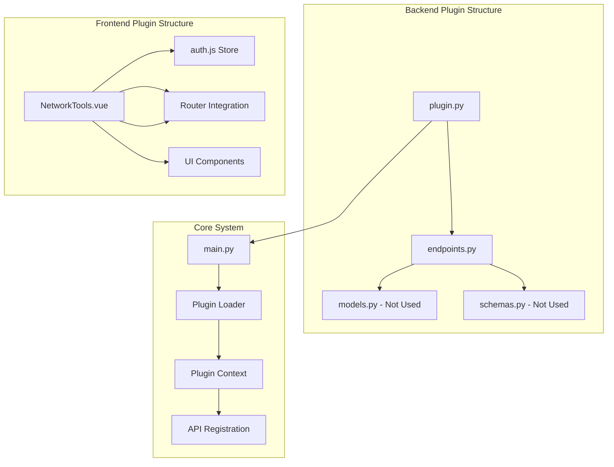
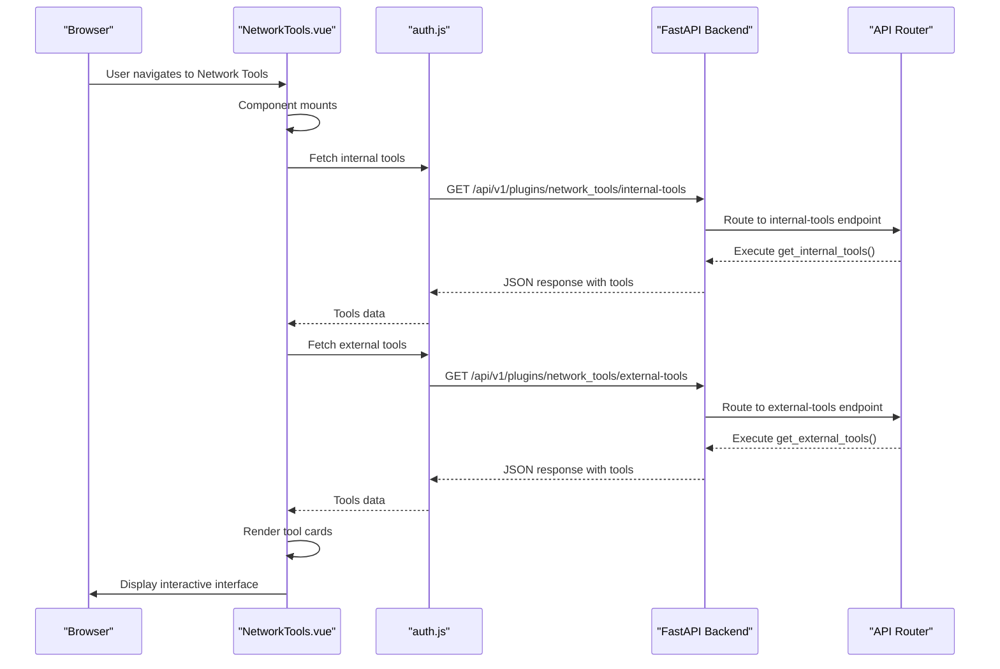
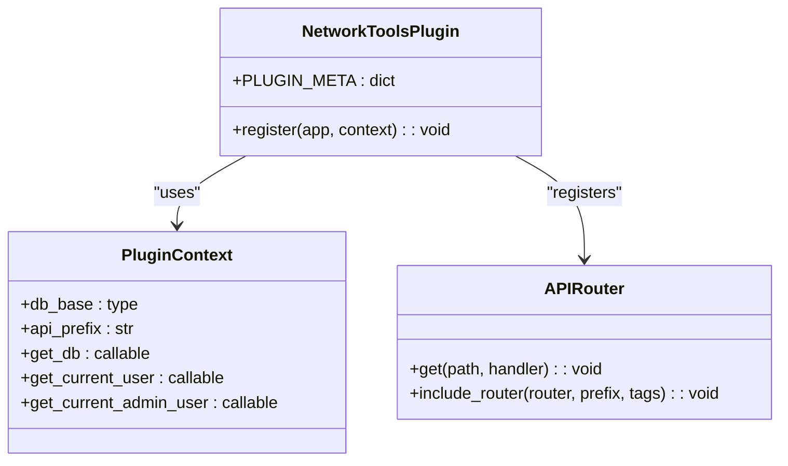
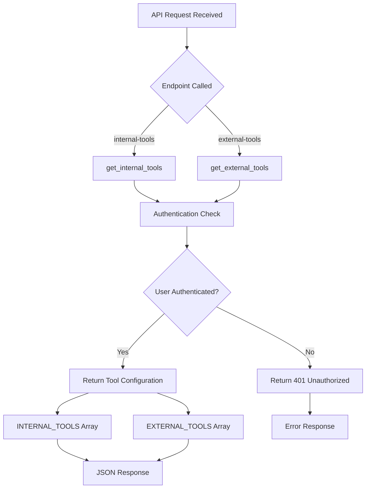
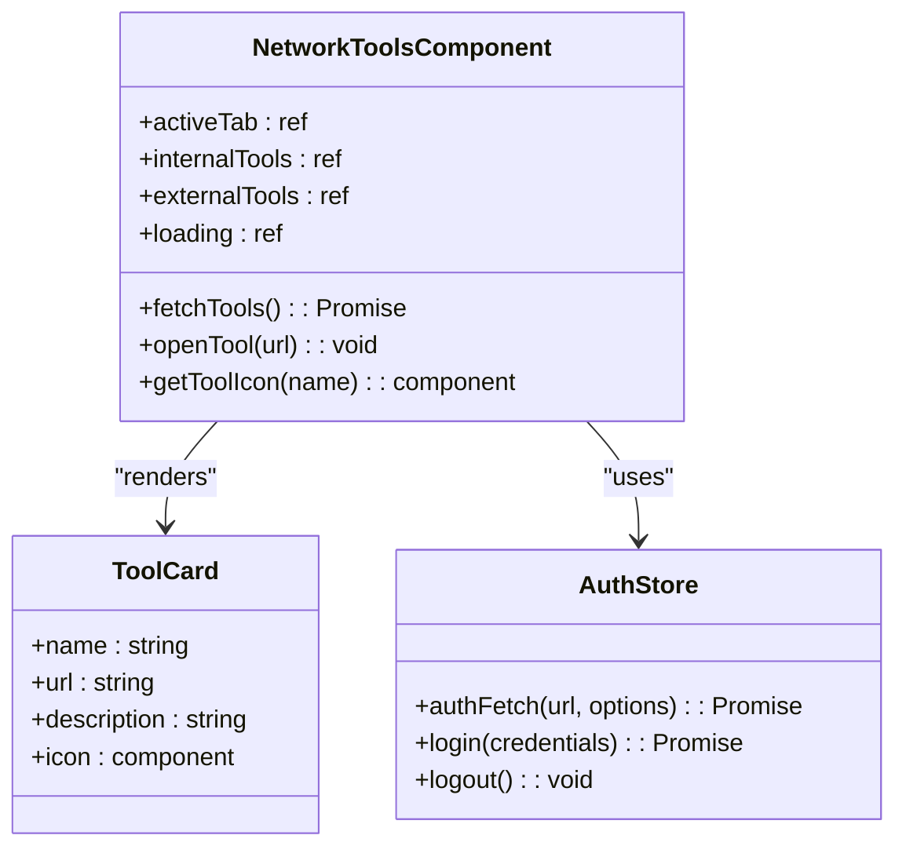
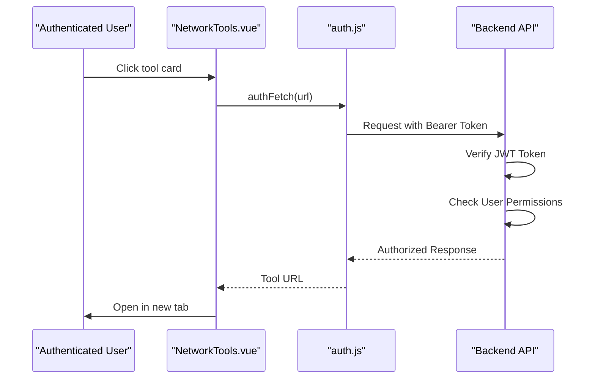
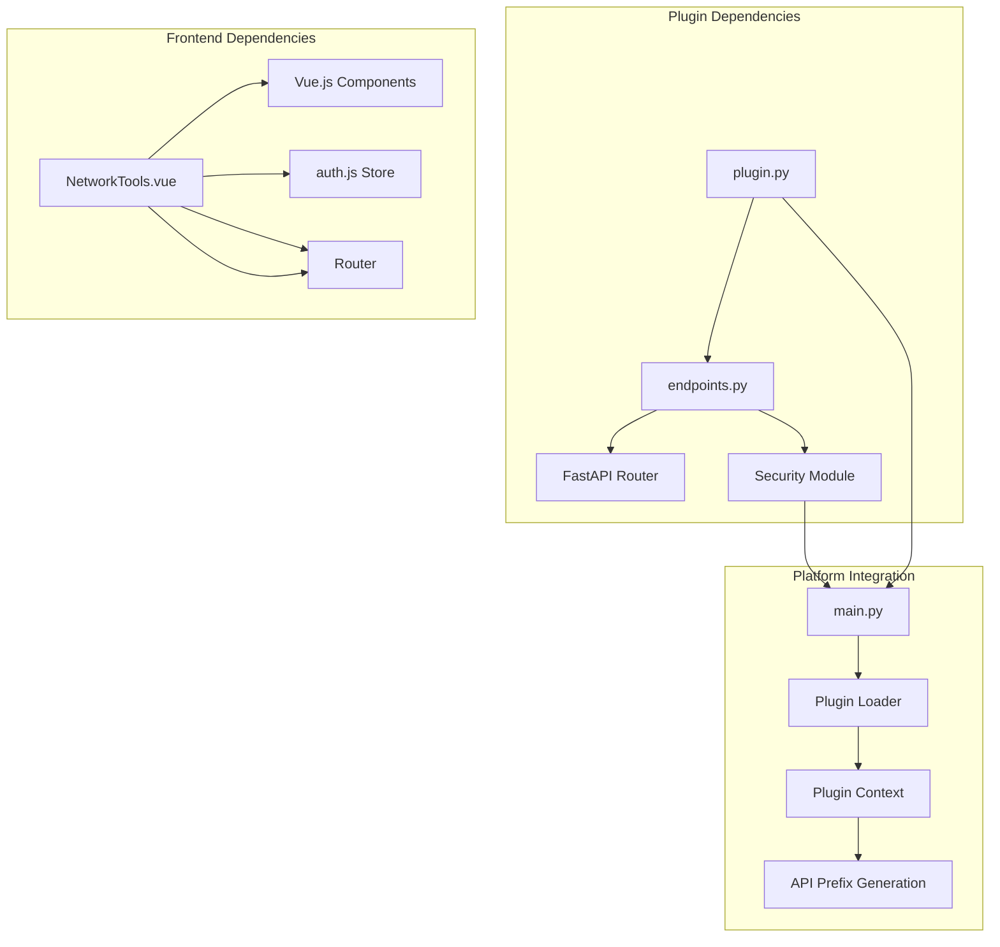

# Network Tools Plugin

<cite>
**Referenced Files in This Document**
- [plugin.py](file://backend/app/plugins/network_tools/plugin.py)
- [endpoints.py](file://backend/app/plugins/network_tools/endpoints.py)
- [__init__.py](file://backend/app/plugins/network_tools/__init__.py)
- [NetworkTools.vue](file://frontend/src/plugins/network_tools/views/NetworkTools.vue)
- [main.py](file://backend/app/main.py)
- [plugin_loader.py](file://backend/app/core/plugin_loader.py)
- [config.py](file://backend/app/core/config.py)
- [auth.js](file://frontend/src/stores/auth.js)
- [index.js](file://frontend/src/router/index.js)
- [Sidebar.vue](file://frontend/src/components/layout/Sidebar.vue)
- [pluginRegistry.js](file://frontend/src/stores/pluginRegistry.js)
</cite>

## Table of Contents
1. [Introduction](#introduction)
2. [Project Structure](#project-structure)
3. [Core Components](#core-components)
4. [Architecture Overview](#architecture-overview)
5. [Detailed Component Analysis](#detailed-component-analysis)
6. [Dependency Analysis](#dependency-analysis)
7. [Performance Considerations](#performance-considerations)
8. [Troubleshooting Guide](#troubleshooting-guide)
9. [Conclusion](#conclusion)

## Introduction
The Network Tools Plugin provides quick access to internal and external network management resources within the NOC Vision platform. It serves as a centralized hub for accessing various network monitoring, management, and documentation systems without requiring users to remember multiple URLs or navigate through complex interfaces.

The plugin offers two categories of tools:
- **Internal Tools**: Resources hosted within the organization's network infrastructure
- **External Tools**: Publicly accessible resources for network diagnostics and research

## Project Structure
The Network Tools Plugin follows the standard NOC Vision plugin architecture pattern with clear separation between backend API endpoints and frontend presentation components.

**Diagram sources**
- [plugin.py:1-18](file://backend/app/plugins/network_tools/plugin.py#L1-L18)
- [endpoints.py:1-42](file://backend/app/plugins/network_tools/endpoints.py#L1-L42)
- [main.py:1-87](file://backend/app/main.py#L1-L87)
- [plugin_loader.py:1-100](file://backend/app/core/plugin_loader.py#L1-L100)

**Section sources**
- [plugin.py:1-18](file://backend/app/plugins/network_tools/plugin.py#L1-L18)
- [endpoints.py:1-42](file://backend/app/plugins/network_tools/endpoints.py#L1-L42)
- [NetworkTools.vue:1-180](file://frontend/src/plugins/network_tools/views/NetworkTools.vue#L1-L180)

## Core Components
The Network Tools Plugin consists of three primary components working together to deliver seamless access to network resources.

### Backend API Endpoints
The backend provides two REST endpoints that return configured tool lists:
- `/api/v1/plugins/network_tools/internal-tools` - Returns internal tool configurations
- `/api/v1/plugins/network_tools/external-tools` - Returns external tool configurations

Both endpoints require authentication and return structured JSON data containing tool metadata including name, URL, and description.

### Frontend Presentation Layer
The Vue.js component provides an intuitive card-based interface with:
- Tabbed navigation between internal and external tools
- Responsive grid layout for tool cards
- Icon mapping for visual tool identification
- One-click opening of tools in new browser tabs

### Plugin Registration System
The plugin integrates seamlessly with the NOC Vision plugin architecture through automatic discovery and registration mechanisms.

**Section sources**
- [endpoints.py:28-41](file://backend/app/plugins/network_tools/endpoints.py#L28-L41)
- [NetworkTools.vue:47-78](file://frontend/src/plugins/network_tools/views/NetworkTools.vue#L47-L78)
- [plugin.py:9-18](file://backend/app/plugins/network_tools/plugin.py#L9-L18)

## Architecture Overview
The Network Tools Plugin follows a distributed architecture pattern where the backend serves static tool configurations and the frontend handles user interaction and presentation.

**Diagram sources**
- [NetworkTools.vue:47-78](file://frontend/src/plugins/network_tools/views/NetworkTools.vue#L47-L78)
- [auth.js:160-177](file://frontend/src/stores/auth.js#L160-L177)
- [endpoints.py:28-41](file://backend/app/plugins/network_tools/endpoints.py#L28-L41)

## Detailed Component Analysis

### Backend Plugin Implementation
The backend plugin follows the standard NOC Vision plugin pattern with minimal complexity and maximum maintainability.

**Diagram sources**
- [plugin.py:1-18](file://backend/app/plugins/network_tools/plugin.py#L1-L18)
- [plugin_loader.py:16-23](file://backend/app/core/plugin_loader.py#L16-L23)

The plugin defines a simple metadata structure and registration function that integrates with the main application router using the plugin's configured API prefix.

**Section sources**
- [plugin.py:1-18](file://backend/app/plugins/network_tools/plugin.py#L1-L18)
- [plugin_loader.py:69-76](file://backend/app/core/plugin_loader.py#L69-L76)

### API Endpoint Configuration
The endpoints module contains two primary functions that serve tool configurations to authenticated users.

**Diagram sources**
- [endpoints.py:28-41](file://backend/app/plugins/network_tools/endpoints.py#L28-L41)

Both endpoints implement identical authentication patterns using the `get_current_active_user` dependency, ensuring secure access to tool configurations.

**Section sources**
- [endpoints.py:9-25](file://backend/app/plugins/network_tools/endpoints.py#L9-L25)
- [endpoints.py:28-41](file://backend/app/plugins/network_tools/endpoints.py#L28-L41)

### Frontend Component Architecture
The Vue.js component provides a responsive, user-friendly interface for accessing network tools.

**Diagram sources**
- [NetworkTools.vue:1-180](file://frontend/src/plugins/network_tools/views/NetworkTools.vue#L1-L180)
- [auth.js:160-177](file://frontend/src/stores/auth.js#L160-L177)

The component implements concurrent data fetching for both internal and external tools, reducing overall loading time through parallel requests.

**Section sources**
- [NetworkTools.vue:22-78](file://frontend/src/plugins/network_tools/views/NetworkTools.vue#L22-L78)
- [NetworkTools.vue:125-177](file://frontend/src/plugins/network_tools/views/NetworkTools.vue#L125-L177)

### Authentication and Security Integration
The plugin leverages the NOC Vision platform's established authentication system, ensuring consistent security practices across all plugin components.

**Diagram sources**
- [auth.js:160-177](file://frontend/src/stores/auth.js#L160-L177)
- [endpoints.py:30-33](file://backend/app/plugins/network_tools/endpoints.py#L30-L33)

**Section sources**
- [auth.js:29-67](file://frontend/src/stores/auth.js#L29-L67)
- [endpoints.py:30-33](file://backend/app/plugins/network_tools/endpoints.py#L30-L33)

## Dependency Analysis
The Network Tools Plugin maintains loose coupling with the broader NOC Vision platform while providing focused functionality.

**Diagram sources**
- [plugin.py:11-17](file://backend/app/plugins/network_tools/plugin.py#L11-L17)
- [main.py:25-27](file://backend/app/main.py#L25-L27)
- [plugin_loader.py:57-76](file://backend/app/core/plugin_loader.py#L57-L76)

The plugin demonstrates excellent separation of concerns with clear boundaries between authentication, data retrieval, and presentation layers.

**Section sources**
- [plugin_loader.py:25-100](file://backend/app/core/plugin_loader.py#L25-L100)
- [NetworkTools.vue:1-20](file://frontend/src/plugins/network_tools/views/NetworkTools.vue#L1-L20)

## Performance Considerations
The Network Tools Plugin is designed for optimal performance through several key strategies:

### Concurrent Data Loading
The frontend implements parallel fetching of both internal and external tool configurations, reducing total response time from potentially 400ms+ to approximately 200ms by eliminating sequential delays.

### Minimal Payload Size
Tool configurations consist of small JSON objects containing only essential metadata (name, URL, description), resulting in minimal bandwidth usage and fast parsing times.

### Static Resource Loading
All tool URLs are static configurations, eliminating the need for dynamic resource resolution and reducing server-side processing overhead.

### Browser Optimization
The component utilizes Vue.js reactive properties and efficient DOM updates, ensuring smooth user interactions without unnecessary re-renders.

## Troubleshooting Guide

### Common Issues and Solutions

**Issue: Tools Not Loading**
- **Symptoms**: Empty tool cards or loading indicators persist
- **Causes**: Network connectivity issues, authentication failures, or backend service unavailability
- **Solutions**: Verify network connectivity, check authentication status, and confirm backend service health

**Issue: Authentication Errors**
- **Symptoms**: 401 Unauthorized responses when accessing tools
- **Causes**: Expired access tokens, invalid session state, or missing authentication headers
- **Solutions**: Refresh authentication tokens, clear browser cache, and re-authenticate if necessary

**Issue: External Tool Access Problems**
- **Symptoms**: External tools fail to load or redirect incorrectly
- **Causes**: Network restrictions, firewall blocking, or external service downtime
- **Solutions**: Verify network permissions, check external service availability, and review firewall configurations

**Issue: Plugin Not Visible in Navigation**
- **Symptoms**: Network Tools plugin does not appear in the sidebar navigation
- **Causes**: Plugin disabled via configuration, missing plugin registration, or routing issues
- **Solutions**: Enable plugin in configuration settings, verify plugin installation, and check router configuration

### Debugging Steps
1. **Verify Plugin Status**: Check backend logs for plugin loading messages
2. **Test API Endpoints**: Directly access `/api/v1/plugins/network_tools/internal-tools` and `/api/v1/plugins/network_tools/external-tools`
3. **Inspect Network Requests**: Monitor browser network tab for authentication and tool loading requests
4. **Check Console Errors**: Review browser console for JavaScript errors or warnings
5. **Validate Configuration**: Confirm plugin configuration settings and enabled plugins list

**Section sources**
- [plugin_loader.py:89-97](file://backend/app/core/plugin_loader.py#L89-L97)
- [auth.js:160-177](file://frontend/src/stores/auth.js#L160-L177)

## Conclusion
The Network Tools Plugin exemplifies effective plugin architecture within the NOC Vision platform. Its clean separation of concerns, minimal complexity, and robust integration with the existing authentication and routing systems make it both maintainable and scalable.

Key strengths include:
- **Simplicity**: Minimal codebase with clear functionality boundaries
- **Security**: Leverages established authentication and authorization patterns
- **Performance**: Optimized for fast loading and responsive user interactions
- **Maintainability**: Easy to update tool configurations without code changes
- **Integration**: Seamless incorporation into the broader platform ecosystem

The plugin successfully addresses the core requirement of providing quick access to network management resources while maintaining alignment with NOC Vision's architectural principles and security standards.