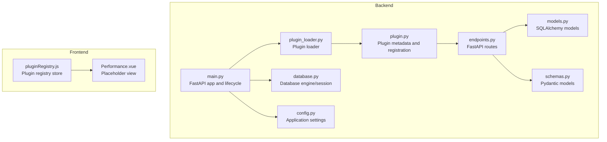
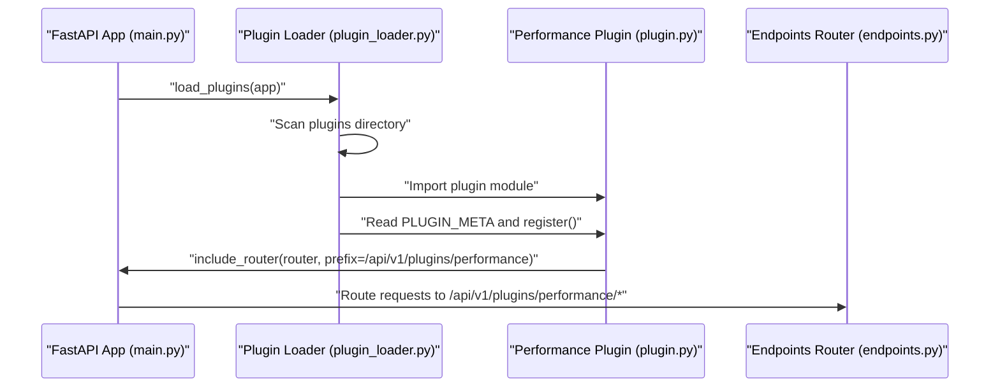
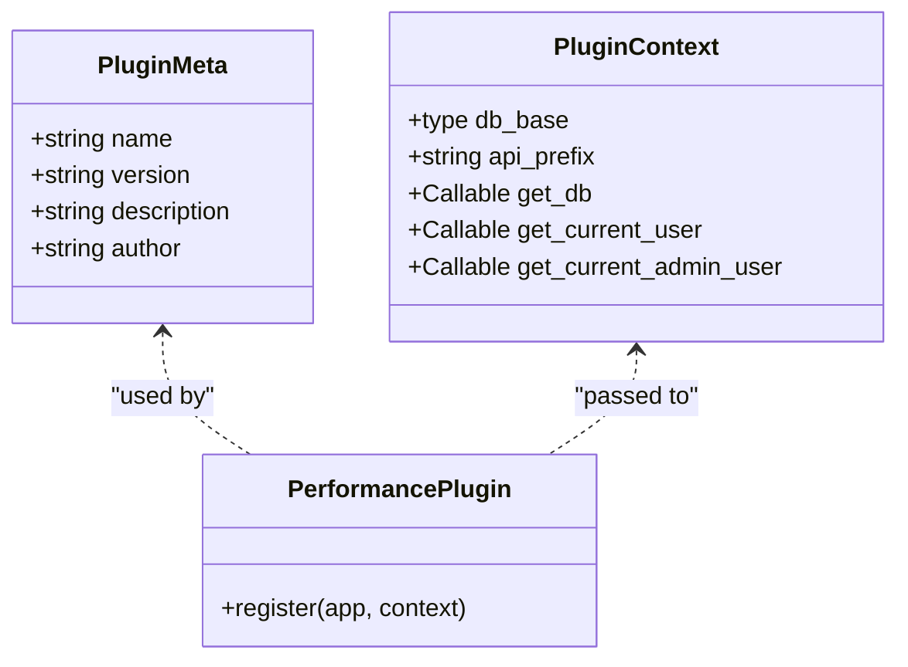
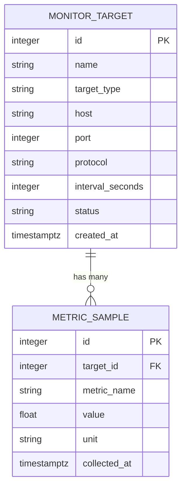
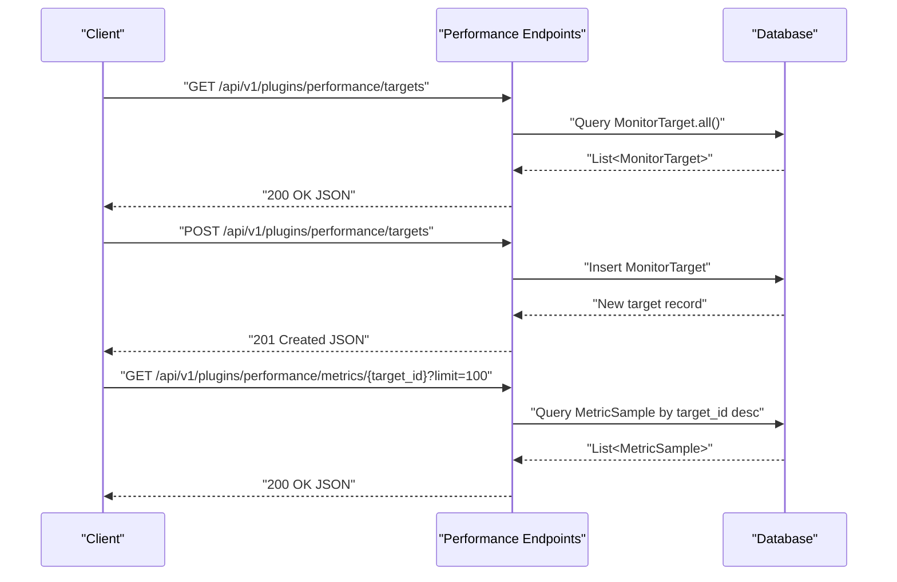
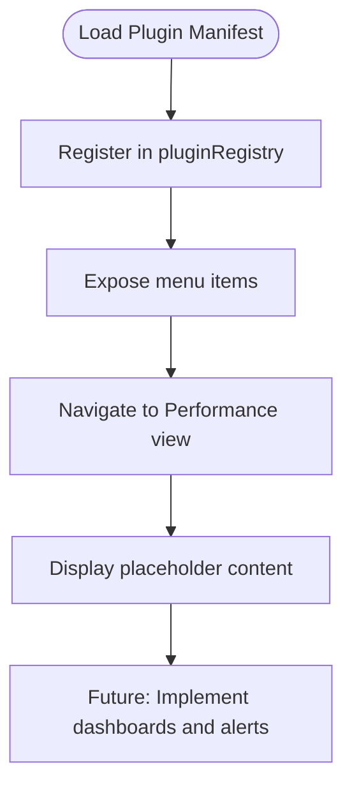
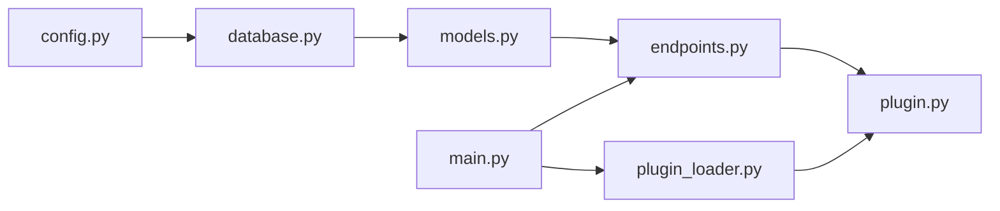

# Performance Plugin

<cite>
**Referenced Files in This Document**
- [plugin.py](file://backend/app/plugins/performance/plugin.py)
- [models.py](file://backend/app/plugins/performance/models.py)
- [schemas.py](file://backend/app/plugins/performance/schemas.py)
- [endpoints.py](file://backend/app/plugins/performance/endpoints.py)
- [main.py](file://backend/app/main.py)
- [plugin_loader.py](file://backend/app/core/plugin_loader.py)
- [config.py](file://backend/app/core/config.py)
- [database.py](file://backend/app/core/database.py)
- [Performance.vue](file://frontend/src/plugins/performance/views/Performance.vue)
- [pluginRegistry.js](file://frontend/src/stores/pluginRegistry.js)
- [README.md](file://README.md)
</cite>

## Table of Contents
1. [Introduction](#introduction)
2. [Project Structure](#project-structure)
3. [Core Components](#core-components)
4. [Architecture Overview](#architecture-overview)
5. [Detailed Component Analysis](#detailed-component-analysis)
6. [Dependency Analysis](#dependency-analysis)
7. [Performance Considerations](#performance-considerations)
8. [Troubleshooting Guide](#troubleshooting-guide)
9. [Conclusion](#conclusion)
10. [Appendices](#appendices)

## Introduction
The Performance Plugin provides network performance monitoring capabilities within the NOC Vision platform. It enables administrators to define monitoring targets, collect metrics samples, and query historical performance data. The plugin follows the platform's plugin architecture, exposing REST endpoints under a dedicated API namespace and integrating with the shared authentication and authorization layers.

Key capabilities currently implemented:
- Monitoring target lifecycle management (list, create, retrieve, delete)
- Metrics sampling retrieval per target with configurable limits
- Integration with the centralized plugin loader and shared security middleware

Planned enhancements (as indicated by the frontend placeholder) include:
- Threshold-based alerting
- Visualization dashboards
- Advanced querying and reporting

## Project Structure
The Performance Plugin is organized into backend and frontend components:
- Backend: plugin metadata, database models, Pydantic schemas, and API endpoints
- Frontend: a placeholder view indicating upcoming features

**Diagram sources**
- [plugin.py:1-17](file://backend/app/plugins/performance/plugin.py#L1-L17)
- [models.py:1-29](file://backend/app/plugins/performance/models.py#L1-L29)
- [schemas.py:1-38](file://backend/app/plugins/performance/schemas.py#L1-L38)
- [endpoints.py:1-75](file://backend/app/plugins/performance/endpoints.py#L1-L75)
- [plugin_loader.py:1-100](file://backend/app/core/plugin_loader.py#L1-L100)
- [config.py:1-46](file://backend/app/core/config.py#L1-L46)
- [database.py:1-18](file://backend/app/core/database.py#L1-L18)
- [main.py:1-87](file://backend/app/main.py#L1-L87)
- [Performance.vue:1-34](file://frontend/src/plugins/performance/views/Performance.vue#L1-L34)
- [pluginRegistry.js:1-53](file://frontend/src/stores/pluginRegistry.js#L1-L53)

**Section sources**
- [README.md:41-48](file://README.md#L41-L48)
- [plugin.py:1-17](file://backend/app/plugins/performance/plugin.py#L1-L17)
- [endpoints.py:1-75](file://backend/app/plugins/performance/endpoints.py#L1-L75)
- [Performance.vue:1-34](file://frontend/src/plugins/performance/views/Performance.vue#L1-L34)

## Core Components
- Plugin metadata and registration: Defines plugin identity and registers API routes under a plugin-specific prefix.
- Data models: Define relational tables for monitor targets and metric samples.
- Pydantic schemas: Validate request payloads and serialize responses.
- API endpoints: Expose CRUD-like operations for monitor targets and metrics retrieval.

**Section sources**
- [plugin.py:1-17](file://backend/app/plugins/performance/plugin.py#L1-L17)
- [models.py:1-29](file://backend/app/plugins/performance/models.py#L1-L29)
- [schemas.py:1-38](file://backend/app/plugins/performance/schemas.py#L1-L38)
- [endpoints.py:1-75](file://backend/app/plugins/performance/endpoints.py#L1-L75)

## Architecture Overview
The Performance Plugin adheres to the platform’s plugin architecture:
- Centralized plugin loader discovers plugins, imports their models, and invokes their registration function.
- Each plugin receives a context containing shared dependencies (database base, API prefix, dependency providers).
- The plugin registers its router with a prefix derived from the plugin name, enabling isolated namespaces for plugin APIs.

**Diagram sources**
- [main.py:17-48](file://backend/app/main.py#L17-L48)
- [plugin_loader.py:25-99](file://backend/app/core/plugin_loader.py#L25-L99)
- [plugin.py:9-16](file://backend/app/plugins/performance/plugin.py#L9-L16)
- [endpoints.py:11](file://backend/app/plugins/performance/endpoints.py#L11)

## Detailed Component Analysis

### Plugin Registration and Lifecycle
- Metadata: Provides human-readable identification and description for the plugin.
- Registration: Attaches the plugin’s router to the FastAPI app with a tag and a plugin-scoped API prefix.
- Context: Supplies database base, dependency providers, and API prefix to the plugin during registration.

**Diagram sources**
- [plugin.py:1-6](file://backend/app/plugins/performance/plugin.py#L1-L6)
- [plugin_loader.py:16-23](file://backend/app/core/plugin_loader.py#L16-L23)
- [plugin_loader.py:70-76](file://backend/app/core/plugin_loader.py#L70-L76)
- [plugin.py:9-16](file://backend/app/plugins/performance/plugin.py#L9-L16)

**Section sources**
- [plugin.py:1-17](file://backend/app/plugins/performance/plugin.py#L1-L17)
- [plugin_loader.py:25-99](file://backend/app/core/plugin_loader.py#L25-L99)

### Data Models and Schemas
- MonitorTarget: Represents a monitored entity (host, interface, service) with attributes such as name, type, host address, optional port and protocol, polling interval, and status.
- MetricSample: Stores individual metric readings with target association, metric name, numeric value, unit, and collection timestamp.
- Pydantic schemas: Define request validation for creating monitor targets and response serialization for targets and metrics.

**Diagram sources**
- [models.py:6-17](file://backend/app/plugins/performance/models.py#L6-L17)
- [models.py:20-28](file://backend/app/plugins/performance/models.py#L20-L28)

**Section sources**
- [models.py:1-29](file://backend/app/plugins/performance/models.py#L1-L29)
- [schemas.py:1-38](file://backend/app/plugins/performance/schemas.py#L1-L38)

### API Endpoints and Workflows
The plugin exposes the following endpoints:
- GET /api/v1/plugins/performance/targets: Lists all monitor targets (requires active user).
- POST /api/v1/plugins/performance/targets: Creates a new monitor target (requires admin).
- GET /api/v1/plugins/performance/targets/{target_id}: Retrieves a specific target (requires active user).
- DELETE /api/v1/plugins/performance/targets/{target_id}: Deletes a target (requires admin).
- GET /api/v1/plugins/performance/metrics/{target_id}: Retrieves recent metric samples for a target (requires active user).

**Diagram sources**
- [endpoints.py:14-74](file://backend/app/plugins/performance/endpoints.py#L14-L74)

**Section sources**
- [endpoints.py:1-75](file://backend/app/plugins/performance/endpoints.py#L1-L75)

### Frontend Integration and Dashboard
- Placeholder View: The frontend Performance view currently lists planned features and indicates future development.
- Plugin Registry: The Pinia store manages plugin manifests and menu items, enabling dynamic navigation integration.

**Diagram sources**
- [pluginRegistry.js:26-36](file://frontend/src/stores/pluginRegistry.js#L26-L36)
- [Performance.vue:16-31](file://frontend/src/plugins/performance/views/Performance.vue#L16-L31)

**Section sources**
- [pluginRegistry.js:1-53](file://frontend/src/stores/pluginRegistry.js#L1-L53)
- [Performance.vue:1-34](file://frontend/src/plugins/performance/views/Performance.vue#L1-L34)

## Dependency Analysis
The Performance Plugin depends on shared backend infrastructure:
- Database engine and session management
- Centralized plugin loader for discovery and registration
- Global application settings for configuration
- Security middleware for user and admin access checks

**Diagram sources**
- [config.py:1-46](file://backend/app/core/config.py#L1-L46)
- [database.py:1-18](file://backend/app/core/database.py#L1-L18)
- [models.py:1-29](file://backend/app/plugins/performance/models.py#L1-L29)
- [endpoints.py:1-75](file://backend/app/plugins/performance/endpoints.py#L1-L75)
- [plugin.py:1-17](file://backend/app/plugins/performance/plugin.py#L1-L17)
- [plugin_loader.py:1-100](file://backend/app/core/plugin_loader.py#L1-L100)
- [main.py:1-87](file://backend/app/main.py#L1-L87)

**Section sources**
- [plugin_loader.py:25-99](file://backend/app/core/plugin_loader.py#L25-L99)
- [main.py:17-48](file://backend/app/main.py#L17-L48)

## Performance Considerations
- Database indexing: Primary keys are indexed by SQLAlchemy, but consider adding composite indexes for frequent queries (e.g., MetricSample.target_id + collected_at).
- Pagination and limits: The metrics endpoint supports a configurable limit to prevent large result sets.
- Connection pooling: Engine configuration uses pre-ping to handle stale connections; ensure appropriate pool settings for production workloads.
- Endpoint caching: For read-heavy dashboards, consider caching strategies at the application or reverse proxy level.

[No sources needed since this section provides general guidance]

## Troubleshooting Guide
Common issues and resolutions:
- Plugin not loaded: Verify plugin directory structure and presence of plugin.py with required metadata and register function.
- Database errors: Confirm database connectivity and that tables are created or migrated.
- Authentication failures: Ensure requests include valid JWT tokens and that admin privileges are used for write operations.
- CORS issues: Align allowed origins with frontend URLs.

**Section sources**
- [plugin_loader.py:25-99](file://backend/app/core/plugin_loader.py#L25-L99)
- [config.py:15-19](file://backend/app/core/config.py#L15-L19)
- [endpoints.py:22-32](file://backend/app/plugins/performance/endpoints.py#L22-L32)

## Conclusion
The Performance Plugin establishes a solid foundation for network performance monitoring within NOC Vision. It provides essential building blocks for managing monitoring targets and retrieving metrics, while leveraging the platform’s plugin architecture and shared infrastructure. Future enhancements should focus on implementing alerting, visualization, and advanced querying capabilities to deliver a complete monitoring solution.

[No sources needed since this section summarizes without analyzing specific files]

## Appendices

### API Reference

- Base URL
  - /api/v1/plugins/performance

- Authentication and Authorization
  - Active user required for read operations
  - Admin required for write operations

- Endpoints

  - GET /targets
    - Description: List all monitor targets
    - Authentication: Active user
    - Response: Array of MonitorTargetResponse

  - POST /targets
    - Description: Create a new monitor target
    - Authentication: Admin
    - Request body: MonitorTargetCreate
    - Response: MonitorTargetResponse

  - GET /targets/{target_id}
    - Description: Get a specific monitor target
    - Authentication: Active user
    - Response: MonitorTargetResponse
    - Errors: 404 Not Found if target does not exist

  - DELETE /targets/{target_id}
    - Description: Delete a monitor target
    - Authentication: Admin
    - Response: { status: "ok", message: "Target deleted" }
    - Errors: 404 Not Found if target does not exist

  - GET /metrics/{target_id}
    - Description: Retrieve recent metric samples for a target
    - Authentication: Active user
    - Query parameters:
      - limit: integer, default 100
    - Response: Array of MetricSampleResponse ordered by collected_at descending

**Section sources**
- [endpoints.py:14-74](file://backend/app/plugins/performance/endpoints.py#L14-L74)
- [schemas.py:6-37](file://backend/app/plugins/performance/schemas.py#L6-L37)

### Data Models Reference

- MonitorTarget
  - id: integer (primary key)
  - name: string
  - target_type: string (host, interface, service)
  - host: string
  - port: integer (nullable)
  - protocol: string (nullable)
  - interval_seconds: integer (default 60)
  - status: string (default active)
  - created_at: timestamptz

- MetricSample
  - id: integer (primary key)
  - target_id: integer (foreign key to MonitorTarget)
  - metric_name: string
  - value: float
  - unit: string (nullable)
  - collected_at: timestamptz

**Section sources**
- [models.py:6-17](file://backend/app/plugins/performance/models.py#L6-L17)
- [models.py:20-28](file://backend/app/plugins/performance/models.py#L20-L28)

### Frontend Integration Notes
- The Performance view is currently a placeholder indicating upcoming features.
- The plugin registry store supports dynamic menu integration and plugin lifecycle management.

**Section sources**
- [Performance.vue:16-31](file://frontend/src/plugins/performance/views/Performance.vue#L16-L31)
- [pluginRegistry.js:26-36](file://frontend/src/stores/pluginRegistry.js#L26-L36)