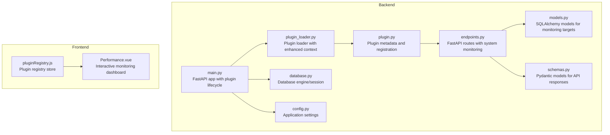
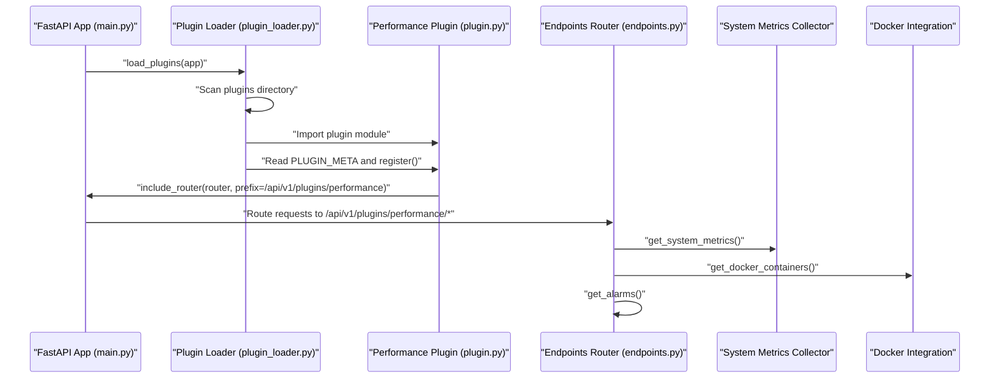
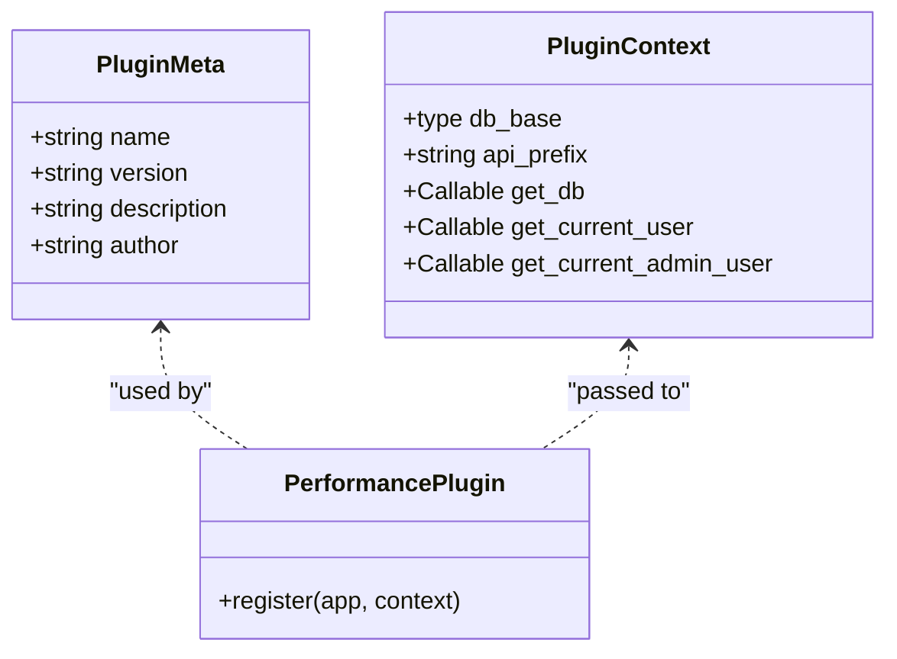
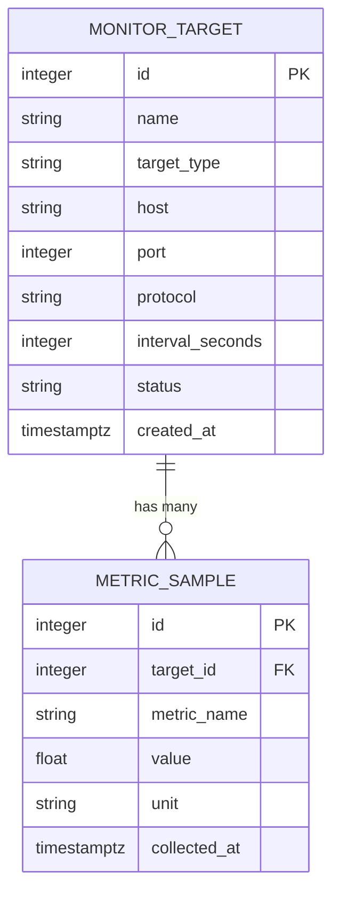
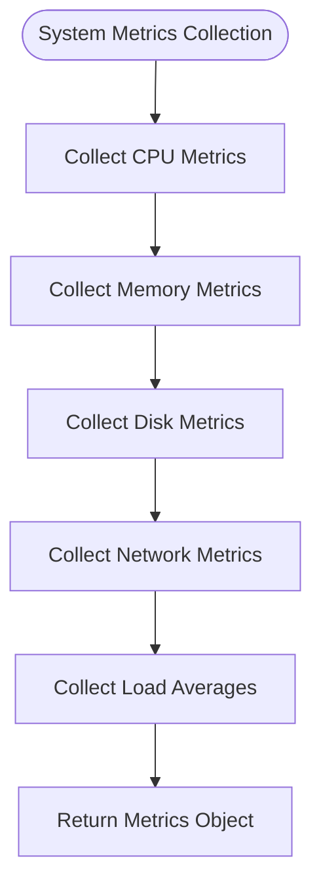
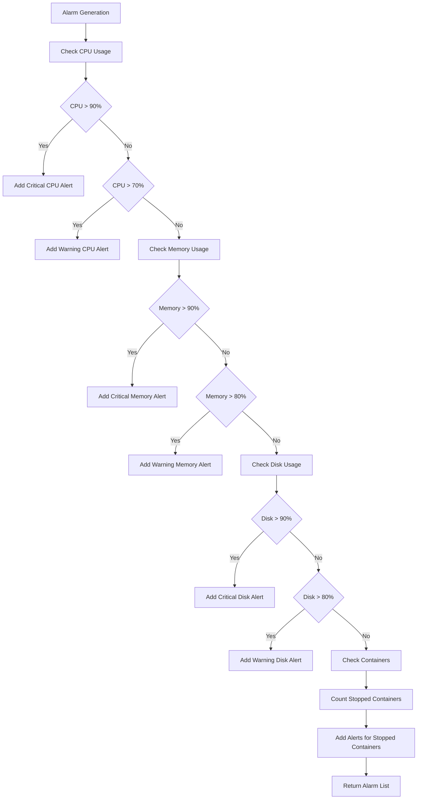
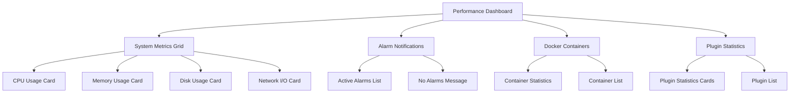
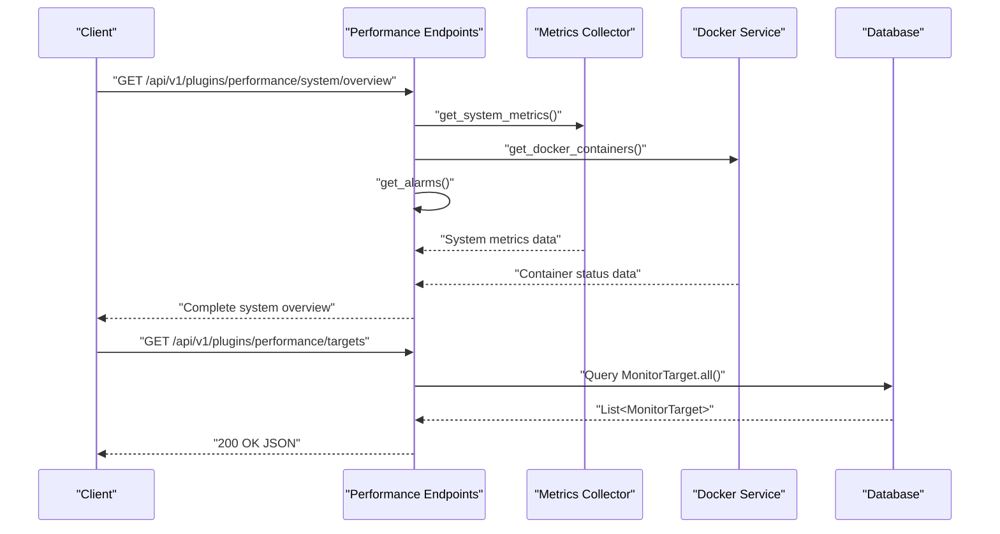
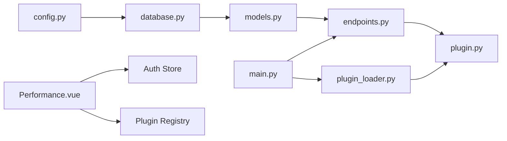

# Performance Plugin

<cite>
**Referenced Files in This Document**
- [plugin.py](file://backend/app/plugins/performance/plugin.py)
- [models.py](file://backend/app/plugins/performance/models.py)
- [schemas.py](file://backend/app/plugins/performance/schemas.py)
- [endpoints.py](file://backend/app/plugins/performance/endpoints.py)
- [main.py](file://backend/app/main.py)
- [plugin_loader.py](file://backend/app/core/plugin_loader.py)
- [config.py](file://backend/app/core/config.py)
- [database.py](file://backend/app/core/database.py)
- [Performance.vue](file://frontend/src/plugins/performance/views/Performance.vue)
- [pluginRegistry.js](file://frontend/src/stores/pluginRegistry.js)
- [README.md](file://README.md)
</cite>

## Update Summary
**Changes Made**
- Complete transformation from placeholder to comprehensive system monitoring plugin
- Added real-time system metrics collection (CPU, RAM, Disk, Network)
- Integrated Docker container monitoring with status tracking
- Implemented alarm system with threshold-based notifications
- Enhanced frontend with interactive dashboard and progress bars
- Added comprehensive API endpoints for system overview and monitoring
- Updated architecture to support real-time monitoring workflows

## Table of Contents
1. [Introduction](#introduction)
2. [Project Structure](#project-structure)
3. [Core Components](#core-components)
4. [Architecture Overview](#architecture-overview)
5. [Detailed Component Analysis](#detailed-component-analysis)
6. [Real-Time Monitoring System](#real-time-monitoring-system)
7. [Docker Container Management](#docker-container-management)
8. [Alarm and Notification System](#alarm-and-notification-system)
9. [Interactive Dashboard Implementation](#interactive-dashboard-implementation)
10. [API Endpoints and Workflows](#api-endpoints-and-workflows)
11. [Dependency Analysis](#dependency-analysis)
12. [Performance Considerations](#performance-considerations)
13. [Troubleshooting Guide](#troubleshooting-guide)
14. [Conclusion](#conclusion)
15. [Appendices](#appendices)

## Introduction
The Performance Plugin has evolved from a simple placeholder into a comprehensive system monitoring solution for the NOC Vision platform. This transformation includes real-time metrics collection, Docker container monitoring, alarm notifications, and an interactive dashboard. The plugin now provides complete system visibility with threshold-based alerting, Docker orchestration monitoring, and real-time performance analytics.

Key capabilities now implemented:
- Real-time system metrics collection (CPU, RAM, Disk, Network)
- Docker container status monitoring and management
- Threshold-based alarm system with critical/warning levels
- Interactive dashboard with progress bars and real-time updates
- Comprehensive system overview API for monitoring workflows
- Integration with the centralized plugin loader and shared security middleware

## Project Structure
The Performance Plugin is organized into backend and frontend components with enhanced functionality:

**Diagram sources**
- [plugin.py:1-17](file://backend/app/plugins/performance/plugin.py#L1-L17)
- [models.py:1-29](file://backend/app/plugins/performance/models.py#L1-L29)
- [schemas.py:1-38](file://backend/app/plugins/performance/schemas.py#L1-L38)
- [endpoints.py:1-300](file://backend/app/plugins/performance/endpoints.py#L1-L300)
- [plugin_loader.py:1-100](file://backend/app/core/plugin_loader.py#L1-L100)
- [config.py:1-46](file://backend/app/core/config.py#L1-L46)
- [database.py:1-18](file://backend/app/core/database.py#L1-L18)
- [main.py:1-87](file://backend/app/main.py#L1-L87)
- [Performance.vue:1-465](file://frontend/src/plugins/performance/views/Performance.vue#L1-L465)
- [pluginRegistry.js:1-53](file://frontend/src/stores/pluginRegistry.js#L1-L53)

**Section sources**
- [README.md:41-48](file://README.md#L41-L48)
- [plugin.py:1-17](file://backend/app/plugins/performance/plugin.py#L1-L17)
- [endpoints.py:1-300](file://backend/app/plugins/performance/endpoints.py#L1-L300)
- [Performance.vue:1-465](file://frontend/src/plugins/performance/views/Performance.vue#L1-L465)

## Core Components
The Performance Plugin now consists of several enhanced components:

- **Plugin metadata and registration**: Defines plugin identity with comprehensive monitoring capabilities and registers API routes under a plugin-specific prefix.
- **Data models**: Define relational tables for monitor targets and metric samples (maintained for backward compatibility).
- **Pydantic schemas**: Validate request payloads and serialize responses for monitoring data.
- **API endpoints**: Expose comprehensive monitoring endpoints including system metrics, container status, alarms, and overview data.
- **Real-time monitoring functions**: Collect system metrics using psutil and Docker CLI integration.
- **Alarm generation system**: Implements threshold-based alerting for system resources and container states.
- **Interactive dashboard**: Vue.js frontend with real-time updates, progress bars, and notification system.

**Section sources**
- [plugin.py:1-17](file://backend/app/plugins/performance/plugin.py#L1-L17)
- [models.py:1-29](file://backend/app/plugins/performance/models.py#L1-L29)
- [schemas.py:1-38](file://backend/app/plugins/performance/schemas.py#L1-L38)
- [endpoints.py:1-300](file://backend/app/plugins/performance/endpoints.py#L1-L300)
- [Performance.vue:1-465](file://frontend/src/plugins/performance/views/Performance.vue#L1-L465)

## Architecture Overview
The Performance Plugin adheres to the platform's enhanced plugin architecture with comprehensive monitoring capabilities:

**Diagram sources**
- [main.py:17-48](file://backend/app/main.py#L17-L48)
- [plugin_loader.py:25-99](file://backend/app/core/plugin_loader.py#L25-L99)
- [plugin.py:9-16](file://backend/app/plugins/performance/plugin.py#L9-L16)
- [endpoints.py:11](file://backend/app/plugins/performance/endpoints.py#L11)

## Detailed Component Analysis

### Plugin Registration and Lifecycle
The plugin now provides comprehensive monitoring capabilities with enhanced registration:

- **Metadata**: Provides human-readable identification with performance monitoring focus and description for the plugin.
- **Registration**: Attaches the plugin's router to the FastAPI app with a tag and a plugin-scoped API prefix.
- **Context**: Supplies database base, dependency providers, and API prefix to the plugin during registration.

**Diagram sources**
- [plugin.py:1-6](file://backend/app/plugins/performance/plugin.py#L1-L6)
- [plugin_loader.py:16-23](file://backend/app/core/plugin_loader.py#L16-L23)
- [plugin_loader.py:70-76](file://backend/app/core/plugin_loader.py#L70-L76)
- [plugin.py:9-16](file://backend/app/plugins/performance/plugin.py#L9-L16)

**Section sources**
- [plugin.py:1-17](file://backend/app/plugins/performance/plugin.py#L1-L17)
- [plugin_loader.py:25-99](file://backend/app/core/plugin_loader.py#L25-L99)

### Data Models and Schemas
The data models remain focused on monitoring targets and metric samples:

- **MonitorTarget**: Represents a monitored entity (host, interface, service) with attributes such as name, type, host address, optional port and protocol, polling interval, and status.
- **MetricSample**: Stores individual metric readings with target association, metric name, numeric value, unit, and collection timestamp.
- **Pydantic schemas**: Define request validation for creating monitor targets and response serialization for targets and metrics.

**Diagram sources**
- [models.py:6-17](file://backend/app/plugins/performance/models.py#L6-L17)
- [models.py:20-28](file://backend/app/plugins/performance/models.py#L20-L28)

**Section sources**
- [models.py:1-29](file://backend/app/plugins/performance/models.py#L1-L29)
- [schemas.py:1-38](file://backend/app/plugins/performance/schemas.py#L1-L38)

## Real-Time Monitoring System

### System Metrics Collection
The plugin now includes comprehensive system metrics collection using psutil:

- **CPU Metrics**: CPU utilization percentage, core count, frequency, and load averages (1m, 5m, 15m)
- **Memory Metrics**: Total, available, used memory in GB with percentage utilization
- **Disk Metrics**: Storage capacity with used/free space calculations
- **Network Metrics**: Bytes sent/received, packet counts for bandwidth monitoring
- **Error Handling**: Graceful degradation with error responses when system calls fail

**Diagram sources**
- [endpoints.py:67-121](file://backend/app/plugins/performance/endpoints.py#L67-L121)

**Section sources**
- [endpoints.py:67-121](file://backend/app/plugins/performance/endpoints.py#L67-L121)

### Docker Container Monitoring
Enhanced Docker integration provides comprehensive container status monitoring:

- **Container Discovery**: Uses Docker CLI to discover running containers with project filtering
- **Status Parsing**: Extracts container names, states (running/stopped), health status, and images
- **Project Filtering**: Filters containers by project name ('new-sso-02') or Docker Compose labels
- **Error Handling**: Returns error state when Docker commands fail
- **State Classification**: Maps Docker status strings to internal state and health indicators

**Section sources**
- [endpoints.py:18-65](file://backend/app/plugins/performance/endpoints.py#L18-L65)

## Alarm and Notification System

### Threshold-Based Alerting
The alarm system implements intelligent threshold-based monitoring:

- **CPU Alerts**: Critical (>90%), Warning (>70%) CPU usage thresholds
- **Memory Alerts**: Critical (>90%), Warning (>80%) memory utilization
- **Disk Alerts**: Critical (>90%), Warning (>80%) disk space usage
- **Container Alerts**: Critical alerts for stopped containers
- **Error Monitoring**: Warning alerts for monitoring system failures

**Diagram sources**
- [endpoints.py:123-199](file://backend/app/plugins/performance/endpoints.py#L123-L199)

**Section sources**
- [endpoints.py:123-199](file://backend/app/plugins/performance/endpoints.py#L123-L199)

## Interactive Dashboard Implementation

### Frontend Architecture
The Vue.js dashboard provides comprehensive real-time monitoring:

- **Real-Time Updates**: Automatic refresh every 5 seconds with manual refresh option
- **Progress Bars**: Visual indicators for CPU, Memory, and Disk utilization
- **Alarm Notifications**: Color-coded alerts with severity levels (critical/warning)
- **Container Status**: Running/stopped container visualization with health indicators
- **Plugin Statistics**: System plugin monitoring and management
- **Error Handling**: Graceful error display with retry mechanisms

**Diagram sources**
- [Performance.vue:133-465](file://frontend/src/plugins/performance/views/Performance.vue#L133-L465)

**Section sources**
- [Performance.vue:1-465](file://frontend/src/plugins/performance/views/Performance.vue#L1-L465)

### Dashboard Components
The dashboard includes several specialized components:

- **System Metrics Cards**: Real-time CPU, Memory, Disk, and Network monitoring with progress bars
- **Alarm Management**: Severity-based alert display with automatic color coding
- **Container Monitoring**: Docker container status with running/stopped indicators
- **Plugin Overview**: System plugin statistics and management
- **Auto-Refresh**: Configurable refresh intervals with loading states

**Section sources**
- [Performance.vue:20-131](file://frontend/src/plugins/performance/views/Performance.vue#L20-L131)

## API Endpoints and Workflows

### Enhanced Endpoint Suite
The plugin now exposes comprehensive monitoring endpoints:

- **GET /api/v1/plugins/performance/targets**: Lists all monitor targets (requires active user)
- **POST /api/v1/plugins/performance/targets**: Creates a new monitor target (requires admin)
- **GET /api/v1/plugins/performance/targets/{target_id}**: Retrieves a specific target (requires active user)
- **DELETE /api/v1/plugins/performance/targets/{target_id}**: Deletes a target (requires admin)
- **GET /api/v1/plugins/performance/metrics/{target_id}**: Retrieves recent metric samples for a target (requires active user)
- **GET /api/v1/plugins/performance/system/metrics**: Get real-time system metrics (requires active user)
- **GET /api/v1/plugins/performance/system/containers**: Get Docker container statuses (requires active user)
- **GET /api/v1/plugins/performance/system/alarms**: Get active system alarms (requires active user)
- **GET /api/v1/plugins/performance/system/overview**: Get complete system overview (requires active user)

**Diagram sources**
- [endpoints.py:265-300](file://backend/app/plugins/performance/endpoints.py#L265-L300)
- [endpoints.py:202-263](file://backend/app/plugins/performance/endpoints.py#L202-L263)

**Section sources**
- [endpoints.py:1-300](file://backend/app/plugins/performance/endpoints.py#L1-L300)

## Dependency Analysis
The Performance Plugin now has enhanced dependencies:

- **Database engine and session management**: Maintained for monitoring target persistence
- **Centralized plugin loader**: Enhanced with comprehensive plugin context including security providers
- **Global application settings**: Configuration for plugin loading and monitoring
- **Security middleware**: User and admin access checks for monitoring operations
- **System libraries**: psutil for system metrics, subprocess for Docker integration
- **Vue.js ecosystem**: Real-time dashboard with reactive components

**Diagram sources**
- [config.py:1-46](file://backend/app/core/config.py#L1-L46)
- [database.py:1-18](file://backend/app/core/database.py#L1-L18)
- [models.py:1-29](file://backend/app/plugins/performance/models.py#L1-L29)
- [endpoints.py:1-300](file://backend/app/plugins/performance/endpoints.py#L1-L300)
- [plugin.py:1-17](file://backend/app/plugins/performance/plugin.py#L1-L17)
- [plugin_loader.py:1-100](file://backend/app/core/plugin_loader.py#L1-L100)
- [main.py:1-87](file://backend/app/main.py#L1-L87)
- [Performance.vue:1-465](file://frontend/src/plugins/performance/views/Performance.vue#L1-L465)

**Section sources**
- [plugin_loader.py:25-99](file://backend/app/core/plugin_loader.py#L25-L99)
- [main.py:17-48](file://backend/app/main.py#L17-L48)

## Performance Considerations
Enhanced performance considerations for the comprehensive monitoring system:

- **Database indexing**: Primary keys are indexed by SQLAlchemy, consider adding composite indexes for frequent queries (e.g., MetricSample.target_id + collected_at)
- **Pagination and limits**: The metrics endpoint supports configurable limits to prevent large result sets
- **Connection pooling**: Engine configuration uses pre-ping to handle stale connections; ensure appropriate pool settings for production workloads
- **Endpoint caching**: For read-heavy dashboards, consider caching strategies at the application or reverse proxy level
- **System call optimization**: Metrics collection uses efficient psutil calls with minimal overhead
- **Docker command timeouts**: Subprocess calls have 10-second timeouts to prevent hanging operations
- **Real-time updates**: Dashboard refresh interval set to 5 seconds for optimal responsiveness

## Troubleshooting Guide
Enhanced troubleshooting for the comprehensive monitoring system:

- **Plugin not loaded**: Verify plugin directory structure and presence of plugin.py with required metadata and register function
- **Database errors**: Confirm database connectivity and that tables are created or migrated
- **Authentication failures**: Ensure requests include valid JWT tokens and that admin privileges are used for write operations
- **CORS issues**: Align allowed origins with frontend URLs
- **Docker integration failures**: Verify Docker daemon is running and accessible to the application
- **System metrics collection errors**: Check system permissions and psutil installation
- **Dashboard refresh issues**: Verify WebSocket connections and network connectivity for real-time updates

**Section sources**
- [plugin_loader.py:25-99](file://backend/app/core/plugin_loader.py#L25-L99)
- [config.py:15-19](file://backend/app/core/config.py#L15-L19)
- [endpoints.py:22-32](file://backend/app/plugins/performance/endpoints.py#L22-L32)

## Conclusion
The Performance Plugin has undergone a complete transformation from a simple placeholder to a comprehensive system monitoring solution. The enhanced plugin now provides real-time system metrics, Docker container monitoring, threshold-based alarm notifications, and an interactive dashboard. This transformation delivers a complete monitoring solution that integrates seamlessly with the NOC Vision platform's plugin architecture and shared infrastructure.

The plugin's evolution demonstrates the power of the plugin-based architecture, allowing for rapid feature expansion while maintaining clean separation of concerns. Future enhancements could include customizable alert thresholds, historical trend analysis, and integration with external monitoring systems.

## Appendices

### API Reference

#### Base URL
- /api/v1/plugins/performance

#### Authentication and Authorization
- Active user required for read operations
- Admin required for write operations

#### Endpoints

##### Traditional Monitoring Endpoints
- **GET /targets**
  - Description: List all monitor targets
  - Authentication: Active user
  - Response: Array of MonitorTargetResponse

- **POST /targets**
  - Description: Create a new monitor target
  - Authentication: Admin
  - Request body: MonitorTargetCreate
  - Response: MonitorTargetResponse

- **GET /targets/{target_id}**
  - Description: Get a specific monitor target
  - Authentication: Active user
  - Response: MonitorTargetResponse
  - Errors: 404 Not Found if target does not exist

- **DELETE /targets/{target_id}**
  - Description: Delete a monitor target
  - Authentication: Admin
  - Response: { status: "ok", message: "Target deleted" }
  - Errors: 404 Not Found if target does not exist

- **GET /metrics/{target_id}**
  - Description: Retrieve recent metric samples for a target
  - Authentication: Active user
  - Query parameters:
    - limit: integer, default 100
  - Response: Array of MetricSampleResponse ordered by collected_at descending

##### New System Monitoring Endpoints
- **GET /system/metrics**
  - Description: Get real-time system metrics (CPU, RAM, Disk, Network)
  - Authentication: Active user
  - Response: SystemMetrics object with timestamp

- **GET /system/containers**
  - Description: Get Docker container statuses
  - Authentication: Active user
  - Response: Array of ContainerStatus objects

- **GET /system/alarms**
  - Description: Get active system alarms
  - Authentication: Active user
  - Response: Array of Alarm objects

- **GET /system/overview**
  - Description: Get complete system overview for dashboard
  - Authentication: Active user
  - Response: SystemOverview object containing metrics, containers, alarms, and timestamp

**Section sources**
- [endpoints.py:202-300](file://backend/app/plugins/performance/endpoints.py#L202-L300)
- [schemas.py:6-37](file://backend/app/plugins/performance/schemas.py#L6-L37)

### Data Models Reference

#### Enhanced Monitoring Models
- **MonitorTarget**
  - id: integer (primary key)
  - name: string
  - target_type: string (host, interface, service)
  - host: string
  - port: integer (nullable)
  - protocol: string (nullable)
  - interval_seconds: integer (default 60)
  - status: string (default active)
  - created_at: timestamptz

- **MetricSample**
  - id: integer (primary key)
  - target_id: integer (foreign key to MonitorTarget)
  - metric_name: string
  - value: float
  - unit: string (nullable)
  - collected_at: timestamptz

#### New System Monitoring Models
- **SystemMetrics**
  - timestamp: string (ISO format)
  - cpu: object with percent, count, frequency_mhz, load_avg_1m, load_avg_5m, load_avg_15m
  - memory: object with total_gb, available_gb, used_gb, percent
  - disk: object with total_gb, used_gb, free_gb, percent
  - network: object with bytes_sent_mb, bytes_recv_mb, packets_sent, packets_recv

- **ContainerStatus**
  - name: string
  - state: string (running, stopped, unknown)
  - health: string (healthy, unhealthy, unknown)
  - status: string (raw Docker status)
  - image: string

- **Alarm**
  - level: string (critical, warning)
  - title: string
  - message: string
  - timestamp: string (ISO format)

- **SystemOverview**
  - metrics: SystemMetrics object
  - containers: Array of ContainerStatus objects
  - alarms: Array of Alarm objects
  - timestamp: string (ISO format)

**Section sources**
- [models.py:6-29](file://backend/app/plugins/performance/models.py#L6-L29)
- [endpoints.py:67-121](file://backend/app/plugins/performance/endpoints.py#L67-L121)
- [endpoints.py:18-65](file://backend/app/plugins/performance/endpoints.py#L18-L65)
- [endpoints.py:123-199](file://backend/app/plugins/performance/endpoints.py#L123-L199)

### Frontend Integration Notes
- **Enhanced Performance View**: Now includes comprehensive real-time monitoring dashboard with progress bars and alarm notifications
- **Plugin Registry Store**: Supports dynamic menu integration and plugin lifecycle management
- **Real-time Updates**: Dashboard automatically refreshes every 5 seconds with manual refresh option
- **Error Handling**: Graceful error display with retry mechanisms and loading states
- **Responsive Design**: Mobile-friendly dashboard layout with adaptive grid system

**Section sources**
- [Performance.vue:1-465](file://frontend/src/plugins/performance/views/Performance.vue#L1-L465)
- [pluginRegistry.js:1-53](file://frontend/src/stores/pluginRegistry.js#L1-L53)