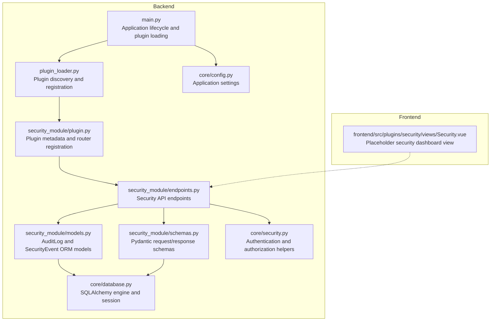
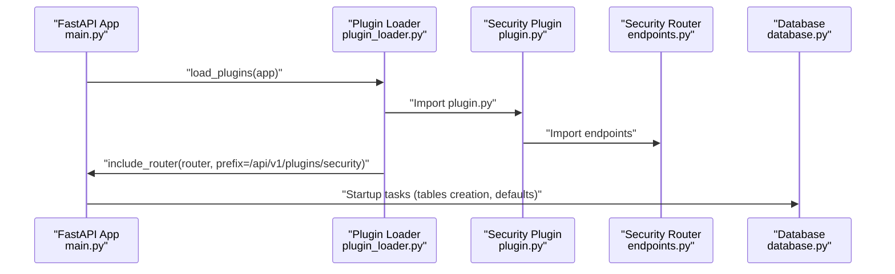
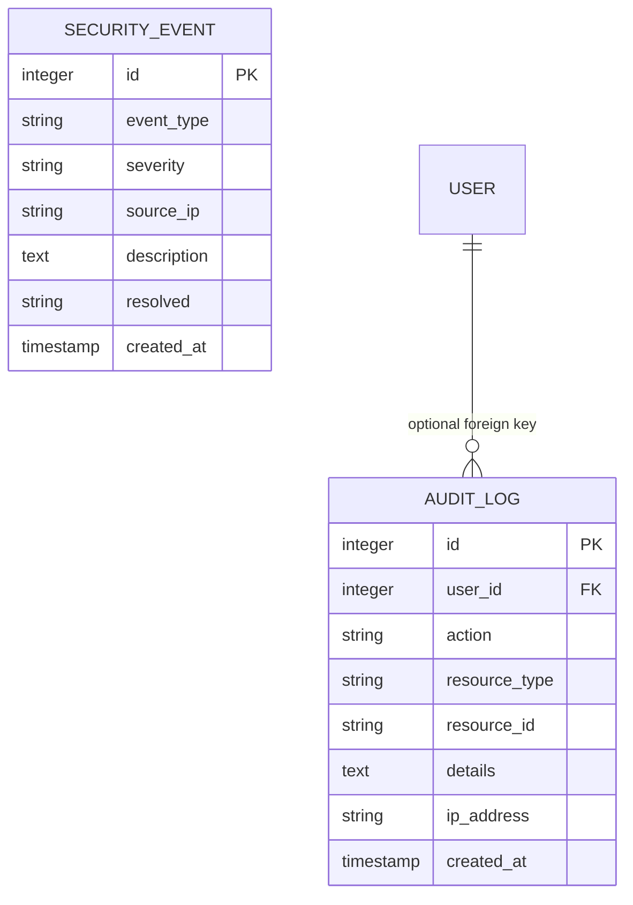
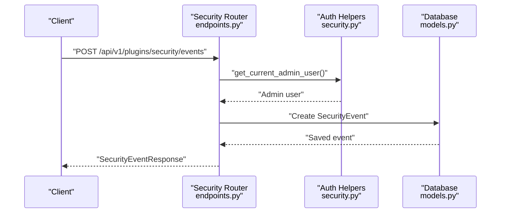
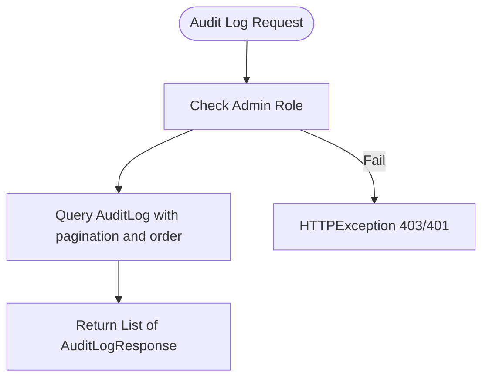
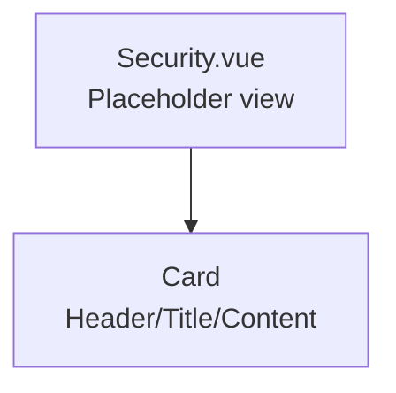
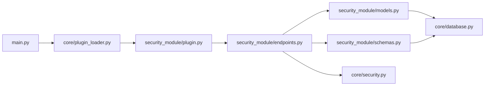

# Security Module

<cite>
**Referenced Files in This Document**
- [plugin.py](file://backend/app/plugins/security_module/plugin.py)
- [models.py](file://backend/app/plugins/security_module/models.py)
- [schemas.py](file://backend/app/plugins/security_module/schemas.py)
- [endpoints.py](file://backend/app/plugins/security_module/endpoints.py)
- [Security.vue](file://frontend/src/plugins/security/views/Security.vue)
- [plugin_loader.py](file://backend/app/core/plugin_loader.py)
- [security.py](file://backend/app/core/security.py)
- [database.py](file://backend/app/core/database.py)
- [config.py](file://backend/app/core/config.py)
- [main.py](file://backend/app/main.py)
</cite>

## Table of Contents
1. [Introduction](#introduction)
2. [Project Structure](#project-structure)
3. [Core Components](#core-components)
4. [Architecture Overview](#architecture-overview)
5. [Detailed Component Analysis](#detailed-component-analysis)
6. [Dependency Analysis](#dependency-analysis)
7. [Performance Considerations](#performance-considerations)
8. [Troubleshooting Guide](#troubleshooting-guide)
9. [Conclusion](#conclusion)
10. [Appendices](#appendices)

## Introduction
This document describes the Security Module plugin responsible for security event monitoring and threat detection capabilities. It covers the security event processing pipeline, audit logging implementation, threat detection algorithms, and security analytics features. It also documents the data models for security events, schemas for security operations, and the Vue.js frontend component for security dashboards. The API documentation includes endpoints for event ingestion, threat detection workflows, security alerts, and compliance reporting. Finally, it provides examples of security monitoring scenarios, incident correlation, and integration with enterprise security infrastructure.

## Project Structure
The Security Module is implemented as a FastAPI plugin with a dedicated set of models, schemas, and endpoints. It integrates with the platform’s plugin loader and exposes a prefixed API route under the plugin namespace. The frontend provides a placeholder view for future security dashboards.

**Diagram sources**
- [main.py:17-48](file://backend/app/main.py#L17-L48)
- [plugin_loader.py:25-99](file://backend/app/core/plugin_loader.py#L25-L99)
- [plugin.py:1-17](file://backend/app/plugins/security_module/plugin.py#L1-L17)
- [endpoints.py:1-72](file://backend/app/plugins/security_module/endpoints.py#L1-L72)
- [models.py:1-29](file://backend/app/plugins/security_module/models.py#L1-L29)
- [schemas.py:1-36](file://backend/app/plugins/security_module/schemas.py#L1-L36)
- [security.py:61-98](file://backend/app/core/security.py#L61-L98)
- [database.py:1-18](file://backend/app/core/database.py#L1-L18)
- [config.py:1-46](file://backend/app/core/config.py#L1-L46)
- [Security.vue:1-34](file://frontend/src/plugins/security/views/Security.vue#L1-L34)

**Section sources**
- [main.py:17-48](file://backend/app/main.py#L17-L48)
- [plugin_loader.py:25-99](file://backend/app/core/plugin_loader.py#L25-L99)
- [plugin.py:1-17](file://backend/app/plugins/security_module/plugin.py#L1-L17)
- [endpoints.py:1-72](file://backend/app/plugins/security_module/endpoints.py#L1-L72)
- [models.py:1-29](file://backend/app/plugins/security_module/models.py#L1-L29)
- [schemas.py:1-36](file://backend/app/plugins/security_module/schemas.py#L1-L36)
- [security.py:61-98](file://backend/app/core/security.py#L61-L98)
- [database.py:1-18](file://backend/app/core/database.py#L1-L18)
- [config.py:1-46](file://backend/app/core/config.py#L1-L46)
- [Security.vue:1-34](file://frontend/src/plugins/security/views/Security.vue#L1-L34)

## Core Components
- Plugin registration and routing: The plugin defines metadata and registers a router with a plugin-specific prefix.
- Data models: ORM models for audit logs and security events.
- Pydantic schemas: Request/response models for audit logs and security events.
- API endpoints: Endpoints for listing audit logs, listing security events, creating security events, and retrieving a single security event.
- Authentication and authorization: Endpoints enforce active user and admin user checks.
- Frontend view: Placeholder component for the security dashboard.

Key implementation references:
- Plugin registration and router inclusion: [plugin.py:1-17](file://backend/app/plugins/security_module/plugin.py#L1-L17)
- Audit log and security event models: [models.py:1-29](file://backend/app/plugins/security_module/models.py#L1-L29)
- Audit log and security event schemas: [schemas.py:1-36](file://backend/app/plugins/security_module/schemas.py#L1-L36)
- Security API endpoints: [endpoints.py:1-72](file://backend/app/plugins/security_module/endpoints.py#L1-L72)
- Authentication helpers: [security.py:61-98](file://backend/app/core/security.py#L61-L98)
- Database configuration: [database.py:1-18](file://backend/app/core/database.py#L1-L18)
- Plugin loading mechanism: [plugin_loader.py:25-99](file://backend/app/core/plugin_loader.py#L25-L99)

**Section sources**
- [plugin.py:1-17](file://backend/app/plugins/security_module/plugin.py#L1-L17)
- [models.py:1-29](file://backend/app/plugins/security_module/models.py#L1-L29)
- [schemas.py:1-36](file://backend/app/plugins/security_module/schemas.py#L1-L36)
- [endpoints.py:1-72](file://backend/app/plugins/security_module/endpoints.py#L1-L72)
- [security.py:61-98](file://backend/app/core/security.py#L61-L98)
- [database.py:1-18](file://backend/app/core/database.py#L1-L18)
- [plugin_loader.py:25-99](file://backend/app/core/plugin_loader.py#L25-L99)

## Architecture Overview
The Security Module follows a plugin architecture pattern. On startup, the application loads plugins, imports their models to register with SQLAlchemy, and invokes their register function to include the plugin’s router under a prefixed path. The security endpoints rely on shared authentication and authorization helpers to enforce access policies.

**Diagram sources**
- [main.py:17-48](file://backend/app/main.py#L17-L48)
- [plugin_loader.py:25-99](file://backend/app/core/plugin_loader.py#L25-L99)
- [plugin.py:1-17](file://backend/app/plugins/security_module/plugin.py#L1-L17)
- [endpoints.py:1-14](file://backend/app/plugins/security_module/endpoints.py#L1-L14)
- [database.py:1-18](file://backend/app/core/database.py#L1-L18)

## Detailed Component Analysis

### Data Models: AuditLog and SecurityEvent
The Security Module defines two primary data models:
- AuditLog: Stores auditable actions performed by users, including optional user association, action type, resource identifiers, IP address, and timestamps.
- SecurityEvent: Represents security-relevant events with type, severity, source IP, description, resolution state, and timestamps.

**Diagram sources**
- [models.py:6-28](file://backend/app/plugins/security_module/models.py#L6-L28)

**Section sources**
- [models.py:1-29](file://backend/app/plugins/security_module/models.py#L1-L29)

### API Endpoints: Security Event Processing Pipeline
The Security Module exposes the following endpoints:
- GET /api/v1/plugins/security/audit-logs: Lists audit logs with pagination and ordering by creation time descending. Requires admin privileges.
- GET /api/v1/plugins/security/events: Lists security events with pagination and ordering by creation time descending. Requires active user privileges.
- POST /api/v1/plugins/security/events: Creates a new security event. Requires admin privileges.
- GET /api/v1/plugins/security/events/{event_id}: Retrieves a specific security event by ID. Requires active user privileges.

**Diagram sources**
- [endpoints.py:49-59](file://backend/app/plugins/security_module/endpoints.py#L49-L59)
- [security.py:90-98](file://backend/app/core/security.py#L90-L98)

**Section sources**
- [endpoints.py:17-71](file://backend/app/plugins/security_module/endpoints.py#L17-L71)
- [security.py:82-98](file://backend/app/core/security.py#L82-L98)

### Threat Detection Algorithms and Security Analytics
Current implementation provides:
- Security event ingestion via POST /api/v1/plugins/security/events.
- Event listing and retrieval via GET endpoints.
- Severity and resolution fields enable basic categorization and triage workflows.

Future enhancements could include:
- Threshold-based anomaly detection for repeated failed logins or access denials.
- Correlation rules to group related events across time and source IPs.
- Risk scoring based on event types, severity, and user context.
- Integration with SIEM systems for centralized alerting and retention.

Note: The current code does not implement built-in detection algorithms or analytics; these would be added in future iterations.

**Section sources**
- [endpoints.py:33-60](file://backend/app/plugins/security_module/endpoints.py#L33-L60)
- [models.py:19-28](file://backend/app/plugins/security_module/models.py#L19-L28)

### Audit Logging Implementation
The AuditLog model captures auditable actions with optional user linkage, resource metadata, and IP address. The GET /api/v1/plugins/security/audit-logs endpoint supports pagination and reverse chronological ordering for efficient compliance reviews.

**Diagram sources**
- [endpoints.py:17-30](file://backend/app/plugins/security_module/endpoints.py#L17-L30)
- [security.py:90-98](file://backend/app/core/security.py#L90-L98)

**Section sources**
- [endpoints.py:17-30](file://backend/app/plugins/security_module/endpoints.py#L17-L30)
- [models.py:6-16](file://backend/app/plugins/security_module/models.py#L6-L16)
- [schemas.py:6-16](file://backend/app/plugins/security_module/schemas.py#L6-L16)

### Frontend Component: Security Dashboard View
The frontend includes a placeholder view for the Security Module. It renders a card with a title and a list of planned features (audit logs, security events, access monitoring). This component is intended to be extended with charts, filters, and actionable controls in future iterations.

**Diagram sources**
- [Security.vue:1-34](file://frontend/src/plugins/security/views/Security.vue#L1-L34)

**Section sources**
- [Security.vue:1-34](file://frontend/src/plugins/security/views/Security.vue#L1-L34)

## Dependency Analysis
The Security Module depends on shared backend components for authentication, authorization, database sessions, and plugin loading. The plugin loader ensures models are imported before routers are registered, enabling proper table creation and migrations.

**Diagram sources**
- [plugin.py:1-17](file://backend/app/plugins/security_module/plugin.py#L1-L17)
- [endpoints.py:1-14](file://backend/app/plugins/security_module/endpoints.py#L1-L14)
- [models.py:1-3](file://backend/app/plugins/security_module/models.py#L1-L3)
- [schemas.py:1-3](file://backend/app/plugins/security_module/schemas.py#L1-L3)
- [security.py:1-11](file://backend/app/core/security.py#L1-L11)
- [database.py:1-9](file://backend/app/core/database.py#L1-L9)
- [main.py:8-27](file://backend/app/main.py#L8-L27)
- [plugin_loader.py:50-78](file://backend/app/core/plugin_loader.py#L50-L78)

**Section sources**
- [plugin_loader.py:25-99](file://backend/app/core/plugin_loader.py#L25-L99)
- [plugin.py:1-17](file://backend/app/plugins/security_module/plugin.py#L1-L17)
- [endpoints.py:1-14](file://backend/app/plugins/security_module/endpoints.py#L1-L14)
- [models.py:1-3](file://backend/app/plugins/security_module/models.py#L1-L3)
- [schemas.py:1-3](file://backend/app/plugins/security_module/schemas.py#L1-L3)
- [security.py:1-11](file://backend/app/core/security.py#L1-L11)
- [database.py:1-9](file://backend/app/core/database.py#L1-L9)
- [main.py:8-27](file://backend/app/main.py#L8-L27)

## Performance Considerations
- Pagination: All listing endpoints support skip and limit parameters to control result volume.
- Ordering: Results are ordered by creation time descending to prioritize recent entries.
- Indexes: Primary keys are indexed by default; consider adding indexes on frequently filtered columns (e.g., event_type, severity, user_id).
- Token validation: JWT decoding and user lookup occur per request; caching or rate limiting may be considered for high-volume endpoints.
- Database pooling: Engine configuration includes pre-ping to handle stale connections.

[No sources needed since this section provides general guidance]

## Troubleshooting Guide
Common issues and resolutions:
- Authentication failures: Ensure requests include a valid access token with the correct scheme and expiration.
- Authorization failures: Admin-only endpoints require an admin role; verify user roles and permissions.
- Not found errors: Retrieving non-existent security events raises a 404 error; confirm IDs and existence.
- Plugin loading errors: Verify plugin metadata and register function presence; check logs for import exceptions.

**Section sources**
- [security.py:61-98](file://backend/app/core/security.py#L61-L98)
- [endpoints.py:62-71](file://backend/app/plugins/security_module/endpoints.py#L62-L71)
- [plugin_loader.py:89-97](file://backend/app/core/plugin_loader.py#L89-L97)

## Conclusion
The Security Module provides a solid foundation for security event monitoring and audit logging within the platform. It offers a plugin-friendly architecture, clear data models, and essential API endpoints for ingestion and retrieval. Future work should focus on implementing threat detection algorithms, correlation rules, and a comprehensive frontend dashboard to support real-time security operations and compliance reporting.

[No sources needed since this section summarizes without analyzing specific files]

## Appendices

### API Reference

- Base URL
  - /api/v1/plugins/security

- Authentication and Authorization
  - Active user required for listing events and retrieving individual events.
  - Admin user required for listing audit logs and creating security events.

- Endpoints

  - GET /audit-logs
    - Description: List audit logs with pagination.
    - Query parameters: skip (integer), limit (integer).
    - Response: Array of AuditLogResponse.
    - Required role: Admin.

  - GET /events
    - Description: List security events with pagination.
    - Query parameters: skip (integer), limit (integer).
    - Response: Array of SecurityEventResponse.
    - Required role: Active user.

  - POST /events
    - Description: Create a new security event.
    - Request body: SecurityEventCreate.
    - Response: SecurityEventResponse.
    - Required role: Admin.

  - GET /events/{event_id}
    - Description: Retrieve a specific security event by ID.
    - Path parameters: event_id (integer).
    - Response: SecurityEventResponse.
    - Required role: Active user.

- Data Models

  - AuditLogResponse
    - Fields: id (integer), user_id (integer, optional), action (string), resource_type (string, optional), resource_id (string, optional), details (text, optional), ip_address (string, optional), created_at (datetime, optional).

  - SecurityEventCreate
    - Fields: event_type (string), severity (string, default "info"), source_ip (string, optional), description (string, optional).

  - SecurityEventResponse
    - Fields: id (integer), event_type (string), severity (string), source_ip (string, optional), description (string, optional), resolved (string), created_at (datetime, optional).

**Section sources**
- [endpoints.py:17-71](file://backend/app/plugins/security_module/endpoints.py#L17-L71)
- [schemas.py:6-36](file://backend/app/plugins/security_module/schemas.py#L6-L36)

### Security Monitoring Scenarios and Examples
- Scenario: Suspicious login activity
  - Trigger: Multiple failed login attempts from a single source IP within a short timeframe.
  - Action: Create a security event with type indicating failure and high severity.
  - Outcome: Alert administrators and optionally trigger account lockout workflows.

- Scenario: Access denial
  - Trigger: Repeated access denied events for sensitive resources.
  - Action: Record event with resource metadata and source IP.
  - Outcome: Correlate with audit logs to identify targeted users or roles.

- Scenario: Compliance reporting
  - Trigger: Periodic export of audit logs and security events.
  - Action: Paginate and filter by date range and severity.
  - Outcome: Generate reports for internal audits and regulatory compliance.

[No sources needed since this section provides general guidance]

### Integration with Enterprise Security Infrastructure
- SIEM Integration
  - Forward security events to SIEM via HTTP or message queues.
  - Normalize event schemas to match SIEM field mappings.

- Identity and Access Management (IAM)
  - Enrich events with user attributes and group memberships.
  - Integrate with IAM for automated remediation (e.g., temporary access revocation).

- Network Security
  - Correlate source IP addresses with network devices and firewall logs.
  - Trigger network-based mitigations (e.g., block IP at perimeter).

[No sources needed since this section provides general guidance]