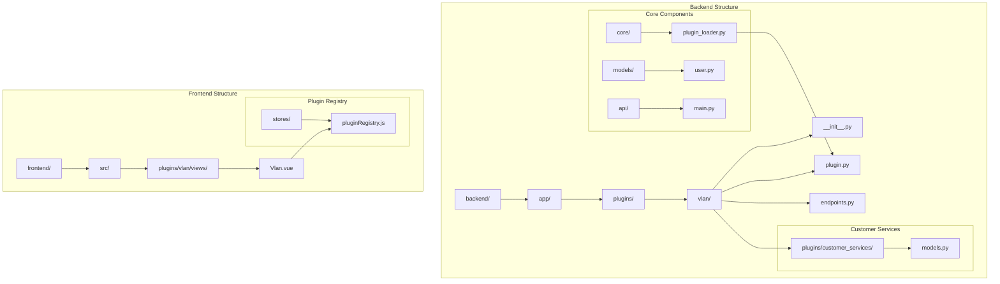
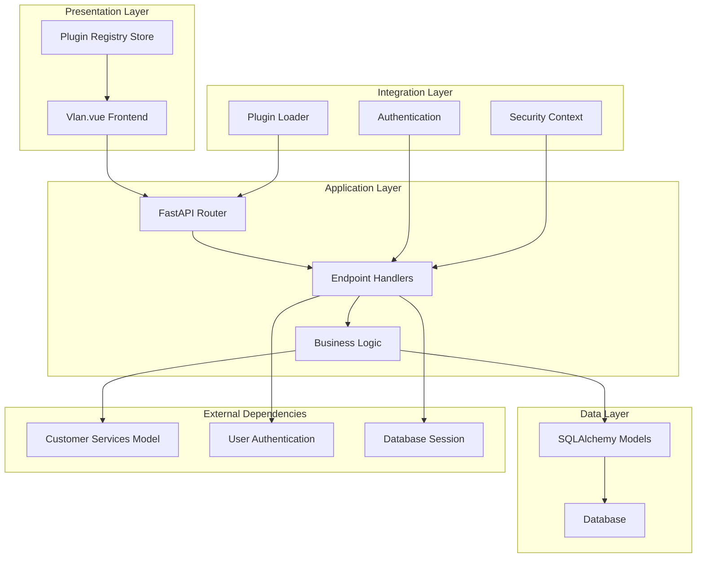
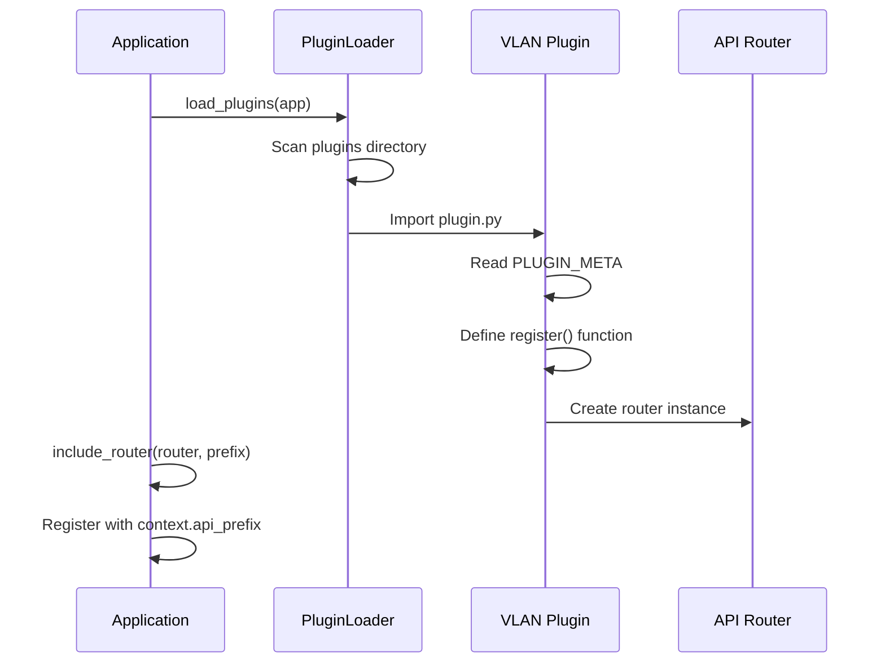
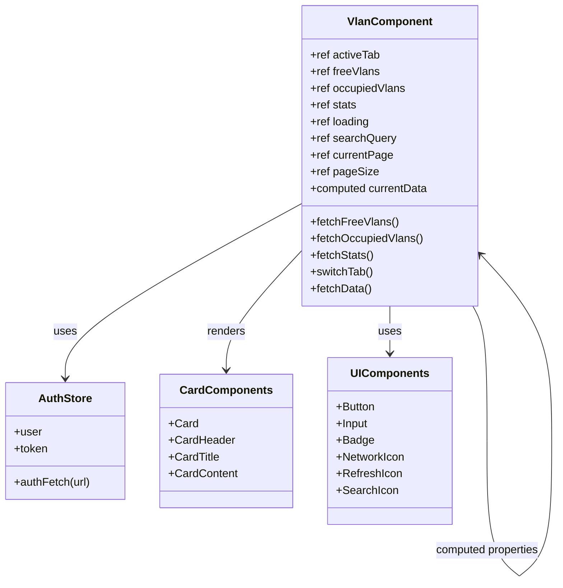
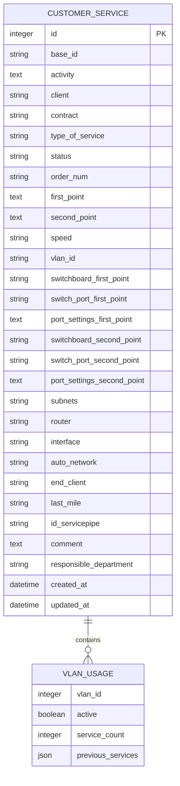
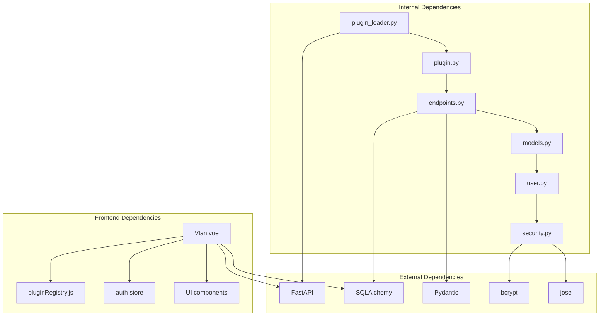

# VLAN Plugin

<cite>
**Referenced Files in This Document**
- [plugin.py](file://backend/app/plugins/vlan/plugin.py)
- [endpoints.py](file://backend/app/plugins/vlan/endpoints.py)
- [__init__.py](file://backend/app/plugins/vlan/__init__.py)
- [plugin_loader.py](file://backend/app/core/plugin_loader.py)
- [main.py](file://backend/app/main.py)
- [models.py](file://backend/app/plugins/customer_services/models.py)
- [Vlan.vue](file://frontend/src/plugins/vlan/views/Vlan.vue)
- [pluginRegistry.js](file://frontend/src/stores/pluginRegistry.js)
- [config.py](file://backend/app/core/config.py)
- [security.py](file://backend/app/core/security.py)
- [user.py](file://backend/app/models/user.py)
- [README.md](file://README.md)
</cite>

## Table of Contents
1. [Introduction](#introduction)
2. [Project Structure](#project-structure)
3. [Core Components](#core-components)
4. [Architecture Overview](#architecture-overview)
5. [Detailed Component Analysis](#detailed-component-analysis)
6. [Dependency Analysis](#dependency-analysis)
7. [Performance Considerations](#performance-considerations)
8. [Troubleshooting Guide](#troubleshooting-guide)
9. [Conclusion](#conclusion)

## Introduction

The VLAN Plugin is a specialized component within the NOC Vision Network Operations Center Platform that manages Virtual Local Area Network (VLAN) infrastructure. This plugin provides comprehensive VLAN lifecycle management capabilities, enabling network administrators to track, monitor, and efficiently allocate VLAN resources across customer services.

The plugin operates within a modern, plugin-based architecture that separates concerns between backend API services and frontend user interfaces. It integrates seamlessly with the existing customer services management system, leveraging shared database models and authentication mechanisms to provide a unified network management experience.

Key features include real-time VLAN availability tracking, occupancy statistics, historical service data, and intuitive user interfaces for both free and occupied VLAN management. The system supports advanced search capabilities, pagination for large datasets, and comprehensive filtering based on service status and client information.

## Project Structure

The VLAN Plugin follows the established NOC Vision plugin architecture pattern, maintaining consistency with other built-in plugins while providing specialized VLAN management functionality.



**Diagram sources**
- [plugin.py:1-17](file://backend/app/plugins/vlan/plugin.py#L1-L17)
- [endpoints.py:1-221](file://backend/app/plugins/vlan/endpoints.py#L1-L221)
- [plugin_loader.py:1-100](file://backend/app/core/plugin_loader.py#L1-L100)

**Section sources**
- [README.md:1-272](file://README.md#L1-L272)

## Core Components

The VLAN Plugin consists of several interconnected components that work together to provide comprehensive VLAN management functionality:

### Backend Components

**Plugin Registration System**
The plugin uses a standardized registration mechanism that integrates with the NOC Vision core plugin loader. The registration process handles API routing, dependency injection, and context management for seamless integration.

**API Endpoint Layer**
The endpoint layer provides three primary RESTful APIs:
- `/free-vlans` - Retrieves available VLANs with detailed service history
- `/occupied-vlans` - Provides information about VLANs currently in use
- `/vlan-stats` - Delivers statistical summaries of VLAN utilization

**Data Processing Engine**
The core processing logic handles VLAN ID parsing, service status evaluation, and data aggregation from the customer services database. It implements sophisticated filtering and sorting algorithms to present meaningful VLAN information.

### Frontend Components

**Vue.js Interface**
The frontend implements a responsive Vue.js interface with tabbed navigation, search functionality, and pagination controls. The interface provides real-time updates and comprehensive data visualization.

**State Management**
The plugin integrates with the global plugin registry system, enabling dynamic menu generation and consistent user experience across the platform.

**Section sources**
- [plugin.py:1-17](file://backend/app/plugins/vlan/plugin.py#L1-L17)
- [endpoints.py:42-221](file://backend/app/plugins/vlan/endpoints.py#L42-L221)
- [Vlan.vue:1-429](file://frontend/src/plugins/vlan/views/Vlan.vue#L1-L429)

## Architecture Overview

The VLAN Plugin implements a layered architecture that separates concerns between presentation, business logic, and data persistence while maintaining tight integration with the NOC Vision ecosystem.



**Diagram sources**
- [plugin_loader.py:25-99](file://backend/app/core/plugin_loader.py#L25-L99)
- [plugin.py:9-17](file://backend/app/plugins/vlan/plugin.py#L9-L17)
- [endpoints.py:1-11](file://backend/app/plugins/vlan/endpoints.py#L1-L11)
- [Vlan.vue:1-120](file://frontend/src/plugins/vlan/views/Vlan.vue#L1-L120)

The architecture ensures loose coupling between components while maintaining efficient data flow and clear separation of responsibilities. The plugin system allows for easy extension and modification without disrupting core platform functionality.

**Section sources**
- [plugin_loader.py:1-100](file://backend/app/core/plugin_loader.py#L1-L100)
- [main.py:17-48](file://backend/app/main.py#L17-L48)

## Detailed Component Analysis

### Plugin Registration and Loading

The VLAN plugin registration system follows a standardized pattern that enables automatic discovery and integration with the NOC Vision platform.



**Diagram sources**
- [plugin_loader.py:50-78](file://backend/app/core/plugin_loader.py#L50-L78)
- [plugin.py:9-17](file://backend/app/plugins/vlan/plugin.py#L9-L17)

The registration process creates a dedicated API prefix (`/api/v1/plugins/vlan`) and integrates the plugin's router into the main application. This approach ensures consistent URL patterns and predictable API behavior across all plugins.

**Section sources**
- [plugin.py:1-17](file://backend/app/plugins/vlan/plugin.py#L1-L17)
- [plugin_loader.py:25-99](file://backend/app/core/plugin_loader.py#L25-L99)

### VLAN Data Processing Engine

The core data processing functionality implements sophisticated algorithms for VLAN status determination and data aggregation.

```mermaid
flowchart TD
A[Start Processing] --> B[Parse VLAN IDs]
B --> C{Valid VLAN Range?}
C --> |No| D[Skip Entry]
C --> |Yes| E[Initialize VLAN Usage]
E --> F[Process Service Status]
F --> G{Status = "Эксплуатация"?}
G --> |Yes| H[Mark VLAN as Active]
G --> |No| I[Keep VLAN as Inactive]
H --> J[Add Service Reference]
I --> J
J --> K{More Services?}
K --> |Yes| F
K --> |No| L[Filter Results]
L --> M{Search Query?}
M --> |Yes| N[Apply Search Filters]
M --> |No| O[Skip Search]
N --> P[Apply Pagination]
O --> P
P --> Q[Return Results]
```

**Diagram sources**
- [endpoints.py:14-39](file://backend/app/plugins/vlan/endpoints.py#L14-L39)
- [endpoints.py:56-122](file://backend/app/plugins/vlan/endpoints.py#L56-L122)

The processing engine handles multiple VLAN IDs per service, validates input ranges, and applies business logic to determine VLAN status. It maintains detailed service histories and provides comprehensive reporting capabilities.

**Section sources**
- [endpoints.py:14-39](file://backend/app/plugins/vlan/endpoints.py#L14-L39)
- [endpoints.py:56-122](file://backend/app/plugins/vlan/endpoints.py#L56-L122)

### Frontend User Interface Implementation

The Vue.js frontend provides an intuitive interface for VLAN management with responsive design and comprehensive functionality.



**Diagram sources**
- [Vlan.vue:1-120](file://frontend/src/plugins/vlan/views/Vlan.vue#L1-L120)
- [Vlan.vue:200-429](file://frontend/src/plugins/vlan/views/Vlan.vue#L200-L429)

The interface implements reactive data binding, real-time updates, and comprehensive error handling. It provides tabbed navigation between free and occupied VLAN views, advanced search capabilities, and pagination controls.

**Section sources**
- [Vlan.vue:1-429](file://frontend/src/plugins/vlan/views/Vlan.vue#L1-L429)

### Database Integration and Models

The VLAN plugin leverages the existing customer services model infrastructure, sharing database connections and session management with the broader NOC Vision platform.



**Diagram sources**
- [models.py:6-41](file://backend/app/plugins/customer_services/models.py#L6-L41)

The shared model architecture ensures data consistency and eliminates redundancy while providing flexible querying capabilities for VLAN-related operations.

**Section sources**
- [models.py:1-74](file://backend/app/plugins/customer_services/models.py#L1-L74)

## Dependency Analysis

The VLAN Plugin maintains minimal external dependencies while integrating deeply with the NOC Vision core system through well-defined interfaces.



**Diagram sources**
- [plugin_loader.py:1-100](file://backend/app/core/plugin_loader.py#L1-L100)
- [plugin.py:1-17](file://backend/app/plugins/vlan/plugin.py#L1-L17)
- [endpoints.py:1-11](file://backend/app/plugins/vlan/endpoints.py#L1-L11)
- [Vlan.vue:1-23](file://frontend/src/plugins/vlan/views/Vlan.vue#L1-L23)

The dependency graph reveals a clean separation of concerns with clear boundaries between internal components and external libraries. The plugin system's design minimizes coupling while maximizing modularity and maintainability.

**Section sources**
- [plugin_loader.py:1-100](file://backend/app/core/plugin_loader.py#L1-L100)
- [security.py:1-134](file://backend/app/core/security.py#L1-L134)

## Performance Considerations

The VLAN Plugin implements several performance optimization strategies to handle large datasets efficiently:

### Data Processing Optimizations

**Efficient Filtering Algorithms**
The plugin uses optimized filtering algorithms that minimize database queries and memory usage. The VLAN ID parsing function employs early termination and validation to reduce unnecessary processing.

**Pagination Strategy**
The API implements robust pagination with configurable page sizes (1-500 items) to prevent memory exhaustion with large datasets. The frontend enforces reasonable defaults while allowing customization for power users.

**Caching Considerations**
While the current implementation focuses on real-time data accuracy, future enhancements could include intelligent caching strategies for frequently accessed VLAN statistics and search results.

### Scalability Factors

**Database Indexing**
The customer services model includes strategic indexing on VLAN-related fields to optimize query performance. The plugin leverages these indexes for efficient filtering and sorting operations.

**Connection Pool Management**
The plugin inherits connection pooling from the core NOC Vision application, ensuring efficient resource utilization and preventing connection leaks.

**Memory Management**
The Vue.js frontend implements reactive data binding with careful memory management to handle large datasets without performance degradation.

## Troubleshooting Guide

### Common Issues and Solutions

**Plugin Loading Failures**
- Verify plugin directory structure and required files
- Check plugin metadata completeness (name, version, description)
- Ensure proper import statements in plugin.py
- Review backend logs for detailed error messages

**API Endpoint Issues**
- Confirm database connectivity and customer services table existence
- Verify authentication tokens and user permissions
- Check URL routing and API prefix configuration
- Validate request parameters and query string formatting

**Frontend Integration Problems**
- Ensure proper plugin registration in the frontend registry
- Verify authentication state management
- Check CORS configuration for cross-origin requests
- Validate Vue.js component dependencies and imports

**Data Consistency Issues**
- Review VLAN ID format validation and parsing logic
- Verify service status interpretation and business rules
- Check database transaction isolation and concurrent access
- Monitor for data synchronization delays

**Performance Degradation**
- Optimize database queries and indexes
- Implement appropriate pagination limits
- Monitor memory usage and garbage collection
- Consider caching strategies for frequently accessed data

**Section sources**
- [plugin_loader.py:89-97](file://backend/app/core/plugin_loader.py#L89-L97)
- [endpoints.py:42-221](file://backend/app/plugins/vlan/endpoints.py#L42-L221)
- [Vlan.vue:39-119](file://frontend/src/plugins/vlan/views/Vlan.vue#L39-L119)

## Conclusion

The VLAN Plugin represents a well-architected solution within the NOC Vision platform, demonstrating excellent adherence to the established plugin architecture principles. The implementation successfully balances functionality, maintainability, and performance while providing comprehensive VLAN management capabilities.

Key strengths of the implementation include:

**Architectural Excellence**
- Clean separation of concerns between backend and frontend
- Standardized plugin registration and loading mechanisms
- Robust data processing with efficient algorithms
- Comprehensive error handling and logging

**Functional Completeness**
- Real-time VLAN status tracking and reporting
- Advanced search and filtering capabilities
- Intuitive user interface with responsive design
- Comprehensive statistics and analytics

**Technical Implementation**
- Efficient database queries and indexing strategies
- Proper authentication and authorization integration
- Scalable pagination and performance optimization
- Modular design enabling easy maintenance and extension

The plugin serves as an excellent example of how to implement specialized functionality within a larger platform while maintaining architectural integrity and operational excellence. Its design provides a solid foundation for future enhancements and extensions to meet evolving network management requirements.

Future development opportunities include enhanced caching strategies, expanded reporting capabilities, integration with network automation tools, and advanced visualization features for complex network topologies.