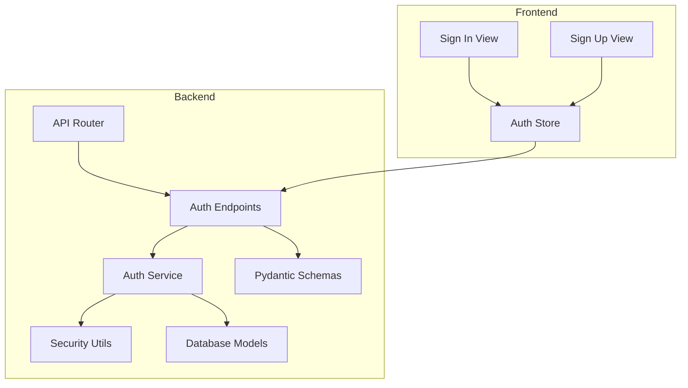
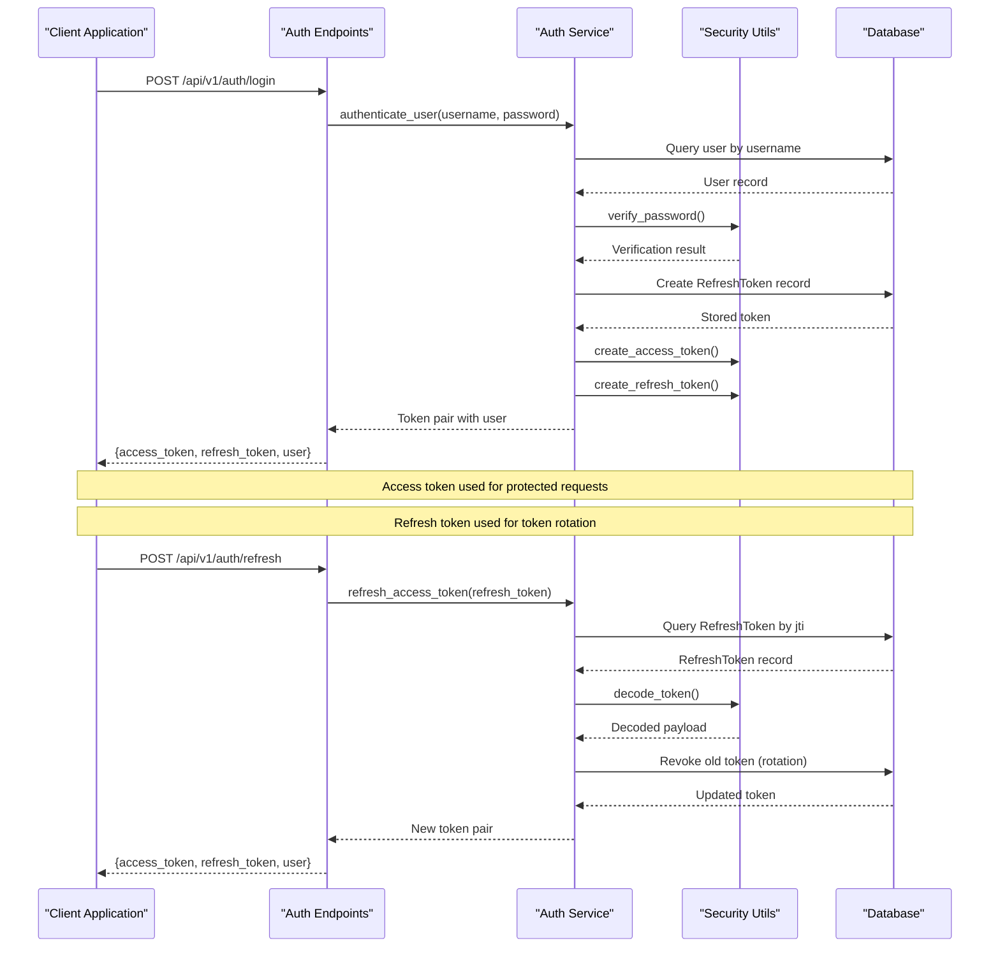
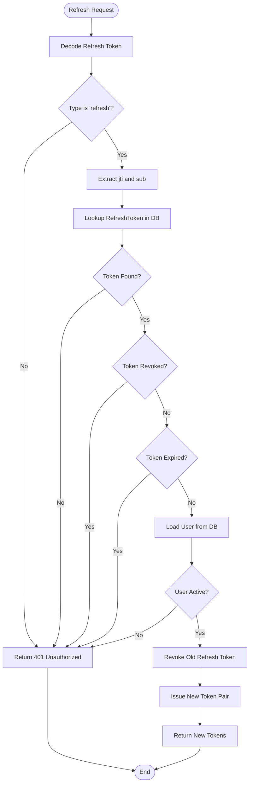
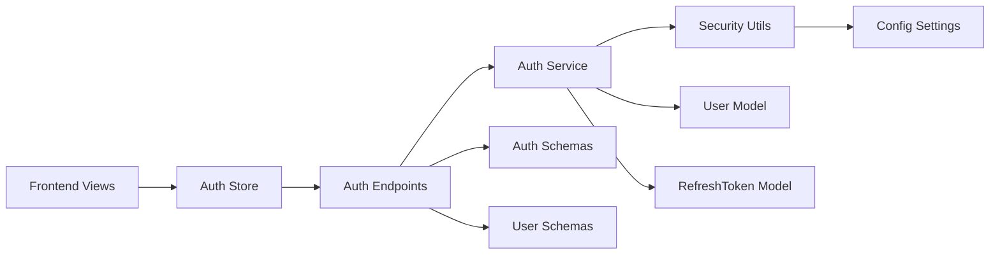

# Authentication Endpoints

<cite>
**Referenced Files in This Document**
- [auth.py](file://backend/app/api/v1/endpoints/auth.py)
- [router.py](file://backend/app/api/v1/router.py)
- [auth_schemas.py](file://backend/app/schemas/auth.py)
- [user_schemas.py](file://backend/app/schemas/user.py)
- [auth_service.py](file://backend/app/services/auth_service.py)
- [security.py](file://backend/app/core/security.py)
- [config.py](file://backend/app/core/config.py)
- [user_model.py](file://backend/app/models/user.py)
- [refresh_token_model.py](file://backend/app/models/refresh_token.py)
- [main.py](file://backend/app/main.py)
- [auth_store.js](file://frontend/src/stores/auth.js)
- [signin_view.js](file://frontend/src/views/auth/SignIn.vue)
- [signup_view.js](file://frontend/src/views/auth/SignUp.vue)
</cite>

## Update Summary
**Changes Made**
- Updated registration endpoint documentation to reflect that it no longer requires administrative privileges
- Clarified that registration is now available to all authenticated users
- Updated implementation details to show that registration endpoint has no authentication requirements
- Revised security considerations to reflect the change in access control

## Table of Contents
1. [Introduction](#introduction)
2. [Project Structure](#project-structure)
3. [Core Components](#core-components)
4. [Architecture Overview](#architecture-overview)
5. [Detailed Component Analysis](#detailed-component-analysis)
6. [Dependency Analysis](#dependency-analysis)
7. [Performance Considerations](#performance-considerations)
8. [Troubleshooting Guide](#troubleshooting-guide)
9. [Conclusion](#conclusion)

## Introduction
This document provides comprehensive API documentation for the authentication endpoints in the NOC Vision SSO system. It covers HTTP methods, URL patterns, request/response schemas, authentication requirements, JWT token structure, refresh token rotation, and practical client implementation examples. The system implements JWT-based authentication with separate access and refresh tokens, supporting secure login, registration, token refresh, and logout flows.

**Updated** The registration endpoint is now available to all authenticated users without requiring administrative privileges, while maintaining proper authentication mechanisms for other endpoints.

## Project Structure
The authentication system is organized across backend and frontend components:



**Diagram sources**
- [router.py:1-10](file://backend/app/api/v1/router.py#L1-L10)
- [auth.py:1-105](file://backend/app/api/v1/endpoints/auth.py#L1-L105)
- [auth_service.py:1-139](file://backend/app/services/auth_service.py#L1-L139)

**Section sources**
- [router.py:1-10](file://backend/app/api/v1/router.py#L1-L10)
- [main.py:66-67](file://backend/app/main.py#L66-L67)

## Core Components
The authentication system consists of five primary endpoints under `/api/v1/auth`:

### Endpoint Catalog
- **POST /api/v1/auth/login** - User login and token issuance
- **POST /api/v1/auth/register** - User registration (available to all authenticated users)
- **POST /api/v1/auth/refresh** - Token refresh using refresh token
- **POST /api/v1/auth/logout** - Token revocation and logout
- **GET /api/v1/auth/me** - Get current user information

### Authentication Flow
The system implements a two-token strategy:
- **Access Token**: Short-lived JWT for API authentication
- **Refresh Token**: Long-lived JWT stored as a database record for rotation

**Section sources**
- [auth.py:20-97](file://backend/app/api/v1/endpoints/auth.py#L20-L97)
- [auth_schemas.py:5-26](file://backend/app/schemas/auth.py#L5-L26)

## Architecture Overview
The authentication architecture follows a layered design pattern:



**Diagram sources**
- [auth.py:20-51](file://backend/app/api/v1/endpoints/auth.py#L20-L51)
- [auth_service.py:19-74](file://backend/app/services/auth_service.py#L19-L74)
- [security.py:31-48](file://backend/app/core/security.py#L31-L48)

## Detailed Component Analysis

### Login Endpoint
The login endpoint authenticates users and issues JWT token pairs.

#### Endpoint Details
- **Method**: POST
- **URL**: `/api/v1/auth/login`
- **Authentication**: No prior authentication required
- **Response**: TokenPairWithUser

#### Request Schema
The endpoint accepts form-encoded credentials:
- `username` (string): User's unique identifier
- `password` (string): Plain text password

#### Response Schema
- `access_token` (string): JWT for immediate API access
- `refresh_token` (string): JWT for token rotation
- `token_type` (string): Always "bearer"
- `user` (object): User information object

#### Implementation Details
The login process validates credentials, checks user activation status, creates a refresh token record, and generates both access and refresh tokens. The access token expires after configured minutes, while the refresh token expires after configured days.

**Section sources**
- [auth.py:20-37](file://backend/app/api/v1/endpoints/auth.py#L20-L37)
- [auth_schemas.py:5-17](file://backend/app/schemas/auth.py#L5-L17)
- [auth_service.py:19-42](file://backend/app/services/auth_service.py#L19-L42)
- [config.py:10-13](file://backend/app/core/config.py#L10-L13)

### Registration Endpoint
The registration endpoint creates new user accounts with default user privileges.

#### Endpoint Details
- **Method**: POST
- **URL**: `/api/v1/auth/register`
- **Authentication**: No authentication required (available to all users)
- **Response**: UserResponse

#### Request Schema
- `username` (string): Unique user identifier
- `email` (string): User's email address
- `password` (string): Plain text password
- `full_name` (string, optional): User's full name
- `role` (string): User role (default: "user")

#### Response Schema
Returns the created user object with all fields from UserResponse.

#### Implementation Details
The endpoint validates uniqueness of username and email, then creates a new user with hashed password and default role "user". **Updated** This endpoint no longer requires administrative privileges and is accessible to all users. The registration process maintains security through password hashing and unique constraint validation.

**Section sources**
- [auth.py:54-79](file://backend/app/api/v1/endpoints/auth.py#L54-L79)
- [user_schemas.py:6-12](file://backend/app/schemas/user.py#L6-L12)
- [auth_service.py:113-119](file://backend/app/services/auth_service.py#L113-L119)

### Token Refresh Endpoint
The refresh endpoint rotates access tokens using refresh tokens.

#### Endpoint Details
- **Method**: POST
- **URL**: `/api/v1/auth/refresh`
- **Authentication**: No prior authentication required
- **Response**: TokenPairWithUser

#### Request Schema
- `refresh_token` (string): JWT refresh token

#### Response Schema
Same as login response (access_token, refresh_token, token_type, user).

#### Implementation Details
The refresh process validates the refresh token signature, checks database for unrevoked token, verifies expiration, and performs token rotation by revoking the old refresh token and issuing new tokens.

**Section sources**
- [auth.py:40-51](file://backend/app/api/v1/endpoints/auth.py#L40-L51)
- [auth_schemas.py:20-22](file://backend/app/schemas/auth.py#L20-L22)
- [auth_service.py:45-74](file://backend/app/services/auth_service.py#L45-L74)

### Logout Endpoint
The logout endpoint revokes refresh tokens and ends sessions.

#### Endpoint Details
- **Method**: POST
- **URL**: `/api/v1/auth/logout`
- **Authentication**: Requires active user session
- **Response**: StatusResponse

#### Request Schema
- `refresh_token` (string): JWT refresh token to revoke

#### Response Schema
- `status` (string): "ok"
- `message` (string): Operation result message

#### Implementation Details
The endpoint revokes the specified refresh token, preventing future access token rotations. The access token remains valid until expiration.

**Section sources**
- [auth.py:82-89](file://backend/app/api/v1/endpoints/auth.py#L82-L89)
- [auth_schemas.py:24-25](file://backend/app/schemas/auth.py#L24-L25)
- [auth_service.py:77-90](file://backend/app/services/auth_service.py#L77-L90)

### JWT Token Structure
Both access and refresh tokens follow the same structure with different claims:

#### Common Claims
- `type`: "access" or "refresh"
- `exp`: Expiration timestamp
- `sub`: Subject (username)

#### Access Token Specific Claims
- Contains user role for authorization decisions

#### Refresh Token Specific Claims
- `jti`: JSON Token Identifier (UUID stored in database)
- Used for token rotation and revocation tracking

**Section sources**
- [security.py:31-48](file://backend/app/core/security.py#L31-L48)
- [auth_service.py:19-26](file://backend/app/services/auth_service.py#L19-L26)

### Token Rotation Mechanism
The system implements refresh token rotation for enhanced security:



**Diagram sources**
- [auth_service.py:45-74](file://backend/app/services/auth_service.py#L45-L74)
- [refresh_token_model.py:7-17](file://backend/app/models/refresh_token.py#L7-L17)

**Section sources**
- [auth_service.py:70-74](file://backend/app/services/auth_service.py#L70-L74)

## Dependency Analysis
The authentication system has clear dependency relationships:



**Diagram sources**
- [auth.py:1-16](file://backend/app/api/v1/endpoints/auth.py#L1-L16)
- [auth_service.py:1-17](file://backend/app/services/auth_service.py#L1-L17)
- [security.py:1-13](file://backend/app/core/security.py#L1-L13)

**Section sources**
- [auth.py:1-16](file://backend/app/api/v1/endpoints/auth.py#L1-L16)
- [auth_service.py:1-17](file://backend/app/services/auth_service.py#L1-L17)

## Performance Considerations
- **Token Expiration**: Access tokens expire after 15 minutes, refresh tokens after 7 days
- **Database Queries**: Each refresh requires two database operations (lookup and update)
- **Hashing**: Password hashing uses bcrypt with salt generation
- **Memory Usage**: Tokens are validated in-memory without persistent sessions

## Troubleshooting Guide

### Common Authentication Errors
- **401 Unauthorized**: Invalid credentials or expired tokens
- **403 Forbidden**: Disabled user account or insufficient permissions
- **400 Bad Request**: Duplicate username/email during registration

### Client-Side Implementation Patterns
The frontend demonstrates robust authentication handling:

#### Login Flow
```javascript
// Form submission with URL-encoded data
const formData = new URLSearchParams();
formData.append('username', credentials.username);
formData.append('password', credentials.password);

const response = await fetch('/api/v1/auth/login', {
  method: 'POST',
  headers: { 'Content-Type': 'application/x-www-form-urlencoded' },
  body: formData,
});
```

#### Automatic Token Refresh
```javascript
// Intercept 401 errors and attempt refresh
if (response.status === 401 && refreshToken.value) {
  const refreshed = await refreshAccessToken();
  if (refreshed) {
    // Retry original request with new token
    options.headers.Authorization = `Bearer ${accessToken.value}`;
    response = await fetch(url, options);
  }
}
```

#### Logout Process
```javascript
// Send logout request with Authorization header
await fetch('/api/v1/auth/logout', {
  method: 'POST',
  headers: {
    'Content-Type': 'application/json',
    Authorization: `Bearer ${accessToken.value}`,
  },
  body: JSON.stringify({ refresh_token: refreshToken.value }),
});
```

**Section sources**
- [auth_store.js:29-67](file://frontend/src/stores/auth.js#L29-L67)
- [auth_store.js:105-134](file://frontend/src/stores/auth.js#L105-L134)
- [auth_store.js:136-158](file://frontend/src/stores/auth.js#L136-L158)

## Conclusion
The NOC Vision authentication system provides a secure, production-ready JWT-based authentication solution with comprehensive token management. The implementation includes proper error handling, refresh token rotation, and client-side integration patterns. The system balances security with usability through configurable token expiration times and automatic refresh capabilities.

**Updated** The registration endpoint change enhances accessibility while maintaining security through proper validation and password hashing. The system now allows users to register themselves without administrative intervention, streamlining the user onboarding process.

Key security features include:
- Separate access and refresh tokens with different lifespans
- Refresh token rotation preventing replay attacks
- Database-backed token revocation
- Role-based access control
- Secure password hashing with bcrypt
- Proper validation of unique usernames and emails during registration

The documented endpoints and schemas provide a solid foundation for client integration while maintaining the system's security posture.