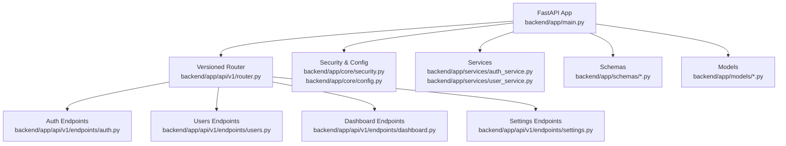
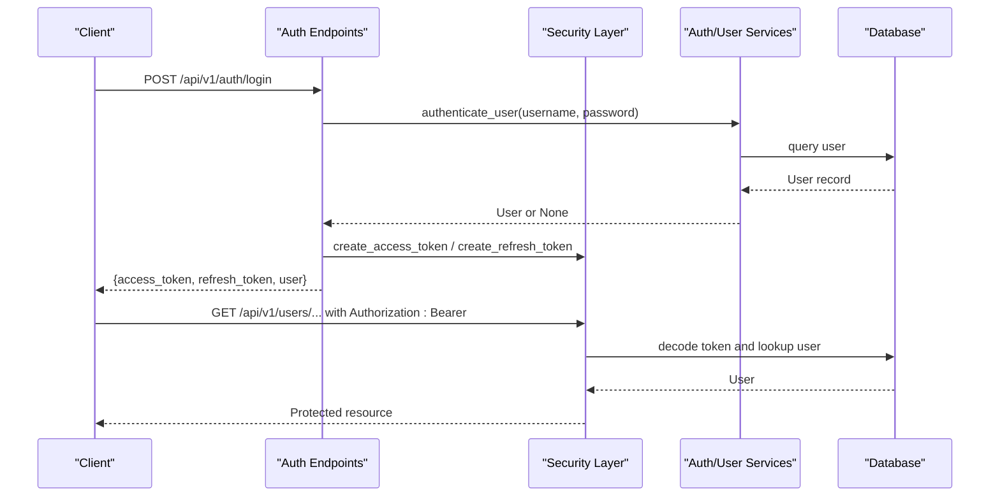
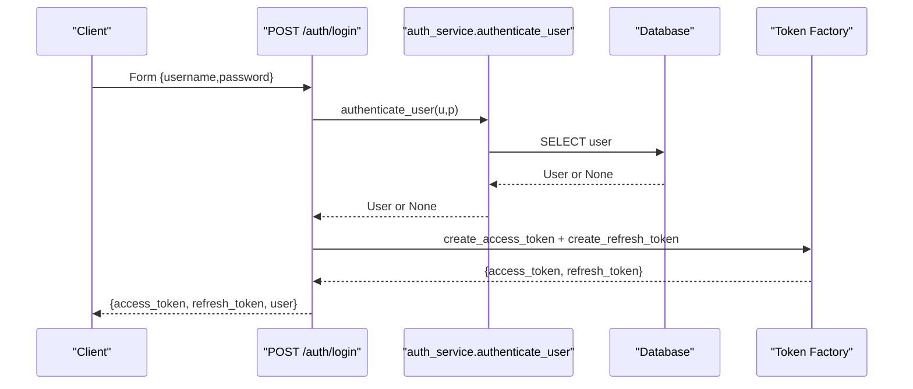
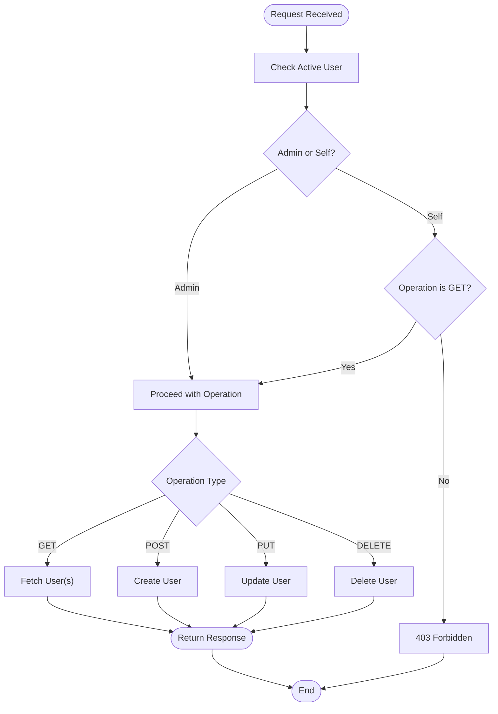
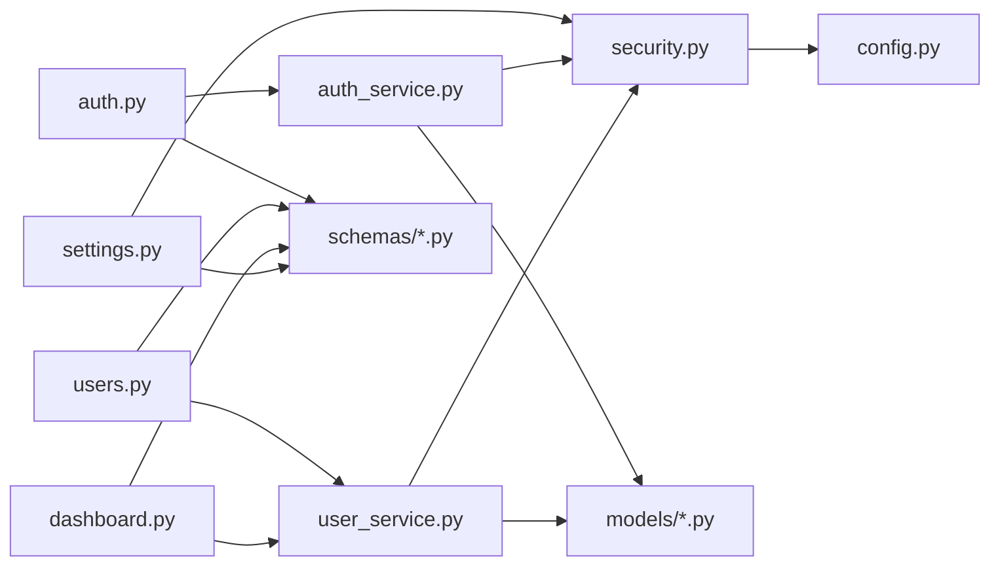

# Core API Reference

<cite>
**Referenced Files in This Document**
- [main.py](file://backend/app/main.py)
- [router.py](file://backend/app/api/v1/router.py)
- [auth.py](file://backend/app/api/v1/endpoints/auth.py)
- [users.py](file://backend/app/api/v1/endpoints/users.py)
- [dashboard.py](file://backend/app/api/v1/endpoints/dashboard.py)
- [settings.py](file://backend/app/api/v1/endpoints/settings.py)
- [security.py](file://backend/app/core/security.py)
- [config.py](file://backend/app/core/config.py)
- [auth_schemas.py](file://backend/app/schemas/auth.py)
- [user_schemas.py](file://backend/app/schemas/user.py)
- [common_schemas.py](file://backend/app/schemas/common.py)
- [auth_service.py](file://backend/app/services/auth_service.py)
- [user_service.py](file://backend/app/services/user_service.py)
- [user_model.py](file://backend/app/models/user.py)
- [refresh_token_model.py](file://backend/app/models/refresh_token.py)
</cite>

## Table of Contents
1. [Introduction](#introduction)
2. [Project Structure](#project-structure)
3. [Core Components](#core-components)
4. [Architecture Overview](#architecture-overview)
5. [Detailed Component Analysis](#detailed-component-analysis)
6. [Dependency Analysis](#dependency-analysis)
7. [Performance Considerations](#performance-considerations)
8. [Troubleshooting Guide](#troubleshooting-guide)
9. [Conclusion](#conclusion)
10. [Appendices](#appendices)

## Introduction
This document describes the Core NOC Vision REST API, focusing on public endpoints under the base path /api/v1. It covers Authentication, User Management, Dashboard, and Settings endpoints. For each endpoint group, you will find:
- Endpoint catalog with HTTP methods and URL patterns
- Request and response schemas
- Authentication and authorization requirements
- Parameter specifications
- Typical error responses and status codes
- Practical usage examples
- Client implementation guidelines and integration patterns

The API is built with FastAPI and uses bearer token authentication via JWT. Access tokens are short-lived; refresh tokens are used to obtain new access tokens securely.

## Project Structure
The API is organized by version and grouped by functional domains. The main application registers a versioned router that prefixes all endpoints with /api/v1.

**Diagram sources**
- [main.py:66-67](file://backend/app/main.py#L66-L67)
- [router.py:6-9](file://backend/app/api/v1/router.py#L6-L9)

**Section sources**
- [main.py:50-67](file://backend/app/main.py#L50-L67)
- [router.py:1-10](file://backend/app/api/v1/router.py#L1-L10)

## Core Components
- Authentication: Login, token refresh, logout, registration, whoami, initial admin setup.
- Users: List, retrieve, create, update, delete users.
- Dashboard: Aggregated stats and welcome message for the authenticated user.
- Settings: Application metadata (admin-only).

Key runtime and security components:
- OAuth2 bearer token scheme configured against the login endpoint.
- Access tokens validated centrally; refresh tokens stored and rotated.
- Password hashing and verification handled by bcrypt.
- Configuration for secrets, token expiry, and CORS.

**Section sources**
- [security.py:13](file://backend/app/core/security.py#L13)
- [config.py:5-46](file://backend/app/core/config.py#L5-L46)
- [auth_service.py:19-42](file://backend/app/services/auth_service.py#L19-L42)

## Architecture Overview
High-level flow for authentication and protected endpoints:

**Diagram sources**
- [auth.py:20-37](file://backend/app/api/v1/endpoints/auth.py#L20-L37)
- [security.py:61-79](file://backend/app/core/security.py#L61-L79)
- [auth_service.py:19-42](file://backend/app/services/auth_service.py#L19-L42)

## Detailed Component Analysis

### Authentication Endpoints (/api/v1/auth/)
Authentication endpoints handle login, token refresh, logout, user registration, self-profile retrieval, and initial admin creation.

- Base path: /api/v1/auth
- Authentication: Not required for login/register/init; required for protected endpoints after successful login.
- Authorization: Some endpoints require admin role; others require active user.

Endpoints:
- POST /login
  - Purpose: Obtain a short-lived access token and a long-lived refresh token along with user info.
  - Authentication: No prior auth required.
  - Request body: Form-encoded fields username and password.
  - Response: Token pair with user object.
  - Errors:
    - 401 Unauthorized: Incorrect username or password.
    - 403 Forbidden: User account disabled.
  - Example usage:
    - Client sends username/password to /api/v1/auth/login.
    - On success, stores access_token and refresh_token.
    - Uses access_token for subsequent protected requests.

- POST /refresh
  - Purpose: Rotate a new access token using a valid refresh token.
  - Authentication: No prior auth required.
  - Request body: JSON with refresh_token.
  - Response: New token pair.
  - Errors:
    - 401 Unauthorized: Invalid or expired refresh token.
  - Example usage:
    - When access_token expires, send refresh_token to /api/v1/auth/refresh to obtain a new access token.

- POST /register
  - Purpose: Register a new user (admin-only).
  - Authentication: Requires admin role.
  - Request body: UserCreate schema.
  - Response: UserResponse.
  - Errors:
    - 400 Bad Request: Username or email already exists.
    - 403 Forbidden: Insufficient permissions.
    - 404 Not Found: User not found (not applicable here; validation occurs before DB lookup).
  - Example usage:
    - Admin calls /api/v1/auth/register with user details to create a new account.

- POST /logout
  - Purpose: Revoke a refresh token to terminate sessions.
  - Authentication: Requires active user.
  - Request body: JSON with refresh_token.
  - Response: StatusResponse.
  - Errors:
    - None documented; returns success on revocation.
  - Example usage:
    - Client calls /api/v1/auth/logout with the refresh_token to invalidate it.

- GET /me
  - Purpose: Retrieve currently authenticated user’s profile.
  - Authentication: Requires active user.
  - Response: UserResponse.
  - Errors:
    - 401 Unauthorized: Invalid or missing credentials.
    - 403 Forbidden: Inactive user.
  - Example usage:
    - Client calls /api/v1/auth/me with Authorization: Bearer <access_token>.

- POST /init
  - Purpose: Initialize the system by creating a default admin if none exists.
  - Authentication: No prior auth required.
  - Response: StatusResponse indicating whether admin was created or already existed.
  - Errors:
    - None documented.
  - Example usage:
    - First-time setup calls /api/v1/auth/init to bootstrap admin credentials.

Request and response schemas:
- TokenPair: access_token, refresh_token, token_type.
- TokenPairWithUser: TokenPair plus user.
- RefreshRequest: refresh_token.
- LogoutRequest: refresh_token.
- StatusResponse: status, message.

Authorization helpers:
- get_current_active_user: Validates access token and ensures user is active.
- get_current_admin_user: Ensures active user has role admin.

Security and tokens:
- Access tokens are short-lived; refresh tokens are long-lived and rotated on use.
- Refresh tokens are persisted and tracked to support revocation and rotation.

**Section sources**
- [auth.py:20-97](file://backend/app/api/v1/endpoints/auth.py#L20-L97)
- [auth_schemas.py:10-26](file://backend/app/schemas/auth.py#L10-L26)
- [common_schemas.py:5-8](file://backend/app/schemas/common.py#L5-L8)
- [security.py:61-98](file://backend/app/core/security.py#L61-L98)
- [auth_service.py:19-139](file://backend/app/services/auth_service.py#L19-L139)
- [user_model.py:24-34](file://backend/app/models/user.py#L24-L34)

#### Authentication Flow Sequence

**Diagram sources**
- [auth.py:20-37](file://backend/app/api/v1/endpoints/auth.py#L20-L37)
- [auth_service.py:113-119](file://backend/app/services/auth_service.py#L113-L119)
- [auth_service.py:19-42](file://backend/app/services/auth_service.py#L19-L42)

### User Management Endpoints (/api/v1/users/)
User management endpoints allow listing, retrieving, creating, updating, and deleting users. Access is restricted to administrators, with special rules for viewing profiles.

- Base path: /api/v1/users
- Authentication: Required for all endpoints.
- Authorization: Admin-only for most operations; non-admins can only view their own profile.

Endpoints:
- GET /
  - Purpose: List users with pagination.
  - Authentication: Active user required.
  - Authorization: Admin required.
  - Query parameters: skip (integer), limit (integer).
  - Response: Array of UserResponse.
  - Errors:
    - 403 Forbidden: Insufficient permissions.
    - 401 Unauthorized: Invalid or missing credentials.

- GET /{user_id}
  - Purpose: Retrieve a specific user.
  - Authentication: Active user required.
  - Authorization: Admin can fetch anyone; non-admin can only fetch themselves.
  - Path parameter: user_id (integer).
  - Response: UserResponse.
  - Errors:
    - 404 Not Found: User does not exist.
    - 403 Forbidden: Insufficient permissions.

- POST /
  - Purpose: Create a new user (admin-only).
  - Authentication: Active user required.
  - Authorization: Admin required.
  - Request body: UserCreate.
  - Response: UserResponse.
  - Errors:
    - 400 Bad Request: Username or email already exists.
    - 403 Forbidden: Insufficient permissions.

- PUT /{user_id}
  - Purpose: Update a user (admin-only).
  - Authentication: Active user required.
  - Authorization: Admin required.
  - Path parameter: user_id (integer).
  - Request body: UserUpdate.
  - Response: UserResponse.
  - Errors:
    - 404 Not Found: User does not exist.
    - 403 Forbidden: Insufficient permissions.

- DELETE /{user_id}
  - Purpose: Delete a user (admin-only).
  - Authentication: Active user required.
  - Authorization: Admin required.
  - Path parameter: user_id (integer).
  - Response: StatusResponse.
  - Errors:
    - 400 Bad Request: Cannot delete yourself.
    - 404 Not Found: User does not exist.
    - 403 Forbidden: Insufficient permissions.

Request and response schemas:
- UserCreate: username, email, password, full_name (optional), role (default user).
- UserUpdate: email (optional), full_name (optional), role (optional), is_active (optional), password (optional).
- UserResponse: id, username, email, full_name (optional), role, is_active, created_at (optional), updated_at (optional).

Notes:
- Updating a user with a new password hashes it before persisting.
- Deleting a user prevents self-deletion.

**Section sources**
- [users.py:15-85](file://backend/app/api/v1/endpoints/users.py#L15-L85)
- [user_schemas.py:6-32](file://backend/app/schemas/user.py#L6-L32)
- [user_service.py:24-64](file://backend/app/services/user_service.py#L24-L64)
- [user_model.py:7-34](file://backend/app/models/user.py#L7-L34)

#### User CRUD Flow

**Diagram sources**
- [users.py:15-85](file://backend/app/api/v1/endpoints/users.py#L15-L85)
- [security.py:82-98](file://backend/app/core/security.py#L82-L98)

### Dashboard Endpoints (/api/v1/dashboard/)
Dashboard endpoint returns contextual information for the authenticated user, including a welcome message and basic stats.

- Base path: /api/v1/dashboard
- Authentication: Required for all endpoints.
- Authorization: Active user required.

Endpoint:
- GET /
  - Purpose: Retrieve dashboard summary.
  - Authentication: Active user required.
  - Response: Object with welcome string and stats (total_users, your_role).
  - Errors:
    - 401 Unauthorized: Invalid or missing credentials.
    - 403 Forbidden: Inactive user.

Example usage:
- Client calls /api/v1/dashboard/ with Authorization: Bearer <access_token>.
- Server responds with a personalized greeting and counts.

**Section sources**
- [dashboard.py:12-26](file://backend/app/api/v1/endpoints/dashboard.py#L12-L26)
- [user_service.py:67-68](file://backend/app/services/user_service.py#L67-L68)

### Settings Endpoints (/api/v1/settings/)
Settings endpoint exposes application metadata. Access is restricted to administrators.

- Base path: /api/v1/settings
- Authentication: Required for all endpoints.
- Authorization: Admin required.

Endpoint:
- GET /
  - Purpose: Retrieve application settings.
  - Authentication: Active user required.
  - Authorization: Admin required.
  - Response: Object with app_name, version, theme, language.
  - Errors:
    - 403 Forbidden: Insufficient permissions.
    - 401 Unauthorized: Invalid or missing credentials.

Example usage:
- Admin calls /api/v1/settings/ to fetch UI and platform preferences.

**Section sources**
- [settings.py:8-17](file://backend/app/api/v1/endpoints/settings.py#L8-L17)
- [security.py:90-98](file://backend/app/core/security.py#L90-L98)

## Dependency Analysis
The API follows a layered architecture:
- Endpoints depend on services for business logic.
- Services depend on models and core security utilities.
- Security depends on configuration for keys and token lifetimes.
- Models define persistence and relationships.

**Diagram sources**
- [auth.py:15-15](file://backend/app/api/v1/endpoints/auth.py#L15-L15)
- [users.py:10-10](file://backend/app/api/v1/endpoints/users.py#L10-L10)
- [dashboard.py:7-7](file://backend/app/api/v1/endpoints/dashboard.py#L7-L7)
- [settings.py:2-2](file://backend/app/api/v1/endpoints/settings.py#L2-L2)
- [auth_service.py:15-16](file://backend/app/services/auth_service.py#L15-L16)
- [user_service.py:4-5](file://backend/app/services/user_service.py#L4-L5)
- [security.py:8-11](file://backend/app/core/security.py#L8-L11)
- [config.py:5-46](file://backend/app/core/config.py#L5-L46)
- [user_model.py:1-4](file://backend/app/models/user.py#L1-L4)
- [refresh_token_model.py:1-4](file://backend/app/models/refresh_token.py#L1-L4)

**Section sources**
- [router.py:1-10](file://backend/app/api/v1/router.py#L1-L10)
- [main.py:66-67](file://backend/app/main.py#L66-L67)

## Performance Considerations
- Token lifecycle: Short access tokens reduce exposure; refresh tokens enable secure rotation.
- Pagination: Use skip and limit on user listing to avoid heavy payloads.
- Hashing: Password hashing is CPU-intensive; cache results where appropriate and avoid repeated hashing.
- Database queries: Prefer filtering and indexing on username, email, and ID fields.
- CORS: Configure allowed origins carefully to minimize preflight overhead.

## Troubleshooting Guide
Common issues and resolutions:
- 401 Unauthorized on protected endpoints:
  - Cause: Missing, invalid, or expired access token.
  - Resolution: Authenticate again or refresh the access token using the refresh endpoint.
- 403 Forbidden:
  - Cause: Inactive user or insufficient permissions (non-admin attempting admin-only operation).
  - Resolution: Verify user status and role; ensure proper authorization.
- 400 Bad Request during user creation/update:
  - Cause: Duplicate username or email; self-deletion attempt.
  - Resolution: Change identifiers; avoid deleting yourself.
- 404 Not Found:
  - Cause: Target user does not exist.
  - Resolution: Validate user_id or re-check user existence.
- Token rotation failures:
  - Cause: Expired or revoked refresh token.
  - Resolution: Re-authenticate to obtain a new refresh token.

Operational checks:
- Health endpoint: GET /health to verify service availability.
- Plugin listing: GET /api/v1/plugins to confirm plugin loading status.

**Section sources**
- [auth.py:26-36](file://backend/app/api/v1/endpoints/auth.py#L26-L36)
- [users.py:34-36](file://backend/app/api/v1/endpoints/users.py#L34-L36)
- [users.py:79-80](file://backend/app/api/v1/endpoints/users.py#L79-L80)
- [auth_service.py:45-74](file://backend/app/services/auth_service.py#L45-L74)
- [main.py:79-87](file://backend/app/main.py#L79-L87)

## Conclusion
The Core NOC Vision API provides a secure, versioned interface for authentication, user management, dashboard insights, and application settings. By adhering to the documented endpoints, schemas, and authorization rules, clients can integrate reliably. Use refresh tokens to manage session continuity, enforce admin-only operations where necessary, and apply pagination for scalable user listings.

## Appendices

### Authentication and Authorization Summary
- Token URL: /api/v1/auth/login
- Access token lifetime: Controlled by configuration.
- Refresh token lifetime: Controlled by configuration.
- Roles: admin, user.
- Active user requirement: Enforced by middleware.

**Section sources**
- [security.py:13](file://backend/app/core/security.py#L13)
- [config.py:9-13](file://backend/app/core/config.py#L9-L13)
- [user_model.py:15](file://backend/app/models/user.py#L15)

### Client Implementation Guidelines
- Store tokens securely (e.g., HttpOnly cookies or secure storage).
- On 401 responses, attempt refresh using /api/v1/auth/refresh.
- Retry failed refreshes by re-authenticating.
- Use Authorization: Bearer <access_token> header for protected endpoints.
- Respect rate limits and implement exponential backoff on retries.
- Validate response schemas client-side to prevent downstream errors.

### Integration Patterns
- Login flow:
  - POST /api/v1/auth/login with username/password.
  - Persist access_token and refresh_token.
- Protected request flow:
  - Send Authorization: Bearer <access_token>.
  - On 401, call /api/v1/auth/refresh with refresh_token.
  - Retry original request with new access_token.
- Admin bootstrap:
  - POST /api/v1/auth/init to create default admin if needed.