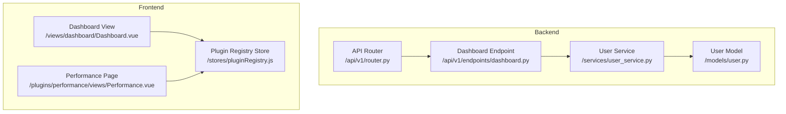
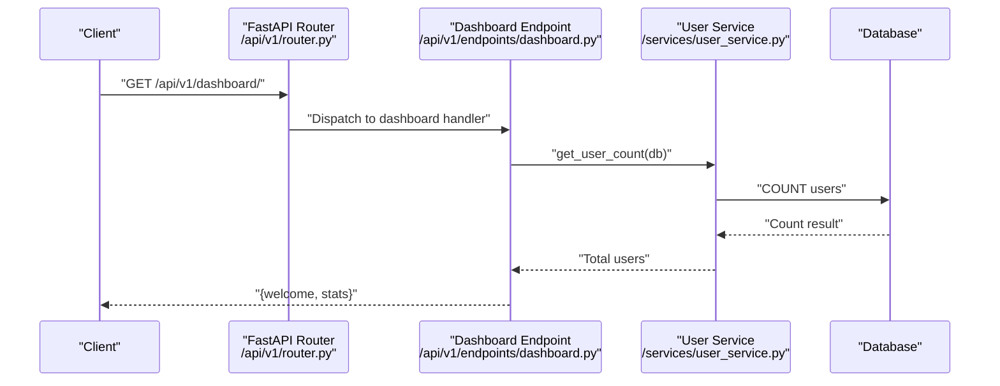
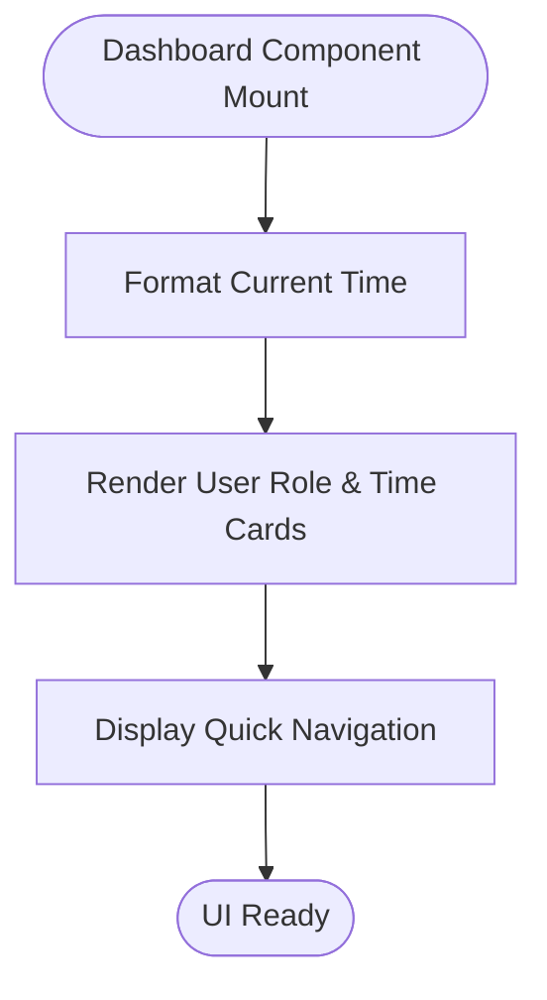
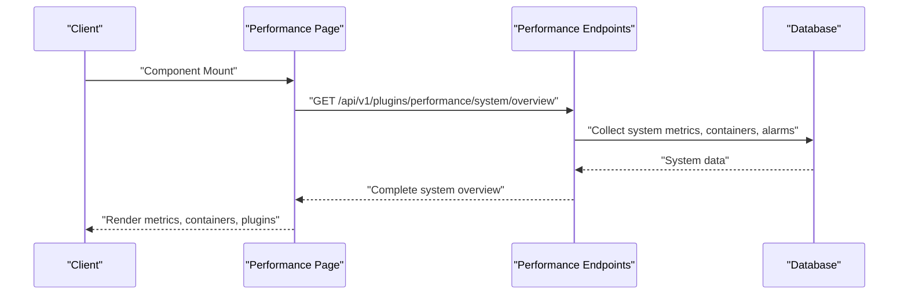
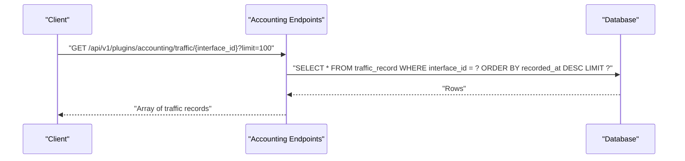
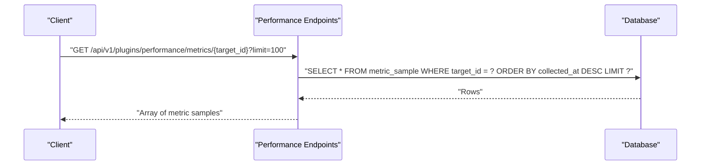
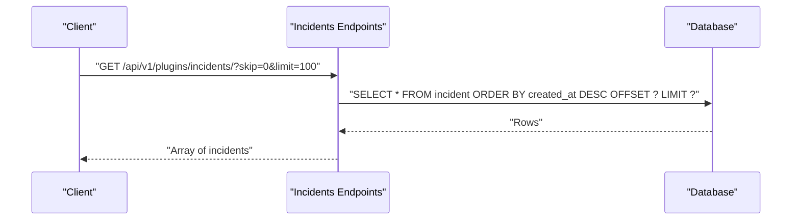
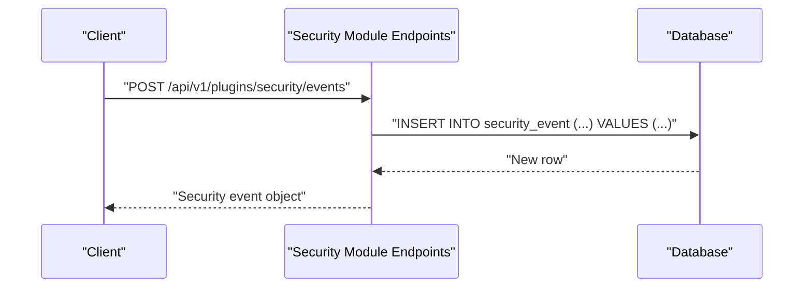
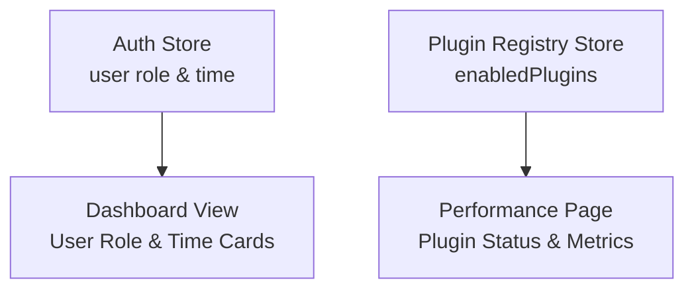
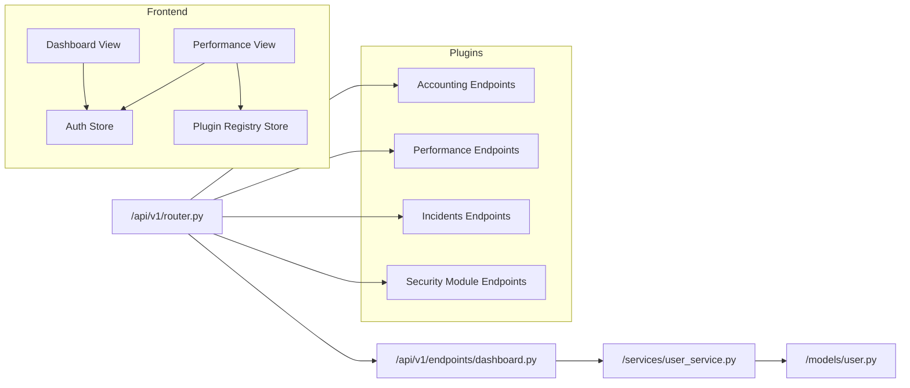

# Dashboard Endpoints

<cite>
**Referenced Files in This Document**
- [dashboard.py](file://backend/app/api/v1/endpoints/dashboard.py)
- [router.py](file://backend/app/api/v1/router.py)
- [user_service.py](file://backend/app/services/user_service.py)
- [user.py](file://backend/app/models/user.py)
- [Dashboard.vue](file://frontend/src/views/dashboard/Dashboard.vue)
- [pluginRegistry.js](file://frontend/src/stores/pluginRegistry.js)
- [Performance.vue](file://frontend/src/plugins/performance/views/Performance.vue)
- [accounting_endpoints.py](file://backend/app/plugins/accounting/endpoints.py)
- [performance_endpoints.py](file://backend/app/plugins/performance/endpoints.py)
- [incidents_endpoints.py](file://backend/app/plugins/incidents/endpoints.py)
- [security_endpoints.py](file://backend/app/plugins/security_module/endpoints.py)
- [common.py](file://backend/app/schemas/common.py)
- [config.py](file://backend/app/core/config.py)
</cite>

## Update Summary
**Changes Made**
- Updated dashboard endpoint documentation to reflect simplified interface focusing on user role and current time display
- Removed plugin registry integration details from dashboard documentation
- Added Performance page documentation as the new location for plugin information display
- Updated frontend integration details to show the new simplified dashboard layout
- Revised architecture diagrams to reflect the removal of plugin registry integration

## Table of Contents
1. [Introduction](#introduction)
2. [Project Structure](#project-structure)
3. [Core Components](#core-components)
4. [Architecture Overview](#architecture-overview)
5. [Detailed Component Analysis](#detailed-component-analysis)
6. [Dependency Analysis](#dependency-analysis)
7. [Performance Considerations](#performance-considerations)
8. [Troubleshooting Guide](#troubleshooting-guide)
9. [Conclusion](#conclusion)
10. [Appendices](#appendices)

## Introduction
This document provides comprehensive API documentation for the dashboard endpoints under the base path /api/v1/dashboard/. It covers HTTP methods, URL patterns, request and response schemas, and data aggregation patterns. The dashboard has been restructured to focus on essential user information (role and current time) rather than plugin registry integration. Plugin information is now centralized in the Performance page under Analytics → Performance section. Practical usage examples demonstrate dashboard data visualization, real-time metrics, and performance monitoring. Finally, it addresses data caching strategies, query optimization, and dashboard customization options.

## Project Structure
The dashboard endpoint is defined in the backend FastAPI application and integrated via the v1 router. The frontend dashboard view now provides a simplified interface focused on user role and current time display, with plugin information moved to the Performance page.

**Diagram sources**
- [router.py:1-10](file://backend/app/api/v1/router.py#L1-L10)
- [dashboard.py:1-27](file://backend/app/api/v1/endpoints/dashboard.py#L1-L27)
- [user_service.py:1-69](file://backend/app/services/user_service.py#L1-L69)
- [user.py:1-35](file://backend/app/models/user.py#L1-L35)
- [Dashboard.vue:1-66](file://frontend/src/views/dashboard/Dashboard.vue#L1-L66)
- [pluginRegistry.js:1-53](file://frontend/src/stores/pluginRegistry.js#L1-L53)
- [Performance.vue:1-488](file://frontend/src/plugins/performance/views/Performance.vue#L1-L488)

**Section sources**
- [router.py:1-10](file://backend/app/api/v1/router.py#L1-L10)
- [dashboard.py:1-27](file://backend/app/api/v1/endpoints/dashboard.py#L1-L27)
- [Dashboard.vue:1-66](file://frontend/src/views/dashboard/Dashboard.vue#L1-L66)
- [pluginRegistry.js:1-53](file://frontend/src/stores/pluginRegistry.js#L1-L53)
- [Performance.vue:1-488](file://frontend/src/plugins/performance/views/Performance.vue#L1-L488)

## Core Components
- Dashboard endpoint: GET /api/v1/dashboard/
  - Purpose: Returns a welcome message and basic stats (total users, current user role).
  - Authentication: Requires an active user.
  - Response shape: Includes a welcome string and a stats object containing total_users and your_role.
  - Data aggregation: Uses the user service to compute total user count; retrieves current user role from the authenticated session.

- Simplified Frontend Dashboard:
  - Displays user role and current time in card format with icons.
  - Provides quick navigation to Analytics → Performance section for plugin information.
  - No longer displays plugin registry information directly.

- Performance Page (New Location for Plugin Information):
  - Analytics → Performance section displays loaded plugins, active plugins, and plugin status.
  - Shows system metrics, container status, and alarms.
  - Integrates with plugin registry store to render plugin information.

- Plugin analytics endpoints (exposed by plugins):
  - Accounting plugin:
    - GET /api/v1/plugins/accounting/interfaces: Lists network interfaces.
    - GET /api/v1/plugins/accounting/traffic/{interface_id}: Retrieves traffic records for a given interface with optional limit.
  - Performance plugin:
    - GET /api/v1/plugins/performance/targets: Lists monitor targets.
    - GET /api/v1/plugins/performance/metrics/{target_id}: Retrieves metric samples for a given target with optional limit.
  - Incidents plugin:
    - GET /api/v1/plugins/incidents/: Lists incidents with pagination (skip, limit).
    - GET /api/v1/plugins/incidents/{incident_id}: Retrieves a specific incident.
    - GET /api/v1/plugins/incidents/{incident_id}/comments: Lists comments for an incident.
  - Security module plugin:
    - GET /api/v1/plugins/security/audit-logs: Lists audit logs with pagination (skip, limit).
    - GET /api/v1/plugins/security/events: Lists security events with pagination (skip, limit).
    - GET /api/v1/plugins/security/events/{event_id}: Retrieves a specific security event.
    - POST /api/v1/plugins/security/events: Creates a new security event.

**Section sources**
- [dashboard.py:12-27](file://backend/app/api/v1/endpoints/dashboard.py#L12-L27)
- [user_service.py:67-69](file://backend/app/services/user_service.py#L67-L69)
- [Dashboard.vue:30-63](file://frontend/src/views/dashboard/Dashboard.vue#L30-L63)
- [Performance.vue:32-485](file://frontend/src/plugins/performance/views/Performance.vue#L32-L485)
- [accounting_endpoints.py:14-61](file://backend/app/plugins/accounting/endpoints.py#L14-L61)
- [performance_endpoints.py:14-75](file://backend/app/plugins/performance/endpoints.py#L14-L75)
- [incidents_endpoints.py:18-122](file://backend/app/plugins/incidents/endpoints.py#L18-L122)
- [security_endpoints.py:17-72](file://backend/app/plugins/security_module/endpoints.py#L17-L72)
- [pluginRegistry.js:8-40](file://frontend/src/stores/pluginRegistry.js#L8-L40)

## Architecture Overview
The dashboard endpoint aggregates lightweight data (user counts and roles) from the backend. The frontend now provides a simplified dashboard interface with user role and current time display, while plugin information is centralized in the Performance page. The Performance page integrates with the plugin registry store to display plugin status and system metrics.

**Diagram sources**
- [router.py:8](file://backend/app/api/v1/router.py#L8)
- [dashboard.py:12-27](file://backend/app/api/v1/endpoints/dashboard.py#L12-L27)
- [user_service.py:67-69](file://backend/app/services/user_service.py#L67-L69)

## Detailed Component Analysis

### Dashboard Endpoint
- Path: GET /api/v1/dashboard/
- Authentication: Active user required.
- Request parameters:
  - None (no query parameters).
- Response schema:
  - welcome: string
  - stats:
    - total_users: integer
    - your_role: string
- Data aggregation:
  - Total users: computed via a count query.
  - Current user role: taken from the authenticated user object.
- Notes:
  - The endpoint does not expose metrics or analytics directly; it focuses on summary stats.

**Diagram sources**
- [dashboard.py:12-27](file://backend/app/api/v1/endpoints/dashboard.py#L12-L27)
- [user_service.py:67-69](file://backend/app/services/user_service.py#L67-L69)

**Section sources**
- [dashboard.py:12-27](file://backend/app/api/v1/endpoints/dashboard.py#L12-L27)
- [user_service.py:67-69](file://backend/app/services/user_service.py#L67-L69)

### Simplified Frontend Dashboard
- Layout: Grid-based card system displaying user role and current time.
- User Role Card:
  - Shows current user role in capitalized format.
  - Uses shield icon with green styling.
  - Pulls role from auth store.
- Current Time Card:
  - Displays formatted current time in Russian locale.
  - Uses clock icon with blue styling.
  - Automatically updates with component initialization.
- Quick Navigation:
  - Provides guidance to visit Analytics → Performance section for plugin information.
  - Uses gradient background card for emphasis.

**Updated** Simplified to focus on essential user information and removed plugin registry integration.

**Diagram sources**
- [Dashboard.vue:9-16](file://frontend/src/views/dashboard/Dashboard.vue#L9-L16)
- [Dashboard.vue:30-53](file://frontend/src/views/dashboard/Dashboard.vue#L30-L53)

**Section sources**
- [Dashboard.vue:1-66](file://frontend/src/views/dashboard/Dashboard.vue#L1-L66)

### Performance Page (New Plugin Information Location)
- System Metrics Overview:
  - Displays CPU, Memory, Disk, and Network usage in card format.
  - Shows progress bars with color-coded thresholds.
  - Includes load averages and network I/O metrics.
- Docker Containers Monitoring:
  - Lists running and stopped containers with status indicators.
  - Shows container images and states.
- Plugin Status Display:
  - Shows loaded plugins and active plugins counts.
  - Lists enabled plugins with labels and versions.
  - Uses badge indicators for plugin status.
- Auto-refresh Mechanism:
  - Fetches system data every 5 seconds.
  - Supports manual refresh button.
  - Handles loading states and error conditions.

**New** This section replaces the previous plugin registry integration in the dashboard.

**Diagram sources**
- [Performance.vue:68-93](file://frontend/src/plugins/performance/views/Performance.vue#L68-L93)
- [performance_endpoints.py:289-300](file://backend/app/plugins/performance/endpoints.py#L289-L300)

**Section sources**
- [Performance.vue:1-488](file://frontend/src/plugins/performance/views/Performance.vue#L1-L488)
- [performance_endpoints.py:265-300](file://backend/app/plugins/performance/endpoints.py#L265-L300)

### Plugin Analytics Endpoints

#### Accounting Plugin
- Interfaces
  - GET /api/v1/plugins/accounting/interfaces
  - Response: array of interface objects.
  - Access: requires active user.
- Traffic Records
  - GET /api/v1/plugins/accounting/traffic/{interface_id}?limit={n}
  - Parameters:
    - interface_id: path parameter (integer).
    - limit: query parameter (integer, default 100).
  - Response: array of traffic record objects.
  - Sorting: ordered by recorded_at descending.
  - Access: requires active user.

**Diagram sources**
- [accounting_endpoints.py:47-61](file://backend/app/plugins/accounting/endpoints.py#L47-L61)

**Section sources**
- [accounting_endpoints.py:14-61](file://backend/app/plugins/accounting/endpoints.py#L14-L61)

#### Performance Plugin
- Monitor Targets
  - GET /api/v1/plugins/performance/targets
  - Response: array of monitor target objects.
  - Access: requires active user.
- Metrics
  - GET /api/v1/plugins/performance/metrics/{target_id}?limit={n}
  - Parameters:
    - target_id: path parameter (integer).
    - limit: query parameter (integer, default 100).
  - Response: array of metric sample objects.
  - Sorting: ordered by collected_at descending.
  - Access: requires active user.

**Diagram sources**
- [performance_endpoints.py:61-75](file://backend/app/plugins/performance/endpoints.py#L61-L75)

**Section sources**
- [performance_endpoints.py:14-75](file://backend/app/plugins/performance/endpoints.py#L14-L75)

#### Incidents Plugin
- List Incidents
  - GET /api/v1/plugins/incidents/?skip={n}&limit={m}
  - Parameters:
    - skip: integer (default 0).
    - limit: integer (default 100).
  - Response: array of incident objects.
  - Sorting: ordered by created_at descending.
  - Access: requires active user.
- Get Incident
  - GET /api/v1/plugins/incidents/{incident_id}
  - Response: single incident object.
  - Access: requires active user.
- List Comments
  - GET /api/v1/plugins/incidents/{incident_id}/comments
  - Response: array of comment objects.
  - Sorting: ordered by created_at ascending.
  - Access: requires active user.

**Diagram sources**
- [incidents_endpoints.py:18-25](file://backend/app/plugins/incidents/endpoints.py#L18-L25)

**Section sources**
- [incidents_endpoints.py:18-122](file://backend/app/plugins/incidents/endpoints.py#L18-L122)

#### Security Module Plugin
- Audit Logs
  - GET /api/v1/plugins/security/audit-logs?skip={n}&limit={m}
  - Parameters:
    - skip: integer (default 0).
    - limit: integer (default 100).
  - Response: array of audit log objects.
  - Sorting: ordered by created_at descending.
  - Access: requires admin user.
- Security Events
  - GET /api/v1/plugins/security/events?skip={n}&limit={m}
  - Parameters:
    - skip: integer (default 0).
    - limit: integer (default 100).
  - Response: array of security event objects.
  - Sorting: ordered by created_at descending.
  - Access: requires active user.
- Get Event
  - GET /api/v1/plugins/security/events/{event_id}
  - Response: single security event object.
  - Access: requires active user.
- Create Event
  - POST /api/v1/plugins/security/events
  - Body: security event creation payload.
  - Response: created security event object.
  - Access: requires admin user.

**Diagram sources**
- [security_endpoints.py:49-60](file://backend/app/plugins/security_module/endpoints.py#L49-L60)

**Section sources**
- [security_endpoints.py:17-72](file://backend/app/plugins/security_module/endpoints.py#L17-L72)

### Frontend Dashboard Integration
- Simplified Data Flow:
  - Dashboard view calculates current time locally using JavaScript.
  - Displays user role from auth store.
  - No longer relies on plugin registry store for quick stats.
- Performance Page Integration:
  - Performance page uses plugin registry store to display plugin information.
  - Shows loaded plugins, active plugins, and plugin status.
  - Integrates with auth store for authentication and data fetching.

**Updated** Removed plugin registry integration from dashboard and moved plugin information to Performance page.

**Diagram sources**
- [Dashboard.vue:7-16](file://frontend/src/views/dashboard/Dashboard.vue#L7-L16)
- [pluginRegistry.js:8-40](file://frontend/src/stores/pluginRegistry.js#L8-L40)
- [Performance.vue:17-18](file://frontend/src/plugins/performance/views/Performance.vue#L17-L18)

**Section sources**
- [Dashboard.vue:1-66](file://frontend/src/views/dashboard/Dashboard.vue#L1-L66)
- [pluginRegistry.js:8-40](file://frontend/src/stores/pluginRegistry.js#L8-L40)
- [Performance.vue:1-488](file://frontend/src/plugins/performance/views/Performance.vue#L1-L488)

## Dependency Analysis
- Backend routing:
  - The v1 router includes the dashboard router under /api/v1/dashboard/.
- Dashboard endpoint dependencies:
  - Depends on the database session and the current active user.
  - Uses the user service to compute total user count.
- Plugin endpoints dependencies:
  - Each plugin endpoint depends on the database session and user authentication/authorization checks.
  - Some endpoints require admin privileges.
- Frontend dependencies:
  - Dashboard view depends on auth store for user role and time calculation.
  - Performance page depends on auth store and plugin registry store.

**Updated** Removed plugin registry store dependency from dashboard view.

**Diagram sources**
- [router.py:1-10](file://backend/app/api/v1/router.py#L1-L10)
- [dashboard.py:1-27](file://backend/app/api/v1/endpoints/dashboard.py#L1-L27)
- [user_service.py:1-69](file://backend/app/services/user_service.py#L1-L69)
- [user.py:1-35](file://backend/app/models/user.py#L1-L35)
- [accounting_endpoints.py:1-61](file://backend/app/plugins/accounting/endpoints.py#L1-L61)
- [performance_endpoints.py:1-75](file://backend/app/plugins/performance/endpoints.py#L1-L75)
- [incidents_endpoints.py:1-122](file://backend/app/plugins/incidents/endpoints.py#L1-L122)
- [security_endpoints.py:1-72](file://backend/app/plugins/security_module/endpoints.py#L1-L72)
- [Dashboard.vue:1-66](file://frontend/src/views/dashboard/Dashboard.vue#L1-L66)
- [Performance.vue:1-488](file://frontend/src/plugins/performance/views/Performance.vue#L1-L488)

**Section sources**
- [router.py:1-10](file://backend/app/api/v1/router.py#L1-L10)
- [dashboard.py:1-27](file://backend/app/api/v1/endpoints/dashboard.py#L1-L27)
- [user_service.py:1-69](file://backend/app/services/user_service.py#L1-L69)
- [user.py:1-35](file://backend/app/models/user.py#L1-L35)
- [accounting_endpoints.py:1-61](file://backend/app/plugins/accounting/endpoints.py#L1-L61)
- [performance_endpoints.py:1-75](file://backend/app/plugins/performance/endpoints.py#L1-L75)
- [incidents_endpoints.py:1-122](file://backend/app/plugins/incidents/endpoints.py#L1-L122)
- [security_endpoints.py:1-72](file://backend/app/plugins/security_module/endpoints.py#L1-L72)
- [Dashboard.vue:1-66](file://frontend/src/views/dashboard/Dashboard.vue#L1-L66)
- [Performance.vue:1-488](file://frontend/src/plugins/performance/views/Performance.vue#L1-L488)

## Performance Considerations
- Pagination and limits:
  - Use skip and limit parameters to constrain result sets for endpoints that support them (incidents, accounting traffic, performance metrics, security logs).
  - Default limits are set per endpoint; clients should explicitly specify limits for predictable performance.
- Sorting and ordering:
  - Many endpoints sort by timestamps (e.g., recorded_at, collected_at, created_at). Clients should leverage these natural orderings to avoid additional client-side sorting.
- Aggregation:
  - The dashboard endpoint performs a simple COUNT query; ensure appropriate indexing on user tables for scalability.
- Caching:
  - For low-churn data (e.g., user counts), consider short-lived caching at the application level to reduce repeated COUNT queries.
  - For analytics data, implement cache warming for frequently accessed targets/interfaces and invalidate caches on write operations.
- Query optimization:
  - Prefer filtered queries with ORDER BY and LIMIT to minimize result set sizes.
  - Avoid N+1 queries by fetching related entities in bulk where applicable.
- Real-time metrics:
  - For real-time dashboards, consider streaming updates via server-sent events or WebSocket connections alongside periodic polling.
- Frontend Performance:
  - Dashboard view now performs local time calculations, reducing server requests.
  - Performance page uses auto-refresh mechanism with 5-second intervals for optimal responsiveness.

**Updated** Added frontend performance considerations for the simplified dashboard approach.

## Troubleshooting Guide
- Authentication failures:
  - Ensure requests include a valid access token for endpoints requiring active users.
- Authorization failures:
  - Some endpoints require admin privileges; verify the current user role.
- Resource not found:
  - Certain GET endpoints return 404 when resources (e.g., interface, target, incident, event) are missing.
- Pagination confusion:
  - Confirm skip and limit values; remember defaults and adjust according to client needs.
- Response validation:
  - Responses conform to Pydantic models defined in plugin schemas; verify client-side parsing aligns with expected shapes.
- Dashboard display issues:
  - If user role or time display is incorrect, verify auth store data and browser locale settings.
- Plugin information not showing:
  - Navigate to Analytics → Performance section to view plugin information and system metrics.

**Updated** Added troubleshooting guidance for the new dashboard structure and Performance page integration.

**Section sources**
- [accounting_endpoints.py:42-44](file://backend/app/plugins/accounting/endpoints.py#L42-L44)
- [performance_endpoints.py:41-44](file://backend/app/plugins/performance/endpoints.py#L41-L44)
- [incidents_endpoints.py:47-50](file://backend/app/plugins/incidents/endpoints.py#L47-L50)
- [security_endpoints.py:68-71](file://backend/app/plugins/security_module/endpoints.py#L68-L71)
- [Dashboard.vue:30-63](file://frontend/src/views/dashboard/Dashboard.vue#L30-L63)

## Conclusion
The dashboard endpoints provide a concise summary of system state with a simplified interface focusing on essential user information (role and current time). Plugin information has been centralized in the Performance page under Analytics → Performance section, which provides comprehensive system monitoring and plugin status display. By leveraging pagination, explicit limits, and efficient sorting, clients can build responsive dashboards. For real-time monitoring, combine periodic polling with caching strategies and consider streaming updates. The simplified frontend dashboard complements backend data with local computations, while the Performance page handles plugin registry integration and system metrics display.

**Updated** Reflects the new simplified dashboard structure and centralized plugin information approach.

## Appendices

### API Reference Summary

- Base path: /api/v1
- Dashboard
  - GET /dashboard/
    - Response: { welcome: string, stats: { total_users: number, your_role: string } }

- Plugins
  - Accounting
    - GET /plugins/accounting/interfaces
    - GET /plugins/accounting/traffic/{interface_id}?limit={n}
  - Performance
    - GET /plugins/performance/targets
    - GET /plugins/performance/metrics/{target_id}?limit={n}
    - GET /plugins/performance/system/metrics
    - GET /plugins/performance/system/containers
    - GET /plugins/performance/system/alarms
    - GET /plugins/performance/system/overview
  - Incidents
    - GET /plugins/incidents/?skip={n}&limit={m}
    - GET /plugins/incidents/{incident_id}
    - GET /plugins/incidents/{incident_id}/comments
  - Security
    - GET /plugins/security/audit-logs?skip={n}&limit={m}
    - GET /plugins/security/events?skip={n}&limit={m}
    - GET /plugins/security/events/{event_id}
    - POST /plugins/security/events

- Status Response Schema
  - { status: string, message?: string }

**Section sources**
- [dashboard.py:12-27](file://backend/app/api/v1/endpoints/dashboard.py#L12-L27)
- [accounting_endpoints.py:14-61](file://backend/app/plugins/accounting/endpoints.py#L14-L61)
- [performance_endpoints.py:14-300](file://backend/app/plugins/performance/endpoints.py#L14-L300)
- [incidents_endpoints.py:18-122](file://backend/app/plugins/incidents/endpoints.py#L18-L122)
- [security_endpoints.py:17-72](file://backend/app/plugins/security_module/endpoints.py#L17-L72)
- [common.py:5-8](file://backend/app/schemas/common.py#L5-L8)

### Practical Usage Examples

- Dashboard data visualization
  - Fetch /api/v1/dashboard/ and render a welcome message and total users.
  - Use the simplified dashboard view to display user role and current time.
  - Navigate to Analytics → Performance section for plugin information and system metrics.
- Real-time metrics
  - Poll /api/v1/plugins/performance/metrics/{target_id}?limit=100 for recent samples.
  - Poll /api/v1/plugins/performance/system/overview for complete system metrics.
  - Use Performance page auto-refresh for continuous monitoring.
- Performance monitoring
  - Use /api/v1/plugins/performance/targets to discover monitoring targets.
  - Use /api/v1/plugins/incidents/?skip=0&limit=50 to surface recent incidents.
  - Monitor plugin status and system health through Performance page.
- Security monitoring
  - Use /api/v1/plugins/security/events?skip=0&limit=50 to list recent events.
  - Use /api/v1/plugins/security/audit-logs?skip=0&limit=50 for administrative audit trails.

**Updated** Added Performance page usage examples and removed plugin registry integration references.

**Section sources**
- [dashboard.py:12-27](file://backend/app/api/v1/endpoints/dashboard.py#L12-L27)
- [performance_endpoints.py:289-300](file://backend/app/plugins/performance/endpoints.py#L289-L300)
- [accounting_endpoints.py:47-61](file://backend/app/plugins/accounting/endpoints.py#L47-L61)
- [incidents_endpoints.py:18-25](file://backend/app/plugins/incidents/endpoints.py#L18-L25)
- [security_endpoints.py:33-46](file://backend/app/plugins/security_module/endpoints.py#L33-L46)
- [Performance.vue:68-93](file://frontend/src/plugins/performance/views/Performance.vue#L68-L93)

### Configuration Notes
- Allowed origins and CORS are configured centrally; ensure frontend origins match to avoid cross-origin issues.
- Debug mode and logging levels can be adjusted for development and production environments.
- Dashboard view uses browser locale for time formatting; ensure proper localization support.
- Performance page auto-refresh interval is set to 5 seconds; adjust as needed for different environments.

**Updated** Added configuration notes for the new dashboard structure and Performance page.

**Section sources**
- [config.py:15-23](file://backend/app/core/config.py#L15-L23)
- [Dashboard.vue:9-16](file://frontend/src/views/dashboard/Dashboard.vue#L9-L16)
- [Performance.vue:111-113](file://frontend/src/plugins/performance/views/Performance.vue#L111-L113)