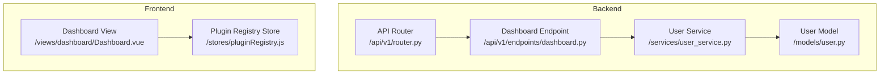
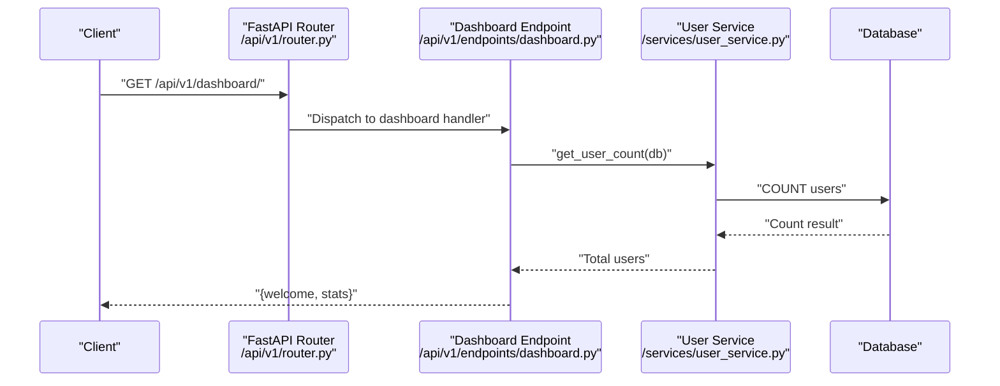
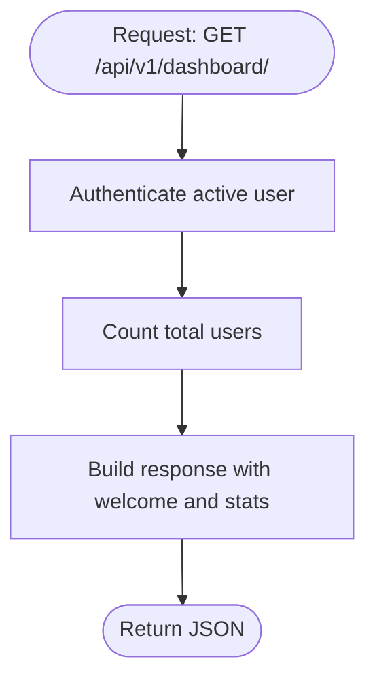
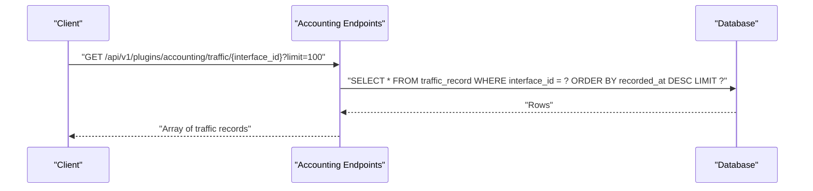
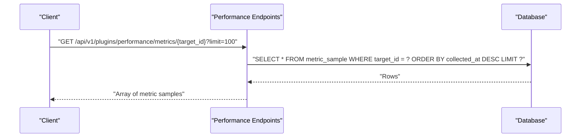
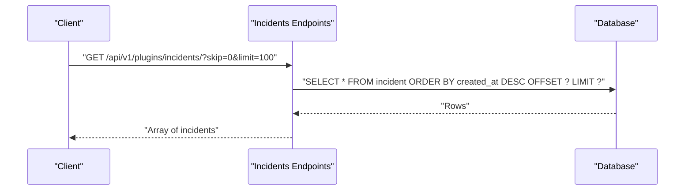
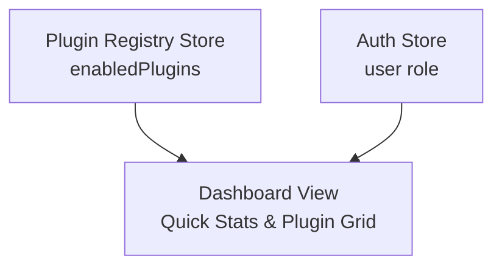
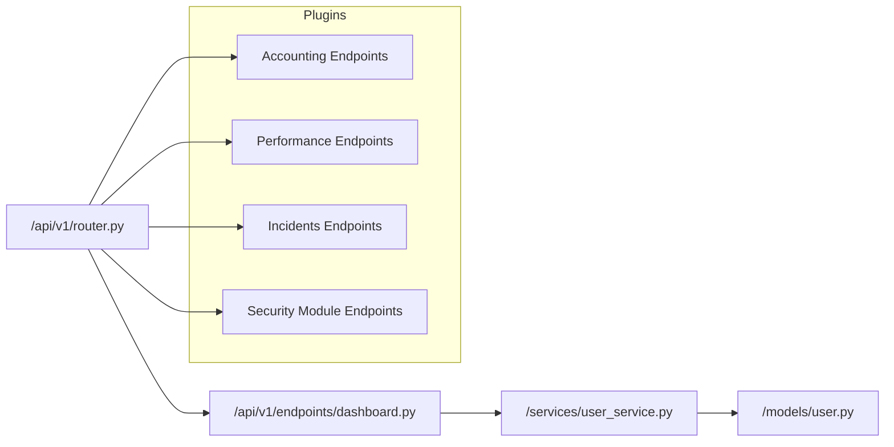

# Dashboard Endpoints

<cite>
**Referenced Files in This Document**
- [dashboard.py](file://backend/app/api/v1/endpoints/dashboard.py)
- [router.py](file://backend/app/api/v1/router.py)
- [user_service.py](file://backend/app/services/user_service.py)
- [user.py](file://backend/app/models/user.py)
- [Dashboard.vue](file://frontend/src/views/dashboard/Dashboard.vue)
- [pluginRegistry.js](file://frontend/src/stores/pluginRegistry.js)
- [accounting_endpoints.py](file://backend/app/plugins/accounting/endpoints.py)
- [performance_endpoints.py](file://backend/app/plugins/performance/endpoints.py)
- [incidents_endpoints.py](file://backend/app/plugins/incidents/endpoints.py)
- [security_endpoints.py](file://backend/app/plugins/security_module/endpoints.py)
- [common.py](file://backend/app/schemas/common.py)
- [config.py](file://backend/app/core/config.py)
</cite>

## Table of Contents
1. [Introduction](#introduction)
2. [Project Structure](#project-structure)
3. [Core Components](#core-components)
4. [Architecture Overview](#architecture-overview)
5. [Detailed Component Analysis](#detailed-component-analysis)
6. [Dependency Analysis](#dependency-analysis)
7. [Performance Considerations](#performance-considerations)
8. [Troubleshooting Guide](#troubleshooting-guide)
9. [Conclusion](#conclusion)
10. [Appendices](#appendices)

## Introduction
This document provides comprehensive API documentation for the dashboard endpoints under the base path /api/v1/dashboard/. It covers HTTP methods, URL patterns, request and response schemas, and data aggregation patterns. It also documents parameter specifications for retrieving dashboard data, querying metrics, and accessing analytics endpoints exposed by plugins. Practical usage examples demonstrate dashboard data visualization, real-time metrics, and performance monitoring. Finally, it addresses data caching strategies, query optimization, and dashboard customization options.

## Project Structure
The dashboard endpoint is defined in the backend FastAPI application and integrated via the v1 router. The frontend dashboard view consumes data from the backend and displays plugin-related statistics and lists.

**Diagram sources**
- [router.py:1-10](file://backend/app/api/v1/router.py#L1-L10)
- [dashboard.py:1-27](file://backend/app/api/v1/endpoints/dashboard.py#L1-L27)
- [user_service.py:1-69](file://backend/app/services/user_service.py#L1-L69)
- [user.py:1-35](file://backend/app/models/user.py#L1-L35)
- [Dashboard.vue:1-75](file://frontend/src/views/dashboard/Dashboard.vue#L1-L75)
- [pluginRegistry.js:1-53](file://frontend/src/stores/pluginRegistry.js#L1-L53)

**Section sources**
- [router.py:1-10](file://backend/app/api/v1/router.py#L1-L10)
- [dashboard.py:1-27](file://backend/app/api/v1/endpoints/dashboard.py#L1-L27)
- [Dashboard.vue:1-75](file://frontend/src/views/dashboard/Dashboard.vue#L1-L75)
- [pluginRegistry.js:1-53](file://frontend/src/stores/pluginRegistry.js#L1-L53)

## Core Components
- Dashboard endpoint: GET /api/v1/dashboard/
  - Purpose: Returns a welcome message and basic stats (total users, current user role).
  - Authentication: Requires an active user.
  - Response shape: Includes a welcome string and a stats object containing total_users and your_role.
  - Data aggregation: Uses the user service to compute total user count; retrieves current user role from the authenticated session.

- Plugin analytics endpoints (exposed by plugins):
  - Accounting plugin:
    - GET /api/v1/plugins/accounting/interfaces: Lists network interfaces.
    - GET /api/v1/plugins/accounting/traffic/{interface_id}: Retrieves traffic records for a given interface with optional limit.
  - Performance plugin:
    - GET /api/v1/plugins/performance/targets: Lists monitor targets.
    - GET /api/v1/plugins/performance/metrics/{target_id}: Retrieves metric samples for a given target with optional limit.
  - Incidents plugin:
    - GET /api/v1/plugins/incidents/: Lists incidents with pagination (skip, limit).
    - GET /api/v1/plugins/incidents/{incident_id}: Retrieves a specific incident.
    - GET /api/v1/plugins/incidents/{incident_id}/comments: Lists comments for an incident.
  - Security module plugin:
    - GET /api/v1/plugins/security/audit-logs: Lists audit logs with pagination (skip, limit).
    - GET /api/v1/plugins/security/events: Lists security events with pagination (skip, limit).
    - GET /api/v1/plugins/security/events/{event_id}: Retrieves a specific security event.
    - POST /api/v1/plugins/security/events: Creates a new security event.

- Frontend dashboard:
  - Displays quick stats (active plugins count, user role) and a grid of loaded plugins.
  - Integrates with the plugin registry store to render enabled plugins and their metadata.

**Section sources**
- [dashboard.py:12-27](file://backend/app/api/v1/endpoints/dashboard.py#L12-L27)
- [user_service.py:67-69](file://backend/app/services/user_service.py#L67-L69)
- [accounting_endpoints.py:14-61](file://backend/app/plugins/accounting/endpoints.py#L14-L61)
- [performance_endpoints.py:14-75](file://backend/app/plugins/performance/endpoints.py#L14-L75)
- [incidents_endpoints.py:18-122](file://backend/app/plugins/incidents/endpoints.py#L18-L122)
- [security_endpoints.py:17-72](file://backend/app/plugins/security_module/endpoints.py#L17-L72)
- [Dashboard.vue:15-72](file://frontend/src/views/dashboard/Dashboard.vue#L15-L72)
- [pluginRegistry.js:8-40](file://frontend/src/stores/pluginRegistry.js#L8-L40)

## Architecture Overview
The dashboard endpoint aggregates lightweight data (user counts and roles) from the backend and pairs it with plugin-provided analytics. The frontend composes a dashboard UI from these data sources.

**Diagram sources**
- [router.py:8](file://backend/app/api/v1/router.py#L8)
- [dashboard.py:12-27](file://backend/app/api/v1/endpoints/dashboard.py#L12-L27)
- [user_service.py:67-69](file://backend/app/services/user_service.py#L67-L69)

## Detailed Component Analysis

### Dashboard Endpoint
- Path: GET /api/v1/dashboard/
- Authentication: Active user required.
- Request parameters:
  - None (no query parameters).
- Response schema:
  - welcome: string
  - stats:
    - total_users: integer
    - your_role: string
- Data aggregation:
  - Total users: computed via a count query.
  - Current user role: taken from the authenticated user object.
- Notes:
  - The endpoint does not expose metrics or analytics directly; it focuses on summary stats.

**Diagram sources**
- [dashboard.py:12-27](file://backend/app/api/v1/endpoints/dashboard.py#L12-L27)
- [user_service.py:67-69](file://backend/app/services/user_service.py#L67-L69)

**Section sources**
- [dashboard.py:12-27](file://backend/app/api/v1/endpoints/dashboard.py#L12-L27)
- [user_service.py:67-69](file://backend/app/services/user_service.py#L67-L69)

### Plugin Analytics Endpoints

#### Accounting Plugin
- Interfaces
  - GET /api/v1/plugins/accounting/interfaces
  - Response: array of interface objects.
  - Access: requires active user.
- Traffic Records
  - GET /api/v1/plugins/accounting/traffic/{interface_id}?limit={n}
  - Parameters:
    - interface_id: path parameter (integer).
    - limit: query parameter (integer, default 100).
  - Response: array of traffic record objects.
  - Sorting: ordered by recorded_at descending.
  - Access: requires active user.

**Diagram sources**
- [accounting_endpoints.py:47-61](file://backend/app/plugins/accounting/endpoints.py#L47-L61)

**Section sources**
- [accounting_endpoints.py:14-61](file://backend/app/plugins/accounting/endpoints.py#L14-L61)

#### Performance Plugin
- Monitor Targets
  - GET /api/v1/plugins/performance/targets
  - Response: array of monitor target objects.
  - Access: requires active user.
- Metrics
  - GET /api/v1/plugins/performance/metrics/{target_id}?limit={n}
  - Parameters:
    - target_id: path parameter (integer).
    - limit: query parameter (integer, default 100).
  - Response: array of metric sample objects.
  - Sorting: ordered by collected_at descending.
  - Access: requires active user.

**Diagram sources**
- [performance_endpoints.py:61-75](file://backend/app/plugins/performance/endpoints.py#L61-L75)

**Section sources**
- [performance_endpoints.py:14-75](file://backend/app/plugins/performance/endpoints.py#L14-L75)

#### Incidents Plugin
- List Incidents
  - GET /api/v1/plugins/incidents/?skip={n}&limit={m}
  - Parameters:
    - skip: integer (default 0).
    - limit: integer (default 100).
  - Response: array of incident objects.
  - Sorting: ordered by created_at descending.
  - Access: requires active user.
- Get Incident
  - GET /api/v1/plugins/incidents/{incident_id}
  - Response: single incident object.
  - Access: requires active user.
- List Comments
  - GET /api/v1/plugins/incidents/{incident_id}/comments
  - Response: array of comment objects.
  - Sorting: ordered by created_at ascending.
  - Access: requires active user.

**Diagram sources**
- [incidents_endpoints.py:18-25](file://backend/app/plugins/incidents/endpoints.py#L18-L25)

**Section sources**
- [incidents_endpoints.py:18-122](file://backend/app/plugins/incidents/endpoints.py#L18-L122)

#### Security Module Plugin
- Audit Logs
  - GET /api/v1/plugins/security/audit-logs?skip={n}&limit={m}
  - Parameters:
    - skip: integer (default 0).
    - limit: integer (default 100).
  - Response: array of audit log objects.
  - Sorting: ordered by created_at descending.
  - Access: requires admin user.
- Security Events
  - GET /api/v1/plugins/security/events?skip={n}&limit={m}
  - Parameters:
    - skip: integer (default 0).
    - limit: integer (default 100).
  - Response: array of security event objects.
  - Sorting: ordered by created_at descending.
  - Access: requires active user.
- Get Event
  - GET /api/v1/plugins/security/events/{event_id}
  - Response: single security event object.
  - Access: requires active user.
- Create Event
  - POST /api/v1/plugins/security/events
  - Body: security event creation payload.
  - Response: created security event object.
  - Access: requires admin user.

**Diagram sources**
- [security_endpoints.py:49-60](file://backend/app/plugins/security_module/endpoints.py#L49-L60)

**Section sources**
- [security_endpoints.py:17-72](file://backend/app/plugins/security_module/endpoints.py#L17-L72)

### Frontend Dashboard Integration
- Quick Stats:
  - Active Plugins: derived from the plugin registry store’s enabledPlugins length.
  - Your Role: derived from the auth store’s user role.
- Loaded Plugins:
  - Iterates over enabledPlugins to render plugin cards with label and version.
- Data Flow:
  - The frontend does not directly call backend analytics endpoints for quick stats; it computes them locally from stores.

**Diagram sources**
- [pluginRegistry.js:8-40](file://frontend/src/stores/pluginRegistry.js#L8-L40)
- [Dashboard.vue:15-72](file://frontend/src/views/dashboard/Dashboard.vue#L15-L72)

**Section sources**
- [pluginRegistry.js:8-40](file://frontend/src/stores/pluginRegistry.js#L8-L40)
- [Dashboard.vue:15-72](file://frontend/src/views/dashboard/Dashboard.vue#L15-L72)

## Dependency Analysis
- Backend routing:
  - The v1 router includes the dashboard router under /api/v1/dashboard/.
- Dashboard endpoint dependencies:
  - Depends on the database session and the current active user.
  - Uses the user service to compute total user count.
- Plugin endpoints dependencies:
  - Each plugin endpoint depends on the database session and user authentication/authorization checks.
  - Some endpoints require admin privileges.
- Frontend dependencies:
  - Dashboard view depends on auth and plugin registry stores.

**Diagram sources**
- [router.py:1-10](file://backend/app/api/v1/router.py#L1-L10)
- [dashboard.py:1-27](file://backend/app/api/v1/endpoints/dashboard.py#L1-L27)
- [user_service.py:1-69](file://backend/app/services/user_service.py#L1-L69)
- [user.py:1-35](file://backend/app/models/user.py#L1-L35)
- [accounting_endpoints.py:1-61](file://backend/app/plugins/accounting/endpoints.py#L1-L61)
- [performance_endpoints.py:1-75](file://backend/app/plugins/performance/endpoints.py#L1-L75)
- [incidents_endpoints.py:1-122](file://backend/app/plugins/incidents/endpoints.py#L1-L122)
- [security_endpoints.py:1-72](file://backend/app/plugins/security_module/endpoints.py#L1-L72)

**Section sources**
- [router.py:1-10](file://backend/app/api/v1/router.py#L1-L10)
- [dashboard.py:1-27](file://backend/app/api/v1/endpoints/dashboard.py#L1-L27)
- [user_service.py:1-69](file://backend/app/services/user_service.py#L1-L69)
- [user.py:1-35](file://backend/app/models/user.py#L1-L35)
- [accounting_endpoints.py:1-61](file://backend/app/plugins/accounting/endpoints.py#L1-L61)
- [performance_endpoints.py:1-75](file://backend/app/plugins/performance/endpoints.py#L1-L75)
- [incidents_endpoints.py:1-122](file://backend/app/plugins/incidents/endpoints.py#L1-L122)
- [security_endpoints.py:1-72](file://backend/app/plugins/security_module/endpoints.py#L1-L72)

## Performance Considerations
- Pagination and limits:
  - Use skip and limit parameters to constrain result sets for endpoints that support them (incidents, accounting traffic, performance metrics, security logs).
  - Default limits are set per endpoint; clients should explicitly specify limits for predictable performance.
- Sorting and ordering:
  - Many endpoints sort by timestamps (e.g., recorded_at, collected_at, created_at). Clients should leverage these natural orderings to avoid additional client-side sorting.
- Aggregation:
  - The dashboard endpoint performs a simple COUNT query; ensure appropriate indexing on user tables for scalability.
- Caching:
  - For low-churn data (e.g., user counts), consider short-lived caching at the application level to reduce repeated COUNT queries.
  - For analytics data, implement cache warming for frequently accessed targets/interfaces and invalidate caches on write operations.
- Query optimization:
  - Prefer filtered queries with ORDER BY and LIMIT to minimize result set sizes.
  - Avoid N+1 queries by fetching related entities in bulk where applicable.
- Real-time metrics:
  - For real-time dashboards, consider streaming updates via server-sent events or WebSocket connections alongside periodic polling.

[No sources needed since this section provides general guidance]

## Troubleshooting Guide
- Authentication failures:
  - Ensure requests include a valid access token for endpoints requiring active users.
- Authorization failures:
  - Some endpoints require admin privileges; verify the current user role.
- Resource not found:
  - Certain GET endpoints return 404 when resources (e.g., interface, target, incident, event) are missing.
- Pagination confusion:
  - Confirm skip and limit values; remember defaults and adjust according to client needs.
- Response validation:
  - Responses conform to Pydantic models defined in plugin schemas; verify client-side parsing aligns with expected shapes.

**Section sources**
- [accounting_endpoints.py:42-44](file://backend/app/plugins/accounting/endpoints.py#L42-L44)
- [performance_endpoints.py:41-44](file://backend/app/plugins/performance/endpoints.py#L41-L44)
- [incidents_endpoints.py:47-50](file://backend/app/plugins/incidents/endpoints.py#L47-L50)
- [security_endpoints.py:68-71](file://backend/app/plugins/security_module/endpoints.py#L68-L71)

## Conclusion
The dashboard endpoints provide a concise summary of system state and integrate seamlessly with plugin-provided analytics. By leveraging pagination, explicit limits, and efficient sorting, clients can build responsive dashboards. For real-time monitoring, combine periodic polling with caching strategies and consider streaming updates. The frontend dashboard complements backend data with local computations from plugin registries and auth stores.

[No sources needed since this section summarizes without analyzing specific files]

## Appendices

### API Reference Summary

- Base path: /api/v1
- Dashboard
  - GET /dashboard/
    - Response: { welcome: string, stats: { total_users: number, your_role: string } }

- Plugins
  - Accounting
    - GET /plugins/accounting/interfaces
    - GET /plugins/accounting/traffic/{interface_id}?limit={n}
  - Performance
    - GET /plugins/performance/targets
    - GET /plugins/performance/metrics/{target_id}?limit={n}
  - Incidents
    - GET /plugins/incidents/?skip={n}&limit={m}
    - GET /plugins/incidents/{incident_id}
    - GET /plugins/incidents/{incident_id}/comments
  - Security
    - GET /plugins/security/audit-logs?skip={n}&limit={m}
    - GET /plugins/security/events?skip={n}&limit={m}
    - GET /plugins/security/events/{event_id}
    - POST /plugins/security/events

- Status Response Schema
  - { status: string, message?: string }

**Section sources**
- [dashboard.py:12-27](file://backend/app/api/v1/endpoints/dashboard.py#L12-L27)
- [accounting_endpoints.py:14-61](file://backend/app/plugins/accounting/endpoints.py#L14-L61)
- [performance_endpoints.py:14-75](file://backend/app/plugins/performance/endpoints.py#L14-L75)
- [incidents_endpoints.py:18-122](file://backend/app/plugins/incidents/endpoints.py#L18-L122)
- [security_endpoints.py:17-72](file://backend/app/plugins/security_module/endpoints.py#L17-L72)
- [common.py:5-8](file://backend/app/schemas/common.py#L5-L8)

### Practical Usage Examples

- Dashboard data visualization
  - Fetch /api/v1/dashboard/ and render a welcome message and total users.
  - Combine with frontend plugin registry to show active plugins and versions.
- Real-time metrics
  - Poll /api/v1/plugins/performance/metrics/{target_id}?limit=100 for recent samples.
  - Poll /api/v1/plugins/accounting/traffic/{interface_id}?limit=100 for recent traffic entries.
- Performance monitoring
  - Use /api/v1/plugins/performance/targets to discover targets.
  - Use /api/v1/plugins/incidents/?skip=0&limit=50 to surface recent incidents.
- Security monitoring
  - Use /api/v1/plugins/security/events?skip=0&limit=50 to list recent events.
  - Use /api/v1/plugins/security/audit-logs?skip=0&limit=50 for administrative audit trails.

**Section sources**
- [dashboard.py:12-27](file://backend/app/api/v1/endpoints/dashboard.py#L12-L27)
- [performance_endpoints.py:61-75](file://backend/app/plugins/performance/endpoints.py#L61-L75)
- [accounting_endpoints.py:47-61](file://backend/app/plugins/accounting/endpoints.py#L47-L61)
- [incidents_endpoints.py:18-25](file://backend/app/plugins/incidents/endpoints.py#L18-L25)
- [security_endpoints.py:33-46](file://backend/app/plugins/security_module/endpoints.py#L33-L46)

### Configuration Notes
- Allowed origins and CORS are configured centrally; ensure frontend origins match to avoid cross-origin issues.
- Debug mode and logging levels can be adjusted for development and production environments.

**Section sources**
- [config.py:15-23](file://backend/app/core/config.py#L15-L23)