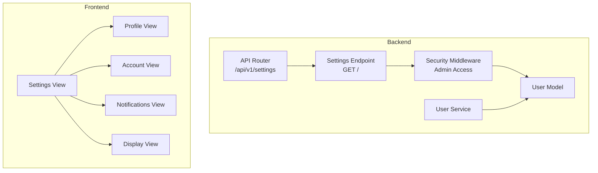
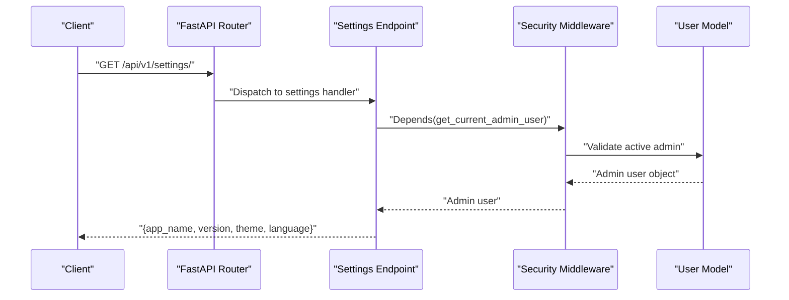
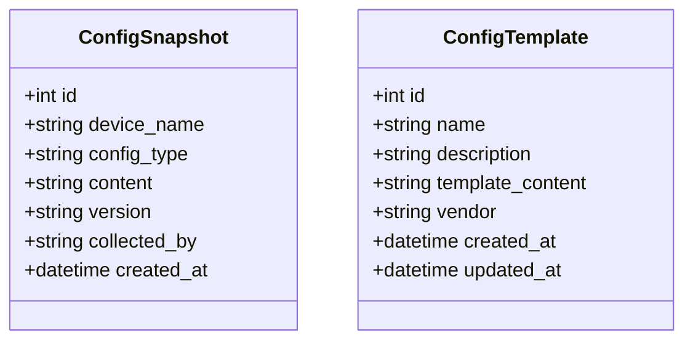
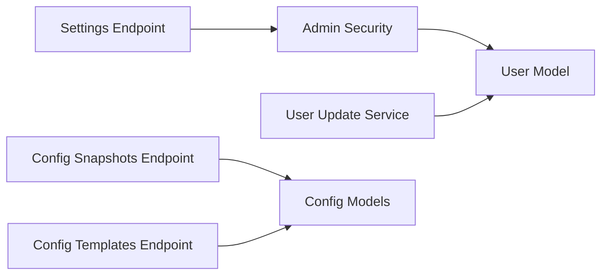

# Settings Endpoints

<cite>
**Referenced Files in This Document**
- [settings.py](file://backend/app/api/v1/endpoints/settings.py)
- [router.py](file://backend/app/api/v1/router.py)
- [security.py](file://backend/app/core/security.py)
- [config.py](file://backend/app/core/config.py)
- [user.py](file://backend/app/models/user.py)
- [user_service.py](file://backend/app/services/user_service.py)
- [user_schemas.py](file://backend/app/schemas/user.py)
- [auth_service.py](file://backend/app/services/auth_service.py)
- [Settings.vue](file://frontend/src/views/settings/Settings.vue)
- [Profile.vue](file://frontend/src/views/settings/Profile.vue)
- [Account.vue](file://frontend/src/views/settings/Account.vue)
- [Display.vue](file://frontend/src/views/settings/Display.vue)
- [Notifications.vue](file://frontend/src/views/settings/Notifications.vue)
- [configuration_plugin.py](file://backend/app/plugins/configuration/plugin.py)
- [configuration_endpoints.py](file://backend/app/plugins/configuration/endpoints.py)
- [configuration_models.py](file://backend/app/plugins/configuration/models.py)
- [configuration_schemas.py](file://backend/app/plugins/configuration/schemas.py)
</cite>

## Table of Contents
1. [Introduction](#introduction)
2. [Project Structure](#project-structure)
3. [Core Components](#core-components)
4. [Architecture Overview](#architecture-overview)
5. [Detailed Component Analysis](#detailed-component-analysis)
6. [Dependency Analysis](#dependency-analysis)
7. [Performance Considerations](#performance-considerations)
8. [Troubleshooting Guide](#troubleshooting-guide)
9. [Conclusion](#conclusion)
10. [Appendices](#appendices)

## Introduction
This document provides comprehensive API documentation for the settings endpoints under /api/v1/settings/. It covers HTTP methods, URL patterns, request/response schemas, user preference management, validation rules, defaults, and inheritance patterns. It also includes practical usage examples for user settings management, bulk updates, and settings synchronization, along with security, audit logging, and configuration backup/restore procedures.

## Project Structure
The settings functionality is exposed via FastAPI routers and integrates with user models, services, and security middleware. The frontend provides dedicated views for profile, account, notifications, and display settings.

**Diagram sources**
- [router.py:1-10](file://backend/app/api/v1/router.py#L1-L10)
- [settings.py:1-18](file://backend/app/api/v1/endpoints/settings.py#L1-L18)
- [security.py:90-99](file://backend/app/core/security.py#L90-L99)
- [user.py:1-35](file://backend/app/models/user.py#L1-L35)
- [user_service.py:1-69](file://backend/app/services/user_service.py#L1-L69)
- [Settings.vue:1-46](file://frontend/src/views/settings/Settings.vue#L1-L46)
- [Profile.vue:1-25](file://frontend/src/views/settings/Profile.vue#L1-L25)
- [Account.vue:1-16](file://frontend/src/views/settings/Account.vue#L1-L16)
- [Notifications.vue:1-10](file://frontend/src/views/settings/Notifications.vue#L1-L10)
- [Display.vue:1-22](file://frontend/src/views/settings/Display.vue#L1-L22)

**Section sources**
- [router.py:1-10](file://backend/app/api/v1/router.py#L1-L10)
- [settings.py:1-18](file://backend/app/api/v1/endpoints/settings.py#L1-L18)
- [Settings.vue:1-46](file://frontend/src/views/settings/Settings.vue#L1-L46)

## Core Components
- Settings endpoint: GET /api/v1/settings/ returns application-wide settings such as app_name, version, theme, and language. Authentication requires an active admin user.
- User model and service: Provide user data structures and update mechanisms used by profile/account settings.
- Security: Enforces admin-only access for settings retrieval.
- Frontend views: Present profile, account, notifications, and display settings pages.

Key implementation references:
- Settings endpoint definition and response shape: [settings.py:8-17](file://backend/app/api/v1/endpoints/settings.py#L8-L17)
- Admin access dependency: [security.py:90-99](file://backend/app/core/security.py#L90-L99)
- User model fields and serialization: [user.py:7-35](file://backend/app/models/user.py#L7-L35)
- User update service: [user_service.py:46-58](file://backend/app/services/user_service.py#L46-L58)
- Frontend settings navigation: [Settings.vue:8-13](file://frontend/src/views/settings/Settings.vue#L8-L13)

**Section sources**
- [settings.py:8-17](file://backend/app/api/v1/endpoints/settings.py#L8-L17)
- [security.py:90-99](file://backend/app/core/security.py#L90-L99)
- [user.py:7-35](file://backend/app/models/user.py#L7-L35)
- [user_service.py:46-58](file://backend/app/services/user_service.py#L46-L58)
- [Settings.vue:8-13](file://frontend/src/views/settings/Settings.vue#L8-L13)

## Architecture Overview
The settings endpoint is mounted under /api/v1/settings and protected by admin-only access. It returns static application settings. User-specific preferences (profile, account, display, notifications) are handled by the frontend and user service updates.

**Diagram sources**
- [router.py:9](file://backend/app/api/v1/router.py#L9)
- [settings.py:8-17](file://backend/app/api/v1/endpoints/settings.py#L8-L17)
- [security.py:90-99](file://backend/app/core/security.py#L90-L99)

## Detailed Component Analysis

### Settings Endpoint: GET /api/v1/settings/
- Method: GET
- URL: /api/v1/settings/
- Authentication: Active admin user required
- Response schema:
  - app_name: string
  - version: string
  - theme: string
  - language: string
- Validation and defaults:
  - No request body; returns hardcoded values for demonstration.
- Inheritance patterns:
  - Not applicable for this endpoint; returns global application settings.

Usage example:
- Request: GET /api/v1/settings/ with Authorization: Bearer <admin-access-token>
- Response: { "app_name": "...", "version": "...", "theme": "...", "language": "..." }

**Section sources**
- [settings.py:8-17](file://backend/app/api/v1/endpoints/settings.py#L8-L17)
- [security.py:90-99](file://backend/app/core/security.py#L90-L99)

### User Preference Management (Profile, Account, Display, Notifications)
While the backend settings endpoint returns global settings, user preference management is primarily handled by:
- Profile updates: Use the user update service to modify email, full_name, role, is_active, and password.
- Account configuration: Role and membership metadata are part of the user model.
- Display preferences: Managed client-side via theme store and UI toggles.
- Notifications: Placeholder in frontend; backend support to be implemented.

Implementation references:
- User update service: [user_service.py:46-58](file://backend/app/services/user_service.py#L46-L58)
- User model fields: [user.py:10-18](file://backend/app/models/user.py#L10-L18)
- Frontend profile view: [Profile.vue:12-22](file://frontend/src/views/settings/Profile.vue#L12-L22)
- Frontend account view: [Account.vue:11-12](file://frontend/src/views/settings/Account.vue#L11-L12)
- Frontend display view: [Display.vue:16](file://frontend/src/views/settings/Display.vue#L16)
- Frontend notifications view: [Notifications.vue:7](file://frontend/src/views/settings/Notifications.vue#L7)

Validation and defaults:
- Password updates are hashed before persistence.
- Role defaults to "user"; admin role requires administrative action.
- Full name is optional; defaults to null.

Inheritance patterns:
- Role-based permissions influence access to settings and other endpoints.

**Section sources**
- [user_service.py:46-58](file://backend/app/services/user_service.py#L46-L58)
- [user.py:10-18](file://backend/app/models/user.py#L10-L18)
- [Profile.vue:12-22](file://frontend/src/views/settings/Profile.vue#L12-L22)
- [Account.vue:11-12](file://frontend/src/views/settings/Account.vue#L11-L12)
- [Display.vue:16](file://frontend/src/views/settings/Display.vue#L16)
- [Notifications.vue:7](file://frontend/src/views/settings/Notifications.vue#L7)

### Settings Synchronization
To synchronize settings across clients:
- Periodically fetch application settings via GET /api/v1/settings/.
- Store theme and language preferences client-side and apply immediately.
- For user-specific preferences, maintain local state and persist changes through user update operations.

References:
- Settings endpoint: [settings.py:8-17](file://backend/app/api/v1/endpoints/settings.py#L8-L17)
- User update service: [user_service.py:46-58](file://backend/app/services/user_service.py#L46-L58)

**Section sources**
- [settings.py:8-17](file://backend/app/api/v1/endpoints/settings.py#L8-L17)
- [user_service.py:46-58](file://backend/app/services/user_service.py#L46-L58)

### Configuration Backup and Restore (Plugin-based)
The configuration plugin provides snapshot and template management, enabling backup and restore of configuration data.

Endpoints:
- List snapshots: GET /api/v1/configuration/snapshots
- Create snapshot: POST /api/v1/configuration/snapshots
- Get snapshot by ID: GET /api/v1/configuration/snapshots/{snapshot_id}
- List templates: GET /api/v1/configuration/templates
- Create template: POST /api/v1/configuration/templates
- Get template by ID: GET /api/v1/configuration/templates/{template_id}

Data models:
- ConfigSnapshot: device_name, config_type, content, version, collected_by, created_at
- ConfigTemplate: name, description, template_content, vendor, created_at, updated_at

Schemas:
- ConfigSnapshotCreate/Response
- ConfigTemplateCreate/Response

References:
- Plugin registration: [configuration_plugin.py:9-16](file://backend/app/plugins/configuration/plugin.py#L9-L16)
- Endpoints: [configuration_endpoints.py:17-43](file://backend/app/plugins/configuration/endpoints.py#L17-L43)
- Models: [configuration_models.py:6-27](file://backend/app/plugins/configuration/models.py#L6-L27)
- Schemas: [configuration_schemas.py:6-42](file://backend/app/plugins/configuration/schemas.py#L6-L42)

**Diagram sources**
- [configuration_models.py:6-27](file://backend/app/plugins/configuration/models.py#L6-L27)

**Section sources**
- [configuration_plugin.py:9-16](file://backend/app/plugins/configuration/plugin.py#L9-L16)
- [configuration_endpoints.py:17-43](file://backend/app/plugins/configuration/endpoints.py#L17-L43)
- [configuration_models.py:6-27](file://backend/app/plugins/configuration/models.py#L6-L27)
- [configuration_schemas.py:6-42](file://backend/app/plugins/configuration/schemas.py#L6-L42)

## Dependency Analysis
- Settings endpoint depends on admin access middleware and returns static application settings.
- User preference updates depend on the user model and service for validation and persistence.
- Configuration plugin endpoints depend on database models and schemas for snapshot/template operations.

**Diagram sources**
- [settings.py:8-17](file://backend/app/api/v1/endpoints/settings.py#L8-L17)
- [security.py:90-99](file://backend/app/core/security.py#L90-L99)
- [user_service.py:46-58](file://backend/app/services/user_service.py#L46-L58)
- [configuration_endpoints.py:17-43](file://backend/app/plugins/configuration/endpoints.py#L17-L43)
- [configuration_models.py:6-27](file://backend/app/plugins/configuration/models.py#L6-L27)

**Section sources**
- [settings.py:8-17](file://backend/app/api/v1/endpoints/settings.py#L8-L17)
- [security.py:90-99](file://backend/app/core/security.py#L90-L99)
- [user_service.py:46-58](file://backend/app/services/user_service.py#L46-L58)
- [configuration_endpoints.py:17-43](file://backend/app/plugins/configuration/endpoints.py#L17-L43)
- [configuration_models.py:6-27](file://backend/app/plugins/configuration/models.py#L6-L27)

## Performance Considerations
- Settings endpoint returns static values and has minimal computational overhead.
- User update operations should batch changes to reduce database round-trips.
- Configuration snapshot creation should avoid storing excessively large content; consider compression or external storage.

## Troubleshooting Guide
Common issues and resolutions:
- 401 Unauthorized: Ensure a valid access token is provided with the request.
- 403 Forbidden: Verify the user has admin role; settings endpoint requires admin access.
- 404 Not Found: Confirm the endpoint path matches /api/v1/settings/.
- Validation errors on user updates: Ensure only supported fields are included and passwords are properly hashed.

References:
- Admin access enforcement: [security.py:90-99](file://backend/app/core/security.py#L90-L99)
- User update hashing: [user_service.py:47-48](file://backend/app/services/user_service.py#L47-L48)

**Section sources**
- [security.py:90-99](file://backend/app/core/security.py#L90-L99)
- [user_service.py:47-48](file://backend/app/services/user_service.py#L47-L48)

## Conclusion
The settings endpoints provide a foundation for application-wide settings and integrate with user management and configuration plugins. Administrators can retrieve global settings, while user preferences are managed via user updates and client-side UI. The configuration plugin enables robust backup and restore capabilities for configuration data.

## Appendices

### API Definitions

- GET /api/v1/settings/
  - Authentication: Admin access token
  - Response: { app_name: string, version: string, theme: string, language: string }

- PUT /api/v1/users/{user_id}
  - Authentication: Admin access token
  - Request body: Partial user fields (email, full_name, role, is_active, password)
  - Response: Updated user object

- POST /api/v1/configuration/snapshots
  - Authentication: Admin access token
  - Request body: { device_name, config_type, content, version?, collected_by? }
  - Response: Snapshot object

- GET /api/v1/configuration/snapshots
  - Authentication: Admin access token
  - Query params: skip, limit
  - Response: Array of snapshots

- GET /api/v1/configuration/snapshots/{snapshot_id}
  - Authentication: Admin access token
  - Response: Snapshot object

- POST /api/v1/configuration/templates
  - Authentication: Admin access token
  - Request body: { name, description?, template_content, vendor? }
  - Response: Template object

- GET /api/v1/configuration/templates
  - Authentication: Admin access token
  - Query params: skip, limit
  - Response: Array of templates

- GET /api/v1/configuration/templates/{template_id}
  - Authentication: Admin access token
  - Response: Template object

### Practical Usage Examples

- Retrieve application settings:
  - Request: GET /api/v1/settings/ with Authorization: Bearer <admin-access-token>
  - Response: { app_name, version, theme, language }

- Update user profile:
  - Request: PUT /api/v1/users/{user_id} with JSON { email, full_name }
  - Response: Updated user object

- Create configuration snapshot:
  - Request: POST /api/v1/configuration/snapshots with JSON { device_name, config_type, content }
  - Response: Snapshot object

- List configuration templates:
  - Request: GET /api/v1/configuration/templates?skip=0&limit=100 with Authorization: Bearer <admin-access-token>
  - Response: Array of templates

### Security, Audit Logging, and Backup/Restore

- Security:
  - Admin-only access enforced for settings and configuration endpoints.
  - Token lifecycle managed by authentication service; supports refresh and revocation.

- Audit logging:
  - Track configuration snapshot creation and template updates for compliance and change tracking.

- Backup/restore:
  - Use configuration snapshots to capture current configurations.
  - Apply templates to standardize configurations across environments.

References:
- Admin enforcement: [security.py:90-99](file://backend/app/core/security.py#L90-L99)
- Token pair creation and rotation: [auth_service.py:19-42](file://backend/app/services/auth_service.py#L19-L42)
- Snapshot endpoints: [configuration_endpoints.py:27-37](file://backend/app/plugins/configuration/endpoints.py#L27-L37)
- Template endpoints: [configuration_endpoints.py:39-43](file://backend/app/plugins/configuration/endpoints.py#L39-L43)

**Section sources**
- [security.py:90-99](file://backend/app/core/security.py#L90-L99)
- [auth_service.py:19-42](file://backend/app/services/auth_service.py#L19-L42)
- [configuration_endpoints.py:27-37](file://backend/app/plugins/configuration/endpoints.py#L27-L37)
- [configuration_endpoints.py:39-43](file://backend/app/plugins/configuration/endpoints.py#L39-L43)