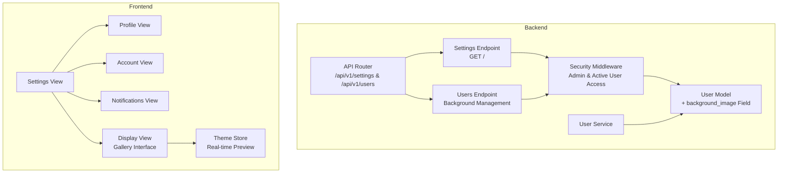
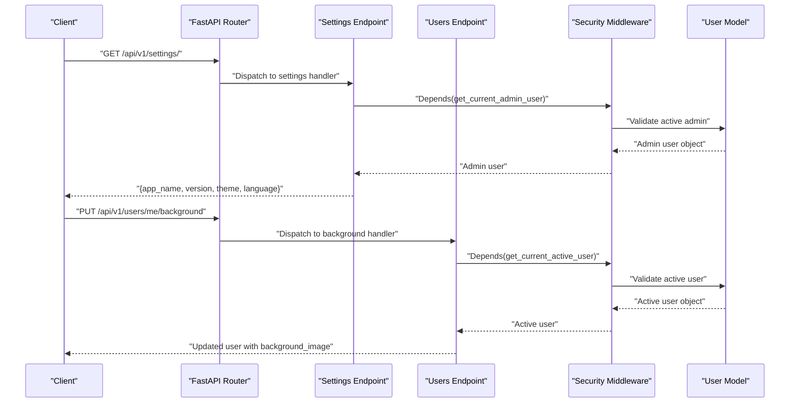
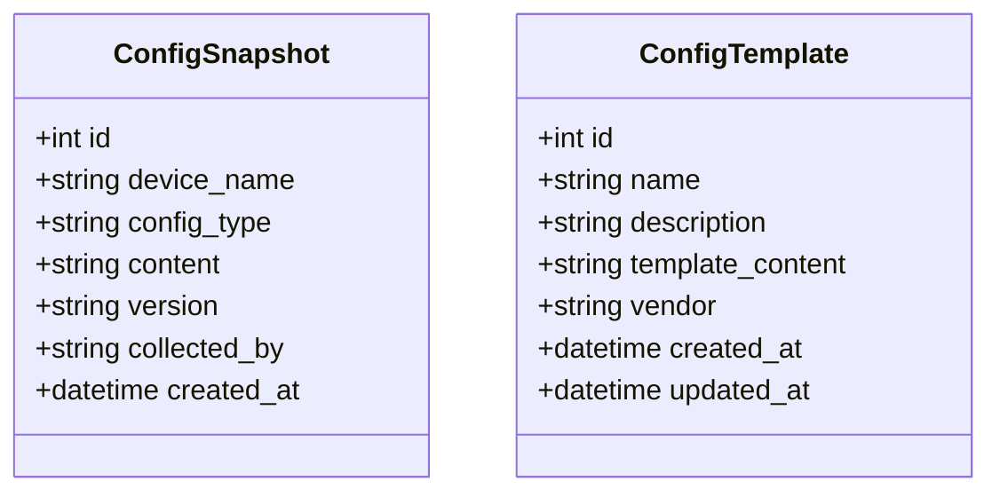
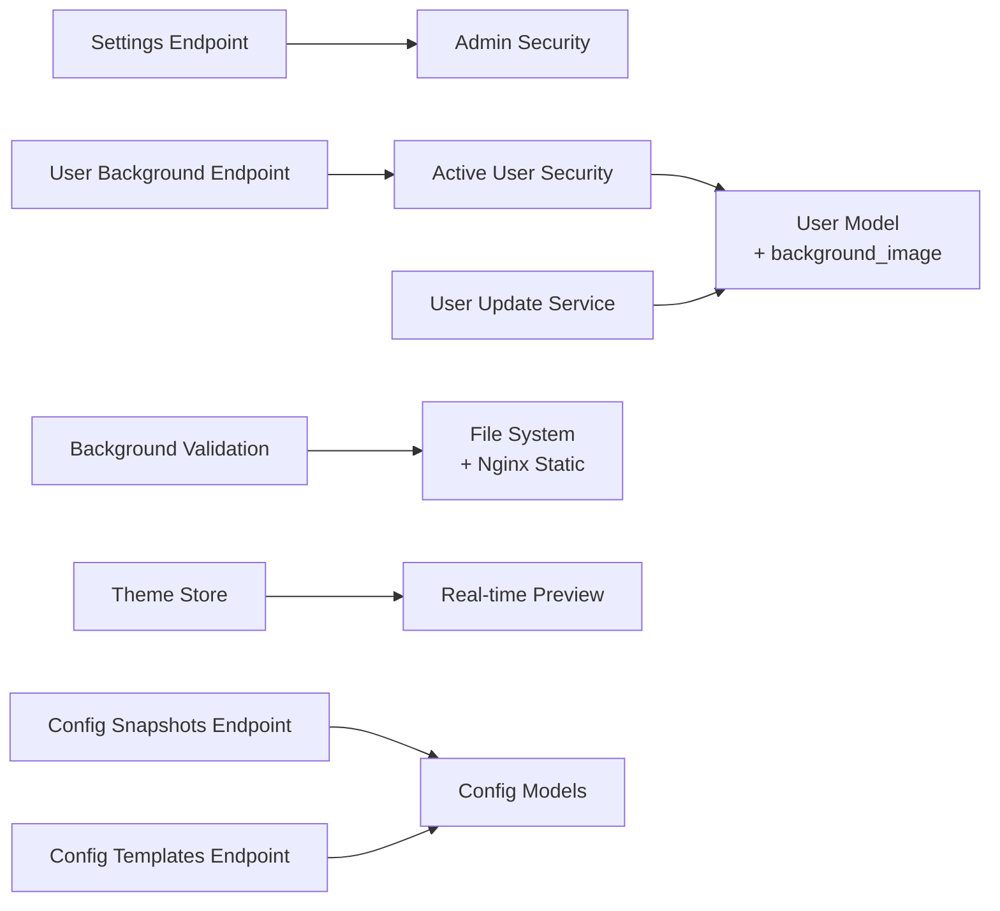

# Settings Endpoints

<cite>
**Referenced Files in This Document**
- [settings.py](file://backend/app/api/v1/endpoints/settings.py)
- [router.py](file://backend/app/api/v1/router.py)
- [security.py](file://backend/app/core/security.py)
- [config.py](file://backend/app/core/config.py)
- [user.py](file://backend/app/models/user.py)
- [user_service.py](file://backend/app/services/user_service.py)
- [user_schemas.py](file://backend/app/schemas/user.py)
- [auth_service.py](file://backend/app/services/auth_service.py)
- [Settings.vue](file://frontend/src/views/settings/Settings.vue)
- [Profile.vue](file://frontend/src/views/settings/Profile.vue)
- [Account.vue](file://frontend/src/views/settings/Account.vue)
- [Display.vue](file://frontend/src/views/settings/Display.vue)
- [Notifications.vue](file://frontend/src/views/settings/Notifications.vue)
- [users.py](file://backend/app/api/v1/endpoints/users.py)
- [theme.js](file://frontend/src/stores/theme.js)
- [configuration_plugin.py](file://backend/app/plugins/configuration/plugin.py)
- [configuration_endpoints.py](file://backend/app/plugins/configuration/endpoints.py)
- [configuration_models.py](file://backend/app/plugins/configuration/models.py)
- [configuration_schemas.py](file://backend/app/plugins/configuration/schemas.py)
</cite>

## Update Summary
**Changes Made**
- Added comprehensive documentation for the new Display settings page with gallery interface
- Documented background selection functionality with real-time preview
- Updated user preference management section with background image handling
- Added new API endpoints for background management
- Enhanced security considerations for background image updates

## Table of Contents
1. [Introduction](#introduction)
2. [Project Structure](#project-structure)
3. [Core Components](#core-components)
4. [Architecture Overview](#architecture-overview)
5. [Detailed Component Analysis](#detailed-component-analysis)
6. [Dependency Analysis](#dependency-analysis)
7. [Performance Considerations](#performance-considerations)
8. [Troubleshooting Guide](#troubleshooting-guide)
9. [Conclusion](#conclusion)
10. [Appendices](#appendices)

## Introduction
This document provides comprehensive API documentation for the settings endpoints under /api/v1/settings/ and /api/v1/users/. It covers HTTP methods, URL patterns, request/response schemas, user preference management, validation rules, defaults, and inheritance patterns. The documentation now includes the new Display settings page with comprehensive background selection experience featuring a gallery interface and real-time preview functionality.

## Project Structure
The settings functionality is exposed via FastAPI routers and integrates with user models, services, and security middleware. The frontend provides dedicated views for profile, account, notifications, and display settings with advanced background selection capabilities.

**Diagram sources**
- [router.py:1-10](file://backend/app/api/v1/router.py#L1-L10)
- [settings.py:1-18](file://backend/app/api/v1/endpoints/settings.py#L1-L18)
- [users.py:39-72](file://backend/app/api/v1/endpoints/users.py#L39-L72)
- [security.py:90-99](file://backend/app/core/security.py#L90-L99)
- [user.py:17](file://backend/app/models/user.py#L17)
- [user_service.py:46-58](file://backend/app/services/user_service.py#L46-L58)
- [Display.vue:1-183](file://frontend/src/views/settings/Display.vue#L1-L183)
- [theme.js:29-59](file://frontend/src/stores/theme.js#L29-L59)

**Section sources**
- [router.py:1-10](file://backend/app/api/v1/router.py#L1-L10)
- [settings.py:1-18](file://backend/app/api/v1/endpoints/settings.py#L1-L18)
- [users.py:39-72](file://backend/app/api/v1/endpoints/users.py#L39-L72)
- [Settings.vue:1-46](file://frontend/src/views/settings/Settings.vue#L1-L46)

## Core Components
- Settings endpoint: GET /api/v1/settings/ returns application-wide settings such as app_name, version, theme, and language. Authentication requires an active admin user.
- User model and service: Provide user data structures and update mechanisms used by profile/account settings, including the new background_image field.
- Background management: Dedicated endpoints for background selection with gallery interface and real-time preview functionality.
- Security: Enforces admin-only access for settings retrieval and active user access for personal settings.
- Frontend views: Present profile, account, notifications, and display settings pages with comprehensive background selection capabilities.

Key implementation references:
- Settings endpoint definition and response shape: [settings.py:8-17](file://backend/app/api/v1/endpoints/settings.py#L8-L17)
- Admin access dependency: [security.py:90-99](file://backend/app/core/security.py#L90-L99)
- User model fields including background_image: [user.py:17](file://backend/app/models/user.py#L17)
- User update service: [user_service.py:46-58](file://backend/app/services/user_service.py#L46-L58)
- Background management endpoints: [users.py:39-72](file://backend/app/api/v1/endpoints/users.py#L39-L72)
- Frontend settings navigation: [Settings.vue:8-13](file://frontend/src/views/settings/Settings.vue#L8-L13)
- Display view with gallery interface: [Display.vue:15-70](file://frontend/src/views/settings/Display.vue#L15-L70)
- Real-time preview functionality: [theme.js:29-59](file://frontend/src/stores/theme.js#L29-L59)

**Section sources**
- [settings.py:8-17](file://backend/app/api/v1/endpoints/settings.py#L8-L17)
- [security.py:90-99](file://backend/app/core/security.py#L90-L99)
- [user.py:17](file://backend/app/models/user.py#L17)
- [user_service.py:46-58](file://backend/app/services/user_service.py#L46-L58)
- [users.py:39-72](file://backend/app/api/v1/endpoints/users.py#L39-L72)
- [Settings.vue:8-13](file://frontend/src/views/settings/Settings.vue#L8-L13)
- [Display.vue:15-70](file://frontend/src/views/settings/Display.vue#L15-L70)
- [theme.js:29-59](file://frontend/src/stores/theme.js#L29-L59)

## Architecture Overview
The settings endpoint is mounted under /api/v1/settings and protected by admin-only access. It returns static application settings. User-specific preferences (profile, account, display, notifications) are handled by the frontend and user service updates. The new display settings feature includes a comprehensive background selection system with gallery interface and real-time preview functionality.

**Diagram sources**
- [router.py:9](file://backend/app/api/v1/router.py#L9)
- [settings.py:8-17](file://backend/app/api/v1/endpoints/settings.py#L8-L17)
- [users.py:39-47](file://backend/app/api/v1/endpoints/users.py#L39-L47)
- [security.py:90-99](file://backend/app/core/security.py#L90-L99)

## Detailed Component Analysis

### Settings Endpoint: GET /api/v1/settings/
- Method: GET
- URL: /api/v1/settings/
- Authentication: Active admin user required
- Response schema:
  - app_name: string
  - version: string
  - theme: string
  - language: string
- Validation and defaults:
  - No request body; returns hardcoded values for demonstration.
- Inheritance patterns:
  - Not applicable for this endpoint; returns global application settings.

Usage example:
- Request: GET /api/v1/settings/ with Authorization: Bearer <admin-access-token>
- Response: { "app_name": "...", "version": "...", "theme": "...", "language": "..." }

**Section sources**
- [settings.py:8-17](file://backend/app/api/v1/endpoints/settings.py#L8-L17)
- [security.py:90-99](file://backend/app/core/security.py#L90-L99)

### User Preference Management (Profile, Account, Display, Notifications)
While the backend settings endpoint returns global settings, user preference management is primarily handled by:

#### Background Selection System
The new display settings feature provides comprehensive background selection with gallery interface and real-time preview:

**Background Management Endpoints:**
- PUT /api/v1/users/me/background: Update current user's background image
- GET /api/v1/users/me/backgrounds-list: Get available background images

**Background Selection Features:**
- Gallery interface with responsive grid layout (2-4 columns based on screen size)
- Real-time preview functionality with immediate visual feedback
- Support for multiple image formats (.jpg, .jpeg, .png, .webp, .gif, .avif)
- Local storage synchronization for persistent preferences
- Dynamic background application to dashboard interface

**Implementation References:**
- Background update endpoint: [users.py:39-47](file://backend/app/api/v1/endpoints/users.py#L39-L47)
- Background list endpoint: [users.py:50-71](file://backend/app/api/v1/endpoints/users.py#L50-L71)
- User model background field: [user.py:17](file://backend/app/models/user.py#L17)
- Frontend gallery interface: [Display.vue:15-70](file://frontend/src/views/settings/Display.vue#L15-L70)
- Real-time preview functionality: [theme.js:29-59](file://frontend/src/stores/theme.js#L29-L59)

**Validation and Defaults:**
- Background images are validated against allowed file extensions
- Background_image field is optional (null clears background)
- Default behavior: No background image applied if field is null
- File serving through nginx static directory (/backgrounds/)

**Inheritance Patterns:**
- Background preferences are stored per-user in database
- Theme preferences are inherited from system settings when set to 'system'

**Section sources**
- [users.py:39-47](file://backend/app/api/v1/endpoints/users.py#L39-L47)
- [users.py:50-71](file://backend/app/api/v1/endpoints/users.py#L50-L71)
- [user.py:17](file://backend/app/models/user.py#L17)
- [Display.vue:15-70](file://frontend/src/views/settings/Display.vue#L15-L70)
- [theme.js:29-59](file://frontend/src/stores/theme.js#L29-L59)

### Settings Synchronization
To synchronize settings across clients:
- Periodically fetch application settings via GET /api/v1/settings/.
- Store theme and language preferences client-side and apply immediately.
- For user-specific preferences, maintain local state and persist changes through user update operations.
- Background preferences are synchronized through local storage and real-time preview updates.

References:
- Settings endpoint: [settings.py:8-17](file://backend/app/api/v1/endpoints/settings.py#L8-L17)
- User update service: [user_service.py:46-58](file://backend/app/services/user_service.py#L46-L58)
- Background synchronization: [Display.vue:26-31](file://frontend/src/views/settings/Display.vue#L26-L31)

**Section sources**
- [settings.py:8-17](file://backend/app/api/v1/endpoints/settings.py#L8-L17)
- [user_service.py:46-58](file://backend/app/services/user_service.py#L46-L58)
- [Display.vue:26-31](file://frontend/src/views/settings/Display.vue#L26-L31)

### Configuration Backup and Restore (Plugin-based)
The configuration plugin provides snapshot and template management, enabling backup and restore of configuration data.

Endpoints:
- List snapshots: GET /api/v1/configuration/snapshots
- Create snapshot: POST /api/v1/configuration/snapshots
- Get snapshot by ID: GET /api/v1/configuration/snapshots/{snapshot_id}
- List templates: GET /api/v1/configuration/templates
- Create template: POST /api/v1/configuration/templates
- Get template by ID: GET /api/v1/configuration/templates/{template_id}

Data models:
- ConfigSnapshot: device_name, config_type, content, version, collected_by, created_at
- ConfigTemplate: name, description, template_content, vendor, created_at, updated_at

Schemas:
- ConfigSnapshotCreate/Response
- ConfigTemplateCreate/Response

References:
- Plugin registration: [configuration_plugin.py:9-16](file://backend/app/plugins/configuration/plugin.py#L9-L16)
- Endpoints: [configuration_endpoints.py:17-43](file://backend/app/plugins/configuration/endpoints.py#L17-L43)
- Models: [configuration_models.py:6-27](file://backend/app/plugins/configuration/models.py#L6-L27)
- Schemas: [configuration_schemas.py:6-42](file://backend/app/plugins/configuration/schemas.py#L6-L42)

**Diagram sources**
- [configuration_models.py:6-27](file://backend/app/plugins/configuration/models.py#L6-L27)

**Section sources**
- [configuration_plugin.py:9-16](file://backend/app/plugins/configuration/plugin.py#L9-L16)
- [configuration_endpoints.py:17-43](file://backend/app/plugins/configuration/endpoints.py#L17-L43)
- [configuration_models.py:6-27](file://backend/app/plugins/configuration/models.py#L6-L27)
- [configuration_schemas.py:6-42](file://backend/app/plugins/configuration/schemas.py#L6-L42)

## Dependency Analysis
- Settings endpoint depends on admin access middleware and returns static application settings.
- User preference updates depend on the user model and service for validation and persistence.
- Background management depends on file system validation and nginx static serving.
- Configuration plugin endpoints depend on database models and schemas for snapshot/template operations.

**Diagram sources**
- [settings.py:8-17](file://backend/app/api/v1/endpoints/settings.py#L8-L17)
- [users.py:39-72](file://backend/app/api/v1/endpoints/users.py#L39-L72)
- [security.py:90-99](file://backend/app/core/security.py#L90-L99)
- [user_service.py:46-58](file://backend/app/services/user_service.py#L46-L58)
- [Display.vue:15-24](file://frontend/src/views/settings/Display.vue#L15-L24)
- [theme.js:29-59](file://frontend/src/stores/theme.js#L29-L59)
- [configuration_endpoints.py:17-43](file://backend/app/plugins/configuration/endpoints.py#L17-L43)
- [configuration_models.py:6-27](file://backend/app/plugins/configuration/models.py#L6-L27)

**Section sources**
- [settings.py:8-17](file://backend/app/api/v1/endpoints/settings.py#L8-L17)
- [users.py:39-72](file://backend/app/api/v1/endpoints/users.py#L39-L72)
- [security.py:90-99](file://backend/app/core/security.py#L90-L99)
- [user_service.py:46-58](file://backend/app/services/user_service.py#L46-L58)
- [Display.vue:15-24](file://frontend/src/views/settings/Display.vue#L15-L24)
- [theme.js:29-59](file://frontend/src/stores/theme.js#L29-L59)
- [configuration_endpoints.py:17-43](file://backend/app/plugins/configuration/endpoints.py#L17-L43)
- [configuration_models.py:6-27](file://backend/app/plugins/configuration/models.py#L6-L27)

## Performance Considerations
- Settings endpoint returns static values and has minimal computational overhead.
- User update operations should batch changes to reduce database round-trips.
- Background image validation should avoid scanning large directories unnecessarily.
- Configuration snapshot creation should avoid storing excessively large content; consider compression or external storage.
- Real-time preview functionality should debounce frequent background changes to prevent excessive API calls.

## Troubleshooting Guide
Common issues and resolutions:
- 401 Unauthorized: Ensure a valid access token is provided with the request.
- 403 Forbidden: Verify the user has admin role for settings endpoint or is authenticated for user endpoints.
- 404 Not Found: Confirm the endpoint path matches /api/v1/settings/ or /api/v1/users/.
- Background validation errors: Ensure background files have allowed extensions (.jpg, .jpeg, .png, .webp, .gif, .avif).
- File serving issues: Verify nginx static directory contains background files in /usr/share/nginx/html/backgrounds/.

References:
- Admin access enforcement: [security.py:90-99](file://backend/app/core/security.py#L90-L99)
- User update hashing: [user_service.py:47-48](file://backend/app/services/user_service.py#L47-L48)
- Background validation: [users.py:55-69](file://backend/app/api/v1/endpoints/users.py#L55-L69)

**Section sources**
- [security.py:90-99](file://backend/app/core/security.py#L90-L99)
- [user_service.py:47-48](file://backend/app/services/user_service.py#L47-L48)
- [users.py:55-69](file://backend/app/api/v1/endpoints/users.py#L55-L69)

## Conclusion
The settings endpoints provide a foundation for application-wide settings and integrate with user management and configuration plugins. Administrators can retrieve global settings, while user preferences are managed via user updates and client-side UI. The new display settings feature enhances user experience with comprehensive background selection capabilities, including gallery interface and real-time preview functionality. The configuration plugin enables robust backup and restore capabilities for configuration data.

## Appendices

### API Definitions

- GET /api/v1/settings/
  - Authentication: Admin access token
  - Response: { app_name: string, version: string, theme: string, language: string }

- PUT /api/v1/users/me/background
  - Authentication: Active user access token
  - Request body: { background_image: string|null }
  - Response: Updated user object with background_image field

- GET /api/v1/users/me/backgrounds-list
  - Authentication: Active user access token
  - Response: { backgrounds: string[] }

- PUT /api/v1/users/{user_id}
  - Authentication: Admin access token
  - Request body: Partial user fields (email, full_name, role, is_active, password, avatar_url, background_image)
  - Response: Updated user object

- POST /api/v1/configuration/snapshots
  - Authentication: Admin access token
  - Request body: { device_name, config_type, content, version?, collected_by? }
  - Response: Snapshot object

- GET /api/v1/configuration/snapshots
  - Authentication: Admin access token
  - Query params: skip, limit
  - Response: Array of snapshots

- GET /api/v1/configuration/snapshots/{snapshot_id}
  - Authentication: Admin access token
  - Response: Snapshot object

- POST /api/v1/configuration/templates
  - Authentication: Admin access token
  - Request body: { name, description?, template_content, vendor? }
  - Response: Template object

- GET /api/v1/configuration/templates
  - Authentication: Admin access token
  - Query params: skip, limit
  - Response: Array of templates

- GET /api/v1/configuration/templates/{template_id}
  - Authentication: Admin access token
  - Response: Template object

### Practical Usage Examples

- Retrieve application settings:
  - Request: GET /api/v1/settings/ with Authorization: Bearer <admin-access-token>
  - Response: { app_name, version, theme, language }

- Update user background:
  - Request: PUT /api/v1/users/me/background with JSON { background_image: "bg1.avif" }
  - Response: Updated user object with background_image field

- Clear user background:
  - Request: PUT /api/v1/users/me/background with JSON { background_image: null }
  - Response: Updated user object with background_image cleared

- Get available backgrounds:
  - Request: GET /api/v1/users/me/backgrounds-list with Authorization: Bearer <user-access-token>
  - Response: { backgrounds: ["bg1.avif", "bg2.avif", "bg3.avif"] }

- Update user profile:
  - Request: PUT /api/v1/users/{user_id} with JSON { email, full_name }
  - Response: Updated user object

- Create configuration snapshot:
  - Request: POST /api/v1/configuration/snapshots with JSON { device_name, config_type, content }
  - Response: Snapshot object

- List configuration templates:
  - Request: GET /api/v1/configuration/templates?skip=0&limit=100 with Authorization: Bearer <admin-access-token>
  - Response: Array of templates

### Security, Audit Logging, and Backup/Restore

- Security:
  - Admin-only access enforced for settings and configuration endpoints.
  - Active user access required for personal settings and background management.
  - Token lifecycle managed by authentication service; supports refresh and revocation.
  - Background file validation prevents malicious file uploads.

- Audit logging:
  - Track configuration snapshot creation and template updates for compliance and change tracking.
  - Monitor background image changes for user preference tracking.

- Backup/restore:
  - Use configuration snapshots to capture current configurations.
  - Apply templates to standardize configurations across environments.

References:
- Admin enforcement: [security.py:90-99](file://backend/app/core/security.py#L90-L99)
- Token pair creation and rotation: [auth_service.py:19-42](file://backend/app/services/auth_service.py#L19-L42)
- Background validation: [users.py:55-69](file://backend/app/api/v1/endpoints/users.py#L55-L69)
- Snapshot endpoints: [configuration_endpoints.py:27-37](file://backend/app/plugins/configuration/endpoints.py#L27-L37)
- Template endpoints: [configuration_endpoints.py:39-43](file://backend/app/plugins/configuration/endpoints.py#L39-L43)

**Section sources**
- [security.py:90-99](file://backend/app/core/security.py#L90-L99)
- [auth_service.py:19-42](file://backend/app/services/auth_service.py#L19-L42)
- [users.py:55-69](file://backend/app/api/v1/endpoints/users.py#L55-L69)
- [configuration_endpoints.py:27-37](file://backend/app/plugins/configuration/endpoints.py#L27-L37)
- [configuration_endpoints.py:39-43](file://backend/app/plugins/configuration/endpoints.py#L39-L43)