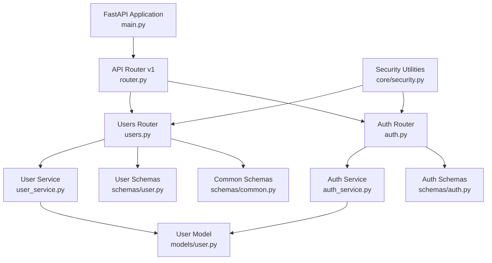
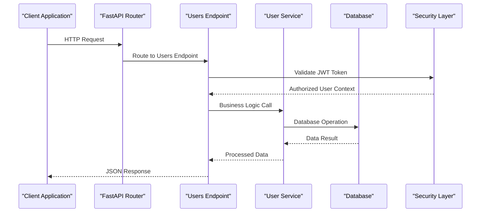
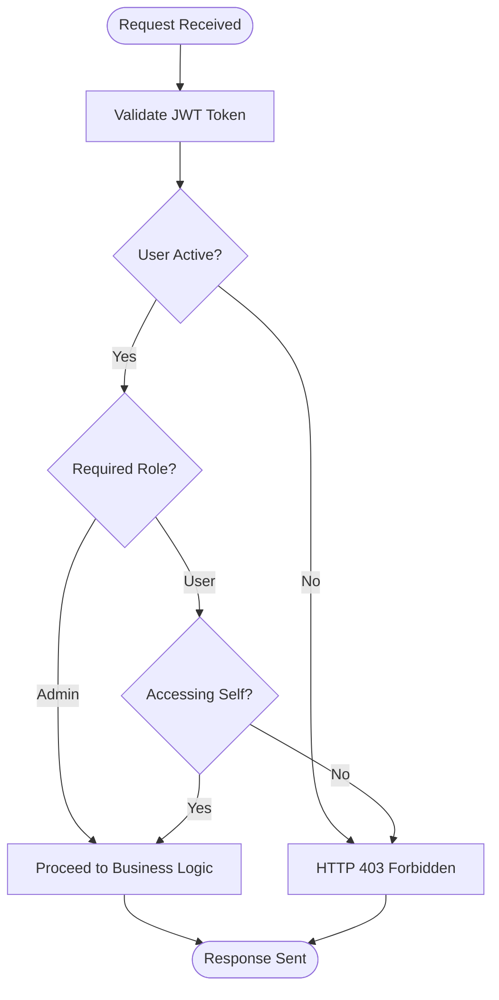
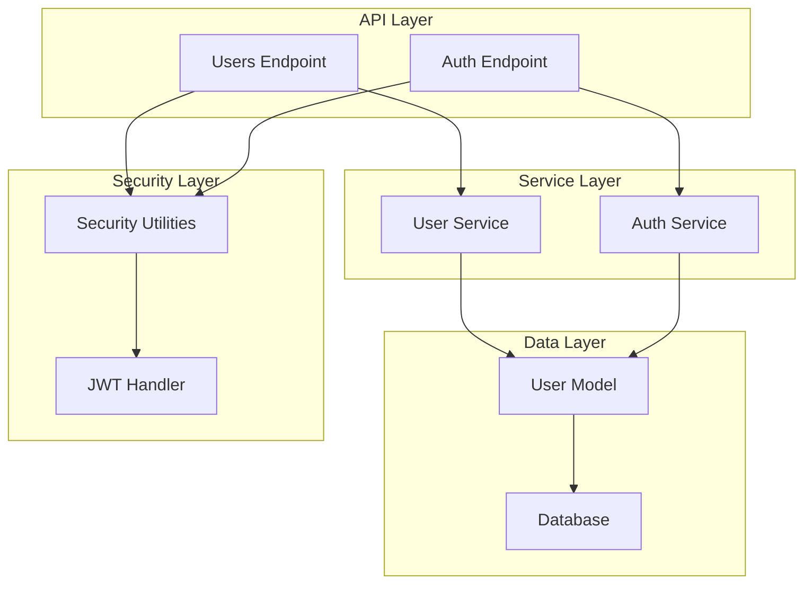

# User Management Endpoints

<cite>
**Referenced Files in This Document**
- [users.py](file://backend/app/api/v1/endpoints/users.py)
- [router.py](file://backend/app/api/v1/router.py)
- [user.py](file://backend/app/models/user.py)
- [user.py](file://backend/app/schemas/user.py)
- [common.py](file://backend/app/schemas/common.py)
- [security.py](file://backend/app/core/security.py)
- [main.py](file://backend/app/main.py)
- [auth.py](file://backend/app/api/v1/endpoints/auth.py)
</cite>

## Table of Contents
1. [Introduction](#introduction)
2. [Project Structure](#project-structure)
3. [Core Components](#core-components)
4. [Architecture Overview](#architecture-overview)
5. [Detailed Component Analysis](#detailed-component-analysis)
6. [Dependency Analysis](#dependency-analysis)
7. [Performance Considerations](#performance-considerations)
8. [Troubleshooting Guide](#troubleshooting-guide)
9. [Conclusion](#conclusion)

## Introduction
This document provides comprehensive API documentation for user management endpoints within the NOC Vision platform. It covers HTTP methods, URL patterns, request/response schemas, authorization requirements, role-based access control, and practical usage examples for user CRUD operations, bulk operations, and user search/filtering. The documentation focuses on the `/api/v1/users/` endpoint group and related authentication endpoints that support user lifecycle management.

## Project Structure
The user management functionality is organized under the FastAPI application with modular routing and schema-driven validation. The key components include:
- Endpoint definitions for user operations
- Pydantic models for request/response schemas
- SQLAlchemy models for persistence
- Security utilities for authentication and authorization
- Router configuration for API versioning



**Diagram sources**
- [main.py:66-67](file://backend/app/main.py#L66-L67)
- [router.py:6-9](file://backend/app/api/v1/router.py#L6-L9)
- [users.py:12](file://backend/app/api/v1/endpoints/users.py#L12)
- [auth.py:17](file://backend/app/api/v1/endpoints/auth.py#L17)

**Section sources**
- [main.py:66-67](file://backend/app/main.py#L66-L67)
- [router.py:6-9](file://backend/app/api/v1/router.py#L6-L9)

## Core Components
This section outlines the essential building blocks for user management operations:

### Authentication and Authorization
- OAuth2 Bearer token scheme with JWT tokens
- Role-based access control with admin privileges
- Password hashing using bcrypt
- Token validation and expiration handling

### Data Models
- User entity with unique constraints on username and email
- Role enumeration with admin and user values
- Active/inactive user status management
- Timestamp tracking for created/updated records

### Request/Response Schemas
- User creation with username, email, password, full name, and role
- User updates with selective field updates
- User response with comprehensive profile information
- Status responses for deletion operations

**Section sources**
- [security.py:13](file://backend/app/core/security.py#L13)
- [user.py:7-18](file://backend/app/models/user.py#L7-L18)
- [user.py:6-32](file://backend/app/schemas/user.py#L6-L32)

## Architecture Overview
The user management architecture follows a layered approach with clear separation of concerns:



**Diagram sources**
- [users.py:15-22](file://backend/app/api/v1/endpoints/users.py#L15-L22)
- [security.py:61-98](file://backend/app/core/security.py#L61-L98)
- [user_service.py:8-9](file://backend/app/services/user_service.py#L8-L9)

The architecture enforces:
- Centralized authentication through OAuth2 Bearer tokens
- Role-based authorization for sensitive operations
- Schema validation at the endpoint level
- Database abstraction through SQLAlchemy ORM

## Detailed Component Analysis

### Endpoint Definitions and URL Patterns
The user management endpoints follow RESTful conventions with the base path `/api/v1/users`:

#### GET /api/v1/users/
- **Purpose**: Retrieve paginated list of users
- **Method**: GET
- **Response**: Array of UserResponse objects
- **Parameters**: 
  - `skip`: Integer offset for pagination (default: 0)
  - `limit`: Integer maximum results (default: 100)
- **Authorization**: Requires admin role

#### GET /api/v1/users/{user_id}
- **Purpose**: Retrieve specific user by ID
- **Method**: GET
- **Path Parameter**: `user_id` (integer)
- **Response**: UserResponse object
- **Authorization**: 
  - Admin users: Full access to any user
  - Regular users: Can only access their own profile

#### POST /api/v1/users/
- **Purpose**: Create new user account
- **Method**: POST
- **Request Body**: UserCreate schema
- **Response**: UserResponse object
- **Authorization**: Requires admin role

#### PUT /api/v1/users/{user_id}
- **Purpose**: Update existing user
- **Method**: PUT
- **Path Parameter**: `user_id` (integer)
- **Request Body**: UserUpdate schema (partial updates)
- **Response**: UserResponse object
- **Authorization**: Requires admin role

#### DELETE /api/v1/users/{user_id}
- **Purpose**: Remove user account
- **Method**: DELETE
- **Path Parameter**: `user_id` (integer)
- **Response**: StatusResponse object
- **Authorization**: Requires admin role
- **Restriction**: Cannot delete own account

**Section sources**
- [users.py:15-22](file://backend/app/api/v1/endpoints/users.py#L15-L22)
- [users.py:25-37](file://backend/app/api/v1/endpoints/users.py#L25-L37)
- [users.py:40-57](file://backend/app/api/v1/endpoints/users.py#L40-L57)
- [users.py:60-70](file://backend/app/api/v1/endpoints/users.py#L60-L70)
- [users.py:73-85](file://backend/app/api/v1/endpoints/users.py#L73-L85)

### Request/Response Schemas

#### UserCreate Schema
Fields for user registration and creation:
- `username`: String (required)
- `email`: String (required)
- `password`: String (required)
- `full_name`: String (optional)
- `role`: String (default: "user")

Validation rules:
- Username must be unique
- Email must be unique
- Password must meet security requirements
- Role must be either "admin" or "user"

#### UserUpdate Schema
Fields for partial user updates:
- `email`: String (optional)
- `full_name`: String (optional)
- `role`: String (optional)
- `is_active`: Boolean (optional)
- `password`: String (optional)

Behavior:
- Only provided fields are updated
- Password updates trigger re-hashing
- Role changes require admin privileges

#### UserResponse Schema
Complete user profile representation:
- `id`: Integer (auto-generated)
- `username`: String
- `email`: String
- `full_name`: String (nullable)
- `role`: String ("admin" or "user")
- `is_active`: Boolean
- `created_at`: DateTime (nullable)
- `updated_at`: DateTime (nullable)

#### StatusResponse Schema
Standard response for deletion operations:
- `status`: String ("ok")
- `message`: String (optional)

**Section sources**
- [user.py:6-11](file://backend/app/schemas/user.py#L6-L11)
- [user.py:14-19](file://backend/app/schemas/user.py#L14-L19)
- [user.py:22-32](file://backend/app/schemas/user.py#L22-L32)
- [common.py:5-7](file://backend/app/schemas/common.py#L5-L7)

### Authorization Requirements and Role-Based Access Control

#### Authentication Flow
All user management endpoints require valid JWT authentication:
- Token type: Bearer
- Token source: OAuth2 password flow
- Token validation: JWT decoding with secret key
- Expiration handling: Automatic validation

#### Role-Based Access Control Matrix
| Endpoint | Required Role | Additional Restrictions |
|----------|---------------|------------------------|
| GET /users | Any authenticated user | Non-admins restricted to self-view |
| GET /users/{id} | Any authenticated user | Self-access only for non-admins |
| POST /users | Admin | N/A |
| PUT /users/{id} | Admin | N/A |
| DELETE /users/{id} | Admin | Cannot delete self |

#### Permission Validation Logic


**Diagram sources**
- [security.py:82-98](file://backend/app/core/security.py#L82-L98)
- [users.py:34-36](file://backend/app/api/v1/endpoints/users.py#L34-L36)

**Section sources**
- [security.py:82-98](file://backend/app/core/security.py#L82-L98)
- [users.py:34-36](file://backend/app/api/v1/endpoints/users.py#L34-L36)

### Data Validation and Security Considerations

#### Password Management
- Password hashing: bcrypt with salt generation
- Password verification: bcrypt.checkpw comparison
- Password updates: Automatic re-hashing on change
- Storage: Only hashed passwords stored

#### Input Validation
- Email format validation using EmailStr
- Unique constraint enforcement (username, email)
- Role validation against allowed values
- Type validation through Pydantic models

#### Security Measures
- JWT token expiration (configurable)
- Token revocation on logout
- SQL injection prevention through ORM
- CSRF protection via token-based auth

**Section sources**
- [security.py:16-28](file://backend/app/core/security.py#L16-L28)
- [user_service.py:46-58](file://backend/app/services/user_service.py#L46-L58)

### Practical Usage Examples

#### User Creation Example
```javascript
// POST /api/v1/users/
const createUser = {
  username: "john_doe",
  email: "john@example.com",
  password: "SecurePass123!",
  full_name: "John Doe",
  role: "user"
};
```

#### User Update Example
```javascript
// PUT /api/v1/users/123
const updateUser = {
  email: "newemail@example.com",
  full_name: "John Smith"
  // role and password fields omitted for partial update
};
```

#### Bulk Operations
While individual endpoints support bulk operations, the current implementation focuses on single-user operations. For bulk operations, consider:
- Batch processing in client applications
- Implementing dedicated bulk endpoints
- Using transactional operations for consistency

#### User Search and Filtering
Current implementation supports:
- Pagination via skip/limit parameters
- Individual user retrieval by ID
- No built-in filtering capabilities

Future enhancements could include:
- Query parameters for filtering by role, status
- Sorting options (created_at, username)
- Advanced search operators

**Section sources**
- [users.py:17-18](file://backend/app/api/v1/endpoints/users.py#L17-L18)
- [users.py:40-57](file://backend/app/api/v1/endpoints/users.py#L40-L57)

## Dependency Analysis



**Diagram sources**
- [users.py:10](file://backend/app/api/v1/endpoints/users.py#L10)
- [auth.py:15](file://backend/app/api/v1/endpoints/auth.py#L15)
- [user_service.py:4](file://backend/app/services/user_service.py#L4)
- [security.py:13](file://backend/app/core/security.py#L13)

Key dependencies:
- SQLAlchemy ORM for database operations
- Pydantic for request/response validation
- bcrypt for password hashing
- JWT library for token management
- FastAPI for routing and dependency injection

**Section sources**
- [users.py:1-10](file://backend/app/api/v1/endpoints/users.py#L1-L10)
- [user_service.py:1-5](file://backend/app/services/user_service.py#L1-L5)

## Performance Considerations
- Pagination limits: Default limit of 100 users prevents excessive memory usage
- Database indexing: Username and email fields are indexed for efficient lookups
- Lazy loading: Relationship loading follows SQLAlchemy best practices
- Token caching: JWT validation results could benefit from caching layer
- Connection pooling: SQLAlchemy session management handles connection reuse

## Troubleshooting Guide

### Common Error Scenarios
- **401 Unauthorized**: Invalid or missing JWT token
- **403 Forbidden**: Insufficient permissions or inactive user
- **404 Not Found**: User does not exist
- **400 Bad Request**: Duplicate username/email, self-deletion attempt

### Authentication Issues
- Verify token format: Must be Bearer token
- Check token expiration: Tokens have configurable expiry
- Validate user status: Only active users can access endpoints
- Confirm role assignment: Admin privileges required for user management

### Data Validation Errors
- Username uniqueness: Ensure username is not already taken
- Email uniqueness: Verify email address availability
- Password requirements: Meet security criteria
- Role validation: Only "admin" or "user" roles allowed

**Section sources**
- [users.py:32-36](file://backend/app/api/v1/endpoints/users.py#L32-L36)
- [users.py:46-49](file://backend/app/api/v1/endpoints/users.py#L46-L49)
- [users.py:79-80](file://backend/app/api/v1/endpoints/users.py#L79-L80)

## Conclusion
The user management endpoints provide a robust foundation for user lifecycle operations within the NOC Vision platform. The implementation emphasizes security through JWT authentication, role-based access control, and comprehensive data validation. While the current implementation focuses on individual user operations, the architecture supports future enhancements for bulk operations, advanced filtering, and improved search capabilities. The modular design ensures maintainability and extensibility for evolving user management requirements.