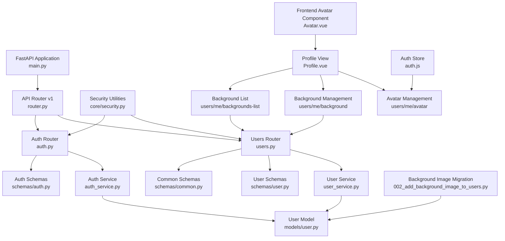
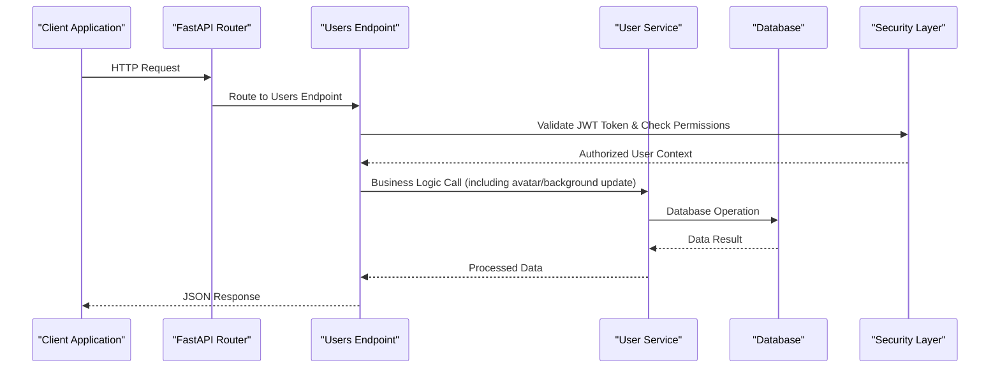
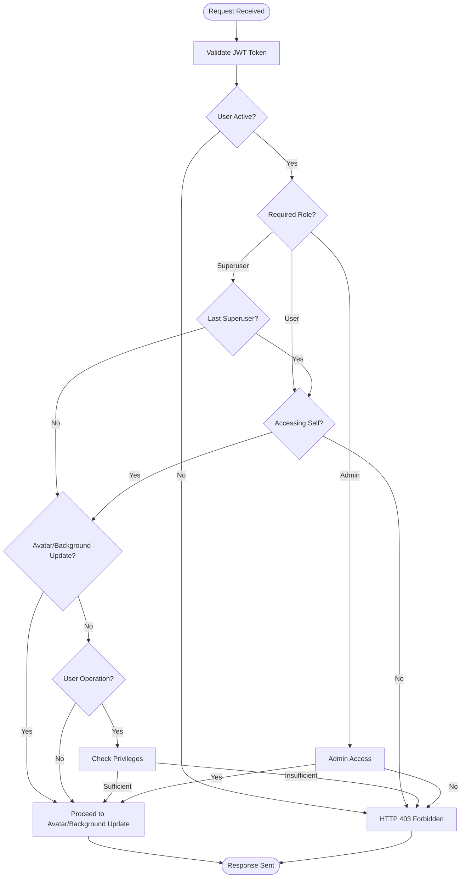
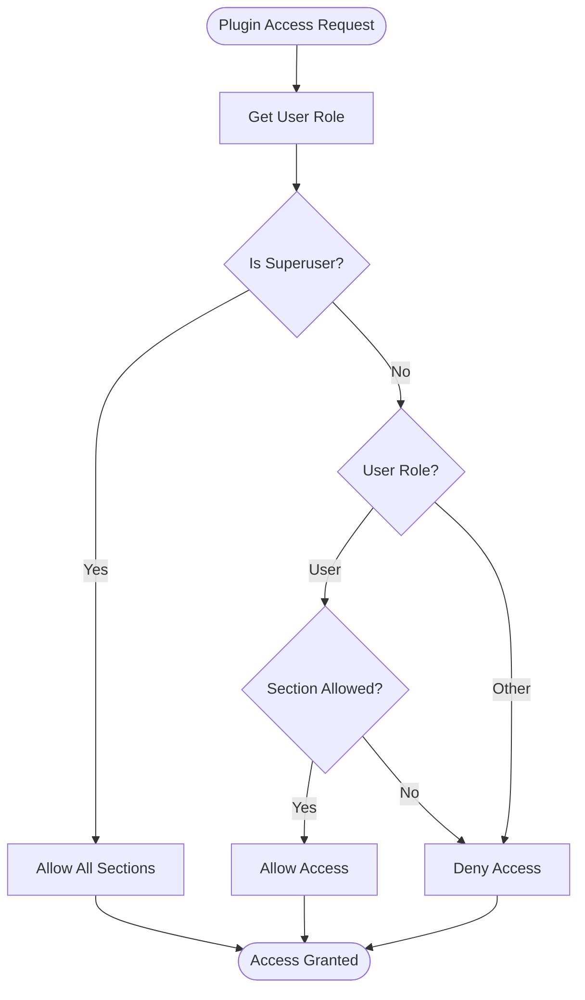
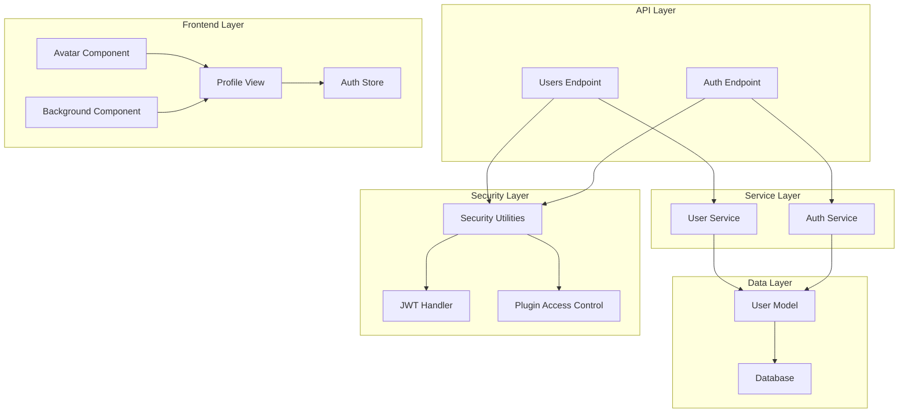

# User Management Endpoints

<cite>
**Referenced Files in This Document**
- [users.py](file://backend/app/api/v1/endpoints/users.py)
- [router.py](file://backend/app/api/v1/router.py)
- [user.py](file://backend/app/models/user.py)
- [user.py](file://backend/app/schemas/user.py)
- [common.py](file://backend/app/schemas/common.py)
- [security.py](file://backend/app/core/security.py)
- [main.py](file://backend/app/main.py)
- [auth.py](file://backend/app/api/v1/endpoints/auth.py)
- [user_service.py](file://backend/app/services/user_service.py)
- [002_add_background_image_to_users.py](file://backend/alembic/versions/002_add_background_image_to_users.py)
- [Avatar.vue](file://frontend/src/components/ui/Avatar.vue)
- [Profile.vue](file://frontend/src/views/settings/Profile.vue)
- [auth.js](file://frontend/src/stores/auth.js)
</cite>

## Update Summary
**Changes Made**
- Added new user background management endpoints: PUT /api/v1/users/me/background and GET /api/v1/users/me/backgrounds-list
- Enhanced UserResponse schema with background_image field
- Updated UserUpdate schema with background_image field
- Added background_image field to User model with database migration support
- Integrated background image retrieval from both nginx static directory and local development paths
- Enhanced user profile management with background customization options

## Table of Contents
1. [Introduction](#introduction)
2. [Project Structure](#project-structure)
3. [Core Components](#core-components)
4. [Architecture Overview](#architecture-overview)
5. [Detailed Component Analysis](#detailed-component-analysis)
6. [Dependency Analysis](#dependency-analysis)
7. [Performance Considerations](#performance-considerations)
8. [Troubleshooting Guide](#troubleshooting-guide)
9. [Conclusion](#conclusion)

## Introduction
This document provides comprehensive API documentation for user management endpoints within the NOC Vision platform. It covers HTTP methods, URL patterns, request/response schemas, authorization requirements, role-based access control, and practical usage examples for user CRUD operations, bulk operations, user search/filtering, avatar management, and background management functionality. The documentation focuses on the `/api/v1/users/` endpoint group and related authentication endpoints that support user lifecycle management, including new avatar management capabilities and background customization for enhanced user profile personalization.

## Project Structure
The user management functionality is organized under the FastAPI application with modular routing and schema-driven validation. The key components include:
- Endpoint definitions for user operations, permission management, avatar management, and background management
- Pydantic models for request/response schemas with avatar and background support
- SQLAlchemy models for persistence with avatar URL and background image storage
- Security utilities for authentication, authorization, and plugin access control
- Router configuration for API versioning
- Frontend integration for avatar selection, upload, and background customization
- Database migration support for background image field



**Diagram sources**
- [main.py:66-67](file://backend/app/main.py#L66-L67)
- [router.py:6-9](file://backend/app/api/v1/router.py#L6-L9)
- [users.py:12](file://backend/app/api/v1/endpoints/users.py#L12)
- [auth.py:17](file://backend/app/api/v1/endpoints/auth.py#L17)
- [Avatar.vue:1-58](file://frontend/src/components/ui/Avatar.vue#L1-L58)
- [Profile.vue:1-199](file://frontend/src/views/settings/Profile.vue#L1-L199)
- [auth.js:1-198](file://frontend/src/stores/auth.js#L1-L198)
- [002_add_background_image_to_users.py:21-22](file://backend/alembic/versions/002_add_background_image_to_users.py#L21-L22)

**Section sources**
- [main.py:66-67](file://backend/app/main.py#L66-L67)
- [router.py:6-9](file://backend/app/api/v1/router.py#L6-L9)

## Core Components
This section outlines the essential building blocks for user management operations:

### Authentication and Authorization
- OAuth2 Bearer token scheme with JWT tokens
- Enhanced role-based access control with superuser privileges
- Plugin access control for different sections (operations, analytics, security, admin)
- Password hashing using bcrypt
- Token validation and expiration handling

### Data Models
- User entity with unique constraints on username and email
- Role enumeration with superuser, admin, and user values
- Active/inactive user status management
- Timestamp tracking for created/updated records
- **Updated**: Avatar URL field with system avatar support (system:1, system:2, system:3)
- **Updated**: Background image field for user desktop customization

### Request/Response Schemas
- User creation with username, email, password, full name, role, optional avatar URL, and optional background image
- User updates with selective field updates including avatar URL and background image
- User response with comprehensive profile information including avatar URL and background image
- Status responses for deletion operations
- Permission response with role-based access information
- **Updated**: Avatar URL and background image fields in all schemas for profile customization

**Section sources**
- [security.py:13](file://backend/app/core/security.py#L13)
- [user.py:7-18](file://backend/app/models/user.py#L7-L18)
- [user.py:6-32](file://backend/app/schemas/user.py#L6-L32)

## Architecture Overview
The user management architecture follows a layered approach with clear separation of concerns and enhanced security controls:



**Diagram sources**
- [users.py:15-22](file://backend/app/api/v1/endpoints/users.py#L15-L22)
- [security.py:61-98](file://backend/app/core/security.py#L61-L98)
- [user_service.py:8-9](file://backend/app/services/user_service.py#L8-L9)

The architecture enforces:
- Centralized authentication through OAuth2 Bearer tokens
- Enhanced role-based authorization for sensitive operations
- Plugin access control for different system sections
- Schema validation at the endpoint level
- Database abstraction through SQLAlchemy ORM
- **Updated**: Avatar URL and background image validation and storage capabilities

## Detailed Component Analysis

### Endpoint Definitions and URL Patterns
The user management endpoints follow RESTful conventions with the base path `/api/v1/users` and include new permission endpoints, avatar management functionality, and background management endpoints:

#### PUT /api/v1/users/me/avatar
- **Purpose**: Update the current user's avatar
- **Method**: PUT
- **Request Body**: `{ avatar_url: string }`
- **Response**: UserResponse object with updated avatar URL
- **Authorization**: Requires valid JWT token (any authenticated user)
- **Validation**: Avatar URL must be a valid URL or system avatar format (system:1, system:2, system:3)
- **Response Fields**:
  - `avatar_url`: Updated avatar URL or system avatar identifier

#### PUT /api/v1/users/me/background
- **Purpose**: Update the current user's background image preference
- **Method**: PUT
- **Request Body**: `{ background_image: string }`
- **Response**: UserResponse object with updated background image
- **Authorization**: Requires valid JWT token (any authenticated user)
- **Validation**: Background image must be a valid filename from the available backgrounds list
- **Response Fields**:
  - `background_image`: Updated background image filename

#### GET /api/v1/users/me/backgrounds-list
- **Purpose**: Retrieve list of available background images
- **Method**: GET
- **Response**: Backgrounds list with available image filenames
- **Authorization**: Requires valid JWT token (any authenticated user)
- **Response Fields**:
  - `backgrounds`: Array of available background image filenames
- **Implementation Details**:
  - Searches in `/usr/share/nginx/html/backgrounds` (production nginx static directory)
  - Falls back to `frontend/public/backgrounds` (development directory)
  - Supports file extensions: jpg, jpeg, png, webp, gif, avif

#### GET /api/v1/users/me/permissions
- **Purpose**: Retrieve current user's permission information
- **Method**: GET
- **Response**: Permission object with role, superuser flag, and accessible sections
- **Authorization**: Requires valid JWT token (any authenticated user)
- **Response Fields**:
  - `role`: Current user's role (superuser, admin, user)
  - `can_access_admin`: Boolean indicating admin access
  - `sections`: Array of accessible plugin sections

#### GET /api/v1/users/plugins/access/{section}
- **Purpose**: Check access to specific plugin section
- **Method**: GET
- **Path Parameter**: `section` (string)
- **Response**: Access decision with section name and permission status
- **Authorization**: Requires valid JWT token (any authenticated user)
- **Response Fields**:
  - `section`: Requested section name
  - `has_access`: Boolean indicating access permission
  - `role`: Current user's role

#### GET /api/v1/users/
- **Purpose**: Retrieve paginated list of users
- **Method**: GET
- **Response**: Array of UserResponse objects
- **Parameters**: 
  - `skip`: Integer offset for pagination (default: 0)
  - `limit`: Integer maximum results (default: 100)
- **Authorization**: Requires superuser role

#### GET /api/v1/users/{user_id}
- **Purpose**: Retrieve specific user by ID
- **Method**: GET
- **Path Parameter**: `user_id` (integer)
- **Response**: UserResponse object
- **Authorization**: 
  - Superuser: Full access to any user
  - Regular users: Can only access their own profile

#### POST /api/v1/users/
- **Purpose**: Create new user account
- **Method**: POST
- **Request Body**: UserCreate schema
- **Response**: UserResponse object
- **Authorization**: Requires superuser role
- **Restrictions**: Cannot create superuser accounts

#### PUT /api/v1/users/{user_id}
- **Purpose**: Update existing user
- **Method**: PUT
- **Path Parameter**: `user_id` (integer)
- **Request Body**: UserUpdate schema (partial updates)
- **Response**: UserResponse object
- **Authorization**: Requires superuser role
- **Restrictions**: Cannot assign superuser role without superuser privileges

#### DELETE /api/v1/users/{user_id}
- **Purpose**: Remove user account
- **Method**: DELETE
- **Path Parameter**: `user_id` (integer)
- **Response**: StatusResponse object
- **Authorization**: Requires superuser role
- **Restrictions**: Cannot delete own account, cannot delete last superuser

**Section sources**
- [users.py:27-35](file://backend/app/api/v1/endpoints/users.py#L27-L35)
- [users.py:38-49](file://backend/app/api/v1/endpoints/users.py#L38-L49)
- [users.py:49-72](file://backend/app/api/v1/endpoints/users.py#L49-L72)
- [users.py:15-22](file://backend/app/api/v1/endpoints/users.py#L15-L22)
- [users.py:74-86](file://backend/app/api/v1/endpoints/users.py#L74-L86)
- [users.py:88-97](file://backend/app/api/v1/endpoints/users.py#L88-L97)
- [users.py:99-113](file://backend/app/api/v1/endpoints/users.py#L99-L113)
- [users.py:115-140](file://backend/app/api/v1/endpoints/users.py#L115-L140)
- [users.py:141-164](file://backend/app/api/v1/endpoints/users.py#L141-L164)
- [users.py:166-187](file://backend/app/api/v1/endpoints/users.py#L166-L187)

### Request/Response Schemas

#### UserCreate Schema
Fields for user registration and creation:
- `username`: String (required)
- `email`: String (required)
- `password`: String (required)
- `full_name`: String (optional)
- `role`: String (default: "user")
- `avatar_url`: String (optional)
- `background_image`: String (optional)

Validation rules:
- Username must be unique
- Email must be unique
- Password must meet security requirements
- Role must be either "superuser", "admin", or "user"
- Superusers can only be created by other superusers
- **Updated**: Avatar URL validation for custom URLs or system avatar formats
- **Updated**: Background image validation for valid filenames

#### UserUpdate Schema
Fields for partial user updates:
- `email`: String (optional)
- `full_name`: String (optional)
- `role`: String (optional)
- `is_active`: Boolean (optional)
- `password`: String (optional)
- `avatar_url`: String (optional)
- `background_image`: String (optional)

Behavior:
- Only provided fields are updated
- Password updates trigger re-hashing
- Role changes require superuser privileges
- Cannot assign superuser role without superuser privileges
- **Updated**: Avatar URL updates for profile customization
- **Updated**: Background image updates for desktop customization

#### UserResponse Schema
Complete user profile representation:
- `id`: Integer (auto-generated)
- `username`: String
- `email`: String
- `full_name`: String (nullable)
- `role`: String ("superuser", "admin", or "user")
- `avatar_url`: String (nullable)
- `background_image`: String (nullable)
- `is_active`: Boolean
- `created_at`: DateTime (nullable)
- `updated_at`: DateTime (nullable)

#### StatusResponse Schema
Standard response for deletion operations:
- `status`: String ("ok")
- `message`: String (optional)

#### PermissionResponse Schema
Permission information for current user:
- `role`: String (current user's role)
- `can_access_admin`: Boolean (indicates admin access capability)
- `sections`: Array of strings (accessible plugin sections)

#### BackgroundsListResponse Schema
Available background images list:
- `backgrounds`: Array of strings (available background image filenames)

**Section sources**
- [user.py:6-11](file://backend/app/schemas/user.py#L6-L11)
- [user.py:14-19](file://backend/app/schemas/user.py#L14-L19)
- [user.py:22-32](file://backend/app/schemas/user.py#L22-L32)
- [common.py:5-7](file://backend/app/schemas/common.py#L5-L7)

### Background Management Functionality

#### Background Image Management
The system provides comprehensive background image management for user desktop customization:

##### Background Image Storage
- Database field: `background_image` (String, max 255 characters)
- Nullable field allowing empty/null values for default backgrounds
- Stored as filename strings (e.g., "bg1.jpg", "nature.png")

##### Background Image Retrieval
The system searches for available background images in the following order:
1. **Production Environment**: `/usr/share/nginx/html/backgrounds` (nginx static directory)
2. **Development Environment**: `frontend/public/backgrounds` (local development directory)
3. **Fallback**: Returns empty array if neither directory exists

Supported file formats:
- JPEG/JPG
- PNG
- WebP
- GIF
- AVIF

##### Background Image Validation
- Background images must be valid filenames from the available backgrounds list
- Empty/null values indicate default background behavior
- Filename length limited to 255 characters

#### Frontend Integration
The frontend provides comprehensive background management:
- Dynamic background image loading from static asset directories
- Background selection interface with thumbnail previews
- Real-time background preview before saving
- Responsive background management component

**Section sources**
- [user.py:15-16](file://backend/app/models/user.py#L15-L16)
- [user.py:29-32](file://backend/app/models/user.py#L29-L32)
- [user.py:19-20](file://backend/app/schemas/user.py#L19-L20)
- [user.py:28-29](file://backend/app/schemas/user.py#L28-L29)
- [users.py:49-72](file://backend/app/api/v1/endpoints/users.py#L49-L72)
- [002_add_background_image_to_users.py:21-22](file://backend/alembic/versions/002_add_background_image_to_users.py#L21-L22)

### Avatar Management Functionality

#### Avatar URL Formats
The system supports two types of avatar URLs:
- **Custom URLs**: Full URL to external image (e.g., "https://example.com/avatar.jpg")
- **System Avatars**: Predefined system avatars with format "system:n" where n is 1, 2, or 3

#### Avatar Validation Rules
- Custom URLs must be valid HTTP/HTTPS URLs
- System avatars must match format "system:1", "system:2", or "system:3"
- Avatar URLs are optional during user creation/update
- Empty avatar_url indicates default initials avatar

#### Frontend Integration
The frontend provides comprehensive avatar management:
- System avatar selection with predefined SVG images
- Custom image upload with preview functionality
- Real-time avatar preview before saving
- Responsive avatar component with fallback initials

**Section sources**
- [user.py:15-16](file://backend/app/models/user.py#L15-L16)
- [user.py:29-32](file://backend/app/models/user.py#L29-L32)
- [user.py:19-20](file://backend/app/schemas/user.py#L19-L20)
- [user.py:28-29](file://backend/app/schemas/user.py#L28-L29)
- [Profile.vue:18-23](file://frontend/src/views/settings/Profile.vue#L18-L23)
- [Profile.vue:46-57](file://frontend/src/views/settings/Profile.vue#L46-L57)

### Authorization Requirements and Role-Based Access Control

#### Authentication Flow
All user management endpoints require valid JWT authentication:
- Token type: Bearer
- Token source: OAuth2 password flow
- Token validation: JWT decoding with secret key
- Expiration handling: Automatic validation

#### Enhanced Role-Based Access Control Matrix
| Endpoint | Required Role | Additional Restrictions |
|----------|---------------|------------------------|
| PUT /users/me/avatar | Any authenticated user | N/A |
| PUT /users/me/background | Any authenticated user | N/A |
| GET /users/me/backgrounds-list | Any authenticated user | N/A |
| GET /users/me/permissions | Any authenticated user | N/A |
| GET /users/plugins/access/{section} | Any authenticated user | N/A |
| GET /users | Superuser | N/A |
| GET /users/{id} | Superuser or self | Self-access only for non-superusers |
| POST /users | Superuser | Cannot create superuser |
| PUT /users/{id} | Superuser | Cannot assign superuser without superuser |
| DELETE /users/{id} | Superuser | Cannot delete self, cannot delete last superuser |

#### Enhanced Permission Validation Logic


**Diagram sources**
- [security.py:101-110](file://backend/app/core/security.py#L101-L110)
- [users.py:110-115](file://backend/app/api/v1/endpoints/users.py#L110-L115)

**Section sources**
- [security.py:101-110](file://backend/app/core/security.py#L101-L110)
- [users.py:110-115](file://backend/app/api/v1/endpoints/users.py#L110-L115)

### Plugin Access Control

#### Plugin Section Access Validation
The system provides granular access control for different plugin sections based on user roles:

| Role | Accessible Sections |
|------|-------------------|
| Superuser | operations, analytics, security, admin |
| User | operations, general |

#### Access Control Logic


**Diagram sources**
- [security.py:113-133](file://backend/app/core/security.py#L113-L133)

**Section sources**
- [security.py:113-133](file://backend/app/core/security.py#L113-L133)

### Data Validation and Security Considerations

#### Password Management
- Password hashing: bcrypt with salt generation
- Password verification: bcrypt.checkpw comparison
- Password updates: Automatic re-hashing on change
- Storage: Only hashed passwords stored

#### Enhanced Input Validation
- Email format validation using EmailStr
- Unique constraint enforcement (username, email)
- Role validation against allowed values ("superuser", "admin", "user")
- Type validation through Pydantic models
- Superuser privilege validation for role assignments
- **Updated**: Avatar URL validation for custom URLs and system avatar formats
- **Updated**: Background image validation for valid filenames and supported formats

#### Enhanced Security Measures
- JWT token expiration (configurable)
- Token revocation on logout
- SQL injection prevention through ORM
- CSRF protection via token-based auth
- Superuser-only access for critical operations
- Prevention of last superuser removal
- Plugin access control enforcement
- **Updated**: Avatar URL validation and sanitization
- **Updated**: Background image filename validation and path safety

**Section sources**
- [security.py:16-28](file://backend/app/core/security.py#L16-L28)
- [user_service.py:46-58](file://backend/app/services/user_service.py#L46-L58)

### Practical Usage Examples

#### Avatar Management Examples

##### Update User Avatar with Custom URL
```javascript
// PUT /api/v1/users/me/avatar
const updateAvatar = {
  avatar_url: "https://example.com/custom-avatar.jpg"
};
```

##### Update User Avatar with System Avatar
```javascript
// PUT /api/v1/users/me/avatar
const updateAvatar = {
  avatar_url: "system:2"
};
```

##### User Creation with Avatar
```javascript
// POST /api/v1/users/
const createUser = {
  username: "john_doe",
  email: "john@example.com",
  password: "SecurePass123!",
  full_name: "John Doe",
  role: "user",
  avatar_url: "system:1"
};
```

#### Background Management Examples

##### Update User Background
```javascript
// PUT /api/v1/users/me/background
const updateBackground = {
  background_image: "nature_001.jpg"
};
```

##### Get Available Backgrounds
```javascript
// GET /api/v1/users/me/backgrounds-list
{
  "backgrounds": ["nature_001.jpg", "abstract_002.png", "cityscape_003.webp"]
}
```

##### User Creation with Background
```javascript
// POST /api/v1/users/
const createUser = {
  username: "john_doe",
  email: "john@example.com",
  password: "SecurePass123!",
  full_name: "John Doe",
  role: "user",
  background_image: "default_bg.jpg"
};
```

#### Permission Check Example
```javascript
// GET /api/v1/users/me/permissions
{
  "role": "user",
  "can_access_admin": false,
  "sections": ["operations"]
}

// GET /api/v1/users/plugins/access/analytics
{
  "section": "analytics",
  "has_access": false,
  "role": "user"
}
```

#### User Update Example
```javascript
// PUT /api/v1/users/123
const updateUser = {
  email: "newemail@example.com",
  full_name: "John Smith",
  background_image: "modern_001.png"
  // avatar_url field omitted for partial update
};
```

#### Bulk Operations
While individual endpoints support bulk operations, the current implementation focuses on single-user operations. For bulk operations, consider:
- Batch processing in client applications
- Implementing dedicated bulk endpoints
- Using transactional operations for consistency

#### User Search and Filtering
Current implementation supports:
- Pagination via skip/limit parameters
- Individual user retrieval by ID
- No built-in filtering capabilities

Future enhancements could include:
- Query parameters for filtering by role, status, avatar type, background type
- Sorting options (created_at, username)
- Advanced search operators

**Section sources**
- [users.py:27-35](file://backend/app/api/v1/endpoints/users.py#L27-L35)
- [users.py:38-49](file://backend/app/api/v1/endpoints/users.py#L38-L49)
- [users.py:49-72](file://backend/app/api/v1/endpoints/users.py#L49-L72)
- [users.py:17-18](file://backend/app/api/v1/endpoints/users.py#L17-L18)
- [users.py:40-47](file://backend/app/api/v1/endpoints/users.py#L40-L47)
- [users.py:50-71](file://backend/app/api/v1/endpoints/users.py#L50-L71)
- [users.py:40-57](file://backend/app/api/v1/endpoints/users.py#L40-L57)

## Dependency Analysis



**Diagram sources**
- [users.py:10](file://backend/app/api/v1/endpoints/users.py#L10)
- [auth.py:15](file://backend/app/api/v1/endpoints/auth.py#L15)
- [user_service.py:4](file://backend/app/services/user_service.py#L4)
- [security.py:13](file://backend/app/core/security.py#L13)
- [Avatar.vue:1-58](file://frontend/src/components/ui/Avatar.vue#L1-L58)
- [Profile.vue:1-199](file://frontend/src/views/settings/Profile.vue#L1-L199)
- [auth.js:1-198](file://frontend/src/stores/auth.js#L1-L198)

Key dependencies:
- SQLAlchemy ORM for database operations
- Pydantic for request/response validation
- bcrypt for password hashing
- JWT library for token management
- FastAPI for routing and dependency injection
- Enhanced security utilities for role-based access control
- **Updated**: Frontend avatar component integration
- **Updated**: Background image management integration

**Section sources**
- [users.py:1-10](file://backend/app/api/v1/endpoints/users.py#L1-L10)
- [user_service.py:1-5](file://backend/app/services/user_service.py#L1-L5)

## Performance Considerations
- Pagination limits: Default limit of 100 users prevents excessive memory usage
- Database indexing: Username and email fields are indexed for efficient lookups
- Lazy loading: Relationship loading follows SQLAlchemy best practices
- Token caching: JWT validation results could benefit from caching layer
- Connection pooling: SQLAlchemy session management handles connection reuse
- Superuser count checks: Efficient database queries prevent orphan superuser scenarios
- **Updated**: Avatar URL storage optimization for minimal database overhead
- **Updated**: Background image filename storage optimization for minimal database overhead
- **Updated**: Background directory scanning optimized with early termination on first found directory

## Troubleshooting Guide

### Common Error Scenarios
- **401 Unauthorized**: Invalid or missing JWT token
- **403 Forbidden**: Insufficient permissions, inactive user, or superuser-only access
- **404 Not Found**: User does not exist
- **400 Bad Request**: Duplicate username/email, self-deletion attempt, last superuser removal, invalid avatar URL format, or invalid background image filename

### Authentication Issues
- Verify token format: Must be Bearer token
- Check token expiration: Tokens have configurable expiry
- Validate user status: Only active users can access endpoints
- Confirm role assignment: Superuser privileges required for user management

### Data Validation Errors
- Username uniqueness: Ensure username is not already taken
- Email uniqueness: Verify email address availability
- Password requirements: Meet security criteria
- Role validation: Only "superuser", "admin", or "user" roles allowed
- Superuser validation: Ensure proper privilege escalation
- **Updated**: Avatar URL validation: Ensure valid URL format or system avatar format
- **Updated**: Background image validation: Ensure filename exists in available backgrounds list

### Permission Issues
- Check user role: Verify current user has appropriate permissions
- Plugin access: Ensure requested section is accessible
- Superuser restrictions: Some operations are restricted to superusers only
- **Updated**: Avatar updates: Any authenticated user can update their own avatar
- **Updated**: Background updates: Any authenticated user can update their own background preferences

### Avatar Management Issues
- **Invalid Avatar URL**: Ensure URL is valid HTTP/HTTPS or follows system avatar format
- **System Avatar Error**: Use format "system:1", "system:2", or "system:3"
- **File Upload Issues**: Frontend handles local file uploads, server expects URL string
- **Avatar Preview**: System avatars use predefined SVG files, custom avatars use uploaded URLs

### Background Management Issues
- **Background Directory Missing**: Production environment may not have nginx static directory mounted
- **Invalid Background Filename**: Ensure filename exists in the backgrounds-list response
- **File Format Not Supported**: Only jpg, jpeg, png, webp, gif, avif formats supported
- **Background Preview Issues**: Check that background files are accessible from static directory
- **Development vs Production**: Backgrounds-list searches different paths in development vs production environments

**Section sources**
- [users.py:32-36](file://backend/app/api/v1/endpoints/users.py#L32-L36)
- [users.py:46-49](file://backend/app/api/v1/endpoints/users.py#L46-L49)
- [users.py:79-80](file://backend/app/api/v1/endpoints/users.py#L79-L80)
- [users.py:49-72](file://backend/app/api/v1/endpoints/users.py#L49-L72)

## Conclusion
The user management endpoints provide a robust foundation for user lifecycle operations within the NOC Vision platform. The implementation emphasizes security through JWT authentication, enhanced role-based access control with superuser privileges, and comprehensive data validation. The addition of new permission endpoints, plugin access control, avatar management functionality, and background management functionality provides comprehensive user profile customization capabilities. 

The new background management endpoints (PUT /api/v1/users/me/background and GET /api/v1/users/me/backgrounds-list) enable users to customize their desktop experience with personalized background images, while the existing avatar management endpoints (PUT /api/v1/users/me/avatar) continue to support profile picture customization. The system intelligently manages background images by searching for available files in both production nginx static directories and development directories, supporting multiple image formats (jpg, jpeg, png, webp, gif, avif).

The PUT /api/v1/users/me/background endpoint allows users to set their preferred background image by filename, while the GET /api/v1/users/me/backgrounds-list endpoint provides a dynamic list of available background images based on the current environment. The frontend integration provides intuitive background selection and preview functionality, complementing the existing avatar management capabilities.

The current implementation focuses on individual user operations with enhanced security measures, including prevention of last superuser removal, proper privilege escalation, avatar URL validation, background image filename validation, and comprehensive input sanitization. The modular design ensures maintainability and extensibility for evolving user management requirements, with clear separation between user management, authentication, permission control, avatar management, and background management functionality.