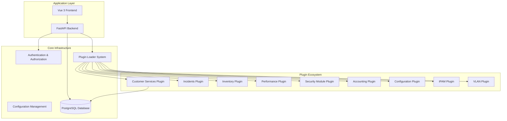
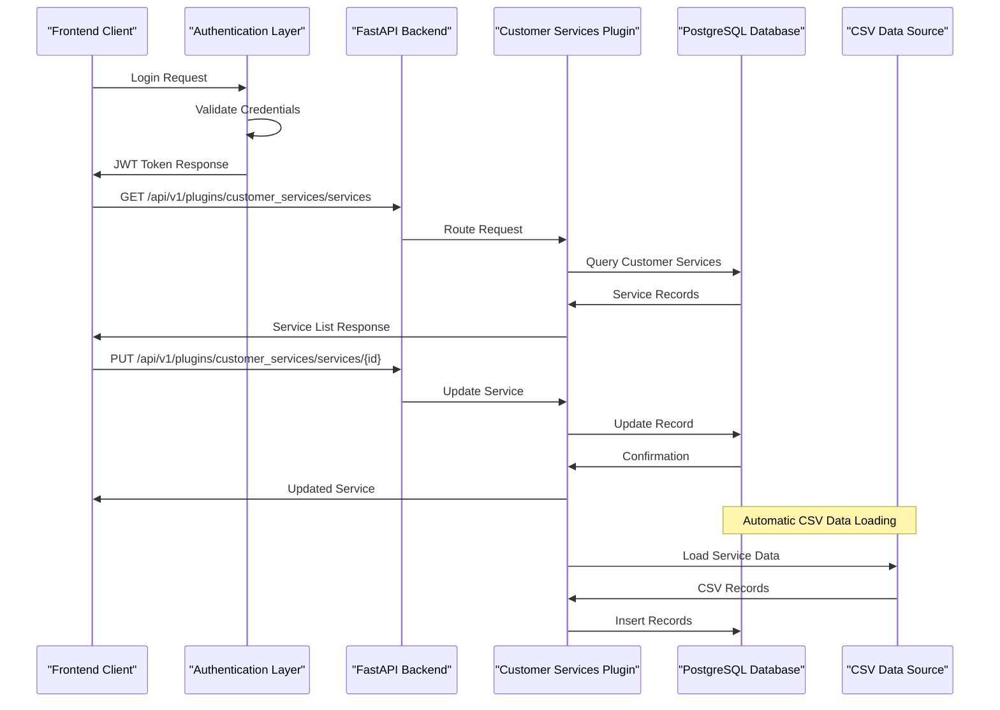
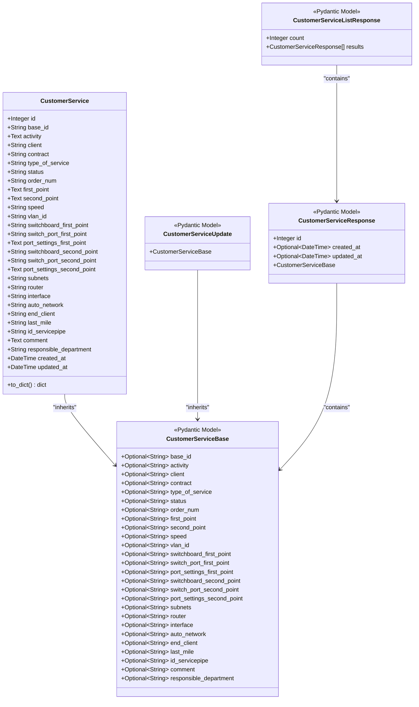
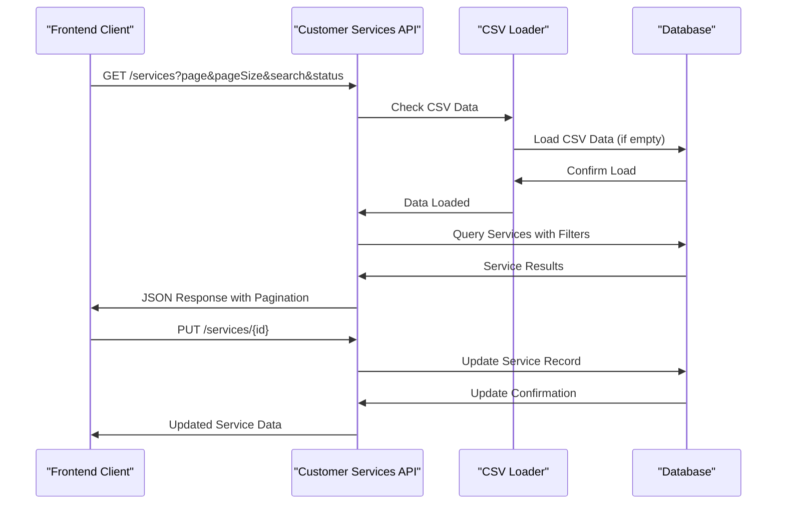
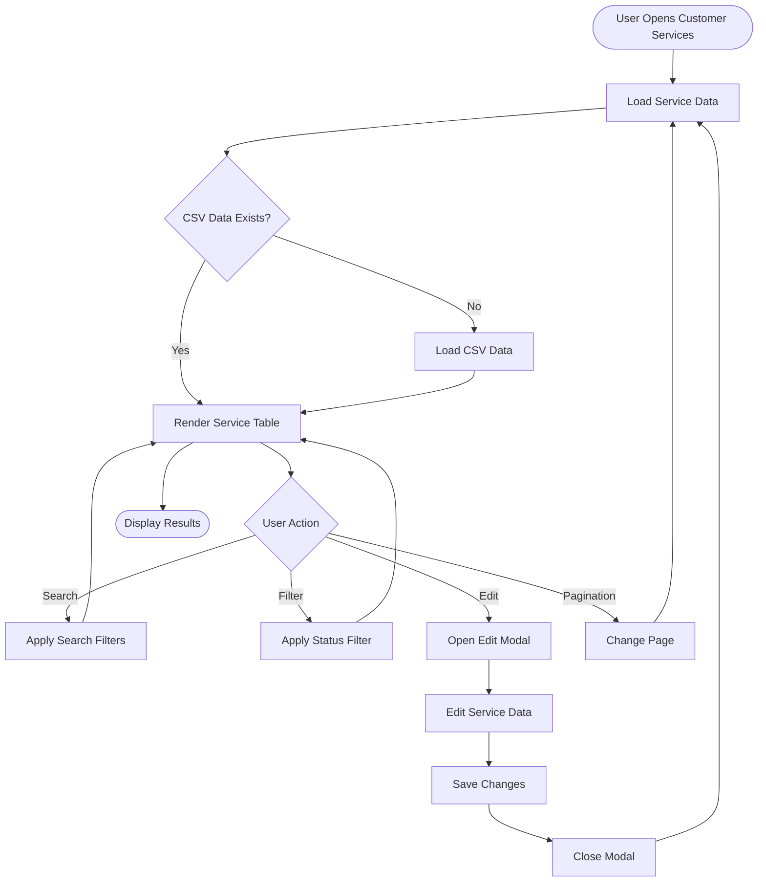
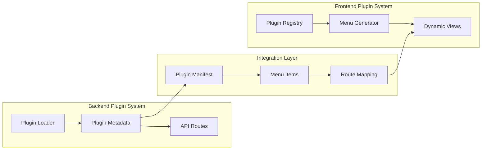
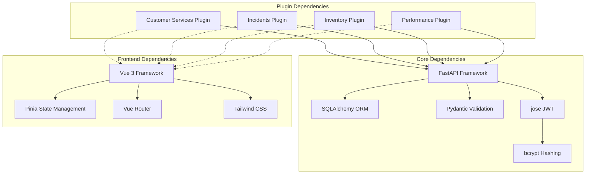

# Customer Services Enhancement

<cite>
**Referenced Files in This Document**
- [README.md](file://README.md)
- [main.py](file://backend/app/main.py)
- [config.py](file://backend/app/core/config.py)
- [plugin_loader.py](file://backend/app/core/plugin_loader.py)
- [database.py](file://backend/app/core/database.py)
- [security.py](file://backend/app/core/security.py)
- [router.py](file://backend/app/api/v1/router.py)
- [plugin.py](file://backend/app/plugins/customer_services/plugin.py)
- [endpoints.py](file://backend/app/plugins/customer_services/endpoints.py)
- [models.py](file://backend/app/plugins/customer_services/models.py)
- [schemas.py](file://backend/app/plugins/customer_services/schemas.py)
- [services.csv](file://backend/app/plugins/customer_services/data/services.csv)
- [CustomerServices.vue](file://frontend/src/plugins/customer_services/views/CustomerServices.vue)
- [main.js](file://frontend/src/main.js)
- [pluginRegistry.js](file://frontend/src/stores/pluginRegistry.js)
</cite>

## Table of Contents
1. [Introduction](#introduction)
2. [Project Structure](#project-structure)
3. [Core Components](#core-components)
4. [Architecture Overview](#architecture-overview)
5. [Detailed Component Analysis](#detailed-component-analysis)
6. [Dependency Analysis](#dependency-analysis)
7. [Performance Considerations](#performance-considerations)
8. [Troubleshooting Guide](#troubleshooting-guide)
9. [Conclusion](#conclusion)

## Introduction

The Customer Services Enhancement project is a comprehensive network operations center (NOC) platform designed to manage and monitor customer service databases for telecommunications infrastructure. This system provides a modern, plugin-based architecture built with FastAPI backend and Vue 3 frontend, offering robust customer service management capabilities with real-time data visualization and administrative controls.

The platform serves as a centralized hub for managing network customer services, providing features such as service database management, real-time monitoring, automated data synchronization from CSV sources, and comprehensive filtering capabilities. The system supports multiple service types including internet access, VPN connections, dedicated channels, and specialized network services with detailed configuration management.

## Project Structure

The NOC Vision platform follows a modular plugin-based architecture that enables extensible functionality while maintaining clean separation of concerns. The system is organized into distinct layers with clear boundaries between frontend, backend, and plugin components.

**Diagram sources**
- [main.py:17-48](file://backend/app/main.py#L17-L48)
- [plugin_loader.py:25-100](file://backend/app/core/plugin_loader.py#L25-L100)
- [config.py:5-51](file://backend/app/core/config.py#L5-L51)

The architecture emphasizes scalability and maintainability through its plugin-based design, allowing individual components to be developed, tested, and deployed independently while sharing common infrastructure and security mechanisms.

**Section sources**
- [README.md:1-31](file://README.md#L1-L31)
- [main.py:1-87](file://backend/app/main.py#L1-L87)
- [plugin_loader.py:1-100](file://backend/app/core/plugin_loader.py#L1-L100)

## Core Components

The Customer Services Enhancement system consists of several interconnected components that work together to provide comprehensive service management capabilities.

### Backend Core Components

The backend infrastructure provides the foundation for all customer service operations through robust APIs, database management, and security mechanisms.

**Database Management**: The system utilizes SQLAlchemy ORM with PostgreSQL for persistent storage, supporting automatic table creation and migration capabilities. The database schema includes comprehensive service definitions with support for various network service types and configurations.

**Authentication & Authorization**: JWT-based authentication system with refresh token support provides secure access control. The security layer includes role-based access control (RBAC) with user and admin privileges, ensuring appropriate data access and modification permissions.

**Plugin Architecture**: Dynamic plugin loading system enables modular functionality expansion. The plugin loader automatically discovers and registers available plugins, establishing API routes and context bindings for each component.

### Frontend Components

The Vue 3 frontend delivers a modern, responsive user interface with real-time data visualization and interactive service management capabilities.

**Component Library**: Built on shadcn/ui design system with comprehensive UI components including cards, forms, buttons, and navigation elements. The interface supports dark mode and responsive design for various device sizes.

**Real-time State Management**: Pinia-based state management system handles authentication state, plugin registry, and theme preferences with automatic persistence and synchronization.

**Dynamic Plugin Integration**: Frontend plugin registry automatically loads and displays available plugins in the navigation sidebar, providing seamless integration with backend plugin systems.

**Section sources**
- [database.py:1-18](file://backend/app/core/database.py#L1-L18)
- [security.py:1-134](file://backend/app/core/security.py#L1-L134)
- [plugin_loader.py:1-100](file://backend/app/core/plugin_loader.py#L1-L100)
- [CustomerServices.vue:1-424](file://frontend/src/plugins/customer_services/views/CustomerServices.vue#L1-L424)

## Architecture Overview

The Customer Services Enhancement follows a modern microservices architecture pattern with clear separation between presentation, business logic, and data layers. The system employs asynchronous processing, reactive programming, and real-time communication patterns.

**Diagram sources**
- [endpoints.py:69-168](file://backend/app/plugins/customer_services/endpoints.py#L69-L168)
- [CustomerServices.vue:77-142](file://frontend/src/plugins/customer_services/views/CustomerServices.vue#L77-L142)

The architecture ensures loose coupling between components while maintaining efficient data flow and processing capabilities. The system supports horizontal scaling through stateless API design and distributed database connectivity.

**Section sources**
- [router.py:1-10](file://backend/app/api/v1/router.py#L1-L10)
- [plugin.py:9-17](file://backend/app/plugins/customer_services/plugin.py#L9-L17)

## Detailed Component Analysis

### Customer Services Plugin Architecture

The customer services plugin represents the core functionality of the enhancement system, providing comprehensive service management capabilities through a well-structured API and data model.

**Diagram sources**
- [models.py:6-74](file://backend/app/plugins/customer_services/models.py#L6-L74)
- [schemas.py:6-54](file://backend/app/plugins/customer_services/schemas.py#L6-L54)

The data model supports comprehensive service tracking with detailed network configuration information, enabling precise service management and monitoring capabilities.

### API Endpoint Implementation

The customer services API provides RESTful endpoints for service management with comprehensive filtering, pagination, and data validation capabilities.

**Diagram sources**
- [endpoints.py:69-168](file://backend/app/plugins/customer_services/endpoints.py#L69-L168)

The API implementation includes sophisticated search capabilities across all service fields, status-based filtering, and comprehensive pagination support for handling large datasets efficiently.

### Frontend Service Management Interface

The Vue 3 frontend provides an intuitive interface for service management with real-time updates, advanced filtering, and comprehensive editing capabilities.

**Diagram sources**
- [CustomerServices.vue:77-163](file://frontend/src/plugins/customer_services/views/CustomerServices.vue#L77-L163)

The frontend interface supports advanced features including real-time data refresh, comprehensive search across all service fields, status-based filtering, and detailed service editing with validation.

**Section sources**
- [plugin.py:1-17](file://backend/app/plugins/customer_services/plugin.py#L1-L17)
- [endpoints.py:1-193](file://backend/app/plugins/customer_services/endpoints.py#L1-L193)
- [models.py:1-74](file://backend/app/plugins/customer_services/models.py#L1-L74)
- [schemas.py:1-54](file://backend/app/plugins/customer_services/schemas.py#L1-L54)
- [CustomerServices.vue:1-424](file://frontend/src/plugins/customer_services/views/CustomerServices.vue#L1-L424)

### Plugin Integration System

The plugin system enables seamless integration between frontend and backend components through dynamic registration and menu generation.

**Diagram sources**
- [plugin_loader.py:25-100](file://backend/app/core/plugin_loader.py#L25-L100)
- [main.js:20-52](file://frontend/src/main.js#L20-L52)

The integration system ensures consistent behavior across both frontend and backend components while maintaining flexibility for future enhancements and extensions.

**Section sources**
- [plugin_loader.py:1-100](file://backend/app/core/plugin_loader.py#L1-L100)
- [main.js:1-164](file://frontend/src/main.js#L1-L164)
- [pluginRegistry.js:1-53](file://frontend/src/stores/pluginRegistry.js#L1-L53)

## Dependency Analysis

The Customer Services Enhancement system exhibits well-managed dependencies with clear separation between core infrastructure and plugin-specific functionality. The dependency graph reveals a modular architecture that supports scalability and maintainability.

**Diagram sources**
- [main.py:1-14](file://backend/app/main.py#L1-L14)
- [config.py:1-51](file://backend/app/core/config.py#L1-L51)
- [security.py:1-134](file://backend/app/core/security.py#L1-L134)

The dependency analysis reveals minimal coupling between components, with clear interfaces for plugin communication and shared infrastructure utilization. This design facilitates independent development and testing of individual components while maintaining system coherence.

**Section sources**
- [config.py:1-51](file://backend/app/core/config.py#L1-L51)
- [security.py:1-134](file://backend/app/core/security.py#L1-L134)

## Performance Considerations

The Customer Services Enhancement system incorporates several performance optimization strategies to handle large-scale service data management efficiently.

### Database Optimization

The system implements efficient database queries with proper indexing strategies for frequently searched fields including service IDs, client names, and status values. Pagination support limits memory usage during data retrieval, while bulk operations minimize database round trips.

### Caching Strategies

Automatic CSV data loading prevents redundant database operations by caching service information locally. The system checks for existing data before performing CSV imports, reducing unnecessary processing overhead.

### Frontend Performance

The Vue 3 frontend utilizes reactive data binding and component lazy loading to optimize rendering performance. Virtual scrolling and pagination reduce DOM manipulation overhead for large datasets, while debounced search operations minimize API requests.

### API Response Optimization

JSON serialization includes only necessary fields through Pydantic models, reducing payload sizes. Response caching and efficient query construction minimize server processing time for common operations.

## Troubleshooting Guide

Common issues and their resolutions for the Customer Services Enhancement system:

### Authentication and Authorization Issues

**Problem**: Users unable to access customer services
**Solution**: Verify JWT token validity and user role permissions. Check authentication middleware configuration and ensure proper token issuance.

**Problem**: Permission denied errors
**Solution**: Review user role assignments and plugin access controls. Verify that users have appropriate permissions for service management operations.

### Database Connectivity Problems

**Problem**: Service data not loading
**Solution**: Check PostgreSQL connection settings and verify database availability. Ensure proper database credentials and network connectivity.

**Problem**: CSV data import failures
**Solution**: Verify CSV file existence and proper formatting. Check file permissions and encoding settings for UTF-8 compatibility.

### Frontend Integration Issues

**Problem**: Plugin not appearing in navigation
**Solution**: Verify plugin registration in main.js and ensure proper menu item configuration. Check plugin manifest validity and initialization status.

**Problem**: Service list not updating
**Solution**: Review API endpoint connectivity and response handling. Check for frontend state management issues and component reactivity problems.

**Section sources**
- [security.py:113-134](file://backend/app/core/security.py#L113-L134)
- [endpoints.py:24-67](file://backend/app/plugins/customer_services/endpoints.py#L24-L67)
- [main.js:19-52](file://frontend/src/main.js#L19-L52)

## Conclusion

The Customer Services Enhancement project represents a comprehensive solution for network service management, combining modern web technologies with robust backend infrastructure. The system's plugin-based architecture enables scalable functionality expansion while maintaining clean separation of concerns and efficient resource utilization.

Key achievements include comprehensive service data management capabilities, real-time monitoring and reporting features, automated data synchronization from external sources, and intuitive user interfaces for both technical and non-technical users. The modular design supports future enhancements and integration with additional network management systems.

The platform demonstrates best practices in modern web application development through its use of contemporary frameworks, reactive programming patterns, and cloud-native deployment strategies. The system provides a solid foundation for network operations center functionality while maintaining flexibility for customization and extension based on specific operational requirements.