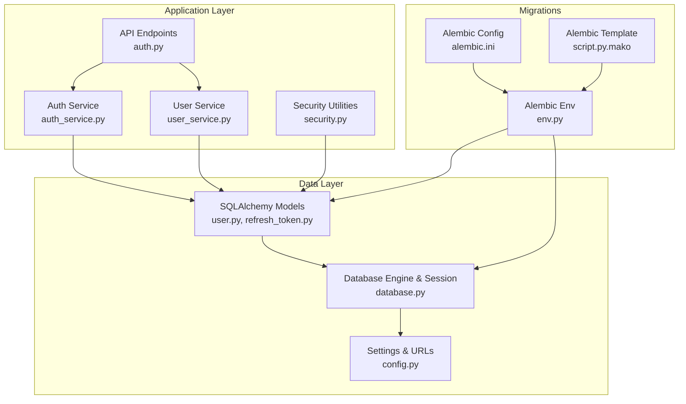
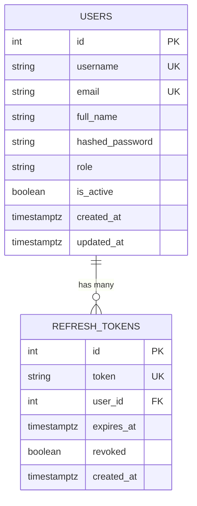
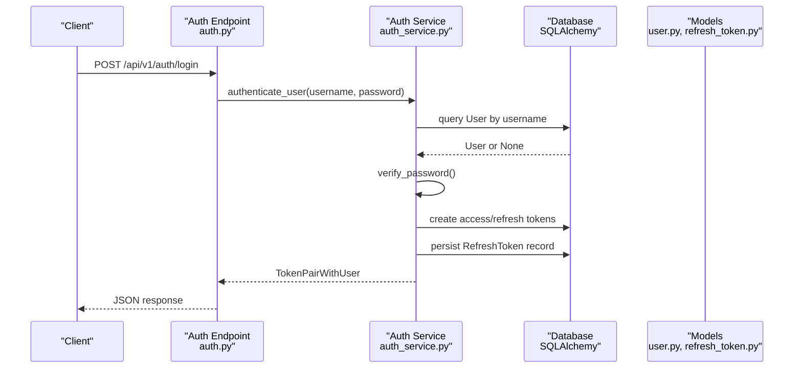
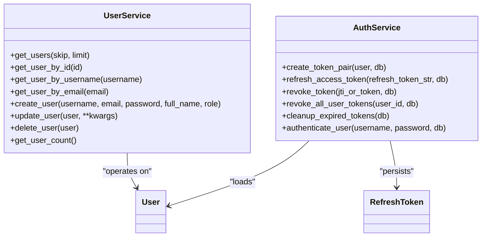
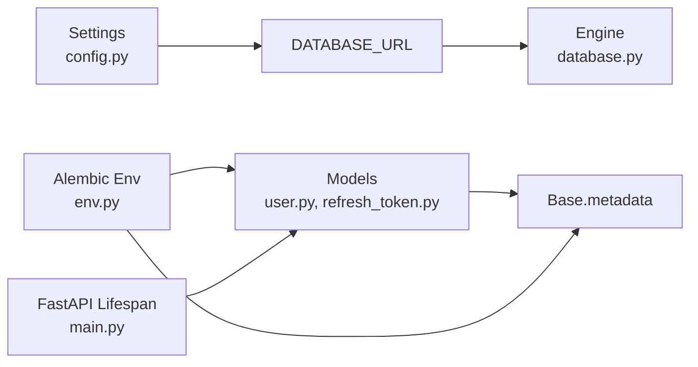
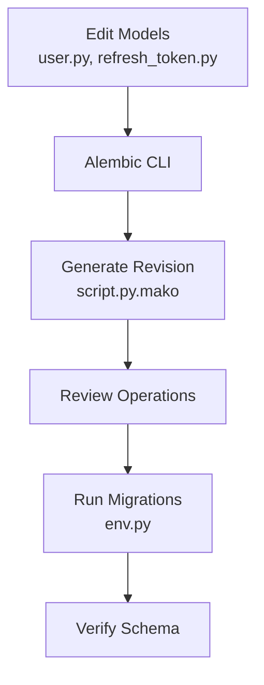

# Database Design

<cite>
**Referenced Files in This Document**
- [user.py](file://backend/app/models/user.py)
- [refresh_token.py](file://backend/app/models/refresh_token.py)
- [database.py](file://backend/app/core/database.py)
- [config.py](file://backend/app/core/config.py)
- [security.py](file://backend/app/core/security.py)
- [auth_service.py](file://backend/app/services/auth_service.py)
- [user_service.py](file://backend/app/services/user_service.py)
- [auth.py](file://backend/app/api/v1/endpoints/auth.py)
- [env.py](file://backend/alembic/env.py)
- [script.py.mako](file://backend/alembic/script.py.mako)
- [alembic.ini](file://backend/alembic.ini)
- [main.py](file://backend/app/main.py)
- [user.py](file://backend/app/schemas/user.py)
- [auth.py](file://backend/app/schemas/auth.py)
</cite>

## Table of Contents
1. [Introduction](#introduction)
2. [Project Structure](#project-structure)
3. [Core Components](#core-components)
4. [Architecture Overview](#architecture-overview)
5. [Detailed Component Analysis](#detailed-component-analysis)
6. [Dependency Analysis](#dependency-analysis)
7. [Performance Considerations](#performance-considerations)
8. [Troubleshooting Guide](#troubleshooting-guide)
9. [Conclusion](#conclusion)
10. [Appendices](#appendices)

## Introduction
This document describes the database design and data model for NOC Vision’s authentication and user management subsystem. It focuses on the core SQLAlchemy models for User and RefreshToken, their relationships, constraints, indexes, and validation rules enforced at the ORM level. It also documents data access patterns, token lifecycle, security controls, and migration management via Alembic. The goal is to provide a clear understanding of how data is modeled, stored, validated, accessed, and secured within the system.

## Project Structure
The database layer is organized around SQLAlchemy declarative models, a shared Base, and a configured engine/session factory. Alembic manages schema migrations, while FastAPI endpoints and services orchestrate data access and token lifecycle operations.

**Diagram sources**
- [auth.py:1-106](file://backend/app/api/v1/endpoints/auth.py#L1-L106)
- [auth_service.py:1-139](file://backend/app/services/auth_service.py#L1-L139)
- [user_service.py:1-69](file://backend/app/services/user_service.py#L1-L69)
- [security.py:1-99](file://backend/app/core/security.py#L1-L99)
- [user.py:1-35](file://backend/app/models/user.py#L1-L35)
- [refresh_token.py:1-18](file://backend/app/models/refresh_token.py#L1-L18)
- [database.py:1-18](file://backend/app/core/database.py#L1-L18)
- [config.py:1-46](file://backend/app/core/config.py#L1-L46)
- [env.py:1-63](file://backend/alembic/env.py#L1-L63)
- [alembic.ini:1-36](file://backend/alembic.ini#L1-L36)
- [script.py.mako:1-24](file://backend/alembic/script.py.mako#L1-L24)

**Section sources**
- [main.py:17-48](file://backend/app/main.py#L17-L48)
- [database.py:1-18](file://backend/app/core/database.py#L1-L18)
- [config.py:5-36](file://backend/app/core/config.py#L5-L36)
- [env.py:14-32](file://backend/alembic/env.py#L14-L32)

## Core Components
This section documents the two primary data models and their relationships, constraints, and indexes.

### User Model
- Table: users
- Columns and constraints:
  - id: integer, primary key, indexed
  - username: string(50), unique, indexed, not null
  - email: string(255), unique, indexed, not null
  - full_name: string(100), nullable
  - hashed_password: string(255), not null
  - role: string(20), default "user"
  - is_active: boolean, default true
  - created_at: datetime with timezone, server default now()
  - updated_at: datetime with timezone, on update now()
- Relationships:
  - One-to-many with RefreshToken via refresh_tokens
- Validation and behavior:
  - Unique constraints on username and email
  - Role defaults to "user"; admin role is supported by business logic
  - Passwords are hashed before storage (via service layer)
  - Timestamps auto-managed by the database

**Section sources**
- [user.py:7-35](file://backend/app/models/user.py#L7-L35)

### RefreshToken Model
- Table: refresh_tokens
- Columns and constraints:
  - id: integer, primary key, indexed
  - token: string(512), unique, indexed, not null
  - user_id: integer, foreign key to users.id with cascade delete, not null
  - expires_at: datetime with timezone, not null
  - revoked: boolean, default false
  - created_at: datetime with timezone, server default now()
- Relationships:
  - Many-to-one with User via user
- Validation and behavior:
  - Unique constraint on token
  - Cascade delete ensures tokens are removed when user is deleted
  - Revocation flag supports token invalidation
  - Expiration enforcement during refresh flow

**Section sources**
- [refresh_token.py:7-18](file://backend/app/models/refresh_token.py#L7-L18)

### Entity Relationship Diagram

**Diagram sources**
- [user.py:10-22](file://backend/app/models/user.py#L10-L22)
- [refresh_token.py:10-17](file://backend/app/models/refresh_token.py#L10-L17)

## Architecture Overview
The data access architecture follows a layered pattern:
- API endpoints accept requests and delegate to services.
- Services encapsulate business logic and coordinate ORM operations.
- Models define schema, relationships, and constraints.
- Alembic manages schema evolution and versioning.
- Security utilities handle hashing, token creation/verification, and access control.

**Diagram sources**
- [auth.py:20-37](file://backend/app/api/v1/endpoints/auth.py#L20-L37)
- [auth_service.py:113-119](file://backend/app/services/auth_service.py#L113-L119)
- [user.py:7-35](file://backend/app/models/user.py#L7-L35)
- [refresh_token.py:7-18](file://backend/app/models/refresh_token.py#L7-L18)

## Detailed Component Analysis

### Authentication and Token Lifecycle
- Access tokens are short-lived and carry a type claim set to "access".
- Refresh tokens are long-lived, carry a type claim set to "refresh", and include a JTI (token identifier) used as the database token value.
- Token rotation:
  - On successful refresh, the previous RefreshToken is marked revoked.
  - A new pair is issued and persisted.
- Expiration enforcement:
  - Refresh tokens are rejected if expired or revoked.
- Cleanup:
  - Expired refresh tokens are periodically cleaned up.

**Diagram sources**
- [auth_service.py:45-74](file://backend/app/services/auth_service.py#L45-L74)
- [refresh_token.py:10-17](file://backend/app/models/refresh_token.py#L10-L17)
- [security.py:41-48](file://backend/app/core/security.py#L41-L48)

**Section sources**
- [auth_service.py:19-74](file://backend/app/services/auth_service.py#L19-L74)
- [security.py:31-48](file://backend/app/core/security.py#L31-L48)

### Data Access Patterns
- User queries:
  - By id, username, email, paginated list, count.
- User mutations:
  - Create with hashed password, update fields (including password hashing), delete.
- Token operations:
  - Create token pair, refresh access token, revoke single token or all tokens for a user, cleanup expired tokens.

**Diagram sources**
- [user_service.py:8-69](file://backend/app/services/user_service.py#L8-L69)
- [auth_service.py:19-139](file://backend/app/services/auth_service.py#L19-L139)
- [user.py:7-35](file://backend/app/models/user.py#L7-L35)
- [refresh_token.py:7-18](file://backend/app/models/refresh_token.py#L7-L18)

**Section sources**
- [user_service.py:8-69](file://backend/app/services/user_service.py#L8-L69)
- [auth_service.py:19-139](file://backend/app/services/auth_service.py#L19-L139)

### Data Validation Rules and Business Rules
- Validation at ORM level:
  - Unique constraints on username and email in User.
  - Unique constraint on token in RefreshToken.
  - Not-null constraints on required fields.
  - Foreign key constraint with cascade delete from User to RefreshToken.
- Business rules:
  - Default role is "user"; admin role is supported and enforced by access control utilities.
  - Passwords are hashed before persistence.
  - Access tokens require "access" type; refresh tokens require "refresh" type.
  - Token rotation and revocation prevent reuse of compromised tokens.
  - User must be active to authenticate.

**Section sources**
- [user.py:10-22](file://backend/app/models/user.py#L10-L22)
- [refresh_token.py:10-17](file://backend/app/models/refresh_token.py#L10-L17)
- [security.py:61-98](file://backend/app/core/security.py#L61-L98)
- [auth_service.py:113-119](file://backend/app/services/auth_service.py#L113-L119)

### Sample Data
Below are representative rows for each table. These illustrate typical values and constraints.

- Users
  - id: 1
  - username: admin
  - email: admin@nocvision.local
  - full_name: System Administrator
  - hashed_password: bcrypt hash
  - role: admin
  - is_active: true
  - created_at: timestamp
  - updated_at: timestamp

- RefreshTokens
  - id: 1
  - token: <JTI string>
  - user_id: 1
  - expires_at: future timestamp
  - revoked: false
  - created_at: timestamp

Note: Actual values depend on runtime generation and hashing.

## Dependency Analysis
- Alembic discovery:
  - Alembic imports core models and dynamically imports plugin models to register them with Base.metadata.
- Runtime model loading:
  - FastAPI startup ensures models are imported so SQLAlchemy can create tables if needed.
- Database configuration:
  - Settings provide DATABASE_URL; Alembic overrides its sqlalchemy.url from settings.

**Diagram sources**
- [config.py](file://backend/app/core/config.py#L7)
- [database.py](file://backend/app/core/database.py#L5)
- [env.py:14-28](file://backend/alembic/env.py#L14-L28)
- [main.py](file://backend/app/main.py#L11)

**Section sources**
- [env.py:14-32](file://backend/alembic/env.py#L14-L32)
- [main.py:22-30](file://backend/app/main.py#L22-L30)

## Performance Considerations
- Indexes:
  - Primary keys are indexed by default.
  - Additional indexes exist on username, email, and token to accelerate lookups.
- Cascading deletes:
  - Deleting a user removes associated refresh tokens automatically.
- Token cleanup:
  - Periodic cleanup of expired tokens reduces table growth and improves query performance.
- Connection pooling:
  - Engine configured with pre-ping to ensure liveness checks.
- Recommendations:
  - Monitor slow queries on token lookup and user authentication.
  - Consider partitioning or archiving old tokens if scale grows.
  - Use pagination for listing users.

[No sources needed since this section provides general guidance]

## Troubleshooting Guide
- Authentication failures:
  - Incorrect username/password or inactive user status.
  - Verify user existence and active status before issuing tokens.
- Token refresh failures:
  - Invalid or expired refresh token.
  - Check token type ("refresh"), expiration, and revoked flag.
  - Ensure token rotation is applied after successful refresh.
- Database connectivity:
  - Confirm DATABASE_URL matches environment and network configuration.
  - Verify Alembic configuration and environment variable injection.
- Schema issues:
  - Ensure models are imported before table creation or migrations.
  - Run migrations to align schema with models.

**Section sources**
- [auth.py:25-37](file://backend/app/api/v1/endpoints/auth.py#L25-L37)
- [auth_service.py:45-74](file://backend/app/services/auth_service.py#L45-L74)
- [config.py](file://backend/app/core/config.py#L7)
- [env.py:30-32](file://backend/alembic/env.py#L30-L32)
- [main.py:22-30](file://backend/app/main.py#L22-L30)

## Conclusion
The NOC Vision authentication subsystem is built on a clear, normalized schema with strong constraints and indexes. The User and RefreshToken models enforce uniqueness, referential integrity, and lifecycle management. Alembic integrates with the application settings to manage schema evolution. Security utilities and services implement robust token handling, access control, and operational hygiene such as token rotation and cleanup.

[No sources needed since this section summarizes without analyzing specific files]

## Appendices

### Data Lifecycle, Retention, and Archival
- Lifecycle stages:
  - Creation: Users created via registration or initialization; passwords hashed.
  - Authentication: Access tokens issued for short sessions; refresh tokens for extended sessions.
  - Rotation: Previous refresh tokens are revoked upon issuance of new pairs.
  - Cleanup: Expired refresh tokens are removed periodically.
- Retention:
  - No explicit retention policy is defined in code; defaults are governed by token expiration settings.
- Archival:
  - No archival mechanism is present; consider offloading historical tokens to cold storage if needed.

**Section sources**
- [config.py:11-13](file://backend/app/core/config.py#L11-L13)
- [auth_service.py:103-110](file://backend/app/services/auth_service.py#L103-L110)

### Data Migration Paths Using Alembic
- Version management:
  - Alembic uses a template to generate revisions.
  - The env script registers core and plugin models and sets the database URL from settings.
- Typical workflow:
  - Modify models in models/user.py and models/refresh_token.py.
  - Generate a revision using Alembic CLI.
  - Review and adjust generated operations if needed.
  - Apply migrations to production.

**Diagram sources**
- [script.py.mako:1-24](file://backend/alembic/script.py.mako#L1-L24)
- [env.py:14-32](file://backend/alembic/env.py#L14-L32)

**Section sources**
- [env.py:14-32](file://backend/alembic/env.py#L14-L32)
- [alembic.ini:1-36](file://backend/alembic.ini#L1-L36)

### Data Security, Privacy, and Access Control
- Password hashing:
  - bcrypt is used for password hashing in services.
- Token security:
  - HS256 algorithm with a secret key; access tokens are short-lived; refresh tokens include JTI and are revoked on rotation.
- Access control:
  - Roles enforced via current user resolution; admin-only endpoints protected by dependency checks.
- Privacy:
  - Minimal PII stored; sensitive fields (password hashes) are not exposed in responses.

**Section sources**
- [security.py:16-28](file://backend/app/core/security.py#L16-L28)
- [auth_service.py:19-42](file://backend/app/services/auth_service.py#L19-L42)
- [auth.py:54-80](file://backend/app/api/v1/endpoints/auth.py#L54-L80)