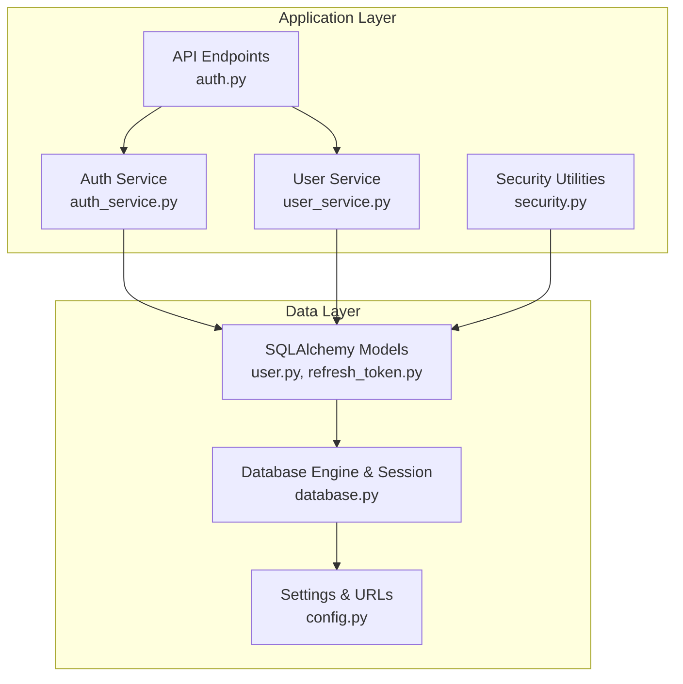
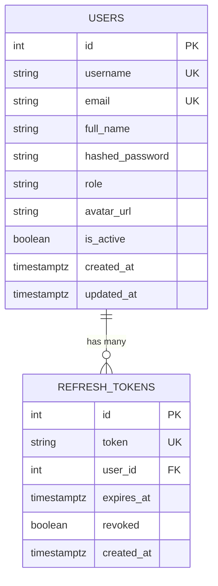
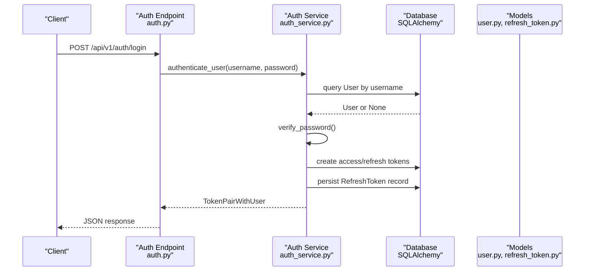
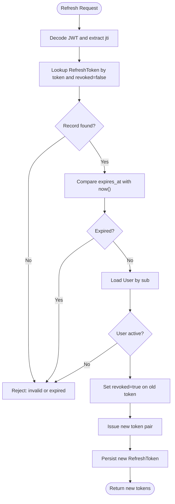
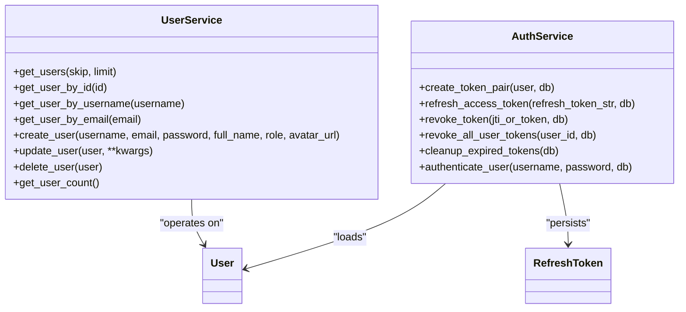
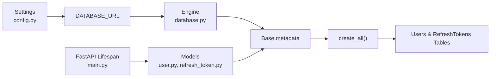

# Database Design

<cite>
**Referenced Files in This Document**
- [user.py](file://backend/app/models/user.py)
- [refresh_token.py](file://backend/app/models/refresh_token.py)
- [database.py](file://backend/app/core/database.py)
- [config.py](file://backend/app/core/config.py)
- [security.py](file://backend/app/core/security.py)
- [auth_service.py](file://backend/app/services/auth_service.py)
- [user_service.py](file://backend/app/services/user_service.py)
- [auth.py](file://backend/app/api/v1/endpoints/auth.py)
- [main.py](file://backend/app/main.py)
- [user.py](file://backend/app/schemas/user.py)
- [auth.py](file://backend/app/schemas/auth.py)
- [Avatar.vue](file://frontend/src/components/ui/Avatar.vue)
</cite>

## Update Summary
**Changes Made**
- Updated User Model section to include the new avatar_url field with system avatar support
- Removed Alembic migration system references as the alembic configuration is no longer present
- Updated Entity Relationship Diagram to reflect the avatar_url column
- Added avatar system documentation covering both custom uploads and system avatars
- Updated data access patterns to include avatar_url handling
- Removed migration management sections as they are no longer applicable

## Table of Contents
1. [Introduction](#introduction)
2. [Project Structure](#project-structure)
3. [Core Components](#core-components)
4. [Architecture Overview](#architecture-overview)
5. [Detailed Component Analysis](#detailed-component-analysis)
6. [Avatar System](#avatar-system)
7. [Dependency Analysis](#dependency-analysis)
8. [Performance Considerations](#performance-considerations)
9. [Troubleshooting Guide](#troubleshooting-guide)
10. [Conclusion](#conclusion)
11. [Appendices](#appendices)

## Introduction
This document describes the database design and data model for NOC Vision's authentication and user management subsystem. It focuses on the core SQLAlchemy models for User and RefreshToken, their relationships, constraints, indexes, and validation rules enforced at the ORM level. The system now includes enhanced avatar support with both custom uploaded images and system avatar options. It also documents data access patterns, token lifecycle, security controls, and schema management without Alembic migrations. The goal is to provide a clear understanding of how data is modeled, stored, validated, accessed, and secured within the system.

## Project Structure
The database layer is organized around SQLAlchemy declarative models, a shared Base, and a configured engine/session factory. Schema management is handled through direct table creation rather than Alembic migrations, while FastAPI endpoints and services orchestrate data access and token lifecycle operations.

**Diagram sources**
- [auth.py:1-106](file://backend/app/api/v1/endpoints/auth.py#L1-L106)
- [auth_service.py:1-139](file://backend/app/services/auth_service.py#L1-L139)
- [user_service.py:1-69](file://backend/app/services/user_service.py#L1-L69)
- [security.py:1-99](file://backend/app/core/security.py#L1-L99)
- [user.py:1-37](file://backend/app/models/user.py#L1-L37)
- [refresh_token.py:1-18](file://backend/app/models/refresh_token.py#L1-L18)
- [database.py:1-18](file://backend/app/core/database.py#L1-L18)
- [config.py:1-51](file://backend/app/core/config.py#L1-L51)

**Section sources**
- [main.py:17-48](file://backend/app/main.py#L17-L48)
- [database.py:1-18](file://backend/app/core/database.py#L1-L18)
- [config.py:5-36](file://backend/app/core/config.py#L5-L36)

## Core Components
This section documents the two primary data models and their relationships, constraints, and indexes.

### User Model
- Table: users
- Columns and constraints:
  - id: integer, primary key, indexed
  - username: string(50), unique, indexed, not null
  - email: string(255), unique, indexed, not null
  - full_name: string(100), nullable
  - hashed_password: string(255), not null
  - role: string(20), default "user"
  - avatar_url: string(500), nullable - supports custom URLs or system avatar patterns (system:1, system:2, system:3)
  - is_active: boolean, default true
  - created_at: datetime with timezone, server default now()
  - updated_at: datetime with timezone, on update now()
- Relationships:
  - One-to-many with RefreshToken via refresh_tokens
- Validation and behavior:
  - Unique constraints on username and email
  - Role defaults to "user"; admin role is supported by business logic
  - Avatar URL field accepts both custom uploaded image URLs and system avatar identifiers
  - Passwords are hashed before storage (via service layer)
  - Timestamps auto-managed by the database

**Updated** Added avatar_url field supporting both custom uploaded images and system avatars

**Section sources**
- [user.py:7-37](file://backend/app/models/user.py#L7-L37)

### RefreshToken Model
- Table: refresh_tokens
- Columns and constraints:
  - id: integer, primary key, indexed
  - token: string(512), unique, indexed, not null
  - user_id: integer, foreign key to users.id with cascade delete, not null
  - expires_at: datetime with timezone, not null
  - revoked: boolean, default false
  - created_at: datetime with timezone, server default now()
- Relationships:
  - Many-to-one with User via user
- Validation and behavior:
  - Unique constraint on token
  - Cascade delete ensures tokens are removed when user is deleted
  - Revocation flag supports token invalidation
  - Expiration enforcement during refresh flow

**Section sources**
- [refresh_token.py:7-18](file://backend/app/models/refresh_token.py#L7-L18)

### Entity Relationship Diagram

**Updated** Added avatar_url column to USERS entity

**Diagram sources**
- [user.py:10-19](file://backend/app/models/user.py#L10-L19)
- [refresh_token.py:10-17](file://backend/app/models/refresh_token.py#L10-L17)

## Architecture Overview
The data access architecture follows a layered pattern:
- API endpoints accept requests and delegate to services.
- Services encapsulate business logic and coordinate ORM operations.
- Models define schema, relationships, and constraints.
- Direct table creation handles schema management (no Alembic migrations).
- Security utilities handle hashing, token creation/verification, and access control.

**Diagram sources**
- [auth.py:20-37](file://backend/app/api/v1/endpoints/auth.py#L20-L37)
- [auth_service.py:113-119](file://backend/app/services/auth_service.py#L113-L119)
- [user.py:7-37](file://backend/app/models/user.py#L7-L37)
- [refresh_token.py:7-18](file://backend/app/models/refresh_token.py#L7-L18)

## Detailed Component Analysis

### Authentication and Token Lifecycle
- Access tokens are short-lived and carry a type claim set to "access".
- Refresh tokens are long-lived, carry a type claim set to "refresh", and include a JTI (token identifier) used as the database token value.
- Token rotation:
  - On successful refresh, the previous RefreshToken is marked revoked.
  - A new pair is issued and persisted.
- Expiration enforcement:
  - Refresh tokens are rejected if expired or revoked.
- Cleanup:
  - Expired refresh tokens are periodically cleaned up.

**Diagram sources**
- [auth_service.py:45-74](file://backend/app/services/auth_service.py#L45-L74)
- [refresh_token.py:10-17](file://backend/app/models/refresh_token.py#L10-L17)
- [security.py:41-48](file://backend/app/core/security.py#L41-L48)

**Section sources**
- [auth_service.py:19-74](file://backend/app/services/auth_service.py#L19-L74)
- [security.py:31-48](file://backend/app/core/security.py#L31-L48)

### Data Access Patterns
- User queries:
  - By id, username, email, paginated list, count, with avatar_url support.
- User mutations:
  - Create with hashed password, update fields (including avatar_url handling), delete.
- Token operations:
  - Create token pair, refresh access token, revoke single token or all tokens for a user, cleanup expired tokens.

**Updated** Enhanced create_user and update_user methods to handle avatar_url parameter

**Diagram sources**
- [user_service.py:8-69](file://backend/app/services/user_service.py#L8-L69)
- [auth_service.py:19-139](file://backend/app/services/auth_service.py#L19-L139)
- [user.py:7-37](file://backend/app/models/user.py#L7-L37)
- [refresh_token.py:7-18](file://backend/app/models/refresh_token.py#L7-L18)

**Section sources**
- [user_service.py:8-69](file://backend/app/services/user_service.py#L8-L69)
- [auth_service.py:19-139](file://backend/app/services/auth_service.py#L19-L139)

### Data Validation Rules and Business Rules
- Validation at ORM level:
  - Unique constraints on username and email in User.
  - Unique constraint on token in RefreshToken.
  - Not-null constraints on required fields.
  - Foreign key constraint with cascade delete from User to RefreshToken.
  - Avatar URL field accepts both custom URLs and system avatar patterns.
- Business rules:
  - Default role is "user"; admin role is supported and enforced by access control utilities.
  - Passwords are hashed before persistence.
  - Access tokens require "access" type; refresh tokens require "refresh" type.
  - Token rotation and revocation prevent reuse of compromised tokens.
  - User must be active to authenticate.
  - Avatar URL validation supports both external URLs and internal system avatar identifiers.

**Updated** Added avatar URL validation rules and system avatar pattern support

**Section sources**
- [user.py:10-19](file://backend/app/models/user.py#L10-L19)
- [refresh_token.py:10-17](file://backend/app/models/refresh_token.py#L10-L17)
- [security.py:61-98](file://backend/app/core/security.py#L61-L98)
- [auth_service.py:113-119](file://backend/app/services/auth_service.py#L113-L119)

### Sample Data
Below are representative rows for each table. These illustrate typical values and constraints.

- Users
  - id: 1
  - username: admin
  - email: admin@nocvision.local
  - full_name: System Administrator
  - hashed_password: bcrypt hash
  - role: admin
  - avatar_url: https://example.com/uploads/avatar_123.jpg (custom upload) or system:1 (system avatar)
  - is_active: true
  - created_at: timestamp
  - updated_at: timestamp

- RefreshTokens
  - id: 1
  - token: <JTI string>
  - user_id: 1
  - expires_at: future timestamp
  - revoked: false
  - created_at: timestamp

Note: Actual values depend on runtime generation and hashing.

**Updated** Added avatar_url examples showing both custom and system avatar formats

## Avatar System
The NOC Vision system now supports flexible avatar management with both custom uploaded images and system avatars.

### Avatar Types
- **Custom Uploaded Avatars**: Full URLs pointing to uploaded images
  - Format: `https://your-domain.com/uploads/avatar_123.jpg`
  - Maximum length: 500 characters
  - Stored as-is in avatar_url field
- **System Avatars**: Predefined system-generated avatars
  - Format: `system:1`, `system:2`, `system:3`
  - Used when no custom avatar is provided
  - Generated based on user initials or other criteria

### Frontend Integration
The Vue.js Avatar component handles avatar display logic:
- If avatar_url is provided and valid, displays the custom image
- Falls back to initials generation when no avatar_url is set
- Supports different sizes (sm, md, lg)
- Uses CSS classes for responsive sizing

### Backend Processing
- Avatar URL validation occurs during user creation/update
- System avatar patterns are validated against predefined formats
- Custom URLs are stored as-is for direct browser access
- Avatar URLs are included in all user response schemas

**Section sources**
- [user.py:16](file://backend/app/models/user.py#L16)
- [user.py:32](file://backend/app/models/user.py#L32)
- [user.py:25-36](file://backend/app/models/user.py#L25-L36)
- [user.py:14](file://backend/app/models/user.py#L14)
- [user.py:19](file://backend/app/models/user.py#L19)
- [user.py:18](file://backend/app/models/user.py#L18)
- [user.py:17](file://backend/app/models/user.py#L17)
- [user.py:15](file://backend/app/models/user.py#L15)
- [user.py:13](file://backend/app/models/user.py#L13)
- [user.py:12](file://backend/app/models/user.py#L12)
- [user.py:11](file://backend/app/models/user.py#L11)
- [user.py:10](file://backend/app/models/user.py#L10)
- [user.py:21-23](file://backend/app/models/user.py#L21-L23)
- [Avatar.vue:1-58](file://frontend/src/components/ui/Avatar.vue#L1-L58)

## Dependency Analysis
- Direct table creation:
  - The application creates tables directly using Base.metadata.create_all() rather than Alembic migrations.
- Runtime model loading:
  - FastAPI startup ensures models are imported so SQLAlchemy can create tables.
- Database configuration:
  - Settings provide DATABASE_URL for direct connection.

**Updated** Removed Alembic references as the migration system is no longer used

**Diagram sources**
- [config.py](file://backend/app/core/config.py#L7)
- [database.py](file://backend/app/core/database.py#L5)
- [main.py:22-30](file://backend/app/main.py#L22-L30)

**Section sources**
- [main.py:22-30](file://backend/app/main.py#L22-L30)

## Performance Considerations
- Indexes:
  - Primary keys are indexed by default.
  - Additional indexes exist on username, email, and token to accelerate lookups.
  - Avatar URL field is not indexed as it's typically not used for filtering.
- Cascading deletes:
  - Deleting a user removes associated refresh tokens automatically.
- Token cleanup:
  - Periodic cleanup of expired tokens reduces table growth and improves query performance.
- Connection pooling:
  - Engine configured with pre-ping to ensure liveness checks.
- Avatar storage:
  - Custom avatar URLs are stored as text, avoiding binary blob overhead.
  - System avatars use lightweight pattern matching.
- Recommendations:
  - Monitor slow queries on token lookup and user authentication.
  - Consider partitioning or archiving old tokens if scale grows.
  - Use pagination for listing users.
  - Implement CDN for avatar images if using custom uploads.

## Troubleshooting Guide
- Authentication failures:
  - Incorrect username/password or inactive user status.
  - Verify user existence and active status before issuing tokens.
- Token refresh failures:
  - Invalid or expired refresh token.
  - Check token type ("refresh"), expiration, and revoked flag.
  - Ensure token rotation is applied after successful refresh.
- Avatar display issues:
  - Custom avatar URLs not loading: verify URL accessibility and CORS settings.
  - System avatars not displaying: check avatar_url format (should be system:1, system:2, or system:3).
  - Avatar fallback working: confirm initials generation logic.
- Database connectivity:
  - Confirm DATABASE_URL matches environment and network configuration.
  - Verify direct table creation is working during application startup.
- Schema issues:
  - Ensure models are imported before table creation.
  - Direct table creation handles schema alignment automatically.

**Updated** Added avatar troubleshooting guidance

**Section sources**
- [auth.py:25-37](file://backend/app/api/v1/endpoints/auth.py#L25-L37)
- [auth_service.py:45-74](file://backend/app/services/auth_service.py#L45-L74)
- [config.py](file://backend/app/core/config.py#L7)
- [main.py:22-30](file://backend/app/main.py#L22-L30)

## Conclusion
The NOC Vision authentication subsystem is built on a clear, normalized schema with strong constraints and indexes. The User and RefreshToken models enforce uniqueness, referential integrity, and lifecycle management. The enhanced User model now supports flexible avatar management with both custom uploaded images and system avatars. Schema management is handled through direct table creation rather than Alembic migrations. Security utilities and services implement robust token handling, access control, and operational hygiene such as token rotation and cleanup.

## Appendices

### Data Lifecycle, Retention, and Archival
- Lifecycle stages:
  - Creation: Users created via registration or initialization; passwords hashed; avatar_url set if provided.
  - Authentication: Access tokens issued for short sessions; refresh tokens for extended sessions.
  - Avatar management: Custom avatars stored as URLs; system avatars use pattern-based identifiers.
  - Rotation: Previous refresh tokens are revoked upon issuance of new pairs.
  - Cleanup: Expired refresh tokens are removed periodically.
- Retention:
  - No explicit retention policy is defined in code; defaults are governed by token expiration settings.
  - Avatar URLs are retained until user updates or deletion.
- Archival:
  - No archival mechanism is present; consider offloading historical tokens to cold storage if needed.

**Updated** Added avatar URL retention considerations

**Section sources**
- [config.py:11-13](file://backend/app/core/config.py#L11-L13)
- [auth_service.py:103-110](file://backend/app/services/auth_service.py#L103-L110)

### Data Migration Paths
**Updated** Removed migration management sections as Alembic is no longer used

The application now uses direct table creation for schema management:
- Schema creation:
  - Models are imported during application startup.
  - Base.metadata.create_all() creates tables if they don't exist.
  - Plugin models are also registered and created.
- Development vs Production:
  - Direct table creation is used as a fallback for development.
  - Alembic was previously used for production migrations but is no longer present in the codebase.
- Manual schema updates:
  - When model changes are needed, modify the model definition directly.
  - Restart the application to apply schema changes.
  - For complex migrations, manual intervention may be required.

**Section sources**
- [main.py:22-30](file://backend/app/main.py#L22-L30)

### Data Security, Privacy, and Access Control
- Password hashing:
  - bcrypt is used for password hashing in services.
- Token security:
  - HS256 algorithm with a secret key; access tokens are short-lived; refresh tokens include JTI and are revoked on rotation.
- Access control:
  - Roles enforced via current user resolution; admin-only endpoints protected by dependency checks.
- Privacy:
  - Minimal PII stored; sensitive fields (password hashes) are not exposed in responses.
  - Avatar URLs are stored as provided; ensure proper validation for external URLs.
- Avatar security:
  - Custom avatar URLs are stored as-is; validate URLs to prevent malicious content.
  - System avatars provide privacy-friendly alternatives without external dependencies.

**Updated** Added avatar security considerations

**Section sources**
- [security.py:16-28](file://backend/app/core/security.py#L16-L28)
- [auth_service.py:19-42](file://backend/app/services/auth_service.py#L19-L42)
- [auth.py:54-80](file://backend/app/api/v1/endpoints/auth.py#L54-L80)