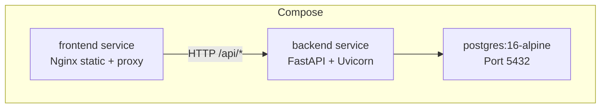
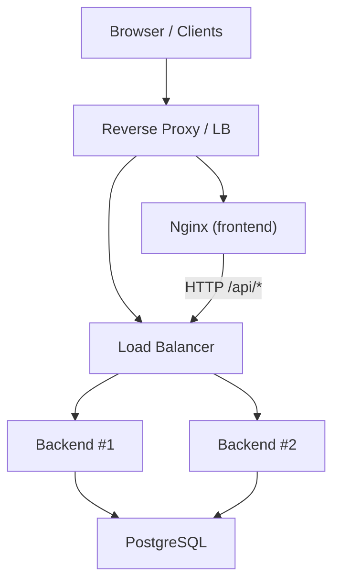
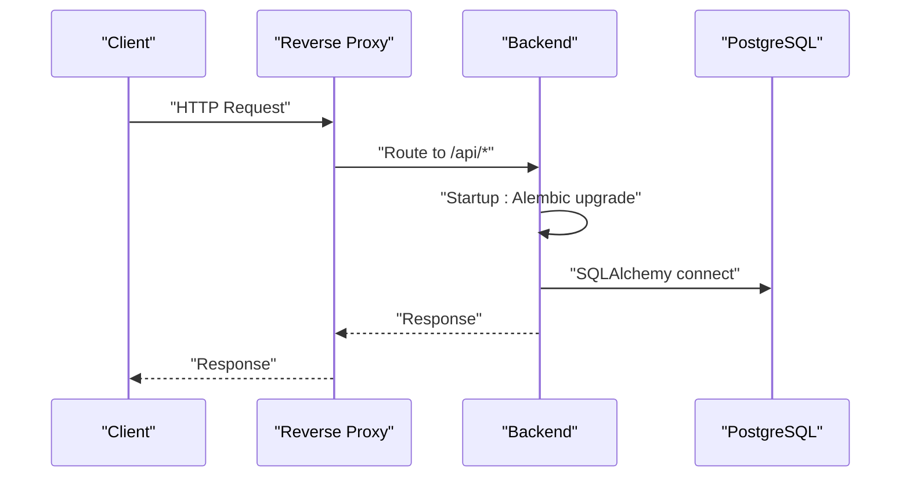
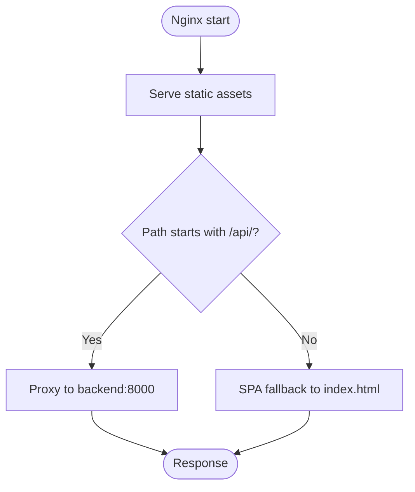
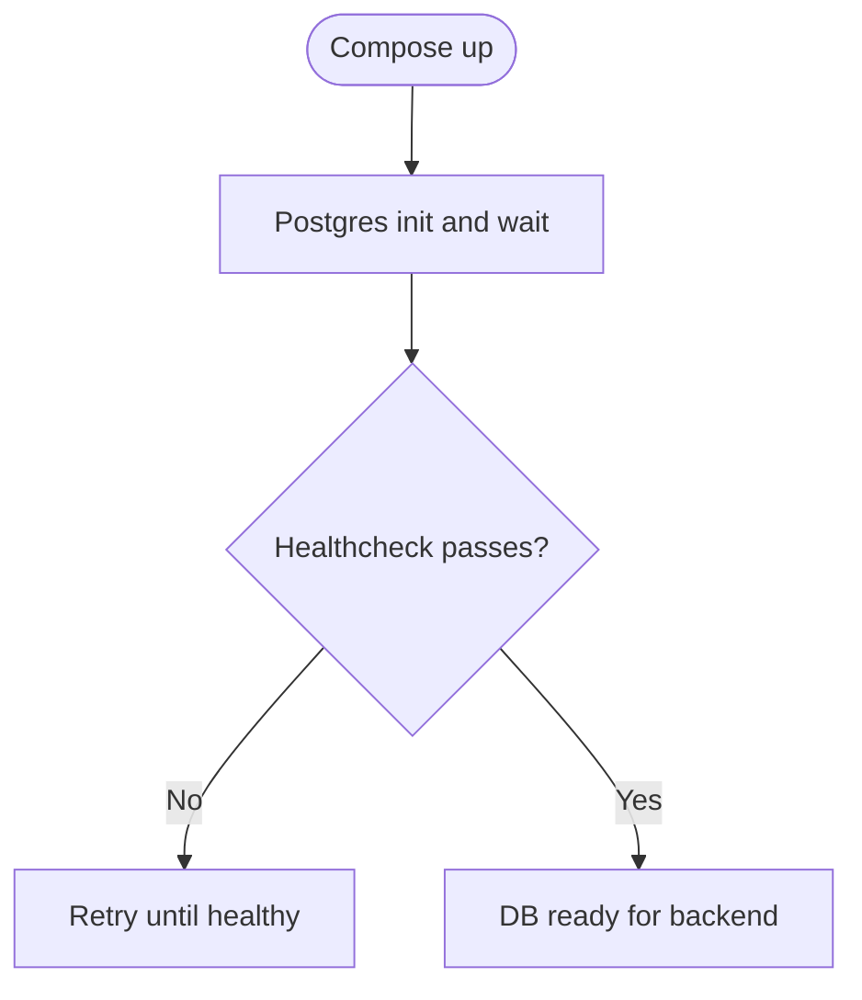
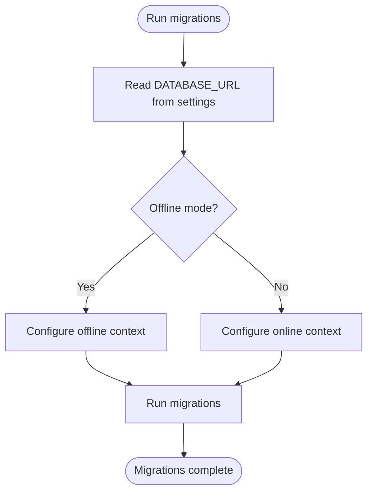
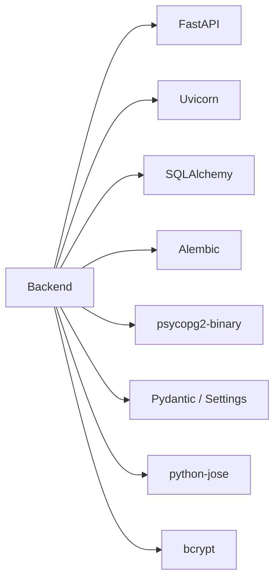

# Deployment & Operations

<cite>
**Referenced Files in This Document**
- [docker-compose.yml](file://docker-compose.yml)
- [backend/Dockerfile](file://backend/Dockerfile)
- [frontend/Dockerfile](file://frontend/Dockerfile)
- [backend/run.py](file://backend/run.py)
- [backend/app/main.py](file://backend/app/main.py)
- [backend/app/core/config.py](file://backend/app/core/config.py)
- [backend/app/core/database.py](file://backend/app/core/database.py)
- [backend/app/core/security.py](file://backend/app/core/security.py)
- [backend/requirements.txt](file://backend/requirements.txt)
- [backend/alembic.ini](file://backend/alembic.ini)
- [backend/alembic/env.py](file://backend/alembic/env.py)
- [frontend/nginx.conf](file://frontend/nginx.conf)
- [frontend/package.json](file://frontend/package.json)
- [README.md](file://README.md)
</cite>

## Table of Contents
1. [Introduction](#introduction)
2. [Project Structure](#project-structure)
3. [Core Components](#core-components)
4. [Architecture Overview](#architecture-overview)
5. [Detailed Component Analysis](#detailed-component-analysis)
6. [Dependency Analysis](#dependency-analysis)
7. [Performance Considerations](#performance-considerations)
8. [Troubleshooting Guide](#troubleshooting-guide)
9. [Conclusion](#conclusion)
10. [Appendices](#appendices)

## Introduction
This document provides comprehensive deployment and operations guidance for NOC Vision. It covers containerization strategies, production-grade deployment configurations, infrastructure requirements, environment variable management, database setup, security hardening, production workflows, monitoring and logging, backups, scaling and high availability, maintenance and updates, disaster recovery, and troubleshooting.

## Project Structure
NOC Vision consists of:
- Backend: FastAPI application with Alembic migrations, PostgreSQL via SQLAlchemy, JWT authentication, and a plugin loader.
- Frontend: Vue 3 application built with Vite and served via Nginx.
- Orchestration: Docker Compose for local development and a foundation for production deployments.

**Diagram sources**
- [docker-compose.yml:1-52](file://docker-compose.yml#L1-L52)
- [frontend/nginx.conf:1-20](file://frontend/nginx.conf#L1-L20)

**Section sources**
- [README.md:1-31](file://README.md#L1-L31)
- [docker-compose.yml:1-52](file://docker-compose.yml#L1-L52)

## Core Components
- Backend service
  - Container image: Python slim with GCC and psycopg2 prerequisites.
  - Exposed port: 8000.
  - Startup: Runs Alembic migrations, then starts Uvicorn.
  - Environment variables: DATABASE_URL, SECRET_KEY, DEBUG, CORS origins, default admin credentials.
- Frontend service
  - Multi-stage build: Node Alpine for build, Nginx Alpine for runtime.
  - Exposed port: 80 (served by Nginx).
  - Proxy: Routes /api/* to backend service.
- Database service
  - PostgreSQL 16 Alpine with healthcheck and persistent volume.

Key operational settings are driven by environment variables and configuration classes.

**Section sources**
- [backend/Dockerfile:1-17](file://backend/Dockerfile#L1-L17)
- [frontend/Dockerfile:1-13](file://frontend/Dockerfile#L1-L13)
- [docker-compose.yml:1-52](file://docker-compose.yml#L1-L52)
- [backend/app/core/config.py:1-46](file://backend/app/core/config.py#L1-L46)
- [backend/app/core/database.py:1-18](file://backend/app/core/database.py#L1-L18)
- [backend/app/core/security.py:1-99](file://backend/app/core/security.py#L1-L99)
- [frontend/nginx.conf:1-20](file://frontend/nginx.conf#L1-L20)

## Architecture Overview
Production-ready deployment typically involves:
- A reverse proxy (e.g., Nginx or Traefik) terminating TLS and routing requests.
- Stateless backend replicas behind a load balancer.
- A managed or clustered PostgreSQL database.
- Persistent storage for logs and backups.
- Health checks and readiness probes integrated with your orchestrator.

[No sources needed since this diagram shows conceptual workflow, not actual code structure]

## Detailed Component Analysis

### Backend Service
- Containerization
  - Uses Python 3.12 slim base, installs GCC and libpq-dev for psycopg2, copies requirements and application, exposes 8000, and runs Alembic followed by Uvicorn.
- Startup lifecycle
  - Alembic upgrades database to latest revision.
  - Uvicorn serves the FastAPI app on port 8000.
- Configuration
  - Settings class reads from .env with explicit parsing for ALLOWED_ORIGINS and defaults for secrets, tokens, and admin.
  - Logging level configured via LOG_LEVEL.
- Database
  - Engine configured with pool_pre_ping for robust connections.
- Security
  - JWT HS256 signing with configurable SECRET_KEY.
  - Password hashing with bcrypt.
  - OAuth2 bearer token scheme for protected endpoints.
- Health endpoint
  - GET /health returns status.

**Diagram sources**
- [backend/Dockerfile:14-16](file://backend/Dockerfile#L14-L16)
- [backend/app/main.py:17-48](file://backend/app/main.py#L17-L48)
- [backend/app/core/database.py:1-18](file://backend/app/core/database.py#L1-L18)

**Section sources**
- [backend/Dockerfile:1-17](file://backend/Dockerfile#L1-L17)
- [backend/run.py:1-5](file://backend/run.py#L1-L5)
- [backend/app/main.py:1-87](file://backend/app/main.py#L1-L87)
- [backend/app/core/config.py:1-46](file://backend/app/core/config.py#L1-L46)
- [backend/app/core/database.py:1-18](file://backend/app/core/database.py#L1-L18)
- [backend/app/core/security.py:1-99](file://backend/app/core/security.py#L1-L99)

### Frontend Service
- Containerization
  - Multi-stage build: Node Alpine for build, Nginx Alpine for runtime.
  - Copies built assets and custom Nginx config.
- Nginx configuration
  - Serves SPA and proxies /api/* to backend service.
- Ports
  - Exposes port 80 inside the container.

**Diagram sources**
- [frontend/Dockerfile:1-13](file://frontend/Dockerfile#L1-L13)
- [frontend/nginx.conf:1-20](file://frontend/nginx.conf#L1-L20)

**Section sources**
- [frontend/Dockerfile:1-13](file://frontend/Dockerfile#L1-L13)
- [frontend/nginx.conf:1-20](file://frontend/nginx.conf#L1-L20)

### Database Service
- Image: postgres:16-alpine.
- Credentials and database name set via environment variables.
- Healthcheck uses pg_isready against the configured user and database.
- Persistent volume for data durability.

**Diagram sources**
- [docker-compose.yml:4-18](file://docker-compose.yml#L4-L18)

**Section sources**
- [docker-compose.yml:4-18](file://docker-compose.yml#L4-L18)

### Environment Variables and Secrets
- Required keys
  - DATABASE_URL: Postgres connection string.
  - SECRET_KEY: Secret for JWT signing (must be strong and random).
  - ALLOWED_ORIGINS: Comma-separated list of frontend origins.
  - LOG_LEVEL: Logging verbosity.
  - DEBUG: Enable/disable debug mode.
  - DEFAULT_ADMIN_*: Initial admin account creation parameters.
- Defaults and parsing
  - Settings class defines defaults and parses ALLOWED_ORIGINS from comma-separated strings.
  - Case-sensitive environment file loading controlled by model_config.

Operational recommendations:
- Store secrets externally (e.g., orchestrator secret manager) and mount into containers.
- Rotate SECRET_KEY during deployments and invalidate refresh tokens as needed.
- Keep DEBUG disabled in production.

**Section sources**
- [backend/app/core/config.py:1-46](file://backend/app/core/config.py#L1-L46)
- [docker-compose.yml:24-31](file://docker-compose.yml#L24-L31)

### Database Migrations and Alembic
- Alembic configuration loads from the application settings, ensuring migrations align with runtime DATABASE_URL.
- Environment integration dynamically imports plugin models to include them in migration targets.
- Production-grade migrations should be generated and applied via CI/CD pipeline.

**Diagram sources**
- [backend/alembic/env.py:1-63](file://backend/alembic/env.py#L1-L63)
- [backend/alembic.ini:1-37](file://backend/alembic.ini#L1-L37)

**Section sources**
- [backend/alembic/env.py:1-63](file://backend/alembic/env.py#L1-L63)
- [backend/alembic.ini:1-37](file://backend/alembic.ini#L1-L37)

### Security Hardening
- Secrets
  - Set SECRET_KEY to a secure, random 64+ character value.
  - Use strong passwords for default admin and database.
- Transport
  - Terminate TLS at a reverse proxy or ingress controller.
  - Enforce HTTPS redirects and HSTS at the proxy layer.
- CORS
  - Restrict ALLOWED_ORIGINS to trusted domains only.
- Tokens
  - Configure appropriate expiration windows for access and refresh tokens.
- Dependencies
  - Pin versions in requirements.txt and keep them updated regularly.

**Section sources**
- [backend/app/core/config.py:9-13](file://backend/app/core/config.py#L9-L13)
- [backend/app/core/security.py:31-48](file://backend/app/core/security.py#L31-L48)
- [backend/requirements.txt:1-11](file://backend/requirements.txt#L1-L11)

### Monitoring and Logging
- Logging
  - LOG_LEVEL controls application log verbosity.
  - Use structured logging in production (e.g., JSON) and forward to centralized logging systems.
- Health endpoints
  - Use GET /health for basic liveness/readiness checks.
- Metrics
  - Expose Prometheus metrics via middleware or a dedicated exporter.
- Observability
  - Centralize logs and traces across backend and frontend.
  - Monitor database connection pool saturation and slow queries.

**Section sources**
- [backend/app/main.py:79-81](file://backend/app/main.py#L79-L81)
- [backend/app/core/config.py:23-23](file://backend/app/core/config.py#L23-L23)

### Backup Procedures
- Database
  - Schedule regular logical backups (e.g., pg_dump) and retain rotation policies.
  - Test restore procedures periodically.
- Application
  - Back up configuration files, secrets, and migration history.
- Offsite storage
  - Store backups in secure, geographically separated locations.

[No sources needed since this section provides general guidance]

### Scaling and High Availability
- Horizontal scaling
  - Run multiple backend replicas behind a load balancer.
  - Ensure shared stateless design; avoid per-instance session storage.
- Database HA
  - Use managed PostgreSQL with replication or run a high-availability cluster.
  - Separate primary and replica connections if needed.
- Caching and queues
  - Introduce Redis for sessions or caching if required.
- Health checks
  - Use /health for readiness/liveness probes.

[No sources needed since this section provides general guidance]

### Production Deployment Workflows
- Build
  - Build backend and frontend images using Dockerfiles.
- Orchestrate
  - Deploy via Docker Compose, Kubernetes, or cloud platform services.
- Migrate
  - Run migrations before or after rolling updates.
- Rollout
  - Use blue/green or rolling updates to minimize downtime.
- Validate
  - Confirm health endpoints, API docs, and admin login.

[No sources needed since this section provides general guidance]

### Maintenance and Updates
- Dependency updates
  - Regularly update Python packages and Node dependencies.
- Patching
  - Apply OS and database patches promptly.
- Rotation
  - Rotate secrets and certificates according to policy.
- Auditing
  - Review logs and audit trails for anomalies.

[No sources needed since this section provides general guidance]

### Disaster Recovery Planning
- Recovery objectives
  - Define RPO/RTO targets for database and application tiers.
- Procedures
  - Document steps to restore from backups, recreate services, and re-apply migrations.
- Testing
  - Conduct periodic DR drills and update playbooks.

[No sources needed since this section provides general guidance]

## Dependency Analysis
Runtime dependencies and their roles:
- FastAPI and Uvicorn: Web framework and ASGI server.
- SQLAlchemy and Alembic: ORM and migrations.
- psycopg2-binary: PostgreSQL adapter.
- Pydantic and pydantic-settings: Settings management.
- python-jose and bcrypt: JWT and password hashing.
- python-multipart: Form parsing.

**Diagram sources**
- [backend/requirements.txt:1-11](file://backend/requirements.txt#L1-L11)

**Section sources**
- [backend/requirements.txt:1-11](file://backend/requirements.txt#L1-L11)

## Performance Considerations
- Database
  - Use connection pooling and pre-ping to handle transient failures.
  - Index frequently queried columns and normalize schemas appropriately.
- Application
  - Minimize synchronous work in request handlers.
  - Use background tasks for long-running jobs.
- Caching
  - Cache read-heavy responses and invalidate on writes.
- CDN and static assets
  - Serve frontend via CDN and enable compression.
- Load balancing
  - Distribute traffic evenly and terminate TLS at the edge.

[No sources needed since this section provides general guidance]

## Troubleshooting Guide
Common deployment issues and resolutions:
- Backend fails to start
  - Verify PostgreSQL is reachable and credentials are correct.
  - Ensure DATABASE_URL matches environment and network.
  - Confirm migrations have been applied.
- Frontend cannot reach API
  - Check Nginx proxy configuration and backend service connectivity.
  - Validate CORS origins and reverse proxy routing.
- Database connection errors
  - Confirm database is healthy and accepting connections.
  - Check credentials and database existence.
- Health checks failing
  - Inspect /health endpoint and container logs.
  - Review readiness conditions and dependency startup order.

**Section sources**
- [README.md:220-238](file://README.md#L220-L238)
- [docker-compose.yml:14-18](file://docker-compose.yml#L14-L18)
- [frontend/nginx.conf:11-18](file://frontend/nginx.conf#L11-L18)

## Conclusion
NOC Vision provides a solid foundation for containerized deployment with clear separation between frontend and backend services. By following the production-grade recommendations here—securing secrets, hardening transport, implementing robust monitoring and backups, and adopting scalable and HA patterns—you can operate NOC Vision reliably in production.

## Appendices

### Environment Variable Reference
- DATABASE_URL: Postgres connection string.
- SECRET_KEY: JWT signing key.
- ALGORITHM: JWT algorithm (default HS256).
- ACCESS_TOKEN_EXPIRE_MINUTES: Access token lifetime.
- REFRESH_TOKEN_EXPIRE_DAYS: Refresh token lifetime.
- ALLOWED_ORIGINS: Comma-separated origins.
- DEBUG: Enable debug mode.
- LOG_LEVEL: Logging level.
- ENABLED_PLUGINS: Enabled plugins list.
- DEFAULT_ADMIN_USERNAME/PASSWORD/EMAIL: Initial admin account.

**Section sources**
- [backend/app/core/config.py:5-36](file://backend/app/core/config.py#L5-L36)
- [README.md:129-157](file://README.md#L129-L157)

### Production Deployment Checklist
- TLS termination at reverse proxy.
- Strong SECRET_KEY and rotated periodically.
- Allowed origins restricted to production domains.
- Health checks configured and monitored.
- Backups scheduled and tested.
- Horizontal scaling and load balancing in place.
- Secrets management integrated with CI/CD.

[No sources needed since this section provides general guidance]