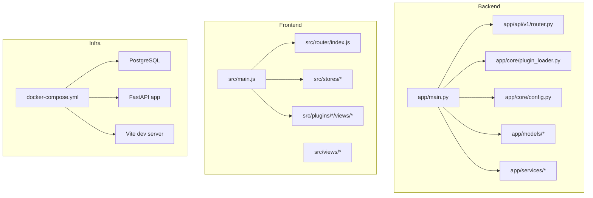
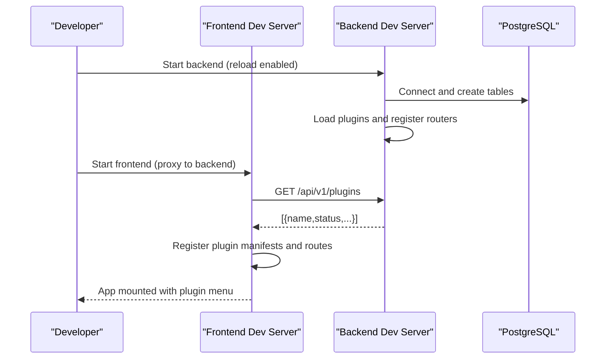
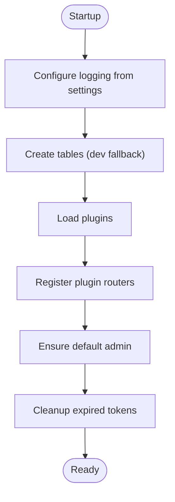
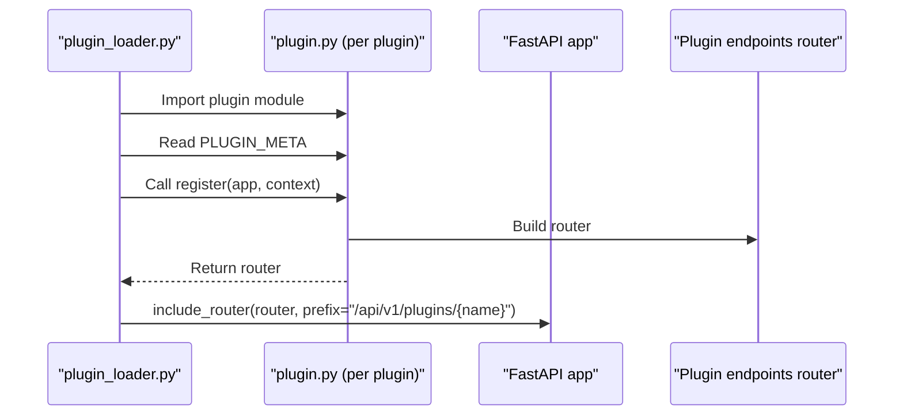
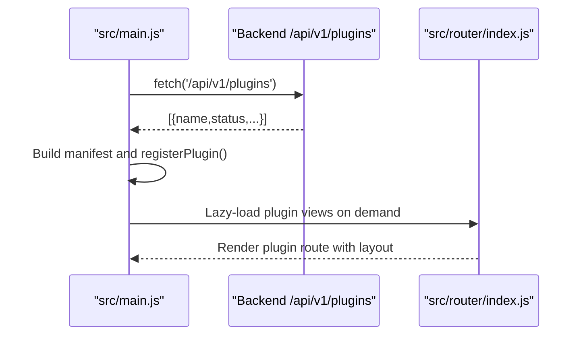
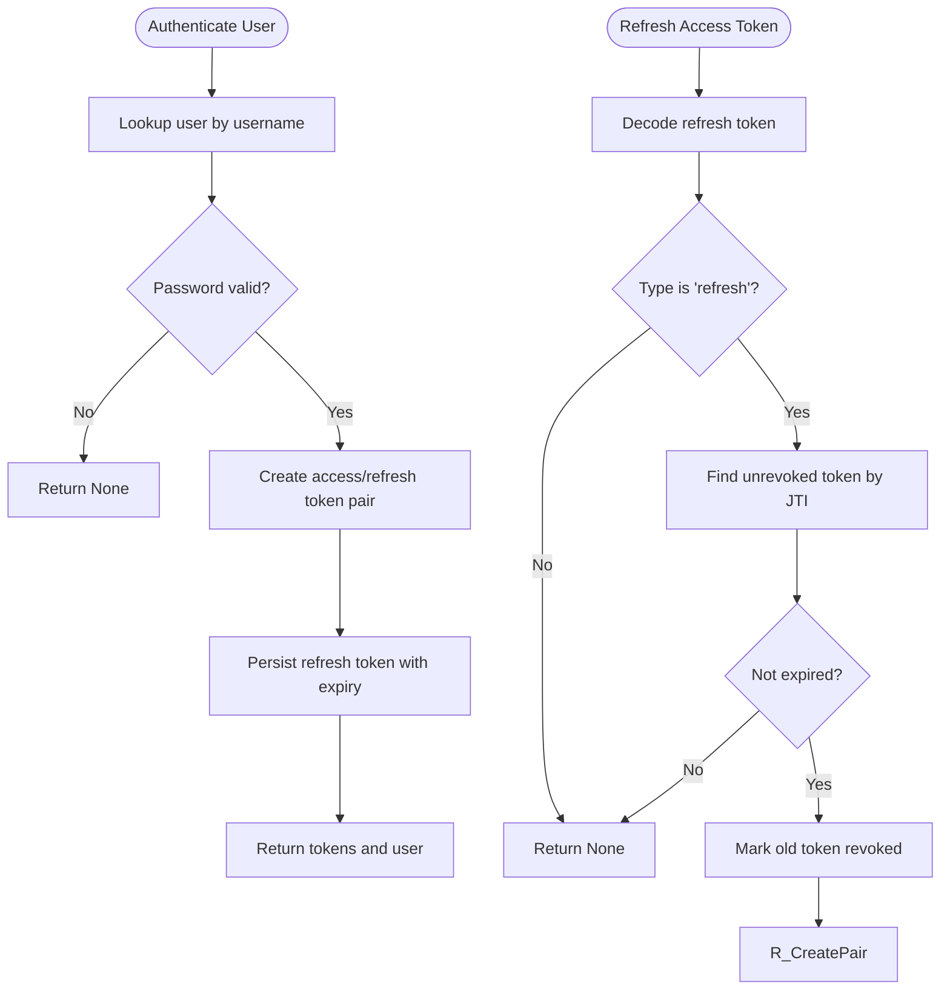
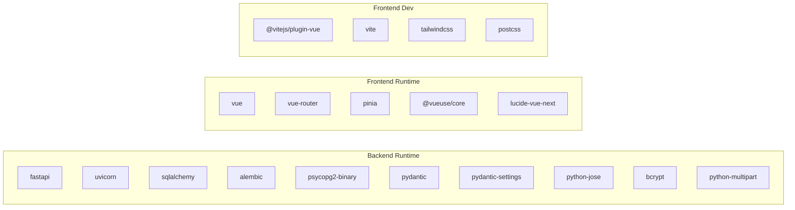

# Development Guide

<cite>
**Referenced Files in This Document**
- [README.md](file://README.md)
- [docker-compose.yml](file://docker-compose.yml)
- [backend/Dockerfile](file://backend/Dockerfile)
- [frontend/Dockerfile](file://frontend/Dockerfile)
- [backend/run.py](file://backend/run.py)
- [backend/app/main.py](file://backend/app/main.py)
- [backend/app/core/config.py](file://backend/app/core/config.py)
- [backend/app/core/plugin_loader.py](file://backend/app/core/plugin_loader.py)
- [backend/app/api/v1/router.py](file://backend/app/api/v1/router.py)
- [backend/requirements.txt](file://backend/requirements.txt)
- [frontend/vite.config.cjs](file://frontend/vite.config.cjs)
- [frontend/package.json](file://frontend/package.json)
- [frontend/src/main.js](file://frontend/src/main.js)
- [frontend/src/router/index.js](file://frontend/src/router/index.js)
- [backend/app/services/auth_service.py](file://backend/app/services/auth_service.py)
- [backend/app/models/user.py](file://backend/app/models/user.py)
- [backend/app/plugins/accounting/plugin.py](file://backend/app/plugins/accounting/plugin.py)
- [backend/app/plugins/incidents/plugin.py](file://backend/app/plugins/incidents/plugin.py)
</cite>

## Table of Contents
1. [Introduction](#introduction)
2. [Project Structure](#project-structure)
3. [Core Components](#core-components)
4. [Architecture Overview](#architecture-overview)
5. [Detailed Component Analysis](#detailed-component-analysis)
6. [Dependency Analysis](#dependency-analysis)
7. [Performance Considerations](#performance-considerations)
8. [Troubleshooting Guide](#troubleshooting-guide)
9. [Conclusion](#conclusion)
10. [Appendices](#appendices)

## Introduction
This guide explains how to set up a development environment, organize contributions, test and debug NOC Vision, and build both backend and frontend. It covers the plugin architecture, routing, authentication, and development server configurations with hot reload. It also documents best practices for adding features, creating plugins, and maintaining code quality.

## Project Structure
NOC Vision follows a clear separation of concerns:
- Backend: FastAPI application with plugin loading, API routers, services, models, and core configuration.
- Frontend: Vue 3 application with Pinia stores, Vue Router, and plugin-managed views.
- Infrastructure: Docker Compose orchestrates PostgreSQL, backend, and frontend; optional Nginx for production builds.

**Diagram sources**
- [backend/app/main.py:1-87](file://backend/app/main.py#L1-L87)
- [backend/app/core/config.py:1-46](file://backend/app/core/config.py#L1-L46)
- [backend/app/core/plugin_loader.py:1-100](file://backend/app/core/plugin_loader.py#L1-L100)
- [backend/app/api/v1/router.py:1-10](file://backend/app/api/v1/router.py#L1-L10)
- [frontend/src/main.js:1-132](file://frontend/src/main.js#L1-L132)
- [frontend/src/router/index.js:1-174](file://frontend/src/router/index.js#L1-L174)
- [docker-compose.yml:1-52](file://docker-compose.yml#L1-L52)

**Section sources**
- [README.md:5-31](file://README.md#L5-L31)
- [docker-compose.yml:1-52](file://docker-compose.yml#L1-L52)

## Core Components
- Backend entrypoint initializes logging, creates tables, loads plugins, sets up CORS, and registers core API routes.
- Plugin loader dynamically imports plugin modules and registers their routers under a plugin-specific prefix.
- Frontend initializes Pinia, Vue Router, and loads plugin manifests from the backend to populate the menu.
- Authentication service manages token creation, rotation, revocation, and default admin creation.

Key responsibilities:
- app/main.py: Application lifecycle, CORS, router inclusion, health checks, plugin listing endpoint.
- app/core/plugin_loader.py: Scans plugin directory, imports models and plugin modules, invokes register() with a shared context.
- frontend/src/main.js: Initializes auth state, fetches plugin list, constructs plugin manifests, and mounts the app.
- frontend/src/router/index.js: Defines routes for core views and lazy-loads plugin views.
- backend/app/services/auth_service.py: Token pair creation, refresh, revoke, revoke-all, cleanup expired tokens, default admin creation.

**Section sources**
- [backend/app/main.py:1-87](file://backend/app/main.py#L1-L87)
- [backend/app/core/plugin_loader.py:1-100](file://backend/app/core/plugin_loader.py#L1-L100)
- [frontend/src/main.js:1-132](file://frontend/src/main.js#L1-L132)
- [frontend/src/router/index.js:1-174](file://frontend/src/router/index.js#L1-L174)
- [backend/app/services/auth_service.py:1-139](file://backend/app/services/auth_service.py#L1-L139)

## Architecture Overview
The system uses a plugin-first architecture:
- Backend exposes core endpoints and dynamically loads plugin endpoints via plugin_loader.
- Frontend fetches the list of loaded plugins and registers them with the router and menu.
- Development servers enable hot reload for rapid iteration.

**Diagram sources**
- [backend/app/main.py:17-48](file://backend/app/main.py#L17-L48)
- [backend/app/core/plugin_loader.py:25-99](file://backend/app/core/plugin_loader.py#L25-L99)
- [frontend/src/main.js:18-51](file://frontend/src/main.js#L18-L51)
- [frontend/vite.config.cjs:12-21](file://frontend/vite.config.cjs#L12-L21)

## Detailed Component Analysis

### Backend Application Lifecycle and Plugin Loading
- Startup: Logging level configured from settings, tables created, plugins loaded, default admin ensured, expired tokens cleaned up.
- Plugin loading: Iterates plugin directory, optionally filters by ENABLED_PLUGINS, imports models and plugin modules, validates PLUGIN_META and register(), and registers routers with a plugin-scoped prefix.
- Shutdown: Disposes database engine.

**Diagram sources**
- [backend/app/main.py:17-48](file://backend/app/main.py#L17-L48)
- [backend/app/core/plugin_loader.py:25-99](file://backend/app/core/plugin_loader.py#L25-L99)

**Section sources**
- [backend/app/main.py:17-48](file://backend/app/main.py#L17-L48)
- [backend/app/core/plugin_loader.py:25-99](file://backend/app/core/plugin_loader.py#L25-L99)

### Plugin Registration Pattern
- Each plugin defines PLUGIN_META and a register(app, context) function.
- The context provides database base, API prefix, and dependency helpers.
- The backend calls register() and includes the plugin’s router under /api/v1/plugins/{plugin_name}.

**Diagram sources**
- [backend/app/core/plugin_loader.py:57-78](file://backend/app/core/plugin_loader.py#L57-L78)
- [backend/app/plugins/accounting/plugin.py:1-17](file://backend/app/plugins/accounting/plugin.py#L1-L17)
- [backend/app/plugins/incidents/plugin.py:1-17](file://backend/app/plugins/incidents/plugin.py#L1-L17)

**Section sources**
- [backend/app/core/plugin_loader.py:57-78](file://backend/app/core/plugin_loader.py#L57-L78)
- [backend/app/plugins/accounting/plugin.py:1-17](file://backend/app/plugins/accounting/plugin.py#L1-L17)
- [backend/app/plugins/incidents/plugin.py:1-17](file://backend/app/plugins/incidents/plugin.py#L1-L17)

### Frontend Plugin Registry and Menu Generation
- On startup, frontend fetches plugin list from /api/v1/plugins.
- For each loaded plugin, it constructs a manifest and registers it in the plugin registry.
- Menu items are defined per plugin type and injected into the sidebar navigation.

**Diagram sources**
- [frontend/src/main.js:18-51](file://frontend/src/main.js#L18-L51)
- [frontend/src/router/index.js:26-32](file://frontend/src/router/index.js#L26-L32)
- [backend/app/main.py:84-87](file://backend/app/main.py#L84-L87)

**Section sources**
- [frontend/src/main.js:18-51](file://frontend/src/main.js#L18-L51)
- [frontend/src/router/index.js:26-32](file://frontend/src/router/index.js#L26-L32)
- [backend/app/main.py:84-87](file://backend/app/main.py#L84-L87)

### Authentication Flow
- Token pair creation uses access and refresh tokens with JTI for rotation.
- Refresh token validation checks payload type, presence of JTI/username, token existence, and expiration.
- Revocation supports single-token or user-wide revocation and periodic cleanup of expired tokens.
- Default admin is created if none exists.

**Diagram sources**
- [backend/app/services/auth_service.py:19-74](file://backend/app/services/auth_service.py#L19-L74)
- [backend/app/models/user.py:1-35](file://backend/app/models/user.py#L1-L35)

**Section sources**
- [backend/app/services/auth_service.py:19-139](file://backend/app/services/auth_service.py#L19-L139)
- [backend/app/models/user.py:1-35](file://backend/app/models/user.py#L1-L35)

## Dependency Analysis
- Backend runtime dependencies are declared in requirements.txt.
- Frontend dependencies and dev tooling are declared in package.json.
- Dockerfiles define container images for backend and frontend; docker-compose orchestrates services and ports.

**Diagram sources**
- [backend/requirements.txt:1-11](file://backend/requirements.txt#L1-L11)
- [frontend/package.json:11-29](file://frontend/package.json#L11-L29)

**Section sources**
- [backend/requirements.txt:1-11](file://backend/requirements.txt#L1-L11)
- [frontend/package.json:1-30](file://frontend/package.json#L1-L30)

## Performance Considerations
- Use Docker Compose for local development to avoid environment drift and ensure consistent performance baselines.
- Enable hot reload during development to reduce restart overhead.
- Keep plugin loading efficient by limiting unnecessary imports and avoiding heavy initialization in plugin register().
- Use pagination and filtering in plugin endpoints to prevent large payloads.
- Monitor database queries and consider indexing for frequently queried fields.
- Prefer lazy-loading plugin views to minimize initial bundle size.

## Troubleshooting Guide
Common issues and resolutions:
- Backend fails to start:
  - Ensure PostgreSQL is running and reachable.
  - Verify DATABASE_URL in environment settings.
  - Confirm dependencies installed via requirements.txt.
- Frontend fails to start:
  - Clear node_modules and reinstall dependencies.
  - Confirm backend is running at the proxied address.
  - Align ALLOWED_ORIGINS with frontend URLs.
- Database connection errors:
  - Verify PostgreSQL service is healthy.
  - Check credentials and confirm database existence.

**Section sources**
- [README.md:220-238](file://README.md#L220-L238)

## Conclusion
NOC Vision provides a robust, plugin-driven architecture with clear separation between backend and frontend. By following the development setup, plugin creation pattern, and testing strategies outlined here, contributors can efficiently add features, maintain code quality, and optimize the development workflow.

## Appendices

### Development Environment Setup
- Recommended: Docker Compose for end-to-end local development.
- Manual setup: Python 3.9+, Node.js 18+, PostgreSQL 16+; run migrations with Alembic for production-like environments.

**Section sources**
- [README.md:65-128](file://README.md#L65-L128)

### Build Processes
- Backend:
  - Docker: Image builds dependencies and runs Alembic migrations before starting Uvicorn.
  - Local: Install requirements and run the FastAPI app with reload enabled.
- Frontend:
  - Docker: Multi-stage build with Vite and Nginx serving the production bundle.
  - Local: Install dependencies and run Vite dev server with hot reload.

**Section sources**
- [backend/Dockerfile:1-17](file://backend/Dockerfile#L1-L17)
- [frontend/Dockerfile:1-13](file://frontend/Dockerfile#L1-L13)
- [backend/run.py:1-5](file://backend/run.py#L1-L5)
- [frontend/vite.config.cjs:1-23](file://frontend/vite.config.cjs#L1-L23)

### Development Servers and Hot Reload
- Backend: Uvicorn reload enabled for automatic restarts on code changes.
- Frontend: Vite dev server with host binding and proxy to backend API.

**Section sources**
- [backend/run.py:3-4](file://backend/run.py#L3-L4)
- [frontend/vite.config.cjs:12-21](file://frontend/vite.config.cjs#L12-L21)

### Testing Strategies
- Backend: Use pytest to run tests.
- Frontend: Use npm test to execute unit and component tests.

**Section sources**
- [README.md:206-218](file://README.md#L206-L218)

### Coding Standards and Best Practices
- Backend:
  - Use Pydantic models and schemas for data validation.
  - Centralize configuration via settings with typed defaults.
  - Keep plugin registration minimal and deterministic.
- Frontend:
  - Use Pinia for state management and Vue Router for navigation.
  - Lazy-load plugin views to improve performance.
  - Maintain consistent component composition and styling with Tailwind.

**Section sources**
- [backend/app/core/config.py:1-46](file://backend/app/core/config.py#L1-L46)
- [frontend/src/router/index.js:26-32](file://frontend/src/router/index.js#L26-L32)
- [frontend/package.json:11-29](file://frontend/package.json#L11-L29)

### Adding New Features and Plugins
- Backend plugin:
  - Create a new directory under backend/app/plugins/your_plugin/.
  - Implement plugin.py with PLUGIN_META and register(app, context).
  - Add endpoints.py, models.py, and schemas.py as needed.
  - Ensure models are imported so they bind to Base.metadata.
- Frontend plugin:
  - Create views in frontend/src/plugins/your_plugin/views/.
  - Add a route in frontend/src/router/index.js and menu items in frontend/src/main.js.
- Core feature:
  - Add endpoints to backend/app/api/v1/endpoints/ and include them in the API router.
  - Add Vue components and integrate with existing layouts and stores.

**Section sources**
- [README.md:165-193](file://README.md#L165-L193)
- [backend/app/core/plugin_loader.py:57-78](file://backend/app/core/plugin_loader.py#L57-L78)
- [frontend/src/router/index.js:26-32](file://frontend/src/router/index.js#L26-L32)
- [frontend/src/main.js:53-113](file://frontend/src/main.js#L53-L113)

### Debugging Tools and Techniques
- Backend:
  - Enable DEBUG and adjust LOG_LEVEL via environment settings.
  - Use FastAPI’s interactive docs at /docs and /redoc.
- Frontend:
  - Use browser devtools and Vue devtools for component inspection.
  - Leverage Vite’s error overlay and hot reload feedback.
- Infrastructure:
  - Inspect logs via Docker Compose and verify service health checks.

**Section sources**
- [backend/app/core/config.py:21-24](file://backend/app/core/config.py#L21-L24)
- [README.md:159-164](file://README.md#L159-L164)
- [docker-compose.yml:14-18](file://docker-compose.yml#L14-L18)