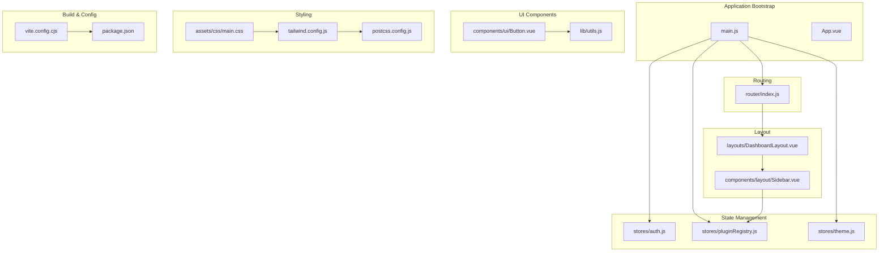
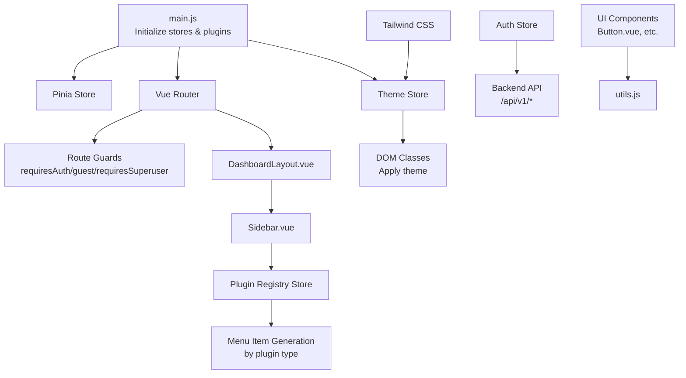
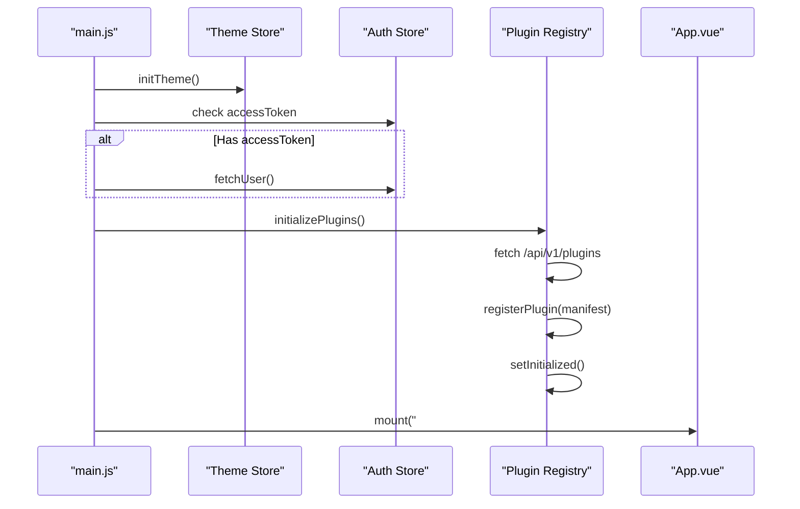
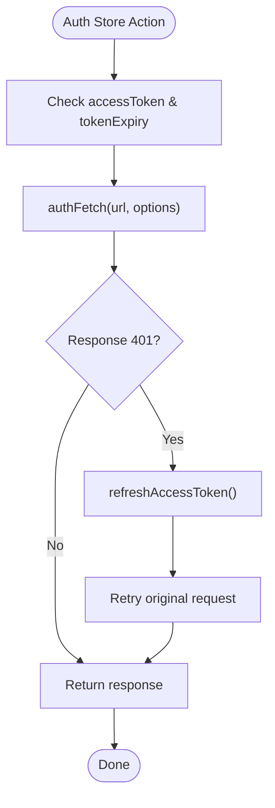
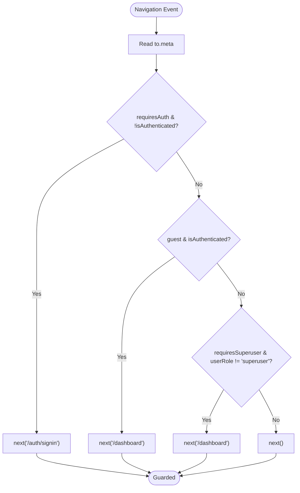
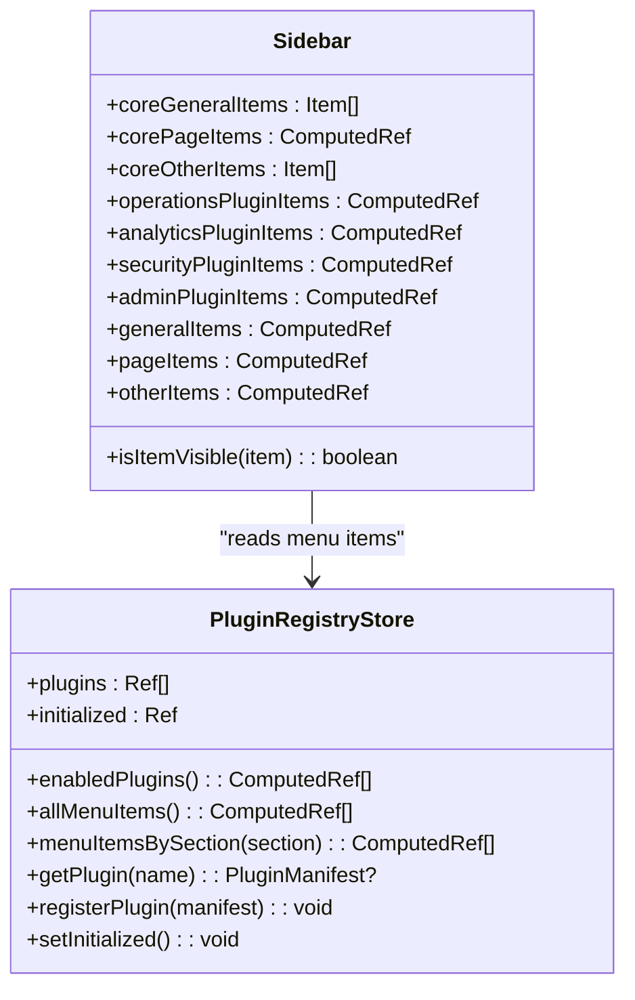
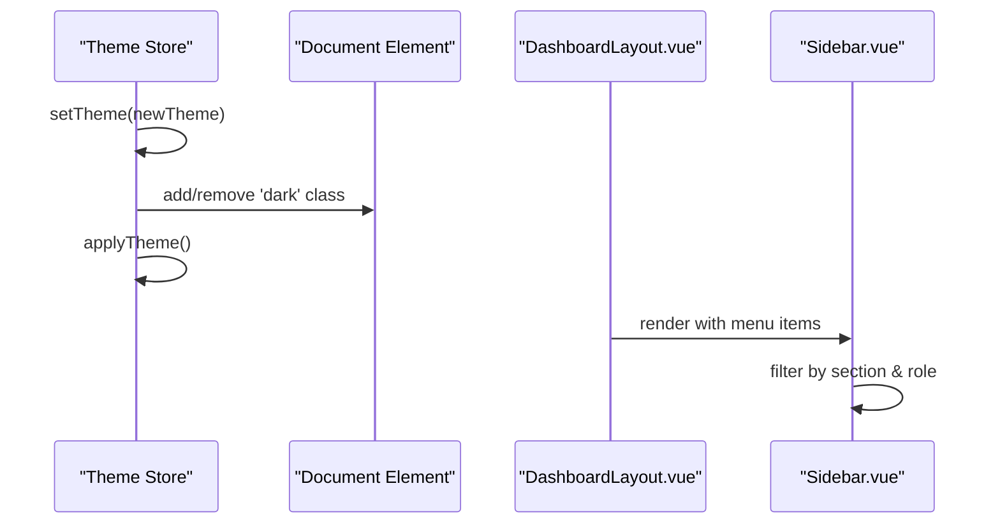
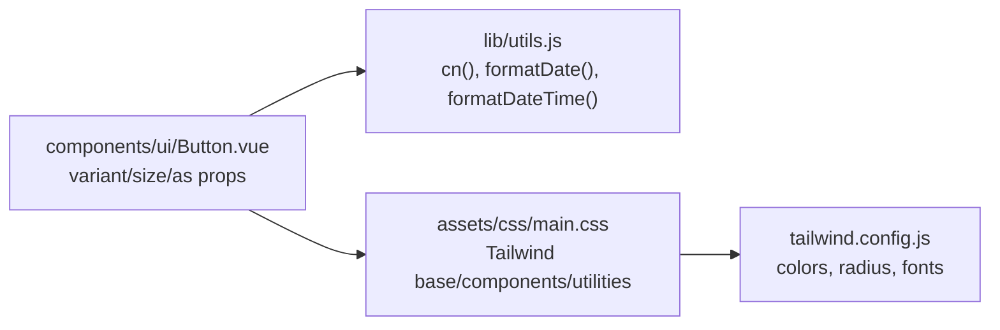
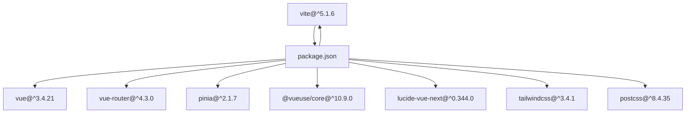

# Frontend Architecture

<cite>
**Referenced Files in This Document**
- [main.js](file://frontend/src/main.js)
- [App.vue](file://frontend/src/App.vue)
- [router/index.js](file://frontend/src/router/index.js)
- [stores/auth.js](file://frontend/src/stores/auth.js)
- [stores/pluginRegistry.js](file://frontend/src/stores/pluginRegistry.js)
- [stores/theme.js](file://frontend/src/stores/theme.js)
- [layouts/DashboardLayout.vue](file://frontend/src/layouts/DashboardLayout.vue)
- [components/layout/Sidebar.vue](file://frontend/src/components/layout/Sidebar.vue)
- [assets/css/main.css](file://frontend/src/assets/css/main.css)
- [tailwind.config.js](file://frontend/tailwind.config.js)
- [postcss.config.js](file://frontend/postcss.config.js)
- [lib/utils.js](file://frontend/src/lib/utils.js)
- [components/ui/Button.vue](file://frontend/src/components/ui/Button.vue)
- [vite.config.cjs](file://frontend/vite.config.cjs)
- [package.json](file://frontend/package.json)
</cite>

## Table of Contents
1. [Introduction](#introduction)
2. [Project Structure](#project-structure)
3. [Core Components](#core-components)
4. [Architecture Overview](#architecture-overview)
5. [Detailed Component Analysis](#detailed-component-analysis)
6. [Dependency Analysis](#dependency-analysis)
7. [Performance Considerations](#performance-considerations)
8. [Troubleshooting Guide](#troubleshooting-guide)
9. [Conclusion](#conclusion)

## Introduction
This document describes the frontend architecture of the SSO system, focusing on the Vue 3 application structure, state management with Pinia, routing with Vue Router, dynamic plugin system, theming, and UI component library. The frontend integrates with a backend API via a development proxy and supports responsive navigation with a collapsible sidebar, user authentication, and role-based access control.

## Project Structure
The frontend follows a modular structure organized by features and concerns:
- Application bootstrap and initialization in main.js
- Root component App.vue with global styles
- Routing configuration with protected routes and lazy-loaded plugin views
- State management stores for authentication, plugin registry, and theme
- Layout components with a dashboard layout and sidebar
- UI component library built with Tailwind CSS and shared utilities
- Build configuration using Vite with Tailwind and PostCSS

**Diagram sources**
- [main.js:1-164](file://frontend/src/main.js#L1-L164)
- [router/index.js:1-192](file://frontend/src/router/index.js#L1-L192)
- [stores/auth.js:1-198](file://frontend/src/stores/auth.js#L1-L198)
- [stores/pluginRegistry.js:1-53](file://frontend/src/stores/pluginRegistry.js#L1-L53)
- [stores/theme.js:1-59](file://frontend/src/stores/theme.js#L1-L59)
- [layouts/DashboardLayout.vue:1-134](file://frontend/src/layouts/DashboardLayout.vue#L1-L134)
- [components/layout/Sidebar.vue:1-291](file://frontend/src/components/layout/Sidebar.vue#L1-L291)
- [components/ui/Button.vue:1-66](file://frontend/src/components/ui/Button.vue#L1-L66)
- [lib/utils.js:1-27](file://frontend/src/lib/utils.js#L1-L27)
- [assets/css/main.css:1-77](file://frontend/src/assets/css/main.css#L1-L77)
- [tailwind.config.js:1-59](file://frontend/tailwind.config.js#L1-L59)
- [postcss.config.js:1-7](file://frontend/postcss.config.js#L1-L7)
- [vite.config.cjs:1-23](file://frontend/vite.config.cjs#L1-L23)
- [package.json:1-30](file://frontend/package.json#L1-L30)

**Section sources**
- [main.js:1-164](file://frontend/src/main.js#L1-L164)
- [router/index.js:1-192](file://frontend/src/router/index.js#L1-L192)
- [package.json:1-30](file://frontend/package.json#L1-L30)

## Core Components
- Application bootstrap initializes Pinia, router, theme, authentication, and dynamic plugin registry. It mounts the app after restoring session state and loading plugin metadata.
- Authentication store manages tokens, user profile, role checks, and automatic token refresh with retry logic.
- Plugin registry maintains loaded plugins, menu items, and computed aggregations for sidebar rendering.
- Theme store handles light/dark/system themes, persistence, and DOM class updates.
- Dashboard layout provides responsive navigation, mobile sidebar overlay, user dropdown, and content area.
- Sidebar composes core and plugin menu sections with role-based visibility and ordering.
- UI components use Tailwind classes with shared utility functions for conditional class merging and date formatting.

**Section sources**
- [main.js:143-164](file://frontend/src/main.js#L143-L164)
- [stores/auth.js:4-198](file://frontend/src/stores/auth.js#L4-L198)
- [stores/pluginRegistry.js:4-53](file://frontend/src/stores/pluginRegistry.js#L4-L53)
- [stores/theme.js:4-59](file://frontend/src/stores/theme.js#L4-L59)
- [layouts/DashboardLayout.vue:1-134](file://frontend/src/layouts/DashboardLayout.vue#L1-L134)
- [components/layout/Sidebar.vue:1-291](file://frontend/src/components/layout/Sidebar.vue#L1-L291)
- [lib/utils.js:1-27](file://frontend/src/lib/utils.js#L1-L27)

## Architecture Overview
The frontend architecture centers around a layered design:
- Entry point initializes stores and plugins, then mounts the app.
- Router guards enforce authentication and role-based access.
- Stores encapsulate domain logic for auth, plugins, and theme.
- Layout and components render UI with Tailwind CSS utility classes.
- Build pipeline processes Vue SFCs, aliases module paths, and proxies API requests.

**Diagram sources**
- [main.js:143-164](file://frontend/src/main.js#L143-L164)
- [router/index.js:177-189](file://frontend/src/router/index.js#L177-L189)
- [layouts/DashboardLayout.vue:1-134](file://frontend/src/layouts/DashboardLayout.vue#L1-L134)
- [components/layout/Sidebar.vue:1-291](file://frontend/src/components/layout/Sidebar.vue#L1-L291)
- [stores/auth.js:29-197](file://frontend/src/stores/auth.js#L29-L197)
- [stores/pluginRegistry.js:26-50](file://frontend/src/stores/pluginRegistry.js#L26-L50)
- [stores/theme.js:23-46](file://frontend/src/stores/theme.js#L23-L46)
- [components/ui/Button.vue:1-66](file://frontend/src/components/ui/Button.vue#L1-L66)
- [lib/utils.js:1-27](file://frontend/src/lib/utils.js#L1-L27)
- [assets/css/main.css:1-77](file://frontend/src/assets/css/main.css#L1-L77)

## Detailed Component Analysis

### Application Initialization Flow
The initialization sequence ensures proper startup order: theme initialization, optional session restoration, plugin discovery, and app mounting.

**Diagram sources**
- [main.js:143-164](file://frontend/src/main.js#L143-L164)
- [stores/theme.js:32-46](file://frontend/src/stores/theme.js#L32-L46)
- [stores/auth.js:91-103](file://frontend/src/stores/auth.js#L91-L103)
- [stores/pluginRegistry.js:26-40](file://frontend/src/stores/pluginRegistry.js#L26-L40)

**Section sources**
- [main.js:19-52](file://frontend/src/main.js#L19-L52)
- [main.js:143-164](file://frontend/src/main.js#L143-L164)

### Authentication and Token Management
The authentication store encapsulates login, registration, session restoration, token refresh, logout, and a wrapper for authenticated fetches. It persists tokens and expiry in localStorage and computes derived state for roles and authentication status.

**Diagram sources**
- [stores/auth.js:160-177](file://frontend/src/stores/auth.js#L160-L177)
- [stores/auth.js:105-134](file://frontend/src/stores/auth.js#L105-L134)

**Section sources**
- [stores/auth.js:4-198](file://frontend/src/stores/auth.js#L4-L198)

### Route Protection and Navigation Guards
The router enforces route protection using meta flags and redirects unauthorized or unauthenticated users. It also defines lazy-loaded plugin routes and nested settings routes.

**Diagram sources**
- [router/index.js:177-189](file://frontend/src/router/index.js#L177-L189)

**Section sources**
- [router/index.js:37-192](file://frontend/src/router/index.js#L37-L192)

### Plugin Registry and Dynamic Menus
The plugin registry aggregates plugin manifests and exposes computed menu items grouped by sections. The sidebar renders these items with role-based visibility and ordering.

**Diagram sources**
- [stores/pluginRegistry.js:4-53](file://frontend/src/stores/pluginRegistry.js#L4-L53)
- [components/layout/Sidebar.vue:46-256](file://frontend/src/components/layout/Sidebar.vue#L46-L256)

**Section sources**
- [stores/pluginRegistry.js:1-53](file://frontend/src/stores/pluginRegistry.js#L1-L53)
- [components/layout/Sidebar.vue:1-291](file://frontend/src/components/layout/Sidebar.vue#L1-L291)

### Theming and Responsive Layout
The theme store applies light/dark/system themes by toggling a root class and watching theme changes. The dashboard layout provides a responsive header with theme toggle, user dropdown, and collapsible sidebar for mobile.

**Diagram sources**
- [stores/theme.js:17-46](file://frontend/src/stores/theme.js#L17-L46)
- [layouts/DashboardLayout.vue:66-131](file://frontend/src/layouts/DashboardLayout.vue#L66-L131)
- [components/layout/Sidebar.vue:28-44](file://frontend/src/components/layout/Sidebar.vue#L28-L44)

**Section sources**
- [stores/theme.js:1-59](file://frontend/src/stores/theme.js#L1-L59)
- [layouts/DashboardLayout.vue:1-134](file://frontend/src/layouts/DashboardLayout.vue#L1-L134)
- [components/layout/Sidebar.vue:1-291](file://frontend/src/components/layout/Sidebar.vue#L1-L291)

### UI Component Library and Utilities
Shared utilities merge Tailwind classes safely and format dates. The Button component demonstrates variant and size styling with class variance authority.

**Diagram sources**
- [lib/utils.js:1-27](file://frontend/src/lib/utils.js#L1-L27)
- [components/ui/Button.vue:1-66](file://frontend/src/components/ui/Button.vue#L1-L66)
- [assets/css/main.css:1-77](file://frontend/src/assets/css/main.css#L1-L77)
- [tailwind.config.js:1-59](file://frontend/tailwind.config.js#L1-L59)

**Section sources**
- [lib/utils.js:1-27](file://frontend/src/lib/utils.js#L1-L27)
- [components/ui/Button.vue:1-66](file://frontend/src/components/ui/Button.vue#L1-L66)
- [assets/css/main.css:1-77](file://frontend/src/assets/css/main.css#L1-L77)
- [tailwind.config.js:1-59](file://frontend/tailwind.config.js#L1-L59)

## Dependency Analysis
The frontend relies on Vue 3 ecosystem libraries and a build toolchain configured for rapid development and production builds.

**Diagram sources**
- [package.json:11-29](file://frontend/package.json#L11-L29)

**Section sources**
- [package.json:1-30](file://frontend/package.json#L1-30)

## Performance Considerations
- Lazy-loading plugin routes reduces initial bundle size and improves perceived load time.
- Local storage caching for tokens minimizes network requests during session restoration.
- Computed properties in stores avoid redundant calculations and keep UI reactive.
- Tailwind CSS utility classes enable efficient styling without heavy CSS frameworks.
- Vite dev server proxy simplifies local development by forwarding API requests to the backend.

## Troubleshooting Guide
Common issues and resolutions:
- Authentication failures: Verify token presence and expiry; ensure authFetch retries on 401 responses and logs out on persistent failures.
- Plugin menu missing: Confirm backend returns plugin list with status "loaded" and that manifests include valid menu items.
- Theme not applying: Check theme store initialization and DOM class toggling; confirm Tailwind dark mode class matches configuration.
- Route guard redirects: Review meta flags and user role checks; ensure superuser-only routes are properly guarded.
- Build proxy errors: Validate Vite proxy configuration targets the correct backend host and port.

**Section sources**
- [stores/auth.js:160-177](file://frontend/src/stores/auth.js#L160-L177)
- [stores/auth.js:136-158](file://frontend/src/stores/auth.js#L136-L158)
- [main.js:19-52](file://frontend/src/main.js#L19-L52)
- [stores/theme.js:23-46](file://frontend/src/stores/theme.js#L23-L46)
- [router/index.js:177-189](file://frontend/src/router/index.js#L177-L189)
- [vite.config.cjs:15-21](file://frontend/vite.config.cjs#L15-L21)

## Conclusion
The frontend architecture leverages Vue 3, Pinia, and Vue Router to deliver a modular, secure, and extensible user interface. The dynamic plugin system, robust authentication flow, responsive layout, and utility-driven UI components form a cohesive foundation for the SSO platform. The build configuration and styling pipeline support efficient development and consistent theming across environments.