# Frontend Architecture

<cite>
**Referenced Files in This Document**
- [main.js](file://frontend/src/main.js)
- [App.vue](file://frontend/src/App.vue)
- [router/index.js](file://frontend/src/router/index.js)
- [stores/auth.js](file://frontend/src/stores/auth.js)
- [stores/pluginRegistry.js](file://frontend/src/stores/pluginRegistry.js)
- [stores/theme.js](file://frontend/src/stores/theme.js)
- [layouts/DashboardLayout.vue](file://frontend/src/layouts/DashboardLayout.vue)
- [components/layout/Sidebar.vue](file://frontend/src/components/layout/Sidebar.vue)
- [components/layout/SidebarItem.vue](file://frontend/src/components/layout/SidebarItem.vue)
- [components/ui/Button.vue](file://frontend/src/components/ui/Button.vue)
- [components/ui/ThemeToggle.vue](file://frontend/src/components/ui/ThemeToggle.vue)
- [plugins/incidents/views/IncidentsList.vue](file://frontend/src/plugins/incidents/views/IncidentsList.vue)
- [views/users/Users.vue](file://frontend/src/views/users/Users.vue)
- [assets/css/main.css](file://frontend/src/assets/css/main.css)
- [lib/utils.js](file://frontend/src/lib/utils.js)
- [tailwind.config.js](file://frontend/tailwind.config.js)
- [vite.config.cjs](file://frontend/vite.config.cjs)
- [package.json](file://frontend/package.json)
</cite>

## Update Summary
**Changes Made**
- Updated Application Bootstrap section to reflect improved initialization sequence
- Enhanced Core Components section with detailed initialization flow
- Added new section on Application Initialization Sequence
- Updated Architecture Overview to show proper initialization order
- Modified Detailed Component Analysis to include initialization sequence details
- Added comprehensive User Management Interface section
- Updated Route Protection section with requiresSuperuser implementation
- Enhanced Sidebar Navigation section with role-based visibility rules

## Table of Contents
1. [Introduction](#introduction)
2. [Project Structure](#project-structure)
3. [Application Initialization Sequence](#application-initialization-sequence)
4. [Core Components](#core-components)
5. [Architecture Overview](#architecture-overview)
6. [Detailed Component Analysis](#detailed-component-analysis)
7. [User Management Interface](#user-management-interface)
8. [Route Protection and Access Control](#route-protection-and-access-control)
9. [Dependency Analysis](#dependency-analysis)
10. [Performance Considerations](#performance-considerations)
11. [Troubleshooting Guide](#troubleshooting-guide)
12. [Conclusion](#conclusion)
13. [Appendices](#appendices)

## Introduction
This document describes the frontend architecture of the Vue 3 application. It covers the component-based architecture, state management with Pinia, routing with Vue Router, and the plugin registry system. It also documents the layout system, reusable UI components, integration with backend APIs, component hierarchy, data flow patterns, and communication between the frontend and backend. Additional topics include the plugin view integration system, dynamic component loading, theme management, responsive design principles, accessibility considerations, and performance optimization strategies.

**Updated** The application now implements an improved initialization sequence that ensures consistent visual presentation from the moment users access the interface, along with a comprehensive user management system and enhanced role-based access control.

## Project Structure
The frontend is organized around a clear separation of concerns with an optimized initialization sequence:
- Application bootstrap and initialization in main.js with proper ordering
- Root component rendering via App.vue
- Routing configuration and navigation guards in router/index.js
- Feature-specific views under views/
- Layout components under layouts/
- Reusable UI components under components/ui/
- Plugin-specific views under plugins/<plugin>/views/
- State management stores under stores/
- Utility helpers under lib/
- Styling via Tailwind CSS and global CSS

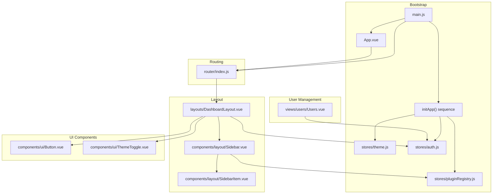

**Diagram sources**
- [main.js:125-143](file://frontend/src/main.js#L125-L143)
- [stores/theme.js:32-46](file://frontend/src/stores/theme.js#L32-L46)
- [stores/auth.js:91-103](file://frontend/src/stores/auth.js#L91-L103)
- [stores/pluginRegistry.js:1-53](file://frontend/src/stores/pluginRegistry.js#L1-L53)
- [views/users/Users.vue:1-407](file://frontend/src/views/users/Users.vue#L1-L407)

**Section sources**
- [main.js:1-146](file://frontend/src/main.js#L1-L146)
- [router/index.js:1-180](file://frontend/src/router/index.js#L1-L180)

## Application Initialization Sequence
The application implements a carefully orchestrated initialization sequence to ensure optimal user experience:

### Initialization Order
1. **Theme Store Initialization** (`initTheme()`)
   - Sets default light theme if not configured
   - Applies CSS classes to document element
   - Listens for system theme changes
   - Ensures consistent visual presentation immediately

2. **Authentication State Restoration**
   - Checks for existing access tokens
   - Restores user session if tokens are valid
   - Handles expired or invalid tokens gracefully

3. **Plugin Registry Setup**
   - Fetches plugin metadata from backend
   - Registers plugins with menu items
   - Sets initialization flag for downstream components

4. **Application Mounting**
   - Mounts the Vue application
   - Router becomes active
   - Components render with proper theme and state

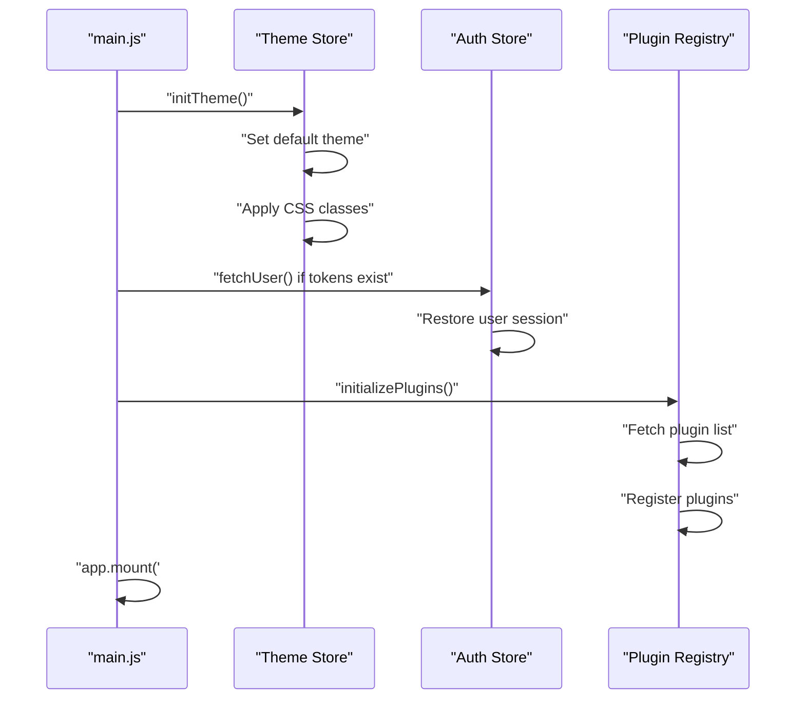

**Diagram sources**
- [main.js:125-143](file://frontend/src/main.js#L125-L143)
- [stores/theme.js:32-46](file://frontend/src/stores/theme.js#L32-L46)
- [stores/auth.js:91-103](file://frontend/src/stores/auth.js#L91-L103)

**Section sources**
- [main.js:125-143](file://frontend/src/main.js#L125-L143)
- [stores/theme.js:32-46](file://frontend/src/stores/theme.js#L32-L46)

## Core Components
- **Application bootstrap** initializes Pinia, Vue Router, and performs pre-mount tasks in the correct order:
  - **Critical improvement**: Theme store is initialized first to ensure consistent visual presentation
  - Authentication state restoration with proper error handling
  - Dynamic plugin metadata loading and registration
  - Mounts the root application
- Root component renders the active route via RouterView
- Router defines core routes, nested settings routes, help pages, and plugin routes with lazy loading
- Stores:
  - Authentication store manages tokens, roles, and secure fetches
  - Plugin registry aggregates plugin manifests and menu items
  - Theme store manages light/dark/system themes and applies CSS classes

Key responsibilities:
- main.js orchestrates initialization with proper ordering and error handling
- router/index.js controls navigation and guards
- stores provide centralized state for auth, plugins, and theme
- views and components consume stores and render UI

**Updated** The initialization sequence now prioritizes theme setup before authentication to prevent visual inconsistencies during the loading process.

**Section sources**
- [main.js:1-146](file://frontend/src/main.js#L1-L146)
- [App.vue:1-17](file://frontend/src/App.vue#L1-L17)
- [router/index.js:1-180](file://frontend/src/router/index.js#L1-L180)
- [stores/auth.js:1-198](file://frontend/src/stores/auth.js#L1-L198)
- [stores/pluginRegistry.js:1-53](file://frontend/src/stores/pluginRegistry.js#L1-L53)
- [stores/theme.js:1-59](file://frontend/src/stores/theme.js#L1-L59)

## Architecture Overview
The frontend follows a layered architecture with optimized initialization:
- Presentation Layer: Views and components
- Layout Layer: DashboardLayout and Sidebar
- State Management: Pinia stores with proper initialization order
- Routing: Vue Router with lazy-loaded plugin routes and enhanced access control
- Styling: Tailwind CSS with CSS custom properties and dark mode support
- Backend Integration: REST endpoints accessed via fetch wrappers

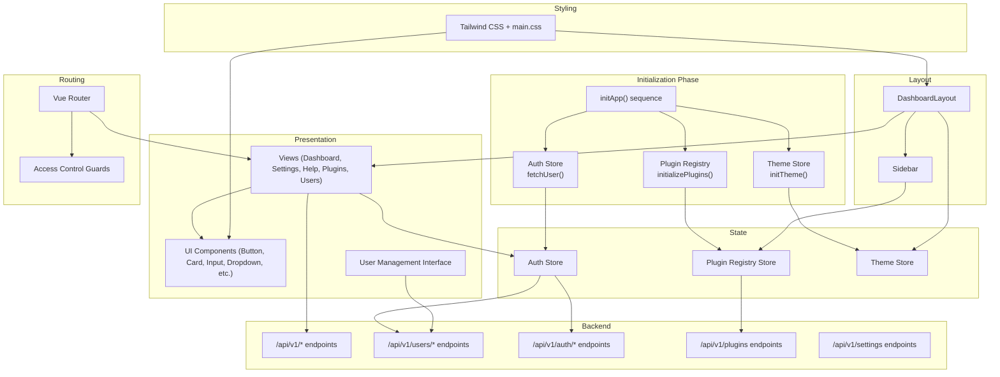

**Diagram sources**
- [main.js:125-143](file://frontend/src/main.js#L125-L143)
- [stores/theme.js:32-46](file://frontend/src/stores/theme.js#L32-L46)
- [stores/auth.js:91-103](file://frontend/src/stores/auth.js#L91-L103)
- [stores/pluginRegistry.js:19-52](file://frontend/src/stores/pluginRegistry.js#L19-L52)
- [views/users/Users.vue:32-104](file://frontend/src/views/users/Users.vue#L32-L104)

## Detailed Component Analysis

### Application Bootstrap and Initialization
The main application file implements a sophisticated initialization sequence:

**Initialization Steps**:
1. **Theme Setup** (`initTheme()`)
   - Sets default light theme if not configured
   - Applies CSS classes to document element immediately
   - Listens for system theme changes
   - Prevents visual flickering during loading

2. **Authentication Restoration**
   - Checks for existing access tokens in localStorage
   - Validates token expiration
   - Restores user session if tokens are valid
   - Handles expired or invalid tokens gracefully

3. **Plugin Registration**
   - Fetches plugin metadata from `/api/v1/plugins`
   - Registers plugins with menu items and sections
   - Sets initialization flag for downstream components

4. **Application Mounting**
   - Mounts the Vue application
   - Router becomes active
   - Components render with proper theme and state

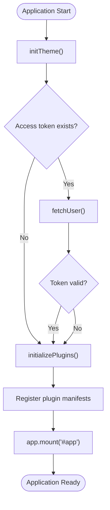

**Diagram sources**
- [main.js:125-143](file://frontend/src/main.js#L125-L143)
- [stores/theme.js:32-46](file://frontend/src/stores/theme.js#L32-L46)
- [stores/auth.js:91-103](file://frontend/src/stores/auth.js#L91-L103)

**Section sources**
- [main.js:125-143](file://frontend/src/main.js#L125-L143)
- [stores/theme.js:32-46](file://frontend/src/stores/theme.js#L32-L46)

### Authentication and Session Management
The authentication store encapsulates:
- Token lifecycle (access/refresh), expiry checks, and persistence
- Role-based access (admin/user/superuser)
- Secure fetch wrapper that automatically retries on 401 with token refresh
- Logout with backend cleanup

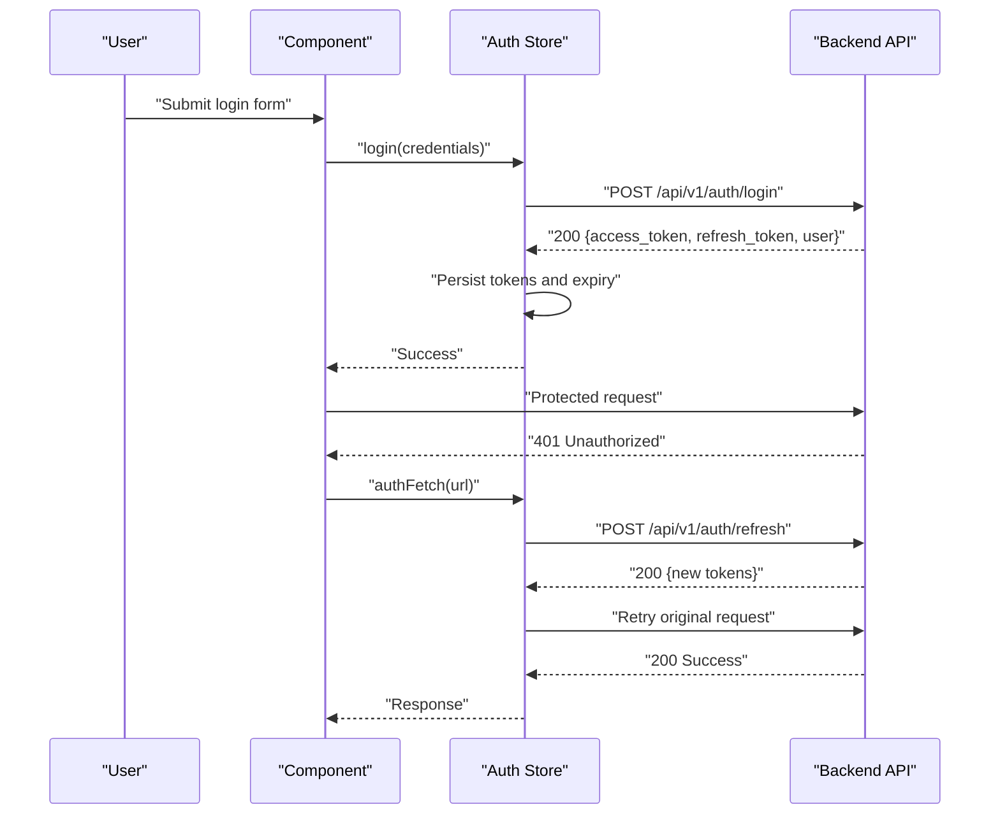

**Diagram sources**
- [stores/auth.js:29-197](file://frontend/src/stores/auth.js#L29-L197)

**Section sources**
- [stores/auth.js:1-198](file://frontend/src/stores/auth.js#L1-L198)

### Plugin Registry and Dynamic Menu
The plugin registry:
- Registers plugin manifests with metadata and menu items
- Exposes computed aggregations (enabled plugins, menu items by section)
- Provides lookup and initialization state

Dynamic plugin loading:
- On startup, main.js fetches plugin list from backend
- For each loaded plugin, constructs a manifest and registers it
- Menu items are injected into the sidebar by section

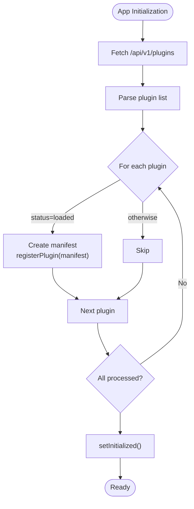

**Diagram sources**
- [main.js:19-52](file://frontend/src/main.js#L19-L52)
- [stores/pluginRegistry.js:26-40](file://frontend/src/stores/pluginRegistry.js#L26-L40)

**Section sources**
- [main.js:19-146](file://frontend/src/main.js#L19-L146)
- [stores/pluginRegistry.js:1-53](file://frontend/src/stores/pluginRegistry.js#L1-L53)

### Routing and Navigation Guards
Router configuration:
- Lazy loads plugin views using dynamic imports
- Defines nested routes for settings and children redirection
- Enforces guards:
  - requiresAuth for protected areas
  - guest for auth pages when already logged in
  - requiresSuperuser for superuser-only routes

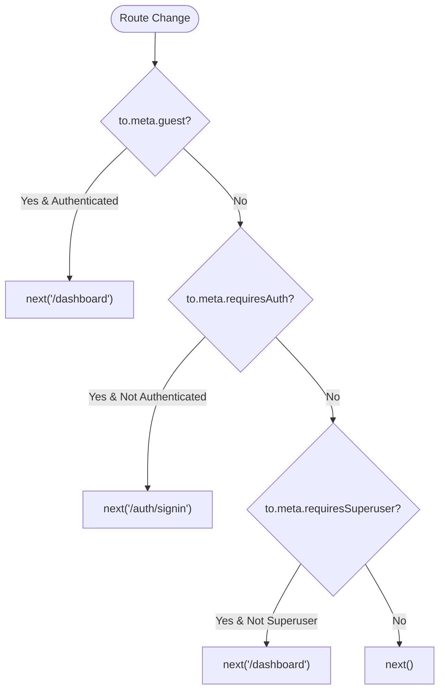

**Diagram sources**
- [router/index.js:165-177](file://frontend/src/router/index.js#L165-L177)

**Section sources**
- [router/index.js:1-180](file://frontend/src/router/index.js#L1-L180)

### Layout System and Sidebar
DashboardLayout coordinates:
- Desktop sidebar and mobile overlay/slide
- Header with theme toggle and user dropdown
- Main content area via RouterView

Sidebar composes:
- Core items (Dashboard, Users for admins, Settings, Help)
- Plugin sections (Operations, Analytics, Security, Admin, Pages, Other)
- Visibility controlled by roles and computed aggregations from plugin registry
- Collapsible groups for parent items with children

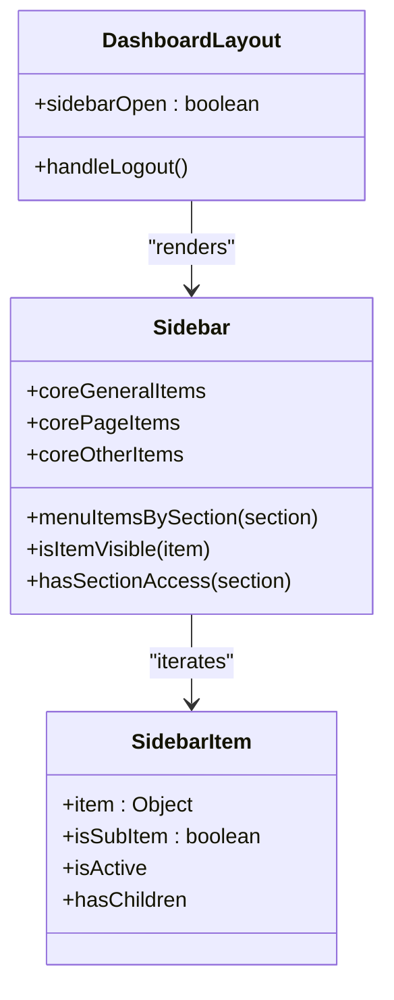

**Diagram sources**
- [layouts/DashboardLayout.vue:1-125](file://frontend/src/layouts/DashboardLayout.vue#L1-L125)
- [components/layout/Sidebar.vue:1-277](file://frontend/src/components/layout/Sidebar.vue#L1-L277)
- [components/layout/SidebarItem.vue:1-74](file://frontend/src/components/layout/SidebarItem.vue#L1-L74)

**Section sources**
- [layouts/DashboardLayout.vue:1-125](file://frontend/src/layouts/DashboardLayout.vue#L1-L125)
- [components/layout/Sidebar.vue:1-277](file://frontend/src/components/layout/Sidebar.vue#L1-L277)
- [components/layout/SidebarItem.vue:1-74](file://frontend/src/components/layout/SidebarItem.vue#L1-L74)

### Reusable UI Components
Button component demonstrates:
- Variants and sizes via class variance authority
- Support for tag switching (button/a/span/etc.)
- Composable class merging with cn

ThemeToggle integrates:
- Dropdown menu for theme selection
- Delegates to theme store to apply CSS classes

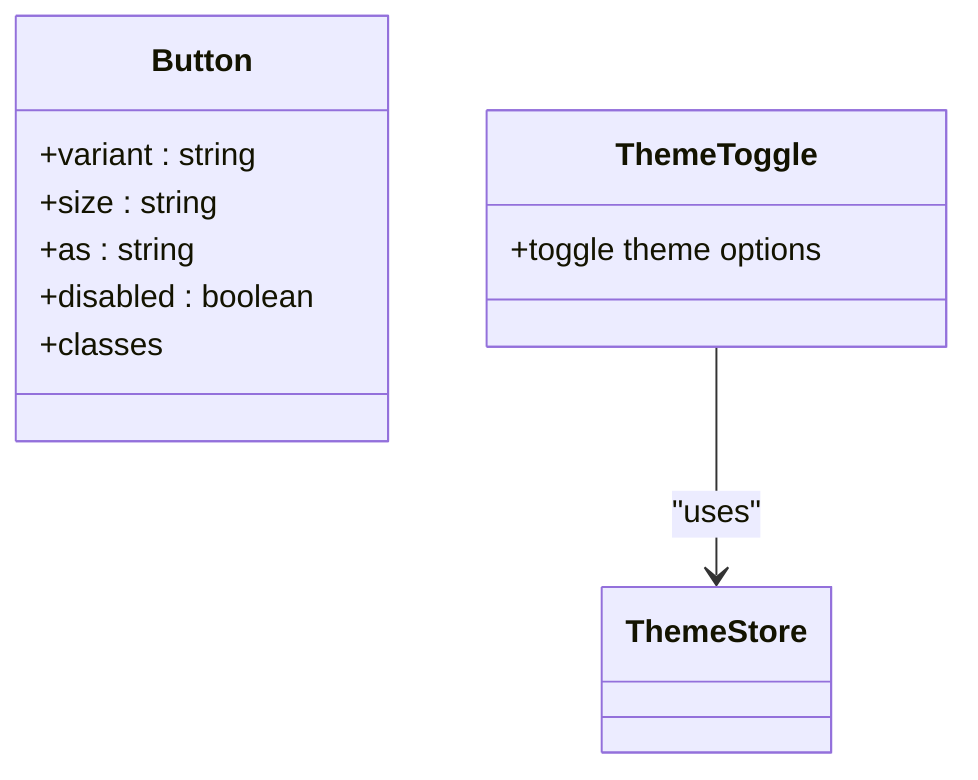

**Diagram sources**
- [components/ui/Button.vue:1-66](file://frontend/src/components/ui/Button.vue#L1-L66)
- [components/ui/ThemeToggle.vue:1-36](file://frontend/src/components/ui/ThemeToggle.vue#L1-L36)
- [stores/theme.js:1-59](file://frontend/src/stores/theme.js#L1-L59)

**Section sources**
- [components/ui/Button.vue:1-66](file://frontend/src/components/ui/Button.vue#L1-L66)
- [components/ui/ThemeToggle.vue:1-36](file://frontend/src/components/ui/ThemeToggle.vue#L1-L36)
- [stores/theme.js:1-59](file://frontend/src/stores/theme.js#L1-L59)

### Plugin View Integration and Data Flow
Incidents plugin view illustrates:
- Fetching data via authStore.authFetch
- Creating/updating resources with proper HTTP methods
- Rendering lists with severity/status badges and action buttons
- Using dynamic components for icons

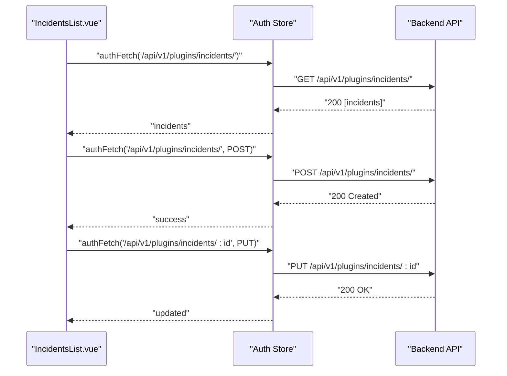

**Diagram sources**
- [plugins/incidents/views/IncidentsList.vue:41-104](file://frontend/src/plugins/incidents/views/IncidentsList.vue#L41-L104)
- [stores/auth.js:160-177](file://frontend/src/stores/auth.js#L160-L177)

**Section sources**
- [plugins/incidents/views/IncidentsList.vue:1-268](file://frontend/src/plugins/incidents/views/IncidentsList.vue#L1-L268)
- [stores/auth.js:1-198](file://frontend/src/stores/auth.js#L1-L198)

### Theme Management
Theme store:
- Tracks selected theme and system preference
- Applies CSS class to document element for dark mode
- Watches theme changes and updates DOM accordingly
- Initializes listener for OS theme changes

**Updated** The theme initialization now occurs before authentication restoration, ensuring immediate visual consistency.

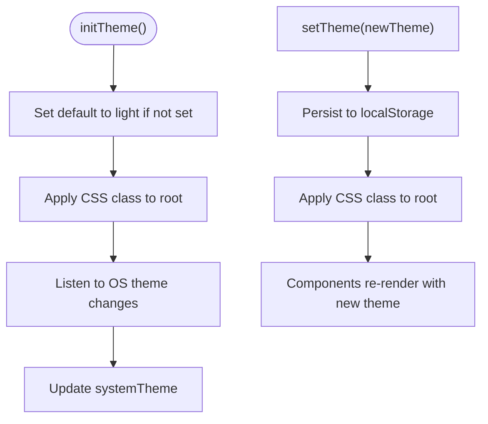

**Diagram sources**
- [stores/theme.js:32-46](file://frontend/src/stores/theme.js#L32-L46)

**Section sources**
- [stores/theme.js:1-59](file://frontend/src/stores/theme.js#L1-L59)
- [assets/css/main.css:31-51](file://frontend/src/assets/css/main.css#L31-L51)

## User Management Interface

The application now includes a comprehensive user management system designed for superuser access:

### Features
- **User Listing**: Displays all system users with filtering and sorting capabilities
- **User Creation**: Form-based creation with validation and role assignment
- **User Editing**: Modal-based editing with password change options
- **User Deletion**: Confirmation-based deletion with safety checks
- **Role Management**: Distinct role-based UI elements (user vs superuser badges)
- **Status Management**: Active/inactive user toggles
- **Real-time Updates**: Automatic refresh of user lists after operations

### Implementation Details
- **Data Flow**: Uses authStore.authFetch for all user operations
- **Form Handling**: Comprehensive form validation and error handling
- **Modal System**: Separate modals for create and edit operations
- **Role-Based UI**: Different badge variants for user roles
- **Security**: Prevents self-deletion and restricts role changes

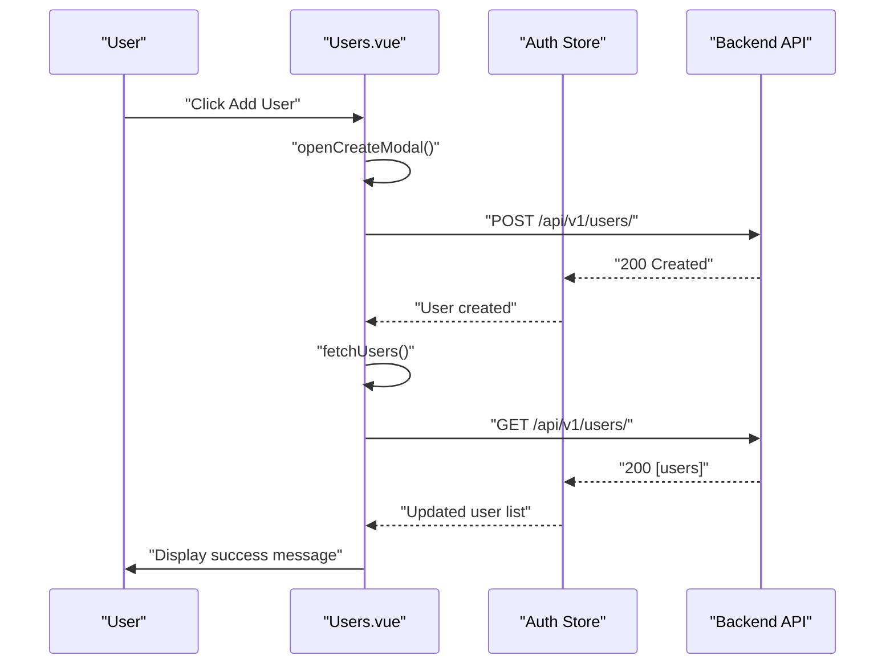

**Diagram sources**
- [views/users/Users.vue:48-65](file://frontend/src/views/users/Users.vue#L48-L65)
- [views/users/Users.vue:32-46](file://frontend/src/views/users/Users.vue#L32-L46)

**Section sources**
- [views/users/Users.vue:1-407](file://frontend/src/views/users/Users.vue#L1-L407)

## Route Protection and Access Control

The application implements a multi-layered access control system:

### Role-Based Access Control
- **Guest Routes**: Accessible only when not authenticated
- **Authenticated Routes**: Require valid authentication
- **Superuser Routes**: Restricted to superuser role only
- **Role Checking**: Centralized role validation through auth store

### Implementation Details
- **requiresAuth**: Basic authentication requirement
- **guest**: Prevents authenticated users from accessing auth pages
- **requiresSuperuser**: Advanced role-based restriction
- **Dynamic Role Checking**: Computed properties for role evaluation

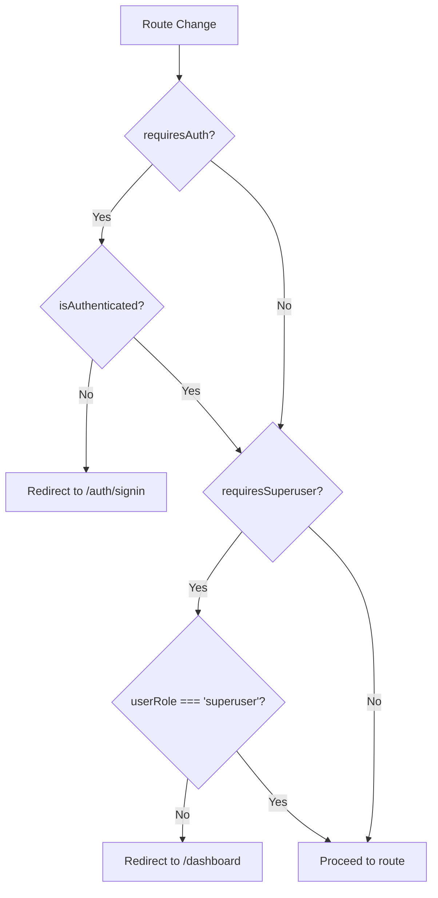

**Diagram sources**
- [router/index.js:165-177](file://frontend/src/router/index.js#L165-L177)
- [stores/auth.js:19-27](file://frontend/src/stores/auth.js#L19-L27)

**Section sources**
- [router/index.js:1-180](file://frontend/src/router/index.js#L1-L180)
- [stores/auth.js:1-198](file://frontend/src/stores/auth.js#L1-L198)

## Dependency Analysis
External dependencies and integrations:
- Vue 3, Vue Router, Pinia for framework and state
- lucide-vue-next for icons
- class-variance-authority, clsx, tailwind-merge for component styling
- Tailwind CSS for utility-first styling and dark mode
- Vite for dev/build tooling with proxy to backend

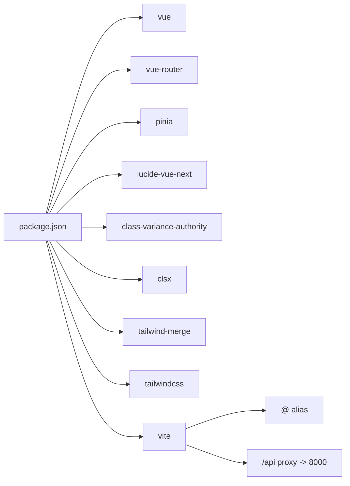

**Diagram sources**
- [package.json:11-29](file://frontend/package.json#L11-L29)
- [vite.config.cjs:5-22](file://frontend/vite.config.cjs#L5-L22)

**Section sources**
- [package.json:1-30](file://frontend/package.json#L1-L30)
- [vite.config.cjs:1-23](file://frontend/vite.config.cjs#L1-L23)
- [tailwind.config.js:1-59](file://frontend/tailwind.config.js#L1-L59)

## Performance Considerations
- Lazy loading of plugin routes reduces initial bundle size
- Component composition and shared UI primitives minimize duplication
- Tailwind CSS utility classes reduce CSS overhead while enabling rapid iteration
- Local storage caching for tokens avoids repeated network requests during sessions
- Dark mode via CSS classes avoids expensive runtime computations
- Vite's development server with proxy enables efficient local iteration

**Updated** The improved initialization sequence prevents visual flickering and ensures consistent theme application from page load.

Recommendations:
- Keep plugin manifests minimal; defer heavy assets to plugin views
- Use Suspense boundaries for long-loading plugin routes if needed
- Debounce frequent UI interactions (filters, search) in plugin views
- Consider pagination for large datasets in plugin views
- Audit Tailwind classes to remove unused styles in production builds

## Troubleshooting Guide
Common issues and resolutions:
- Authentication failures:
  - Verify tokens in localStorage and expiry timestamps
  - Ensure authFetch handles 401 and refresh flow
  - Confirm backend endpoints are reachable via proxy
- Plugin menu missing:
  - Check backend plugin list endpoint and status field
  - Confirm plugin registry initialization flag
- Theme not applying:
  - Ensure CSS class is applied to document root
  - Verify Tailwind dark mode configuration
- Styling inconsistencies:
  - Confirm Tailwind directives and custom properties are present
  - Check for conflicting CSS overrides
- **New**: Initialization sequence issues:
  - Verify theme store initializes before authentication
  - Check for proper error handling in initApp()
  - Ensure plugin initialization completes before mounting
- **New**: User management issues:
  - Verify superuser role for accessing user management
  - Check backend user endpoints availability
  - Ensure proper error handling for user operations
- **New**: Access control issues:
  - Verify role-based navigation rules
  - Check requiresSuperuser meta field implementation
  - Confirm sidebar role-based visibility logic

**Section sources**
- [stores/auth.js:136-177](file://frontend/src/stores/auth.js#L136-L177)
- [main.js:125-143](file://frontend/src/main.js#L125-L143)
- [stores/theme.js:23-46](file://frontend/src/stores/theme.js#L23-L46)
- [assets/css/main.css:1-77](file://frontend/src/assets/css/main.css#L1-L77)
- [views/users/Users.vue:32-104](file://frontend/src/views/users/Users.vue#L32-L104)

## Conclusion
The frontend employs a clean, modular architecture centered on Vue 3, Pinia, and Vue Router. The recent improvements to the application initialization sequence ensure consistent visual presentation from the moment users access the interface. The addition of a comprehensive user management system provides superuser access to manage system users with role-based restrictions. The enhanced route protection system with requiresSuperuser meta field ensures proper access control across the application. The plugin registry system enables dynamic integration of features, while the layout and UI components provide a consistent, accessible, and responsive experience. Theme management and Tailwind CSS support both light and dark modes. The authentication store ensures secure, resilient communication with backend APIs. Together, these patterns deliver a scalable and maintainable frontend foundation with improved user experience and robust access control.

## Appendices

### Responsive Design Principles
- Mobile-first layout with breakpoint-aware spacing and typography
- Collapsible sidebar for small screens with overlay and slide transitions
- Grid-based plugin views adapt to screen size
- Accessible focus states and semantic markup

**Section sources**
- [layouts/DashboardLayout.vue:23-124](file://frontend/src/layouts/DashboardLayout.vue#L23-L124)
- [plugins/incidents/views/IncidentsList.vue:198-265](file://frontend/src/plugins/incidents/views/IncidentsList.vue#L198-L265)
- [assets/css/main.css:54-77](file://frontend/src/assets/css/main.css#L54-L77)

### Accessibility Considerations
- Semantic HTML and proper labeling for inputs and buttons
- Keyboard navigable dropdown menus and collapsible sections
- Focus-visible outlines and visible focus states
- Color contrast compliant with Tailwind color tokens
- ARIA-friendly component composition

**Section sources**
- [components/ui/Button.vue:25-53](file://frontend/src/components/ui/Button.vue#L25-L53)
- [components/layout/SidebarItem.vue:34-72](file://frontend/src/components/layout/SidebarItem.vue#L34-L72)
- [views/users/Users.vue:145-407](file://frontend/src/views/users/Users.vue#L145-L407)