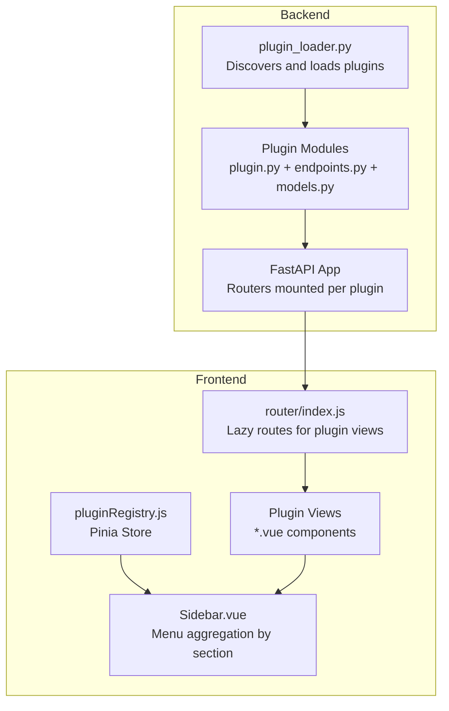
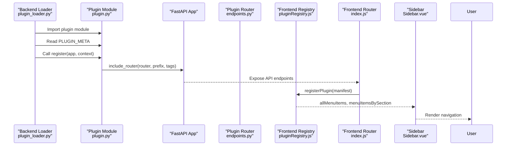
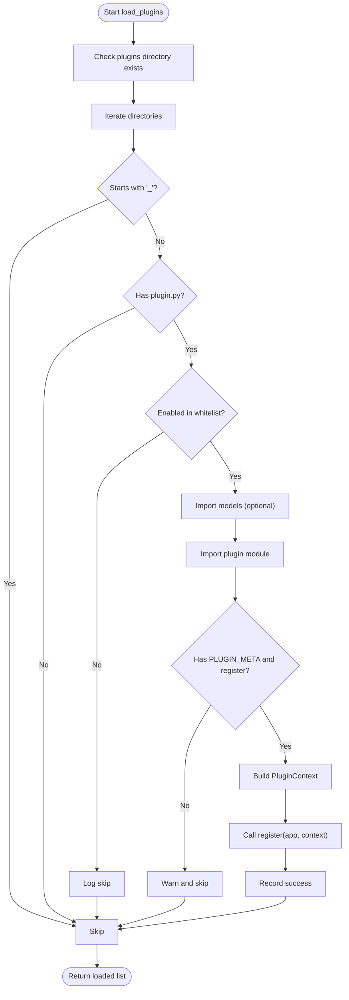
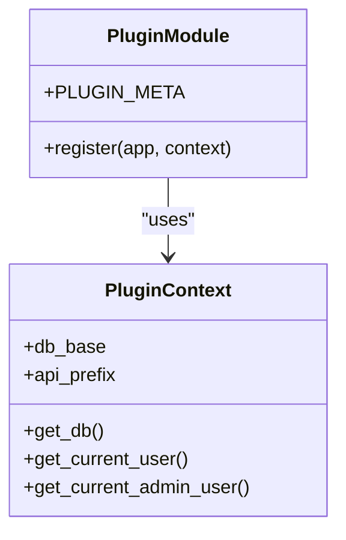
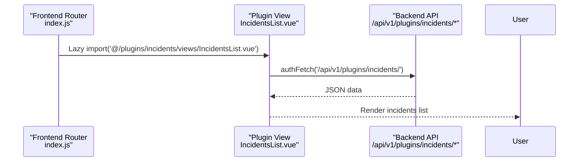
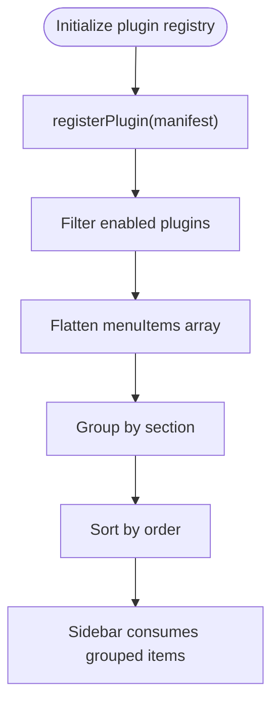
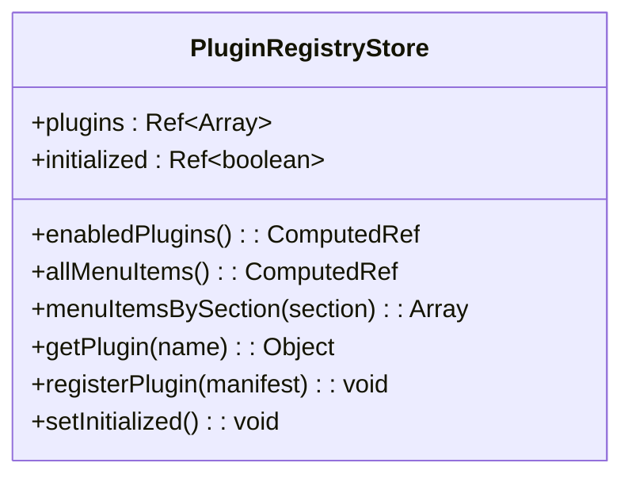
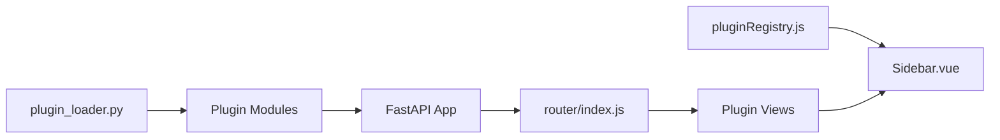

# Plugin Integration System

<cite>
**Referenced Files in This Document**
- [plugin_loader.py](file://backend/app/core/plugin_loader.py)
- [pluginRegistry.js](file://frontend/src/stores/pluginRegistry.js)
- [index.js](file://frontend/src/router/index.js)
- [Sidebar.vue](file://frontend/src/components/layout/Sidebar.vue)
- [plugin.py](file://backend/app/plugins/accounting/plugin.py)
- [plugin.py](file://backend/app/plugins/configuration/plugin.py)
- [plugin.py](file://backend/app/plugins/incidents/plugin.py)
- [plugin.py](file://backend/app/plugins/inventory/plugin.py)
- [plugin.py](file://backend/app/plugins/performance/plugin.py)
- [plugin.py](file://backend/app/plugins/security_module/plugin.py)
- [IncidentsList.vue](file://frontend/src/plugins/incidents/views/IncidentsList.vue)
- [Accounting.vue](file://frontend/src/plugins/accounting/views/Accounting.vue)
- [Configuration.vue](file://frontend/src/plugins/configuration/views/Configuration.vue)
- [Inventory.vue](file://frontend/src/plugins/inventory/views/Inventory.vue)
- [Performance.vue](file://frontend/src/plugins/performance/views/Performance.vue)
- [Security.vue](file://frontend/src/plugins/security/views/Security.vue)
</cite>

## Table of Contents
1. [Introduction](#introduction)
2. [Project Structure](#project-structure)
3. [Core Components](#core-components)
4. [Architecture Overview](#architecture-overview)
5. [Detailed Component Analysis](#detailed-component-analysis)
6. [Dependency Analysis](#dependency-analysis)
7. [Performance Considerations](#performance-considerations)
8. [Troubleshooting Guide](#troubleshooting-guide)
9. [Conclusion](#conclusion)

## Introduction
This document explains the plugin integration system that enables dynamic backend plugin loading and frontend navigation integration. It covers:
- Dynamic plugin discovery and loading in the backend
- Plugin manifest structure and registration contract
- Frontend plugin view integration via lazy-loaded routes
- Transformation of backend plugin metadata into frontend navigation menus
- Plugin registry store and status management
- Error handling during plugin load failures
- Development guidelines and best practices for maintaining compatibility

## Project Structure
The plugin system spans two layers:
- Backend: dynamic plugin loader discovers plugin packages, imports their registration modules, and mounts API routers under plugin-specific prefixes.
- Frontend: plugin views are lazily imported and registered as routes; a plugin registry store aggregates plugin manifests and exposes menu items for the sidebar.

**Diagram sources**
- [plugin_loader.py:25-99](file://backend/app/core/plugin_loader.py#L25-L99)
- [plugin.py:1-17](file://backend/app/plugins/accounting/plugin.py#L1-L17)
- [index.js:26-32](file://frontend/src/router/index.js#L26-L32)
- [pluginRegistry.js:12-20](file://frontend/src/stores/pluginRegistry.js#L12-L20)
- [Sidebar.vue:58-95](file://frontend/src/components/layout/Sidebar.vue#L58-L95)

**Section sources**
- [plugin_loader.py:25-99](file://backend/app/core/plugin_loader.py#L25-L99)
- [index.js:26-32](file://frontend/src/router/index.js#L26-L32)
- [pluginRegistry.js:12-20](file://frontend/src/stores/pluginRegistry.js#L12-L20)
- [Sidebar.vue:58-95](file://frontend/src/components/layout/Sidebar.vue#L58-L95)

## Core Components
- Backend plugin loader: Scans the plugins directory, imports plugin modules, validates required metadata and registration function, and mounts plugin routers with a dedicated API prefix.
- Plugin modules: Provide a manifest dictionary and a register function that receives the FastAPI app and a context with shared resources.
- Frontend plugin registry store: Holds plugin manifests, filters enabled plugins, flattens menu items, and exposes helpers to group items by section.
- Frontend router: Lazily imports plugin views and registers routes under a consistent path pattern.
- Sidebar: Renders navigation groups (sections) and merges core items with plugin-provided menu items.

**Section sources**
- [plugin_loader.py:25-99](file://backend/app/core/plugin_loader.py#L25-L99)
- [plugin.py:1-17](file://backend/app/plugins/accounting/plugin.py#L1-L17)
- [pluginRegistry.js:12-20](file://frontend/src/stores/pluginRegistry.js#L12-L20)
- [index.js:26-32](file://frontend/src/router/index.js#L26-L32)
- [Sidebar.vue:58-95](file://frontend/src/components/layout/Sidebar.vue#L58-L95)

## Architecture Overview
The system follows a contract-driven architecture:
- Backend: Each plugin defines a manifest and a register function. The loader ensures the plugin’s models are imported first (if present), then imports the plugin module, reads metadata, and invokes register with a context containing database base, API prefix, and authentication helpers.
- Frontend: Plugin views are lazy-loaded routes. The plugin registry store aggregates manifests and menu items. The sidebar composes navigation by section and sorts items by order.

**Diagram sources**
- [plugin_loader.py:50-78](file://backend/app/core/plugin_loader.py#L50-L78)
- [plugin.py:9-16](file://backend/app/plugins/accounting/plugin.py#L9-L16)
- [pluginRegistry.js:26-36](file://frontend/src/stores/pluginRegistry.js#L26-L36)
- [index.js:114-144](file://frontend/src/router/index.js#L114-L144)
- [Sidebar.vue:58-95](file://frontend/src/components/layout/Sidebar.vue#L58-L95)

## Detailed Component Analysis

### Backend Plugin Loading Mechanism
- Discovery: Iterates over the plugins directory, skipping hidden directories and those without a plugin module.
- Filtering: Respects an optional whitelist setting to enable only specific plugins.
- Registration: Imports plugin models first (optional), then imports the plugin module and checks for required attributes. Builds a context with database base, API prefix, and authentication helpers, then calls register.
- Status reporting: Records success or error with details for each plugin.

**Diagram sources**
- [plugin_loader.py:25-99](file://backend/app/core/plugin_loader.py#L25-L99)

**Section sources**
- [plugin_loader.py:25-99](file://backend/app/core/plugin_loader.py#L25-L99)

### Plugin Manifest Structure and Registration Contract
- Manifest: A dictionary named PLUGIN_META with keys such as name, version, description, author, and any additional metadata.
- Registration: A register function that accepts the FastAPI app and a context. The context provides:
  - db_base: database declarative base for model registration
  - api_prefix: unique API prefix derived from plugin name
  - get_db: dependency provider for database sessions
  - get_current_user: dependency provider for current user
  - get_current_admin_user: dependency provider for admin user
- Example plugin modules demonstrate the contract across multiple plugins.

**Diagram sources**
- [plugin_loader.py:16-23](file://backend/app/core/plugin_loader.py#L16-L23)
- [plugin.py:1-17](file://backend/app/plugins/accounting/plugin.py#L1-L17)

**Section sources**
- [plugin_loader.py:16-23](file://backend/app/core/plugin_loader.py#L16-L23)
- [plugin.py:1-17](file://backend/app/plugins/accounting/plugin.py#L1-L17)
- [plugin.py:1-17](file://backend/app/plugins/configuration/plugin.py#L1-L17)
- [plugin.py:1-17](file://backend/app/plugins/incidents/plugin.py#L1-L17)
- [plugin.py:1-17](file://backend/app/plugins/inventory/plugin.py#L1-L17)
- [plugin.py:1-17](file://backend/app/plugins/performance/plugin.py#L1-L17)
- [plugin.py:1-17](file://backend/app/plugins/security_module/plugin.py#L1-L17)

### Frontend Plugin View Integration
- Lazy routes: Routes for plugin views are defined using dynamic imports, enabling code-splitting and on-demand loading.
- Route registration: Each plugin view is mapped to a path under a consistent namespace, aligning with backend API prefixes.
- Example views: Each plugin provides a Vue component that renders a placeholder UI and demonstrates typical structure.

**Diagram sources**
- [index.js:26-32](file://frontend/src/router/index.js#L26-L32)
- [index.js:114-144](file://frontend/src/router/index.js#L114-L144)
- [IncidentsList.vue:41-55](file://frontend/src/plugins/incidents/views/IncidentsList.vue#L41-L55)

**Section sources**
- [index.js:26-32](file://frontend/src/router/index.js#L26-L32)
- [index.js:114-144](file://frontend/src/router/index.js#L114-L144)
- [IncidentsList.vue:41-55](file://frontend/src/plugins/incidents/views/IncidentsList.vue#L41-L55)
- [Accounting.vue:1-34](file://frontend/src/plugins/accounting/views/Accounting.vue#L1-L34)
- [Configuration.vue:1-34](file://frontend/src/plugins/configuration/views/Configuration.vue#L1-L34)
- [Inventory.vue:1-34](file://frontend/src/plugins/inventory/views/Inventory.vue#L1-L34)
- [Performance.vue:1-34](file://frontend/src/plugins/performance/views/Performance.vue#L1-L34)
- [Security.vue:1-34](file://frontend/src/plugins/security/views/Security.vue#L1-L34)

### Transforming Backend Metadata to Frontend Navigation Menus
- Menu aggregation: The plugin registry store flattens menu items from enabled plugins and groups them by section.
- Sidebar composition: The sidebar computes sections (general, pages, other, plus plugin-defined sections) and sorts items by order.
- Visibility: Items can specify required roles; visibility is determined by the auth store.

**Diagram sources**
- [pluginRegistry.js:12-20](file://frontend/src/stores/pluginRegistry.js#L12-L20)
- [Sidebar.vue:58-95](file://frontend/src/components/layout/Sidebar.vue#L58-L95)

**Section sources**
- [pluginRegistry.js:12-20](file://frontend/src/stores/pluginRegistry.js#L12-L20)
- [Sidebar.vue:58-95](file://frontend/src/components/layout/Sidebar.vue#L58-L95)

### Plugin Registry Store and Status Management
- State: Maintains plugins array, initialization flag, and computed views for enabled plugins and flattened menu items.
- Helpers:
  - menuItemsBySection: Filters and sorts menu items by section and order.
  - getPlugin: Retrieves a plugin by name.
  - registerPlugin: Validates and adds a manifest.
  - setInitialized: Marks registry as initialized.
- Status: Backend loader populates status for each plugin (success or error) with details.

**Diagram sources**
- [pluginRegistry.js:4-52](file://frontend/src/stores/pluginRegistry.js#L4-L52)

**Section sources**
- [pluginRegistry.js:4-52](file://frontend/src/stores/pluginRegistry.js#L4-L52)
- [plugin_loader.py:80-97](file://backend/app/core/plugin_loader.py#L80-L97)

### Error Handling for Failed Plugin Loads
- Backend: On import or registration failure, the loader records an error status with message and continues processing remaining plugins.
- Frontend: Views handle API errors gracefully, displaying user-friendly messages and logging details.

**Section sources**
- [plugin_loader.py:89-97](file://backend/app/core/plugin_loader.py#L89-L97)
- [IncidentsList.vue:49-51](file://frontend/src/plugins/incidents/views/IncidentsList.vue#L49-L51)

## Dependency Analysis
- Backend depends on plugin modules implementing a strict contract (manifest and register).
- Frontend depends on backend API endpoints and the plugin registry store.
- Sidebar depends on the plugin registry store for menu items and on auth store for role-based visibility.

**Diagram sources**
- [plugin_loader.py:50-78](file://backend/app/core/plugin_loader.py#L50-L78)
- [index.js:114-144](file://frontend/src/router/index.js#L114-L144)
- [pluginRegistry.js:12-20](file://frontend/src/stores/pluginRegistry.js#L12-L20)
- [Sidebar.vue:58-95](file://frontend/src/components/layout/Sidebar.vue#L58-L95)

**Section sources**
- [plugin_loader.py:50-78](file://backend/app/core/plugin_loader.py#L50-L78)
- [index.js:114-144](file://frontend/src/router/index.js#L114-L144)
- [pluginRegistry.js:12-20](file://frontend/src/stores/pluginRegistry.js#L12-L20)
- [Sidebar.vue:58-95](file://frontend/src/components/layout/Sidebar.vue#L58-L95)

## Performance Considerations
- Lazy loading: Frontend routes are dynamically imported, reducing initial bundle size.
- Conditional loading: Backend supports enabling only specific plugins via configuration, minimizing startup overhead.
- Sorting and filtering: Frontend computations for menu items are lightweight but should avoid unnecessary recomputation by relying on computed refs.

## Troubleshooting Guide
- Plugin not appearing in backend:
  - Ensure the plugin directory contains a plugin module and that PLUGIN_META and register are defined.
  - Verify the plugin name matches the directory name and that it is included in the enabled whitelist if configured.
- Plugin API not reachable:
  - Confirm the plugin’s register function includes the router with the correct prefix.
  - Check that the frontend route path matches the backend API prefix.
- Menu item missing in sidebar:
  - Ensure the plugin manifest includes menuItems with proper section and order.
  - Verify the plugin is enabled and registered in the frontend registry.
- Frontend view not rendering:
  - Confirm the lazy route path matches the plugin view location.
  - Check for runtime errors in the view and verify API responses.

**Section sources**
- [plugin_loader.py:63-67](file://backend/app/core/plugin_loader.py#L63-L67)
- [plugin.py:9-16](file://backend/app/plugins/accounting/plugin.py#L9-L16)
- [index.js:114-144](file://frontend/src/router/index.js#L114-L144)
- [pluginRegistry.js:26-36](file://frontend/src/stores/pluginRegistry.js#L26-L36)
- [Sidebar.vue:58-95](file://frontend/src/components/layout/Sidebar.vue#L58-L95)

## Conclusion
The plugin integration system provides a clean separation between backend plugin loading and frontend view integration. By adhering to the manifest and registration contract, plugins can be dynamically discovered, mounted, and exposed through a unified navigation interface. The plugin registry store and sidebar ensure consistent menu presentation, while lazy routes optimize frontend performance. Following the development guidelines and best practices outlined here will maintain compatibility and scalability across plugin additions.