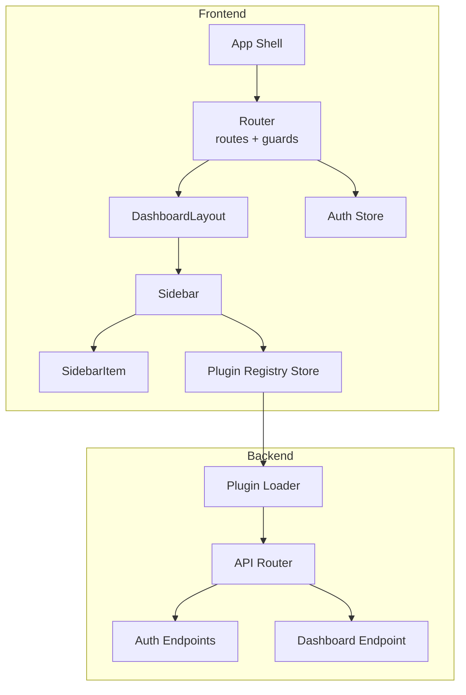
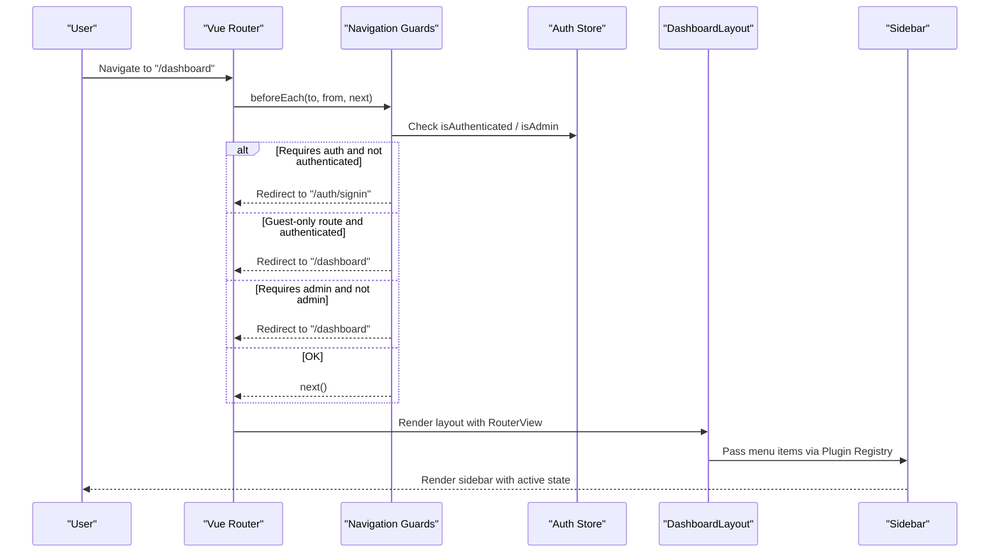
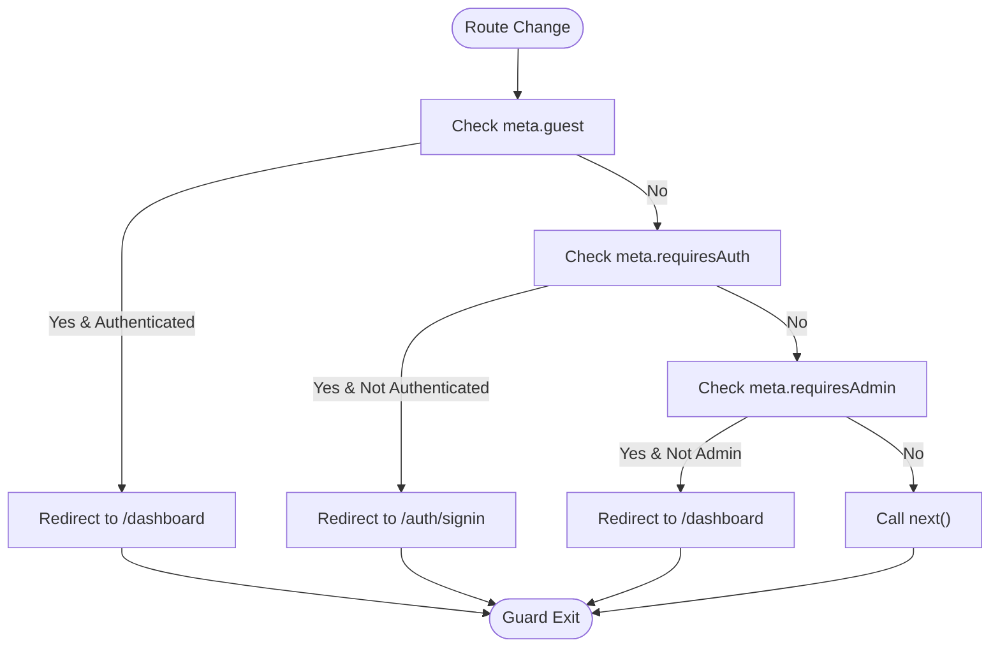
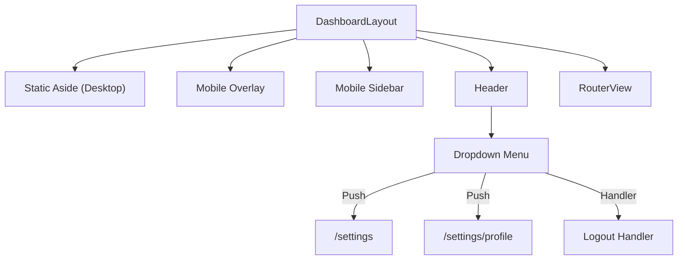
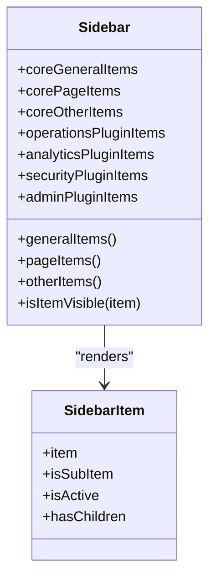
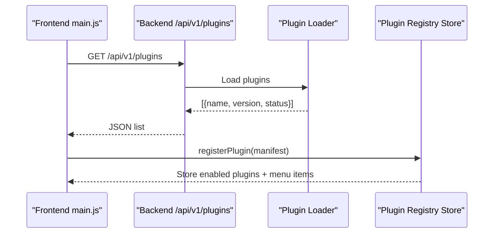
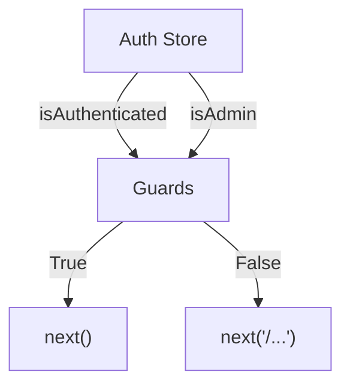
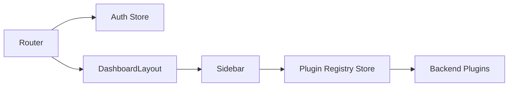

# Routing and Navigation

<cite>
**Referenced Files in This Document**
- [index.js](file://frontend/src/router/index.js)
- [DashboardLayout.vue](file://frontend/src/layouts/DashboardLayout.vue)
- [Sidebar.vue](file://frontend/src/components/layout/Sidebar.vue)
- [SidebarItem.vue](file://frontend/src/components/layout/SidebarItem.vue)
- [pluginRegistry.js](file://frontend/src/stores/pluginRegistry.js)
- [auth.js](file://frontend/src/stores/auth.js)
- [main.js](file://frontend/src/main.js)
- [Dashboard.vue](file://frontend/src/views/dashboard/Dashboard.vue)
- [plugin_loader.py](file://backend/app/core/plugin_loader.py)
- [router.py](file://backend/app/api/v1/router.py)
- [auth.py](file://backend/app/api/v1/endpoints/auth.py)
- [dashboard.py](file://backend/app/api/v1/endpoints/dashboard.py)
</cite>

## Table of Contents
1. [Introduction](#introduction)
2. [Project Structure](#project-structure)
3. [Core Components](#core-components)
4. [Architecture Overview](#architecture-overview)
5. [Detailed Component Analysis](#detailed-component-analysis)
6. [Dependency Analysis](#dependency-analysis)
7. [Performance Considerations](#performance-considerations)
8. [Troubleshooting Guide](#troubleshooting-guide)
9. [Conclusion](#conclusion)
10. [Appendices](#appendices)

## Introduction
This document explains the Vue Router configuration and navigation system used in the frontend application. It covers route definitions, navigation guards, authentication protection, the dashboard layout, sidebar navigation, dynamic menu generation, and plugin-based navigation. It also provides practical guidance for programmatic navigation, route parameters, query handling, breadcrumbs, active state management, responsive navigation patterns, and adding new routes while maintaining consistency.

## Project Structure
The routing and navigation system spans three layers:
- Router configuration and guards in the frontend
- Layout and sidebar components that render navigation
- Store-driven plugin registry that powers dynamic menus

**Diagram sources**
- [index.js:1-174](file://frontend/src/router/index.js#L1-L174)
- [DashboardLayout.vue:1-125](file://frontend/src/layouts/DashboardLayout.vue#L1-L125)
- [Sidebar.vue:1-258](file://frontend/src/components/layout/Sidebar.vue#L1-L258)
- [SidebarItem.vue:1-74](file://frontend/src/components/layout/SidebarItem.vue#L1-L74)
- [pluginRegistry.js:1-53](file://frontend/src/stores/pluginRegistry.js#L1-L53)
- [auth.js:1-198](file://frontend/src/stores/auth.js#L1-L198)
- [plugin_loader.py:1-100](file://backend/app/core/plugin_loader.py#L1-L100)
- [router.py:1-10](file://backend/app/api/v1/router.py#L1-L10)
- [auth.py:1-106](file://backend/app/api/v1/endpoints/auth.py#L1-L106)
- [dashboard.py:1-27](file://backend/app/api/v1/endpoints/dashboard.py#L1-L27)

**Section sources**
- [index.js:1-174](file://frontend/src/router/index.js#L1-L174)
- [DashboardLayout.vue:1-125](file://frontend/src/layouts/DashboardLayout.vue#L1-L125)
- [Sidebar.vue:1-258](file://frontend/src/components/layout/Sidebar.vue#L1-L258)
- [pluginRegistry.js:1-53](file://frontend/src/stores/pluginRegistry.js#L1-L53)
- [plugin_loader.py:1-100](file://backend/app/core/plugin_loader.py#L1-L100)
- [router.py:1-10](file://backend/app/api/v1/router.py#L1-L10)

## Core Components
- Router configuration defines top-level routes, nested children under the dashboard layout, and a catch-all for 404.
- Navigation guards enforce authentication, guest-only access, and admin-only access.
- Dashboard layout provides responsive header, sidebar, and main content area.
- Sidebar composes core and plugin menu sections and manages visibility and roles.
- SidebarItem renders links and collapsible groups with active-state highlighting.
- Plugin registry aggregates plugin-provided menu items and exposes them by section.
- Auth store manages tokens, user info, and role checks used by guards and sidebar visibility.

**Section sources**
- [index.js:34-152](file://frontend/src/router/index.js#L34-L152)
- [index.js:159-171](file://frontend/src/router/index.js#L159-L171)
- [DashboardLayout.vue:1-125](file://frontend/src/layouts/DashboardLayout.vue#L1-L125)
- [Sidebar.vue:1-258](file://frontend/src/components/layout/Sidebar.vue#L1-L258)
- [SidebarItem.vue:1-74](file://frontend/src/components/layout/SidebarItem.vue#L1-L74)
- [pluginRegistry.js:1-53](file://frontend/src/stores/pluginRegistry.js#L1-L53)
- [auth.js:1-198](file://frontend/src/stores/auth.js#L1-L198)

## Architecture Overview
The navigation pipeline integrates frontend routing, authentication, and backend plugin discovery:

**Diagram sources**
- [index.js:159-171](file://frontend/src/router/index.js#L159-L171)
- [auth.js:12-27](file://frontend/src/stores/auth.js#L12-L27)
- [DashboardLayout.vue:1-125](file://frontend/src/layouts/DashboardLayout.vue#L1-L125)
- [Sidebar.vue:1-258](file://frontend/src/components/layout/Sidebar.vue#L1-L258)

## Detailed Component Analysis

### Router Configuration and Navigation Guards
- Route tree:
  - Root redirect to dashboard
  - Authentication routes marked as guest-only
  - Nested routes under the dashboard layout with optional admin protection
  - Plugin routes lazy-loaded via dynamic imports
  - Catch-all 404 route
- Guards:
  - requireAuth: blocks unauthenticated users from protected areas
  - guest: blocks authenticated users from login/signup pages
  - requiresAdmin: restricts certain pages to admin users

**Diagram sources**
- [index.js:159-171](file://frontend/src/router/index.js#L159-L171)
- [auth.js:12-27](file://frontend/src/stores/auth.js#L12-L27)

**Section sources**
- [index.js:34-152](file://frontend/src/router/index.js#L34-L152)
- [index.js:159-171](file://frontend/src/router/index.js#L159-L171)

### Dashboard Layout and Responsive Navigation
- Desktop sidebar is always visible; mobile sidebar is toggled via overlay and transitions.
- Header contains theme toggle and user dropdown with programmatic navigation to settings and logout.
- RouterView renders the active child route inside the layout.

**Diagram sources**
- [DashboardLayout.vue:23-124](file://frontend/src/layouts/DashboardLayout.vue#L23-L124)

**Section sources**
- [DashboardLayout.vue:1-125](file://frontend/src/layouts/DashboardLayout.vue#L1-L125)

### Sidebar Navigation and Dynamic Menu Generation
- Core menu items include dashboard, users (admin-only), settings (with nested children), and help.
- Plugin menu items are grouped by section: operations, analytics, security, admin, pages, general, other.
- Visibility respects user roles via requiredRole checks.
- Active state is computed from current route path, including nested children.

**Diagram sources**
- [Sidebar.vue:29-100](file://frontend/src/components/layout/Sidebar.vue#L29-L100)
- [SidebarItem.vue:18-29](file://frontend/src/components/layout/SidebarItem.vue#L18-L29)

**Section sources**
- [Sidebar.vue:1-258](file://frontend/src/components/layout/Sidebar.vue#L1-L258)
- [SidebarItem.vue:1-74](file://frontend/src/components/layout/SidebarItem.vue#L1-L74)

### Plugin-Based Navigation System
- Frontend initializes plugin registry by fetching backend plugin list and registering manifests with menu items.
- Menu items are categorized by section and ordered by numeric order.
- Backend plugin loader enumerates plugin directories, imports plugin modules, and registers them with the FastAPI app.

**Diagram sources**
- [main.js:18-51](file://frontend/src/main.js#L18-L51)
- [plugin_loader.py:25-99](file://backend/app/core/plugin_loader.py#L25-L99)
- [pluginRegistry.js:26-40](file://frontend/src/stores/pluginRegistry.js#L26-L40)

**Section sources**
- [main.js:18-131](file://frontend/src/main.js#L18-L131)
- [pluginRegistry.js:1-53](file://frontend/src/stores/pluginRegistry.js#L1-L53)
- [plugin_loader.py:1-100](file://backend/app/core/plugin_loader.py#L1-L100)

### Authentication Protection Mechanisms
- Auth store holds tokens and user info, computes isAuthenticated and isAdmin, and provides helpers like hasRole.
- Guards use these computed values to decide redirects.
- Logout handler clears tokens and navigates to sign-in.

**Diagram sources**
- [auth.js:12-27](file://frontend/src/stores/auth.js#L12-L27)
- [index.js:159-171](file://frontend/src/router/index.js#L159-L171)
- [DashboardLayout.vue:17-20](file://frontend/src/layouts/DashboardLayout.vue#L17-L20)

**Section sources**
- [auth.js:1-198](file://frontend/src/stores/auth.js#L1-L198)
- [index.js:159-171](file://frontend/src/router/index.js#L159-L171)
- [DashboardLayout.vue:17-20](file://frontend/src/layouts/DashboardLayout.vue#L17-L20)

### Programmatic Navigation, Route Parameters, and Query Handling
- Programmatic navigation examples:
  - Push to settings profile from header dropdown
  - Push to sign-in after logout
- Route parameters and queries:
  - Routes are defined with static paths; parameters and queries are not used in current route definitions.
  - For future needs, use RouterLink params and query properties or programmatically push with a location descriptor containing params and query.

**Section sources**
- [DashboardLayout.vue:101-113](file://frontend/src/layouts/DashboardLayout.vue#L101-L113)
- [DashboardLayout.vue:19-19](file://frontend/src/layouts/DashboardLayout.vue#L19-L19)
- [index.js:34-152](file://frontend/src/router/index.js#L34-L152)

### Breadcrumb Navigation and Active State Management
- Breadcrumbs:
  - Not implemented in the current codebase.
  - Recommendation: Compute breadcrumbs from the current route’s matched segments and render via a dedicated component.
- Active state:
  - SidebarItem computes active state based on exact or child path match.
  - Uses RouterLink for single items and collapsible groups for parent items.

**Section sources**
- [SidebarItem.vue:20-29](file://frontend/src/components/layout/SidebarItem.vue#L20-L29)

### Responsive Navigation Patterns
- Desktop: Static sidebar aside with persistent navigation.
- Mobile: Slide-in sidebar with overlay; toggled via header button.
- Collapsible sections in sidebar for nested settings.

**Section sources**
- [DashboardLayout.vue:23-124](file://frontend/src/layouts/DashboardLayout.vue#L23-L124)
- [Sidebar.vue:103-238](file://frontend/src/components/layout/Sidebar.vue#L103-L238)

## Dependency Analysis
- Router depends on Auth Store for guard decisions.
- Sidebar depends on Plugin Registry Store and Auth Store for visibility and roles.
- Plugin Registry Store aggregates plugin menu items and exposes them by section.
- Frontend initialization fetches backend plugin list and registers manifests.

**Diagram sources**
- [index.js:159-171](file://frontend/src/router/index.js#L159-L171)
- [Sidebar.vue:24-25](file://frontend/src/components/layout/Sidebar.vue#L24-L25)
- [pluginRegistry.js:12-20](file://frontend/src/stores/pluginRegistry.js#L12-L20)
- [main.js:18-51](file://frontend/src/main.js#L18-L51)

**Section sources**
- [index.js:1-174](file://frontend/src/router/index.js#L1-L174)
- [Sidebar.vue:1-258](file://frontend/src/components/layout/Sidebar.vue#L1-L258)
- [pluginRegistry.js:1-53](file://frontend/src/stores/pluginRegistry.js#L1-L53)
- [main.js:1-132](file://frontend/src/main.js#L1-L132)

## Performance Considerations
- Lazy-load plugin views to reduce initial bundle size.
- Computed properties in Sidebar aggregate and sort menu items; keep order values small integers for efficient sorting.
- Avoid excessive re-computation by caching plugin menu items in the registry.
- Keep guard logic minimal and rely on computed properties for authentication/admin checks.

## Troubleshooting Guide
- Authentication redirects loop:
  - Verify isAuthenticated and isAdmin computed values and that tokens are present and not expired.
  - Confirm guards are applied consistently and guest routes are properly marked.
- Plugin menu not appearing:
  - Ensure backend plugin loader reports plugins as loaded and frontend receives a non-empty list.
  - Check that plugin manifests include menuItems with proper section and order.
- Sidebar item not highlighted:
  - Ensure item.path matches the current route path exactly or aligns with nested children.
- Mobile sidebar not closing:
  - Verify event emission and close handlers in Sidebar and DashboardLayout.

**Section sources**
- [auth.js:12-27](file://frontend/src/stores/auth.js#L12-L27)
- [index.js:159-171](file://frontend/src/router/index.js#L159-L171)
- [main.js:18-51](file://frontend/src/main.js#L18-L51)
- [Sidebar.vue:76-95](file://frontend/src/components/layout/Sidebar.vue#L76-L95)
- [SidebarItem.vue:20-29](file://frontend/src/components/layout/SidebarItem.vue#L20-L29)
- [DashboardLayout.vue:39-61](file://frontend/src/layouts/DashboardLayout.vue#L39-L61)

## Conclusion
The routing and navigation system combines Vue Router guards, a dashboard layout, and a plugin-driven sidebar to deliver a secure, extensible, and responsive interface. Authentication protection is enforced centrally, while dynamic plugin menus integrate seamlessly with core navigation. Following the guidelines below ensures consistency and maintainability as new routes and plugins are added.

## Appendices

### Guidelines for Adding New Routes and Maintaining Consistency
- Define routes under the dashboard layout for consistent navigation and layout behavior.
- Use meta fields to control access:
  - requiresAuth for protected areas
  - guest for login/signup pages
  - requiresAdmin for admin-only pages
- Keep route names descriptive and hierarchical (e.g., SettingsProfile).
- For nested settings, use a parent route with a redirect to a default child.
- Add plugin routes lazily and group under a common base path (e.g., plugins/<name>).
- Maintain consistent naming and ordering for menu items in plugin manifests.

**Section sources**
- [index.js:34-152](file://frontend/src/router/index.js#L34-L152)
- [Sidebar.vue:58-95](file://frontend/src/components/layout/Sidebar.vue#L58-L95)

### Backend Plugin API and Initialization
- Backend exposes a plugin listing endpoint consumed by the frontend during initialization.
- The plugin loader scans plugin directories, imports modules, and registers them with the FastAPI app.

**Section sources**
- [main.js:23-26](file://frontend/src/main.js#L23-L26)
- [plugin_loader.py:25-99](file://backend/app/core/plugin_loader.py#L25-L99)
- [router.py:1-10](file://backend/app/api/v1/router.py#L1-L10)

### Authentication Endpoints and Dashboard Stats
- Authentication endpoints support login, refresh, register, logout, and current user retrieval.
- Dashboard endpoint returns basic stats and user role information.

**Section sources**
- [auth.py:20-97](file://backend/app/api/v1/endpoints/auth.py#L20-L97)
- [dashboard.py:12-26](file://backend/app/api/v1/endpoints/dashboard.py#L12-L26)