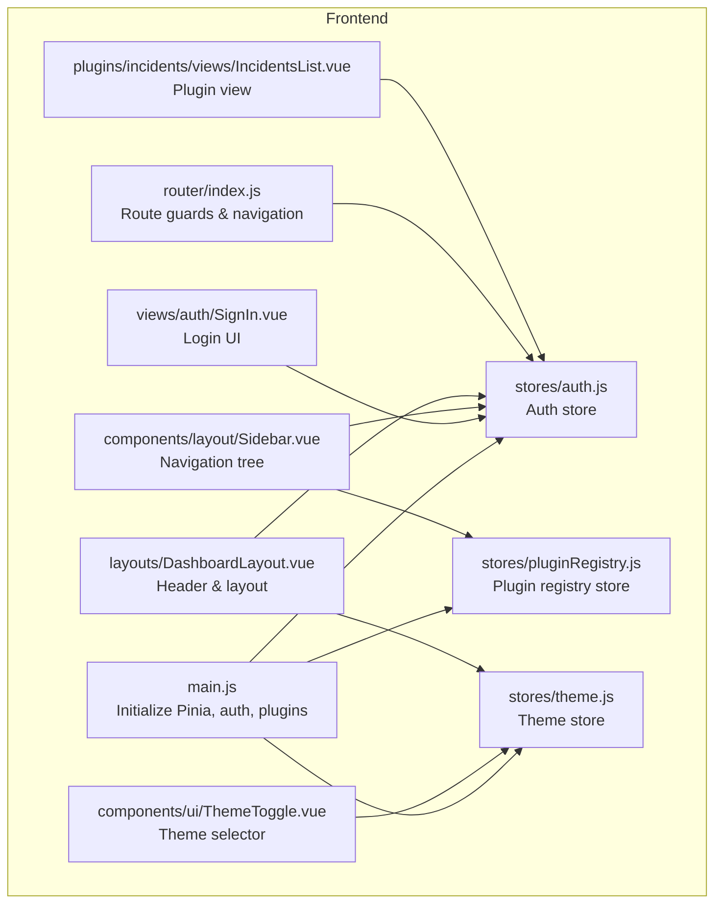
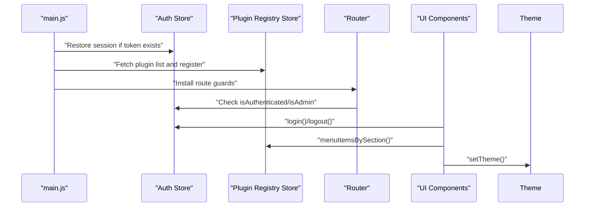
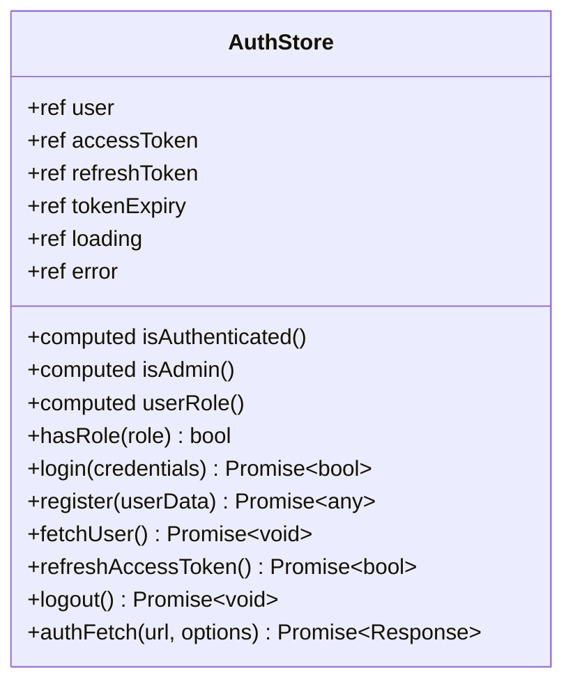
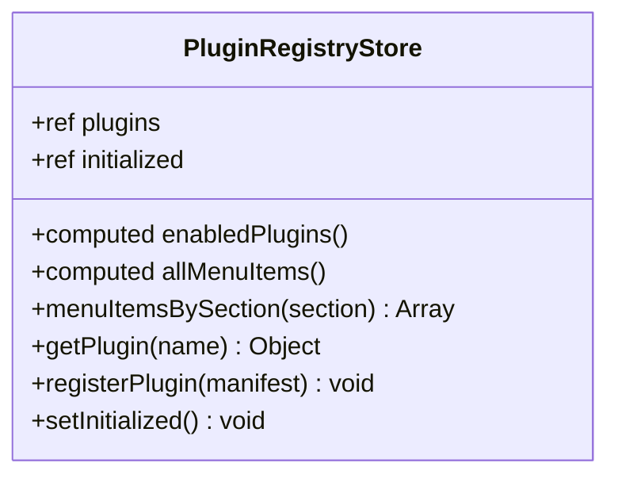
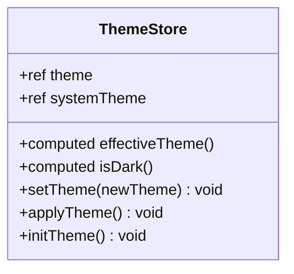
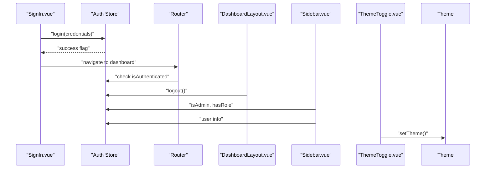
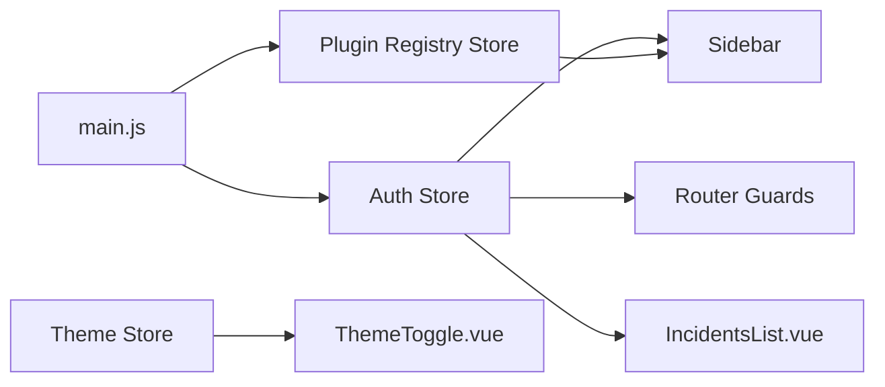

# State Management with Pinia

<cite>
**Referenced Files in This Document**
- [auth.js](file://frontend/src/stores/auth.js)
- [pluginRegistry.js](file://frontend/src/stores/pluginRegistry.js)
- [theme.js](file://frontend/src/stores/theme.js)
- [main.js](file://frontend/src/main.js)
- [SignIn.vue](file://frontend/src/views/auth/SignIn.vue)
- [Sidebar.vue](file://frontend/src/components/layout/Sidebar.vue)
- [ThemeToggle.vue](file://frontend/src/components/ui/ThemeToggle.vue)
- [DashboardLayout.vue](file://frontend/src/layouts/DashboardLayout.vue)
- [router/index.js](file://frontend/src/router/index.js)
- [IncidentsList.vue](file://frontend/src/plugins/incidents/views/IncidentsList.vue)
- [auth.py](file://backend/app/api/v1/endpoints/auth.py)
- [plugin_loader.py](file://backend/app/core/plugin_loader.py)
</cite>

## Table of Contents
1. [Introduction](#introduction)
2. [Project Structure](#project-structure)
3. [Core Components](#core-components)
4. [Architecture Overview](#architecture-overview)
5. [Detailed Component Analysis](#detailed-component-analysis)
6. [Dependency Analysis](#dependency-analysis)
7. [Performance Considerations](#performance-considerations)
8. [Troubleshooting Guide](#troubleshooting-guide)
9. [Conclusion](#conclusion)
10. [Appendices](#appendices)

## Introduction
This document explains the Pinia state management system used in the frontend application. It covers the store architecture, focusing on three key stores:
- Authentication store for user authentication state and token lifecycle
- Plugin registry store for dynamic plugin discovery and navigation integration
- Theme store for UI customization and system-aware theming

It also documents store composition, actions, getters, and state mutations; provides examples of reactive state updates, persistence, and cross-component communication; outlines best practices for organizing store logic, handling async operations, and managing complex state relationships; and addresses testing strategies and debugging techniques.

## Project Structure
The state management is implemented in the frontend under the stores directory, integrated with Vue components and the router. Stores are initialized in the application entry point and consumed by views and UI components.

**Diagram sources**
- [main.js:18-51](file://frontend/src/main.js#L18-L51)
- [auth.js:4-197](file://frontend/src/stores/auth.js#L4-L197)
- [pluginRegistry.js:4-52](file://frontend/src/stores/pluginRegistry.js#L4-L52)
- [theme.js:4-52](file://frontend/src/stores/theme.js#L4-L52)
- [router/index.js:159-171](file://frontend/src/router/index.js#L159-L171)
- [SignIn.vue:16](file://frontend/src/views/auth/SignIn.vue#L16)
- [Sidebar.vue:24-25](file://frontend/src/components/layout/Sidebar.vue#L24-L25)
- [ThemeToggle.vue:7](file://frontend/src/components/ui/ThemeToggle.vue#L7)
- [DashboardLayout.vue:13-20](file://frontend/src/layouts/DashboardLayout.vue#L13-L20)
- [IncidentsList.vue:15](file://frontend/src/plugins/incidents/views/IncidentsList.vue#L15)

**Section sources**
- [main.js:13-131](file://frontend/src/main.js#L13-L131)
- [router/index.js:154-171](file://frontend/src/router/index.js#L154-L171)

## Core Components
This section introduces the three stores and their roles.

- Authentication Store (auth.js)
  - Manages user identity, tokens, and session lifecycle
  - Provides computed getters for authentication state and roles
  - Exposes actions for login, registration, fetching user, token refresh, and logout
  - Implements an authFetch wrapper for automatic token injection and refresh

- Plugin Registry Store (pluginRegistry.js)
  - Maintains a list of loaded plugins and their metadata
  - Computes enabled plugins and aggregated menu items
  - Offers helpers to register plugins and retrieve menu items by section
  - Tracks initialization state

- Theme Store (theme.js)
  - Controls theme selection (light, dark, system)
  - Computes effective theme and dark mode flag
  - Applies theme to the DOM and persists selection to local storage
  - Listens to system theme changes

**Section sources**
- [auth.js:4-197](file://frontend/src/stores/auth.js#L4-L197)
- [pluginRegistry.js:4-52](file://frontend/src/stores/pluginRegistry.js#L4-L52)
- [theme.js:4-52](file://frontend/src/stores/theme.js#L4-L52)

## Architecture Overview
The stores integrate with the application bootstrap, router guards, and UI components. The main initialization routine restores auth state, loads plugins, and mounts the app. Route guards enforce authentication and admin requirements. Components consume stores for reactive UI updates and cross-component communication.

**Diagram sources**
- [main.js:116-129](file://frontend/src/main.js#L116-L129)
- [router/index.js:159-171](file://frontend/src/router/index.js#L159-L171)
- [auth.js:129-158](file://frontend/src/stores/auth.js#L129-L158)
- [pluginRegistry.js:8-20](file://frontend/src/stores/pluginRegistry.js#L8-L20)
- [theme.js:17-30](file://frontend/src/stores/theme.js#L17-L30)

## Detailed Component Analysis

### Authentication Store
The auth store encapsulates user authentication state and token lifecycle. It exposes reactive state, computed getters, and actions for async operations.

Key elements:
- Reactive state: user, accessToken, refreshToken, tokenExpiry, loading, error
- Computed getters: isAuthenticated, isAdmin, userRole, hasRole
- Actions: login, register, fetchUser, refreshAccessToken, logout, authFetch
- Persistence: tokens stored in localStorage with expiry timestamps

**Diagram sources**
- [auth.js:4-197](file://frontend/src/stores/auth.js#L4-L197)

Reactive state updates and cross-component communication:
- Login action updates user, tokens, and localStorage; components reactively update via computed getters
- AuthFetch automatically injects Authorization header and refreshes tokens on 401
- Router guards use isAuthenticated and isAdmin to protect routes

Persistence:
- Tokens and expiry are persisted to localStorage and restored on startup

Async operations:
- Login, register, refresh, and logout are async; loading/error flags manage UI state
- fetchUser handles token expiration by triggering logout

**Section sources**
- [auth.js:12-17](file://frontend/src/stores/auth.js#L12-L17)
- [auth.js:22-27](file://frontend/src/stores/auth.js#L22-L27)
- [auth.js:29-67](file://frontend/src/stores/auth.js#L29-L67)
- [auth.js:69-89](file://frontend/src/stores/auth.js#L69-L89)
- [auth.js:91-103](file://frontend/src/stores/auth.js#L91-L103)
- [auth.js:105-134](file://frontend/src/stores/auth.js#L105-L134)
- [auth.js:136-158](file://frontend/src/stores/auth.js#L136-L158)
- [auth.js:160-177](file://frontend/src/stores/auth.js#L160-L177)

### Plugin Registry Store
The plugin registry manages dynamic plugin discovery and integrates plugin-provided menu items into the navigation.

Key elements:
- Reactive state: plugins, initialized
- Computed getters: enabledPlugins, allMenuItems, menuItemsBySection
- Actions: registerPlugin, getPlugin, setInitialized

**Diagram sources**
- [pluginRegistry.js:4-52](file://frontend/src/stores/pluginRegistry.js#L4-L52)

Integration with UI:
- Sidebar computes menu sections from plugin registry and merges with core items
- Visibility checks use authStore.hasRole to enforce role-based access

Initialization:
- main.js fetches plugin list from backend and registers manifests with menu items

**Section sources**
- [pluginRegistry.js:8-20](file://frontend/src/stores/pluginRegistry.js#L8-L20)
- [pluginRegistry.js:22-36](file://frontend/src/stores/pluginRegistry.js#L22-L36)
- [pluginRegistry.js:38-40](file://frontend/src/stores/pluginRegistry.js#L38-L40)
- [Sidebar.vue:59-73](file://frontend/src/components/layout/Sidebar.vue#L59-L73)
- [main.js:19-51](file://frontend/src/main.js#L19-L51)

### Theme Store
The theme store controls UI appearance and adapts to system preferences.

Key elements:
- Reactive state: theme, systemTheme
- Computed getters: effectiveTheme, isDark
- Actions: setTheme, initTheme, applyTheme
- Persistence: theme preference saved to localStorage

**Diagram sources**
- [theme.js:4-52](file://frontend/src/stores/theme.js#L4-L52)

Integration:
- ThemeToggle component binds to theme store and updates theme on selection
- initTheme listens to system theme changes and applies theme when set to system

**Section sources**
- [theme.js:10-13](file://frontend/src/stores/theme.js#L10-L13)
- [theme.js:15](file://frontend/src/stores/theme.js#L15)
- [theme.js:17-30](file://frontend/src/stores/theme.js#L17-L30)
- [theme.js:32-42](file://frontend/src/stores/theme.js#L32-L42)
- [ThemeToggle.vue:21-32](file://frontend/src/components/ui/ThemeToggle.vue#L21-L32)

### Cross-Component Communication and Reactive Updates
- Sidebar consumes authStore and pluginRegistry to build navigation menus reactively
- DashboardLayout uses authStore for user info and logout flow
- ThemeToggle reads theme store state and triggers theme changes
- IncidentsList uses authStore.authFetch for authenticated plugin API calls

**Diagram sources**
- [SignIn.vue:25-38](file://frontend/src/views/auth/SignIn.vue#L25-L38)
- [router/index.js:159-171](file://frontend/src/router/index.js#L159-L171)
- [DashboardLayout.vue:17-20](file://frontend/src/layouts/DashboardLayout.vue#L17-L20)
- [Sidebar.vue:34-100](file://frontend/src/components/layout/Sidebar.vue#L34-L100)
- [ThemeToggle.vue:21-32](file://frontend/src/components/ui/ThemeToggle.vue#L21-L32)

**Section sources**
- [SignIn.vue:16](file://frontend/src/views/auth/SignIn.vue#L16)
- [router/index.js:159-171](file://frontend/src/router/index.js#L159-L171)
- [DashboardLayout.vue:13-20](file://frontend/src/layouts/DashboardLayout.vue#L13-L20)
- [Sidebar.vue:24-25](file://frontend/src/components/layout/Sidebar.vue#L24-L25)
- [ThemeToggle.vue:7](file://frontend/src/components/ui/ThemeToggle.vue#L7)

## Dependency Analysis
Stores depend on each other indirectly through UI components and router guards. The auth store is central to routing protection and plugin API access. The plugin registry depends on auth for visibility checks and on main.js for initialization. The theme store is standalone but influences global UI rendering.

**Diagram sources**
- [router/index.js:159-171](file://frontend/src/router/index.js#L159-L171)
- [Sidebar.vue:24-25](file://frontend/src/components/layout/Sidebar.vue#L24-L25)
- [IncidentsList.vue:15](file://frontend/src/plugins/incidents/views/IncidentsList.vue#L15)
- [ThemeToggle.vue:7](file://frontend/src/components/ui/ThemeToggle.vue#L7)
- [main.js:19-51](file://frontend/src/main.js#L19-L51)

**Section sources**
- [router/index.js:159-171](file://frontend/src/router/index.js#L159-L171)
- [Sidebar.vue:24-25](file://frontend/src/components/layout/Sidebar.vue#L24-L25)
- [IncidentsList.vue:15](file://frontend/src/plugins/incidents/views/IncidentsList.vue#L15)
- [ThemeToggle.vue:7](file://frontend/src/components/ui/ThemeToggle.vue#L7)
- [main.js:19-51](file://frontend/src/main.js#L19-L51)

## Performance Considerations
- Computed getters minimize recomputation and keep UI reactive efficiently
- Local storage persistence avoids repeated network requests for tokens and theme
- Lazy-loading plugin views reduces initial bundle size
- Router guards prevent unnecessary component rendering for unauthorized routes
- authFetch centralizes token refresh logic to avoid redundant requests

[No sources needed since this section provides general guidance]

## Troubleshooting Guide
Common issues and resolutions:
- Authentication failures
  - Verify token presence and expiry; use refreshAccessToken when 401 occurs
  - Check backend endpoints for login, refresh, and logout
- Plugin registration errors
  - Ensure plugin manifests include required fields and names
  - Confirm plugin status is loaded and menu items are defined
- Theme not applying
  - Confirm setTheme writes to localStorage and applyTheme toggles DOM classes
  - Verify system theme listener is attached during initTheme
- Route guard redirects
  - Ensure isAuthenticated and isAdmin reflect current auth state
  - Check guest vs requiresAuth/admin meta flags

**Section sources**
- [auth.js:160-177](file://frontend/src/stores/auth.js#L160-L177)
- [pluginRegistry.js:26-36](file://frontend/src/stores/pluginRegistry.js#L26-L36)
- [theme.js:17-30](file://frontend/src/stores/theme.js#L17-L30)
- [router/index.js:159-171](file://frontend/src/router/index.js#L159-L171)

## Conclusion
The Pinia stores provide a clean separation of concerns for authentication, plugin management, and theming. They enable reactive UI updates, robust async handling, and seamless cross-component communication. Following the outlined best practices ensures maintainable and scalable state management.

[No sources needed since this section summarizes without analyzing specific files]

## Appendices

### Backend Integration Notes
- Authentication endpoints support login, refresh, register, logout, and current user retrieval
- Plugin loader dynamically discovers and registers plugin APIs and metadata
- These integrations drive store initialization and authenticated API access

**Section sources**
- [auth.py:20-97](file://backend/app/api/v1/endpoints/auth.py#L20-L97)
- [plugin_loader.py:25-99](file://backend/app/core/plugin_loader.py#L25-L99)