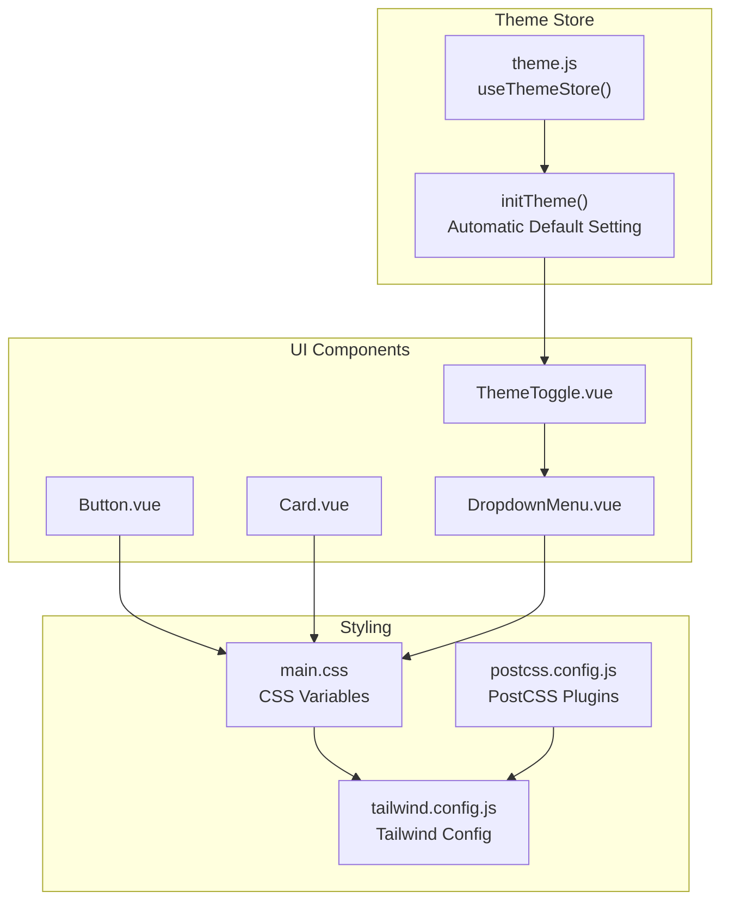
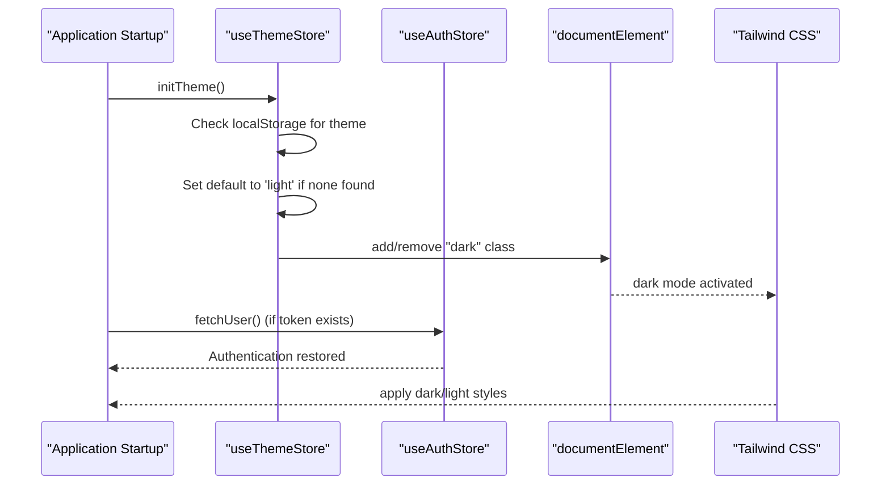
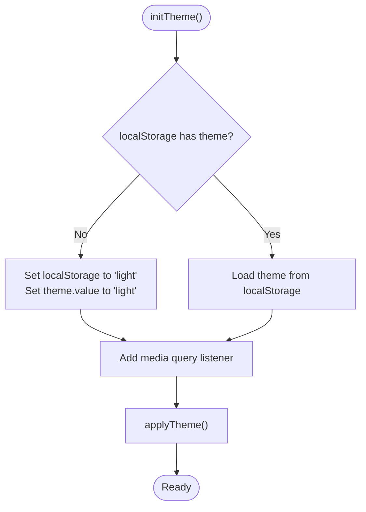
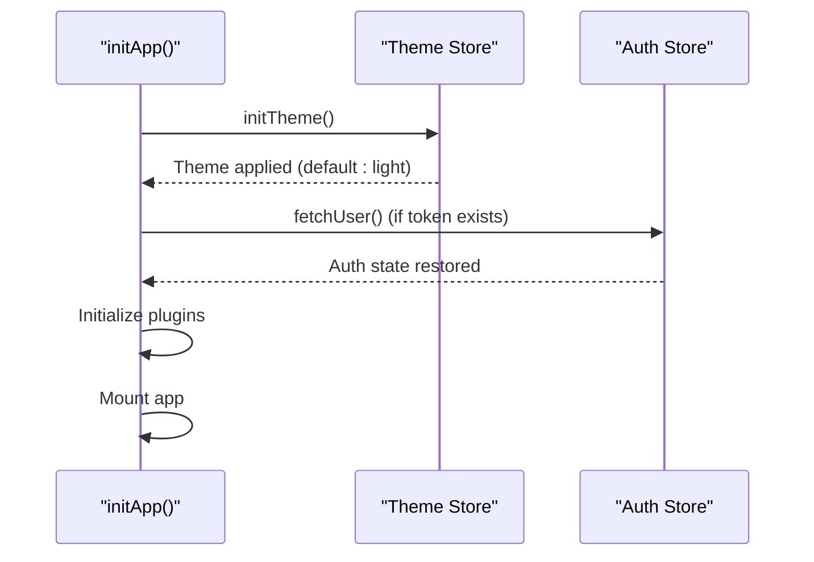
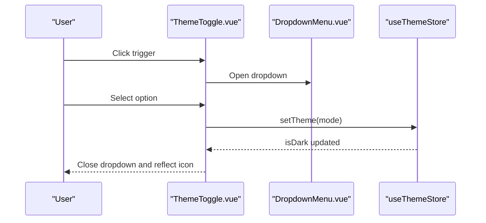
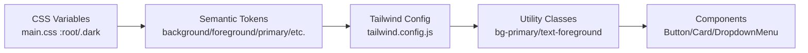
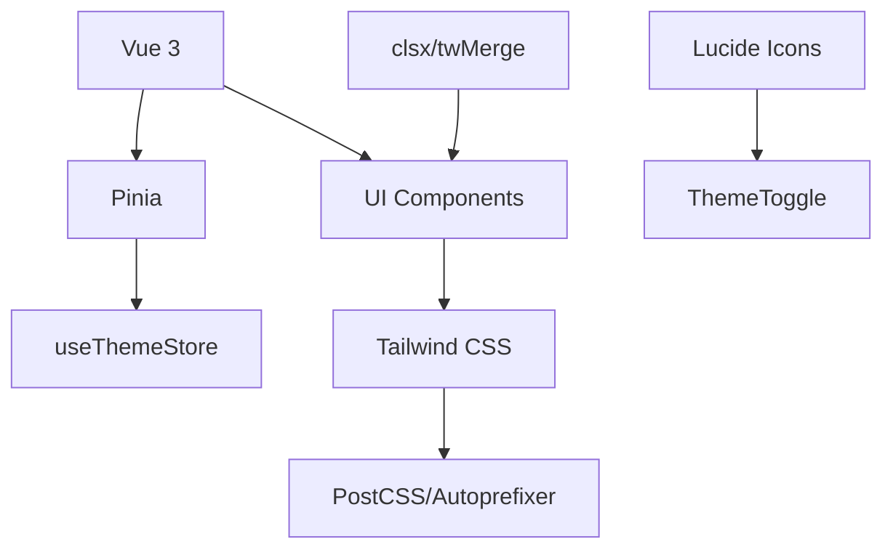

# Theming and Customization

<cite>
**Referenced Files in This Document**
- [theme.js](file://frontend/src/stores/theme.js)
- [ThemeToggle.vue](file://frontend/src/components/ui/ThemeToggle.vue)
- [tailwind.config.js](file://frontend/tailwind.config.js)
- [main.css](file://frontend/src/assets/css/main.css)
- [postcss.config.js](file://frontend/postcss.config.js)
- [main.js](file://frontend/src/main.js)
- [Button.vue](file://frontend/src/components/ui/Button.vue)
- [Card.vue](file://frontend/src/components/ui/Card.vue)
- [DropdownMenu.vue](file://frontend/src/components/ui/DropdownMenu.vue)
- [utils.js](file://frontend/src/lib/utils.js)
- [package.json](file://frontend/package.json)
- [auth.js](file://frontend/src/stores/auth.js)
</cite>

## Update Summary
**Changes Made**
- Updated theme initialization process to include automatic default theme setting
- Added documentation for the enhanced theme management system with pre-authentication initialization
- Updated architecture diagrams to reflect the new initialization sequence
- Enhanced troubleshooting section with new initialization-related guidance

## Table of Contents
1. [Introduction](#introduction)
2. [Project Structure](#project-structure)
3. [Core Components](#core-components)
4. [Architecture Overview](#architecture-overview)
5. [Detailed Component Analysis](#detailed-component-analysis)
6. [Dependency Analysis](#dependency-analysis)
7. [Performance Considerations](#performance-considerations)
8. [Accessibility Considerations](#accessibility-considerations)
9. [Extending the Theme System](#extending-the-theme-system)
10. [Troubleshooting Guide](#troubleshooting-guide)
11. [Conclusion](#conclusion)

## Introduction
This document explains the theming and customization system used in the frontend application. It covers the theme toggle component, theme store management, Tailwind CSS configuration, and how light and dark themes are implemented. The system now features enhanced automatic initialization that ensures users see the correct theme immediately upon application startup, even when no user preference is detected. It also documents color scheme customization, responsive design patterns, theme-aware components, CSS variable usage, dynamic styling, persistence mechanisms, user preference handling, and system theme detection. Accessibility considerations and guidelines for extending the theme system are included.

## Project Structure
The theming system spans three main areas:
- Theme store: reactive state management for theme selection and persistence with automatic initialization
- UI components: theme-aware components and the theme toggle
- Tailwind CSS: CSS-in-JS styling with CSS variables and dark mode support

**Diagram sources**
- [theme.js:32-46](file://frontend/src/stores/theme.js#L32-L46)
- [ThemeToggle.vue:1-36](file://frontend/src/components/ui/ThemeToggle.vue#L1-L36)
- [Button.vue:1-66](file://frontend/src/components/ui/Button.vue#L1-L66)
- [Card.vue:1-14](file://frontend/src/components/ui/Card.vue#L1-L14)
- [DropdownMenu.vue:1-49](file://frontend/src/components/ui/DropdownMenu.vue#L1-L49)
- [main.css:1-77](file://frontend/src/assets/css/main.css#L1-L77)
- [tailwind.config.js:1-59](file://frontend/tailwind.config.js#L1-L59)
- [postcss.config.js:1-7](file://frontend/postcss.config.js#L1-L7)

**Section sources**
- [theme.js:1-59](file://frontend/src/stores/theme.js#L1-L59)
- [ThemeToggle.vue:1-36](file://frontend/src/components/ui/ThemeToggle.vue#L1-L36)
- [tailwind.config.js:1-59](file://frontend/tailwind.config.js#L1-L59)
- [main.css:1-77](file://frontend/src/assets/css/main.css#L1-L77)
- [postcss.config.js:1-7](file://frontend/postcss.config.js#L1-L7)

## Core Components
- Theme store: manages current theme, system theme, effective theme, and applies CSS classes to the document root with automatic initialization
- Theme toggle: a dropdown-triggered UI element allowing users to switch between light, dark, and system modes
- Tailwind configuration: defines dark mode behavior, CSS variable-based color tokens, and typography
- CSS variables: define semantic color tokens for light and dark modes
- Theme-aware components: buttons, cards, and dropdown menus that consume Tailwind color tokens

Key responsibilities:
- Persist theme preference in local storage with automatic default setting
- React to system theme changes via media queries
- Apply a "dark" class to the document root to enable dark mode styling
- Provide computed properties for theme state and toggling logic
- Initialize theme system before authentication state restoration

**Section sources**
- [theme.js:1-59](file://frontend/src/stores/theme.js#L1-L59)
- [ThemeToggle.vue:1-36](file://frontend/src/components/ui/ThemeToggle.vue#L1-L36)
- [tailwind.config.js:10-56](file://frontend/tailwind.config.js#L10-L56)
- [main.css:7-52](file://frontend/src/assets/css/main.css#L7-L52)
- [Button.vue:25-49](file://frontend/src/components/ui/Button.vue#L25-L49)
- [Card.vue:9-13](file://frontend/src/components/ui/Card.vue#L9-L13)
- [DropdownMenu.vue:27-47](file://frontend/src/components/ui/DropdownMenu.vue#L27-L47)

## Architecture Overview
The theme system follows a unidirectional data flow with enhanced initialization:
- The theme store holds the selected theme and system theme
- The effective theme is derived and used to toggle the "dark" class on the document root
- Tailwind CSS reads the "dark" class to switch between light and dark color tokens
- Components use Tailwind utility classes that resolve to CSS variables
- **Enhanced**: Theme initialization occurs before authentication state restoration to ensure immediate visual feedback

**Diagram sources**
- [main.js:125-143](file://frontend/src/main.js#L125-L143)
- [theme.js:32-46](file://frontend/src/stores/theme.js#L32-L46)
- [theme.js:23-30](file://frontend/src/stores/theme.js#L23-L30)
- [tailwind.config.js:4-5](file://frontend/tailwind.config.js#L4-L5)

## Detailed Component Analysis

### Enhanced Theme Store Management
The theme store now includes automatic initialization with default theme setting:
- Reactive theme state with persistence in local storage
- System theme detection via media queries
- Computed effective theme and dark-mode flag
- **Enhanced**: Automatic initialization routine that sets default to light mode when no user preference is detected
- Utility to apply the "dark" class to the document root

**Updated** Enhanced initialization process ensures immediate theme application before authentication

Implementation highlights:
- Persistence: theme value saved to and loaded from local storage
- **Enhanced**: Default theme setting: automatically sets to 'light' if no preference exists
- System theme: listens for media query change events and updates accordingly
- Effective theme: resolves to system theme when set to "system", otherwise uses the selected theme
- Root class application: toggles the "dark" class on the document element

**Diagram sources**
- [theme.js:32-46](file://frontend/src/stores/theme.js#L32-L46)
- [theme.js:23-30](file://frontend/src/stores/theme.js#L23-L30)

**Section sources**
- [theme.js:4-59](file://frontend/src/stores/theme.js#L4-L59)

### Application Initialization Sequence
The application now initializes the theme system before authentication:
- Theme initialization occurs first to ensure immediate visual feedback
- Authentication state restoration happens after theme is applied
- Plugin registry initialization follows authentication restoration

**Updated** New initialization sequence prioritizes theme application for better user experience

**Diagram sources**
- [main.js:125-143](file://frontend/src/main.js#L125-L143)

**Section sources**
- [main.js:125-143](file://frontend/src/main.js#L125-L143)

### Theme Toggle Component
The theme toggle is a dropdown menu that:
- Displays a sun/moon icon based on current theme
- Offers options for light, dark, and system modes
- Uses Tailwind classes that resolve to CSS variables for colors

Behavior:
- Uses the theme store to determine the current icon and to set the theme
- Closes the dropdown after a selection is made

**Diagram sources**
- [ThemeToggle.vue:10-35](file://frontend/src/components/ui/ThemeToggle.vue#L10-L35)
- [DropdownMenu.vue:27-47](file://frontend/src/components/ui/DropdownMenu.vue#L27-L47)
- [theme.js:17-21](file://frontend/src/stores/theme.js#L17-L21)

**Section sources**
- [ThemeToggle.vue:1-36](file://frontend/src/components/ui/ThemeToggle.vue#L1-L36)
- [DropdownMenu.vue:1-49](file://frontend/src/components/ui/DropdownMenu.vue#L1-L49)

### Tailwind CSS Configuration and CSS Variables
Tailwind is configured to use a class-based dark mode strategy and to resolve color tokens through CSS variables. The configuration:
- Enables dark mode using the "class" strategy
- Extends color palette with CSS variable-based tokens
- Adds typography and border radius tokens backed by CSS variables
- Includes a plugin for animations

CSS variables define semantic tokens for both light and dark modes. The "dark" class applied by the theme store switches between these definitions.

**Diagram sources**
- [main.css:7-52](file://frontend/src/assets/css/main.css#L7-L52)
- [tailwind.config.js:10-56](file://frontend/tailwind.config.js#L10-L56)
- [Button.vue:25-49](file://frontend/src/components/ui/Button.vue#L25-L49)
- [Card.vue:9-13](file://frontend/src/components/ui/Card.vue#L9-L13)
- [DropdownMenu.vue:40-46](file://frontend/src/components/ui/DropdownMenu.vue#L40-L46)

**Section sources**
- [tailwind.config.js:4-56](file://frontend/tailwind.config.js#L4-L56)
- [main.css:7-52](file://frontend/src/assets/css/main.css#L7-L52)

### Theme-Aware Components
Theme-aware components rely on Tailwind utility classes that resolve to CSS variables. Examples:
- Button: variant and size classes that depend on primary, secondary, destructive, and accent tokens
- Card: background and foreground tokens for surface and text
- DropdownMenu: popover background and text tokens for menu appearance

These components automatically adapt to theme changes because they use Tailwind classes that map to CSS variables.

**Section sources**
- [Button.vue:25-49](file://frontend/src/components/ui/Button.vue#L25-L49)
- [Card.vue:9-13](file://frontend/src/components/ui/Card.vue#L9-L13)
- [DropdownMenu.vue:40-46](file://frontend/src/components/ui/DropdownMenu.vue#L40-L46)

### Dynamic Styling and Responsive Patterns
Dynamic styling is achieved through:
- CSS variables for semantic tokens
- Tailwind utilities that resolve to those tokens
- A "dark" class on the root element to switch between light and dark definitions

Responsive patterns:
- Typography scales through Tailwind font utilities
- Spacing and sizing utilities adapt across breakpoints
- Component variants (size, variant) provide consistent responsive behavior

**Section sources**
- [main.css:54-63](file://frontend/src/assets/css/main.css#L54-L63)
- [tailwind.config.js:52-54](file://frontend/tailwind.config.js#L52-L54)
- [Button.vue:37-42](file://frontend/src/components/ui/Button.vue#L37-L42)

## Dependency Analysis
The theme system depends on:
- Vue 3 reactivity and Pinia for state management
- Tailwind CSS for utility classes and dark mode
- PostCSS for processing Tailwind and vendor prefixes
- Lucide icons for theme toggle visuals
- Class merging utilities for component composition

**Diagram sources**
- [package.json:11-29](file://frontend/package.json#L11-L29)
- [theme.js:1-2](file://frontend/src/stores/theme.js#L1-L2)
- [ThemeToggle.vue:5](file://frontend/src/components/ui/ThemeToggle.vue#L5)
- [utils.js:1-6](file://frontend/src/lib/utils.js#L1-L6)

**Section sources**
- [package.json:11-29](file://frontend/package.json#L11-L29)
- [theme.js:1-2](file://frontend/src/stores/theme.js#L1-L2)
- [utils.js:1-6](file://frontend/src/lib/utils.js#L1-L6)

## Performance Considerations
- CSS variable usage minimizes style recalculation and enables efficient theme switching
- Applying a single "dark" class to the root element avoids cascading style updates across the DOM
- Tailwind utilities are generated at build time, reducing runtime overhead
- Media query listeners are attached once during initialization to avoid repeated event binding
- **Enhanced**: Automatic theme initialization occurs before authentication, reducing perceived latency and improving user experience

## Accessibility Considerations
Color contrast:
- Ensure sufficient contrast between foreground and background tokens in both light and dark modes
- Test contrast ratios for interactive elements (buttons, links) against their backgrounds

Typography:
- Maintain readable font sizes and line heights across themes
- Prefer system fonts and ensure fallbacks for accessibility

Visual design:
- Provide clear affordances for theme selection (icons, labels)
- Respect user preferences and system settings

## Extending the Theme System
To add custom color schemes:
- Define new CSS variables in the appropriate scope (root or .dark)
- Extend Tailwind's color palette in the configuration to reference the new variables
- Add new theme options in the theme toggle component
- Update the theme store to handle the new mode if needed

To add custom tokens:
- Add new semantic tokens to the CSS variable definitions
- Reference the tokens in Tailwind's theme extension
- Use the tokens in component classes

To support additional modes:
- Extend the theme store logic to compute effective theme for new modes
- Update the UI to expose the new option

**Section sources**
- [main.css:7-52](file://frontend/src/assets/css/main.css#L7-L52)
- [tailwind.config.js:10-46](file://frontend/tailwind.config.js#L10-L46)
- [ThemeToggle.vue:20-32](file://frontend/src/components/ui/ThemeToggle.vue#L20-L32)
- [theme.js:17-21](file://frontend/src/stores/theme.js#L17-L21)

## Troubleshooting Guide
Common issues and resolutions:
- Theme does not persist across reloads: verify local storage key and initialization logic
- **Enhanced**: Theme not applying on initial load: check that `initTheme()` is called before authentication restoration
- **New**: Default theme not light mode: verify the automatic default setting logic in `initTheme()`
- Dark mode not applying: check that the "dark" class is present on the root element
- Colors appear incorrect: confirm CSS variable definitions for both light and dark modes
- System theme changes not reflected: ensure media query listener is registered and effective theme computation is correct
- **Enhanced**: Authentication conflicts with theme: verify the initialization sequence in `initApp()`

**Section sources**
- [theme.js:5-8](file://frontend/src/stores/theme.js#L5-L8)
- [theme.js:32-46](file://frontend/src/stores/theme.js#L32-L46)
- [theme.js:23-30](file://frontend/src/stores/theme.js#L23-L30)
- [main.css:31-51](file://frontend/src/assets/css/main.css#L31-L51)
- [main.js:125-143](file://frontend/src/main.js#L125-L143)

## Conclusion
The enhanced theming system leverages CSS variables, Tailwind utilities, and a centralized theme store to deliver a seamless light/dark theme experience. The new automatic initialization ensures users see the correct theme immediately upon application startup, even when no user preference is detected. It respects user preferences, persists selections, and adapts to system changes. The pre-authentication initialization sequence improves user experience by eliminating theme flicker. Components remain theme-aware through Tailwind classes that resolve to semantic tokens, ensuring consistent styling across modes. The system is extensible, allowing new color schemes and tokens with minimal effort, and the enhanced initialization process provides a robust foundation for future theme system enhancements.