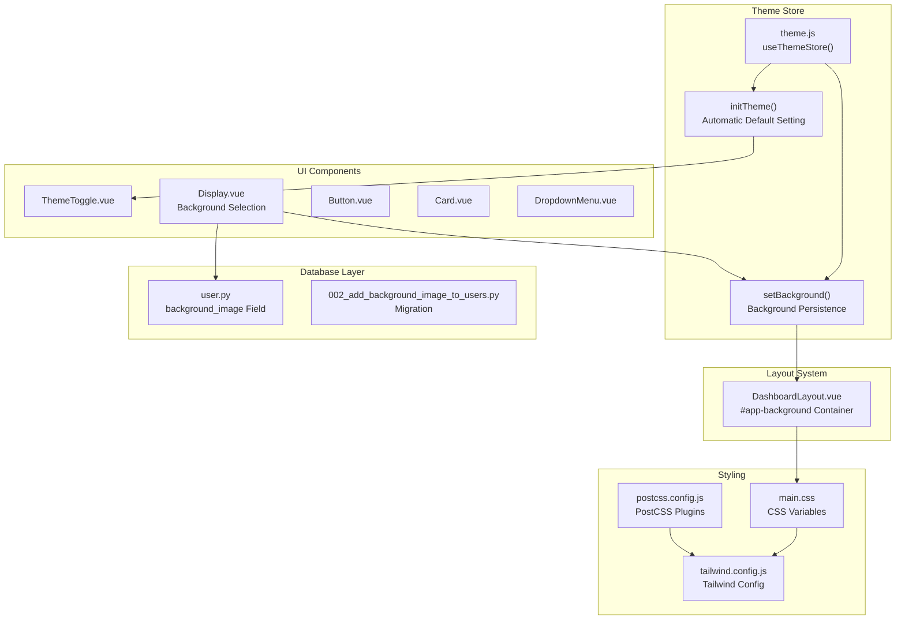
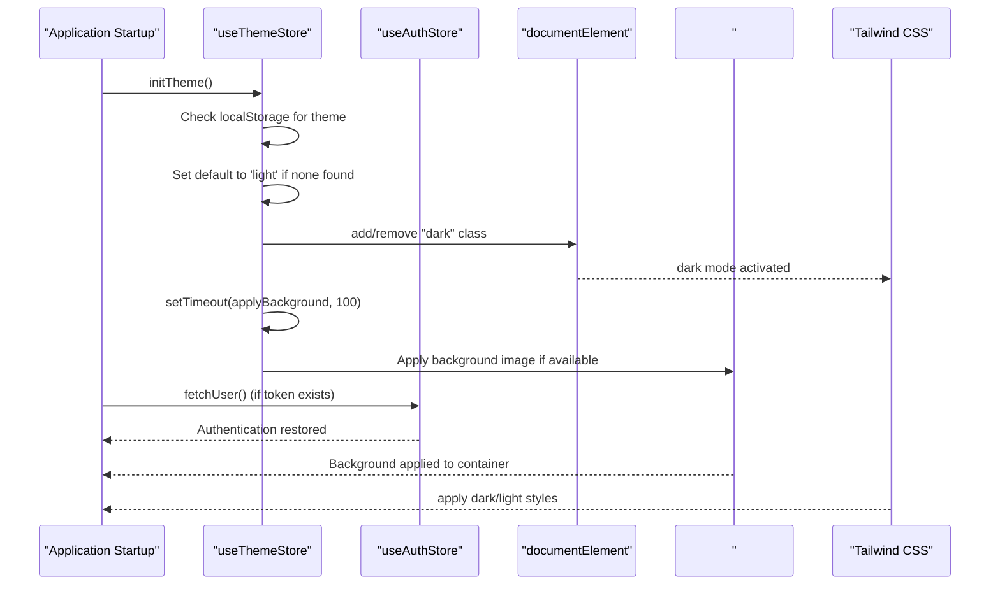
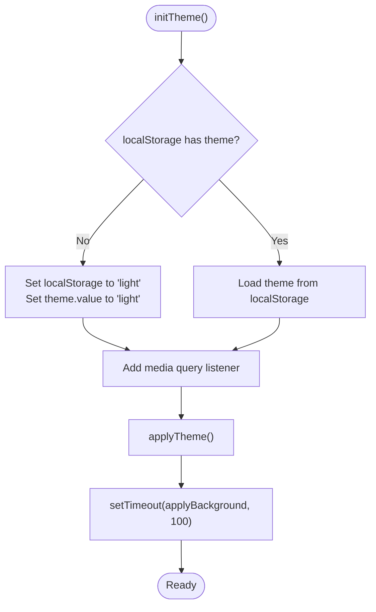
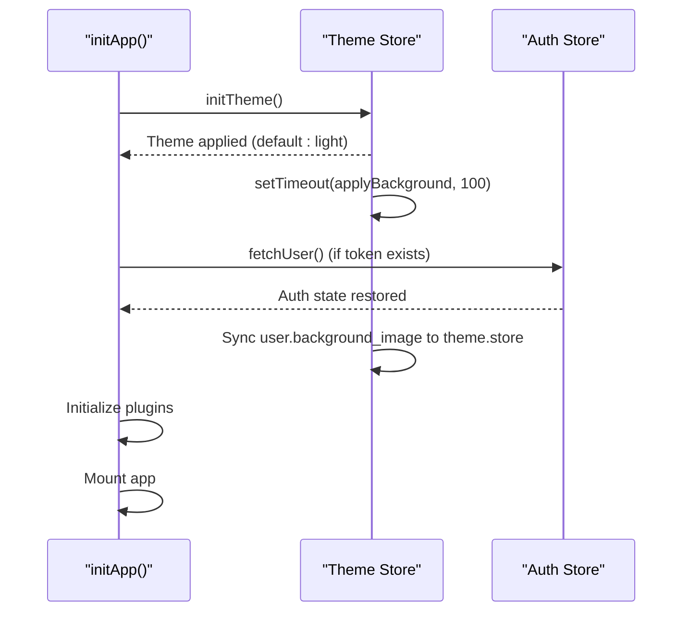
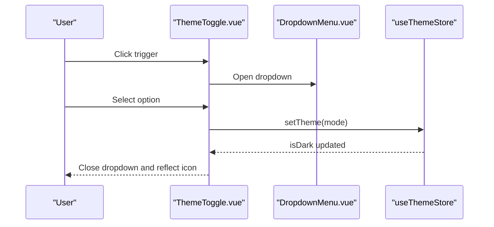
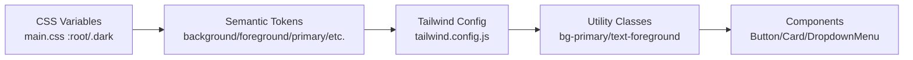
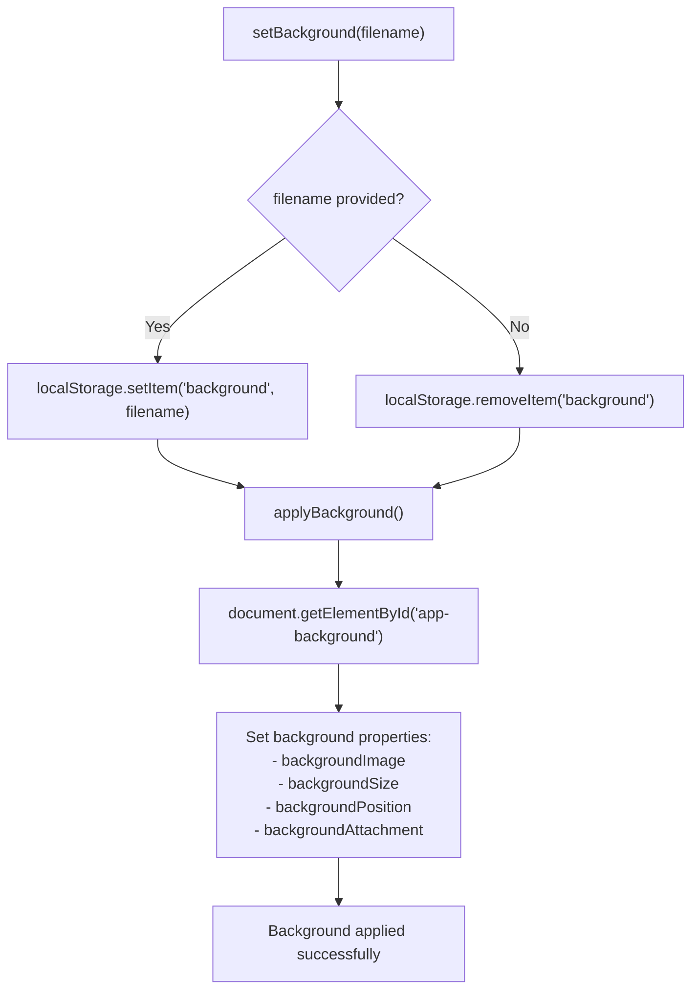
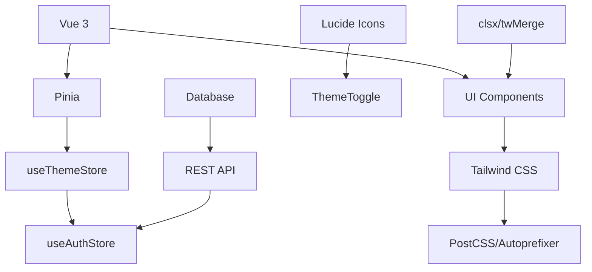

# Theming and Customization

<cite>
**Referenced Files in This Document**
- [theme.js](file://frontend/src/stores/theme.js)
- [ThemeToggle.vue](file://frontend/src/components/ui/ThemeToggle.vue)
- [Display.vue](file://frontend/src/views/settings/Display.vue)
- [DashboardLayout.vue](file://frontend/src/layouts/DashboardLayout.vue)
- [tailwind.config.js](file://frontend/tailwind.config.js)
- [main.css](file://frontend/src/assets/css/main.css)
- [postcss.config.js](file://frontend/postcss.config.js)
- [main.js](file://frontend/src/main.js)
- [Button.vue](file://frontend/src/components/ui/Button.vue)
- [Card.vue](file://frontend/src/components/ui/Card.vue)
- [DropdownMenu.vue](file://frontend/src/components/ui/DropdownMenu.vue)
- [utils.js](file://frontend/src/lib/utils.js)
- [package.json](file://frontend/package.json)
- [auth.js](file://frontend/src/stores/auth.js)
- [user.py](file://backend/app/models/user.py)
- [002_add_background_image_to_users.py](file://backend/alembic/versions/002_add_background_image_to_users.py)
</cite>

## Update Summary
**Changes Made**
- Added comprehensive documentation for background image management system
- Updated theme store architecture to include background state management
- Enhanced initialization sequence to support background persistence
- Added background selection interface documentation
- Updated database schema documentation for background image field
- Expanded troubleshooting section with background-related guidance

## Table of Contents
1. [Introduction](#introduction)
2. [Project Structure](#project-structure)
3. [Core Components](#core-components)
4. [Architecture Overview](#architecture-overview)
5. [Detailed Component Analysis](#detailed-component-analysis)
6. [Background Image Management System](#background-image-management-system)
7. [Dependency Analysis](#dependency-analysis)
8. [Performance Considerations](#performance-considerations)
9. [Accessibility Considerations](#accessibility-considerations)
10. [Extending the Theme System](#extending-the-theme-system)
11. [Troubleshooting Guide](#troubleshooting-guide)
12. [Conclusion](#conclusion)

## Introduction
This document explains the comprehensive theming and customization system used in the frontend application. It covers the theme toggle component, theme store management, Tailwind CSS configuration, and how light and dark themes are implemented. The system now features enhanced automatic initialization that ensures users see the correct theme immediately upon application startup, along with advanced background image management capabilities. The background system supports dynamic background application, localStorage persistence, user profile synchronization, and responsive styling integration. It also documents color scheme customization, responsive design patterns, theme-aware components, CSS variable usage, dynamic styling, persistence mechanisms, user preference handling, and system theme detection. Accessibility considerations and guidelines for extending the theme system are included.

## Project Structure
The theming system spans four main areas:
- Theme store: reactive state management for theme and background selection with automatic initialization
- UI components: theme-aware components, theme toggle, and background selection interface
- Layout system: dashboard layout with background container integration
- Database layer: user model with background image persistence

**Diagram sources**
- [theme.js:4-90](file://frontend/src/stores/theme.js#L4-L90)
- [ThemeToggle.vue:1-36](file://frontend/src/components/ui/ThemeToggle.vue#L1-L36)
- [Display.vue:1-183](file://frontend/src/views/settings/Display.vue#L1-L183)
- [DashboardLayout.vue:29-30](file://frontend/src/layouts/DashboardLayout.vue#L29-L30)
- [user.py:17](file://backend/app/models/user.py#L17)
- [002_add_background_image_to_users.py:22](file://backend/alembic/versions/002_add_background_image_to_users.py#L22)

**Section sources**
- [theme.js:1-91](file://frontend/src/stores/theme.js#L1-L91)
- [ThemeToggle.vue:1-36](file://frontend/src/components/ui/ThemeToggle.vue#L1-L36)
- [Display.vue:1-183](file://frontend/src/views/settings/Display.vue#L1-L183)
- [DashboardLayout.vue:1-140](file://frontend/src/layouts/DashboardLayout.vue#L1-L140)
- [user.py:1-39](file://backend/app/models/user.py#L1-L39)
- [002_add_background_image_to_users.py:1-27](file://backend/alembic/versions/002_add_background_image_to_users.py#L1-L27)

## Core Components
- Theme store: manages current theme, background image, system theme, effective theme, and applies CSS classes to the document root with automatic initialization
- Theme toggle: a dropdown-triggered UI element allowing users to switch between light, dark, and system modes
- Background management: comprehensive system for selecting, persisting, and synchronizing background images with user profiles
- Display settings: dedicated interface for theme and background customization
- Dashboard layout: container element that applies background images with cover, center, and fixed positioning
- Tailwind configuration: defines dark mode behavior, CSS variable-based color tokens, and typography
- CSS variables: define semantic color tokens for light and dark modes
- Theme-aware components: buttons, cards, and dropdown menus that consume Tailwind color tokens

Key responsibilities:
- Persist theme and background preferences in local storage with automatic default setting
- React to system theme changes via media queries
- Apply a "dark" class to the document root to enable dark mode styling
- Manage background image state with localStorage and user profile synchronization
- Provide computed properties for theme state and toggling logic
- Initialize theme system before authentication state restoration
- Apply background images to the #app-background container with responsive styling

**Section sources**
- [theme.js:4-90](file://frontend/src/stores/theme.js#L4-L90)
- [ThemeToggle.vue:1-36](file://frontend/src/components/ui/ThemeToggle.vue#L1-L36)
- [Display.vue:15-70](file://frontend/src/views/settings/Display.vue#L15-L70)
- [DashboardLayout.vue:29-30](file://frontend/src/layouts/DashboardLayout.vue#L29-L30)
- [tailwind.config.js:10-56](file://frontend/tailwind.config.js#L10-L56)
- [main.css:7-52](file://frontend/src/assets/css/main.css#L7-L52)

## Architecture Overview
The theme system follows a unidirectional data flow with enhanced initialization and background management:
- The theme store holds the selected theme, background image, and system theme
- The effective theme is derived and used to toggle the "dark" class on the document root
- Background images are managed separately but synchronized with user preferences
- Tailwind CSS reads the "dark" class to switch between light and dark color tokens
- Components use Tailwind utility classes that resolve to CSS variables
- **Enhanced**: Theme initialization occurs before authentication state restoration to ensure immediate visual feedback
- **New**: Background initialization occurs after DOM readiness with timeout delay for proper element availability

**Diagram sources**
- [main.js:162-183](file://frontend/src/main.js#L162-L183)
- [theme.js:61-74](file://frontend/src/stores/theme.js#L61-L74)
- [theme.js:48-59](file://frontend/src/stores/theme.js#L48-L59)

## Detailed Component Analysis

### Enhanced Theme Store Management
The theme store now includes automatic initialization with default theme setting and background management:
- Reactive theme state with persistence in local storage
- Background image state with localStorage and user profile synchronization
- System theme detection via media queries
- Computed effective theme and dark-mode flag
- **Enhanced**: Automatic initialization routine that sets default to light mode when no user preference is detected
- **New**: Background management functions for setting, persisting, and applying background images
- Utility to apply the "dark" class to the document root
- **New**: Background application function that targets the #app-background container

**Updated** Enhanced initialization process ensures immediate theme application before authentication

Implementation highlights:
- Persistence: theme and background values saved to and loaded from local storage
- **Enhanced**: Default theme setting: automatically sets to 'light' if no preference exists
- Background persistence: background image filename stored in localStorage
- System theme: listens for media query change events and updates accordingly
- Effective theme: resolves to system theme when set to "system", otherwise uses the selected theme
- Root class application: toggles the "dark" class on the document element
- **New**: Background application: sets CSS background properties on the #app-background element

**Diagram sources**
- [theme.js:61-74](file://frontend/src/stores/theme.js#L61-L74)
- [theme.js:39-46](file://frontend/src/stores/theme.js#L39-L46)

**Section sources**
- [theme.js:4-90](file://frontend/src/stores/theme.js#L4-L90)

### Application Initialization Sequence
The application now initializes the theme system before authentication with enhanced background management:
- Theme initialization occurs first to ensure immediate visual feedback
- Background application waits for DOM readiness with timeout
- Authentication state restoration happens after theme and background are applied
- Plugin registry initialization follows authentication restoration
- **New**: User background preference synchronization from profile to theme store

**Updated** New initialization sequence prioritizes theme and background application for better user experience

**Diagram sources**
- [main.js:162-183](file://frontend/src/main.js#L162-L183)
- [theme.js:61-74](file://frontend/src/stores/theme.js#L61-L74)

**Section sources**
- [main.js:162-183](file://frontend/src/main.js#L162-L183)

### Theme Toggle Component
The theme toggle is a dropdown menu that:
- Displays a sun/moon icon based on current theme
- Offers options for light, dark, and system modes
- Uses Tailwind classes that resolve to CSS variables for colors

Behavior:
- Uses the theme store to determine the current icon and to set the theme
- Closes the dropdown after a selection is made

**Diagram sources**
- [ThemeToggle.vue:10-35](file://frontend/src/components/ui/ThemeToggle.vue#L10-L35)
- [DropdownMenu.vue:27-47](file://frontend/src/components/ui/DropdownMenu.vue#L27-L47)
- [theme.js:23-27](file://frontend/src/stores/theme.js#L23-L27)

**Section sources**
- [ThemeToggle.vue:1-36](file://frontend/src/components/ui/ThemeToggle.vue#L1-L36)
- [DropdownMenu.vue:1-49](file://frontend/src/components/ui/DropdownMenu.vue#L1-L49)

### Tailwind CSS Configuration and CSS Variables
Tailwind is configured to use a class-based dark mode strategy and to resolve color tokens through CSS variables. The configuration:
- Enables dark mode using the "class" strategy
- Extends color palette with CSS variable-based tokens
- Adds typography and border radius tokens backed by CSS variables
- Includes a plugin for animations

CSS variables define semantic tokens for both light and dark modes. The "dark" class applied by the theme store switches between these definitions.

**Diagram sources**
- [main.css:7-52](file://frontend/src/assets/css/main.css#L7-L52)
- [tailwind.config.js:10-56](file://frontend/tailwind.config.js#L10-L56)
- [Button.vue:25-49](file://frontend/src/components/ui/Button.vue#L25-L49)
- [Card.vue:9-13](file://frontend/src/components/ui/Card.vue#L9-L13)
- [DropdownMenu.vue:40-46](file://frontend/src/components/ui/DropdownMenu.vue#L40-L46)

**Section sources**
- [tailwind.config.js:4-56](file://frontend/tailwind.config.js#L4-L56)
- [main.css:7-52](file://frontend/src/assets/css/main.css#L7-L52)

### Theme-Aware Components
Theme-aware components rely on Tailwind utility classes that resolve to CSS variables. Examples:
- Button: variant and size classes that depend on primary, secondary, destructive, and accent tokens
- Card: background and foreground tokens for surface and text
- DropdownMenu: popover background and text tokens for menu appearance

These components automatically adapt to theme changes because they use Tailwind classes that map to CSS variables.

**Section sources**
- [Button.vue:25-49](file://frontend/src/components/ui/Button.vue#L25-L49)
- [Card.vue:9-13](file://frontend/src/components/ui/Card.vue#L9-L13)
- [DropdownMenu.vue:40-46](file://frontend/src/components/ui/DropdownMenu.vue#L40-L46)

### Dynamic Styling and Responsive Patterns
Dynamic styling is achieved through:
- CSS variables for semantic tokens
- Tailwind utilities that resolve to those tokens
- A "dark" class on the root element to switch between light and dark definitions

Responsive patterns:
- Typography scales through Tailwind font utilities
- Spacing and sizing utilities adapt across breakpoints
- Component variants (size, variant) provide consistent responsive behavior
- **New**: Background images use cover, center, and fixed positioning for optimal responsive display

**Section sources**
- [main.css:54-63](file://frontend/src/assets/css/main.css#L54-L63)
- [tailwind.config.js:52-54](file://frontend/tailwind.config.js#L52-L54)
- [Button.vue:37-42](file://frontend/src/components/ui/Button.vue#L37-L42)

## Background Image Management System

### Background State Management
The theme store now manages background image state alongside theme preferences:
- Background state: reactive reference to currently selected background filename
- Local storage persistence: background image filename stored in localStorage
- User profile synchronization: background preference synced from user profile data
- Available backgrounds: configurable list of background image filenames
- Background application: dynamic CSS property manipulation for the #app-background container

**New** Comprehensive background management system with persistence and synchronization

Implementation details:
- Background persistence: filename stored in localStorage under 'background' key
- User synchronization: on mount, checks user.profile for background_image and syncs if localStorage empty
- Background clearing: removes localStorage entry when null is set
- Background application: sets backgroundImage, backgroundSize, backgroundPosition, and backgroundAttachment properties
- Container targeting: applies styles to element with id 'app-background'

**Diagram sources**
- [theme.js:29-59](file://frontend/src/stores/theme.js#L29-L59)

**Section sources**
- [theme.js:5-6](file://frontend/src/stores/theme.js#L5-L6)
- [theme.js:29-59](file://frontend/src/stores/theme.js#L29-L59)

### Background Selection Interface
The Display settings page provides a comprehensive interface for background management:
- Background gallery: grid layout displaying available background images
- Selection feedback: visual indicators showing currently selected background
- User profile integration: automatic synchronization with user's background preference
- Save confirmation: visual feedback when background is successfully saved
- Clear functionality: option to remove background selection

**New** Dedicated background selection interface with user profile integration

Features:
- Background grid: responsive grid (2-4 columns based on screen size)
- Image preview: thumbnail images with aspect ratio preservation
- Selection indicator: checkmark overlay for selected background
- Filename display: white text overlay with background for filename visibility
- Save mechanism: PUT request to /api/v1/users/me/background endpoint
- Clear button: removes background selection and updates user profile

**Section sources**
- [Display.vue:15-70](file://frontend/src/views/settings/Display.vue#L15-L70)
- [Display.vue:150-182](file://frontend/src/views/settings/Display.vue#L150-L182)

### Background Container Integration
The dashboard layout provides the container element for background application:
- Container element: #app-background div with flex layout and overflow handling
- Background application: theme store applies background styles to this container
- Responsive behavior: maintains layout integrity across different screen sizes
- Content isolation: background appears behind layout elements while content remains accessible

**New** Centralized background container with responsive design integration

Implementation:
- Container location: main layout wrapper with id 'app-background'
- Background properties: cover, center, fixed positioning for optimal visual effect
- Layout compatibility: works with sidebar, header, and main content areas
- Performance optimization: fixed attachment prevents parallax scrolling issues

**Section sources**
- [DashboardLayout.vue:29-30](file://frontend/src/layouts/DashboardLayout.vue#L29-L30)
- [DashboardLayout.vue:19-21](file://frontend/src/layouts/DashboardLayout.vue#L19-L21)

### Database Schema Integration
The user model now includes background image support:
- Database field: background_image column in users table
- Data type: string with maximum length of 255 characters
- Nullable support: allows null values for users without background preference
- Migration support: alembic migration adds background_image column to existing users table

**New** Backend support for background image persistence

Schema details:
- Column definition: String(255), nullable=True
- Default value: None (no background selected)
- Storage format: filename string (e.g., 'bg1.avif', 'custom-bg.jpg')
- API integration: REST endpoint for updating user background preference

**Section sources**
- [user.py:17](file://backend/app/models/user.py#L17)
- [002_add_background_image_to_users.py:22](file://backend/alembic/versions/002_add_background_image_to_users.py#L22)

## Dependency Analysis
The theme system depends on:
- Vue 3 reactivity and Pinia for state management
- Tailwind CSS for utility classes and dark mode
- PostCSS for processing Tailwind and vendor prefixes
- Lucide icons for theme toggle visuals
- Class merging utilities for component composition
- **New**: User authentication store for profile synchronization
- **New**: REST API endpoints for background preference persistence

**Diagram sources**
- [package.json:11-29](file://frontend/package.json#L11-L29)
- [theme.js:1-2](file://frontend/src/stores/theme.js#L1-L2)
- [ThemeToggle.vue:5](file://frontend/src/components/ui/ThemeToggle.vue#L5)
- [utils.js:1-6](file://frontend/src/lib/utils.js#L1-L6)
- [Display.vue:3](file://frontend/src/views/settings/Display.vue#L3)

**Section sources**
- [package.json:11-29](file://frontend/package.json#L11-L29)
- [theme.js:1-2](file://frontend/src/stores/theme.js#L1-L2)
- [utils.js:1-6](file://frontend/src/lib/utils.js#L1-L6)

## Performance Considerations
- CSS variable usage minimizes style recalculation and enables efficient theme switching
- Applying a single "dark" class to the root element avoids cascading style updates across the DOM
- Tailwind utilities are generated at build time, reducing runtime overhead
- Media query listeners are attached once during initialization to avoid repeated event binding
- **Enhanced**: Automatic theme initialization occurs before authentication, reducing perceived latency and improving user experience
- **New**: Background application uses setTimeout with 100ms delay to ensure DOM readiness
- **New**: Background images use fixed positioning to prevent layout recalculations during scroll
- **New**: Background persistence uses localStorage for fast retrieval without network requests

## Accessibility Considerations
Color contrast:
- Ensure sufficient contrast between foreground and background tokens in both light and dark modes
- Test contrast ratios for interactive elements (buttons, links) against their backgrounds
- **New**: Background images should not interfere with text readability; consider overlay effects for optimal contrast

Typography:
- Maintain readable font sizes and line heights across themes
- Prefer system fonts and ensure fallbacks for accessibility
- **New**: Background images should not obscure text content; test with various background choices

Visual design:
- Provide clear affordances for theme selection (icons, labels)
- Respect user preferences and system settings
- **New**: Background selection should be keyboard accessible and screen-reader friendly
- **New**: Ensure sufficient contrast between background images and UI elements

## Extending the Theme System
To add custom color schemes:
- Define new CSS variables in the appropriate scope (root or .dark)
- Extend Tailwind's color palette in the configuration to reference the new variables
- Add new theme options in the theme toggle component
- Update the theme store to handle the new mode if needed

To add custom tokens:
- Add new semantic tokens to the CSS variable definitions
- Reference the tokens in Tailwind's theme extension
- Use the tokens in component classes

To support additional modes:
- Extend the theme store logic to compute effective theme for new modes
- Update the UI to expose the new option

**New** To extend background management:
- Add new background image filenames to the backgrounds array in Display.vue
- Update the availableBackgrounds array in theme.js with dynamic population
- Consider implementing background upload functionality for custom images
- Add background preview generation and caching mechanisms

**Section sources**
- [main.css:7-52](file://frontend/src/assets/css/main.css#L7-L52)
- [tailwind.config.js:10-46](file://frontend/tailwind.config.js#L10-L46)
- [ThemeToggle.vue:20-32](file://frontend/src/components/ui/ThemeToggle.vue#L20-L32)
- [theme.js:17-21](file://frontend/src/stores/theme.js#L17-L21)
- [Display.vue:17-24](file://frontend/src/views/settings/Display.vue#L17-L24)

## Troubleshooting Guide
Common issues and resolutions:
- Theme does not persist across reloads: verify local storage key and initialization logic
- **Enhanced**: Theme not applying on initial load: check that `initTheme()` is called before authentication restoration
- **New**: Default theme not light mode: verify the automatic default setting logic in `initTheme()`
- **New**: Background not appearing: check that #app-background element exists and `applyBackground()` is called after DOM readiness
- **New**: Background not persisting: verify localStorage 'background' key and `setBackground()` function
- **New**: Background not syncing from user profile: check authentication store user data and `onMounted()` synchronization logic
- **New**: Background images not loading: verify nginx configuration serves files from /backgrounds/ directory
- Dark mode not applying: check that the "dark" class is present on the root element
- Colors appear incorrect: confirm CSS variable definitions for both light and dark modes
- System theme changes not reflected: ensure media query listener is registered and effective theme computation is correct
- **Enhanced**: Authentication conflicts with theme: verify the initialization sequence in `initApp()`

**Section sources**
- [theme.js:5-8](file://frontend/src/stores/theme.js#L5-L8)
- [theme.js:61-74](file://frontend/src/stores/theme.js#L61-L74)
- [theme.js:48-59](file://frontend/src/stores/theme.js#L48-L59)
- [main.css:31-51](file://frontend/src/assets/css/main.css#L31-L51)
- [main.js:162-183](file://frontend/src/main.js#L162-L183)
- [Display.vue:26-31](file://frontend/src/views/settings/Display.vue#L26-L31)

## Conclusion
The enhanced theming system leverages CSS variables, Tailwind utilities, and a centralized theme store to deliver a seamless light/dark theme experience with advanced background image management. The new automatic initialization ensures users see the correct theme immediately upon application startup, even when no user preference is detected. The background management system provides comprehensive functionality including dynamic background application, localStorage persistence, user profile synchronization, and responsive styling integration. It respects user preferences, persists selections, and adapts to system changes. The pre-authentication initialization sequence improves user experience by eliminating theme flicker. The background container system ensures optimal visual presentation across different screen sizes and devices. Components remain theme-aware through Tailwind classes that resolve to semantic tokens, ensuring consistent styling across modes. The system is extensible, allowing new color schemes and tokens with minimal effort, and the enhanced initialization process provides a robust foundation for future theme system enhancements. The addition of background image management creates a more personalized and visually appealing user experience while maintaining performance and accessibility standards.