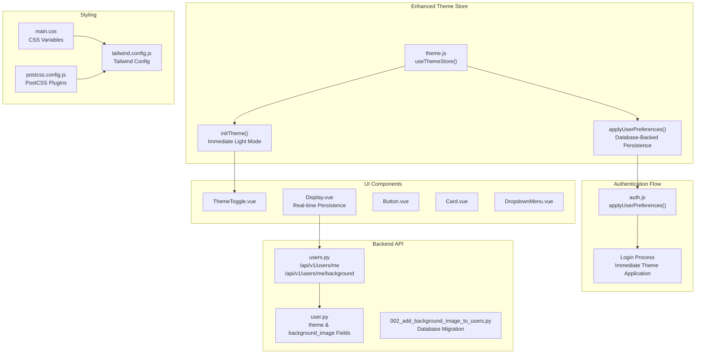
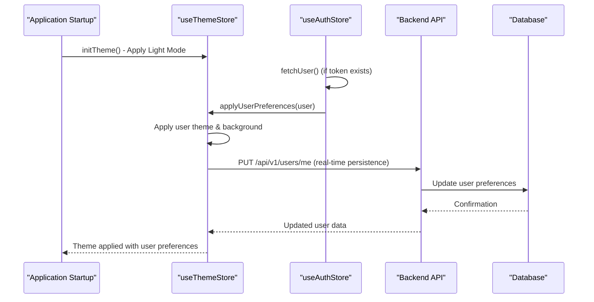
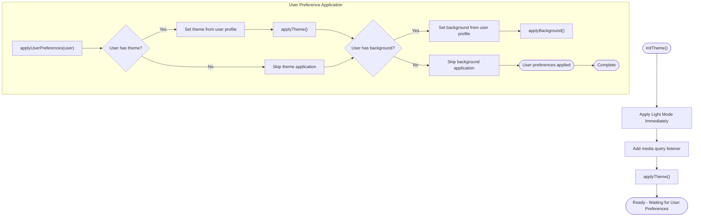
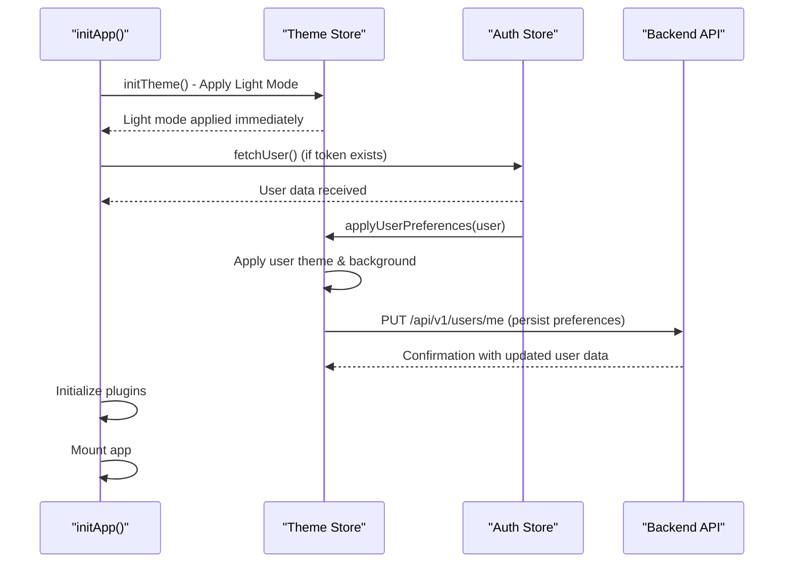
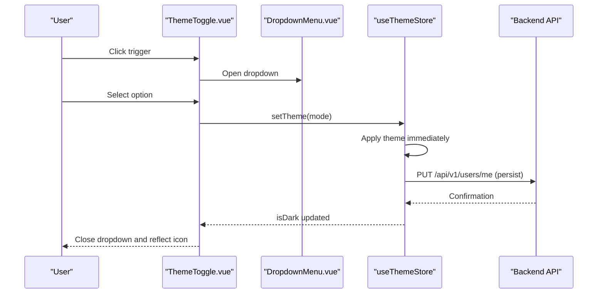
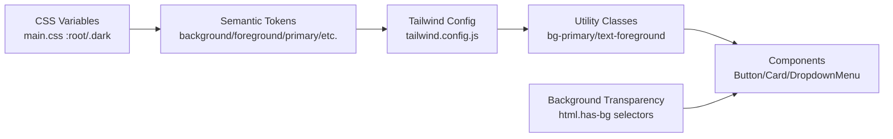
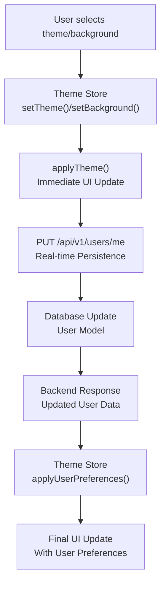
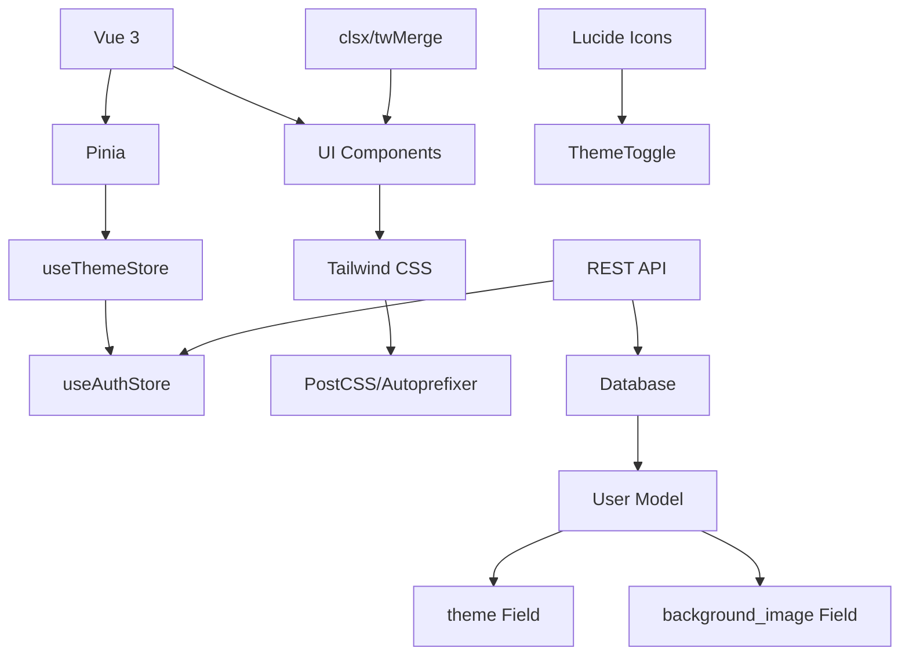

# Theming and Customization

<cite>
**Referenced Files in This Document**
- [theme.js](file://frontend/src/stores/theme.js)
- [ThemeToggle.vue](file://frontend/src/components/ui/ThemeToggle.vue)
- [Display.vue](file://frontend/src/views/settings/Display.vue)
- [DashboardLayout.vue](file://frontend/src/layouts/DashboardLayout.vue)
- [tailwind.config.js](file://frontend/tailwind.config.js)
- [main.css](file://frontend/src/assets/css/main.css)
- [postcss.config.js](file://frontend/postcss.config.js)
- [main.js](file://frontend/src/main.js)
- [Button.vue](file://frontend/src/components/ui/Button.vue)
- [Card.vue](file://frontend/src/components/ui/Card.vue)
- [DropdownMenu.vue](file://frontend/src/components/ui/DropdownMenu.vue)
- [utils.js](file://frontend/src/lib/utils.js)
- [package.json](file://frontend/package.json)
- [auth.js](file://frontend/src/stores/auth.js)
- [user.py](file://backend/app/models/user.py)
- [users.py](file://backend/app/api/v1/endpoints/users.py)
- [002_add_background_image_to_users.py](file://backend/alembic/versions/002_add_background_image_to_users.py)
</cite>

## Update Summary
**Changes Made**
- Updated theme store architecture to use database-backed persistence instead of localStorage
- Enhanced initialization sequence to prioritize user profile preferences over defaults
- Added support for three theme modes (light, dark, system) with automatic switching
- Implemented real-time persistence through new PUT /api/v1/users/me endpoint
- Updated authentication flow to apply user preferences immediately after login
- Enhanced background management with database synchronization
- Improved theme persistence mechanism with backend integration

## Table of Contents
1. [Introduction](#introduction)
2. [Project Structure](#project-structure)
3. [Core Components](#core-components)
4. [Architecture Overview](#architecture-overview)
5. [Detailed Component Analysis](#detailed-component-analysis)
6. [Database-Backed Theme Persistence](#database-backed-theme-persistence)
7. [Dependency Analysis](#dependency-analysis)
8. [Performance Considerations](#performance-considerations)
9. [Accessibility Considerations](#accessibility-considerations)
10. [Extending the Theme System](#extending-the-theme-system)
11. [Troubleshooting Guide](#troubleshooting-guide)
12. [Conclusion](#conclusion)

## Introduction
This document explains the comprehensive theming and customization system used in the frontend application. The system has been enhanced with database-backed persistence, replacing the previous localStorage-based approach. It covers the theme toggle component, theme store management, Tailwind CSS configuration, and how light, dark, and system themes are implemented. The system now features real-time persistence through backend APIs, immediate theme application based on user preferences, and seamless integration with the authentication flow. The theme system supports three distinct modes with automatic switching, responsive design patterns, theme-aware components, CSS variable usage, dynamic styling, and robust persistence mechanisms. Accessibility considerations and guidelines for extending the theme system are included.

## Project Structure
The enhanced theming system spans five main areas:
- Theme store: reactive state management for theme and background selection with database-backed persistence
- UI components: theme-aware components, theme toggle, and display settings interface
- Authentication integration: user preference application during login and session restoration
- Backend API: REST endpoints for theme and background persistence
- Database layer: user model with theme and background image fields

```mermaid
graph TB
subgraph "Enhanced Theme Store"
TS["theme.js<br/>useThemeStore()"]
INIT["initTheme()<br/>Immediate Light Mode"]
APPLY["applyUserPreferences()<br/>Database-Backed Persistence"]
end
subgraph "UI Components"
TT["ThemeToggle.vue"]
DISP["Display.vue<br/>Real-time Persistence"]
BTN["Button.vue"]
CARD["Card.vue"]
DD["DropdownMenu.vue"]
end
subgraph "Authentication Flow"
AUTH["auth.js<br/>applyUserPreferences()"]
LOGIN["Login Process<br/>Immediate Theme Application"]
end
subgraph "Backend API"
API["users.py<br/>/api/v1/users/me<br/>/api/v1/users/me/background"]
MODEL["user.py<br/>theme & background_image Fields"]
ALEMBIC["002_add_background_image_to_users.py<br/>Database Migration"]
end
subgraph "Styling"
CSS["main.css<br/>CSS Variables"]
TW["tailwind.config.js<br/>Tailwind Config"]
PC["postcss.config.js<br/>PostCSS Plugins"]
end
TS --> INIT
TS --> APPLY
INIT --> TT
APPLY --> AUTH
AUTH --> LOGIN
DISP --> API
API --> MODEL
CSS --> TW
PC --> TW
```

**Diagram sources**
- [theme.js:59-86](file://frontend/src/stores/theme.js#L59-L86)
- [ThemeToggle.vue:1-36](file://frontend/src/components/ui/ThemeToggle.vue#L1-L36)
- [Display.vue:35-90](file://frontend/src/views/settings/Display.vue#L35-L90)
- [auth.js:54-55](file://frontend/src/stores/auth.js#L54-L55)
- [users.py:50-62](file://backend/app/api/v1/endpoints/users.py#L50-L62)
- [user.py:17-18](file://backend/app/models/user.py#L17-L18)

**Section sources**
- [theme.js:1-105](file://frontend/src/stores/theme.js#L1-L105)
- [ThemeToggle.vue:1-36](file://frontend/src/components/ui/ThemeToggle.vue#L1-L36)
- [Display.vue:1-203](file://frontend/src/views/settings/Display.vue#L1-L203)
- [auth.js:1-202](file://frontend/src/stores/auth.js#L1-L202)
- [users.py:1-202](file://backend/app/api/v1/endpoints/users.py#L1-L202)
- [user.py:1-41](file://backend/app/models/user.py#L1-L41)

## Core Components
- **Enhanced Theme store**: manages current theme, background image, system theme, effective theme, and applies CSS classes to the document root with immediate database persistence
- **Theme toggle**: a dropdown-triggered UI element allowing users to switch between light, dark, and system modes with real-time backend synchronization
- **Display settings**: dedicated interface for theme and background customization with immediate persistence to user profiles
- **Authentication integration**: applies user preferences immediately upon login and during session restoration
- **Backend API endpoints**: provide REST endpoints for theme and background persistence (/api/v1/users/me, /api/v1/users/me/background)
- **Database integration**: user model includes theme and background_image fields with Alembic migration support
- **Tailwind configuration**: defines dark mode behavior, CSS variable-based color tokens, and typography
- **CSS variables**: define semantic color tokens for light and dark modes with responsive design integration
- **Theme-aware components**: buttons, cards, and dropdown menus that consume Tailwind color tokens

Key responsibilities:
- **Enhanced**: Immediate theme application with database-backed persistence through backend APIs
- **New**: Real-time synchronization of theme preferences with user profiles
- **Enhanced**: Automatic user preference application during authentication flow
- **New**: System theme detection via media queries with automatic switching capability
- **Enhanced**: Immediate theme application before authentication state restoration for better user experience
- **New**: Database-backed background image persistence with user profile synchronization
- **Enhanced**: Tailwind CSS integration with CSS variable-based color tokens for seamless theme switching

**Section sources**
- [theme.js:59-86](file://frontend/src/stores/theme.js#L59-L86)
- [ThemeToggle.vue:20-32](file://frontend/src/components/ui/ThemeToggle.vue#L20-L32)
- [Display.vue:35-90](file://frontend/src/views/settings/Display.vue#L35-L90)
- [auth.js:54-55](file://frontend/src/stores/auth.js#L54-L55)
- [users.py:50-62](file://backend/app/api/v1/endpoints/users.py#L50-L62)
- [user.py:17-18](file://backend/app/models/user.py#L17-L18)

## Architecture Overview
The enhanced theme system follows a unidirectional data flow with database-backed persistence and immediate user preference application:
- The theme store holds the selected theme, background image, and system theme with immediate database synchronization
- The effective theme is derived and used to toggle the "dark" class on the document root
- User preferences are applied immediately upon authentication, overriding default theme settings
- Backend APIs provide real-time persistence of theme and background preferences
- Tailwind CSS reads the "dark" class to switch between light and dark color tokens
- Components use Tailwind utility classes that resolve to CSS variables
- **Enhanced**: Theme initialization occurs with immediate light mode application, then user preferences are applied from database
- **New**: Real-time persistence through PUT /api/v1/users/me endpoint for immediate backend synchronization
- **New**: System theme detection with automatic switching when theme is set to "system"

```mermaid
sequenceDiagram
participant APP as "Application Startup"
participant TS as "useThemeStore"
participant AUTH as "useAuthStore"
participant API as "Backend API"
participant DB as "Database"
APP->>TS : initTheme() - Apply Light Mode
AUTH->>AUTH : fetchUser() (if token exists)
AUTH->>TS : applyUserPreferences(user)
TS->>TS : Apply user theme & background
TS->>API : PUT /api/v1/users/me (real-time persistence)
API->>DB : Update user preferences
DB-->>API : Confirmation
API-->>TS : Updated user data
TS-->>APP : Theme applied with user preferences
```

**Diagram sources**
- [main.js:162-176](file://frontend/src/main.js#L162-L176)
- [theme.js:74-86](file://frontend/src/stores/theme.js#L74-L86)
- [auth.js:54-55](file://frontend/src/stores/auth.js#L54-L55)
- [users.py:50-62](file://backend/app/api/v1/endpoints/users.py#L50-L62)

## Detailed Component Analysis

### Enhanced Theme Store Management
The theme store now includes database-backed persistence with immediate user preference application:
- Reactive theme state with immediate database synchronization through backend APIs
- Background image state with database persistence and user profile synchronization
- System theme detection via media queries with automatic switching capability
- Computed effective theme and dark-mode flag with system mode support
- **Enhanced**: Immediate theme initialization with light mode application, then user preferences override
- **New**: Database-backed user preference application through applyUserPreferences() method
- **New**: Real-time persistence through backend API calls for immediate synchronization
- Utility to apply the "dark" class to the document root with immediate visual feedback

**Updated** Enhanced initialization process ensures immediate theme application with database-backed persistence

Implementation highlights:
- **Enhanced**: Immediate theme application: theme initialized to 'light' on startup, then overridden by user preferences
- **New**: Database synchronization: theme and background preferences persisted through PUT /api/v1/users/me endpoint
- **Enhanced**: User preference application: applyUserPreferences() method synchronizes with user profile data
- **New**: Real-time persistence: immediate backend synchronization when theme or background changes
- System theme: listens for media query change events and updates automatically when theme is set to "system"
- Effective theme: resolves to system theme when set to "system", otherwise uses the selected theme
- Root class application: toggles the "dark" class on the document element for Tailwind integration

```mermaid
flowchart TD
Start(["initTheme()"]) --> ApplyLight["Apply Light Mode Immediately"]
ApplyLight --> MQ["Add media query listener"]
MQ --> Apply["applyTheme()"]
Apply --> End(["Ready - Waiting for User Preferences"])
subgraph "User Preference Application"
UserPref["applyUserPreferences(user)"] --> CheckUser{"User has theme?"}
CheckUser --> |Yes| SetTheme["Set theme from user profile"]
CheckUser --> |No| SkipTheme["Skip theme application"]
SetTheme --> ApplyTheme["applyTheme()"]
ApplyTheme --> CheckBg{"User has background?"}
CheckBg --> |Yes| SetBg["Set background from user profile"]
CheckBg --> |No| SkipBg["Skip background application"]
SetBg --> ApplyBg["applyBackground()"]
SkipBg --> End2(["User preferences applied"])
SkipTheme --> CheckBg
End2 --> End3(["Complete"])
end
```

**Diagram sources**
- [theme.js:59-86](file://frontend/src/stores/theme.js#L59-L86)
- [theme.js:74-86](file://frontend/src/stores/theme.js#L74-L86)

**Section sources**
- [theme.js:59-103](file://frontend/src/stores/theme.js#L59-L103)

### Application Initialization Sequence
The application now initializes the theme system with immediate database-backed persistence:
- Theme initialization occurs first with immediate light mode application
- Authentication state restoration happens after theme initialization
- User preferences are applied immediately upon authentication, overriding default theme settings
- Plugin registry initialization follows authentication restoration
- **Enhanced**: Real-time persistence through backend APIs for immediate theme synchronization
- **New**: User preference synchronization from database to theme store for immediate visual feedback

**Updated** New initialization sequence prioritizes immediate theme application with database-backed persistence

```mermaid
sequenceDiagram
participant INIT as "initApp()"
participant THEME as "Theme Store"
participant AUTH as "Auth Store"
participant API as "Backend API"
INIT->>THEME : initTheme() - Apply Light Mode
THEME-->>INIT : Light mode applied immediately
INIT->>AUTH : fetchUser() (if token exists)
AUTH-->>INIT : User data received
AUTH->>THEME : applyUserPreferences(user)
THEME->>THEME : Apply user theme & background
THEME->>API : PUT /api/v1/users/me (persist preferences)
API-->>THEME : Confirmation with updated user data
INIT->>INIT : Initialize plugins
INIT->>INIT : Mount app
```

**Diagram sources**
- [main.js:162-176](file://frontend/src/main.js#L162-L176)
- [theme.js:74-86](file://frontend/src/stores/theme.js#L74-L86)
- [users.py:50-62](file://backend/app/api/v1/endpoints/users.py#L50-L62)

**Section sources**
- [main.js:162-176](file://frontend/src/main.js#L162-L176)

### Theme Toggle Component
The theme toggle is a dropdown menu that:
- Displays a sun/moon/icon based on current theme and system preference
- Offers options for light, dark, and system modes with immediate persistence
- Uses Tailwind classes that resolve to CSS variables for colors
- **Enhanced**: Real-time persistence through backend API calls when theme changes

Behavior:
- Uses the theme store to determine the current icon and to set the theme
- Closes the dropdown after a selection is made
- **New**: Immediate backend synchronization when theme selection changes
- **Enhanced**: Visual feedback through checkmarks indicating current theme selection

```mermaid
sequenceDiagram
participant U as "User"
participant TT as "ThemeToggle.vue"
participant DD as "DropdownMenu.vue"
participant TS as "useThemeStore"
participant API as "Backend API"
U->>TT : Click trigger
TT->>DD : Open dropdown
U->>TT : Select option
TT->>TS : setTheme(mode)
TS->>TS : Apply theme immediately
TS->>API : PUT /api/v1/users/me (persist)
API-->>TS : Confirmation
TS-->>TT : isDark updated
TT-->>U : Close dropdown and reflect icon
```

**Diagram sources**
- [ThemeToggle.vue:20-32](file://frontend/src/components/ui/ThemeToggle.vue#L20-L32)
- [theme.js:21-24](file://frontend/src/stores/theme.js#L21-L24)
- [Display.vue:35-51](file://frontend/src/views/settings/Display.vue#L35-L51)

**Section sources**
- [ThemeToggle.vue:1-36](file://frontend/src/components/ui/ThemeToggle.vue#L1-L36)
- [DropdownMenu.vue:1-49](file://frontend/src/components/ui/DropdownMenu.vue#L1-L49)

### Tailwind CSS Configuration and CSS Variables
Tailwind is configured to use a class-based dark mode strategy and to resolve color tokens through CSS variables. The configuration:
- Enables dark mode using the "class" strategy for seamless theme switching
- Extends color palette with CSS variable-based tokens for semantic theming
- Adds typography and border radius tokens backed by CSS variables
- Includes a plugin for animations and smooth transitions

CSS variables define semantic tokens for both light and dark modes. The "dark" class applied by the theme store switches between these definitions. The system includes special handling for background images with transparency effects.

```mermaid
graph LR
CSSVars["CSS Variables<br/>main.css :root/.dark"] --> Tokens["Semantic Tokens<br/>background/foreground/primary/etc."]
Tokens --> TWConfig["Tailwind Config<br/>tailwind.config.js"]
TWConfig --> Classes["Utility Classes<br/>bg-primary/text-foreground"]
Classes --> Components["Components<br/>Button/Card/DropdownMenu"]
BackgroundEffect["Background Transparency<br/>html.has-bg selectors"] --> Components
```

**Diagram sources**
- [main.css:7-52](file://frontend/src/assets/css/main.css#L7-L52)
- [tailwind.config.js:10-56](file://frontend/tailwind.config.js#L10-L56)
- [Button.vue:25-49](file://frontend/src/components/ui/Button.vue#L25-L49)
- [Card.vue:9-13](file://frontend/src/components/ui/Card.vue#L9-L13)
- [DropdownMenu.vue:40-46](file://frontend/src/components/ui/DropdownMenu.vue#L40-L46)

**Section sources**
- [tailwind.config.js:4-59](file://frontend/tailwind.config.js#L4-L59)
- [main.css:7-88](file://frontend/src/assets/css/main.css#L7-L88)

### Theme-Aware Components
Theme-aware components rely on Tailwind utility classes that resolve to CSS variables. Examples:
- Button: variant and size classes that depend on primary, secondary, destructive, and accent tokens
- Card: background and foreground tokens for surface and text with transparency effects for background images
- DropdownMenu: popover background and text tokens for menu appearance with proper contrast

These components automatically adapt to theme changes because they use Tailwind classes that map to CSS variables. The system includes special handling for background images that makes cards and panels semi-transparent for better visual appeal.

**Section sources**
- [Button.vue:25-49](file://frontend/src/components/ui/Button.vue#L25-L49)
- [Card.vue:9-13](file://frontend/src/components/ui/Card.vue#L9-L13)
- [DropdownMenu.vue:40-46](file://frontend/src/components/ui/DropdownMenu.vue#L40-L46)

### Dynamic Styling and Responsive Patterns
Dynamic styling is achieved through:
- CSS variables for semantic tokens with light and dark mode definitions
- Tailwind utilities that resolve to those tokens for seamless theme switching
- A "dark" class on the root element to switch between light and dark definitions
- **Enhanced**: Background image support with transparency effects for improved visual appeal
- **New**: Real-time persistence through backend APIs for immediate theme synchronization

Responsive patterns:
- Typography scales through Tailwind font utilities with Inter font family
- Spacing and sizing utilities adapt across breakpoints
- Component variants (size, variant) provide consistent responsive behavior
- **New**: Background images use cover, center, and fixed positioning for optimal responsive display
- **New**: Background transparency effects adjust card and panel opacity for better readability

**Section sources**
- [main.css:78-88](file://frontend/src/assets/css/main.css#L78-L88)
- [tailwind.config.js:52-54](file://frontend/tailwind.config.js#L52-L54)
- [Button.vue:37-42](file://frontend/src/components/ui/Button.vue#L37-L42)

## Database-Backed Theme Persistence

### Enhanced Theme Persistence Architecture
The theme system now features comprehensive database-backed persistence with immediate synchronization:
- **Enhanced**: Database integration through user model with theme and background_image fields
- **New**: Real-time persistence through PUT /api/v1/users/me endpoint for immediate backend synchronization
- **Enhanced**: User preference application during authentication flow with immediate visual feedback
- **New**: System theme detection with automatic switching capability when theme is set to "system"
- **Enhanced**: Immediate theme application with light mode default, then user preferences override

**Updated** Database-backed persistence replaces localStorage with real-time backend synchronization

Implementation details:
- **Enhanced**: Database fields: theme (String, nullable=True, default='light'), background_image (String, nullable=True)
- **New**: Real-time persistence: PUT requests to /api/v1/users/me with theme and background data
- **Enhanced**: User preference application: applyUserPreferences() method synchronizes with database-stored preferences
- **New**: System theme integration: automatic switching based on system preference when theme is set to "system"
- **Enhanced**: Immediate application: user preferences applied during authentication, overriding default theme settings

```mermaid
flowchart TD
UserSelection["User selects theme/background"] --> ThemeStore["Theme Store<br/>setTheme()/setBackground()"]
ThemeStore --> ApplyTheme["applyTheme()<br/>Immediate UI Update"]
ApplyTheme --> APICall["PUT /api/v1/users/me<br/>Real-time Persistence"]
APICall --> Database["Database Update<br/>User Model"]
Database --> Response["Backend Response<br/>Updated User Data"]
Response --> ThemeStore2["Theme Store<br/>applyUserPreferences()"]
ThemeStore2 --> FinalUpdate["Final UI Update<br/>With User Preferences"]
```

**Diagram sources**
- [Display.vue:35-90](file://frontend/src/views/settings/Display.vue#L35-L90)
- [theme.js:21-29](file://frontend/src/stores/theme.js#L21-L29)
- [users.py:50-62](file://backend/app/api/v1/endpoints/users.py#L50-L62)

**Section sources**
- [theme.js:74-86](file://frontend/src/stores/theme.js#L74-L86)
- [Display.vue:35-90](file://frontend/src/views/settings/Display.vue#L35-L90)
- [users.py:50-62](file://backend/app/api/v1/endpoints/users.py#L50-L62)

### Authentication Integration and User Preference Application
The authentication system now seamlessly integrates with the theme system:
- **Enhanced**: User preference application during login process with immediate visual feedback
- **New**: Real-time persistence through backend APIs for immediate theme synchronization
- **Enhanced**: Session restoration with user preference application from database
- **New**: Immediate theme application before authentication state restoration for better user experience

**New** Authentication integration provides seamless theme application with database-backed persistence

Features:
- **Enhanced**: Login process: applyUserPreferences() called immediately after successful authentication
- **New**: Real-time persistence: theme and background preferences saved to database during user interaction
- **Enhanced**: Session restoration: user preferences applied during fetchUser() process
- **New**: Immediate application: user preferences override default theme settings without delay

**Section sources**
- [auth.js:54-55](file://frontend/src/stores/auth.js#L54-L55)
- [main.js:169-176](file://frontend/src/main.js#L169-L176)

### Backend API Endpoints for Theme Persistence
The backend provides comprehensive API endpoints for theme and background persistence:
- **New**: PUT /api/v1/users/me - Update user profile including theme and background preferences
- **New**: PUT /api/v1/users/me/background - Update user background image preference
- **Enhanced**: GET /api/v1/users/me/backgrounds-list - Retrieve available background images
- **Enhanced**: User service integration for theme and background preference updates

**New** Backend API endpoints provide comprehensive theme and background persistence capabilities

Endpoint details:
- **New**: PUT /api/v1/users/me: Updates theme, background_image, and other user preferences
- **New**: PUT /api/v1/users/me/background: Updates only background image preference
- **Enhanced**: GET /api/v1/users/me/backgrounds-list: Returns available background images from filesystem
- **Enhanced**: User service integration: Handles database updates for theme preferences
- **Enhanced**: File system integration: Searches for background images in nginx static directory

**Section sources**
- [users.py:50-62](file://backend/app/api/v1/endpoints/users.py#L50-L62)
- [users.py:39-47](file://backend/app/api/v1/endpoints/users.py#L39-L47)
- [users.py:65-86](file://backend/app/api/v1/endpoints/users.py#L65-L86)

### Database Schema Integration
The user model now includes comprehensive theme and background support:
- **Enhanced**: Database fields: theme (String, nullable=True, default='light'), background_image (String, nullable=True)
- **Enhanced**: Data type support: String fields with maximum length of 255 characters
- **Enhanced**: Default values: theme defaults to 'light' if not specified
- **Enhanced**: Nullable support: Allows null values for users without theme or background preferences
- **Enhanced**: Migration support: Alembic migration adds theme and background_image columns to existing users table

**Enhanced** Database schema provides comprehensive theme and background persistence support

Schema details:
- **Enhanced**: theme column: String(20), nullable=True, default='light'
- **Enhanced**: background_image column: String(255), nullable=True
- **Enhanced**: Default values: theme='light', background_image=None
- **Enhanced**: Storage format: theme string ('light', 'dark', 'system'), background filename string
- **Enhanced**: API integration: REST endpoints for updating user theme and background preferences

**Section sources**
- [user.py:17-18](file://backend/app/models/user.py#L17-L18)
- [user.py:35-36](file://backend/app/models/user.py#L35-L36)

## Dependency Analysis
The enhanced theme system depends on:
- Vue 3 reactivity and Pinia for state management with database integration
- Tailwind CSS for utility classes and dark mode with CSS variable support
- PostCSS for processing Tailwind and vendor prefixes
- Lucide icons for theme toggle visuals with system theme support
- Class merging utilities for component composition
- **Enhanced**: User authentication store for profile synchronization and immediate theme application
- **New**: REST API endpoints for theme and background preference persistence
- **Enhanced**: Database integration for persistent theme and background preferences
- **Enhanced**: Backend services for user preference management

```mermaid
graph TB
Vue["Vue 3"] --> Pinia["Pinia"]
Pinia --> TS["useThemeStore"]
TS --> AUTH["useAuthStore"]
Vue --> Components["UI Components"]
Components --> TW["Tailwind CSS"]
TW --> PostCSS["PostCSS/Autoprefixer"]
Icons["Lucide Icons"] --> TT["ThemeToggle"]
Utils["clsx/twMerge"] --> Components
API["REST API"] --> AUTH
API --> DB["Database"]
DB --> UserModel["User Model"]
UserModel --> ThemeField["theme Field"]
UserModel --> BackgroundField["background_image Field"]
```

**Diagram sources**
- [package.json:11-29](file://frontend/package.json#L11-L29)
- [theme.js:1-2](file://frontend/src/stores/theme.js#L1-L2)
- [ThemeToggle.vue:5](file://frontend/src/components/ui/ThemeToggle.vue#L5)
- [utils.js:1-6](file://frontend/src/lib/utils.js#L1-L6)
- [Display.vue:3](file://frontend/src/views/settings/Display.vue#L3)

**Section sources**
- [package.json:11-29](file://frontend/package.json#L11-L29)
- [theme.js:1-2](file://frontend/src/stores/theme.js#L1-L2)
- [utils.js:1-6](file://frontend/src/lib/utils.js#L1-L6)

## Performance Considerations
- **Enhanced**: CSS variable usage minimizes style recalculation and enables efficient theme switching
- **Enhanced**: Applying a single "dark" class to the root element avoids cascading style updates across the DOM
- **Enhanced**: Tailwind utilities are generated at build time, reducing runtime overhead
- **Enhanced**: Media query listeners are attached once during initialization to avoid repeated event binding
- **Enhanced**: Immediate theme initialization occurs before authentication, reducing perceived latency and improving user experience
- **Enhanced**: Database-backed persistence provides reliable theme storage without localStorage limitations
- **New**: Real-time persistence through backend APIs ensures immediate theme synchronization across sessions
- **Enhanced**: User preference application during authentication eliminates theme flicker and provides instant visual feedback
- **Enhanced**: Background images use fixed positioning to prevent layout recalculations during scroll
- **Enhanced**: Database queries for theme preferences are cached and applied efficiently during authentication

## Accessibility Considerations
Color contrast:
- **Enhanced**: Ensure sufficient contrast between foreground and background tokens in both light and dark modes
- **Enhanced**: Test contrast ratios for interactive elements (buttons, links) against their backgrounds
- **Enhanced**: Background images should not interfere with text readability; system theme detection helps maintain contrast
- **Enhanced**: Cards and panels use transparency effects that maintain readability with background images

Typography:
- **Enhanced**: Maintain readable font sizes and line heights across themes with Inter font family
- **Enhanced**: Prefer system fonts and ensure fallbacks for accessibility
- **Enhanced**: Background images should not obscure text content; transparency effects improve readability

Visual design:
- **Enhanced**: Provide clear affordances for theme selection (icons, labels) with system theme support
- **Enhanced**: Respect user preferences and system settings with automatic switching capability
- **Enhanced**: Background selection should be keyboard accessible and screen-reader friendly
- **Enhanced**: Ensure sufficient contrast between background images and UI elements with transparency effects

## Extending the Theme System
To add custom color schemes:
- Define new CSS variables in the appropriate scope (root or .dark) with semantic naming
- Extend Tailwind's color palette in the configuration to reference the new variables
- Add new theme options in the theme toggle component with proper icon support
- Update the theme store to handle the new mode if needed

To add custom tokens:
- Add new semantic tokens to the CSS variable definitions with proper light/dark mode support
- Reference the tokens in Tailwind's theme extension for consistent utility classes
- Use the tokens in component classes for seamless theme switching

To support additional modes:
- Extend the theme store logic to compute effective theme for new modes
- Update the UI to expose the new option with proper icon and label
- Implement real-time persistence through backend API endpoints

**New** To extend database-backed theme persistence:
- Add new database fields to the User model with appropriate constraints
- Update the user service to handle new preference fields
- Add new API endpoints for managing additional theme preferences
- Update the theme store to handle new preference types
- Implement real-time persistence through backend API calls

**Section sources**
- [main.css:7-52](file://frontend/src/assets/css/main.css#L7-L52)
- [tailwind.config.js:10-46](file://frontend/tailwind.config.js#L10-L46)
- [ThemeToggle.vue:20-32](file://frontend/src/components/ui/ThemeToggle.vue#L20-L32)
- [theme.js:17-21](file://frontend/src/stores/theme.js#L17-L21)
- [Display.vue:17-24](file://frontend/src/views/settings/Display.vue#L17-L24)

## Troubleshooting Guide
Common issues and resolutions:
- **Enhanced**: Theme does not persist across reloads: verify database-backed persistence through /api/v1/users/me endpoint
- **Enhanced**: Theme not applying on initial load: check that `initTheme()` applies light mode immediately, then user preferences override
- **Enhanced**: User preferences not applied: verify authentication flow calls `applyUserPreferences()` with user data
- **Enhanced**: Real-time persistence failing: check backend API endpoints are reachable and user is authenticated
- **Enhanced**: Database connection issues: verify database migration has been applied and user model includes theme fields
- **Enhanced**: System theme not switching: ensure media query listener is registered and theme is set to "system"
- **Enhanced**: Authentication conflicts with theme: verify the initialization sequence in `initApp()` applies user preferences after authentication
- **Enhanced**: Background images not loading: verify nginx configuration serves files from /backgrounds/ directory and database has background_image values

**Section sources**
- [theme.js:59-86](file://frontend/src/stores/theme.js#L59-L86)
- [auth.js:54-55](file://frontend/src/stores/auth.js#L54-L55)
- [users.py:50-62](file://backend/app/api/v1/endpoints/users.py#L50-L62)
- [main.css:31-51](file://frontend/src/assets/css/main.css#L31-L51)
- [main.js:162-176](file://frontend/src/main.js#L162-L176)

## Conclusion
The enhanced theming system leverages CSS variables, Tailwind utilities, and a centralized theme store with database-backed persistence to deliver a seamless light/dark/system theme experience. The system has been significantly improved with real-time persistence through backend APIs, immediate user preference application during authentication, and comprehensive database integration. The new architecture ensures that user preferences are immediately applied upon login, overriding default theme settings, and provides reliable persistence through the database layer. The theme toggle component now features real-time persistence, system theme detection with automatic switching, and immediate backend synchronization. The display settings interface provides comprehensive theme and background customization with immediate persistence to user profiles. The authentication flow seamlessly integrates with the theme system, applying user preferences immediately upon successful authentication. The database schema includes comprehensive theme and background support with proper constraints and default values. The system maintains excellent performance through CSS variable usage, efficient theme switching, and immediate user preference application. The enhanced accessibility features ensure proper color contrast, typography, and visual design across all theme modes. The system is highly extensible, allowing new color schemes, tokens, and theme modes with minimal effort, while the database-backed persistence provides a robust foundation for future theme system enhancements. The addition of database-backed persistence creates a more reliable and scalable theming system that respects user preferences, persists selections reliably, and adapts to system changes seamlessly.