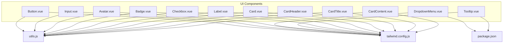
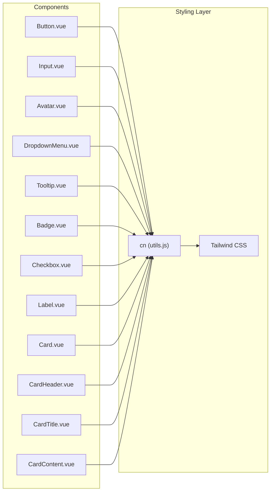
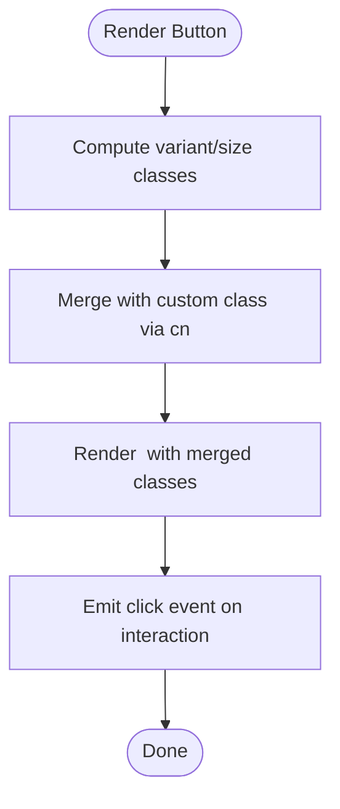
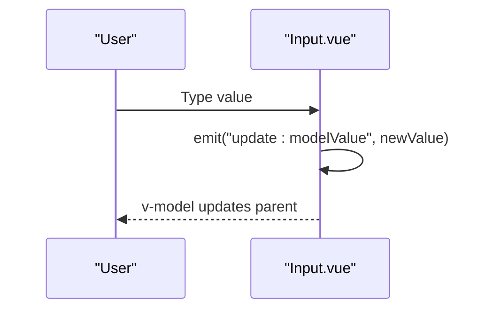
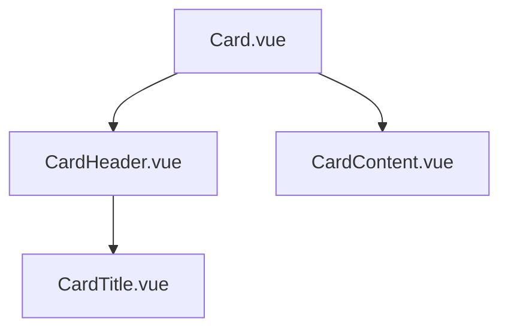
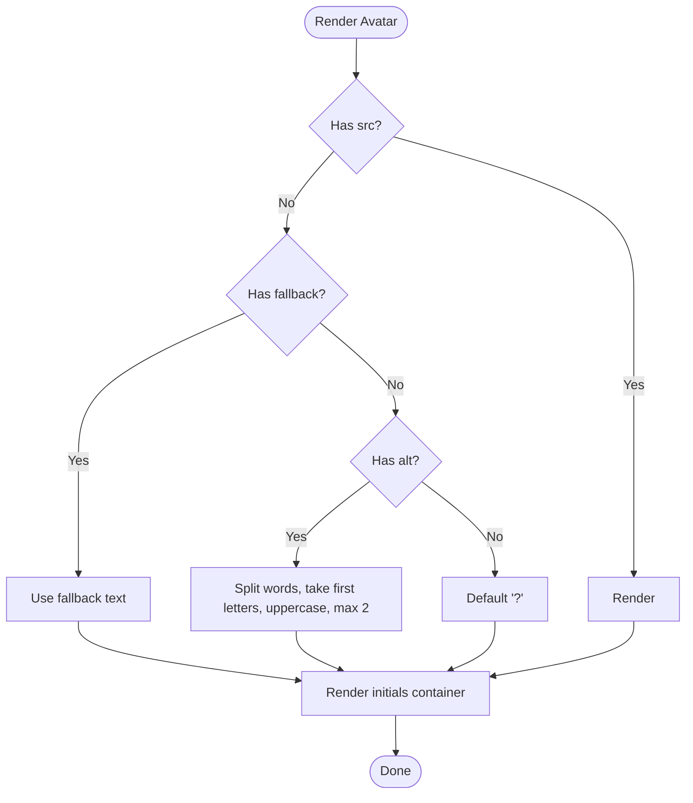
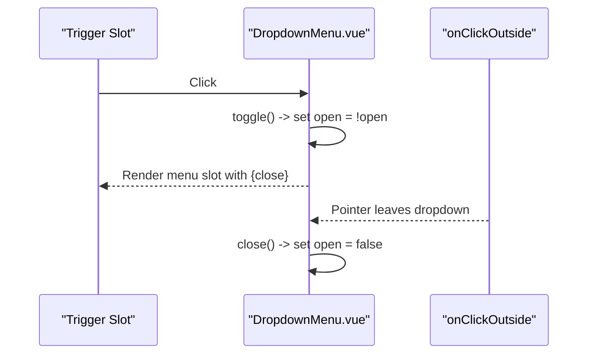
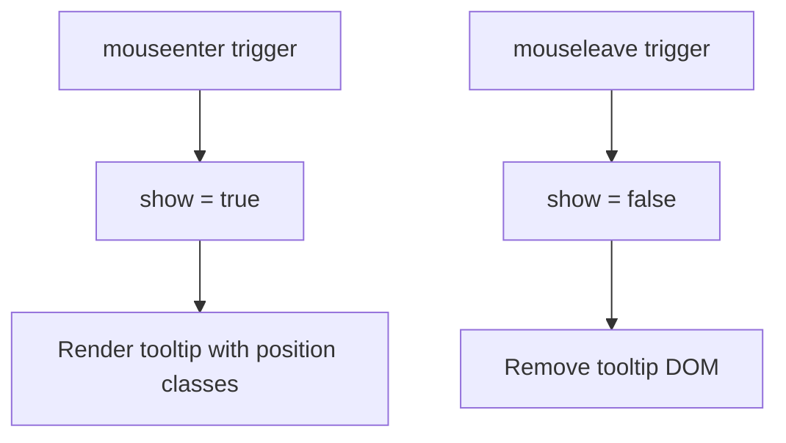
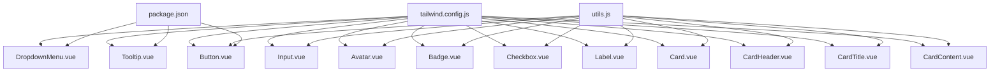

# UI Component Library

<cite>
**Referenced Files in This Document**
- [Button.vue](file://frontend/src/components/ui/Button.vue)
- [Input.vue](file://frontend/src/components/ui/Input.vue)
- [Card.vue](file://frontend/src/components/ui/Card.vue)
- [CardHeader.vue](file://frontend/src/components/ui/CardHeader.vue)
- [CardTitle.vue](file://frontend/src/components/ui/CardTitle.vue)
- [CardContent.vue](file://frontend/src/components/ui/CardContent.vue)
- [Avatar.vue](file://frontend/src/components/ui/Avatar.vue)
- [DropdownMenu.vue](file://frontend/src/components/ui/DropdownMenu.vue)
- [Tooltip.vue](file://frontend/src/components/ui/Tooltip.vue)
- [Badge.vue](file://frontend/src/components/ui/Badge.vue)
- [Checkbox.vue](file://frontend/src/components/ui/Checkbox.vue)
- [Label.vue](file://frontend/src/components/ui/Label.vue)
- [utils.js](file://frontend/src/lib/utils.js)
- [tailwind.config.js](file://frontend/tailwind.config.js)
- [package.json](file://frontend/package.json)
</cite>

## Table of Contents
1. [Introduction](#introduction)
2. [Project Structure](#project-structure)
3. [Core Components](#core-components)
4. [Architecture Overview](#architecture-overview)
5. [Detailed Component Analysis](#detailed-component-analysis)
6. [Dependency Analysis](#dependency-analysis)
7. [Performance Considerations](#performance-considerations)
8. [Troubleshooting Guide](#troubleshooting-guide)
9. [Conclusion](#conclusion)
10. [Appendices](#appendices)

## Introduction
This document describes the Vue 3 UI component library used in the frontend. It covers reusable components such as Button, Input, Card family, Avatar, DropdownMenu, Tooltip, Badge, Checkbox, and Label. For each component, we explain props, events, slots, customization via Tailwind classes, accessibility attributes, and composition patterns. We also provide guidance on styling, responsive design, state management, integration with form validation, and extension practices.

## Project Structure
The UI components live under frontend/src/components/ui and are styled with Tailwind CSS. Utility helpers centralize class merging. Tailwind configuration defines theme tokens and enables animations. Dependencies include Vue 3, VueUse for composables, and Tailwind-related packages.

**Diagram sources**
- [Button.vue:1-66](file://frontend/src/components/ui/Button.vue#L1-L66)
- [Input.vue:1-36](file://frontend/src/components/ui/Input.vue#L1-L36)
- [Avatar.vue:1-58](file://frontend/src/components/ui/Avatar.vue#L1-L58)
- [DropdownMenu.vue:1-49](file://frontend/src/components/ui/DropdownMenu.vue#L1-L49)
- [Tooltip.vue:1-49](file://frontend/src/components/ui/Tooltip.vue#L1-L49)
- [Badge.vue:1-41](file://frontend/src/components/ui/Badge.vue#L1-L41)
- [Checkbox.vue:1-48](file://frontend/src/components/ui/Checkbox.vue#L1-L48)
- [Label.vue:1-18](file://frontend/src/components/ui/Label.vue#L1-L18)
- [Card.vue:1-14](file://frontend/src/components/ui/Card.vue#L1-L14)
- [CardHeader.vue:1-14](file://frontend/src/components/ui/CardHeader.vue#L1-L14)
- [CardTitle.vue:1-14](file://frontend/src/components/ui/CardTitle.vue#L1-L14)
- [CardContent.vue:1-14](file://frontend/src/components/ui/CardContent.vue#L1-L14)
- [utils.js:1-27](file://frontend/src/lib/utils.js#L1-L27)
- [tailwind.config.js:1-59](file://frontend/tailwind.config.js#L1-L59)
- [package.json:1-30](file://frontend/package.json#L1-L30)

**Section sources**
- [tailwind.config.js:1-59](file://frontend/tailwind.config.js#L1-L59)
- [package.json:1-30](file://frontend/package.json#L1-L30)

## Core Components
This section summarizes the primary UI components and their capabilities.

- Button
  - Purpose: Action trigger with multiple variants and sizes.
  - Props: variant, size, as, disabled, class.
  - Events: click.
  - Slots: default.
  - Accessibility: Inherits native button semantics; disabled state handled.
  - Composition: Uses class variance authority (CVA) and cn for merging.
  - Example usage: See [Button.vue:56-65](file://frontend/src/components/ui/Button.vue#L56-L65).

- Input
  - Purpose: Text field with two-way binding.
  - Props: modelValue, type, placeholder, disabled, class.
  - Events: update:modelValue.
  - Slots: none.
  - Accessibility: Standard input attributes; focus ring for keyboard navigation.
  - Composition: Computed class merging; emits v-model updates.
  - Example usage: See [Input.vue:26-35](file://frontend/src/components/ui/Input.vue#L26-L35).

- Card Family
  - Card: Base container with border and shadow.
  - CardHeader: Top area with vertical spacing.
  - CardTitle: Title typography.
  - CardContent: Body area with padding reset for nested content.
  - Props: class for each.
  - Slots: default.
  - Composition: Shared cn utility; semantic header/title/body roles.
  - Example usage: See [Card.vue:9-13](file://frontend/src/components/ui/Card.vue#L9-L13), [CardHeader.vue:9-13](file://frontend/src/components/ui/CardHeader.vue#L9-L13), [CardTitle.vue:9-13](file://frontend/src/components/ui/CardTitle.vue#L9-L13), [CardContent.vue:9-13](file://frontend/src/components/ui/CardContent.vue#L9-L13).

- Avatar
  - Purpose: User identity with image fallback to initials.
  - Props: src, alt, fallback, size (sm/md/lg), class.
  - Slots: none.
  - Accessibility: Image alt handling; fallback renders as text.
  - Composition: Size mapping; initials derived from alt or fallback prop.
  - Example usage: See [Avatar.vue:36-57](file://frontend/src/components/ui/Avatar.vue#L36-L57).

- DropdownMenu
  - Purpose: Toggleable overlay menu anchored to a trigger.
  - Props: class.
  - Slots: trigger (required), default (menu items).
  - Exposed: open, toggle, close.
  - Accessibility: Click outside handler; menu visibility controlled internally.
  - Composition: Transition for smooth show/hide; exposes imperative controls.
  - Example usage: See [DropdownMenu.vue:27-48](file://frontend/src/components/ui/DropdownMenu.vue#L27-L48).

- Tooltip
  - Purpose: Inline contextual text on hover.
  - Props: text, position (top/bottom/left/right).
  - Slots: default (trigger element).
  - Accessibility: Hover-triggered; consider focus alternatives for keyboard UX.
  - Composition: Position mapping; transitions for fade in/out.
  - Example usage: See [Tooltip.vue:22-48](file://frontend/src/components/ui/Tooltip.vue#L22-L48).

- Badge
  - Purpose: Short status or category labels.
  - Props: variant (default/secondary/destructive/outline), class.
  - Events: none.
  - Slots: default.
  - Composition: CVA variants; cn merging.
  - Example usage: See [Badge.vue:36-40](file://frontend/src/components/ui/Badge.vue#L36-L40).

- Checkbox
  - Purpose: Boolean selection with accessible ARIA attributes.
  - Props: modelValue, disabled, class.
  - Events: update:modelValue.
  - Slots: none.
  - Accessibility: role="checkbox", aria-checked, focus ring.
  - Composition: Button host with SVG checkmark; disabled state.
  - Example usage: See [Checkbox.vue:20-47](file://frontend/src/components/ui/Checkbox.vue#L20-L47).

- Label
  - Purpose: Associates text with form controls.
  - Props: for (HTML for attribute), class.
  - Events: none.
  - Slots: default.
  - Accessibility: Renders label with for binding.
  - Example usage: See [Label.vue:10-17](file://frontend/src/components/ui/Label.vue#L10-L17).

**Section sources**
- [Button.vue:1-66](file://frontend/src/components/ui/Button.vue#L1-L66)
- [Input.vue:1-36](file://frontend/src/components/ui/Input.vue#L1-L36)
- [Card.vue:1-14](file://frontend/src/components/ui/Card.vue#L1-L14)
- [CardHeader.vue:1-14](file://frontend/src/components/ui/CardHeader.vue#L1-L14)
- [CardTitle.vue:1-14](file://frontend/src/components/ui/CardTitle.vue#L1-L14)
- [CardContent.vue:1-14](file://frontend/src/components/ui/CardContent.vue#L1-L14)
- [Avatar.vue:1-58](file://frontend/src/components/ui/Avatar.vue#L1-L58)
- [DropdownMenu.vue:1-49](file://frontend/src/components/ui/DropdownMenu.vue#L1-L49)
- [Tooltip.vue:1-49](file://frontend/src/components/ui/Tooltip.vue#L1-L49)
- [Badge.vue:1-41](file://frontend/src/components/ui/Badge.vue#L1-L41)
- [Checkbox.vue:1-48](file://frontend/src/components/ui/Checkbox.vue#L1-L48)
- [Label.vue:1-18](file://frontend/src/components/ui/Label.vue#L1-L18)

## Architecture Overview
The UI library follows a consistent pattern:
- Props define behavior and appearance.
- Emits events for parent communication (e.g., v-model updates).
- Uses slots for flexible composition.
- Leverages cn for safe class merging and Tailwind utilities.
- Some components manage internal state (e.g., DropdownMenu, Tooltip).
- Composition utilities (e.g., CVA) standardize variants.

**Diagram sources**
- [utils.js:1-27](file://frontend/src/lib/utils.js#L1-L27)
- [Button.vue:1-66](file://frontend/src/components/ui/Button.vue#L1-L66)
- [Input.vue:1-36](file://frontend/src/components/ui/Input.vue#L1-L36)
- [Avatar.vue:1-58](file://frontend/src/components/ui/Avatar.vue#L1-L58)
- [DropdownMenu.vue:1-49](file://frontend/src/components/ui/DropdownMenu.vue#L1-L49)
- [Tooltip.vue:1-49](file://frontend/src/components/ui/Tooltip.vue#L1-L49)
- [Badge.vue:1-41](file://frontend/src/components/ui/Badge.vue#L1-L41)
- [Checkbox.vue:1-48](file://frontend/src/components/ui/Checkbox.vue#L1-L48)
- [Label.vue:1-18](file://frontend/src/components/ui/Label.vue#L1-L18)
- [Card.vue:1-14](file://frontend/src/components/ui/Card.vue#L1-L14)
- [CardHeader.vue:1-14](file://frontend/src/components/ui/CardHeader.vue#L1-L14)
- [CardTitle.vue:1-14](file://frontend/src/components/ui/CardTitle.vue#L1-L14)
- [CardContent.vue:1-14](file://frontend/src/components/ui/CardContent.vue#L1-L14)

## Detailed Component Analysis

### Button
- Props
  - variant: default | destructive | outline | secondary | ghost | link
  - size: default | sm | lg | icon
  - as: tag name to render (e.g., button, a)
  - disabled: boolean
  - class: additional Tailwind classes
- Events
  - click
- Slots
  - default: button content
- Styling
  - Uses CVA for variants and sizes; merges with custom class via cn.
- Accessibility
  - Inherits native button behavior; disabled state respected.
- Composition
  - Computed classes; dynamic component rendering via is.

**Diagram sources**
- [Button.vue:25-53](file://frontend/src/components/ui/Button.vue#L25-L53)

**Section sources**
- [Button.vue:1-66](file://frontend/src/components/ui/Button.vue#L1-L66)

### Input
- Props
  - modelValue: String|Number
  - type: text|email|password|...
  - placeholder: String
  - disabled: Boolean
  - class: additional Tailwind classes
- Events
  - update:modelValue
- Slots
  - none
- Styling
  - Computed input class via cn; focus-visible ring and disabled styles included.
- Accessibility
  - Standard input attributes; focus-visible outline for keyboard users.
- Composition
  - Two-way binding via v-model; emits update:modelValue on input.

**Diagram sources**
- [Input.vue:16-34](file://frontend/src/components/ui/Input.vue#L16-L34)

**Section sources**
- [Input.vue:1-36](file://frontend/src/components/ui/Input.vue#L1-L36)

### Card Family
- Card
  - Container with rounded borders, background, and shadow.
  - Props: class
  - Slots: default
- CardHeader
  - Top section with vertical spacing.
  - Props: class
  - Slots: default
- CardTitle
  - Title typography.
  - Props: class
  - Slots: default
- CardContent
  - Body area with padding adjustments for nested content.
  - Props: class
  - Slots: default

**Diagram sources**
- [Card.vue:9-13](file://frontend/src/components/ui/Card.vue#L9-L13)
- [CardHeader.vue:9-13](file://frontend/src/components/ui/CardHeader.vue#L9-L13)
- [CardTitle.vue:9-13](file://frontend/src/components/ui/CardTitle.vue#L9-L13)
- [CardContent.vue:9-13](file://frontend/src/components/ui/CardContent.vue#L9-L13)

**Section sources**
- [Card.vue:1-14](file://frontend/src/components/ui/Card.vue#L1-L14)
- [CardHeader.vue:1-14](file://frontend/src/components/ui/CardHeader.vue#L1-L14)
- [CardTitle.vue:1-14](file://frontend/src/components/ui/CardTitle.vue#L1-L14)
- [CardContent.vue:1-14](file://frontend/src/components/ui/CardContent.vue#L1-L14)

### Avatar
- Props
  - src: image URL
  - alt: image description
  - fallback: explicit fallback text
  - size: sm | md | lg
  - class: additional Tailwind classes
- Slots
  - none
- Styling
  - Size mapping to height/width and text size; rounded-full overflow hidden.
- Behavior
  - If src present, renders img; otherwise renders initials from alt or fallback.
- Accessibility
  - alt passed to img; fallback renders as text.

**Diagram sources**
- [Avatar.vue:22-33](file://frontend/src/components/ui/Avatar.vue#L22-L33)

**Section sources**
- [Avatar.vue:1-58](file://frontend/src/components/ui/Avatar.vue#L1-L58)

### DropdownMenu
- Props
  - class: additional Tailwind classes
- Slots
  - trigger (required): element that toggles the menu
  - default: menu items; receives close function
- Exposed
  - open: reactive boolean
  - toggle(): toggle visibility
  - close(): hide menu
- Behavior
  - Internal ref tracks open state.
  - Click outside closes the menu.
  - Transition animates show/hide.
- Accessibility
  - Trigger clicks toggle; consider adding keyboard support (Space/Enter) for improved UX.

**Diagram sources**
- [DropdownMenu.vue:9-24](file://frontend/src/components/ui/DropdownMenu.vue#L9-L24)
- [DropdownMenu.vue:27-48](file://frontend/src/components/ui/DropdownMenu.vue#L27-L48)

**Section sources**
- [DropdownMenu.vue:1-49](file://frontend/src/components/ui/DropdownMenu.vue#L1-L49)

### Tooltip
- Props
  - text: tooltip content
  - position: top | bottom | left | right
- Slots
  - default: trigger element
- Behavior
  - Internal show state toggled on mouseenter/mouseleave.
  - Transition fades tooltip in/out.
- Accessibility
  - Hover-triggered; consider adding aria-describedby or focus-visible alternatives.

**Diagram sources**
- [Tooltip.vue:12-19](file://frontend/src/components/ui/Tooltip.vue#L12-L19)
- [Tooltip.vue:22-48](file://frontend/src/components/ui/Tooltip.vue#L22-L48)

**Section sources**
- [Tooltip.vue:1-49](file://frontend/src/components/ui/Tooltip.vue#L1-L49)

### Badge
- Props
  - variant: default | secondary | destructive | outline
  - class: additional Tailwind classes
- Events
  - none
- Slots
  - default
- Styling
  - CVA variants for color and border combinations; merged via cn.

**Section sources**
- [Badge.vue:1-41](file://frontend/src/components/ui/Badge.vue#L1-L41)

### Checkbox
- Props
  - modelValue: Boolean
  - disabled: Boolean
  - class: additional Tailwind classes
- Events
  - update:modelValue
- Accessibility
  - role="checkbox", aria-checked bound to modelValue; focus-visible ring.
- Behavior
  - Toggle emits inverse value; disabled prevents interaction.

**Section sources**
- [Checkbox.vue:1-48](file://frontend/src/components/ui/Checkbox.vue#L1-L48)

### Label
- Props
  - for: HTML for attribute to associate with a control
  - class: additional Tailwind classes
- Events
  - none
- Slots
  - default
- Accessibility
  - Renders label with for binding to improve screen reader UX.

**Section sources**
- [Label.vue:1-18](file://frontend/src/components/ui/Label.vue#L1-L18)

## Dependency Analysis
The UI components share common dependencies and utilities:
- Tailwind CSS and theme tokens define consistent design tokens.
- cn utility merges classes safely using clsx and tailwind-merge.
- CVA provides structured variants for Button and Badge.
- VueUse’s onClickOutside powers DropdownMenu behavior.
- package.json lists Vue 3, VueUse, Tailwind, and related libraries.

**Diagram sources**
- [package.json:1-30](file://frontend/package.json#L1-L30)
- [tailwind.config.js:1-59](file://frontend/tailwind.config.js#L1-L59)
- [utils.js:1-27](file://frontend/src/lib/utils.js#L1-L27)
- [Button.vue:1-66](file://frontend/src/components/ui/Button.vue#L1-L66)
- [Badge.vue:1-41](file://frontend/src/components/ui/Badge.vue#L1-L41)
- [DropdownMenu.vue:1-49](file://frontend/src/components/ui/DropdownMenu.vue#L1-L49)
- [Input.vue:1-36](file://frontend/src/components/ui/Input.vue#L1-L36)
- [Avatar.vue:1-58](file://frontend/src/components/ui/Avatar.vue#L1-L58)
- [Tooltip.vue:1-49](file://frontend/src/components/ui/Tooltip.vue#L1-L49)
- [Checkbox.vue:1-48](file://frontend/src/components/ui/Checkbox.vue#L1-L48)
- [Label.vue:1-18](file://frontend/src/components/ui/Label.vue#L1-L18)
- [Card.vue:1-14](file://frontend/src/components/ui/Card.vue#L1-L14)
- [CardHeader.vue:1-14](file://frontend/src/components/ui/CardHeader.vue#L1-L14)
- [CardTitle.vue:1-14](file://frontend/src/components/ui/CardTitle.vue#L1-L14)
- [CardContent.vue:1-14](file://frontend/src/components/ui/CardContent.vue#L1-L14)

**Section sources**
- [package.json:1-30](file://frontend/package.json#L1-L30)
- [tailwind.config.js:1-59](file://frontend/tailwind.config.js#L1-L59)
- [utils.js:1-27](file://frontend/src/lib/utils.js#L1-L27)

## Performance Considerations
- Prefer computed classes for dynamic variants to avoid repeated string concatenation.
- Use cn to merge classes efficiently; it prevents duplicate or conflicting Tailwind utilities.
- Keep transitions minimal; DropdownMenu and Tooltip use short durations for snappy UX.
- Avoid unnecessary re-renders by passing stable refs (e.g., dropdownRef) and toggling booleans.
- For large lists, consider virtualization or pagination alongside component usage.

## Troubleshooting Guide
- Button click not firing
  - Ensure the as prop renders a clickable element (e.g., button or anchor) and that disabled is not true.
  - Verify event listeners are attached.
  - Reference: [Button.vue:56-65](file://frontend/src/components/ui/Button.vue#L56-L65)

- Input v-model not updating
  - Confirm update:modelValue is emitted on input and parent is binding with v-model.
  - Reference: [Input.vue:16-34](file://frontend/src/components/ui/Input.vue#L16-L34)

- DropdownMenu does not close on outside click
  - Ensure the ref is attached to the root container and that onClickOutside is imported and invoked.
  - Reference: [DropdownMenu.vue:9-24](file://frontend/src/components/ui/DropdownMenu.vue#L9-L24)

- Tooltip not visible
  - Check that text is provided and show state toggles on hover.
  - Reference: [Tooltip.vue:22-48](file://frontend/src/components/ui/Tooltip.vue#L22-L48)

- Avatar fallback not shown
  - Verify alt or fallback prop; initials are derived from these.
  - Reference: [Avatar.vue:22-33](file://frontend/src/components/ui/Avatar.vue#L22-L33)

- Checkbox not accessible
  - Ensure role="checkbox" and aria-checked are present; provide focus-visible ring.
  - Reference: [Checkbox.vue:20-47](file://frontend/src/components/ui/Checkbox.vue#L20-L47)

**Section sources**
- [Button.vue:56-65](file://frontend/src/components/ui/Button.vue#L56-L65)
- [Input.vue:16-34](file://frontend/src/components/ui/Input.vue#L16-L34)
- [DropdownMenu.vue:9-24](file://frontend/src/components/ui/DropdownMenu.vue#L9-L24)
- [Tooltip.vue:22-48](file://frontend/src/components/ui/Tooltip.vue#L22-L48)
- [Avatar.vue:22-33](file://frontend/src/components/ui/Avatar.vue#L22-L33)
- [Checkbox.vue:20-47](file://frontend/src/components/ui/Checkbox.vue#L20-L47)

## Conclusion
The UI component library emphasizes consistency, accessibility, and composability. Props, events, and slots are standardized across components. Tailwind CSS and the cn utility enable predictable styling, while CVA and internal state management keep behavior uniform. Following the patterns documented here ensures maintainable extensions and cohesive applications.

## Appendices

### Styling Approach with Tailwind CSS
- Design tokens: Tailwind theme extends color palettes and border radius tokens aligned with CSS variables.
- Utilities: cn merges classes safely; CVA defines variants for components with consistent defaults.
- Responsive design: Use Tailwind’s responsive prefixes on component classes to adapt to breakpoints.

**Section sources**
- [tailwind.config.js:10-55](file://frontend/tailwind.config.js#L10-L55)
- [utils.js:4-6](file://frontend/src/lib/utils.js#L4-L6)

### Accessibility Features
- Buttons: Native button semantics; disabled state respected.
- Inputs: Focus rings for keyboard navigation; placeholder text for clarity.
- Checkboxes: ARIA role and checked state; focus-visible ring.
- Labels: for attribute binds labels to controls.
- Tooltips: Hover-triggered; consider adding keyboard alternatives for inclusive UX.

**Section sources**
- [Button.vue:56-65](file://frontend/src/components/ui/Button.vue#L56-L65)
- [Input.vue:26-35](file://frontend/src/components/ui/Input.vue#L26-L35)
- [Checkbox.vue:20-47](file://frontend/src/components/ui/Checkbox.vue#L20-L47)
- [Label.vue:10-17](file://frontend/src/components/ui/Label.vue#L10-L17)
- [Tooltip.vue:22-48](file://frontend/src/components/ui/Tooltip.vue#L22-L48)

### Integration Patterns with Form Validation
- Use Input with v-model for controlled inputs; emit update:modelValue on change.
- Combine Label with for to improve accessibility.
- Use Checkbox for boolean toggles; bind modelValue and handle update:modelValue.
- For complex forms, compose Card, CardHeader, CardTitle, and CardContent to structure sections.

**Section sources**
- [Input.vue:16-34](file://frontend/src/components/ui/Input.vue#L16-L34)
- [Label.vue:10-17](file://frontend/src/components/ui/Label.vue#L10-L17)
- [Checkbox.vue:1-48](file://frontend/src/components/ui/Checkbox.vue#L1-L48)
- [Card.vue:9-13](file://frontend/src/components/ui/Card.vue#L9-L13)
- [CardHeader.vue:9-13](file://frontend/src/components/ui/CardHeader.vue#L9-L13)
- [CardTitle.vue:9-13](file://frontend/src/components/ui/CardTitle.vue#L9-L13)
- [CardContent.vue:9-13](file://frontend/src/components/ui/CardContent.vue#L9-L13)

### Extending Components and Maintaining Consistency
- Follow the props/events/slots contract demonstrated by existing components.
- Use cn and CVA to preserve design consistency.
- Add new variants via CVA or size mappings; keep defaults aligned with the theme.
- For stateful components, expose reactive state and imperative methods (as in DropdownMenu).
- Keep transitions subtle and performant; test with real user interactions.

**Section sources**
- [utils.js:4-6](file://frontend/src/lib/utils.js#L4-L6)
- [Button.vue:25-53](file://frontend/src/components/ui/Button.vue#L25-L53)
- [DropdownMenu.vue:24-24](file://frontend/src/components/ui/DropdownMenu.vue#L24-L24)