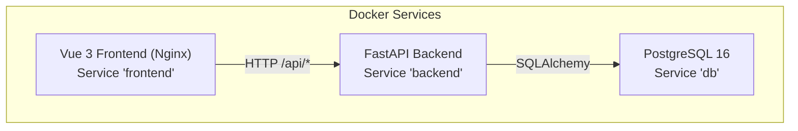

# Getting Started

<cite>
**Referenced Files in This Document**
- [README.md](file://README.md)
- [docker-compose.yml](file://docker-compose.yml)
- [backend/Dockerfile](file://backend/Dockerfile)
- [frontend/Dockerfile](file://frontend/Dockerfile)
- [backend/app/core/config.py](file://backend/app/core/config.py)
- [backend/app/main.py](file://backend/app/main.py)
- [backend/run.py](file://backend/run.py)
- [backend/requirements.txt](file://backend/requirements.txt)
- [frontend/package.json](file://frontend/package.json)
- [frontend/src/main.js](file://frontend/src/main.js)
- [frontend/nginx.conf](file://frontend/nginx.conf)
- [backend/app/core/plugin_loader.py](file://backend/app/core/plugin_loader.py)
- [backend/app/services/auth_service.py](file://backend/app/services/auth_service.py)
</cite>

## Table of Contents
1. [Introduction](#introduction)
2. [Prerequisites](#prerequisites)
3. [Installation Options](#installation-options)
4. [Environment Configuration](#environment-configuration)
5. [Initial Setup Steps](#initial-setup-steps)
6. [Accessing the Application](#accessing-the-application)
7. [Basic Configuration](#basic-configuration)
8. [Architecture Overview](#architecture-overview)
9. [Verification Steps](#verification-steps)
10. [Troubleshooting Guide](#troubleshooting-guide)
11. [Conclusion](#conclusion)

## Introduction
NOC Vision is a modern, plugin-based Network Operations Center platform featuring a FastAPI backend and Vue 3 frontend. It provides core capabilities such as authentication and authorization, user management, a dynamic plugin architecture, and a modern UI with dark mode support. This guide helps you set up NOC Vision quickly using Docker (recommended) or a manual installation, configure environment variables, and verify your deployment.

## Prerequisites
Ensure the following software is installed on your system:
- Python 3.9+ (required for manual backend setup)
- Node.js 18+ (required for manual frontend setup)
- PostgreSQL 16+ (required for manual setup; Docker Compose provisions a containerized database)

These prerequisites are documented in the project's quick start guide and tech stack sections.

**Section sources**
- [README.md:57-64](file://README.md#L57-L64)
- [README.md:239-260](file://README.md#L239-L260)

## Installation Options
Choose one of the following installation approaches. Docker Compose is recommended for simplicity and consistency.

### Option 1: Docker Compose (Recommended)
- Build and start all services with a single command.
- Access the frontend at http://localhost:3000 and the backend API at http://localhost:8003.
- The compose file defines three services: database, backend, and frontend, with health checks and port mappings.

Key points:
- The backend service exposes port 8003 mapped to the container’s 8000.
- The frontend service serves static assets via Nginx on port 80 and proxies API requests to the backend.
- The database service runs PostgreSQL 16 and persists data in a named volume.

**Section sources**
- [README.md:67-79](file://README.md#L67-L79)
- [docker-compose.yml:1-52](file://docker-compose.yml#L1-L52)
- [frontend/nginx.conf:11-18](file://frontend/nginx.conf#L11-L18)

### Option 2: Manual Setup
Follow these steps to run the backend and frontend locally without containers.

Backend (FastAPI):
- Create and activate a Python virtual environment.
- Install dependencies from the backend requirements file.
- Prepare environment variables by copying the example environment file.
- Apply database migrations using Alembic.
- Start the backend server.

Backend will be available at http://localhost:8000.

Frontend (Vue 3 + Vite):
- Install Node.js dependencies.
- Start the development server.
- The frontend will be available at http://localhost:5173 or http://localhost:3000 depending on your configuration.

**Section sources**
- [README.md:85-128](file://README.md#L85-L128)
- [backend/requirements.txt:1-11](file://backend/requirements.txt#L1-L11)
- [backend/run.py:1-5](file://backend/run.py#L1-L5)

## Environment Configuration
Configure your environment using the .env file. The backend reads settings from .env and supports comma-separated origins for CORS.

Important settings include:
- Database URL for PostgreSQL connectivity
- Security keys and token expiration settings
- Allowed origins for CORS
- Debug and log level toggles
- Enabled plugins filter
- Default administrator account credentials

The backend Dockerfile sets sensible defaults for development, while the manual setup expects a local database and explicit environment configuration.

**Section sources**
- [README.md:129-157](file://README.md#L129-L157)
- [backend/app/core/config.py:5-46](file://backend/app/core/config.py#L5-L46)
- [docker-compose.yml:24-31](file://docker-compose.yml#L24-L31)

## Initial Setup Steps
Complete these steps after choosing your installation method.

Docker Compose:
- Build and start services with the compose file.
- The backend automatically applies database migrations and creates a default admin user if none exists.
- The frontend serves the Vue SPA and proxies API calls to the backend.

Manual Setup:
- Backend:
  - Activate the virtual environment and install dependencies.
  - Copy the environment file and adjust settings as needed.
  - Run Alembic migrations to prepare the database.
  - Start the backend server.
- Frontend:
  - Install Node dependencies.
  - Start the development server.

The backend lifecycle initializes database tables, loads plugins, and ensures a default admin exists.

**Section sources**
- [README.md:67-128](file://README.md#L67-L128)
- [backend/Dockerfile:16](file://backend/Dockerfile#L16)
- [backend/app/main.py:17-48](file://backend/app/main.py#L17-L48)
- [backend/app/services/auth_service.py:122-139](file://backend/app/services/auth_service.py#L122-L139)

## Accessing the Application
After successful setup, access the application at:
- Frontend: http://localhost:3000
- Backend API: http://localhost:8003 (or http://localhost:8000 for manual setup)
- API Documentation: Swagger UI at http://localhost:8003/docs

The frontend Nginx configuration proxies API requests under /api/ to the backend service.

**Section sources**
- [README.md:75-79](file://README.md#L75-L79)
- [frontend/nginx.conf:11-18](file://frontend/nginx.conf#L11-L18)

## Basic Configuration
Review and customize the following configuration areas:

- Database connectivity:
  - Set DATABASE_URL to point to your PostgreSQL instance.
  - For Docker, the compose file provides a preconfigured URL.
- Security:
  - Change SECRET_KEY to a strong random value in production.
  - Adjust token expiration settings for access and refresh tokens.
- CORS:
  - Ensure ALLOWED_ORIGINS includes your frontend URLs.
- Plugins:
  - Use ENABLED_PLUGINS to restrict loaded plugins by name.
- Default admin:
  - Customize DEFAULT_ADMIN_* values to establish the initial administrator account.

The backend reads these settings from .env and applies them during startup.

**Section sources**
- [README.md:133-157](file://README.md#L133-L157)
- [backend/app/core/config.py:5-46](file://backend/app/core/config.py#L5-L46)
- [docker-compose.yml:24-31](file://docker-compose.yml#L24-L31)

## Architecture Overview
The system consists of three primary services orchestrated by Docker Compose:

**Diagram sources**
- [docker-compose.yml:3-52](file://docker-compose.yml#L3-L52)
- [frontend/nginx.conf:11-18](file://frontend/nginx.conf#L11-L18)

## Verification Steps
Confirm your installation by performing the following checks:

- Backend health:
  - Call the backend health endpoint to verify the service is running.
- API availability:
  - Visit the API documentation endpoints to confirm OpenAPI/Swagger is accessible.
- Database readiness:
  - Ensure the database service is healthy and migrations have been applied.
- Default admin:
  - Log in using the default admin credentials to verify authentication works.
- Plugin loading:
  - Retrieve the plugin list endpoint to confirm plugins are registered and loaded.

These checks align with the backend’s health endpoint, API documentation links, and plugin listing route.

**Section sources**
- [README.md:159-164](file://README.md#L159-L164)
- [backend/app/main.py:79-87](file://backend/app/main.py#L79-L87)
- [backend/app/main.py:84-87](file://backend/app/main.py#L84-L87)

## Troubleshooting Guide
Common setup issues and resolutions:

- Backend fails to start:
  - Confirm PostgreSQL is running and reachable.
  - Verify DATABASE_URL in .env matches your database configuration.
  - Ensure all Python dependencies are installed.
- Frontend fails to start:
  - Reinstall Node dependencies if necessary.
  - Confirm the backend is running at the expected address.
  - Align CORS settings in .env with your frontend URL.
- Database connection errors:
  - Ensure the PostgreSQL service is running.
  - Validate database credentials and that the target database exists.

These troubleshooting tips are derived from the project’s documentation.

**Section sources**
- [README.md:220-238](file://README.md#L220-L238)

## Conclusion
You now have the essential steps to deploy NOC Vision either with Docker Compose for a streamlined experience or manually for development flexibility. Review the environment configuration, verify service health, and use the default admin credentials to log in. For production, update secrets, enable strict CORS, and secure your deployment accordingly.