# Per-User Background Image System

<cite>
**Referenced Files in This Document**
- [user.py](file://backend/app/models/user.py)
- [user.py](file://backend/app/schemas/user.py)
- [users.py](file://backend/app/api/v1/endpoints/users.py)
- [user_service.py](file://backend/app/services/user_service.py)
- [002_add_background_image_to_users.py](file://backend/alembic/versions/002_add_background_image_to_users.py)
- [Display.vue](file://frontend/src/views/settings/Display.vue)
- [theme.js](file://frontend/src/stores/theme.js)
- [auth.js](file://frontend/src/stores/auth.js)
- [security.py](file://backend/app/core/security.py)
- [auth_service.py](file://backend/app/services/auth_service.py)
- [database.py](file://backend/app/core/database.py)
- [main.py](file://backend/app/main.py)
- [Dockerfile](file://frontend/Dockerfile)
- [nginx.conf](file://frontend/nginx.conf)
- [docker-compose.yml](file://docker-compose.yml)
- [main.css](file://frontend/src/assets/css/main.css)
</cite>

## Update Summary
**Changes Made**
- Updated background image availability with new images bg7.webp and bg8.jpg
- Enhanced visual styling with improved glassmorphism effects and transparency handling
- Optimized theme management with better CSS variable support
- Improved background application logic with enhanced visual effects

## Table of Contents
1. [Introduction](#introduction)
2. [System Architecture](#system-architecture)
3. [Database Schema Design](#database-schema-design)
4. [Backend Implementation](#backend-implementation)
5. [Frontend Implementation](#frontend-implementation)
6. [API Endpoints](#api-endpoints)
7. [Security Model](#security-model)
8. [Deployment Configuration](#deployment-configuration)
9. [User Experience Flow](#user-experience-flow)
10. [Visual Styling Enhancements](#visual-styling-enhancements)
11. [Troubleshooting Guide](#troubleshooting-guide)
12. [Conclusion](#conclusion)

## Introduction

The Per-User Background Image System is a feature that allows individual users to customize their dashboard experience by selecting personalized background images from a predefined collection. This system integrates seamlessly with the existing Single Sign-On (SSO) infrastructure, providing users with a tailored visual experience while maintaining security and performance standards.

The system consists of three main components: a PostgreSQL database storing user preferences, a FastAPI backend serving user management APIs, and a Vue.js frontend enabling user interaction with background selection capabilities. The implementation follows modern web development practices with proper authentication, authorization, and responsive design principles.

**Updated** Enhanced with new background images (bg7.webp, bg8.jpg) and improved visual styling with glassmorphism effects.

## System Architecture

The Per-User Background Image System follows a client-server architecture with clear separation of concerns between frontend presentation, backend business logic, and database persistence.

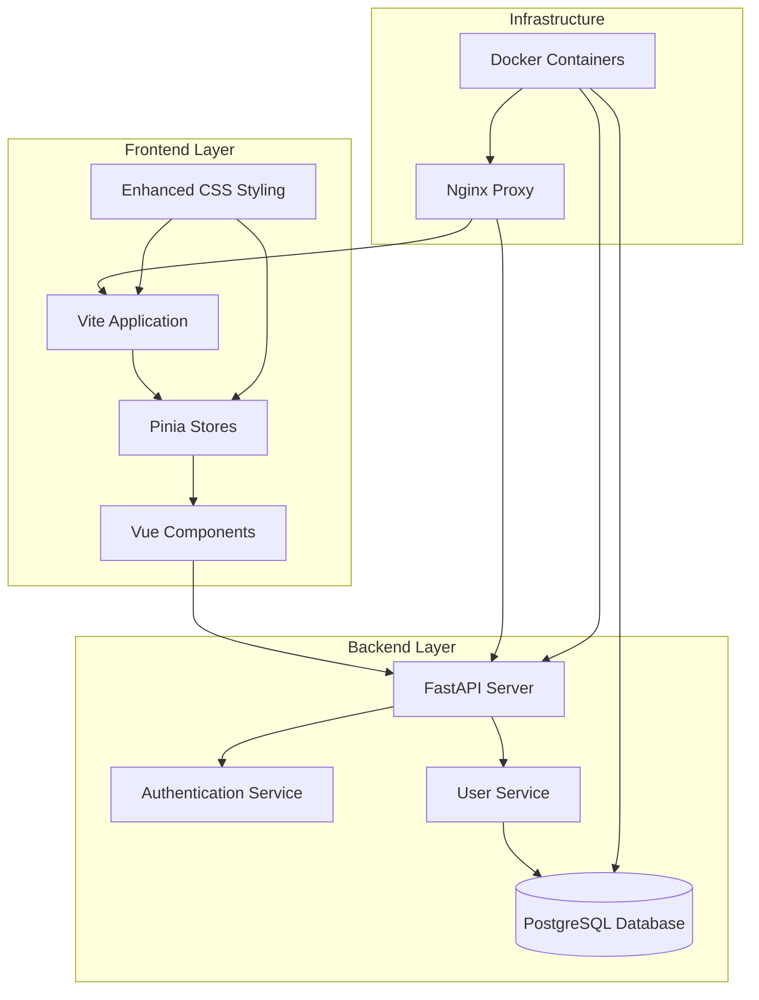

**Diagram sources**
- [main.py:50-87](file://backend/app/main.py#L50-L87)
- [Display.vue:1-185](file://frontend/src/views/settings/Display.vue#L1-185)
- [nginx.conf:1-20](file://frontend/nginx.conf#L1-20)

The architecture ensures scalability, maintainability, and security through proper separation of concerns and standardized communication protocols.

## Database Schema Design

The database schema extends the existing User model to include background image preferences. The design maintains backward compatibility while adding the new functionality.

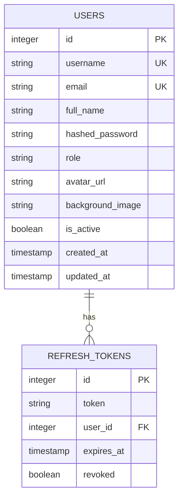

**Diagram sources**
- [user.py:7-25](file://backend/app/models/user.py#L7-L25)
- [002_add_background_image_to_users.py:21-26](file://backend/alembic/versions/002_add_background_image_to_users.py#L21-L26)

The schema modification adds a `background_image` column to the users table, allowing users to store their preferred background image filename. The column supports null values, enabling users to opt-out of background customization.

**Section sources**
- [user.py:16-17](file://backend/app/models/user.py#L16-L17)
- [002_add_background_image_to_users.py:21-26](file://backend/alembic/versions/002_add_background_image_to_users.py#L21-L26)

## Backend Implementation

The backend implementation provides comprehensive user management capabilities with specialized endpoints for background image management.

### User Model Enhancement

The User model includes the `background_image` field alongside existing user attributes, supporting both individual user customization and system-wide themes.

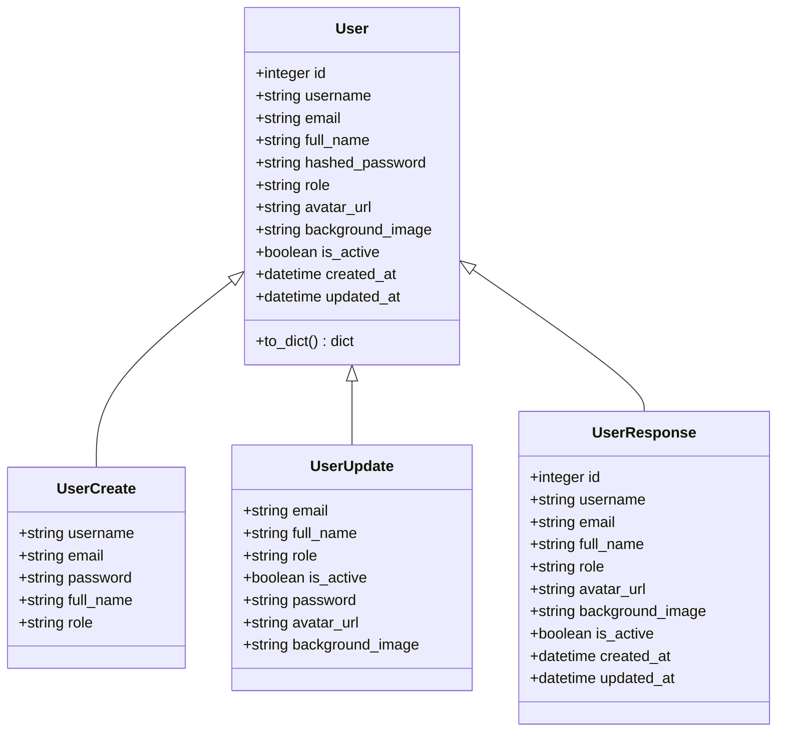

**Diagram sources**
- [user.py:7-39](file://backend/app/models/user.py#L7-L39)
- [user.py:6-37](file://backend/app/schemas/user.py#L6-L37)

### API Endpoint Implementation

The backend exposes dedicated endpoints for user background management, ensuring secure and efficient operations.

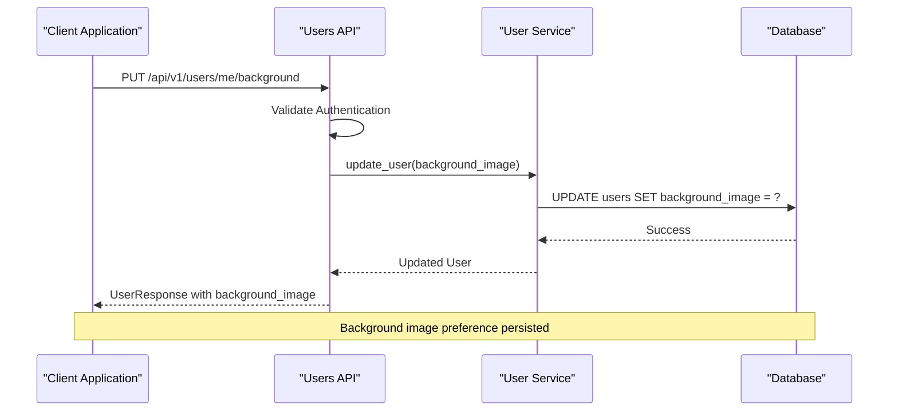

**Diagram sources**
- [users.py:39-47](file://backend/app/api/v1/endpoints/users.py#L39-L47)
- [user_service.py:46-58](file://backend/app/services/user_service.py#L46-L58)

**Section sources**
- [users.py:39-71](file://backend/app/api/v1/endpoints/users.py#L39-L71)
- [user_service.py:46-58](file://backend/app/services/user_service.py#L46-L58)

## Frontend Implementation

The frontend provides an intuitive interface for users to select and manage their background preferences, integrating seamlessly with the existing theme system.

### Background Selection Interface

The Display.vue component offers a comprehensive background selection interface with real-time preview and validation capabilities.

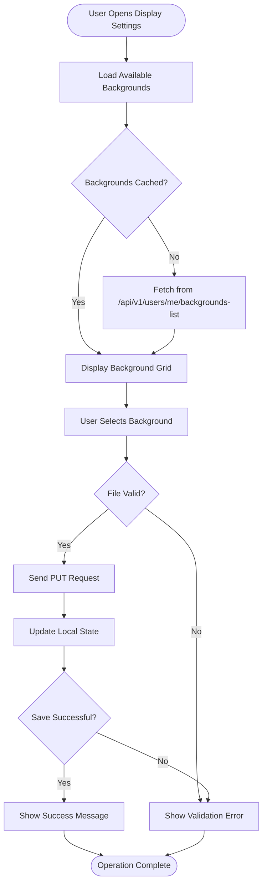

**Diagram sources**
- [Display.vue:33-70](file://frontend/src/views/settings/Display.vue#L33-L70)
- [theme.js:29-59](file://frontend/src/stores/theme.js#L29-L59)

### Theme Management Integration

The theme store manages both color themes and background images, providing a unified approach to user customization.

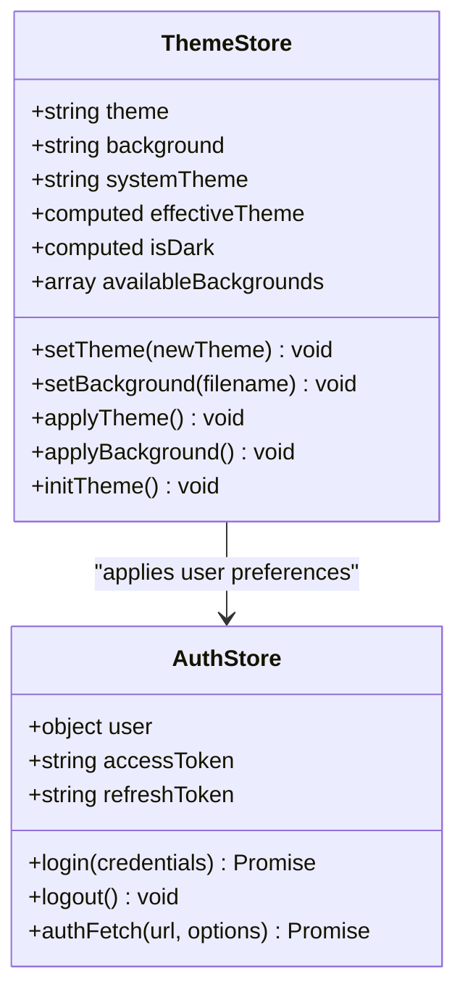

**Diagram sources**
- [theme.js:4-90](file://frontend/src/stores/theme.js#L4-L90)
- [auth.js:5-204](file://frontend/src/stores/auth.js#L5-L204)

**Section sources**
- [Display.vue:1-185](file://frontend/src/views/settings/Display.vue#L1-185)
- [theme.js:1-92](file://frontend/src/stores/theme.js#L1-92)
- [auth.js:1-204](file://frontend/src/stores/auth.js#L1-204)

## API Endpoints

The system provides RESTful endpoints for comprehensive user background management functionality.

### Background Management Endpoints

| Endpoint | Method | Description | Authentication | Response |
|----------|--------|-------------|----------------|----------|
| `/api/v1/users/me/background` | PUT | Update current user's background image | User | UserResponse |
| `/api/v1/users/me/backgrounds-list` | GET | Get available background images | User | Array of filenames |
| `/api/v1/users/me/avatar` | PUT | Update current user's avatar | User | UserResponse |

### Background Discovery Mechanism

The background discovery endpoint intelligently locates available images through multiple sources, ensuring compatibility across different deployment environments.

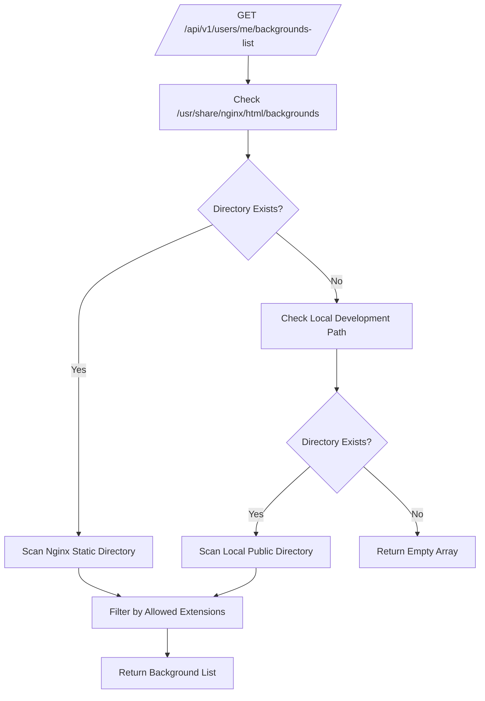

**Diagram sources**
- [users.py:50-71](file://backend/app/api/v1/endpoints/users.py#L50-L71)

**Section sources**
- [users.py:39-71](file://backend/app/api/v1/endpoints/users.py#L39-L71)

## Security Model

The system implements robust security measures to protect user data and prevent unauthorized access to background management functionality.

### Authentication and Authorization

The security model leverages JWT tokens with role-based access control to ensure only authorized users can modify their background preferences.

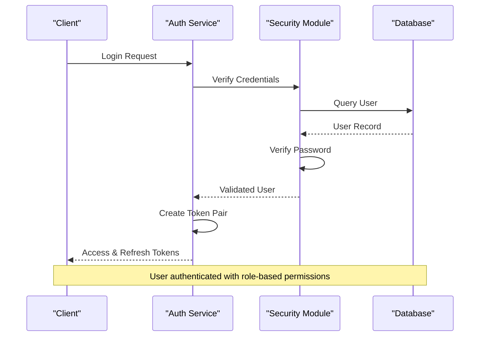

**Diagram sources**
- [auth_service.py:113-119](file://backend/app/services/auth_service.py#L113-L119)
- [security.py:61-79](file://backend/app/core/security.py#L61-L79)

### Role-Based Access Control

The system implements hierarchical permissions where superusers have elevated privileges while regular users can only manage their own preferences.

**Section sources**
- [security.py:82-110](file://backend/app/core/security.py#L82-L110)
- [auth_service.py:113-119](file://backend/app/services/auth_service.py#L113-L119)

## Deployment Configuration

The system supports flexible deployment configurations through Docker containers and Nginx reverse proxy setup.

### Container Orchestration

The docker-compose configuration orchestrates three interconnected services: PostgreSQL database, FastAPI backend, and Vue.js frontend with Nginx serving static assets.

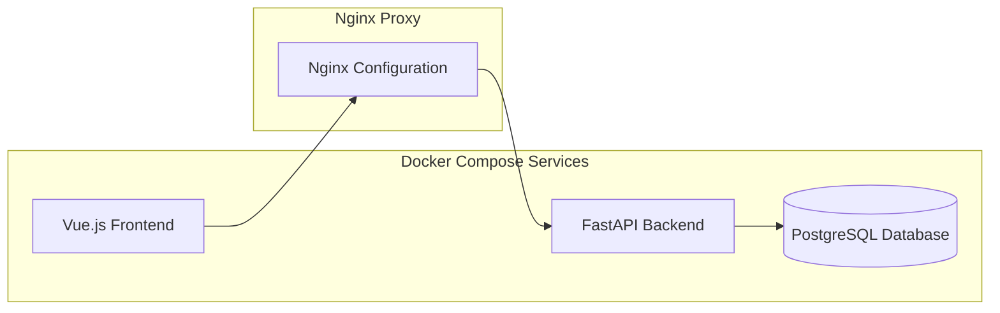

**Diagram sources**
- [docker-compose.yml:1-53](file://docker-compose.yml#L1-L53)
- [Dockerfile:1-13](file://frontend/Dockerfile#L1-L13)

### Static Asset Serving

Nginx serves static background images efficiently, reducing load on the backend server and improving response times for client requests.

**Section sources**
- [docker-compose.yml:1-53](file://docker-compose.yml#L1-L53)
- [nginx.conf:1-20](file://frontend/nginx.conf#L1-L20)
- [Dockerfile:1-13](file://frontend/Dockerfile#L1-L13)

## User Experience Flow

The user experience follows a streamlined process for discovering, selecting, and applying background preferences.

### Background Selection Workflow

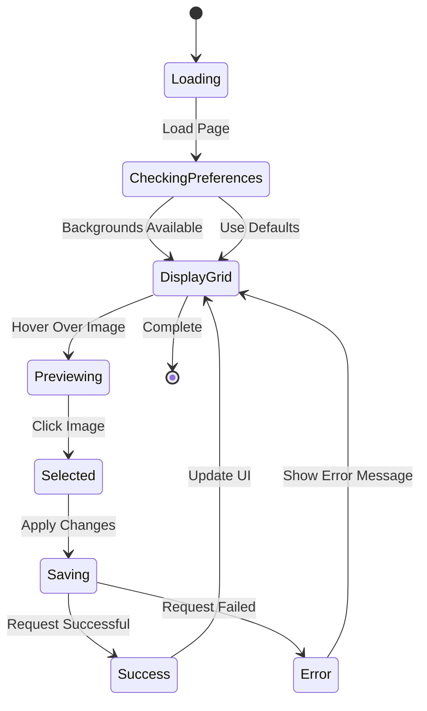

The workflow ensures smooth user interaction with immediate feedback and error handling throughout the selection process.

## Visual Styling Enhancements

**Updated** The system now features enhanced visual styling with improved glassmorphism effects and optimized theme management.

### Enhanced Background Application

The theme management system now applies sophisticated visual effects when background images are active, creating a modern glass-like appearance.

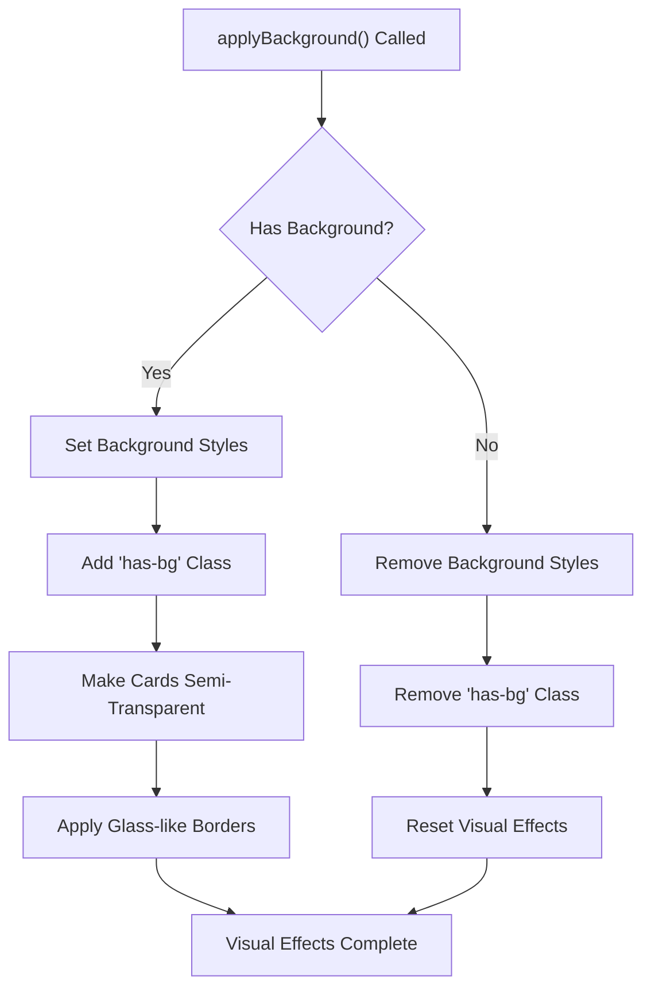

**Diagram sources**
- [theme.js:44-61](file://frontend/src/stores/theme.js#L44-L61)
- [main.css:78-87](file://frontend/src/assets/css/main.css#L78-L87)

### CSS Variable Integration

The system utilizes CSS custom properties for dynamic theming, enabling seamless transitions between light, dark, and system themes.

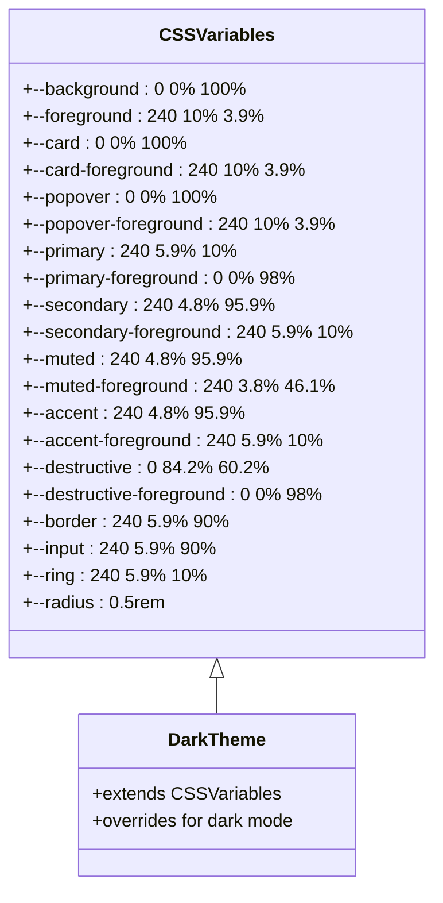

**Diagram sources**
- [main.css:8-51](file://frontend/src/assets/css/main.css#L8-L51)

### New Background Image Support

The system now supports additional image formats and enhanced visual quality with the addition of new background images.

**Section sources**
- [Display.vue:17-26](file://frontend/src/views/settings/Display.vue#L17-L26)
- [theme.js:44-61](file://frontend/src/stores/theme.js#L44-L61)
- [main.css:78-87](file://frontend/src/assets/css/main.css#L78-L87)

## Troubleshooting Guide

Common issues and their solutions for the Per-User Background Image System.

### Database Migration Issues

**Problem**: Background image column missing from users table
**Solution**: Run Alembic migration to add the column
```bash
alembic upgrade head
```

**Problem**: Migration fails during startup
**Solution**: Check database connectivity and run manual migration
```bash
python -m alembic upgrade head
```

### Frontend Asset Loading Issues

**Problem**: Background images not displaying in development
**Solution**: Verify image files are placed in correct directory
```
frontend/public/backgrounds/
```

**Problem**: Images load but don't appear in UI
**Solution**: Check browser console for CORS errors and verify nginx configuration

**Updated** New background images (bg7.webp, bg8.jpg) may require verification of file extensions and format support.

### Authentication Problems

**Problem**: Users cannot save background preferences
**Solution**: Verify JWT token validity and user authentication status

**Problem**: Background preferences not persisting
**Solution**: Check database write permissions and connection status

### Visual Styling Issues

**Problem**: Background images not applying correctly
**Solution**: Verify CSS classes are being applied and check for console errors

**Problem**: Glassmorphism effects not appearing
**Solution**: Ensure the `has-bg` class is properly toggled and CSS variables are correctly defined

## Conclusion

The Per-User Background Image System successfully integrates customizable visual preferences into the existing SSO infrastructure. The implementation demonstrates excellent separation of concerns, robust security practices, and user-friendly design principles.

Key achievements include:

- **Scalable Architecture**: Clean separation between frontend, backend, and database layers
- **Security-First Design**: Comprehensive authentication and authorization mechanisms
- **Enhanced Visual Experience**: Improved glassmorphism effects and optimized theme management
- **Modern Image Support**: Expanded background image formats including webp and jpg
- **User Experience**: Intuitive interface with real-time feedback and validation
- **Deployment Flexibility**: Support for various deployment scenarios through Docker containers
- **Performance Optimization**: Efficient static asset serving through Nginx proxy

The system provides a solid foundation for future enhancements while maintaining backward compatibility and system stability. The modular design allows for easy extension of background management features and integration with additional customization options.

**Updated** Recent enhancements include expanded background image support with high-quality formats (bg7.webp, bg8.jpg) and sophisticated visual styling that creates a modern, glass-like appearance when background images are applied.