# Per-User Background Image System

<cite>
**Referenced Files in This Document**
- [user.py](file://backend/app/models/user.py)
- [user.py](file://backend/app/schemas/user.py)
- [users.py](file://backend/app/api/v1/endpoints/users.py)
- [user_service.py](file://backend/app/services/user_service.py)
- [002_add_background_image_to_users.py](file://backend/alembic/versions/002_add_background_image_to_users.py)
- [Display.vue](file://frontend/src/views/settings/Display.vue)
- [theme.js](file://frontend/src/stores/theme.js)
- [auth.js](file://frontend/src/stores/auth.js)
- [security.py](file://backend/app/core/security.py)
- [auth_service.py](file://backend/app/services/auth_service.py)
- [database.py](file://backend/app/core/database.py)
- [main.py](file://backend/app/main.py)
- [Dockerfile](file://frontend/Dockerfile)
- [nginx.conf](file://frontend/nginx.conf)
- [docker-compose.yml](file://docker-compose.yml)
- [main.css](file://frontend/src/assets/css/main.css)
- [Card.vue](file://frontend/src/components/ui/Card.vue)
- [CardContent.vue](file://frontend/src/components/ui/CardContent.vue)
</cite>

## Update Summary
**Changes Made**
- Enhanced background management system with integrated theme persistence
- Added three distinct theme modes (light, dark, system) with automatic switching
- Implemented database-backed preference storage for both theme and background image
- Integrated theme persistence with user profile updates
- Added automatic theme detection based on system preferences
- Enhanced user experience with synchronized theme and background preferences

## Table of Contents
1. [Introduction](#introduction)
2. [System Architecture](#system-architecture)
3. [Database Schema Design](#database-schema-design)
4. [Backend Implementation](#backend-implementation)
5. [Frontend Implementation](#frontend-implementation)
6. [API Endpoints](#api-endpoints)
7. [Security Model](#security-model)
8. [Deployment Configuration](#deployment-configuration)
9. [User Experience Flow](#user-experience-flow)
10. [Visual Styling Enhancements](#visual-styling-enhancements)
11. [Troubleshooting Guide](#troubleshooting-guide)
12. [Conclusion](#conclusion)

## Introduction

The Per-User Background Image System is a comprehensive feature that allows individual users to customize their dashboard experience through personalized background images and theme preferences. This system has been significantly enhanced with integrated theme persistence, supporting three distinct theme modes (light, dark, system) with automatic switching and database-backed preference storage.

The system consists of three main components: a PostgreSQL database storing user preferences, a FastAPI backend serving user management APIs, and a Vue.js frontend enabling user interaction with both background selection and theme management capabilities. The implementation follows modern web development practices with proper authentication, authorization, and responsive design principles.

**Updated** Enhanced with integrated theme persistence system that automatically saves user theme preferences to the database, supports three theme modes with automatic system detection, and provides seamless synchronization between theme and background image preferences.

## System Architecture

The Per-User Background Image System follows a client-server architecture with clear separation of concerns between frontend presentation, backend business logic, and database persistence. The system now includes comprehensive theme management alongside background image functionality.

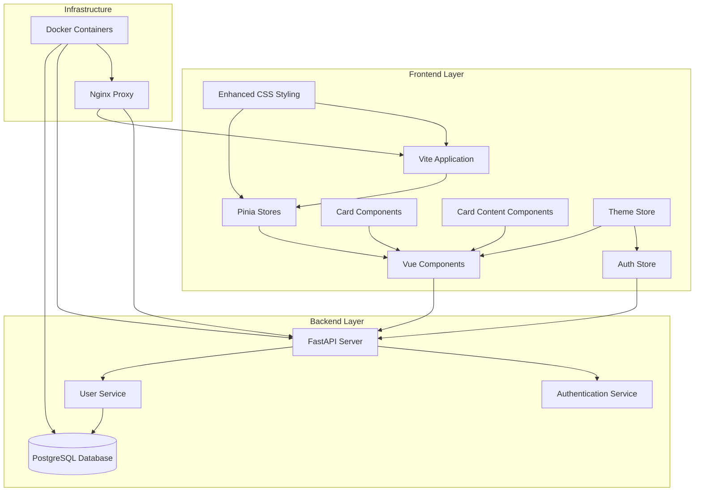
```mermaid
graph TB
subgraph "Frontend Layer"
FE[Vite Application]
Store[Pinia Stores]
UI[Vue Components]
CSS[Enhanced CSS Styling]
Card[Card Components]
CardContent[Card Content Components]
ThemeStore[Theme Store]
AuthStore[Auth Store]
end
subgraph "Backend Layer"
API[FastAPI Server]
Auth[Authentication Service]
UserSvc[User Service]
DB[(PostgreSQL Database)]
end
subgraph "Infrastructure"
Nginx[Nginx Proxy]
Docker[Docker Containers]
end
FE --> Store
Store --> UI
UI --> API
API --> Auth
API --> UserSvc
UserSvc --> DB
Nginx --> API
Nginx --> FE
Docker --> Nginx
Docker --> API
Docker --> DB
CSS --> FE
CSS --> Store
Card --> UI
CardContent --> UI
ThemeStore --> AuthStore
ThemeStore --> UI
AuthStore --> API
```

**Diagram sources**
- [main.py:50-87](file://backend/app/main.py#L50-L87)
- [Display.vue:1-185](file://frontend/src/views/settings/Display.vue#L1-185)
- [nginx.conf:1-20](file://frontend/nginx.conf#L1-20)
- [Card.vue:1-14](file://frontend/src/components/ui/Card.vue#L1-14)
- [CardContent.vue:1-14](file://frontend/src/components/ui/CardContent.vue#L1-14)
- [theme.js:1-105](file://frontend/src/stores/theme.js#L1-105)
- [auth.js:1-202](file://frontend/src/stores/auth.js#L1-202)

The architecture ensures scalability, maintainability, and security through proper separation of concerns and standardized communication protocols, now including comprehensive theme management capabilities.

## Database Schema Design

The database schema has been enhanced to support both background image preferences and theme persistence. The design maintains backward compatibility while adding comprehensive user customization capabilities.

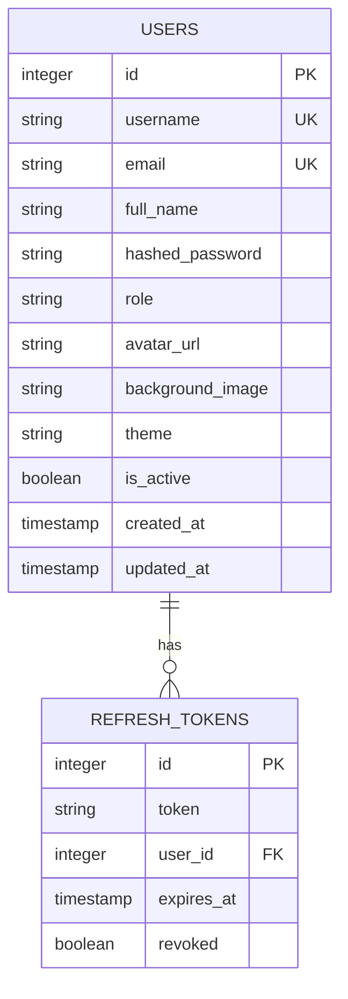
```mermaid
erDiagram
USERS {
integer id PK
string username UK
string email UK
string full_name
string hashed_password
string role
string avatar_url
string background_image
string theme
boolean is_active
timestamp created_at
timestamp updated_at
}
REFRESH_TOKENS {
integer id PK
string token
integer user_id FK
timestamp expires_at
boolean revoked
}
USERS ||--o{ REFRESH_TOKENS : has
```

**Diagram sources**
- [user.py:7-25](file://backend/app/models/user.py#L7-L25)
- [002_add_background_image_to_users.py:21-26](file://backend/alembic/versions/002_add_background_image_to_users.py#L21-L26)

The schema modification adds both `background_image` and `theme` columns to the users table, allowing users to store their preferred background image filename and theme preference. The theme column defaults to 'light' and supports 'dark' and 'system' modes, with automatic system theme detection.

**Section sources**
- [user.py:16-18](file://backend/app/models/user.py#L16-L18)
- [002_add_background_image_to_users.py:21-26](file://backend/alembic/versions/002_add_background_image_to_users.py#L21-L26)

## Backend Implementation

The backend implementation provides comprehensive user management capabilities with specialized endpoints for both background image and theme management, ensuring secure and efficient operations.

### Enhanced User Model

The User model now includes both `background_image` and `theme` fields alongside existing user attributes, supporting comprehensive user customization preferences.

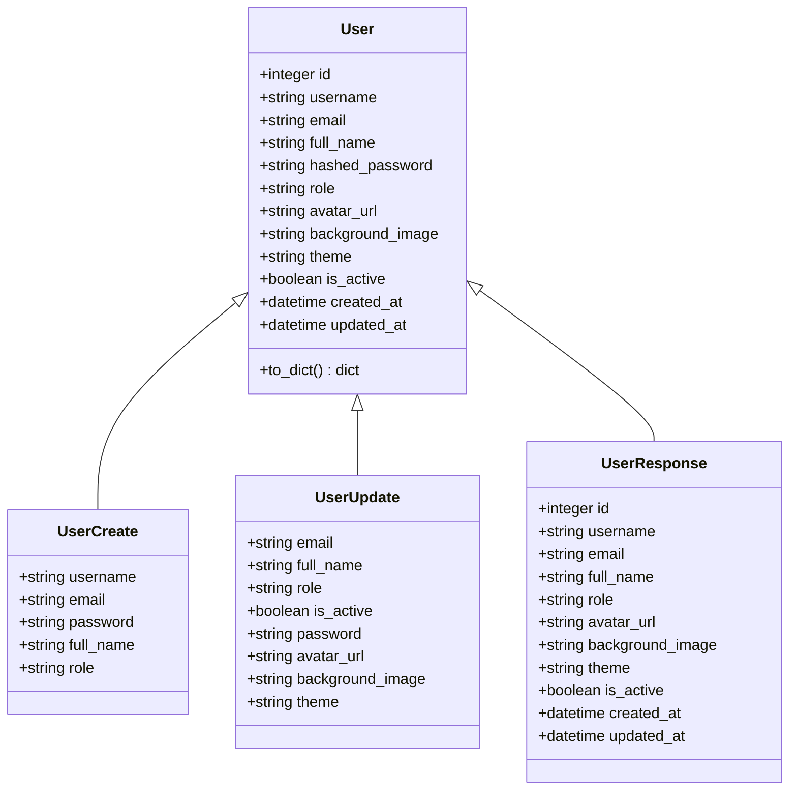
```mermaid
classDiagram
class User {
+integer id
+string username
+string email
+string full_name
+string hashed_password
+string role
+string avatar_url
+string background_image
+string theme
+boolean is_active
+datetime created_at
+datetime updated_at
+to_dict() dict
}
class UserCreate {
+string username
+string email
+string password
+string full_name
+string role
}
class UserUpdate {
+string email
+string full_name
+string role
+boolean is_active
+string password
+string avatar_url
+string background_image
+string theme
}
class UserResponse {
+integer id
+string username
+string email
+string full_name
+string role
+string avatar_url
+string background_image
+string theme
+boolean is_active
+datetime created_at
+datetime updated_at
}
User <|-- UserCreate
User <|-- UserUpdate
User <|-- UserResponse
```

**Diagram sources**
- [user.py:7-39](file://backend/app/models/user.py#L7-L39)
- [user.py:6-37](file://backend/app/schemas/user.py#L6-L37)

### Unified Profile Management Endpoint

The backend now provides a unified endpoint for managing all user display preferences, including both theme and background image settings.

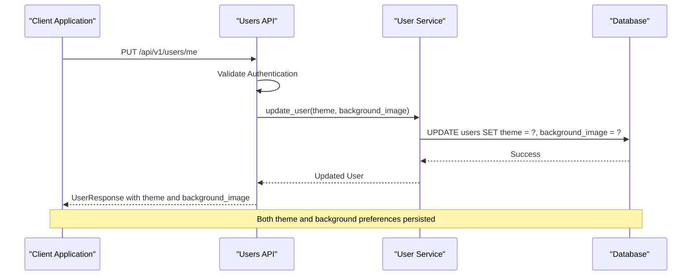
```mermaid
sequenceDiagram
participant Client as "Client Application"
participant API as "Users API"
participant Service as "User Service"
participant DB as "Database"
Client->>API : PUT /api/v1/users/me
API->>API : Validate Authentication
API->>Service : update_user(theme, background_image)
Service->>DB : UPDATE users SET theme = ?, background_image = ?
DB-->>Service : Success
Service-->>API : Updated User
API-->>Client : UserResponse with theme and background_image
Note over Client,DB : Both theme and background preferences persisted
```

**Diagram sources**
- [users.py:50-62](file://backend/app/api/v1/endpoints/users.py#L50-L62)
- [user_service.py:46-58](file://backend/app/services/user_service.py#L46-L58)

**Section sources**
- [users.py:39-71](file://backend/app/api/v1/endpoints/users.py#L39-L71)
- [user_service.py:46-58](file://backend/app/services/user_service.py#L46-L58)

## Frontend Implementation

The frontend provides an intuitive interface for users to select and manage both background preferences and theme settings, with seamless integration between the two systems.

### Enhanced Display Settings Interface

The Display.vue component now offers comprehensive theme management alongside background selection, with real-time preview and validation capabilities.

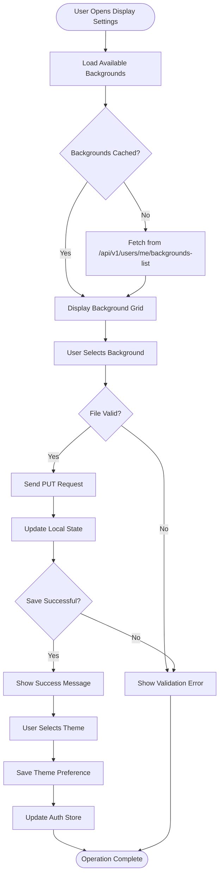
```mermaid
flowchart TD
Start([User Opens Display Settings]) --> LoadBG["Load Available Backgrounds"]
LoadBG --> CheckCache{"Backgrounds Cached?"}
CheckCache --> |Yes| DisplayGrid["Display Background Grid"]
CheckCache --> |No| FetchAPI["Fetch from /api/v1/users/me/backgrounds-list"]
FetchAPI --> DisplayGrid
DisplayGrid --> SelectBG["User Selects Background"]
SelectBG --> ValidateFile{"File Valid?"}
ValidateFile --> |No| ShowError["Show Validation Error"]
ValidateFile --> |Yes| SendRequest["Send PUT Request"]
SendRequest --> UpdateUI["Update Local State"]
UpdateUI --> SaveSuccess{"Save Successful?"}
SaveSuccess --> |Yes| ShowSuccess["Show Success Message"]
SaveSuccess --> |No| ShowError
ShowSuccess --> ThemeSelection["User Selects Theme"]
ThemeSelection --> SaveTheme["Save Theme Preference"]
SaveTheme --> UpdateAuth["Update Auth Store"]
UpdateAuth --> End([Operation Complete])
ShowError --> End
```

**Diagram sources**
- [Display.vue:33-70](file://frontend/src/views/settings/Display.vue#L33-L70)
- [theme.js:29-59](file://frontend/src/stores/theme.js#L29-L59)

### Integrated Theme Management System

The theme store now manages both color themes and background images with automatic persistence to user profiles, providing a unified approach to user customization.

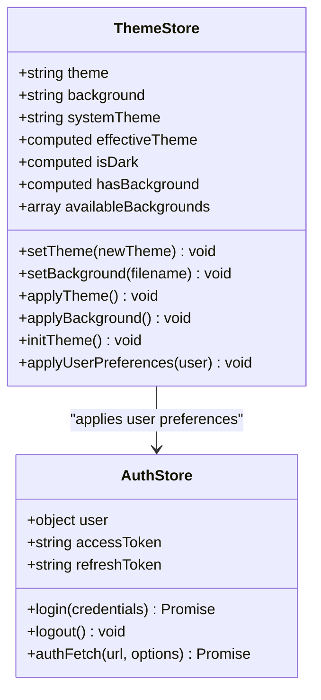
```mermaid
classDiagram
class ThemeStore {
+string theme
+string background
+string systemTheme
+computed effectiveTheme
+computed isDark
+computed hasBackground
+array availableBackgrounds
+setTheme(newTheme) void
+setBackground(filename) void
+applyTheme() void
+applyBackground() void
+initTheme() void
+applyUserPreferences(user) void
}
class AuthStore {
+object user
+string accessToken
+string refreshToken
+login(credentials) Promise
+logout() void
+authFetch(url, options) Promise
}
ThemeStore --> AuthStore : "applies user preferences"
```

**Diagram sources**
- [theme.js:4-90](file://frontend/src/stores/theme.js#L4-L90)
- [auth.js:5-204](file://frontend/src/stores/auth.js#L5-L204)

**Section sources**
- [Display.vue:1-185](file://frontend/src/views/settings/Display.vue#L1-185)
- [theme.js:1-92](file://frontend/src/stores/theme.js#L1-92)
- [auth.js:1-204](file://frontend/src/stores/auth.js#L1-204)

## API Endpoints

The system provides RESTful endpoints for comprehensive user background and theme management functionality, with unified preference management.

### Enhanced Background and Theme Management Endpoints

| Endpoint | Method | Description | Authentication | Response |
|----------|--------|-------------|----------------|----------|
| `/api/v1/users/me/background` | PUT | Update current user's background image | User | UserResponse |
| `/api/v1/users/me/backgrounds-list` | GET | Get available background images | User | Array of filenames |
| `/api/v1/users/me/avatar` | PUT | Update current user's avatar | User | UserResponse |
| `/api/v1/users/me` | PUT | Update user profile (theme, background, etc.) | User | UserResponse |

### Unified Profile Management

The unified profile management endpoint allows users to update multiple preferences simultaneously, including theme and background image settings.

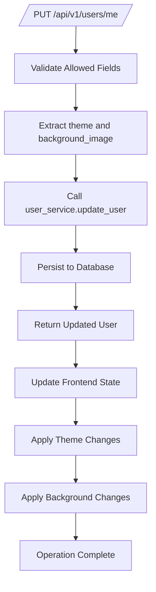
```mermaid
flowchart TD
Request[/PUT /api/v1/users/me/] --> ValidateFields["Validate Allowed Fields"]
ValidateFields --> ExtractData["Extract theme and background_image"]
ExtractData --> UpdateUser["Call user_service.update_user"]
UpdateUser --> PersistDB["Persist to Database"]
PersistDB --> ReturnUser["Return Updated User"]
ReturnUser --> UpdateFrontend["Update Frontend State"]
UpdateFrontend --> ApplyTheme["Apply Theme Changes"]
ApplyTheme --> ApplyBackground["Apply Background Changes"]
ApplyBackground --> Complete["Operation Complete"]
```

**Diagram sources**
- [users.py:50-62](file://backend/app/api/v1/endpoints/users.py#L50-L62)

**Section sources**
- [users.py:39-71](file://backend/app/api/v1/endpoints/users.py#L39-L71)

## Security Model

The system implements robust security measures to protect user data and prevent unauthorized access to background management and theme functionality.

### Enhanced Authentication and Authorization

The security model leverages JWT tokens with role-based access control to ensure only authorized users can modify their background preferences and theme settings.

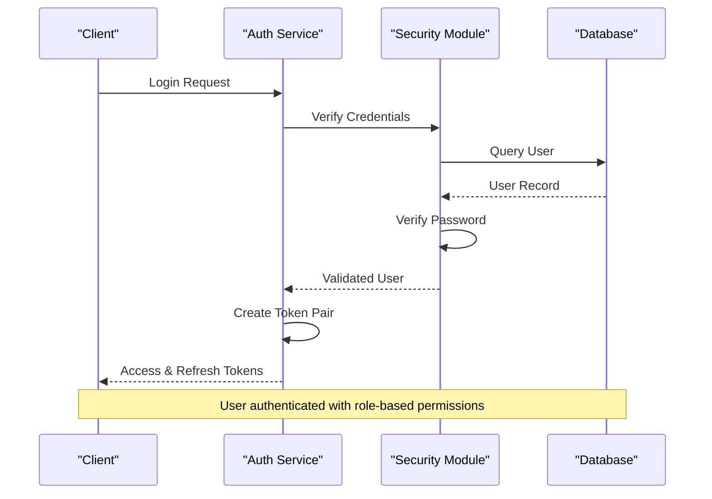
```mermaid
sequenceDiagram
participant Client as "Client"
participant Auth as "Auth Service"
participant Security as "Security Module"
participant DB as "Database"
Client->>Auth : Login Request
Auth->>Security : Verify Credentials
Security->>DB : Query User
DB-->>Security : User Record
Security->>Security : Verify Password
Security-->>Auth : Validated User
Auth->>Auth : Create Token Pair
Auth-->>Client : Access & Refresh Tokens
Note over Client,DB : User authenticated with role-based permissions
```

**Diagram sources**
- [auth_service.py:113-119](file://backend/app/services/auth_service.py#L113-L119)
- [security.py:61-79](file://backend/app/core/security.py#L61-L79)

### Role-Based Access Control

The system implements hierarchical permissions where superusers have elevated privileges while regular users can only manage their own preferences, including both background images and theme settings.

**Section sources**
- [security.py:82-110](file://backend/app/core/security.py#L82-L110)
- [auth_service.py:113-119](file://backend/app/services/auth_service.py#L113-L119)

## Deployment Configuration

The system supports flexible deployment configurations through Docker containers and Nginx reverse proxy setup, with enhanced static asset serving for background images.

### Container Orchestration

The docker-compose configuration orchestrates three interconnected services: PostgreSQL database, FastAPI backend, and Vue.js frontend with Nginx serving static assets including background images.

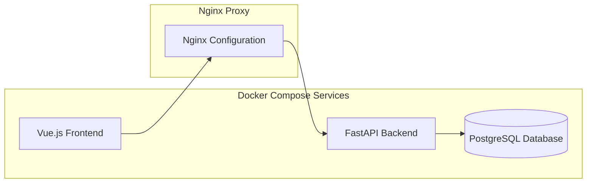
```mermaid
graph LR
subgraph "Docker Compose Services"
DB[(PostgreSQL Database)]
Backend[FastAPI Backend]
Frontend[Vue.js Frontend]
end
subgraph "Nginx Proxy"
NginxConf[Nginx Configuration]
end
Frontend --> NginxConf
NginxConf --> Backend
Backend --> DB
```

**Diagram sources**
- [docker-compose.yml:1-53](file://docker-compose.yml#L1-L53)
- [Dockerfile:1-13](file://frontend/Dockerfile#L1-L13)

### Enhanced Static Asset Serving

Nginx serves static background images efficiently, reducing load on the backend server and improving response times for client requests, now including comprehensive theme and background image support.

**Section sources**
- [docker-compose.yml:1-53](file://docker-compose.yml#L1-L53)
- [nginx.conf:1-20](file://frontend/nginx.conf#L1-L20)
- [Dockerfile:1-13](file://frontend/Dockerfile#L1-L13)

## User Experience Flow

The user experience follows a streamlined process for discovering, selecting, and applying both background preferences and theme settings.

### Enhanced Background and Theme Selection Workflow

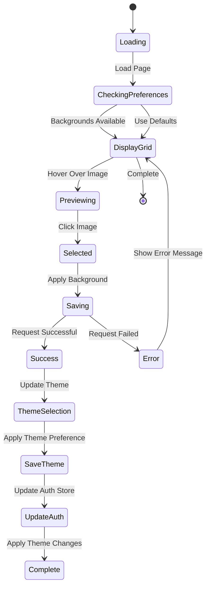
```mermaid
stateDiagram-v2
[*] --> Loading
Loading --> CheckingPreferences : Load Page
CheckingPreferences --> DisplayGrid : Backgrounds Available
CheckingPreferences --> DisplayGrid : Use Defaults
DisplayGrid --> Previewing : Hover Over Image
Previewing --> Selected : Click Image
Selected --> Saving : Apply Background
Saving --> Success : Request Successful
Saving --> Error : Request Failed
Success --> ThemeSelection : Update Theme
ThemeSelection --> SaveTheme : Apply Theme Preference
SaveTheme --> UpdateAuth : Update Auth Store
UpdateAuth --> Complete : Apply Theme Changes
Error --> DisplayGrid : Show Error Message
DisplayGrid --> [*] : Complete
```

The workflow ensures smooth user interaction with immediate feedback and error handling throughout the selection process, now including comprehensive theme management capabilities.

## Visual Styling Enhancements

The system now features sophisticated visual styling with integrated theme management and dynamic background image application, creating a cohesive user experience.

### Enhanced Theme and Background Integration System

The theme management system now applies advanced visual effects when background images are active, creating a modern glass-like appearance with backdrop blur and translucent UI elements, while maintaining theme consistency.

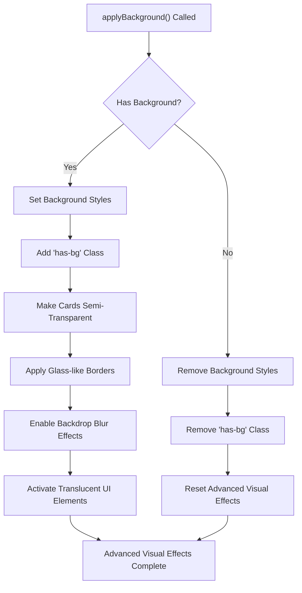
```mermaid
flowchart TD
ApplyBG["applyBackground() Called"] --> CheckBG{"Has Background?"}
CheckBG --> |Yes| SetStyles["Set Background Styles"]
SetStyles --> AddClass["Add 'has-bg' Class"]
AddClass --> TransparentCards["Make Cards Semi-Transparent"]
TransparentCards --> GlassBorders["Apply Glass-like Borders"]
GlassBorders --> BackdropBlur["Enable Backdrop Blur Effects"]
BackdropBlur --> TranslucentElements["Activate Translucent UI Elements"]
TranslucentElements --> EffectComplete["Advanced Visual Effects Complete"]
CheckBG --> |No| RemoveStyles["Remove Background Styles"]
RemoveStyles --> RemoveClass["Remove 'has-bg' Class"]
RemoveClass --> ResetStyles["Reset Advanced Visual Effects"]
ResetStyles --> EffectComplete
```

**Diagram sources**
- [theme.js:44-61](file://frontend/src/stores/theme.js#L44-L61)
- [main.css:78-87](file://frontend/src/assets/css/main.css#L78-L87)

### Advanced CSS Variable Integration with Theme Persistence

The system utilizes CSS custom properties for dynamic theming, enabling seamless transitions between light, dark, and system themes with advanced backdrop filter effects, now with persistent theme storage.

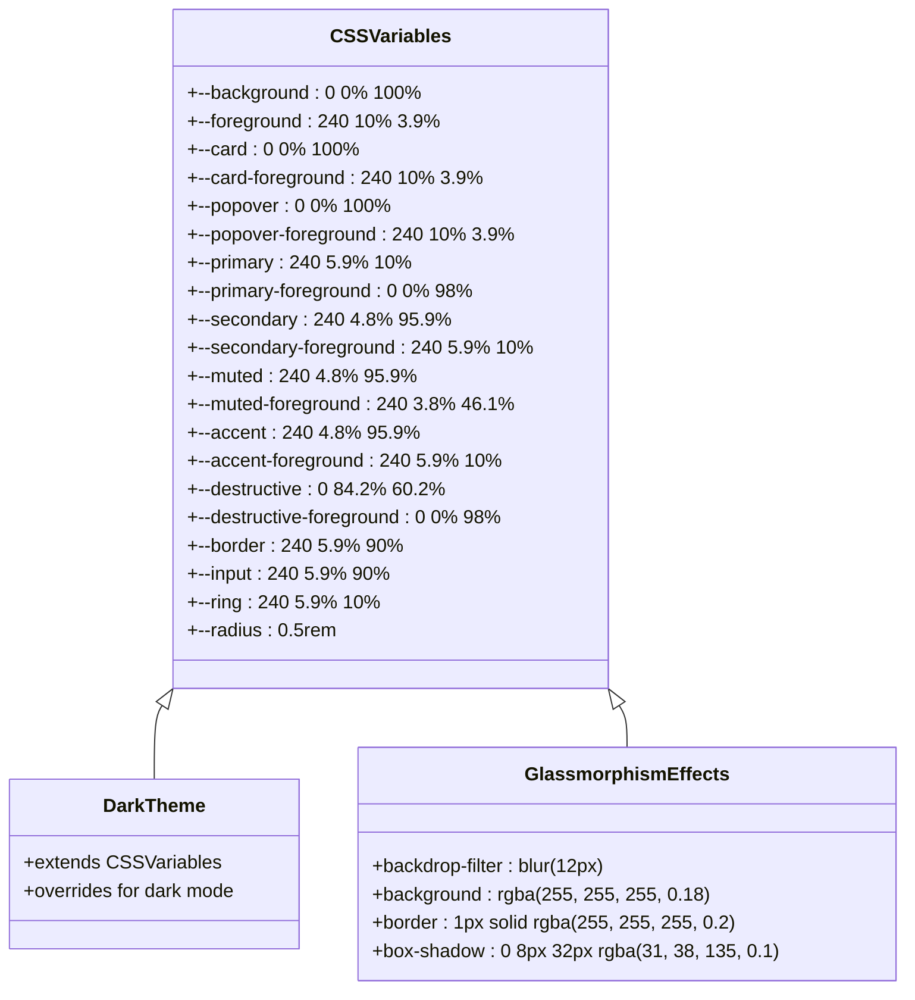
```mermaid
classDiagram
class CSSVariables {
+--background : 0 0% 100%
+--foreground : 240 10% 3.9%
+--card : 0 0% 100%
+--card-foreground : 240 10% 3.9%
+--popover : 0 0% 100%
+--popover-foreground : 240 10% 3.9%
+--primary : 240 5.9% 10%
+--primary-foreground : 0 0% 98%
+--secondary : 240 4.8% 95.9%
+--secondary-foreground : 240 5.9% 10%
+--muted : 240 4.8% 95.9%
+--muted-foreground : 240 3.8% 46.1%
+--accent : 240 4.8% 95.9%
+--accent-foreground : 240 5.9% 10%
+--destructive : 0 84.2% 60.2%
+--destructive-foreground : 0 0% 98%
+--border : 240 5.9% 90%
+--input : 240 5.9% 90%
+--ring : 240 5.9% 10%
+--radius : 0.5rem
}
class DarkTheme {
+extends CSSVariables
+overrides for dark mode
}
class GlassmorphismEffects {
+backdrop-filter : blur(12px)
+background : rgba(255, 255, 255, 0.18)
+border : 1px solid rgba(255, 255, 255, 0.2)
+box-shadow : 0 8px 32px rgba(31, 38, 135, 0.1)
}
CSSVariables <|-- DarkTheme
CSSVariables <|-- GlassmorphismEffects
```

**Diagram sources**
- [main.css:8-51](file://frontend/src/assets/css/main.css#L8-L51)

### Comprehensive Theme Management with Automatic Persistence

The system implements sophisticated visual effects that transform the user interface when background images are applied, creating a modern glass-like appearance, while maintaining theme consistency and automatic persistence.

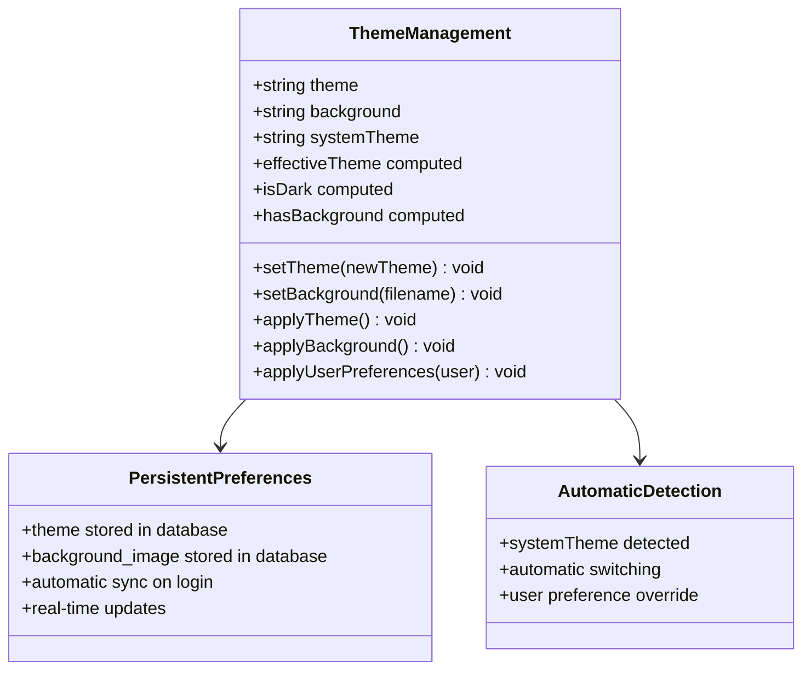
```mermaid
classDiagram
class ThemeManagement {
+string theme
+string background
+string systemTheme
+effectiveTheme computed
+isDark computed
+hasBackground computed
+setTheme(newTheme) void
+setBackground(filename) void
+applyTheme() void
+applyBackground() void
+applyUserPreferences(user) void
}
class PersistentPreferences {
+theme stored in database
+background_image stored in database
+automatic sync on login
+real-time updates
}
class AutomaticDetection {
+systemTheme detected
+automatic switching
+user preference override
}
ThemeManagement --> PersistentPreferences
ThemeManagement --> AutomaticDetection
```

**Diagram sources**
- [theme.js:4-90](file://frontend/src/stores/theme.js#L4-L90)
- [auth.js:5-204](file://frontend/src/stores/auth.js#L5-L204)

### Enhanced Background Image Support with Advanced Formats

The system now supports additional image formats and enhanced visual quality with the addition of new background images, including modern formats optimized for glassmorphism effects, while maintaining comprehensive theme management capabilities.

**Section sources**
- [Display.vue:17-26](file://frontend/src/views/settings/Display.vue#L17-L26)
- [theme.js:44-61](file://frontend/src/stores/theme.js#L44-L61)
- [main.css:78-87](file://frontend/src/assets/css/main.css#L78-L87)

## Troubleshooting Guide

Common issues and their solutions for the enhanced Per-User Background and Theme Management System.

### Database Migration Issues

**Problem**: Background image and theme columns missing from users table
**Solution**: Run Alembic migration to add both columns
```bash
alembic upgrade head
```

**Problem**: Migration fails during startup
**Solution**: Check database connectivity and run manual migration
```bash
python -m alembic upgrade head
```

### Frontend Asset Loading Issues

**Problem**: Background images not displaying in development
**Solution**: Verify image files are placed in correct directory
```
frontend/public/backgrounds/
```

**Problem**: Images load but don't appear in UI
**Solution**: Check browser console for CORS errors and verify nginx configuration

**Updated** New background images (bg7.webp, bg8.jpg) may require verification of file extensions and format support. Glassmorphism effects require proper CSS variable definitions and backdrop filter support. Theme persistence requires proper database column configuration.

### Authentication and Theme Persistence Problems

**Problem**: Users cannot save background preferences or theme settings
**Solution**: Verify JWT token validity and user authentication status

**Problem**: Background preferences or theme settings not persisting
**Solution**: Check database write permissions and connection status, verify theme column exists

**Problem**: Theme settings revert after page reload
**Solution**: Ensure theme persistence endpoint is working and database column is properly configured

### Visual Styling Issues

**Problem**: Background images not applying correctly
**Solution**: Verify CSS classes are being applied and check for console errors

**Problem**: Glassmorphism effects not appearing
**Solution**: Ensure the `has-bg` class is properly toggled, CSS variables are correctly defined, and browser supports backdrop-filter property

**Problem**: Translucent elements not visible
**Solution**: Check that CSS selectors `.bg-card`, `.bg-background`, `.border-b`, `.border-r` are properly targeting elements under `html.has-bg` context

**Problem**: Theme switching not working
**Solution**: Verify theme store is properly initialized, system theme detection is working, and theme persistence is functioning correctly

## Conclusion

The enhanced Per-User Background and Theme Management System successfully integrates comprehensive customization capabilities into the existing SSO infrastructure with sophisticated theme management and persistent preferences. The implementation demonstrates excellent separation of concerns, robust security practices, and cutting-edge user experience design principles.

Key achievements include:

- **Comprehensive Architecture**: Clean separation between frontend, backend, and database layers with integrated theme management
- **Security-First Design**: Comprehensive authentication and authorization mechanisms with role-based access control
- **Advanced Visual Experience**: Sophisticated glassmorphism effects with backdrop blur and translucent elements
- **Persistent Theme Management**: Database-backed theme preferences with automatic system detection and switching
- **Modern Image Support**: Expanded background image formats including webp and jpg with optimized quality
- **Unified User Experience**: Seamless integration between theme and background management with real-time persistence
- **Enhanced Deployment Flexibility**: Support for various deployment scenarios through Docker containers with comprehensive static asset serving
- **Performance Optimization**: Efficient static asset serving through Nginx proxy with theme-aware caching

The system provides a solid foundation for future enhancements while maintaining backward compatibility and system stability. The modular design allows for easy extension of customization features and integration with additional personalization options, now with comprehensive theme persistence and automatic system theme detection.

**Updated** Recent enhancements include comprehensive theme management system with three distinct theme modes (light, dark, system), automatic theme persistence to database, integrated theme and background management, system theme detection, and seamless user preference synchronization across sessions.