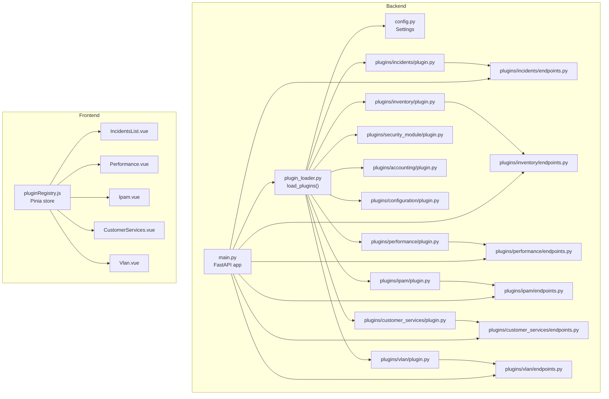
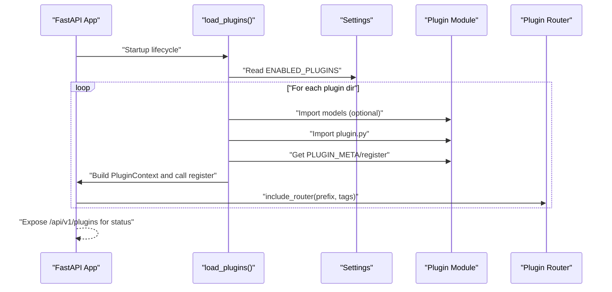
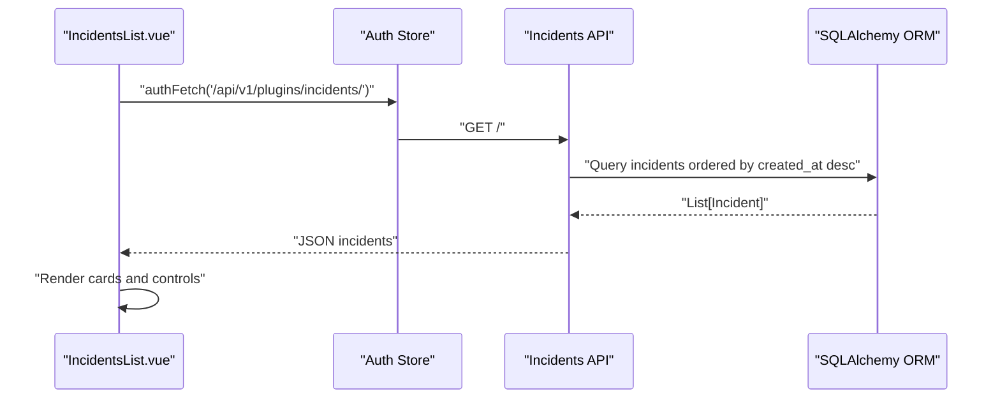
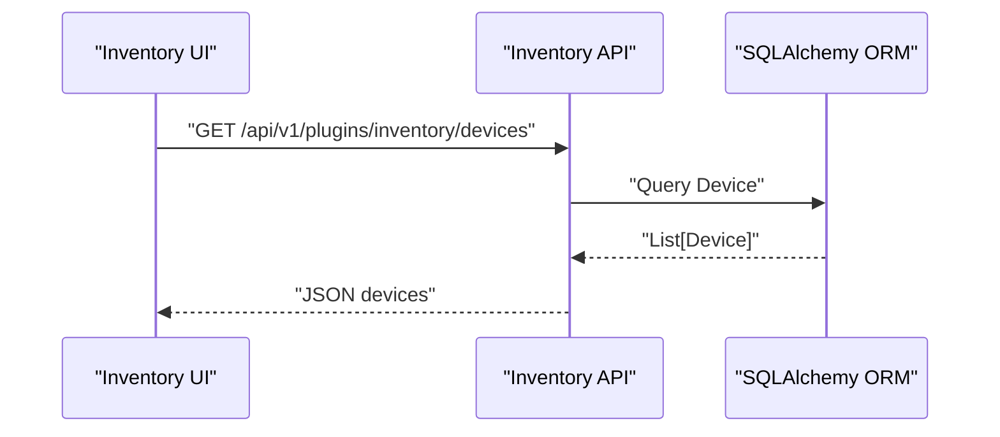
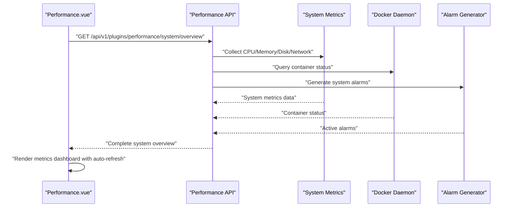
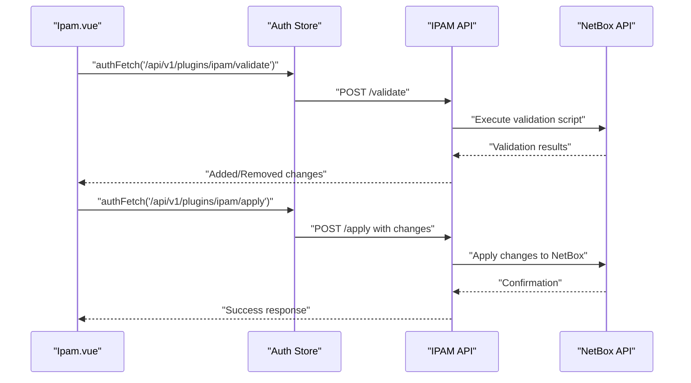
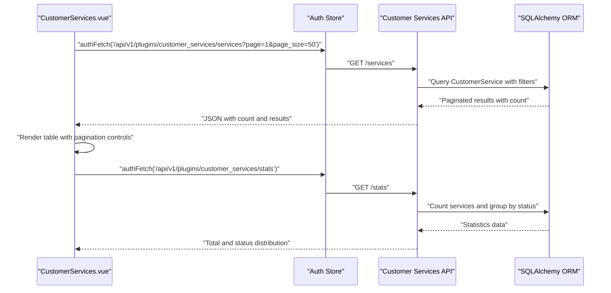
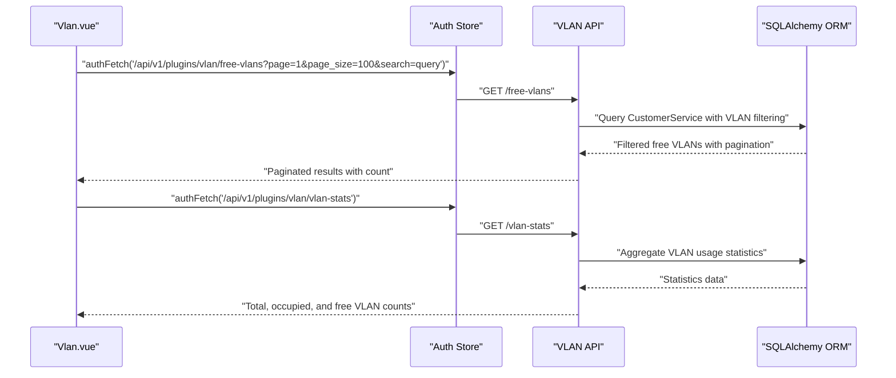
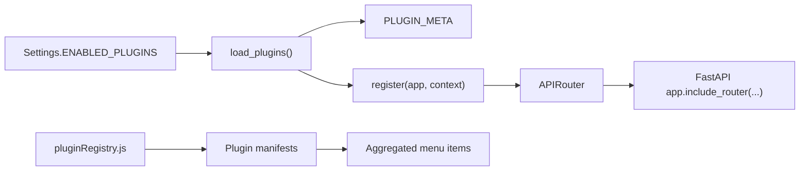

# Built-in Plugins Overview

<cite>
**Referenced Files in This Document**
- [plugin_loader.py](file://backend/app/core/plugin_loader.py)
- [config.py](file://backend/app/core/config.py)
- [main.py](file://backend/app/main.py)
- [plugin.py (Incidents)](file://backend/app/plugins/incidents/plugin.py)
- [endpoints.py (Incidents)](file://backend/app/plugins/incidents/endpoints.py)
- [plugin.py (Inventory)](file://backend/app/plugins/inventory/plugin.py)
- [endpoints.py (Inventory)](file://backend/app/plugins/inventory/endpoints.py)
- [plugin.py (Performance)](file://backend/app/plugins/performance/plugin.py)
- [endpoints.py (Performance)](file://backend/app/plugins/performance/endpoints.py)
- [models.py (Performance)](file://backend/app/plugins/performance/models.py)
- [schemas.py (Performance)](file://backend/app/plugins/performance/schemas.py)
- [plugin.py (Security Module)](file://backend/app/plugins/security_module/plugin.py)
- [plugin.py (Accounting)](file://backend/app/plugins/accounting/plugin.py)
- [plugin.py (Configuration)](file://backend/app/plugins/configuration/plugin.py)
- [plugin.py (IPAM)](file://backend/app/plugins/ipam/plugin.py)
- [endpoints.py (IPAM)](file://backend/app/plugins/ipam/endpoints.py)
- [plugin.py (Customer Services)](file://backend/app/plugins/customer_services/plugin.py)
- [endpoints.py (Customer Services)](file://backend/app/plugins/customer_services/endpoints.py)
- [models.py (Customer Services)](file://backend/app/plugins/customer_services/models.py)
- [schemas.py (Customer Services)](file://backend/app/plugins/customer_services/schemas.py)
- [plugin.py (VLAN)](file://backend/app/plugins/vlan/plugin.py)
- [endpoints.py (VLAN)](file://backend/app/plugins/vlan/endpoints.py)
- [pluginRegistry.js](file://frontend/src/stores/pluginRegistry.js)
- [IncidentsList.vue](file://frontend/src/plugins/incidents/views/IncidentsList.vue)
- [Performance.vue](file://frontend/src/plugins/performance/views/Performance.vue)
- [Ipam.vue](file://frontend/src/plugins/ipam/views/Ipam.vue)
- [CustomerServices.vue](file://frontend/src/plugins/customer_services/views/CustomerServices.vue)
- [Vlan.vue](file://frontend/src/plugins/vlan/views/Vlan.vue)
</cite>

## Update Summary
**Changes Made**
- Updated Performance plugin documentation to reflect comprehensive system monitoring capabilities
- Added detailed coverage of real-time system metrics, Docker container monitoring, and alerting functionality
- Enhanced Performance plugin API endpoints documentation with new system monitoring routes
- Updated Performance plugin frontend integration to show complete monitoring dashboard
- Added VLAN plugin documentation as the 8th built-in plugin
- Updated plugin count from 7 to 9 built-in plugins
- Enhanced architecture overview to include expanded Performance plugin examples

## Table of Contents
1. [Introduction](#introduction)
2. [Project Structure](#project-structure)
3. [Core Components](#core-components)
4. [Architecture Overview](#architecture-overview)
5. [Detailed Component Analysis](#detailed-component-analysis)
6. [Dependency Analysis](#dependency-analysis)
7. [Performance Considerations](#performance-considerations)
8. [Troubleshooting Guide](#troubleshooting-guide)
9. [Conclusion](#conclusion)
10. [Appendices](#appendices)

## Introduction
This document provides a comprehensive overview of the nine built-in plugins that ship with the system: Incidents, Inventory, Performance, Security Module, Accounting, Configuration, IPAM, Customer Services, and VLAN. It explains each plugin's purpose, functionality, and integration within the overall platform, and demonstrates how these plugins illustrate the plugin architecture and serve as examples for developing custom plugins. The Performance plugin now serves as a complete system administration tool with comprehensive real-time monitoring and alerting capabilities. It includes system metrics collection, Docker container monitoring, and intelligent alert generation alongside traditional network performance monitoring.

## Project Structure
The plugin system is implemented in the backend under a dedicated plugins directory. Each plugin exposes a plugin registration module and an API router. The backend loads plugins at startup, constructs per-plugin API prefixes, and registers routers with the main application. The frontend integrates plugin-managed UI views and menus via a plugin registry store.

**Diagram sources**
- [main.py:17-48](file://backend/app/main.py#L17-L48)
- [plugin_loader.py:25-99](file://backend/app/core/plugin_loader.py#L25-L99)
- [config.py:25-26](file://backend/app/core/config.py#L25-L26)
- [plugin.py (Incidents):9-17](file://backend/app/plugins/incidents/plugin.py#L9-L17)
- [plugin.py (Inventory):9-17](file://backend/app/plugins/inventory/plugin.py#L9-L17)
- [plugin.py (Performance):9-17](file://backend/app/plugins/performance/plugin.py#L9-L17)
- [plugin.py (Security Module):9-17](file://backend/app/plugins/security_module/plugin.py#L9-L17)
- [plugin.py (Accounting):9-17](file://backend/app/plugins/accounting/plugin.py#L9-L17)
- [plugin.py (Configuration):9-17](file://backend/app/plugins/configuration/plugin.py#L9-L17)
- [plugin.py (IPAM):9-17](file://backend/app/plugins/ipam/plugin.py#L9-L17)
- [plugin.py (Customer Services):9-17](file://backend/app/plugins/customer_services/plugin.py#L9-L17)
- [plugin.py (VLAN):9-17](file://backend/app/plugins/vlan/plugin.py#L9-L17)
- [endpoints.py (Incidents):15](file://backend/app/plugins/incidents/endpoints.py#L15)
- [endpoints.py (Inventory):15](file://backend/app/plugins/inventory/endpoints.py#L15)
- [endpoints.py (Performance):11](file://backend/app/plugins/performance/endpoints.py#L11)
- [endpoints.py (IPAM):20-109](file://backend/app/plugins/ipam/endpoints.py#L20-L109)
- [endpoints.py (Customer Services):18-172](file://backend/app/plugins/customer_services/endpoints.py#L18-172)
- [endpoints.py (VLAN):14-221](file://backend/app/plugins/vlan/endpoints.py#L14-221)
- [pluginRegistry.js:1-53](file://frontend/src/stores/pluginRegistry.js#L1-L53)
- [IncidentsList.vue:1-268](file://frontend/src/plugins/incidents/views/IncidentsList.vue#L1-L268)
- [Performance.vue:1-465](file://frontend/src/plugins/performance/views/Performance.vue#L1-L465)
- [Ipam.vue:1-489](file://frontend/src/plugins/ipam/views/Ipam.vue#L1-L489)
- [CustomerServices.vue:1-384](file://frontend/src/plugins/customer_services/views/CustomerServices.vue#L1-L384)
- [Vlan.vue:1-429](file://frontend/src/plugins/vlan/views/Vlan.vue#L1-L429)

**Section sources**
- [main.py:17-48](file://backend/app/main.py#L17-L48)
- [plugin_loader.py:25-99](file://backend/app/core/plugin_loader.py#L25-L99)
- [config.py:25-26](file://backend/app/core/config.py#L25-L26)

## Core Components
- Plugin loader: Discovers plugin directories, conditionally enables plugins, imports models and plugin modules, constructs a per-plugin API prefix, and registers routers into the main application.
- Plugin registration: Each plugin defines metadata and a register function that includes the plugin's router with a tag and a plugin-scoped API prefix.
- Configuration: The settings object exposes an environment variable to filter enabled plugins.
- Frontend plugin registry: A Pinia store manages plugin manifests, enabled plugins, and aggregated menu items for rendering.

Key behaviors:
- Discovery: Iterates over the plugins directory, skipping hidden or invalid entries.
- Filtering: Uses a comma-separated list from settings to include only named plugins.
- Registration: Builds a PluginContext with database base, API prefix, and dependency injection helpers, then invokes register.
- API prefixing: Each plugin receives a distinct API prefix derived from its plugin name.

**Section sources**
- [plugin_loader.py:25-99](file://backend/app/core/plugin_loader.py#L25-L99)
- [config.py:25-26](file://backend/app/core/config.py#L25-L26)
- [plugin.py (Incidents):1-17](file://backend/app/plugins/incidents/plugin.py#L1-L17)
- [plugin.py (Inventory):1-17](file://backend/app/plugins/inventory/plugin.py#L1-L17)
- [plugin.py (Performance):1-17](file://backend/app/plugins/performance/plugin.py#L1-L17)
- [plugin.py (Security Module):1-17](file://backend/app/plugins/security_module/plugin.py#L1-L17)
- [plugin.py (Accounting):1-17](file://backend/app/plugins/accounting/plugin.py#L1-L17)
- [plugin.py (Configuration):1-17](file://backend/app/plugins/configuration/plugin.py#L1-L17)
- [plugin.py (IPAM):1-17](file://backend/app/plugins/ipam/plugin.py#L1-L17)
- [plugin.py (Customer Services):1-17](file://backend/app/plugins/customer_services/plugin.py#L1-L17)
- [plugin.py (VLAN):1-17](file://backend/app/plugins/vlan/plugin.py#L1-L17)
- [pluginRegistry.js:1-53](file://frontend/src/stores/pluginRegistry.js#L1-L53)

## Architecture Overview
The plugin architecture centers on a shared loader and per-plugin modules. At startup, the loader:
- Reads settings to determine enabled plugins.
- Imports each plugin's models (if present) and plugin module.
- Extracts metadata and register function.
- Constructs a PluginContext and calls register to attach the plugin's router to the main app.

**Diagram sources**
- [main.py:17-48](file://backend/app/main.py#L17-L48)
- [plugin_loader.py:25-99](file://backend/app/core/plugin_loader.py#L25-L99)
- [config.py:25-26](file://backend/app/core/config.py#L25-L26)
- [plugin.py (Incidents):9-17](file://backend/app/plugins/incidents/plugin.py#L9-L17)
- [plugin.py (Inventory):9-17](file://backend/app/plugins/inventory/plugin.py#L9-L17)
- [plugin.py (Performance):9-17](file://backend/app/plugins/performance/plugin.py#L9-L17)
- [plugin.py (Security Module):9-17](file://backend/app/plugins/security_module/plugin.py#L9-L17)
- [plugin.py (Accounting):9-17](file://backend/app/plugins/accounting/plugin.py#L9-L17)
- [plugin.py (Configuration):9-17](file://backend/app/plugins/configuration/plugin.py#L9-L17)
- [plugin.py (IPAM):9-17](file://backend/app/plugins/ipam/plugin.py#L9-L17)
- [plugin.py (Customer Services):9-17](file://backend/app/plugins/customer_services/plugin.py#L9-L17)
- [plugin.py (VLAN):9-17](file://backend/app/plugins/vlan/plugin.py#L9-L17)

## Detailed Component Analysis

### Incidents Plugin
Purpose:
- Incident management for creating, tracking, and resolving network incidents.

Functionality:
- Provides endpoints to list, create, retrieve, update, and delete incidents.
- Supports incident comments and enforces role-based access for administrative actions.
- Frontend view displays incidents with severity and status badges and supports status transitions.

Integration:
- Register function attaches the incidents router with a plugin-specific API prefix and tags.
- Frontend fetches data from the incidents API and renders a responsive card-based list.

**Diagram sources**
- [IncidentsList.vue:41-55](file://frontend/src/plugins/incidents/views/IncidentsList.vue#L41-L55)
- [endpoints.py (Incidents):18-25](file://backend/app/plugins/incidents/endpoints.py#L18-L25)
- [plugin.py (Incidents):9-17](file://backend/app/plugins/incidents/plugin.py#L9-L17)

Configuration and selection:
- Enable/disable via settings using the plugin directory name "incidents".
- API exposed under /api/v1/plugins/incidents.

**Section sources**
- [plugin.py (Incidents):1-17](file://backend/app/plugins/incidents/plugin.py#L1-L17)
- [endpoints.py (Incidents):18-84](file://backend/app/plugins/incidents/endpoints.py#L18-L84)
- [IncidentsList.vue:1-268](file://frontend/src/plugins/incidents/views/IncidentsList.vue#L1-L268)

### Inventory Plugin
Purpose:
- Equipment inventory management covering devices, sites, and device types.

Functionality:
- CRUD endpoints for devices, sites, and device types with role-based permissions.
- Supports listing, creating, retrieving, updating, and deleting resources.

Integration:
- Register function attaches the inventory router with a plugin-specific API prefix and tags.

**Diagram sources**
- [endpoints.py (Inventory):20-83](file://backend/app/plugins/inventory/endpoints.py#L20-L83)
- [plugin.py (Inventory):9-17](file://backend/app/plugins/inventory/plugin.py#L9-L17)

Configuration and selection:
- Enable/disable via settings using the plugin directory name "inventory".

**Section sources**
- [plugin.py (Inventory):1-17](file://backend/app/plugins/inventory/plugin.py#L1-L17)
- [endpoints.py (Inventory):18-130](file://backend/app/plugins/inventory/endpoints.py#L18-L130)

### Performance Plugin
**Updated** Comprehensive system monitoring capabilities with real-time metrics and alerting

Purpose:
- Complete system administration tool providing network performance monitoring alongside comprehensive system monitoring, Docker container management, and intelligent alerting.

Functionality:
- **Network Performance Monitoring**: CRUD endpoints for monitor targets and metric samples with threshold-based alerts.
- **System Metrics Collection**: Real-time CPU, memory, disk, and network I/O monitoring with load averages.
- **Docker Container Monitoring**: Live container status tracking with health checks and project filtering.
- **Intelligent Alerting**: Automated detection of system issues with critical, warning, and informational severity levels.
- **Dashboard Integration**: Complete system overview with metrics, container status, and active alarms.

Real-time monitoring endpoints:
- GET /system/metrics: Real-time CPU, memory, disk, and network metrics
- GET /system/containers: Docker container status with health indicators
- GET /system/alarms: Active system alerts with severity levels
- GET /system/overview: Complete system dashboard with all monitoring data

Integration:
- Register function attaches the performance router with a plugin-specific API prefix and "Performance" tag.
- Frontend Performance.vue provides comprehensive monitoring dashboard with auto-refresh and visual indicators.

**Diagram sources**
- [Performance.vue:68-93](file://frontend/src/plugins/performance/views/Performance.vue#L68-L93)
- [endpoints.py (Performance):265-299](file://backend/app/plugins/performance/endpoints.py#L265-L299)
- [plugin.py (Performance):9-17](file://backend/app/plugins/performance/plugin.py#L9-L17)

Configuration and selection:
- Enable/disable via settings using the plugin directory name "performance".
- API exposed under /api/v1/plugins/performance with comprehensive monitoring endpoints.

**Section sources**
- [plugin.py (Performance):1-17](file://backend/app/plugins/performance/plugin.py#L1-L17)
- [endpoints.py (Performance):11-300](file://backend/app/plugins/performance/endpoints.py#L11-L300)
- [models.py (Performance):6-29](file://backend/app/plugins/performance/models.py#L6-L29)
- [schemas.py (Performance):6-38](file://backend/app/plugins/performance/schemas.py#L6-L38)
- [Performance.vue:1-465](file://frontend/src/plugins/performance/views/Performance.vue#L1-L465)

### Security Module Plugin
Purpose:
- Security module for audit logs, security events, and access monitoring.

Functionality:
- Exposes a plugin registration with a dedicated router and API prefix.
- Frontend view indicates future feature availability.

Integration:
- Register function attaches the security router with a plugin-specific API prefix and tags.

**Diagram sources**
- [plugin.py (Security Module):9-17](file://backend/app/plugins/security_module/plugin.py#L9-L17)

Configuration and selection:
- Enable/disable via settings using the plugin directory name "security".

**Section sources**
- [plugin.py (Security Module):1-17](file://backend/app/plugins/security_module/plugin.py#L1-L17)

### Accounting Plugin
Purpose:
- Traffic accounting for interfaces, traffic records, and bandwidth usage.

Functionality:
- Exposes a plugin registration with a dedicated router and API prefix.

Integration:
- Register function attaches the accounting router with a plugin-specific API prefix and tags.

Configuration and selection:
- Enable/disable via settings using the plugin directory name "accounting".

**Section sources**
- [plugin.py (Accounting):1-17](file://backend/app/plugins/accounting/plugin.py#L1-L17)

### Configuration Plugin
Purpose:
- Configuration management including snapshots, templates, and change tracking.

Functionality:
- Exposes a plugin registration with a dedicated router and API prefix.

Integration:
- Register function attaches the configuration router with a plugin-specific API prefix and tags.

Configuration and selection:
- Enable/disable via settings using the plugin directory name "configuration".

**Section sources**
- [plugin.py (Configuration):1-17](file://backend/app/plugins/configuration/plugin.py#L1-L17)

### IPAM Plugin
Purpose:
- NetBox IP Address Management integration for validating and managing IP addresses across network infrastructure.

Functionality:
- Provides three main API endpoints: validation, apply, and database querying.
- Supports IP address validation comparing NetBox data with actual network state.
- Enables batch application of IP address changes to NetBox.
- Offers comprehensive database querying with filtering, sorting, and pagination capabilities.

Integration:
- Register function attaches the IPAM router with a plugin-specific API prefix and "IPAM" tag.
- Frontend Vue component provides dual-tab interface for validation and database management.
- Implements sophisticated filtering, sorting, and pagination for large IP address datasets.

**Diagram sources**
- [Ipam.vue:53-100](file://frontend/src/plugins/ipam/views/Ipam.vue#L53-L100)
- [endpoints.py (IPAM):20-58](file://backend/app/plugins/ipam/endpoints.py#L20-L58)
- [plugin.py (IPAM):9-17](file://backend/app/plugins/ipam/plugin.py#L9-L17)

Configuration and selection:
- Enable/disable via settings using the plugin directory name "ipam".
- API exposed under /api/v1/plugins/ipam with three endpoints:
  - POST /validate - Validates IP address configuration against NetBox
  - POST /apply - Applies validated changes to NetBox
  - GET /database - Retrieves IP address database with filtering and pagination

**Section sources**
- [plugin.py (IPAM):1-17](file://backend/app/plugins/ipam/plugin.py#L1-L17)
- [endpoints.py (IPAM):20-109](file://backend/app/plugins/ipam/endpoints.py#L20-L109)
- [Ipam.vue:1-489](file://frontend/src/plugins/ipam/views/Ipam.vue#L1-L489)

### Customer Services Plugin
Purpose:
- Customer services management for viewing and editing service database with CSV import capabilities.

Functionality:
- Provides comprehensive CRUD operations for customer services with advanced filtering and pagination.
- Supports CSV import functionality to populate the service database automatically.
- Includes real-time statistics dashboard showing service distribution by status.
- Features modal-based editing interface with extensive field support for service management.

Integration:
- Register function attaches the customer services router with a plugin-specific API prefix and "Customer Services" tag.
- Frontend Vue component provides table-based interface with search, filtering, pagination, and modal editing.
- Implements sophisticated data loading with automatic CSV-to-database migration.

**Diagram sources**
- [CustomerServices.vue:77-100](file://frontend/src/plugins/customer_services/views/CustomerServices.vue#L77-L100)
- [endpoints.py (Customer Services):69-112](file://backend/app/plugins/customer_services/endpoints.py#L69-112)
- [plugin.py (Customer Services):9-17](file://backend/app/plugins/customer_services/plugin.py#L9-L17)

Configuration and selection:
- Enable/disable via settings using the plugin directory name "customer_services".
- API exposed under /api/v1/plugins/customer_services with four endpoints:
  - GET /services - Lists services with pagination, search, and filtering
  - GET /services/{id} - Retrieves individual service by ID
  - PUT /services/{id} - Updates service information
  - GET /stats - Returns service statistics and status distribution

Data Model and Schema:
- CustomerService model includes 20+ fields covering service identification, client information, network details, and operational data.
- Automatic CSV import from CSV_PATH with semicolon-delimited format.
- Real-time statistics aggregation with status distribution counting.

Frontend Features:
- Responsive table interface with 8 visible columns and 25+ editable fields in modal view.
- Advanced filtering by search term, status, and client with live updates.
- Pagination with configurable page size (1-100 items).
- Status-based visual indicators with color coding.
- Modal-based editing with cancel/save functionality.

**Section sources**
- [plugin.py (Customer Services):1-17](file://backend/app/plugins/customer_services/plugin.py#L1-L17)
- [endpoints.py (Customer Services):18-172](file://backend/app/plugins/customer_services/endpoints.py#L18-172)
- [models.py (Customer Services):6-74](file://backend/app/plugins/customer_services/models.py#L6-74)
- [schemas.py (Customer Services):6-54](file://backend/app/plugins/customer_services/schemas.py#L6-54)
- [CustomerServices.vue:1-384](file://frontend/src/plugins/customer_services/views/CustomerServices.vue#L1-L384)

### VLAN Plugin
**New** Comprehensive VLAN management and database functionality

Purpose:
- VLAN management system providing free and occupied VLAN database with advanced filtering and statistics.

Functionality:
- **Free VLAN Detection**: Identifies VLANs that are available for use based on service status.
- **Occupied VLAN Tracking**: Monitors VLANs currently in use by active services.
- **Advanced Filtering**: Supports searching by VLAN ID and previous client information.
- **Statistics Dashboard**: Provides comprehensive VLAN usage statistics including totals and occupancy rates.
- **Pagination Support**: Efficient handling of large VLAN datasets with configurable page sizes.

Integration:
- Register function attaches the VLAN router with a plugin-specific API prefix and "VLAN" tag.
- Frontend Vue component provides dual-tab interface for free and occupied VLAN management.
- Implements sophisticated parsing of VLAN ID formats including multiple separators.

**Diagram sources**
- [Vlan.vue:39-94](file://frontend/src/plugins/vlan/views/Vlan.vue#L39-L94)
- [endpoints.py (VLAN):42-161](file://backend/app/plugins/vlan/endpoints.py#L42-L161)
- [plugin.py (VLAN):9-17](file://backend/app/plugins/vlan/plugin.py#L9-L17)

Configuration and selection:
- Enable/disable via settings using the plugin directory name "vlan".
- API exposed under /api/v1/plugins/vlan with three endpoints:
  - GET /free-vlans - Lists available VLANs with filtering and pagination
  - GET /occupied-vlans - Lists VLANs in use with service details
  - GET /vlan-stats - Returns comprehensive VLAN usage statistics

VLAN Processing Logic:
- Supports multiple VLAN ID formats: single VLAN, comma-separated, semicolon-separated, or space-separated.
- VLAN validation ensures IDs are within the valid range (1-4094).
- Occupancy determination based on service status: "Эксплуатация" (active) vs "Отключен" (disabled).
- Intelligent free VLAN calculation considering service history and current status.

**Section sources**
- [plugin.py (VLAN):1-17](file://backend/app/plugins/vlan/plugin.py#L1-L17)
- [endpoints.py (VLAN):14-221](file://backend/app/plugins/vlan/endpoints.py#L14-L221)
- [Vlan.vue:1-429](file://frontend/src/plugins/vlan/views/Vlan.vue#L1-L429)

## Dependency Analysis
The plugin system exhibits low coupling and high cohesion:
- Backend loader depends on settings and dynamically imports plugin modules.
- Each plugin module depends only on the loader's PluginContext and FastAPI router.
- Frontend registry depends on plugin manifests and aggregates menu items.

**Diagram sources**
- [config.py:25-26](file://backend/app/core/config.py#L25-L26)
- [plugin_loader.py:25-99](file://backend/app/core/plugin_loader.py#L25-L99)
- [plugin.py (Incidents):1-17](file://backend/app/plugins/incidents/plugin.py#L1-L17)
- [plugin.py (IPAM):1-17](file://backend/app/plugins/ipam/plugin.py#L1-L17)
- [plugin.py (Customer Services):1-17](file://backend/app/plugins/customer_services/plugin.py#L1-L17)
- [plugin.py (VLAN):1-17](file://backend/app/plugins/vlan/plugin.py#L1-L17)
- [pluginRegistry.js:1-53](file://frontend/src/stores/pluginRegistry.js#L1-L53)

**Section sources**
- [plugin_loader.py:25-99](file://backend/app/core/plugin_loader.py#L25-L99)
- [config.py:25-26](file://backend/app/core/config.py#L25-L26)
- [pluginRegistry.js:1-53](file://frontend/src/stores/pluginRegistry.js#L1-L53)

## Performance Considerations
- Plugin discovery iterates over the plugins directory; keep the number of plugins reasonable for large deployments.
- Per-plugin API prefixing avoids naming conflicts but increases routing surface; ensure efficient router organization.
- Role-based endpoints (admin vs active user) reduce unnecessary processing for non-admin operations.
- Consider pagination and filtering in endpoints to minimize payload sizes for large datasets.
- **Updated** Performance plugin implements efficient system metrics collection using psutil library with appropriate timeouts.
- **Updated** Performance plugin includes Docker container monitoring with project filtering to avoid exposing unrelated containers.
- **Updated** Performance plugin generates intelligent alerts based on configurable thresholds for CPU, memory, disk usage, and container states.
- **Updated** IPAM plugin endpoints support pagination and filtering for large IP address datasets, with configurable page sizes up to 100 items.
- **Updated** Customer Services plugin implements efficient CSV import with existence checks to prevent duplicate data loading.
- **Updated** Customer Services plugin uses SQLAlchemy's count() method for efficient pagination without loading all records.
- **Updated** VLAN plugin implements optimized queries for large service datasets with efficient parsing and filtering algorithms.

## Troubleshooting Guide
Common issues and resolutions:
- Plugin not loaded:
  - Verify the plugin directory contains a plugin.py with PLUGIN_META and register.
  - Confirm the plugin name is included in the ENABLED_PLUGINS setting.
- API route not visible:
  - Ensure the register function includes the router with the correct prefix and tags.
  - Check that models are imported before registering routers to ensure database tables are created.
- Frontend menu missing:
  - Ensure the plugin manifest is registered in the frontend plugin registry store.
  - Confirm the manifest's enabled flag and menu items are properly set.
- **Updated** Performance plugin specific issues:
  - System metrics endpoint returns empty: Verify system monitoring permissions and psutil installation.
  - Docker container monitoring fails: Check Docker daemon accessibility and container project filtering logic.
  - Alarm generation errors: Verify system resource access and Docker connectivity.
  - Dashboard not refreshing: Check auto-refresh interval and network connectivity.
- **Updated** IPAM plugin specific issues:
  - Validation endpoint returns empty results: Verify NetBox connectivity and authentication.
  - Apply endpoint fails: Check NetBox API credentials and permissions.
  - Database endpoint slow: Use pagination parameters and filters to reduce payload size.
- **Updated** Customer Services plugin specific issues:
  - CSV import not working: Verify CSV file exists at CSV_PATH and has correct semicolon delimiter format.
  - Services endpoint returns empty: Check database connection and ensure CSV data was successfully imported.
  - Modal editing fails: Verify user authentication and proper field validation.
  - Statistics endpoint slow: Large datasets may require pagination or filtering optimization.
- **Updated** VLAN plugin specific issues:
  - Free VLAN detection incorrect: Verify service status values match expected "Эксплуатация"/"Отключен" values.
  - VLAN parsing failures: Check VLAN string format and separator characters.
  - Occupancy statistics wrong: Verify service-to-VLAN relationship and status interpretation logic.

Operational checks:
- Startup logs indicate plugin load status and any errors encountered during import.
- The /api/v1/plugins endpoint returns the list of loaded plugins with status.

**Section sources**
- [plugin_loader.py:25-99](file://backend/app/core/plugin_loader.py#L25-L99)
- [main.py:84-87](file://backend/app/main.py#L84-L87)
- [pluginRegistry.js:26-36](file://frontend/src/stores/pluginRegistry.js#L26-L36)

## Conclusion
The nine built-in plugins showcase a clean, extensible plugin architecture. They demonstrate consistent patterns for metadata definition, registration, API prefixing, and role-aware endpoints. Their integration with the loader and frontend registry provides a practical blueprint for building custom plugins. Administrators can selectively enable or disable plugins via configuration, while developers can extend the system by adding new plugin directories following the established conventions. The Performance plugin exemplifies the complete plugin lifecycle with comprehensive system monitoring, real-time metrics, Docker container management, and intelligent alerting. The IPAM plugin demonstrates sophisticated external system integration, while the VLAN plugin showcases advanced data processing and filtering capabilities. Together, these plugins provide a robust foundation for network operations center functionality and serve as comprehensive examples for custom plugin development.

## Appendices

### Plugin Selection Criteria and Enable/Disable Mechanism
- Selection criteria:
  - Presence of a plugin.py with PLUGIN_META and register.
  - Directory name matches an entry in ENABLED_PLUGINS (comma-separated).
- Enable/disable:
  - Set ENABLED_PLUGINS to a comma-separated list of plugin directory names.
  - Omitting the setting loads all discovered plugins.

**Section sources**
- [config.py:25-26](file://backend/app/core/config.py#L25-L26)
- [plugin_loader.py:33-48](file://backend/app/core/plugin_loader.py#L33-L48)

### Configuration Options for Built-in Plugins
- Global:
  - ENABLED_PLUGINS: Comma-separated list of plugin names to load.
- Plugin-specific:
  - Each plugin's API prefix is automatically constructed as /api/v1/plugins/{plugin_name}.
  - Tags are applied per plugin for API documentation grouping.
- **Updated** Performance Plugin Endpoints:
  - GET /targets - List monitor targets
  - POST /targets - Create monitor target
  - GET /targets/{id} - Get specific target
  - DELETE /targets/{id} - Delete target
  - GET /metrics/{target_id} - Get metric samples
  - GET /system/metrics - Real-time system metrics
  - GET /system/containers - Docker container status
  - GET /system/alarms - Active system alarms
  - GET /system/overview - Complete system dashboard
- **Updated** IPAM Plugin Endpoints:
  - POST /validate: Validates IP address configuration against NetBox
  - POST /apply: Applies validated changes to NetBox
  - GET /database: Retrieves IP address database with filtering and pagination
- **Updated** Customer Services Plugin Endpoints:
  - GET /services: Lists services with pagination, search, and filtering
  - GET /services/{id}: Retrieves individual service by ID
  - PUT /services/{id}: Updates service information
  - GET /stats: Returns service statistics and status distribution
- **Updated** VLAN Plugin Endpoints:
  - GET /free-vlans: Lists available VLANs with filtering and pagination
  - GET /occupied-vlans: Lists VLANs in use with service details
  - GET /vlan-stats: Returns comprehensive VLAN usage statistics

**Section sources**
- [config.py:25-26](file://backend/app/core/config.py#L25-L26)
- [plugin_loader.py:70-76](file://backend/app/core/plugin_loader.py#L70-L76)
- [plugin.py (Incidents):12-16](file://backend/app/plugins/incidents/plugin.py#L12-L16)
- [plugin.py (Inventory):12-16](file://backend/app/plugins/inventory/plugin.py#L12-L16)
- [plugin.py (Performance):12-16](file://backend/app/plugins/performance/plugin.py#L12-L16)
- [plugin.py (Security Module):12-16](file://backend/app/plugins/security_module/plugin.py#L12-L16)
- [plugin.py (Accounting):12-16](file://backend/app/plugins/accounting/plugin.py#L12-L16)
- [plugin.py (Configuration):12-16](file://backend/app/plugins/configuration/plugin.py#L12-L16)
- [plugin.py (IPAM):12-16](file://backend/app/plugins/ipam/plugin.py#L12-L16)
- [plugin.py (Customer Services):12-16](file://backend/app/plugins/customer_services/plugin.py#L12-L16)
- [plugin.py (VLAN):12-16](file://backend/app/plugins/vlan/plugin.py#L12-L16)
- [endpoints.py (Performance):202-300](file://backend/app/plugins/performance/endpoints.py#L202-L300)
- [endpoints.py (IPAM):20-109](file://backend/app/plugins/ipam/endpoints.py#L20-L109)
- [endpoints.py (Customer Services):18-172](file://backend/app/plugins/customer_services/endpoints.py#L18-172)
- [endpoints.py (VLAN):42-221](file://backend/app/plugins/vlan/endpoints.py#L42-L221)