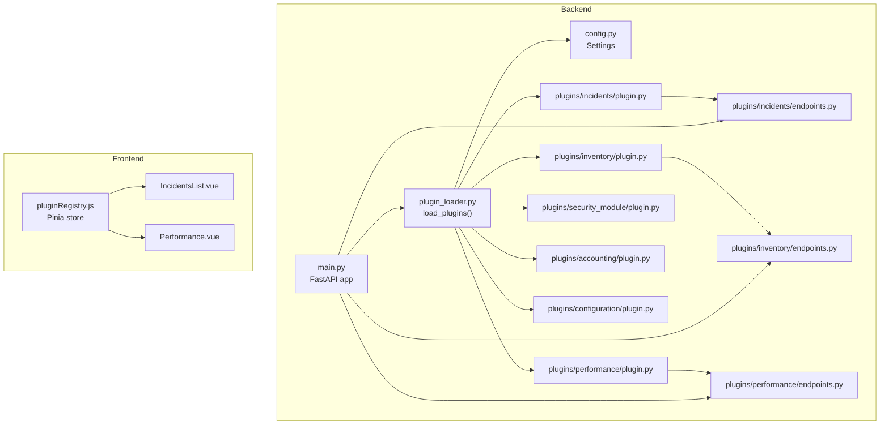
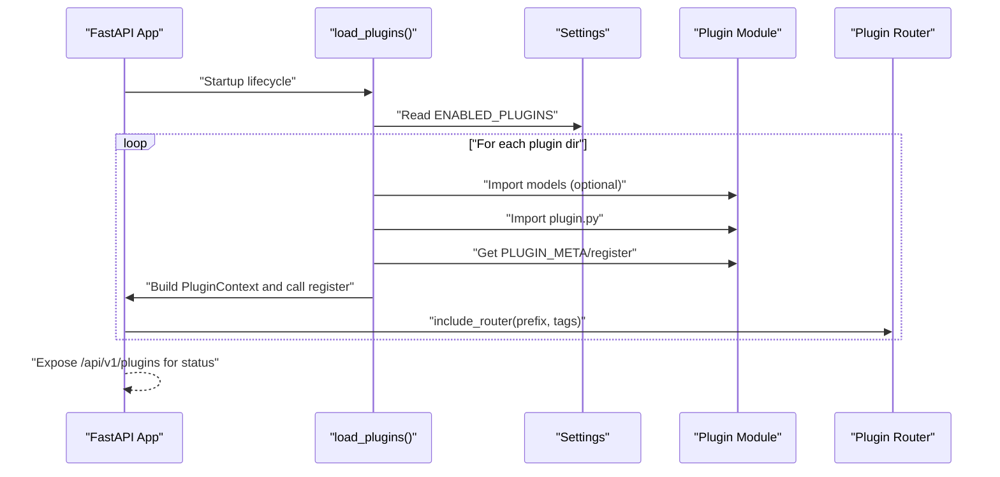
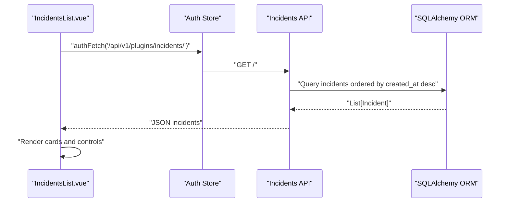
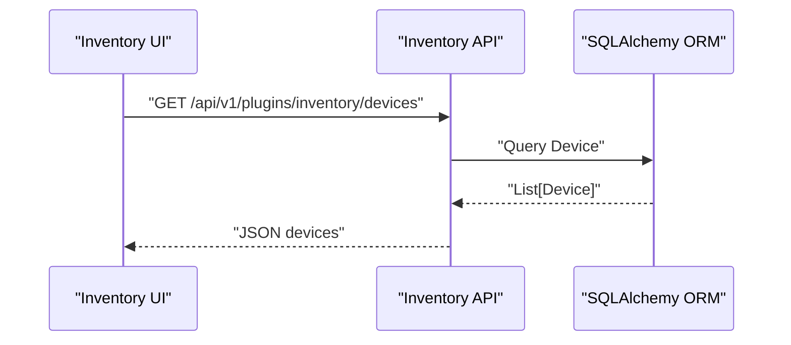
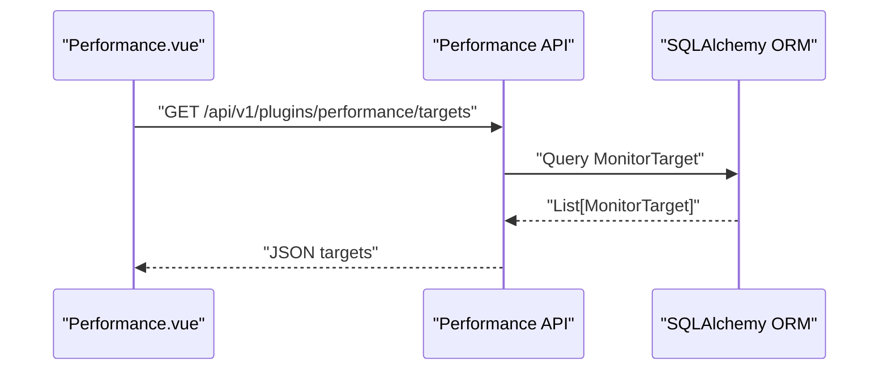
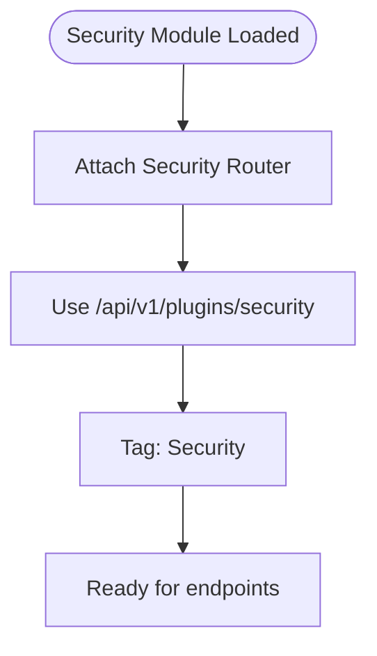
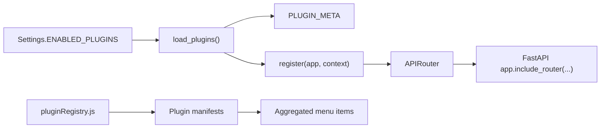

# Built-in Plugins Overview

<cite>
**Referenced Files in This Document**
- [plugin_loader.py](file://backend/app/core/plugin_loader.py)
- [config.py](file://backend/app/core/config.py)
- [main.py](file://backend/app/main.py)
- [plugin.py (Incidents)](file://backend/app/plugins/incidents/plugin.py)
- [endpoints.py (Incidents)](file://backend/app/plugins/incidents/endpoints.py)
- [plugin.py (Inventory)](file://backend/app/plugins/inventory/plugin.py)
- [endpoints.py (Inventory)](file://backend/app/plugins/inventory/endpoints.py)
- [plugin.py (Performance)](file://backend/app/plugins/performance/plugin.py)
- [endpoints.py (Performance)](file://backend/app/plugins/performance/endpoints.py)
- [plugin.py (Security Module)](file://backend/app/plugins/security_module/plugin.py)
- [plugin.py (Accounting)](file://backend/app/plugins/accounting/plugin.py)
- [plugin.py (Configuration)](file://backend/app/plugins/configuration/plugin.py)
- [pluginRegistry.js](file://frontend/src/stores/pluginRegistry.js)
- [IncidentsList.vue](file://frontend/src/plugins/incidents/views/IncidentsList.vue)
- [Performance.vue](file://frontend/src/plugins/performance/views/Performance.vue)
</cite>

## Table of Contents
1. [Introduction](#introduction)
2. [Project Structure](#project-structure)
3. [Core Components](#core-components)
4. [Architecture Overview](#architecture-overview)
5. [Detailed Component Analysis](#detailed-component-analysis)
6. [Dependency Analysis](#dependency-analysis)
7. [Performance Considerations](#performance-considerations)
8. [Troubleshooting Guide](#troubleshooting-guide)
9. [Conclusion](#conclusion)
10. [Appendices](#appendices)

## Introduction
This document provides a comprehensive overview of the six built-in plugins that ship with the system: Incidents, Inventory, Performance, Security Module, Accounting, and Configuration. It explains each plugin’s purpose, functionality, and integration within the overall platform, and demonstrates how these plugins illustrate the plugin architecture and serve as examples for developing custom plugins. It also covers plugin selection criteria, enable/disable mechanisms, and configuration options for each built-in plugin.

## Project Structure
The plugin system is implemented in the backend under a dedicated plugins directory. Each plugin exposes a plugin registration module and an API router. The backend loads plugins at startup, constructs per-plugin API prefixes, and registers routers with the main application. The frontend integrates plugin-managed UI views and menus via a plugin registry store.

**Diagram sources**
- [main.py:17-48](file://backend/app/main.py#L17-L48)
- [plugin_loader.py:25-99](file://backend/app/core/plugin_loader.py#L25-L99)
- [config.py:25-26](file://backend/app/core/config.py#L25-L26)
- [plugin.py (Incidents):9-17](file://backend/app/plugins/incidents/plugin.py#L9-L17)
- [plugin.py (Inventory):9-17](file://backend/app/plugins/inventory/plugin.py#L9-L17)
- [plugin.py (Performance):9-17](file://backend/app/plugins/performance/plugin.py#L9-L17)
- [plugin.py (Security Module):9-17](file://backend/app/plugins/security_module/plugin.py#L9-L17)
- [plugin.py (Accounting):9-17](file://backend/app/plugins/accounting/plugin.py#L9-L17)
- [plugin.py (Configuration):9-17](file://backend/app/plugins/configuration/plugin.py#L9-L17)
- [endpoints.py (Incidents):15](file://backend/app/plugins/incidents/endpoints.py#L15)
- [endpoints.py (Inventory):15](file://backend/app/plugins/inventory/endpoints.py#L15)
- [endpoints.py (Performance):11](file://backend/app/plugins/performance/endpoints.py#L11)
- [pluginRegistry.js:1-53](file://frontend/src/stores/pluginRegistry.js#L1-L53)
- [IncidentsList.vue:1-268](file://frontend/src/plugins/incidents/views/IncidentsList.vue#L1-L268)
- [Performance.vue:1-34](file://frontend/src/plugins/performance/views/Performance.vue#L1-L34)

**Section sources**
- [main.py:17-48](file://backend/app/main.py#L17-L48)
- [plugin_loader.py:25-99](file://backend/app/core/plugin_loader.py#L25-L99)
- [config.py:25-26](file://backend/app/core/config.py#L25-L26)

## Core Components
- Plugin loader: Discovers plugin directories, conditionally enables plugins, imports models and plugin modules, constructs a per-plugin API prefix, and registers routers into the main application.
- Plugin registration: Each plugin defines metadata and a register function that includes the plugin’s router with a tag and a plugin-scoped API prefix.
- Configuration: The settings object exposes an environment variable to filter enabled plugins.
- Frontend plugin registry: A Pinia store manages plugin manifests, enabled plugins, and aggregated menu items for rendering.

Key behaviors:
- Discovery: Iterates over the plugins directory, skipping hidden or invalid entries.
- Filtering: Uses a comma-separated list from settings to include only named plugins.
- Registration: Builds a PluginContext with database base, API prefix, and dependency injection helpers, then invokes register.
- API prefixing: Each plugin receives a distinct API prefix derived from its plugin name.

**Section sources**
- [plugin_loader.py:25-99](file://backend/app/core/plugin_loader.py#L25-L99)
- [config.py:25-26](file://backend/app/core/config.py#L25-L26)
- [plugin.py (Incidents):1-17](file://backend/app/plugins/incidents/plugin.py#L1-L17)
- [plugin.py (Inventory):1-17](file://backend/app/plugins/inventory/plugin.py#L1-L17)
- [plugin.py (Performance):1-17](file://backend/app/plugins/performance/plugin.py#L1-L17)
- [plugin.py (Security Module):1-17](file://backend/app/plugins/security_module/plugin.py#L1-L17)
- [plugin.py (Accounting):1-17](file://backend/app/plugins/accounting/plugin.py#L1-L17)
- [plugin.py (Configuration):1-17](file://backend/app/plugins/configuration/plugin.py#L1-L17)
- [pluginRegistry.js:1-53](file://frontend/src/stores/pluginRegistry.js#L1-L53)

## Architecture Overview
The plugin architecture centers on a shared loader and per-plugin modules. At startup, the loader:
- Reads settings to determine enabled plugins.
- Imports each plugin’s models (if present) and plugin module.
- Extracts metadata and register function.
- Constructs a PluginContext and calls register to attach the plugin’s router to the main app.

**Diagram sources**
- [main.py:17-48](file://backend/app/main.py#L17-L48)
- [plugin_loader.py:25-99](file://backend/app/core/plugin_loader.py#L25-L99)
- [config.py:25-26](file://backend/app/core/config.py#L25-L26)
- [plugin.py (Incidents):9-17](file://backend/app/plugins/incidents/plugin.py#L9-L17)
- [plugin.py (Inventory):9-17](file://backend/app/plugins/inventory/plugin.py#L9-L17)
- [plugin.py (Performance):9-17](file://backend/app/plugins/performance/plugin.py#L9-L17)
- [plugin.py (Security Module):9-17](file://backend/app/plugins/security_module/plugin.py#L9-L17)
- [plugin.py (Accounting):9-17](file://backend/app/plugins/accounting/plugin.py#L9-L17)
- [plugin.py (Configuration):9-17](file://backend/app/plugins/configuration/plugin.py#L9-L17)

## Detailed Component Analysis

### Incidents Plugin
Purpose:
- Incident management for creating, tracking, and resolving network incidents.

Functionality:
- Provides endpoints to list, create, retrieve, update, and delete incidents.
- Supports incident comments and enforces role-based access for administrative actions.
- Frontend view displays incidents with severity and status badges and supports status transitions.

Integration:
- Register function attaches the incidents router with a plugin-specific API prefix and tags.
- Frontend fetches data from the incidents API and renders a responsive card-based list.

**Diagram sources**
- [IncidentsList.vue:41-55](file://frontend/src/plugins/incidents/views/IncidentsList.vue#L41-L55)
- [endpoints.py (Incidents):18-25](file://backend/app/plugins/incidents/endpoints.py#L18-L25)
- [plugin.py (Incidents):9-17](file://backend/app/plugins/incidents/plugin.py#L9-L17)

Configuration and selection:
- Enable/disable via settings using the plugin directory name “incidents”.
- API exposed under /api/v1/plugins/incidents.

**Section sources**
- [plugin.py (Incidents):1-17](file://backend/app/plugins/incidents/plugin.py#L1-L17)
- [endpoints.py (Incidents):18-84](file://backend/app/plugins/incidents/endpoints.py#L18-L84)
- [IncidentsList.vue:1-268](file://frontend/src/plugins/incidents/views/IncidentsList.vue#L1-L268)

### Inventory Plugin
Purpose:
- Equipment inventory management covering devices, sites, and device types.

Functionality:
- CRUD endpoints for devices, sites, and device types with role-based permissions.
- Supports listing, creating, retrieving, updating, and deleting resources.

Integration:
- Register function attaches the inventory router with a plugin-specific API prefix and tags.

**Diagram sources**
- [endpoints.py (Inventory):20-83](file://backend/app/plugins/inventory/endpoints.py#L20-L83)
- [plugin.py (Inventory):9-17](file://backend/app/plugins/inventory/plugin.py#L9-L17)

Configuration and selection:
- Enable/disable via settings using the plugin directory name “inventory”.

**Section sources**
- [plugin.py (Inventory):1-17](file://backend/app/plugins/inventory/plugin.py#L1-L17)
- [endpoints.py (Inventory):18-130](file://backend/app/plugins/inventory/endpoints.py#L18-L130)

### Performance Plugin
Purpose:
- Network performance monitoring with monitor targets and metric samples.

Functionality:
- CRUD endpoints for monitor targets and retrieval of metric samples for a given target.
- Supports listing, creating, retrieving, and deleting monitor targets; fetching recent metrics.

Integration:
- Register function attaches the performance router with a plugin-specific API prefix and tags.

**Diagram sources**
- [endpoints.py (Performance):14-58](file://backend/app/plugins/performance/endpoints.py#L14-L58)
- [plugin.py (Performance):9-17](file://backend/app/plugins/performance/plugin.py#L9-L17)
- [Performance.vue:1-34](file://frontend/src/plugins/performance/views/Performance.vue#L1-L34)

Configuration and selection:
- Enable/disable via settings using the plugin directory name “performance”.

**Section sources**
- [plugin.py (Performance):1-17](file://backend/app/plugins/performance/plugin.py#L1-L17)
- [endpoints.py (Performance):11-75](file://backend/app/plugins/performance/endpoints.py#L11-L75)

### Security Module Plugin
Purpose:
- Security module for audit logs, security events, and access monitoring.

Functionality:
- Exposes a plugin registration with a dedicated router and API prefix.
- Frontend view indicates future feature availability.

Integration:
- Register function attaches the security router with a plugin-specific API prefix and tags.

**Diagram sources**
- [plugin.py (Security Module):9-17](file://backend/app/plugins/security_module/plugin.py#L9-L17)

Configuration and selection:
- Enable/disable via settings using the plugin directory name “security”.

**Section sources**
- [plugin.py (Security Module):1-17](file://backend/app/plugins/security_module/plugin.py#L1-L17)

### Accounting Plugin
Purpose:
- Traffic accounting for interfaces, traffic records, and bandwidth usage.

Functionality:
- Exposes a plugin registration with a dedicated router and API prefix.

Integration:
- Register function attaches the accounting router with a plugin-specific API prefix and tags.

Configuration and selection:
- Enable/disable via settings using the plugin directory name “accounting”.

**Section sources**
- [plugin.py (Accounting):1-17](file://backend/app/plugins/accounting/plugin.py#L1-L17)

### Configuration Plugin
Purpose:
- Configuration management including snapshots, templates, and change tracking.

Functionality:
- Exposes a plugin registration with a dedicated router and API prefix.

Integration:
- Register function attaches the configuration router with a plugin-specific API prefix and tags.

Configuration and selection:
- Enable/disable via settings using the plugin directory name “configuration”.

**Section sources**
- [plugin.py (Configuration):1-17](file://backend/app/plugins/configuration/plugin.py#L1-L17)

## Dependency Analysis
The plugin system exhibits low coupling and high cohesion:
- Backend loader depends on settings and dynamically imports plugin modules.
- Each plugin module depends only on the loader’s PluginContext and FastAPI router.
- Frontend registry depends on plugin manifests and aggregates menu items.

**Diagram sources**
- [config.py:25-26](file://backend/app/core/config.py#L25-L26)
- [plugin_loader.py:25-99](file://backend/app/core/plugin_loader.py#L25-L99)
- [plugin.py (Incidents):1-17](file://backend/app/plugins/incidents/plugin.py#L1-L17)
- [pluginRegistry.js:1-53](file://frontend/src/stores/pluginRegistry.js#L1-L53)

**Section sources**
- [plugin_loader.py:25-99](file://backend/app/core/plugin_loader.py#L25-L99)
- [config.py:25-26](file://backend/app/core/config.py#L25-L26)
- [pluginRegistry.js:1-53](file://frontend/src/stores/pluginRegistry.js#L1-L53)

## Performance Considerations
- Plugin discovery iterates over the plugins directory; keep the number of plugins reasonable for large deployments.
- Per-plugin API prefixing avoids naming conflicts but increases routing surface; ensure efficient router organization.
- Role-based endpoints (admin vs active user) reduce unnecessary processing for non-admin operations.
- Consider pagination and filtering in endpoints to minimize payload sizes for large datasets.

## Troubleshooting Guide
Common issues and resolutions:
- Plugin not loaded:
  - Verify the plugin directory contains a plugin.py with PLUGIN_META and register.
  - Confirm the plugin name is included in the ENABLED_PLUGINS setting.
- API route not visible:
  - Ensure the register function includes the router with the correct prefix and tags.
  - Check that models are imported before registering routers to ensure database tables are created.
- Frontend menu missing:
  - Ensure the plugin manifest is registered in the frontend plugin registry store.
  - Confirm the manifest’s enabled flag and menu items are properly set.

Operational checks:
- Startup logs indicate plugin load status and any errors encountered during import.
- The /api/v1/plugins endpoint returns the list of loaded plugins with status.

**Section sources**
- [plugin_loader.py:25-99](file://backend/app/core/plugin_loader.py#L25-L99)
- [main.py:84-87](file://backend/app/main.py#L84-L87)
- [pluginRegistry.js:26-36](file://frontend/src/stores/pluginRegistry.js#L26-L36)

## Conclusion
The six built-in plugins showcase a clean, extensible plugin architecture. They demonstrate consistent patterns for metadata definition, registration, API prefixing, and role-aware endpoints. Their integration with the loader and frontend registry provides a practical blueprint for building custom plugins. Administrators can selectively enable or disable plugins via configuration, while developers can extend the system by adding new plugin directories following the established conventions.

## Appendices

### Plugin Selection Criteria and Enable/Disable Mechanism
- Selection criteria:
  - Presence of a plugin.py with PLUGIN_META and register.
  - Directory name matches an entry in ENABLED_PLUGINS (comma-separated).
- Enable/disable:
  - Set ENABLED_PLUGINS to a comma-separated list of plugin directory names.
  - Omitting the setting loads all discovered plugins.

**Section sources**
- [config.py:25-26](file://backend/app/core/config.py#L25-L26)
- [plugin_loader.py:33-48](file://backend/app/core/plugin_loader.py#L33-L48)

### Configuration Options for Built-in Plugins
- Global:
  - ENABLED_PLUGINS: Comma-separated list of plugin names to load.
- Plugin-specific:
  - Each plugin’s API prefix is automatically constructed as /api/v1/plugins/{plugin_name}.
  - Tags are applied per plugin for API documentation grouping.

**Section sources**
- [config.py:25-26](file://backend/app/core/config.py#L25-L26)
- [plugin_loader.py:70-76](file://backend/app/core/plugin_loader.py#L70-L76)
- [plugin.py (Incidents):12-16](file://backend/app/plugins/incidents/plugin.py#L12-L16)
- [plugin.py (Inventory):12-16](file://backend/app/plugins/inventory/plugin.py#L12-L16)
- [plugin.py (Performance):12-16](file://backend/app/plugins/performance/plugin.py#L12-L16)
- [plugin.py (Security Module):12-16](file://backend/app/plugins/security_module/plugin.py#L12-L16)
- [plugin.py (Accounting):12-16](file://backend/app/plugins/accounting/plugin.py#L12-L16)
- [plugin.py (Configuration):12-16](file://backend/app/plugins/configuration/plugin.py#L12-L16)