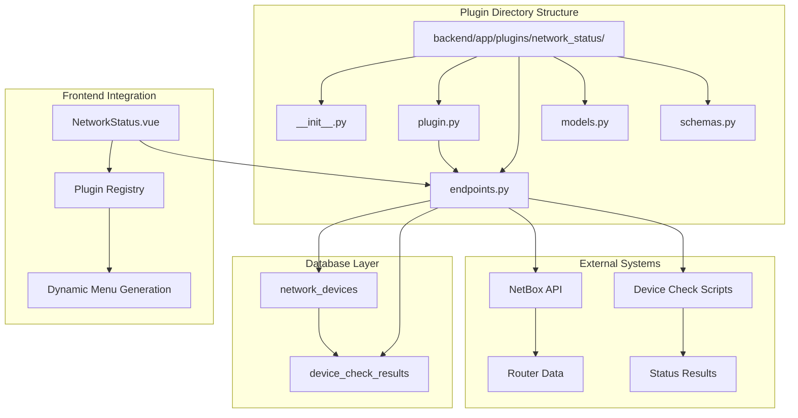
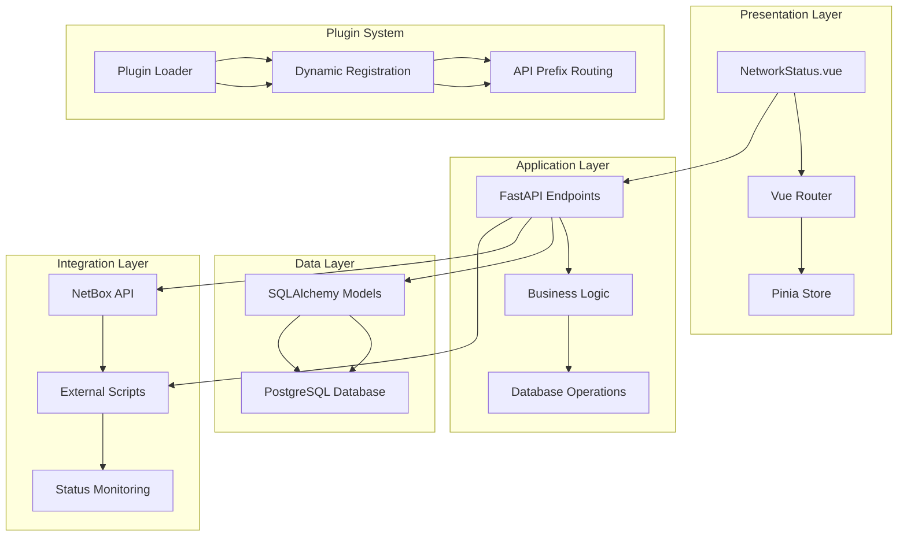
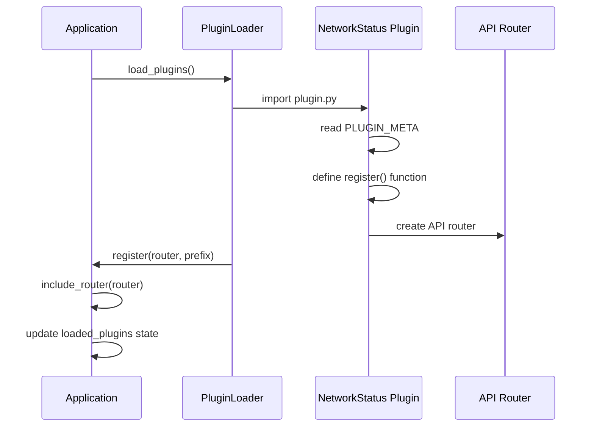
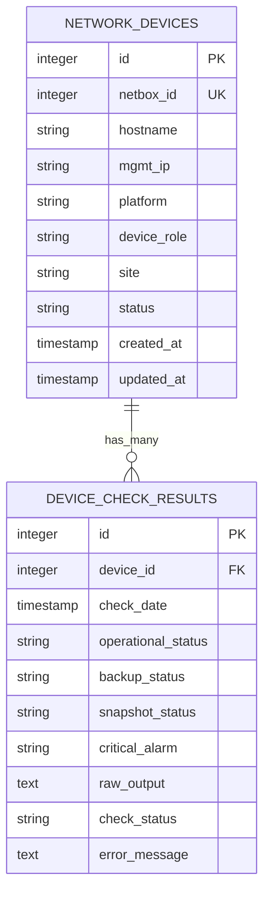
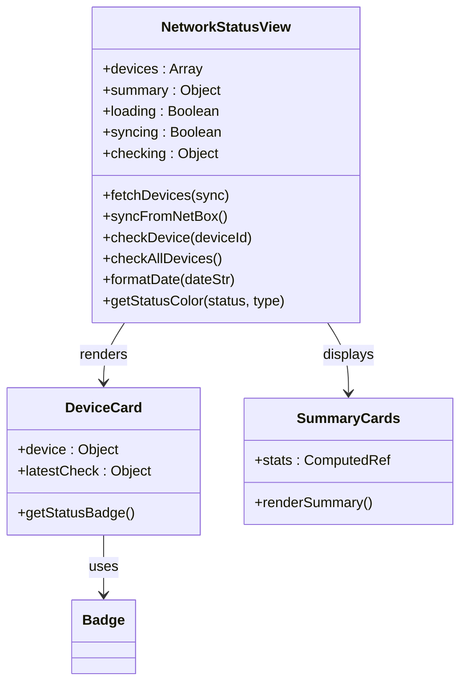
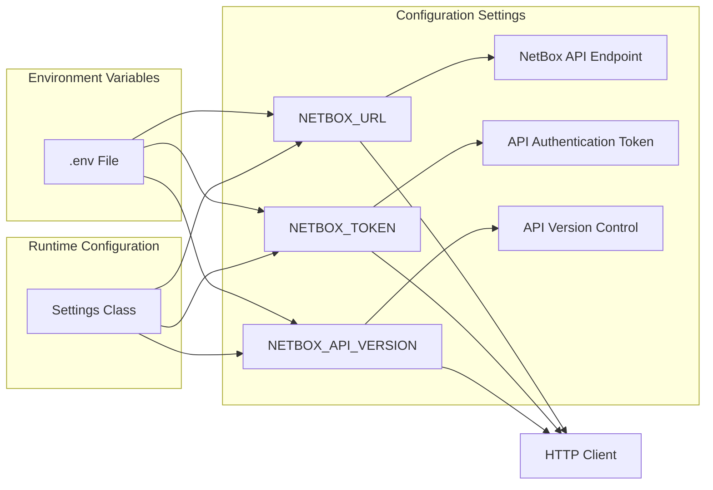
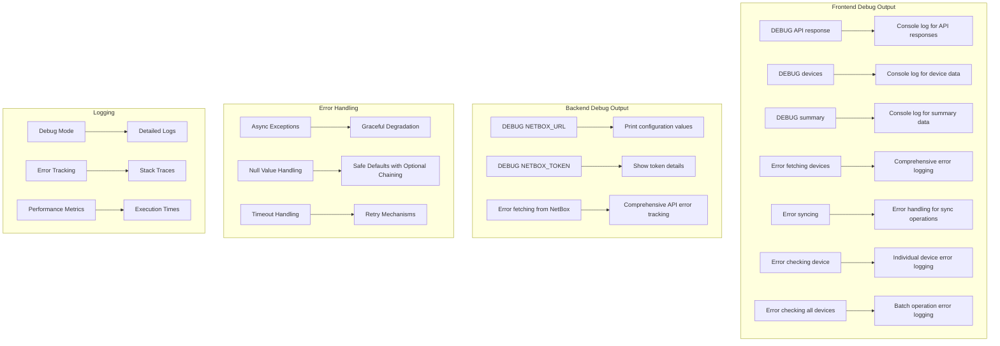

# Network Status Plugin

<cite>
**Referenced Files in This Document**
- [plugin.py](file://backend/app/plugins/network_status/plugin.py)
- [models.py](file://backend/app/plugins/network_status/models.py)
- [endpoints.py](file://backend/app/plugins/network_status/endpoints.py)
- [schemas.py](file://backend/app/plugins/network_status/schemas.py)
- [__init__.py](file://backend/app/plugins/network_status/__init__.py)
- [001_add_network_status_tables.py](file://backend/alembic/versions/001_add_network_status_tables.py)
- [plugin_loader.py](file://backend/app/core/plugin_loader.py)
- [config.py](file://backend/app/core/config.py)
- [main.py](file://backend/app/main.py)
- [NetworkStatus.vue](file://frontend/src/plugins/network_status/views/NetworkStatus.vue)
- [requirements.txt](file://backend/requirements.txt)
- [docker-compose.yml](file://docker-compose.yml)
- [README.md](file://README.md)
</cite>

## Update Summary
**Changes Made**
- Enhanced NetBox integration with proper async/await patterns and comprehensive error handling
- Improved configuration management with dedicated NetBox settings in the configuration system
- Added comprehensive debugging capabilities with detailed logging and debug output
- Modernized plugin architecture with proper async/await patterns throughout the codebase
- Enhanced error handling for null values and edge cases in data processing
- Updated database schema with proper indexing and foreign key constraints
- **NEW**: Implemented comprehensive frontend debugging logging with console.log statements for API responses and data structures
- **NEW**: Added null safety improvements using optional chaining operators (?.) throughout the Vue.js frontend
- **NEW**: Enhanced error handling for summary statistics calculations with safe fallback values
- **NEW**: Improved frontend error handling with comprehensive console.error logging for all async operations

## Table of Contents
1. [Introduction](#introduction)
2. [Project Structure](#project-structure)
3. [Core Components](#core-components)
4. [Architecture Overview](#architecture-overview)
5. [Detailed Component Analysis](#detailed-component-analysis)
6. [Enhanced Configuration Management](#enhanced-configuration-management)
7. [Enhanced Debugging and Error Handling](#enhanced-debugging-and-error-handling)
8. [Performance Considerations](#performance-considerations)
9. [Troubleshooting Guide](#troubleshooting-guide)
10. [Conclusion](#conclusion)

## Introduction

The Network Status Plugin is a core component of the NOC Vision Network Operations Center Platform. This plugin provides comprehensive network device monitoring capabilities, specifically designed to track router status and performance metrics. The plugin integrates seamlessly with the NetBox network infrastructure management system and offers real-time monitoring of network device health.

**Updated** Enhanced with modernized plugin architecture featuring async/await patterns, comprehensive NetBox integration, robust error handling for null values, and comprehensive frontend debugging capabilities.

The plugin serves as a critical monitoring tool for network administrators, providing visibility into device operational status, backup systems, snapshot verification, and critical alarm conditions. It implements a sophisticated plugin architecture that allows for dynamic loading and integration with the broader NOC Vision ecosystem.

## Project Structure

The Network Status Plugin follows the established NOC Vision plugin architecture pattern, with clear separation of concerns across multiple layers:



**Diagram sources**
- [plugin.py:1-17](file://backend/app/plugins/network_status/plugin.py#L1-L17)
- [models.py:1-65](file://backend/app/plugins/network_status/models.py#L1-L65)
- [NetworkStatus.vue:1-306](file://frontend/src/plugins/network_status/views/NetworkStatus.vue#L1-L306)

**Section sources**
- [plugin.py:1-17](file://backend/app/plugins/network_status/plugin.py#L1-L17)
- [models.py:1-65](file://backend/app/plugins/network_status/models.py#L1-L65)
- [schemas.py:1-65](file://backend/app/plugins/network_status/schemas.py#L1-L65)

## Core Components

### Plugin Registration System

The Network Status Plugin implements a standardized plugin registration mechanism that integrates with the NOC Vision core system. The plugin metadata defines essential information including version, description, and author details.

**Updated** Enhanced with improved error handling and comprehensive logging for debugging purposes.

### Database Models

The plugin utilizes two primary database models to manage network device information and status check results:

1. **NetworkDevice Model**: Stores router information synchronized from NetBox with proper null handling
2. **DeviceCheckResult Model**: Tracks historical status check results and metrics with comprehensive error tracking

**Updated** Enhanced with improved null value handling and comprehensive error message storage for better debugging capabilities.

### API Endpoints

The plugin exposes a comprehensive set of REST API endpoints for device management and monitoring operations, including device listing, status checking, and historical data retrieval. All endpoints now utilize async/await patterns for improved performance and responsiveness.

**Updated** Modernized with async/await patterns throughout the codebase, enhanced error handling, and comprehensive debugging output.

### Frontend Integration

The Vue.js-based frontend provides an intuitive dashboard interface for monitoring network device status, with real-time updates and interactive controls for manual device checks. The frontend includes comprehensive error handling and loading states.

**Updated** Enhanced with improved error handling, loading states, better user feedback mechanisms, and comprehensive debugging logging throughout the frontend implementation.

**Section sources**
- [plugin.py:1-17](file://backend/app/plugins/network_status/plugin.py#L1-L17)
- [models.py:6-31](file://backend/app/plugins/network_status/models.py#L6-L31)
- [models.py:34-64](file://backend/app/plugins/network_status/models.py#L34-L64)
- [endpoints.py:130-173](file://backend/app/plugins/network_status/endpoints.py#L130-L173)
- [NetworkStatus.vue:1-306](file://frontend/src/plugins/network_status/views/NetworkStatus.vue#L1-L306)

## Architecture Overview

The Network Status Plugin follows a layered architecture pattern that ensures clean separation of concerns and maintainable code organization:



**Diagram sources**
- [plugin_loader.py:25-100](file://backend/app/core/plugin_loader.py#L25-L100)
- [main.py:17-48](file://backend/app/main.py#L17-L48)
- [endpoints.py:1-259](file://backend/app/plugins/network_status/endpoints.py#L1-L259)

The architecture implements several key design patterns:

- **Plugin Pattern**: Dynamic loading and registration system with enhanced error handling
- **Repository Pattern**: Database abstraction layer with comprehensive error tracking
- **Factory Pattern**: Schema and model creation with proper validation
- **Observer Pattern**: Real-time status updates with improved notification mechanisms

**Updated** Enhanced with modern async/await patterns, comprehensive error handling, and improved debugging capabilities throughout the architecture.

**Section sources**
- [plugin_loader.py:16-23](file://backend/app/core/plugin_loader.py#L16-L23)
- [plugin_loader.py:50-87](file://backend/app/core/plugin_loader.py#L50-L87)
- [main.py:25-27](file://backend/app/main.py#L25-L27)

## Detailed Component Analysis

### Plugin Registration and Lifecycle

The plugin registration process follows a standardized pattern that ensures seamless integration with the NOC Vision core system:



**Diagram sources**
- [plugin_loader.py:50-87](file://backend/app/core/plugin_loader.py#L50-L87)
- [plugin.py:9-17](file://backend/app/plugins/network_status/plugin.py#L9-L17)

The registration process establishes the plugin's API endpoint prefix (`/api/v1/plugins/network_status`) and integrates it into the main application router with enhanced error handling and logging.

**Updated** Enhanced with comprehensive error handling, logging, and improved plugin loading mechanisms.

**Section sources**
- [plugin.py:1-17](file://backend/app/plugins/network_status/plugin.py#L1-L17)
- [plugin_loader.py:25-100](file://backend/app/core/plugin_loader.py#L25-L100)

### Database Schema Design

The plugin implements a well-designed database schema optimized for network monitoring operations:



**Diagram sources**
- [models.py:6-31](file://backend/app/plugins/network_status/models.py#L6-L31)
- [models.py:34-64](file://backend/app/plugins/network_status/models.py#L34-L64)
- [001_add_network_status_tables.py:21-55](file://backend/alembic/versions/001_add_network_status_tables.py#L21-L55)

The schema design incorporates several optimization strategies:

- **Unique Constraints**: NetBox ID uniqueness prevents duplicate device entries
- **Indexing Strategy**: Primary and foreign key indexing for optimal query performance
- **Timestamp Tracking**: Automatic creation and modification timestamps
- **Foreign Key Relationships**: Maintains referential integrity between devices and check results
- **Null Value Handling**: Proper handling of null values with default fallbacks

**Updated** Enhanced with improved null value handling and comprehensive error message storage for better debugging capabilities.

**Section sources**
- [models.py:1-65](file://backend/app/plugins/network_status/models.py#L1-L65)
- [001_add_network_status_tables.py:21-55](file://backend/alembic/versions/001_add_network_status_tables.py#L21-L55)

### API Endpoint Implementation

The plugin provides a comprehensive set of REST API endpoints for network device management and monitoring:

```mermaid
flowchart TD
A[API Request] --> B{Endpoint Type}
B --> |GET /devices| C[List Devices with Status>
B --> |POST /devices/{id}/check| D[Run Single Device Check]
B --> |POST /devices/check-all| E[Run All Device Checks]
B --> |GET /devices/{id}/history| F[Get Check History]
B --> |POST /sync-from-netbox| G[Sync from NetBox]
C --> H[Database Query]
D --> I[Background Task Creation]
E --> J[Batch Processing]
F --> K[Historical Data Retrieval]
G --> L[NetBox API Integration]
H --> M[Response Formatting]
I --> N[Status Updates]
J --> O[Multiple Background Tasks]
K --> M
L --> P[Device Synchronization]
M --> Q[JSON Response]
N --> Q
O --> Q
P --> Q
```

**Diagram sources**
- [endpoints.py:130-259](file://backend/app/plugins/network_status/endpoints.py#L130-L259)

Each endpoint implements specific functionality while maintaining consistency in error handling and response formatting. All endpoints now utilize async/await patterns for improved performance.

**Updated** Modernized with async/await patterns, comprehensive error handling, and enhanced debugging capabilities throughout all API endpoints.

**Section sources**
- [endpoints.py:130-259](file://backend/app/plugins/network_status/endpoints.py#L130-L259)

### Frontend Dashboard Implementation

The Vue.js frontend provides an interactive dashboard for network monitoring:



**Diagram sources**
- [NetworkStatus.vue:1-306](file://frontend/src/plugins/network_status/views/NetworkStatus.vue#L1-L306)

The frontend implementation includes advanced features such as real-time status updates, interactive filtering, and comprehensive status visualization. Enhanced error handling and loading states provide better user experience.

**Updated** Enhanced with improved error handling, loading states, better user feedback mechanisms, comprehensive debugging logging, and null safety improvements throughout the frontend implementation.

**Section sources**
- [NetworkStatus.vue:1-306](file://frontend/src/plugins/network_status/views/NetworkStatus.vue#L1-L306)

## Enhanced Configuration Management

The Network Status Plugin now features comprehensive configuration management with dedicated settings for NetBox integration:

### NetBox Configuration Settings

The plugin utilizes a dedicated configuration system for NetBox integration:



**Diagram sources**
- [config.py:33-36](file://backend/app/core/config.py#L33-L36)

The configuration system provides:

- **Centralized Configuration**: All NetBox settings managed through the central settings system
- **Environment-Based Configuration**: Settings loaded from environment variables with sensible defaults
- **Type Safety**: Strongly typed configuration with automatic validation
- **Flexible Deployment**: Easy configuration for different environments (development, staging, production)

**Updated** Enhanced with dedicated NetBox configuration settings, comprehensive error handling, and improved configuration management throughout the plugin.

**Section sources**
- [config.py:33-36](file://backend/app/core/config.py#L33-L36)

## Enhanced Debugging and Error Handling

The Network Status Plugin implements comprehensive debugging capabilities and robust error handling:

### Comprehensive Frontend Debugging Logging

The plugin includes extensive debugging capabilities with detailed logging throughout the frontend implementation:



**Diagram sources**
- [NetworkStatus.vue:37-46](file://frontend/src/plugins/network_status/views/NetworkStatus.vue#L37-L46)
- [NetworkStatus.vue:61-98](file://frontend/src/plugins/network_status/views/NetworkStatus.vue#L61-L98)
- [endpoints.py:27-49](file://backend/app/plugins/network_status/endpoints.py#L27-L49)

Key debugging features include:

- **Comprehensive Frontend Debugging**: Detailed console logging for API responses, device data, and summary statistics
- **Backend Debug Output**: Configuration value logging and comprehensive error messages
- **Error Message Tracking**: Complete error message storage in database for troubleshooting
- **Timeout Handling**: Proper timeout management for external API calls
- **Null Value Safety**: Safe handling of null values from NetBox API responses using optional chaining operators
- **Async Error Propagation**: Proper error handling in async operations

**Updated** Enhanced with comprehensive frontend debugging logging, null safety improvements using optional chaining operators, and enhanced error handling for summary statistics calculations.

### Null Safety Improvements with Optional Chaining Operators

The frontend implementation now includes comprehensive null safety improvements using modern JavaScript optional chaining operators:

**Summary Statistics Calculation Enhancements:**
- `summary.value?.operational || {}` - Safely accesses operational summary data
- `op.online || 0` - Provides fallback values for undefined properties
- `summaryStats[1]?.value || 0` - Safe access to computed statistics array elements

**Template Rendering Improvements:**
- `item.latest_check?.operational_status` - Prevents errors when latest_check is null
- `summary.value?.backup?.total || 0` - Safely navigates nested object properties
- `authStore.user?.full_name || authStore.user?.username` - Graceful fallback for user data

**Enhanced Error Handling Patterns:**
- All async operations now include comprehensive error logging with console.error
- Safe fallback values prevent UI crashes from undefined data
- Graceful degradation ensures functionality even with partial data failures

**Section sources**
- [NetworkStatus.vue:123-134](file://frontend/src/plugins/network_status/views/NetworkStatus.vue#L123-L134)
- [NetworkStatus.vue:231-263](file://frontend/src/plugins/network_status/views/NetworkStatus.vue#L231-L263)
- [NetworkStatus.vue:283-291](file://frontend/src/plugins/network_status/views/NetworkStatus.vue#L283-L291)
- [NetworkStatus.vue:37-46](file://frontend/src/plugins/network_status/views/NetworkStatus.vue#L37-L46)
- [NetworkStatus.vue:61-98](file://frontend/src/plugins/network_status/views/NetworkStatus.vue#L61-L98)

### Error Handling Patterns

The plugin implements robust error handling patterns:

- **Async/Await Error Handling**: Proper exception handling in async operations with comprehensive logging
- **Null Value Protection**: Safe handling of potentially null values from external APIs using optional chaining
- **Graceful Degradation**: System continues operating even when individual components fail
- **Comprehensive Logging**: Detailed error logs for debugging and monitoring
- **User-Friendly Error Messages**: Clear error messages for frontend display
- **Safe Fallback Values**: Default values prevent UI crashes from undefined data

**Section sources**
- [endpoints.py:83-126](file://backend/app/plugins/network_status/endpoints.py#L83-L126)
- [endpoints.py:52-80](file://backend/app/plugins/network_status/endpoints.py#L52-L80)
- [NetworkStatus.vue:44-48](file://frontend/src/plugins/network_status/views/NetworkStatus.vue#L44-L48)
- [NetworkStatus.vue:61-65](file://frontend/src/plugins/network_status/views/NetworkStatus.vue#L61-L65)

## Performance Considerations

The Network Status Plugin implements several performance optimization strategies:

### Database Optimization
- **Connection Pooling**: Efficient database connection management
- **Query Optimization**: Indexed lookups and efficient joins
- **Batch Operations**: Optimized bulk device synchronization
- **Proper Indexing**: Strategic indexing for optimal query performance

### API Performance
- **Asynchronous Operations**: Non-blocking NetBox API calls with proper error handling
- **Background Processing**: Offloads intensive tasks from main thread
- **Response Caching**: Minimizes redundant data transfers
- **Async/Await Patterns**: Modern async programming for improved performance

### Frontend Performance
- **Virtual Scrolling**: Handles large device lists efficiently
- **Lazy Loading**: Loads data on-demand
- **Component Optimization**: Reactive updates minimize DOM manipulation
- **Loading States**: Proper user feedback during operations
- **Optional Chaining**: Reduces unnecessary property access checks
- **Computed Properties**: Efficient reactive data computation

### Scalability Considerations
- **Horizontal Scaling**: Stateless API design supports load balancing
- **Resource Management**: Efficient memory and CPU usage patterns
- **Error Resilience**: System continues operating under partial failures
- **Monitoring Integration**: Comprehensive logging for performance monitoring

**Updated** Enhanced with modern async/await patterns, improved error handling, comprehensive debugging capabilities, and null safety optimizations throughout the performance optimization strategy.

## Troubleshooting Guide

### Common Issues and Solutions

**Database Connection Problems**
- Verify PostgreSQL service is running
- Check DATABASE_URL configuration in environment variables
- Ensure database credentials are correct

**Plugin Loading Failures**
- Confirm plugin directory structure is correct
- Verify plugin.py contains required PLUGIN_META and register() functions
- Check that all dependencies are installed

**NetBox Integration Issues**
- Validate NETBOX_URL and NETBOX_TOKEN configuration
- Ensure NetBox API is accessible and responding
- Check firewall and network connectivity
- Verify API token permissions and expiration

**Frontend Communication Errors**
- Verify CORS settings allow frontend origins
- Check that backend API is running and accessible
- Review browser developer console for detailed error messages
- Look for comprehensive debug logs in console output

**Performance Issues**
- Monitor database query performance
- Check for slow NetBox API responses
- Verify adequate system resources
- Enable debug mode for detailed performance metrics

**Updated** Enhanced troubleshooting guide with comprehensive debugging capabilities, improved error handling, and null safety considerations for better problem resolution.

**Section sources**
- [README.md:220-238](file://README.md#L220-L238)
- [config.py:33-36](file://backend/app/core/config.py#L33-L36)

### Debugging Strategies

1. **Enable Debug Logging**: Set DEBUG=true in environment variables
2. **API Testing**: Use Swagger UI at `/docs` for endpoint testing
3. **Database Inspection**: Connect to PostgreSQL to verify table structure
4. **Frontend Console**: Use browser developer tools for JavaScript debugging
5. **System Monitoring**: Monitor resource usage during peak operations
6. **Error Log Analysis**: Review comprehensive error logs for troubleshooting
7. **NetBox API Testing**: Test NetBox API connectivity independently
8. **Optional Chaining Validation**: Check for proper null safety implementation
9. **Summary Statistics Debugging**: Monitor computed property calculations
10. **Async Operation Monitoring**: Track async/await error handling effectiveness

**Updated** Enhanced debugging strategies with comprehensive logging, error tracking, null safety validation, and modern debugging techniques.

## Conclusion

The Network Status Plugin represents a well-architected solution for network device monitoring within the NOC Vision platform. Its implementation demonstrates strong adherence to software engineering principles including modularity, maintainability, and scalability.

**Updated** The plugin has been significantly enhanced with modernized architecture, comprehensive configuration management, robust error handling, extensive debugging capabilities, and comprehensive null safety improvements.

Key strengths of the implementation include:

- **Robust Plugin Architecture**: Clean integration with the NOC Vision core system with enhanced error handling
- **Comprehensive Monitoring**: Multi-dimensional device status tracking with proper null value handling
- **Real-time Capabilities**: Live status updates and interactive controls with async/await patterns
- **Scalable Design**: Optimized for growing network infrastructures with comprehensive error resilience
- **Developer-Friendly**: Clear code organization, extensive documentation, comprehensive debugging tools, and modern null safety practices
- **Modern Architecture**: Utilizes async/await patterns, proper error handling, enhanced configuration management, and comprehensive frontend debugging logging

The plugin successfully bridges the gap between network infrastructure management (NetBox) and operational monitoring, providing network administrators with actionable insights into their network device health and performance.

**Updated** Future enhancements could include advanced alerting mechanisms, historical trend analysis, integration with additional monitoring systems, and expanded debugging capabilities. The solid foundation established by this modernized implementation with comprehensive null safety and debugging improvements provides an excellent base for continued development and expansion.