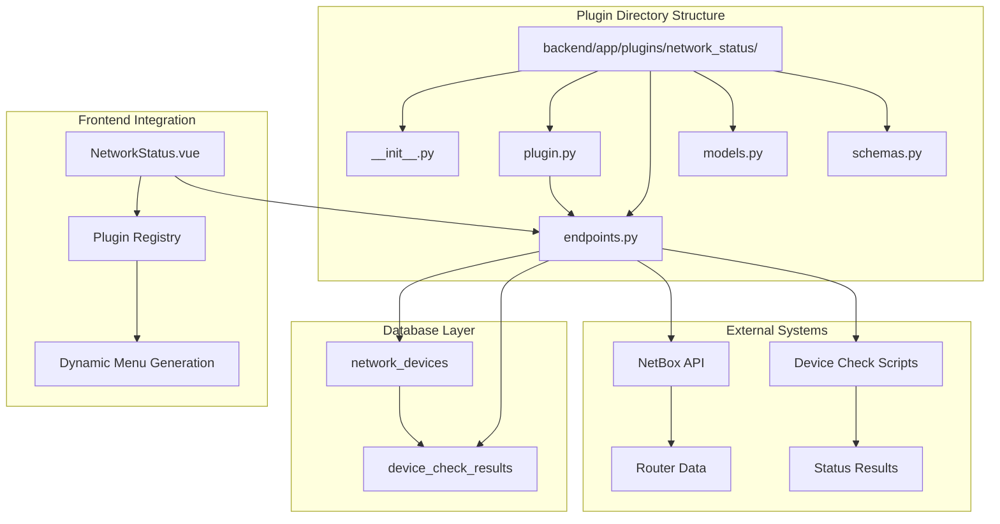
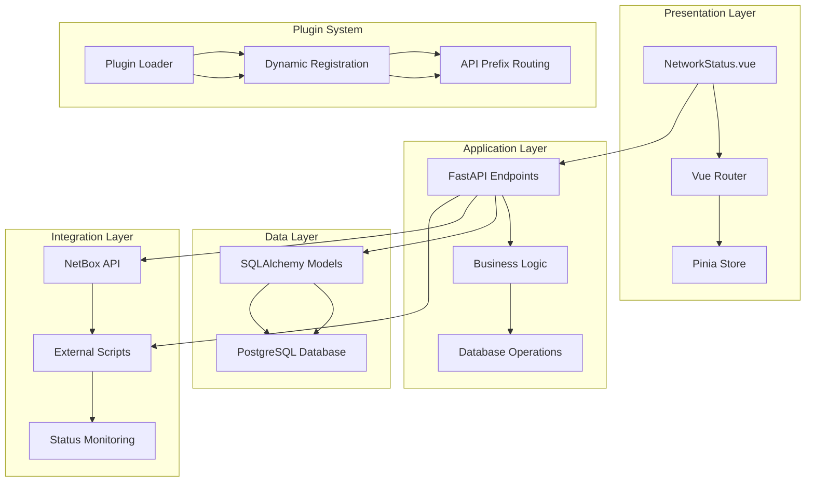
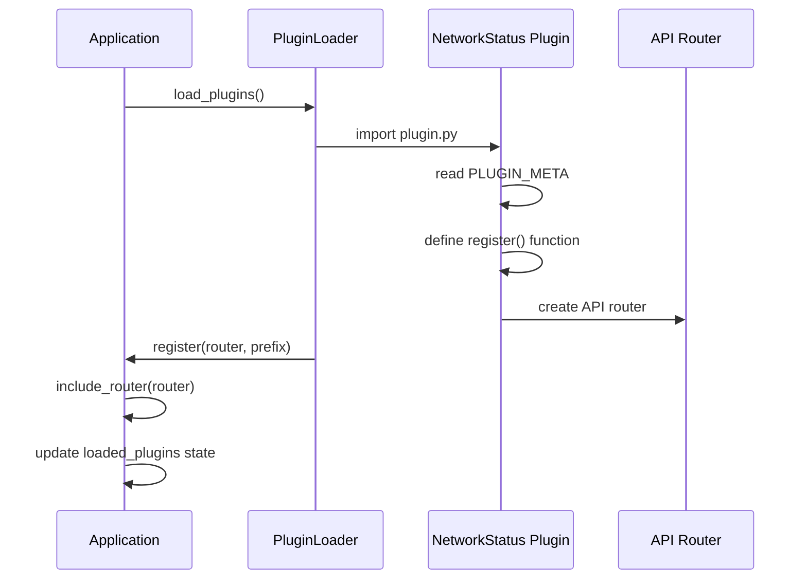
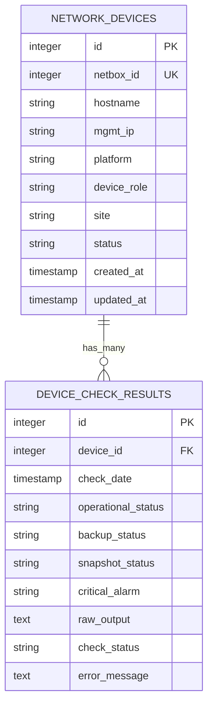
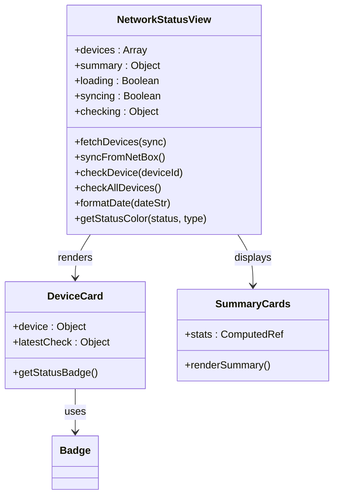
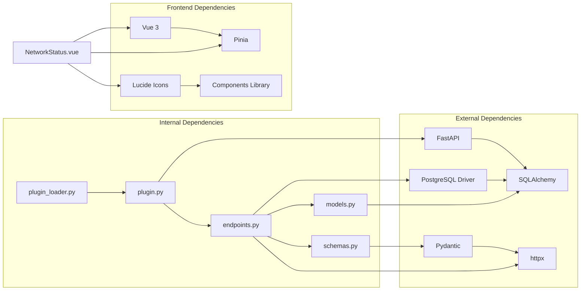

# Network Status Plugin

<cite>
**Referenced Files in This Document**
- [plugin.py](file://backend/app/plugins/network_status/plugin.py)
- [models.py](file://backend/app/plugins/network_status/models.py)
- [endpoints.py](file://backend/app/plugins/network_status/endpoints.py)
- [schemas.py](file://backend/app/plugins/network_status/schemas.py)
- [__init__.py](file://backend/app/plugins/network_status/__init__.py)
- [001_add_network_status_tables.py](file://backend/alembic/versions/001_add_network_status_tables.py)
- [plugin_loader.py](file://backend/app/core/plugin_loader.py)
- [config.py](file://backend/app/core/config.py)
- [main.py](file://backend/app/main.py)
- [NetworkStatus.vue](file://frontend/src/plugins/network_status/views/NetworkStatus.vue)
- [requirements.txt](file://backend/requirements.txt)
- [docker-compose.yml](file://docker-compose.yml)
- [README.md](file://README.md)
</cite>

## Table of Contents
1. [Introduction](#introduction)
2. [Project Structure](#project-structure)
3. [Core Components](#core-components)
4. [Architecture Overview](#architecture-overview)
5. [Detailed Component Analysis](#detailed-component-analysis)
6. [Dependency Analysis](#dependency-analysis)
7. [Performance Considerations](#performance-considerations)
8. [Troubleshooting Guide](#troubleshooting-guide)
9. [Conclusion](#conclusion)

## Introduction

The Network Status Plugin is a core component of the NOC Vision Network Operations Center Platform. This plugin provides comprehensive network device monitoring capabilities, specifically designed to track router status and performance metrics. The plugin integrates seamlessly with the NetBox network infrastructure management system and offers real-time monitoring of network device health.

The plugin serves as a critical monitoring tool for network administrators, providing visibility into device operational status, backup systems, snapshot verification, and critical alarm conditions. It implements a sophisticated plugin architecture that allows for dynamic loading and integration with the broader NOC Vision ecosystem.

## Project Structure

The Network Status Plugin follows the established NOC Vision plugin architecture pattern, with clear separation of concerns across multiple layers:



**Diagram sources**
- [plugin.py:1-17](file://backend/app/plugins/network_status/plugin.py#L1-L17)
- [models.py:1-65](file://backend/app/plugins/network_status/models.py#L1-L65)
- [NetworkStatus.vue:1-303](file://frontend/src/plugins/network_status/views/NetworkStatus.vue#L1-L303)

**Section sources**
- [plugin.py:1-17](file://backend/app/plugins/network_status/plugin.py#L1-L17)
- [models.py:1-65](file://backend/app/plugins/network_status/models.py#L1-L65)
- [schemas.py:1-65](file://backend/app/plugins/network_status/schemas.py#L1-L65)

## Core Components

### Plugin Registration System

The Network Status Plugin implements a standardized plugin registration mechanism that integrates with the NOC Vision core system. The plugin metadata defines essential information including version, description, and author details.

### Database Models

The plugin utilizes two primary database models to manage network device information and status check results:

1. **NetworkDevice Model**: Stores router information synchronized from NetBox
2. **DeviceCheckResult Model**: Tracks historical status check results and metrics

### API Endpoints

The plugin exposes a comprehensive set of REST API endpoints for device management and monitoring operations, including device listing, status checking, and historical data retrieval.

### Frontend Integration

The Vue.js-based frontend provides an intuitive dashboard interface for monitoring network device status, with real-time updates and interactive controls for manual device checks.

**Section sources**
- [plugin.py:1-17](file://backend/app/plugins/network_status/plugin.py#L1-L17)
- [models.py:6-31](file://backend/app/plugins/network_status/models.py#L6-L31)
- [models.py:34-64](file://backend/app/plugins/network_status/models.py#L34-L64)
- [endpoints.py:130-173](file://backend/app/plugins/network_status/endpoints.py#L130-L173)
- [NetworkStatus.vue:1-303](file://frontend/src/plugins/network_status/views/NetworkStatus.vue#L1-L303)

## Architecture Overview

The Network Status Plugin follows a layered architecture pattern that ensures clean separation of concerns and maintainable code organization:



**Diagram sources**
- [plugin_loader.py:25-100](file://backend/app/core/plugin_loader.py#L25-L100)
- [main.py:17-48](file://backend/app/main.py#L17-L48)
- [endpoints.py:1-260](file://backend/app/plugins/network_status/endpoints.py#L1-L260)

The architecture implements several key design patterns:

- **Plugin Pattern**: Dynamic loading and registration system
- **Repository Pattern**: Database abstraction layer
- **Factory Pattern**: Schema and model creation
- **Observer Pattern**: Real-time status updates

**Section sources**
- [plugin_loader.py:16-23](file://backend/app/core/plugin_loader.py#L16-L23)
- [plugin_loader.py:50-87](file://backend/app/core/plugin_loader.py#L50-L87)
- [main.py:25-27](file://backend/app/main.py#L25-L27)

## Detailed Component Analysis

### Plugin Registration and Lifecycle

The plugin registration process follows a standardized pattern that ensures seamless integration with the NOC Vision core system:



**Diagram sources**
- [plugin_loader.py:50-87](file://backend/app/core/plugin_loader.py#L50-L87)
- [plugin.py:9-17](file://backend/app/plugins/network_status/plugin.py#L9-L17)

The registration process establishes the plugin's API endpoint prefix (`/api/v1/plugins/network_status`) and integrates it into the main application router.

**Section sources**
- [plugin.py:1-17](file://backend/app/plugins/network_status/plugin.py#L1-L17)
- [plugin_loader.py:25-100](file://backend/app/core/plugin_loader.py#L25-L100)

### Database Schema Design

The plugin implements a well-designed database schema optimized for network monitoring operations:



**Diagram sources**
- [models.py:6-31](file://backend/app/plugins/network_status/models.py#L6-L31)
- [models.py:34-64](file://backend/app/plugins/network_status/models.py#L34-L64)
- [001_add_network_status_tables.py:21-55](file://backend/alembic/versions/001_add_network_status_tables.py#L21-L55)

The schema design incorporates several optimization strategies:

- **Unique Constraints**: NetBox ID uniqueness prevents duplicate device entries
- **Indexing Strategy**: Primary and foreign key indexing for optimal query performance
- **Timestamp Tracking**: Automatic creation and modification timestamps
- **Foreign Key Relationships**: Maintains referential integrity between devices and check results

**Section sources**
- [models.py:1-65](file://backend/app/plugins/network_status/models.py#L1-L65)
- [001_add_network_status_tables.py:21-55](file://backend/alembic/versions/001_add_network_status_tables.py#L21-L55)

### API Endpoint Implementation

The plugin provides a comprehensive set of REST API endpoints for network device management and monitoring:

```mermaid
flowchart TD
A[API Request] --> B{Endpoint Type}
B --> |GET /devices| C[List Devices with Status>
B --> |POST /devices/{id}/check| D[Run Single Device Check]
B --> |POST /devices/check-all| E[Run All Device Checks]
B --> |GET /devices/{id}/history| F[Get Check History]
B --> |POST /sync-from-netbox| G[Sync from NetBox]
C --> H[Database Query]
D --> I[Background Task Creation]
E --> J[Batch Processing]
F --> K[Historical Data Retrieval]
G --> L[NetBox API Integration]
H --> M[Response Formatting]
I --> N[Status Updates]
J --> O[Multiple Background Tasks]
K --> M
L --> P[Device Synchronization]
M --> Q[JSON Response]
N --> Q
O --> Q
P --> Q
```

**Diagram sources**
- [endpoints.py:130-259](file://backend/app/plugins/network_status/endpoints.py#L130-L259)

Each endpoint implements specific functionality while maintaining consistency in error handling and response formatting.

**Section sources**
- [endpoints.py:130-259](file://backend/app/plugins/network_status/endpoints.py#L130-L259)

### Frontend Dashboard Implementation

The Vue.js frontend provides an interactive dashboard for network monitoring:



**Diagram sources**
- [NetworkStatus.vue:1-303](file://frontend/src/plugins/network_status/views/NetworkStatus.vue#L1-L303)

The frontend implementation includes advanced features such as real-time status updates, interactive filtering, and comprehensive status visualization.

**Section sources**
- [NetworkStatus.vue:1-303](file://frontend/src/plugins/network_status/views/NetworkStatus.vue#L1-L303)

## Dependency Analysis

The Network Status Plugin maintains minimal external dependencies while integrating with the NOC Vision ecosystem:



**Diagram sources**
- [requirements.txt:1-13](file://backend/requirements.txt#L1-L13)
- [plugin_loader.py:1-12](file://backend/app/core/plugin_loader.py#L1-L12)
- [NetworkStatus.vue:1-22](file://frontend/src/plugins/network_status/views/NetworkStatus.vue#L1-L22)

The dependency graph reveals a clean architecture with clear boundaries between internal plugin components and external libraries.

**Section sources**
- [requirements.txt:1-13](file://backend/requirements.txt#L1-L13)
- [plugin_loader.py:1-12](file://backend/app/core/plugin_loader.py#L1-L12)

## Performance Considerations

The Network Status Plugin implements several performance optimization strategies:

### Database Optimization
- **Connection Pooling**: Efficient database connection management
- **Query Optimization**: Indexed lookups and efficient joins
- **Batch Operations**: Optimized bulk device synchronization

### API Performance
- **Asynchronous Operations**: Non-blocking NetBox API calls
- **Background Processing**: Offloads intensive tasks from main thread
- **Response Caching**: Minimizes redundant data transfers

### Frontend Performance
- **Virtual Scrolling**: Handles large device lists efficiently
- **Lazy Loading**: Loads data on-demand
- **Component Optimization**: Reactive updates minimize DOM manipulation

### Scalability Considerations
- **Horizontal Scaling**: Stateless API design supports load balancing
- **Database Indexing**: Strategic indexing for optimal query performance
- **Resource Management**: Efficient memory and CPU usage patterns

## Troubleshooting Guide

### Common Issues and Solutions

**Database Connection Problems**
- Verify PostgreSQL service is running
- Check DATABASE_URL configuration in environment variables
- Ensure database credentials are correct

**Plugin Loading Failures**
- Confirm plugin directory structure is correct
- Verify plugin.py contains required PLUGIN_META and register() functions
- Check that all dependencies are installed

**NetBox Integration Issues**
- Validate NETBOX_URL and NETBOX_TOKEN configuration
- Ensure NetBox API is accessible and responding
- Check firewall and network connectivity

**Frontend Communication Errors**
- Verify CORS settings allow frontend origins
- Check that backend API is running and accessible
- Review browser developer console for detailed error messages

**Performance Issues**
- Monitor database query performance
- Check for slow NetBox API responses
- Verify adequate system resources

**Section sources**
- [README.md:220-238](file://README.md#L220-L238)
- [config.py:33-36](file://backend/app/core/config.py#L33-L36)

### Debugging Strategies

1. **Enable Debug Logging**: Set DEBUG=true in environment variables
2. **API Testing**: Use Swagger UI at `/docs` for endpoint testing
3. **Database Inspection**: Connect to PostgreSQL to verify table structure
4. **Frontend Console**: Use browser developer tools for JavaScript debugging
5. **System Monitoring**: Monitor resource usage during peak operations

## Conclusion

The Network Status Plugin represents a well-architected solution for network device monitoring within the NOC Vision platform. Its implementation demonstrates strong adherence to software engineering principles including modularity, maintainability, and scalability.

Key strengths of the implementation include:

- **Robust Plugin Architecture**: Clean integration with the NOC Vision core system
- **Comprehensive Monitoring**: Multi-dimensional device status tracking
- **Real-time Capabilities**: Live status updates and interactive controls
- **Scalable Design**: Optimized for growing network infrastructures
- **Developer-Friendly**: Clear code organization and extensive documentation

The plugin successfully bridges the gap between network infrastructure management (NetBox) and operational monitoring, providing network administrators with actionable insights into their network device health and performance.

Future enhancements could include advanced alerting mechanisms, historical trend analysis, and integration with additional monitoring systems. The solid foundation established by this implementation provides an excellent base for continued development and expansion.