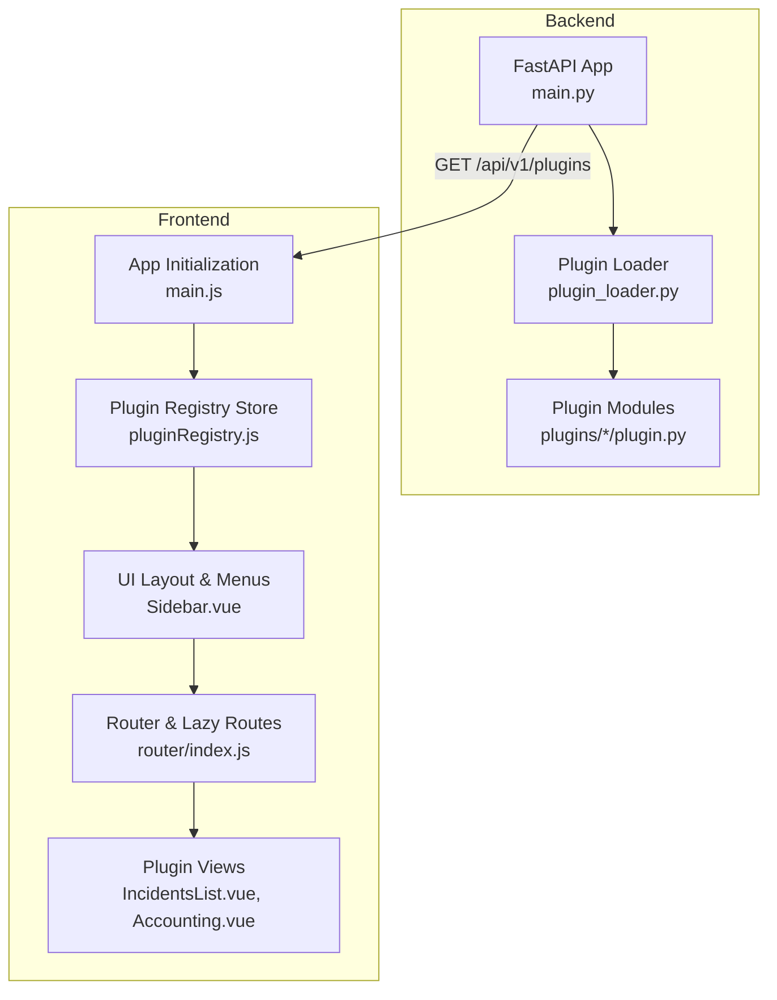
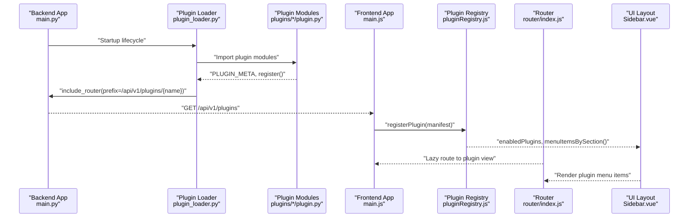
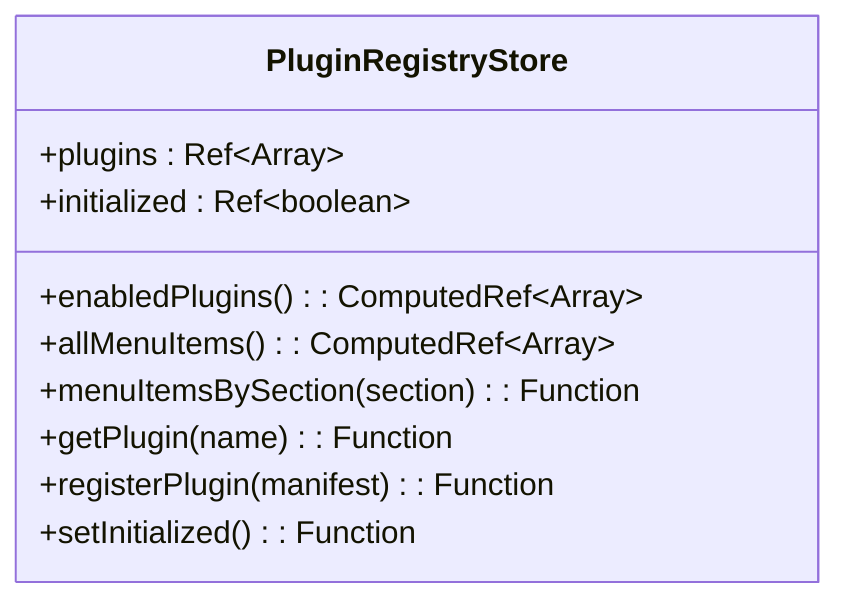
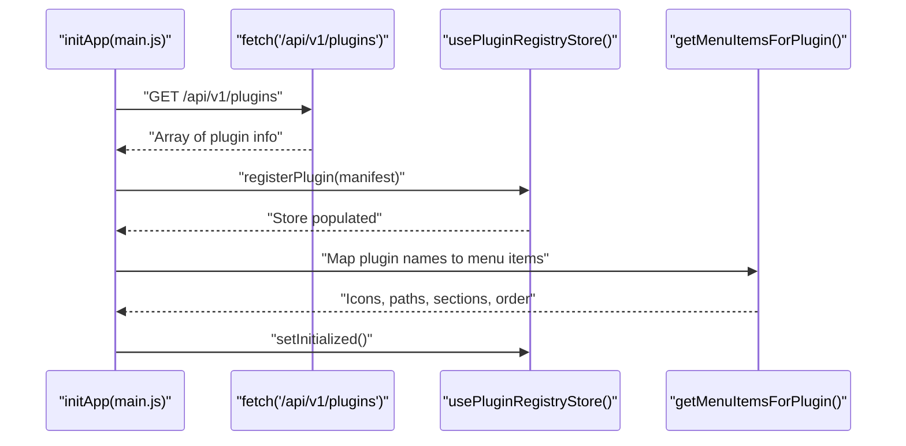
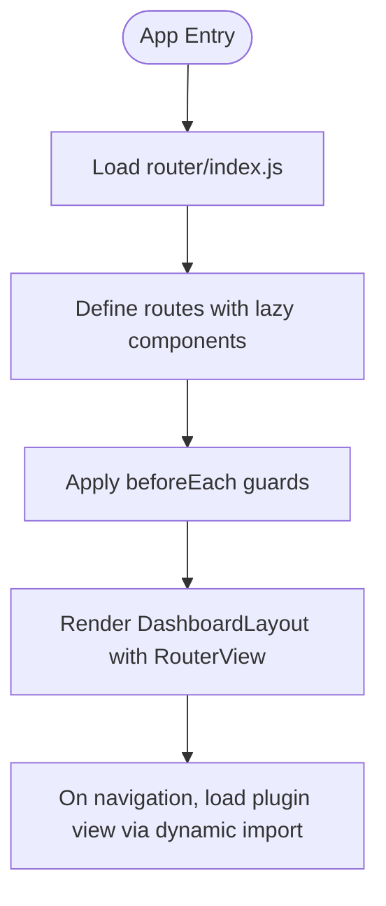
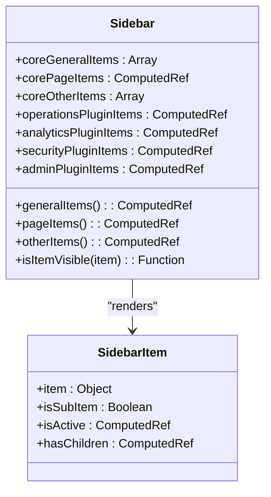
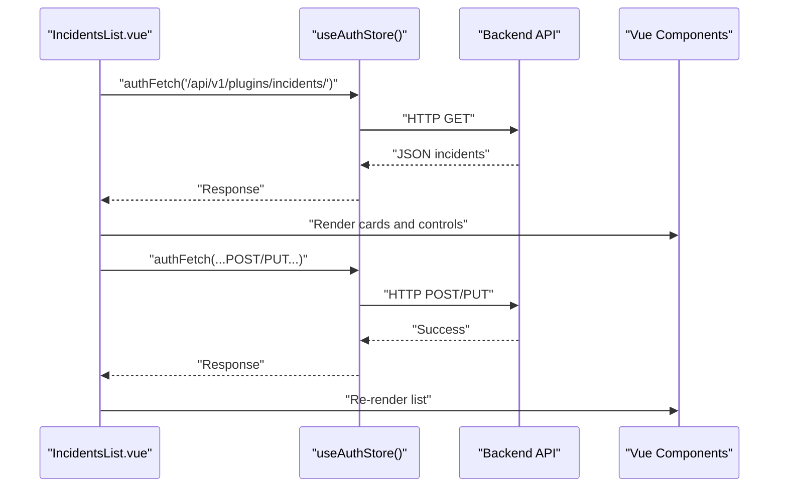
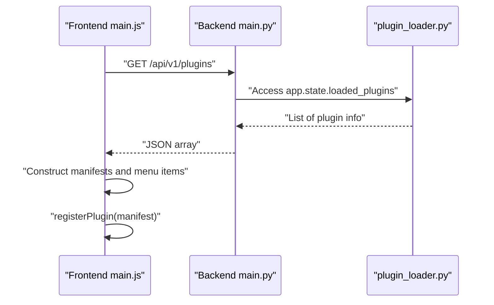
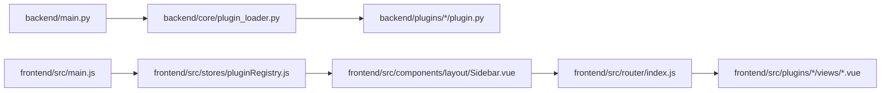

# Frontend Plugin Integration

<cite>
**Referenced Files in This Document**
- [plugin_loader.py](file://backend/app/core/plugin_loader.py)
- [main.py](file://backend/app/main.py)
- [plugin.py (accounting)](file://backend/app/plugins/accounting/plugin.py)
- [plugin.py (configuration)](file://backend/app/plugins/configuration/plugin.py)
- [plugin.py (incidents)](file://backend/app/plugins/incidents/plugin.py)
- [plugin.py (inventory)](file://backend/app/plugins/inventory/plugin.py)
- [plugin.py (performance)](file://backend/app/plugins/performance/plugin.py)
- [plugin.py (security_module)](file://backend/app/plugins/security_module/plugin.py)
- [pluginRegistry.js](file://frontend/src/stores/pluginRegistry.js)
- [main.js](file://frontend/src/main.js)
- [index.js (router)](file://frontend/src/router/index.js)
- [Sidebar.vue](file://frontend/src/components/layout/Sidebar.vue)
- [SidebarItem.vue](file://frontend/src/components/layout/SidebarItem.vue)
- [DashboardLayout.vue](file://frontend/src/layouts/DashboardLayout.vue)
- [IncidentsList.vue](file://frontend/src/plugins/incidents/views/IncidentsList.vue)
- [Accounting.vue](file://frontend/src/plugins/accounting/views/Accounting.vue)
</cite>

## Table of Contents
1. [Introduction](#introduction)
2. [Project Structure](#project-structure)
3. [Core Components](#core-components)
4. [Architecture Overview](#architecture-overview)
5. [Detailed Component Analysis](#detailed-component-analysis)
6. [Dependency Analysis](#dependency-analysis)
7. [Performance Considerations](#performance-considerations)
8. [Troubleshooting Guide](#troubleshooting-guide)
9. [Conclusion](#conclusion)

## Introduction
This document explains how backend-loaded plugins are integrated into the frontend plugin registry, how dynamic components are loaded, and how routes are integrated. It documents the plugin registry store, plugin metadata consumption, and the UI component registration process. It also covers plugin-specific routing, lazy loading strategies, component composition patterns, and the communication between the frontend plugin registry and the backend plugin loader.

## Project Structure
The plugin integration spans two layers:
- Backend: A plugin loader discovers plugin packages, loads their metadata, and registers API routers under plugin-specific prefixes.
- Frontend: A plugin registry store is populated from backend plugin metadata, enabling dynamic UI menus and lazy-loaded routes.

**Diagram sources**
- [main.py:17-87](file://backend/app/main.py#L17-L87)
- [plugin_loader.py:25-99](file://backend/app/core/plugin_loader.py#L25-L99)
- [plugin.py (incidents):1-17](file://backend/app/plugins/incidents/plugin.py#L1-L17)
- [plugin.py (accounting):1-17](file://backend/app/plugins/accounting/plugin.py#L1-L17)
- [plugin.py (inventory):1-17](file://backend/app/plugins/inventory/plugin.py#L1-L17)
- [plugin.py (performance):1-17](file://backend/app/plugins/performance/plugin.py#L1-L17)
- [plugin.py (security_module):1-17](file://backend/app/plugins/security_module/plugin.py#L1-L17)
- [pluginRegistry.js:1-53](file://frontend/src/stores/pluginRegistry.js#L1-L53)
- [main.js:18-132](file://frontend/src/main.js#L18-L132)
- [index.js (router):1-174](file://frontend/src/router/index.js#L1-L174)
- [Sidebar.vue:1-258](file://frontend/src/components/layout/Sidebar.vue#L1-L258)
- [IncidentsList.vue:1-268](file://frontend/src/plugins/incidents/views/IncidentsList.vue#L1-L268)
- [Accounting.vue:1-34](file://frontend/src/plugins/accounting/views/Accounting.vue#L1-L34)

**Section sources**
- [main.py:17-87](file://backend/app/main.py#L17-L87)
- [plugin_loader.py:25-99](file://backend/app/core/plugin_loader.py#L25-L99)
- [pluginRegistry.js:1-53](file://frontend/src/stores/pluginRegistry.js#L1-L53)
- [main.js:18-132](file://frontend/src/main.js#L18-L132)
- [index.js (router):1-174](file://frontend/src/router/index.js#L1-L174)
- [Sidebar.vue:1-258](file://frontend/src/components/layout/Sidebar.vue#L1-L258)

## Core Components
- Backend plugin loader: Discovers plugin directories, imports plugin modules, reads metadata, and registers API routers with plugin-specific prefixes.
- Backend plugin modules: Provide metadata and a registration function to attach routes to the FastAPI app.
- Frontend plugin registry store: Holds plugin manifests, exposes computed menu items, and tracks initialization state.
- Frontend app initialization: Fetches backend plugin list, constructs plugin manifests, and registers them in the store.
- Frontend router: Defines lazy-loaded routes for plugin views and integrates them into the application layout.
- Frontend UI layout: Renders plugin menu items grouped by sections and orders, integrating with the router.

**Section sources**
- [plugin_loader.py:25-99](file://backend/app/core/plugin_loader.py#L25-L99)
- [plugin.py (incidents):1-17](file://backend/app/plugins/incidents/plugin.py#L1-L17)
- [pluginRegistry.js:1-53](file://frontend/src/stores/pluginRegistry.js#L1-L53)
- [main.js:18-132](file://frontend/src/main.js#L18-L132)
- [index.js (router):1-174](file://frontend/src/router/index.js#L1-L174)
- [Sidebar.vue:1-258](file://frontend/src/components/layout/Sidebar.vue#L1-L258)

## Architecture Overview
The integration follows a clear pipeline:
- Backend startup loads plugins and exposes a list endpoint.
- Frontend initializes by fetching the plugin list and registering plugin manifests.
- Frontend router lazily loads plugin views and renders them within the dashboard layout.
- Frontend UI composes plugin menu items from the registry into categorized sections.

**Diagram sources**
- [main.py:17-87](file://backend/app/main.py#L17-L87)
- [plugin_loader.py:25-99](file://backend/app/core/plugin_loader.py#L25-L99)
- [plugin.py (incidents):1-17](file://backend/app/plugins/incidents/plugin.py#L1-L17)
- [plugin.py (accounting):1-17](file://backend/app/plugins/accounting/plugin.py#L1-L17)
- [plugin.py (inventory):1-17](file://backend/app/plugins/inventory/plugin.py#L1-L17)
- [plugin.py (performance):1-17](file://backend/app/plugins/performance/plugin.py#L1-L17)
- [plugin.py (security_module):1-17](file://backend/app/plugins/security_module/plugin.py#L1-L17)
- [main.js:18-132](file://frontend/src/main.js#L18-L132)
- [pluginRegistry.js:1-53](file://frontend/src/stores/pluginRegistry.js#L1-L53)
- [index.js (router):1-174](file://frontend/src/router/index.js#L1-L174)
- [Sidebar.vue:1-258](file://frontend/src/components/layout/Sidebar.vue#L1-L258)

## Detailed Component Analysis

### Backend Plugin Loader and Registration
- Discovery: Iterates plugin directories, filters by enabled list, and imports plugin modules.
- Metadata and registration: Reads PLUGIN_META and invokes register(app, context) to attach routers with a plugin-specific prefix.
- API prefix: Uses a structured prefix derived from plugin name to avoid conflicts.
- Error handling: Logs failures and records plugin status.

**Diagram sources**
- [plugin_loader.py:25-99](file://backend/app/core/plugin_loader.py#L25-L99)

**Section sources**
- [plugin_loader.py:25-99](file://backend/app/core/plugin_loader.py#L25-L99)
- [plugin.py (incidents):1-17](file://backend/app/plugins/incidents/plugin.py#L1-L17)
- [plugin.py (accounting):1-17](file://backend/app/plugins/accounting/plugin.py#L1-L17)
- [plugin.py (inventory):1-17](file://backend/app/plugins/inventory/plugin.py#L1-L17)
- [plugin.py (performance):1-17](file://backend/app/plugins/performance/plugin.py#L1-L17)
- [plugin.py (security_module):1-17](file://backend/app/plugins/security_module/plugin.py#L1-L17)

### Frontend Plugin Registry Store
- Responsibilities: Stores plugin manifests, computes enabled plugins, aggregates menu items, filters by section, and exposes getters.
- Computed aggregations: enabledPlugins, allMenuItems, and menuItemsBySection enable UI composition.
- Idempotent registration: Prevents duplicates and warns on invalid manifests.

**Diagram sources**
- [pluginRegistry.js:1-53](file://frontend/src/stores/pluginRegistry.js#L1-L53)

**Section sources**
- [pluginRegistry.js:1-53](file://frontend/src/stores/pluginRegistry.js#L1-L53)

### Frontend App Initialization and Plugin Manifest Construction
- Fetching plugin list: Calls the backend list endpoint during app bootstrap.
- Manifest creation: Builds a manifest per plugin with label, version, description, enabled flag, and menu items.
- Menu item mapping: Provides icons, paths, sections, and ordering for each plugin.
- Initialization flag: Marks registry as ready after successful population.

**Diagram sources**
- [main.js:18-132](file://frontend/src/main.js#L18-L132)
- [pluginRegistry.js:1-53](file://frontend/src/stores/pluginRegistry.js#L1-L53)

**Section sources**
- [main.js:18-132](file://frontend/src/main.js#L18-L132)

### Frontend Router and Dynamic Component Loading
- Lazy routes: Uses dynamic imports for plugin views to achieve code-splitting and lazy loading.
- Route hierarchy: Nested under the dashboard layout with plugin-specific paths.
- Composition: Integrates with the layout and auth guards.

**Diagram sources**
- [index.js (router):1-174](file://frontend/src/router/index.js#L1-L174)
- [DashboardLayout.vue:1-125](file://frontend/src/layouts/DashboardLayout.vue#L1-L125)

**Section sources**
- [index.js (router):1-174](file://frontend/src/router/index.js#L1-L174)
- [DashboardLayout.vue:1-125](file://frontend/src/layouts/DashboardLayout.vue#L1-L125)

### UI Component Registration and Menu Composition
- Sidebar sections: Groups core and plugin items into sections (General, Operations, Analytics, Security, Admin, Pages, Other).
- Ordering: Sorts items by order field within each section.
- Visibility: Respects role-based visibility checks.
- Icons and links: Uses Lucide icons and router links for navigation.

**Diagram sources**
- [Sidebar.vue:1-258](file://frontend/src/components/layout/Sidebar.vue#L1-L258)
- [SidebarItem.vue:1-74](file://frontend/src/components/layout/SidebarItem.vue#L1-L74)

**Section sources**
- [Sidebar.vue:1-258](file://frontend/src/components/layout/Sidebar.vue#L1-L258)
- [SidebarItem.vue:1-74](file://frontend/src/components/layout/SidebarItem.vue#L1-L74)

### Plugin-Specific View Implementation Examples
- Incidents list view: Demonstrates state management, API integration via auth store, CRUD actions, and UI composition with badges and forms.
- Accounting view: Minimal example showcasing a card-based layout and placeholder content.

**Diagram sources**
- [IncidentsList.vue:1-268](file://frontend/src/plugins/incidents/views/IncidentsList.vue#L1-L268)

**Section sources**
- [IncidentsList.vue:1-268](file://frontend/src/plugins/incidents/views/IncidentsList.vue#L1-L268)
- [Accounting.vue:1-34](file://frontend/src/plugins/accounting/views/Accounting.vue#L1-L34)

### Communication Between Frontend Plugin Registry and Backend Plugin Loader
- Backend exposes a list endpoint returning loaded plugin metadata with status.
- Frontend initializes by fetching this endpoint, constructing manifests, and registering them in the store.
- Menu items are mapped based on plugin names and grouped into sections.

**Diagram sources**
- [main.js:18-132](file://frontend/src/main.js#L18-L132)
- [main.py:84-87](file://backend/app/main.py#L84-L87)
- [plugin_loader.py:25-99](file://backend/app/core/plugin_loader.py#L25-L99)

**Section sources**
- [main.js:18-132](file://frontend/src/main.js#L18-L132)
- [main.py:84-87](file://backend/app/main.py#L84-L87)
- [plugin_loader.py:25-99](file://backend/app/core/plugin_loader.py#L25-L99)

## Dependency Analysis
- Backend depends on plugin modules for metadata and registration functions.
- Frontend depends on backend for plugin metadata and on the router for navigation.
- UI layout depends on the plugin registry store for menu composition.

**Diagram sources**
- [main.py:17-87](file://backend/app/main.py#L17-L87)
- [plugin_loader.py:25-99](file://backend/app/core/plugin_loader.py#L25-L99)
- [plugin.py (incidents):1-17](file://backend/app/plugins/incidents/plugin.py#L1-L17)
- [main.js:18-132](file://frontend/src/main.js#L18-L132)
- [pluginRegistry.js:1-53](file://frontend/src/stores/pluginRegistry.js#L1-L53)
- [Sidebar.vue:1-258](file://frontend/src/components/layout/Sidebar.vue#L1-L258)
- [index.js (router):1-174](file://frontend/src/router/index.js#L1-L174)

**Section sources**
- [main.py:17-87](file://backend/app/main.py#L17-L87)
- [plugin_loader.py:25-99](file://backend/app/core/plugin_loader.py#L25-L99)
- [pluginRegistry.js:1-53](file://frontend/src/stores/pluginRegistry.js#L1-L53)
- [index.js (router):1-174](file://frontend/src/router/index.js#L1-L174)
- [Sidebar.vue:1-258](file://frontend/src/components/layout/Sidebar.vue#L1-L258)

## Performance Considerations
- Lazy loading: Dynamic imports in router reduce initial bundle size and improve perceived load time.
- Conditional rendering: Sidebar sections are only rendered when plugin items exist.
- Computed properties: Aggregations minimize recomputation and keep UI reactive efficiently.
- Backend filtering: Enabling only required plugins reduces startup overhead.

## Troubleshooting Guide
- Plugin not appearing in UI:
  - Verify backend plugin status is loaded and returned by the list endpoint.
  - Confirm frontend registerPlugin is invoked and initialized flag is set.
- Incorrect menu grouping or ordering:
  - Check section labels and order fields in the frontend menu mapping.
- Route not loading:
  - Ensure lazy route path matches the plugin view path and component resolves.
- Authentication gating:
  - Confirm router guards align with required roles and auth store state.

**Section sources**
- [main.js:18-132](file://frontend/src/main.js#L18-L132)
- [index.js (router):1-174](file://frontend/src/router/index.js#L1-L174)
- [Sidebar.vue:1-258](file://frontend/src/components/layout/Sidebar.vue#L1-L258)

## Conclusion
The frontend plugin integration leverages a clean separation of concerns: backend plugins expose metadata and API routes, while the frontend consumes this information to build a dynamic registry, lazy-load views, and compose a responsive UI. This approach supports scalable plugin development, maintainable navigation, and efficient runtime performance.